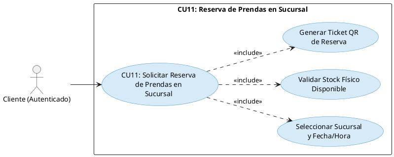
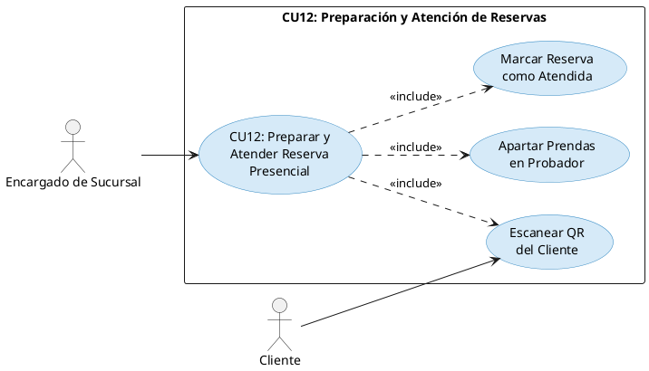
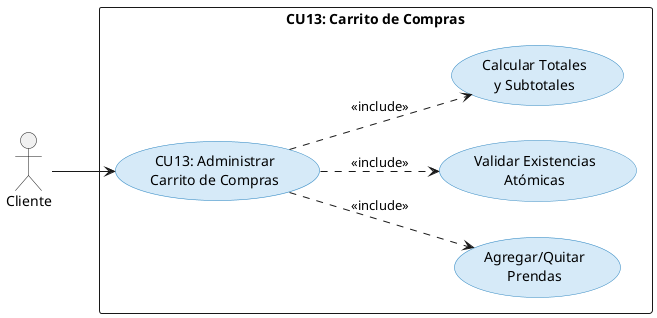
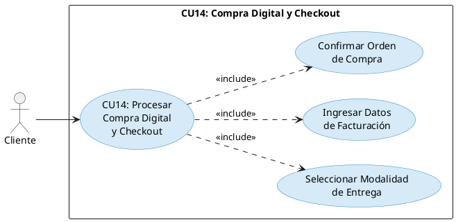
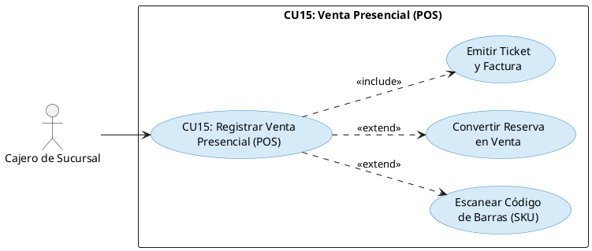
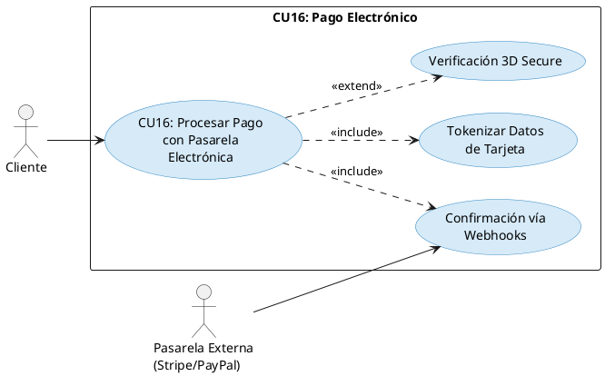
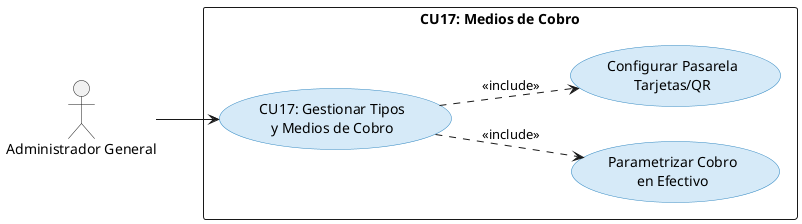
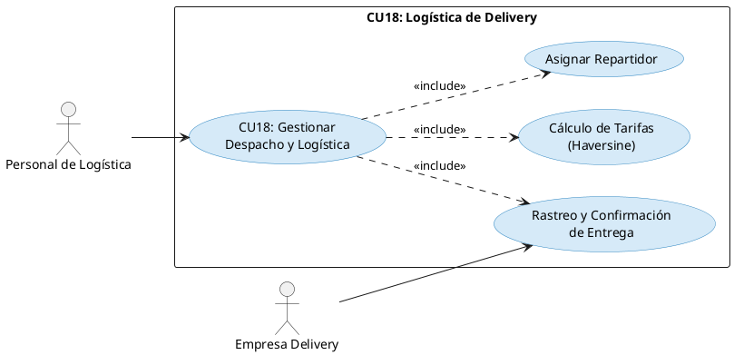
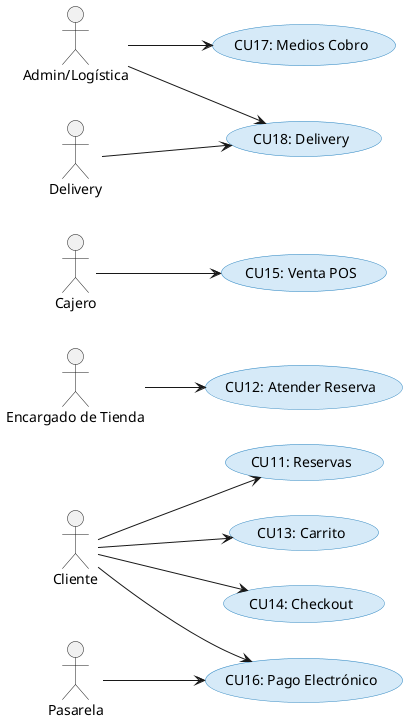

# Capitulo 1. Flujo de Trabajo: Captura de Requisitos (Ciclo 2)

## 1.1 Identificación de Casos de Uso y Actores

Para este segundo ciclo de desarrollo, nos enfocamos en la transaccionalidad comercial omnicanal y la logística, manteniendo a los actores definidos en el Ciclo 1 (Administrador General, Encargado de Sucursal, Cajero de Sucursal, Personal de Logística, Cliente Final, Pasarela de Pagos, Empresa de Delivery).

### 1.1.1 Lista de casos de uso del Ciclo 2

| Código CU | Nombre del Caso de Uso | Módulo Asociado | Actor(es) Principal(es) | Descripción Resumida |
|-----------|------------------------|-----------------|------------------------|---------------------|
| CU11 | Solicitar Reserva de Prendas en Sucursal | M10 | Cliente | Preselección de prendas, selección de sucursal física, programación de fecha/hora de visita y generación de ticket QR. *(Ciclo 2)* |
| CU12 | Preparar y Atender Reserva Presencial | M10 | Encargado de Sucursal | Apartado físico de prendas reservadas en probadores asignados y confirmación de llegada del cliente mediante escaneo de QR. *(Ciclo 2)* |
| CU13 | Administrar Carrito de Compras Omnicanal | M11 | Cliente | Incorporación, edición y cálculo automático de totales con validación atómica de existencias. *(Ciclo 2)* |
| CU14 | Procesar Compra Digital y Checkout | M12 | Cliente | Formalización de compra en línea con selección de modalidad de entrega (retiro en tienda o delivery) y facturación. *(Ciclo 2)* |
| CU15 | Registrar Venta Presencial en Caja (POS) | M13 | Cajero de Sucursal | Registro de venta en mostrador físico, lectura de códigos de barras, conversión de reservas en ventas y emisión de tickets. *(Ciclo 2)* |
| CU16 | Procesar Pago con Pasarela Electrónica | M14 | Pasarela Externa (Stripe/PayPal), Cliente | Ejecución segura de cobro digital con verificación 3D Secure y confirmación asíncrona mediante Webhooks. *(Ciclo 2)* |
| CU17 | Gestionar Tipos y Medios de Cobro | M15 | Administrador, Cajero | Parametrización de pagos en efectivo, tarjeta de débito/crédito y Códigos QR interoperables del BCB. *(Ciclo 2)* |
| CU18 | Gestionar Despacho y Logística de Delivery | M19 | Personal de Logística, Empresa Delivery | Cálculo de tarifas por Haversine y peso volumétrico, asignación de repartidores y rastreo de envíos en tiempo real. *(Ciclo 2)* |

---

## Priorizacion de casos de uso

## 1.2 Detalle de Casos de Uso y Prototipado de Interfaz de Usuario

### 1.2.1 Caso de Uso CU11: Solicitar Reserva de Prendas en Sucursal

#### a) Diseño del Caso de Uso (PlantUML)



#### b) Prototipo de Interfaz de Usuario (UI Wireframe)
Pantalla de reserva: Listado de prendas seleccionadas para reserva. Selector de sucursal con mapa. Selector de fecha y hora. Botón "Confirmar Reserva". Pantalla de confirmación con código QR generado y detalles de la reserva.

#### c) Tabla Detalle del Caso de Uso

| Atributo | Detalle de la Especificación |
|----------|------------------------------|
| Identificador | CU11 |
| Nombre | Solicitar Reserva de Prendas en Sucursal |
| Actores | Cliente. |
| Propósito | Permitir al cliente apartar prendas para probárselas físicamente en una sucursal. |
| Precondiciones | Cliente autenticado, prendas seleccionadas con stock en la sucursal. |
| Postcondiciones | Se crea el registro de reserva (estado: PENDIENTE), se descuenta el stock disponible temporalmente y se genera el código QR. |
| Flujo Principal | 1. El cliente inicia la reserva desde el catálogo o carrito. 2. Elige la sucursal, fecha y hora. 3. El sistema valida el stock. 4. El cliente confirma. 5. El sistema guarda la reserva y genera un QR. |

---

### 1.2.2 Caso de Uso CU12: Preparar y Atender Reserva Presencial

#### a) Diseño del Caso de Uso (PlantUML)



#### b) Prototipo de Interfaz de Usuario (UI Wireframe)
Panel del encargado: Lista de reservas del día (Pendientes, Preparadas, Atendidas). Botón "Escanear QR". Vista de detalles de reserva para asignación de probador.

#### c) Tabla Detalle del Caso de Uso

| Atributo | Detalle de la Especificación |
|----------|------------------------------|
| Identificador | CU12 |
| Nombre | Preparar y Atender Reserva Presencial |
| Actores | Encargado de Sucursal, Cliente. |
| Propósito | Gestionar el flujo físico de la reserva en tienda, desde la preparación hasta la llegada del cliente. |
| Precondiciones | Existen reservas pendientes para la sucursal del encargado. |
| Postcondiciones | La reserva cambia de estado a PREPARADA y luego a ATENDIDA o VENCIDA. |
| Flujo Principal | 1. El encargado revisa reservas pendientes. 2. Aparta físicamente las prendas (estado PREPARADA). 3. El cliente llega y muestra el QR. 4. El encargado escanea el QR. 5. El sistema marca la reserva como ATENDIDA. |

---

### 1.2.3 Caso de Uso CU13: Administrar Carrito de Compras Omnicanal

#### a) Diseño del Caso de Uso (PlantUML)



#### b) Prototipo de Interfaz de Usuario (UI Wireframe)
Vista lateral/completa del carrito: Lista de ítems con imagen, nombre, talla, color, cantidad (botones +/-), precio unitario, subtotal. Resumen de compra: Subtotal, Descuentos, Total estimado. Botones: "Seguir comprando", "Ir al Checkout".

#### c) Tabla Detalle del Caso de Uso

| Atributo | Detalle de la Especificación |
|----------|------------------------------|
| Identificador | CU13 |
| Nombre | Administrar Carrito de Compras Omnicanal |
| Actores | Cliente. |
| Propósito | Permitir al cliente gestionar los productos que desea adquirir antes de formalizar la compra. |
| Precondiciones | Cliente con sesión activa navegando por el catálogo. |
| Postcondiciones | El estado del carrito (ítems y cantidades) se guarda en la base de datos o sesión. |
| Flujo Principal | 1. El cliente añade productos desde el catálogo. 2. El sistema valida el stock. 3. El cliente abre el carrito y modifica cantidades. 4. El sistema recalcula el total dinámicamente. |

---

### 1.2.4 Caso de Uso CU14: Procesar Compra Digital y Checkout

#### a) Diseño del Caso de Uso (PlantUML)



#### b) Prototipo de Interfaz de Usuario (UI Wireframe)
Proceso guiado (Wizard) de 3 pasos: 1. Entrega (Selección de dirección para delivery o sucursal para retiro), 2. Facturación (Datos fiscales), 3. Pago (Redirección a CU16). Resumen del pedido siempre visible.

#### c) Tabla Detalle del Caso de Uso

| Atributo | Detalle de la Especificación |
|----------|------------------------------|
| Identificador | CU14 |
| Nombre | Procesar Compra Digital y Checkout |
| Actores | Cliente. |
| Propósito | Formalizar la intención de compra de los artículos del carrito, definiendo logística y facturación. |
| Precondiciones | Carrito con al menos un ítem, stock disponible, usuario autenticado. |
| Postcondiciones | Se genera una Orden de Venta en estado PENDIENTE_PAGO. |
| Flujo Principal | 1. El cliente inicia el checkout. 2. Elige método de entrega (Delivery o Retiro en Tienda). 3. Proporciona datos de facturación (NIT/CI). 4. Revisa el resumen y confirma. 5. Se crea la orden y se procede al pago. |

---

### 1.2.5 Caso de Uso CU15: Registrar Venta Presencial en Caja (POS)

#### a) Diseño del Caso de Uso (PlantUML)



#### b) Prototipo de Interfaz de Usuario (UI Wireframe)
Pantalla POS: Buscador de productos (texto/código de barras). Panel de ítems agregados (ticket virtual). Panel de cobro rápido (Efectivo, Tarjeta, QR). Opción "Cargar Reserva" mediante código. Botón "Finalizar Venta e Imprimir".

#### c) Tabla Detalle del Caso de Uso

| Atributo | Detalle de la Especificación |
|----------|------------------------------|
| Identificador | CU15 |
| Nombre | Registrar Venta Presencial en Caja (POS) |
| Actores | Cajero de Sucursal. |
| Propósito | Registrar la venta física en la tienda, actualizar el inventario y generar el comprobante fiscal. |
| Precondiciones | Cajero con turno abierto en la terminal POS. |
| Postcondiciones | Se genera la venta (estado: PAGADO), se descuenta el stock, se genera un asiento en Kardex y se emite la factura. |
| Flujo Principal | 1. El cajero agrega productos escaneando el código de barras o cargando una reserva previa. 2. Selecciona el método de pago (Efectivo). 3. Ingresa el monto recibido, sistema calcula cambio. 4. Confirma la venta. 5. El sistema procesa la transacción, baja stock, imprime ticket. |

---

### 1.2.6 Caso de Uso CU16: Procesar Pago con Pasarela Electrónica

#### a) Diseño del Caso de Uso (PlantUML)



#### b) Prototipo de Interfaz de Usuario (UI Wireframe)
Modal de pago integrado (Stripe Elements / Checkout): Formulario seguro para Número de tarjeta, Fecha de expiración, CVV. Botón "Pagar Monto X". Mensajes de estado (Procesando, Aprobado, Rechazado).

#### c) Tabla Detalle del Caso de Uso

| Atributo | Detalle de la Especificación |
|----------|------------------------------|
| Identificador | CU16 |
| Nombre | Procesar Pago con Pasarela Electrónica |
| Actores | Cliente, Pasarela Externa. |
| Propósito | Efectuar el cobro digital de una orden de venta de manera segura. |
| Precondiciones | Orden de venta en estado PENDIENTE_PAGO. |
| Postcondiciones | Transacción aprobada, orden cambia a PAGADO (y PREPARACION si es delivery). |
| Flujo Principal | 1. El cliente ingresa datos de tarjeta. 2. El sistema tokeniza los datos y los envía a la pasarela. 3. La pasarela procesa el cobro (puede pedir desafío 3D Secure). 4. La pasarela emite un Webhook de éxito al backend. 5. El sistema actualiza el estado de la orden y notifica al cliente. |

---

### 1.2.7 Caso de Uso CU17: Gestionar Tipos y Medios de Cobro

#### a) Diseño del Caso de Uso (PlantUML)



#### b) Prototipo de Interfaz de Usuario (UI Wireframe)
Panel administrativo: Lista de métodos de pago activos/inactivos (Efectivo, Tarjeta Crédito/Débito, Transferencia, QR Simple). Formularios de configuración con claves API y tokens de acceso para los métodos digitales.

#### c) Tabla Detalle del Caso de Uso

| Atributo | Detalle de la Especificación |
|----------|------------------------------|
| Identificador | CU17 |
| Nombre | Gestionar Tipos y Medios de Cobro |
| Actores | Administrador General. |
| Propósito | Habilitar y configurar los canales por los cuales la empresa acepta dinero. |
| Precondiciones | Usuario Administrador autenticado. |
| Postcondiciones | Los métodos de pago habilitados estarán disponibles en el Checkout web y en el POS físico. |
| Flujo Principal | 1. El Administrador accede a Configuración de Pagos. 2. Activa o desactiva métodos. 3. Para pasarelas (Stripe, QR), ingresa las credenciales API. 4. Guarda los cambios. |

---

### 1.2.8 Caso de Uso CU18: Gestionar Despacho y Logística de Delivery

#### a) Diseño del Caso de Uso (PlantUML)



#### b) Prototipo de Interfaz de Usuario (UI Wireframe)
Panel Logística: Tablero Kanban con órdenes (Por Empacar, Listo para Despacho, En Tránsito, Entregado). Vista de mapa con ubicación del cliente y sucursal de origen. Botón "Asignar Repartidor".

#### c) Tabla Detalle del Caso de Uso

| Atributo | Detalle de la Especificación |
|----------|------------------------------|
| Identificador | CU18 |
| Nombre | Gestionar Despacho y Logística de Delivery |
| Actores | Personal de Logística, Empresa de Delivery. |
| Propósito | Gestionar el ciclo de vida de entrega de un pedido a domicilio. |
| Precondiciones | Orden de venta pagada y marcada para delivery. |
| Postcondiciones | La orden se marca como ENTREGADA. |
| Flujo Principal | 1. Logística visualiza pedidos por preparar. 2. Empaca el pedido (estado LISTO_DESPACHO). 3. Asigna a un servicio de delivery. 4. El repartidor recoge (EN_TRANSITO). 5. El repartidor entrega y confirma en su sistema. 6. El sistema de FashionStore se actualiza a ENTREGADO vía API. |

---

## 1.3 Estructurar Modelo de Casos de Uso (Ciclo 2)

El modelo de casos de uso se expande integrando los paquetes de transaccionalidad.



---

# 2. Flujo de Trabajo: Análisis

## 2.1 Análisis de Arquitectura

Para el Ciclo 2, se integran nuevos paquetes orientados a la venta y logística.

### 2.1.1 Identificar Paquetes

- **Paquete 6: Reservas Presenciales (M10)**
  - Gestiona el apartado temporal de stock, generación de códigos QR y flujo de atención en sucursal.
- **Paquete 7: Venta Digital y Carrito (M11, M12)**
  - Controla el carrito de compras, cálculo de totales (impuestos, delivery) y formalización de órdenes web.
- **Paquete 8: Punto de Venta POS (M13)**
  - Maneja la caja física, emisión de comprobantes y conversión de reservas a ventas definitivas.
- **Paquete 9: Procesamiento de Pagos (M14, M15)**
  - Administra la integración con pasarelas (Stripe/PayPal), verificación de pagos y conciliación.
- **Paquete 10: Logística y Delivery (M19)**
  - Gestión de despachos, cálculo geoespacial de distancias y rastreo.

### 2.1.2 Relacionar paquetes y casos de uso

| Paquete de Análisis | Casos de Uso Contenidos | Actores Asociados |
|---------------------|------------------------|-------------------|
| P6: Reservas | CU11, CU12 | Cliente, Encargado |
| P7: Venta Digital | CU13, CU14 | Cliente |
| P8: Punto de Venta | CU15 | Cajero |
| P9: Pagos | CU16, CU17 | Cliente, Pasarela, Admin |
| P10: Logística | CU18 | Logística, Delivery |

---

# 3. Flujo de Trabajo: Diseño

## 3.1 Diseño de Datos Físico (Script DDL SQL en PostgreSQL - Extensiones Ciclo 2)

Se incorporan al esquema del Ciclo 1 las tablas necesarias para ventas y reservas:

```sql
-- Extensiones para Ciclo 2
CREATE TABLE reservas (
    id_reserva SERIAL PRIMARY KEY,
    id_usuario INTEGER NOT NULL REFERENCES usuarios(id_usuario),
    id_sucursal INTEGER NOT NULL REFERENCES sucursales(id_sucursal),
    codigo_qr VARCHAR(100) NOT NULL UNIQUE,
    fecha_visita TIMESTAMP NOT NULL,
    estado VARCHAR(30) DEFAULT 'PENDIENTE' CHECK (estado IN ('PENDIENTE', 'PREPARADA', 'ATENDIDA', 'VENCIDA', 'CANCELADA')),
    creado_en TIMESTAMP DEFAULT CURRENT_TIMESTAMP
);

CREATE TABLE reserva_detalles (
    id_reserva_detalle SERIAL PRIMARY KEY,
    id_reserva INTEGER NOT NULL REFERENCES reservas(id_reserva) ON DELETE CASCADE,
    id_producto INTEGER NOT NULL REFERENCES productos(id_producto),
    talla VARCHAR(20) NOT NULL,
    color VARCHAR(50) NOT NULL,
    cantidad INTEGER NOT NULL DEFAULT 1
);

CREATE TABLE ordenes_venta (
    id_orden SERIAL PRIMARY KEY,
    id_usuario INTEGER REFERENCES usuarios(id_usuario), -- NULL si es venta POS anónima
    id_sucursal INTEGER REFERENCES sucursales(id_sucursal), -- NULL si es venta digital puramente
    numero_factura VARCHAR(50),
    canal_venta VARCHAR(20) NOT NULL CHECK (canal_venta IN ('WEB', 'APP', 'POS')),
    modalidad_entrega VARCHAR(20) CHECK (modalidad_entrega IN ('DELIVERY', 'RETIRO_TIENDA', 'COMPRA_FISICA')),
    subtotal DECIMAL(10, 2) NOT NULL,
    costo_envio DECIMAL(10, 2) DEFAULT 0.00,
    total DECIMAL(10, 2) NOT NULL,
    estado_pago VARCHAR(20) DEFAULT 'PENDIENTE' CHECK (estado_pago IN ('PENDIENTE', 'PAGADO', 'RECHAZADO')),
    estado_logistica VARCHAR(30) DEFAULT 'CREADA' CHECK (estado_logistica IN ('CREADA', 'PREPARACION', 'LISTO_DESPACHO', 'EN_TRANSITO', 'ENTREGADA')),
    creado_en TIMESTAMP DEFAULT CURRENT_TIMESTAMP
);

CREATE TABLE ordenes_detalle (
    id_detalle_orden SERIAL PRIMARY KEY,
    id_orden INTEGER NOT NULL REFERENCES ordenes_venta(id_orden) ON DELETE CASCADE,
    id_producto INTEGER NOT NULL REFERENCES productos(id_producto),
    talla VARCHAR(20) NOT NULL,
    color VARCHAR(50) NOT NULL,
    cantidad INTEGER NOT NULL,
    precio_unitario DECIMAL(10, 2) NOT NULL,
    subtotal DECIMAL(10, 2) NOT NULL
);

CREATE TABLE transacciones_pago (
    id_transaccion SERIAL PRIMARY KEY,
    id_orden INTEGER NOT NULL REFERENCES ordenes_venta(id_orden),
    metodo_pago VARCHAR(50) NOT NULL,
    pasarela_referencia VARCHAR(100),
    monto DECIMAL(10, 2) NOT NULL,
    estado VARCHAR(20) NOT NULL,
    creado_en TIMESTAMP DEFAULT CURRENT_TIMESTAMP
);
```

---

# 4. Flujo de Trabajo: Implementación

## 4.1 Tecnologías Adicionales para Ciclo 2

- **Pasarela de Pagos:** Integración del SDK de Stripe / PayPal para el manejo del CU16 (Procesar Pago Electrónico).
- **Librería Generadora de QR:** `qrcode` en Python para la generación del ticket visual de reserva (CU11).
- **Fórmulas Geoespaciales:** Implementación de la fórmula de Haversine para el cálculo de distancia entre la sucursal y la dirección del cliente en CU18 (Delivery).

---

# 5. Flujo de Trabajo: Pruebas

## 5.1 Pruebas de Casos de Uso (Caja Negra)

### Prueba de caso de uso CU14: Procesar Compra Digital y Checkout

| Paso | Acción | Resultado esperado | Estado |
|------|--------|-------------------|--------|
| 1 | Cliente navega al carrito con ítems y presiona "Ir al Checkout". | Sistema valida stock y dirige a vista de checkout. | Satisfactorio |
| 2 | Cliente selecciona "Delivery" e ingresa dirección. | Sistema calcula el costo de envío usando Haversine y actualiza el total. | Satisfactorio |
| 3 | Cliente completa datos de facturación y presiona "Pagar". | Se crea la orden_venta (PENDIENTE) y se redirige a Stripe. | Satisfactorio |

### Prueba de caso de uso CU15: Venta Presencial (POS)

| Paso | Acción | Resultado esperado | Estado |
|------|--------|-------------------|--------|
| 1 | Cajero escanea SKU "SHIRT-SLIM-001". | El producto se añade al ticket virtual con precio y se suma al total. | Satisfactorio |
| 2 | Cajero procesa pago en efectivo. | El sistema genera la factura, descuenta stock de la tabla inventario y registra el movimiento de SALIDA en Kardex. | Satisfactorio |

---

# 6. Conclusiones y Recomendaciones

## 6.1 Conclusiones
El Ciclo 2 permite materializar el núcleo de generación de ingresos del sistema. Mediante la implementación del Checkout (CU14) y el POS (CU15), la arquitectura omnicanal propuesta se hace operativa, unificando el inventario para múltiples canales de venta, garantizando que el catálogo digital y el almacén físico estén perfectamente sincronizados.

## 6.2 Recomendaciones
Se recomienda escalar la base de datos para manejar el aumento de concurrencia al realizar bloqueos pesimistas (`SELECT ... FOR UPDATE`) en el momento exacto del pago para asegurar que el stock no sea sobrevendido en eventos de alta demanda. De cara al Ciclo 3, integrar la inteligencia artificial y realidad aumentada mejorará sustancialmente la experiencia del usuario.