# Capitulo 1. Flujo de Trabajo: Captura de Requisitos (Ciclo 2)

## 1.1 Identificación de Casos de Uso y Actores

Para este segundo ciclo de desarrollo, nos enfocamos en la transaccionalidad comercial omnicanal, el procesamiento seguro de cobros y la logística integral de entrega, manteniendo e interactuando con los actores definidos en el Ciclo 1:
- **Administrador General:** Configuración financiera de medios de cobro, auditoría y parametrización de pasarelas (CU17).
- **Encargado de Sucursal:** Preparación de probadores, apartado físico y validación presencial de reservas mediante QR (CU12).
- **Cajero de Sucursal:** Operación de la terminal de punto de venta físico POS, lectura de códigos de barras SKU, cobro multi-método y emisión de tickets (CU15).
- **Personal de Logística:** Gestión del empaque, asignación de despachos y administración de flota de repartidores (CU18).
- **Cliente Final (Autenticado / Visitante):** Gestión de reservas de probadores (CU11), administración del carrito omnicanal (CU13), checkout digital (CU14), pago electrónico con tarjeta (CU16) y seguimiento en vivo por GPS (CU18).
- **Pasarela Externa de Pagos (Stripe Sandbox):** Tokenización PCI-DSS de tarjetas, procesamiento con autenticación 3D Secure y confirmación asíncrona de cobro (CU16).
- **Repartidor / Empresa de Delivery:** Traslado físico del pedido, actualización geodésica y confirmación de entrega en destino (CU18).

---

### 1.1.1 Lista de casos de uso del Ciclo 2

| Código CU | Nombre del Caso de Uso | Módulo Asociado | Actor(es) Principal(es) | Descripción Resumida |
|-----------|------------------------|-----------------|------------------------|---------------------|
| **CU11** | Solicitar Reserva de Prendas en Sucursal | M10 - Reservas Omnicanal | Cliente Final | Preselección de prendas, selección de sucursal física, programación de fecha/hora de visita en zona horaria local (-04:00) y generación de ticket QR persistente. |
| **CU12** | Preparar y Atender Reserva Presencial | M10 - Reservas Omnicanal | Encargado de Sucursal, Cliente | Apartado físico de prendas reservadas en probador asignado (estado PREPARADA), validación presencial mediante escaneo de ticket QR y cambio a ATENDIDA. |
| **CU13** | Administrar Carrito de Compras Omnicanal | M11 - Carrito y Bolsa | Cliente Final | Incorporación dinámica de prendas, selección de talla/color, edición reactiva de cantidades (+/-), persistencia atómica en base de datos y validación de existencias. |
| **CU14** | Procesar Compra Digital y Checkout | M12 - Órdenes y Facturación | Cliente Final | Wizard de checkout guiado en 3 pasos: logística de entrega (retiro en tienda gratuito o delivery con cotización Haversine), facturación fiscal (NIT/CI) y emisión de orden. |
| **CU15** | Registrar Venta Presencial en Caja (POS) | M13 - Terminal Punto de Venta | Cajero de Sucursal | Facturación en mostrador, escaneo de códigos de barra SKU, selector interactivo de variantes con ajuste dinámico de precio por talla/cantidad, cobro multi-método y emisión de ticket. |
| **CU16** | Procesar Pago con Pasarela Electrónica | M14 - Pagos Electrónicos | Pasarela Externa (Stripe), Cliente | Ejecución segura de cobro digital con Stripe Elements, tokenización PCI-DSS sin almacenamiento de CVV/PAN, verificación 3D Secure y confirmación de orden pagada. |
| **CU17** | Gestionar Tipos y Medios de Cobro | M15 - Configuración Financiera | Administrador General | Activación/desactivación en tiempo real (Toggle Switches) y parametrización de credenciales (API Keys, Secretos con revelación por icono de ojo) para Efectivo, POS, Stripe y QR BCB. |
| **CU18** | Gestionar Despacho y Logística de Delivery | M19 - Logística y Despacho | Personal de Logística, Repartidor, Cliente | Máquina de estados finita (CREADA -> PREPARACION -> LISTO_DESPACHO -> EN_TRANSITO -> ENTREGADA), asignación de repartidor, cálculo geodésico Haversine y tracking GPS en vivo. |

---

## Priorizacion de casos de uso

La priorización de los casos de uso para el Ciclo 2 responde a una estrategia de mitigación de riesgos técnicos (procesamiento de pagos, control de concurrencia y geolocalización) y a la generación directa de valor transaccional para el negocio:

| Caso de Uso | Prioridad | Riesgo Técnico | Valor para el Negocio | Justificación de Priorización |
|-------------|-----------|----------------|-----------------------|-------------------------------|
| **CU13 - Carrito Omnicanal** | **Alta** | Medio | Muy Alto | Es la puerta de entrada indispensable para cualquier transacción digital de e-commerce. |
| **CU14 - Checkout Digital** | **Alta** | Alto | Crítico | Consolida la intención de compra formalizando la orden de venta fiscal y logística. |
| **CU16 - Pagos con Stripe** | **Alta** | Muy Alto | Crítico | Habilita la recaudación monetaria efectiva con cumplimiento de estándares de seguridad PCI. |
| **CU15 - Venta en Caja POS** | **Alta** | Medio | Muy Alto | Garantiza la recaudación en los puntos físicos de venta e interconecta con reservas presenciales. |
| **CU11 - Reservas en Sucursal** | **Media-Alta** | Medio | Alto | Diferenciador omnicanal fundamental para probar prendas antes de adquirirlas. |
| **CU12 - Atender Reserva Presencial** | **Media-Alta** | Bajo | Alto | Cierra el ciclo físico de la reserva asegurando atención personalizada en tienda. |
| **CU18 - Logística y Delivery** | **Media** | Alto | Alto | Entrega domiciliaria y visibilidad de seguimiento en tiempo real con trazabilidad GPS. |
| **CU17 - Medios de Cobro** | **Media** | Medio | Medio | Flexibilidad operativa para habilitar/deshabilitar métodos de cobro en contingencias o mantenimiento. |

---

## 1.2 Detalle de Casos de Uso y Prototipado de Interfaz de Usuario

### 1.2.1 Caso de Uso CU11: Solicitar Reserva de Prendas en Sucursal

#### a) Diseño del Caso de Uso (PlantUML)

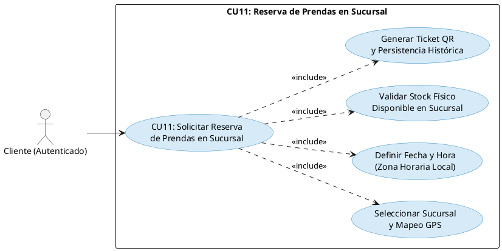

#### b) Prototipo de Interfaz de Usuario (UI Wireframe)
- **Pantalla de Reserva (`/reservar`):**
  - Selector dinámico de sucursales con dirección, ciudad y capacidad de probadores inteligentes. El usuario debe elegir explícitamente la sucursal (sin asignaciones forzadas por defecto).
  - Selector de fecha de visita y hora programada respetando la zona horaria local (-04:00 Bolivia).
  - Catálogo de prendas seleccionadas con confirmación de stock físico en la sucursal elegida.
  - Botón de acción: "Confirmar y Generar Ticket QR de Reserva".
- **Pantalla de Tickets de Reserva (`/mis-tickets`):**
  - Historial completo y acumulativo de tickets generados por el cliente (no solo el último generado).
  - Visualización del código QR generado en formato Base64 Data URI y código de verificación alfanumérico legible (`qr_texto`).
  - Botones de acción: Descargar Ticket y Enviar a WhatsApp.

#### c) Tabla Detalle del Caso de Uso

| Atributo | Detalle de la Especificación |
|----------|------------------------------|
| **Identificador** | CU11 |
| **Nombre** | Solicitar Reserva de Prendas en Sucursal |
| **Actores** | Cliente Final (Autenticado). |
| **Propósito** | Permitir al cliente apartar prendas para probárselas físicamente en una sucursal física determinada en un horario específico. |
| **Precondiciones** | Cliente con sesión activa (JWT); prendas seleccionadas con existencias físicas en la sucursal destino. |
| **Postcondiciones** | Se registra la entidad `Reserva` (estado: `PENDIENTE`), se asocian sus `ReservaDetalle`, se genera la imagen QR con token único y el ticket se guarda en el historial del cliente. |
| **Flujo Principal** | 1. El cliente accede al módulo de reservas desde el catálogo o la barra de navegación.<br>2. Elige la sucursal física de su preferencia.<br>3. Define la fecha y hora estimada de visita respetando el huso horario local.<br>4. El sistema valida la disponibilidad de stock en dicha sucursal.<br>5. El cliente confirma la operación.<br>6. El backend persiste la reserva, genera el código QR y devuelve el identificador al frontend.<br>7. El cliente visualiza su ticket en "Mis Tickets QR" con opción a consultarlo en cualquier momento. |

---

### 1.2.2 Caso de Uso CU12: Preparar y Atender Reserva Presencial

#### a) Diseño del Caso de Uso (PlantUML)

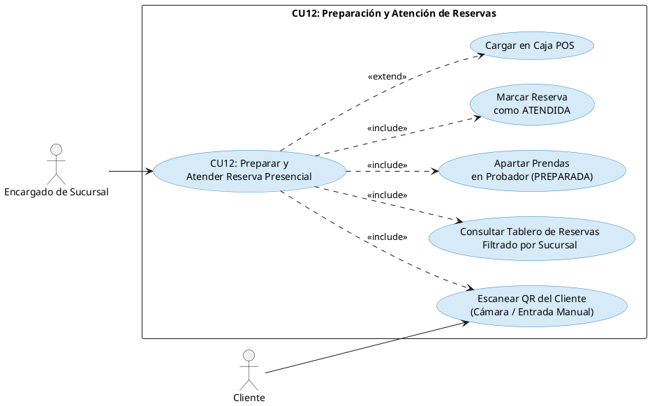

#### b) Prototipo de Interfaz de Usuario (UI Wireframe)
- **Tablero del Encargado (`/encargado/reservas`):**
  - Filtro estricto por la sucursal asignada al encargado (`id_sucursal`).
  - Métricas rápidas: Total del Día, Pendientes de Preparación, Listas en Probador y Atendidas.
  - Tarjetas de reserva con prendas, tallas, colores y datos de contacto del cliente.
  - Botón "Apartar en Probador" para transicionar el estado a `PREPARADA`.
  - Módulo de escaneo interactivo de código QR con soporte para cámara web/móvil y entrada manual del token (`qr_texto`).
  - Confirmación inmediata con alerta y botón de acceso rápido para "Facturar en Caja POS (CU15)".

#### c) Tabla Detalle del Caso de Uso

| Atributo | Detalle de la Especificación |
|----------|------------------------------|
| **Identificador** | CU12 |
| **Nombre** | Preparar y Atender Reserva Presencial |
| **Actores** | Encargado de Sucursal, Cliente Final. |
| **Propósito** | Gestionar el ciclo de vida físico de la reserva en tienda, desde el apartado físico de prendas en probadores hasta la llegada y confirmación presencial del cliente. |
| **Precondiciones** | El encargado cuenta con rol `ENCARGADO_SUCURSAL` o `ADMINISTRADOR` y sucursal física asignada; existen reservas asociadas a dicha tienda. |
| **Postcondiciones** | La reserva cambia de estado a `PREPARADA` al apartarse en probador y a `ATENDIDA` tras la lectura exitosa del QR, quedando lista para su facturación en mostrador. |
| **Flujo Principal** | 1. El encargado ingresa a su tablero operativo de reservas.<br>2. Consulta las reservas en estado `PENDIENTE`.<br>3. Aparta las prendas en el probador inteligente y presiona "Apartar en Probador" (estado cambia a `PREPARADA`).<br>4. El cliente se presenta en tienda y muestra su ticket QR desde su teléfono móvil.<br>5. El encargado activa el lector de QR o digita el código alfanumérico.<br>6. El sistema valida la pertenencia de la reserva a esa sucursal y la marca como `ATENDIDA`.<br>7. El encargado puede derivar las prendas al cajero de mostrador para venta directa en POS. |

---

### 1.2.3 Caso de Uso CU13: Administrar Carrito de Compras Omnicanal

#### a) Diseño del Caso de Uso (PlantUML)

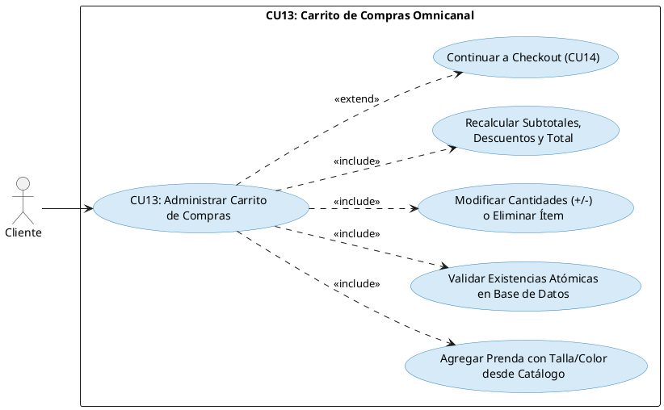

#### b) Prototipo de Interfaz de Usuario (UI Wireframe)
- **Gaveta Lateral Desplegable (Cart Drawer):**
  - Acceso instantáneo desde cualquier vista mediante el icono de bolsa en la barra superior con badge numérico reactivo.
  - Listado de ítems con imagen en miniatura, SKU base, nombre del producto, talla seleccionada, color y precio unitario.
  - Controles incrementales interactivos (`+` / `-`) con bloqueo automático al alcanzar el stock físico máximo disponible.
  - Botón de eliminación directa por ítem con animación suave.
  - Resumen financiero en el pie del carrito: Subtotal en Bs., costo de envío preliminar y Total.
  - Botón de llamada a la acción: "Proceder al Pago (Checkout) -> CU14".

#### c) Tabla Detalle del Caso de Uso

| Atributo | Detalle de la Especificación |
|----------|------------------------------|
| **Identificador** | CU13 |
| **Nombre** | Administrar Carrito de Compras Omnicanal |
| **Actores** | Cliente Final. |
| **Propósito** | Permitir al cliente acumular y modificar los artículos que desea comprar en línea antes de emitir la orden formal. |
| **Precondiciones** | Cliente autenticado navegando por el catálogo de prendas; existencias disponibles en inventario. |
| **Postcondiciones** | La bolsa de compras se almacena de forma persistente en la tabla `carritos` y `carrito_items`, asegurando que no se pierda al recargar la página. |
| **Flujo Principal** | 1. El cliente selecciona una prenda, escoge talla y color, y presiona "Añadir a la Bolsa".<br>2. El sistema envía una petición HTTP atómica al backend validando existencias.<br>3. El carrito se actualiza y la gaveta lateral se despliega automáticamente confirmando la adición.<br>4. El cliente puede modificar cantidades o remover prendas.<br>5. El total se recalcula dinámicamente.<br>6. El cliente hace clic en "Proceder al Pago" para iniciar el checkout (CU14). |

---

### 1.2.4 Caso de Uso CU14: Procesar Compra Digital y Checkout

#### a) Diseño del Caso de Uso (PlantUML)

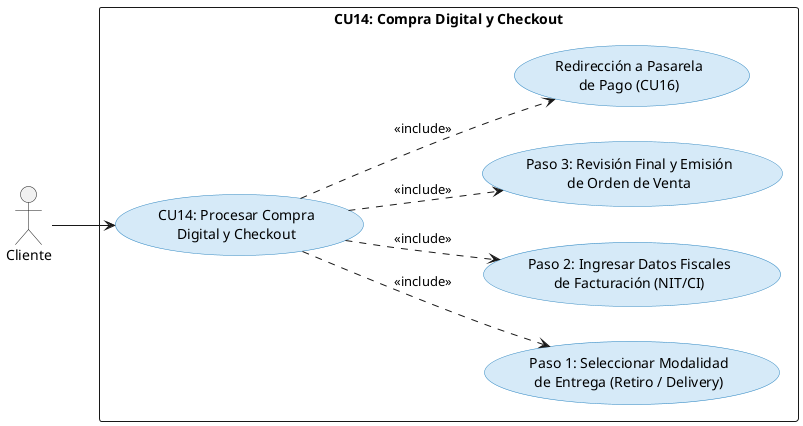

#### b) Prototipo de Interfaz de Usuario (UI Wireframe)
- **Flujo Guiado Wizard (`/checkout`):**
  - **Paso 1 (Logística de Entrega):** Pestañas para elegir entre "Retiro Gratuito en Sucursal" (con selector de tienda) o "Envío a Domicilio / Delivery" (con dirección, teléfono y cálculo de tarifa por geolocalización Haversine).
  - **Paso 2 (Facturación Fiscal):** Formulario para NIT o Carnet de Identidad y Razón Social, con opción rápida de "Usar mis datos de usuario registrado".
  - **Paso 3 (Revisión Final):** Cuadro de mando resumen con lista de prendas, desglose financiero (Subtotal, Costo de Envío y Total en Bs.) y botón "Confirmar Orden y Proceder al Pago".
- **Pantalla de Confirmación (`/checkout/confirmacion/:id`):** Resumen visual de la orden recién creada con número correlativo oficial y enlace directo a la pasarela electrónica de pago (`/pagos/orden/:id`).

#### c) Tabla Detalle del Caso de Uso

| Atributo | Detalle de la Especificación |
|----------|------------------------------|
| **Identificador** | CU14 |
| **Nombre** | Procesar Compra Digital y Checkout |
| **Actores** | Cliente Final. |
| **Propósito** | Formalizar los términos logísticos y fiscales de la compra, generando la orden de venta definitiva en base de datos. |
| **Precondiciones** | Carrito con al menos un ítem activo; usuario autenticado. |
| **Postcondiciones** | Se crea el registro en `ordenes_venta` con número correlativo único (estado: `PENDIENTE_PAGO`), se asocian sus `ordenes_detalle`, se vacía el carrito y se deriva a la pasarela de pago. |
| **Flujo Principal** | 1. El cliente accede al checkout desde la bolsa de compras.<br>2. Selecciona la modalidad de entrega (Retiro en Sucursal o Delivery a Domicilio).<br>3. Proporciona o valida sus datos de facturación fiscal (NIT/CI y Razón Social).<br>4. Revisa el resumen financiero consolidado.<br>5. Presiona "Confirmar Orden y Proceder al Pago".<br>6. El backend genera la orden de venta y el frontend redirige a la pasarela electrónica Stripe (CU16). |

---

### 1.2.5 Caso de Uso CU15: Registrar Venta Presencial en Caja (POS)

#### a) Diseño del Caso de Uso (PlantUML)

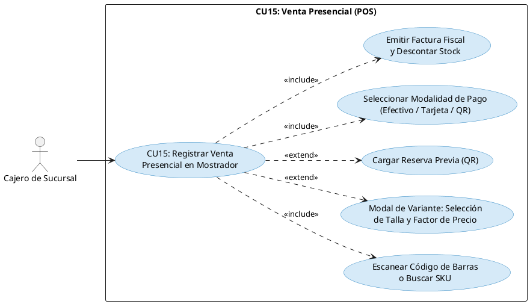

#### b) Prototipo de Interfaz de Usuario (UI Wireframe)
- **Terminal Punto de Venta (`/caja/pos` o `/pos`):**
  - **Barra Superior:** Identificador de sucursal física, cajero activo en turno y estado de caja abierta.
  - **Catálogo de Prendas Disponibles en Sucursal:** Cuadrícula compacta y estética (tarjetas de altura estandarizada de 230px, sin deformaciones alargadas ni fideos verticales) con renderizado instantáneo desde el primer segundo gracias a detección de cambios forzada.
  - **Modal de Selección de Variante y Precios Dinámicos:**
    - Selector interactivo de tallas con factores de ajuste porcentual visibles (S: -5%, M: Base, L: +5%, XL: +10%, XXL: +15%).
    - Controles de cantidad con recálculo dinámico en tiempo real del precio unitario y del subtotal acumulado antes de agregar al ticket.
  - **Ticket Virtual de Mostrador:** Listado de ítems con botones rápidos (+ / - / eliminar), subtotal, total en Bs., datos del cliente (NIT/CI, Razón Social o "Cliente Mostrador").
  - **Módulo de Pago Rápido:** Selección entre Efectivo (con atajos de billetes de Bs. 50, 100, 200 y cálculo automático de cambio a devolver), Tarjeta POS o QR Simple BCB.
  - **Impresión de Ticket Fiscal:** Modal de comprobante térmico con datos fiscales, detalle de prendas, firma de cajero y botón de impresión directa.

#### c) Tabla Detalle del Caso de Uso

| Atributo | Detalle de la Especificación |
|----------|------------------------------|
| **Identificador** | CU15 |
| **Nombre** | Registrar Venta Presencial en Caja (POS) |
| **Actores** | Cajero de Sucursal, Administrador. |
| **Propósito** | Cobrar y registrar ventas en mostrador físico, soportando escaneo de productos, conversión de reservas presenciales, recálculo dinámico de precios por talla y descuento en Kardex. |
| **Precondiciones** | Cajero autenticado con turno activo; inventario físico en la sucursal. |
| **Postcondiciones** | Se registra la venta como orden facturada en estado `PAGADO`, se emite el ticket fiscal, se descuenta el stock físico en la sucursal y se asienta el movimiento en Kardex. |
| **Flujo Principal** | 1. El cajero visualiza el catálogo de prendas o escanea un código de barras.<br>2. Al pulsar una prenda, se despliega el modal de variantes donde selecciona talla y cantidad, recalculándose el precio unitario y subtotal al instante.<br>3. Presiona "Agregar al Ticket".<br>4. Opcionalmente, ingresa el código QR de una reserva previa (CU12) para cargar sus ítems al ticket.<br>5. Ingresa NIT/CI del cliente o selecciona "Cliente Mostrador".<br>6. Elige método de pago (si es Efectivo, ingresa el dinero recibido y el sistema calcula el vuelto).<br>7. Presiona "Cobrar e Imprimir Ticket".<br>8. El sistema descuenta el stock, asienta la transacción y despliega el ticket fiscal listo para imprimir. |

---

### 1.2.6 Caso de Uso CU16: Procesar Pago con Pasarela Electrónica

#### a) Diseño del Caso de Uso (PlantUML)

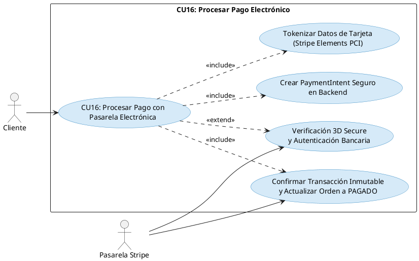

#### b) Prototipo de Interfaz de Usuario (UI Wireframe)
- **Pantalla de Cobro Seguro (`/pagos/orden/:id`):**
  - Columna izquierda: Resumen completo de la orden con prendas, tallas, colores, subtotal, costo de envío y total a pagar en Bs.
  - Columna derecha: Formulario embebido Stripe Elements estilizado en tema oscuro con validación en tiempo real del número de tarjeta, fecha de vencimiento (MM/AA) y código CVC.
  - Campo de Nombre del Titular de la Tarjeta.
  - Botón interactivo: "Pagar Bs. X.XX con Tarjeta".
  - Pantalla de éxito post-pago: Resumen con ID de transacción Stripe, últimos 4 dígitos de la tarjeta, fecha/hora y botón directo para **"Ver Seguimiento (CU18)"**.

#### c) Tabla Detalle del Caso de Uso

| Atributo | Detalle de la Especificación |
|----------|------------------------------|
| **Identificador** | CU16 |
| **Nombre** | Procesar Pago con Pasarela Electrónica |
| **Actores** | Cliente Final, Pasarela Externa (Stripe Sandbox). |
| **Propósito** | Realizar el cobro electrónico de una orden de venta de forma segura y tokenizada bajo estándares PCI-DSS. |
| **Precondiciones** | Orden de venta en estado `PENDIENTE_PAGO`; método Stripe habilitado en CU17. |
| **Postcondiciones** | Se registra la transacción inmutable en `transacciones_pago`, la orden transiciona a `PAGADO` y su estado logístico avanza a `PREPARACION`. |
| **Flujo Principal** | 1. El cliente es derivado a la pantalla de pago de su orden.<br>2. El backend genera un `PaymentIntent` contra la API de Stripe en centavos y devuelve el `client_secret`.<br>3. El cliente ingresa los datos de su tarjeta mediante los elementos seguros de Stripe.<br>4. El frontend envía los datos directamente a Stripe para tokenización sin tocar el servidor de FashionStore.<br>5. Si se requiere, se ejecuta el desafío bancario 3D Secure.<br>6. Al confirmarse el cobro, el backend asienta la transacción inmutable en la base de datos.<br>7. El cliente visualiza la pantalla de confirmación con enlace directo al tracking en vivo (CU18). |

---

### 1.2.7 Caso de Uso CU17: Gestionar Tipos y Medios de Cobro

#### a) Diseño del Caso de Uso (PlantUML)

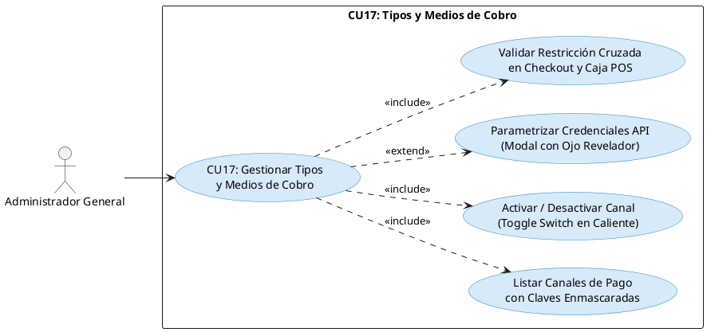

#### b) Prototipo de Interfaz de Usuario (UI Wireframe)
- **Panel Administrativo (`/admin/pagos-config`):**
  - **Métricas Superiores:** Total de Canales Registrados, Canales Habilitados, Pasarelas Digitales y Canales Físicos.
  - **Cuadrícula de Canales:** Tarjetas para:
    1. `EFECTIVO` (Efectivo en Caja Mostrador - Físico).
    2. `TARJETA_POS` (Terminal POS / Tarjeta Física - Físico).
    3. `STRIPE` (Pasarela Digital Stripe - Digital Online).
    4. `QR_BCB` (Código QR Simple BCB - Omnicanal Interoperable).
  - **Controles por Tarjeta:**
    - Interruptor tipo iOS (Toggle Switch) para encender/apagar en tiempo real con confirmación Toast inmediata.
    - Bloque de parámetros de integración con valores enmascarados de seguridad (`sk_test_****dXFK`).
    - Botón "⚙️ Configurar" para abrir el modal de parametrización.
  - **Modal de Credenciales:** Formulario reactivo con campos de tipo password e icono de ojo (👁️) para alternar visibilidad de claves secretas. Guardado idempotente: si no se modifican los asteriscos, se preserva el secreto original en el backend.

#### c) Tabla Detalle del Caso de Uso

| Atributo | Detalle de la Especificación |
|----------|------------------------------|
| **Identificador** | CU17 |
| **Nombre** | Gestionar Tipos y Medios de Cobro |
| **Actores** | Administrador General. |
| **Propósito** | Activar, desactivar y parametrizar los canales por los cuales la empresa recauda dinero, afectando en tiempo real al Checkout web y al POS. |
| **Precondiciones** | Usuario autenticado con rol `ADMINISTRADOR`. |
| **Postcondiciones** | Se actualiza la tabla `metodos_pago`; las pasarelas desactivadas son rechazadas inmediatamente en el Checkout (CU14/CU16) y en la Caja POS (CU15). |
| **Flujo Principal** | 1. El Administrador accede al módulo de Configuración Financiera (CU17).<br>2. Visualiza el estado operativo y métricas de todos los canales.<br>3. Activa o desactiva un canal mediante el Toggle Switch (el backend aplica un `PATCH` inmediato).<br>4. Si requiere actualizar llaves (ej. Stripe API Keys), presiona "Configurar".<br>5. El modal permite visualizar u ocultar claves sensibles mediante el icono de ojo.<br>6. El Administrador guarda los cambios; el backend persiste los parámetros y actualiza el cliente de Stripe en caliente sin reiniciar el servidor. |

---

### 1.2.8 Caso de Uso CU18: Gestionar Despacho y Logística de Delivery

#### a) Diseño del Caso de Uso (PlantUML)

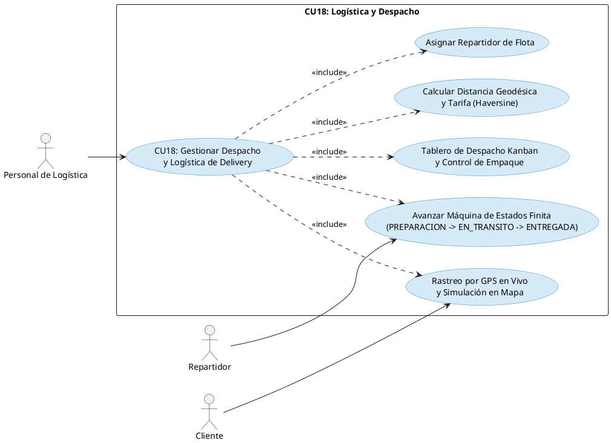

#### b) Prototipo de Interfaz de Usuario (UI Wireframe)
- **Tablero Logístico (`/logistica/dashboard`):**
  - Filtro por estado: `CREADA`, `PREPARACION`, `LISTO_DESPACHO`, `EN_TRANSITO`, `ENTREGADA`.
  - Lista de órdenes pagadas con detalle de prendas para empaque físico.
  - Selector para asignar chofer/repartidor con nombre y teléfono.
  - Botones de transición respetando la máquina de estados finita (emite HTTP 409 si se intenta un salto no permitido).
- **Pantalla de Seguimiento en Vivo (`/tracking/:id`):**
  - Cabecera con número de factura, cliente y fecha estimada.
  - Stepper visual de 4 etapas: **1. Orden Confirmada**, **2. En Preparación**, **3. En Camino**, **4. Entregada**.
  - Tarjeta de Repartidor Asignado con fotografía, nombre, teléfono y vehículo.
  - Tarjeta de Destino con coordenadas GPS (latitud/longitud) y dirección exacta.
  - Botón interactivo de simulación "Avanzar Estado" para demostración y evaluación académica en vivo.

#### c) Tabla Detalle del Caso de Uso

| Atributo | Detalle de la Especificación |
|----------|------------------------------|
| **Identificador** | CU18 |
| **Nombre** | Gestionar Despacho y Logística de Delivery |
| **Actores** | Personal de Logística, Repartidor, Cliente Final. |
| **Propósito** | Coordinar el empaque, la asignación de choferes, el despacho físico y el seguimiento satelital de pedidos a domicilio. |
| **Precondiciones** | Orden de venta en estado `PAGADO` con modalidad de entrega `DELIVERY`. |
| **Postcondiciones** | La orden transiciona a `ENTREGADA` y se asientan las coordenadas y tiempos de despacho. |
| **Flujo Principal** | 1. Logística recibe la orden pagada en estado `CREADA` o `PREPARACION`.<br>2. Se verifica el empaque de prendas y avanza a `LISTO_DESPACHO`.<br>3. Se asigna un repartidor disponible con sus datos de contacto.<br>4. El pedido pasa a `EN_TRANSITO`.<br>5. El cliente accede a `/tracking/:id` y visualiza la progresión del envío con mapa geodésico y datos del chofer.<br>6. El repartidor entrega el paquete y el pedido concluye en estado `ENTREGADA`. |

---

## 1.3 Estructurar Modelo de Casos de Uso (Ciclo 1 + Ciclo 2)

El modelo global integra y consolida la totalidad de los **18 casos de uso** que estructuran el sistema a lo largo del Ciclo 1 y Ciclo 2 en perfecta sincronía con todos los actores del sistema:

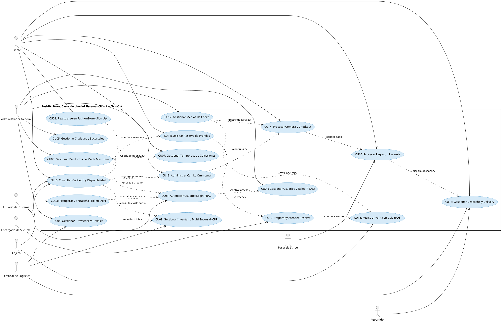

---

# 2. Flujo de Trabajo: Análisis

## 2.1 Análisis de Arquitectura

Para el Ciclo 2, la arquitectura en 3 capas se fortalece con módulos transaccionales desacoplados y servicios altamente cohesivos.

### 2.1.1 Identificar Paquetes

- **Paquete 6: Reservas Presenciales (M10):** Gestión del ciclo de vida de visitas físicas a probadores, asignación de tienda y verificación por ticket QR (CU11, CU12).
- **Paquete 7: Venta Digital y Carrito (M11, M12):** Administración de la bolsa de compras persistente, cálculo atómico de importes y formalización del checkout guiado (CU13, CU14).
- **Paquete 8: Punto de Venta POS (M13):** Facturación en mostrador físico, lectura de códigos de barras, conversión de reservas presenciales a ventas y recálculo dinámico de precios por talla (CU15).
- **Paquete 9: Procesamiento de Pagos (M14, M15):** Integración con Stripe SDK (PaymentIntents, 3DS) y panel de configuración de medios de cobro con llaves enmascaradas (CU16, CU17).
- **Paquete 10: Logística y Delivery (M19):** Máquina de estados finita de envíos, asignación de choferes, cálculo de tarifas Haversine y rastreo satelital en vivo (CU18).

### 2.1.2 Relacionar paquetes y casos de uso

| Paquete de Análisis | Casos de Uso Contenidos | Actores Asociados | Módulo Backend | Módulo Frontend |
|---------------------|------------------------|-------------------|----------------|-----------------|
| **P6: Reservas** | CU11, CU12 | Cliente, Encargado de Sucursal | `app.modules.reservas` | `app/pages/reservas`, `app/pages/encargado-dashboard` |
| **P7: Venta Digital** | CU13, CU14 | Cliente Final | `app.modules.carrito`, `app.modules.ordenes` | `app/shared/carrito-sidebar`, `app/pages/checkout` |
| **P8: Punto de Venta** | CU15 | Cajero, Administrador | `app.modules.pos` | `app/pages/pos` |
| **P9: Pagos y Finanzas** | CU16, CU17 | Cliente, Pasarela Stripe, Admin | `app.modules.pagos` | `app/pages/pagos`, `app/pages/admin-pagos` |
| **P10: Logística** | CU18 | Personal Logística, Delivery, Cliente | `app.modules.logistica` | `app/pages/logistica`, `app/pages/tracking` |

A continuación se presenta el diagrama UML de **Relación entre Paquetes y Casos de Uso** del Ciclo 2:


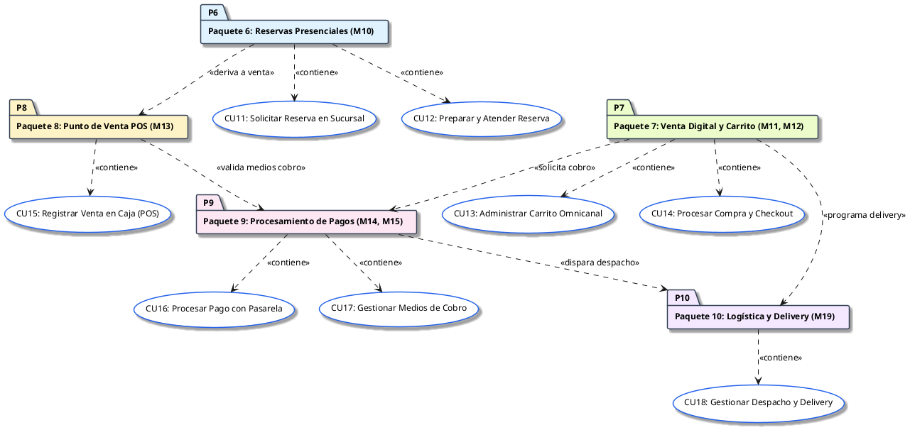

---

### 2.1.3 Vista de casos de uso

En la metodología PUDS y el modelado arquitectónico UML, la **Vista de Casos de Uso** representa a los paquetes vistos desde su interior: **el entorno/frontera exterior es el propio paquete contenedor y dentro de él residen los diagramas de casos de uso que dicho paquete contiene**, junto con sus relaciones funcionales internas (`<<include>>`, `<<extend>>`) y la conexión con los **Actores** que interactúan con ellos desde fuera del paquete.

A continuación, se presenta el diagrama consolidado de la **Vista de Casos de Uso por Paquete (Ciclo 2)**:


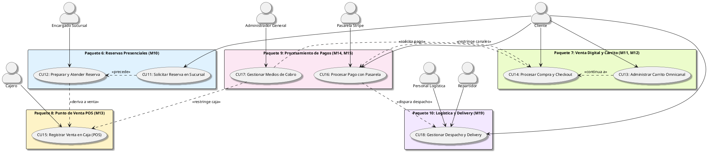

Asimismo, se detallan las vistas internas individuales de cada uno de los 5 paquetes del ciclo:

#### 2.1.3.1 Vista Interna - Paquete 6: Reservas Presenciales (M10)

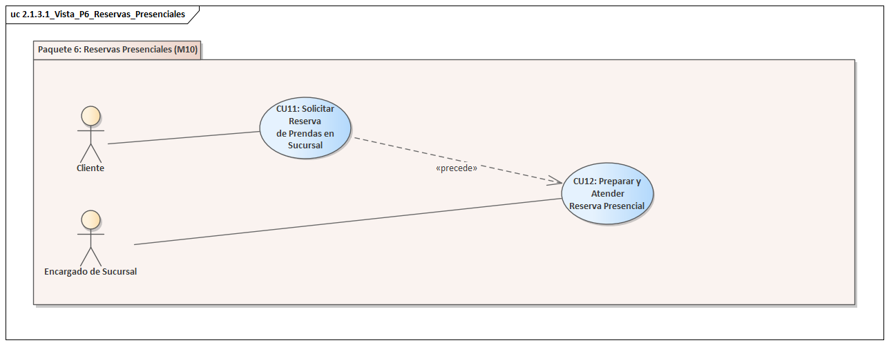

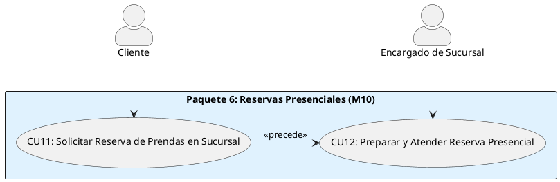

#### 2.1.3.2 Vista Interna - Paquete 7: Venta Digital y Carrito (M11, M12)

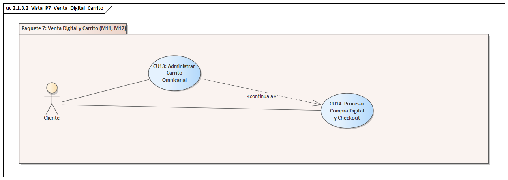

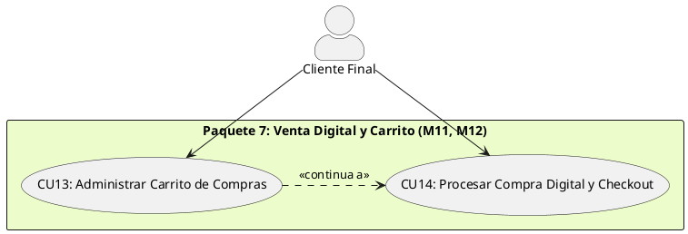

#### 2.1.3.3 Vista Interna - Paquete 8: Punto de Venta POS (M13)

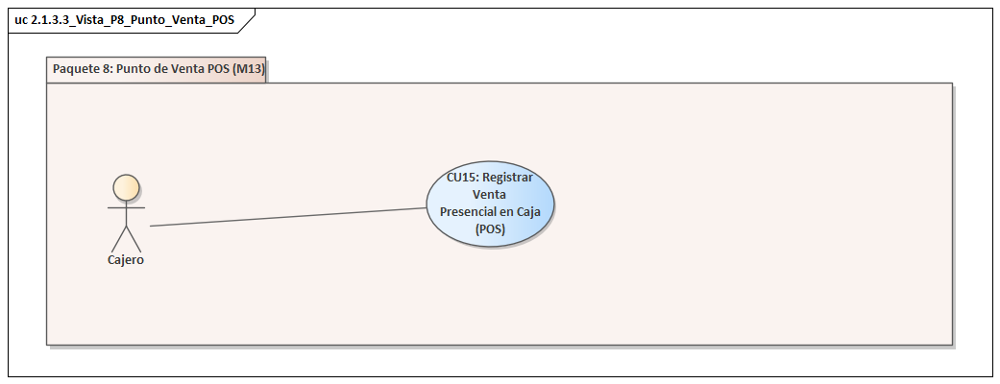

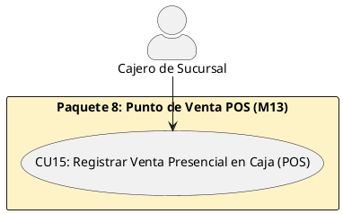

#### 2.1.3.4 Vista Interna - Paquete 9: Procesamiento de Pagos (M14, M15)

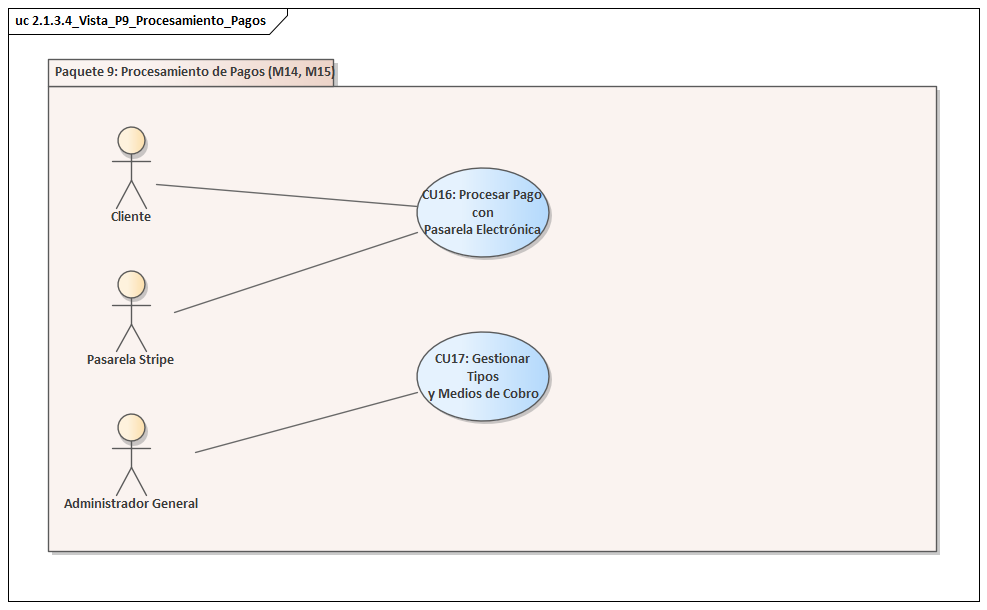

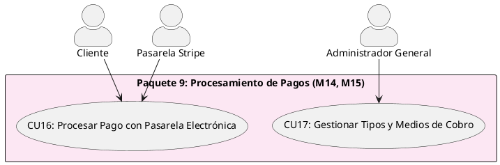

#### 2.1.3.5 Vista Interna - Paquete 10: Logística y Delivery (M19)

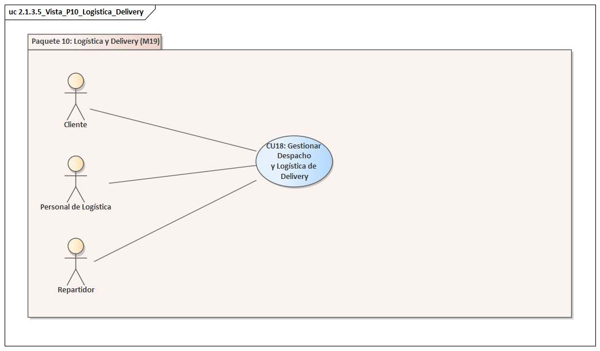

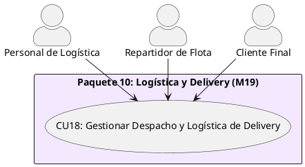

---

## 2.2 Analizar Casos de Uso (Diagramas de Comunicación UML)

A continuación se presentan los **Diagramas de Comunicación UML** para cada uno de los 8 Casos de Uso del Ciclo 2 (**CU11 al CU18**). Conforme a las directrices de la cátedra expresadas en clase (`B4.txt`), cada caso de uso se analiza de forma rigurosa modelando la colaboración entre la clase de interfaz (`<<boundary>>`), la clase de lógica (`<<control>>` sin atributos) y la clase de datos (`<<entity>>`), con mensajes numerados cronológicamente (`1`, `1.1`, `1.2`, etc.):

### 2.2.1 Diagrama de Comunicación - CU11: Solicitar Reserva de Prendas en Sucursal

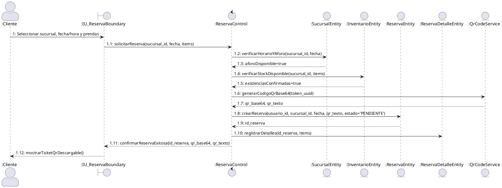

### 2.2.2 Diagrama de Comunicación - CU12: Preparar y Atender Reserva Presencial

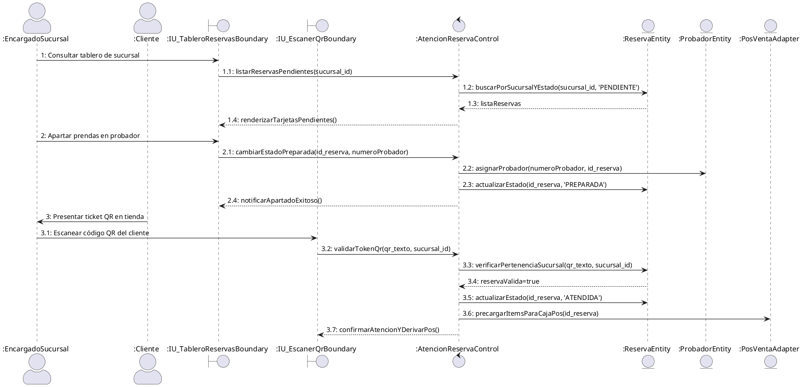

### 2.2.3 Diagrama de Comunicación - CU13: Administrar Carrito de Compras Omnicanal

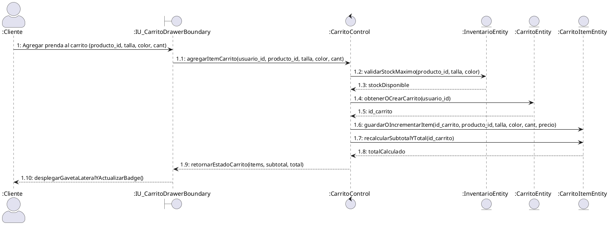

### 2.2.4 Diagrama de Comunicación - CU14: Procesar Compra Digital y Checkout

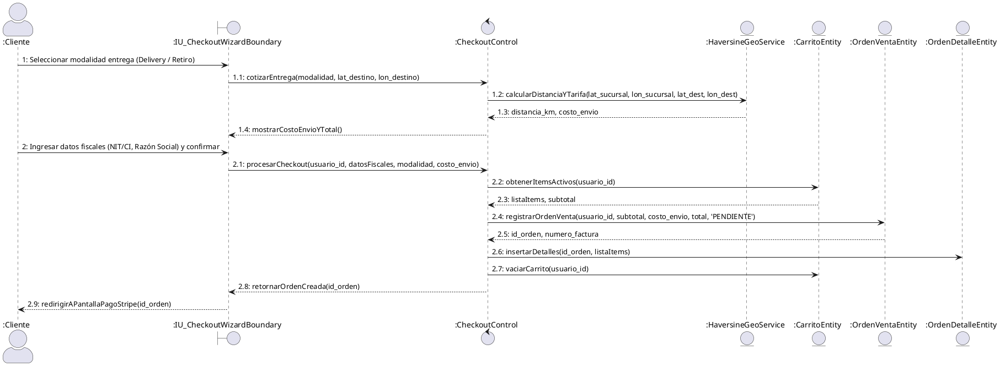

### 2.2.5 Diagrama de Comunicación - CU15: Registrar Venta Presencial en Caja (POS)

```plantuml
@startuml
skinparam actorStyle awesome

actor ":Cajero" as Cajero
boundary ":IU_PosTerminalBoundary" as UI
control ":PosVentaControl" as Ctrl
entity ":ProductoEntity" as ProdEnt
entity ":MetodoPagoEntity" as PagoConfigEnt
entity ":OrdenVentaEntity" as OrdenEnt
entity ":InventarioEntity" as InvEnt
entity ":KardexEntity" as KardexEnt

Cajero -> UI : 1: Escanear código de barras o seleccionar prenda
UI -> Ctrl : 1.1: buscarVariantePorSku(sku, talla, sucursal_id)
Ctrl -> ProdEnt : 1.2: obtenerProductoYPrecios(sku, talla)
ProdEnt --> Ctrl : 1.3: precioBase, factorTalla(+10%)
Ctrl --> UI : 1.4: mostrarModalVarianteYPreciosDinamicos()

Cajero -> UI : 2: Confirmar cobro (Efectivo, Bs. recibido)
UI -> Ctrl : 2.1: procesarVentaMostrador(sucursal_id, items, metodo='EFECTIVO', montoRecibido)
Ctrl -> PagoConfigEnt : 2.2: verificarCanalActivo('EFECTIVO')
PagoConfigEnt --> Ctrl : 2.3: canalHabilitado=true
Ctrl -> Ctrl : 2.4: calcularCambioVuelto(montoRecibido, total)
Ctrl -> OrdenEnt : 2.5: crearOrdenFacturada(sucursal_id, canal='POS', estado='PAGADO')
OrdenEnt --> Ctrl : 2.6: id_orden, numero_factura
Ctrl -> InvEnt : 2.7: descontarStockFisico(sucursal_id, items)
Ctrl -> KardexEnt : 2.8: registrarSalidaVentaKardex(id_orden, items)
Ctrl --> UI : 2.9: retornarVentaExitosa(vuelto, factura)
UI --> Cajero : 2.10: desplegarEImprimirTicketTermico()
@enduml
```

### 2.2.6 Diagrama de Comunicación - CU16: Procesar Pago con Pasarela Electrónica

```plantuml
@startuml
skinparam actorStyle awesome

actor ":Cliente" as Cliente
boundary ":IU_StripeElementsBoundary" as UI
control ":PagosStripeControl" as Ctrl
entity ":StripeApiAdapter" as StripeSdk
entity ":OrdenVentaEntity" as OrdenEnt
entity ":TransaccionPagoEntity" as TransEnt

Cliente -> UI : 1: Ingresar a pasarela de pago para orden
UI -> Ctrl : 1.1: iniciarPagoOrden(id_orden)
Ctrl -> OrdenEnt : 1.2: obtenerTotalAPagar(id_orden)
OrdenEnt --> Ctrl : 1.3: total_bob
Ctrl -> StripeSdk : 1.4: crearPaymentIntent(montoCentavos, moneda='BOB')
StripeSdk --> Ctrl : 1.5: client_secret, payment_intent_id
Ctrl --> UI : 1.6: suministrarClientSecret(client_secret)

Cliente -> UI : 2: Digitar tarjeta y presionar pagar
UI -> StripeSdk : 2.1: tokenizarYConfirmarPago(tarjeta, 3DSecure)
StripeSdk --> UI : 2.2: pagoConfirmado(payment_intent_id, ultimos4, marca)
UI -> Ctrl : 2.3: registrarConfirmacion(id_orden, payment_intent_id)
Ctrl -> StripeSdk : 2.4: verificarEstadoPaymentIntent(payment_intent_id)
StripeSdk --> Ctrl : 2.5: status='succeeded'
Ctrl -> OrdenEnt : 2.6: actualizarEstadoOrden(id_orden, pago='PAGADO', logistica='PREPARACION')
Ctrl -> TransEnt : 2.7: asentarTransaccionInmutable(id_orden, payment_intent_id, monto)
Ctrl --> UI : 2.8: confirmarPagoExitoso()
UI --> Cliente : 2.9: desplegarComprobanteYAccesoTracking()
@enduml
```

### 2.2.7 Diagrama de Comunicación - CU17: Gestionar Tipos y Medios de Cobro

```plantuml
@startuml
skinparam actorStyle awesome

actor ":Administrador" as Admin
boundary ":IU_AdminPagosBoundary" as UI
control ":ConfigCobrosControl" as Ctrl
entity ":MetodoPagoEntity" as PagoEnt
entity ":StripeClientService" as StripeEnt

Admin -> UI : 1: Acceder al panel de configuración financiera
UI -> Ctrl : 1.1: listarCanalesDeCobro()
Ctrl -> PagoEnt : 1.2: obtenerTodosLosCanales()
PagoEnt --> Ctrl : 1.3: listaMetodosConClavesEnmascaradas
Ctrl --> UI : 1.4: renderizarTarjetasConToggleSwitches()

Admin -> UI : 2: Alternar switch (activar/desactivar canal)
UI -> Ctrl : 2.1: conmutarEstadoCanal(codigo, nuevoEstado)
Ctrl -> PagoEnt : 2.2: actualizarActivo(codigo, nuevoEstado)
Ctrl --> UI : 2.3: confirmarCambioToast()

Admin -> UI : 3: Guardar nuevas credenciales API (Stripe Secret Key)
UI -> Ctrl : 3.1: actualizarCredenciales(codigo, credenciales_json)
Ctrl -> PagoEnt : 3.2: persistirParametrosCifrados(codigo, credenciales_json)
Ctrl -> StripeEnt : 3.3: reconfigurarClienteEnCaliente(apiKey)
Ctrl --> UI : 3.4: alertarGuardadoExitoso()
@enduml
```

### 2.2.8 Diagrama de Comunicación - CU18: Gestionar Despacho y Logística de Delivery

```plantuml
@startuml
skinparam actorStyle awesome

actor ":PersonalLogistica" as Logistica
actor ":Repartidor" as Chofer
actor ":Cliente" as Cliente
boundary ":IU_TableroLogisticaBoundary" as UILog
boundary ":IU_TrackingMapaBoundary" as UITrack
control ":LogisticaDespachoControl" as Ctrl
entity ":OrdenVentaEntity" as OrdenEnt
entity ":UsuarioEntity" as UserEnt
entity ":TrackingGpsEntity" as GpsEnt

Logistica -> UILog : 1: Consultar pedidos para empaque y despacho
UILog -> Ctrl : 1.1: listarOrdenesParaDespacho()
Ctrl -> OrdenEnt : 1.2: buscarPorEstados(['PAGADO', 'PREPARACION'])
OrdenEnt --> Ctrl : 1.3: listaOrdenes
Ctrl --> UILog : 1.4: mostrarColumnasKanban()

Logistica -> UILog : 2: Asignar repartidor y despachar
UILog -> Ctrl : 2.1: asignarChoferYDespachar(id_orden, id_repartidor)
Ctrl -> UserEnt : 2.2: validarRolRepartidor(id_repartidor)
UserEnt --> Ctrl : 2.3: choferValido=true
Ctrl -> OrdenEnt : 2.4: transicionarEstado(id_orden, 'EN_TRANSITO', choferDatos)
Ctrl --> UILog : 2.5: ordenEnCaminoNotificada()

Chofer -> Ctrl : 3: Transmitir telemetría GPS móvil
Ctrl -> GpsEnt : 3.1: registrarCoordenadaActual(id_orden, lat_actual, lon_actual)

Cliente -> UITrack : 4: Consultar estado de entrega en vivo
UITrack -> Ctrl : 4.1: obtenerTrackingEnVivo(id_orden)
Ctrl -> OrdenEnt : 4.2: obtenerDatosOrdenYChofer(id_orden)
Ctrl -> GpsEnt : 4.3: obtenerUltimaPosicion(id_orden)
Ctrl --> UITrack : 4.4: renderizarMapaRutaYStepper4Etapas()
@enduml
```

---

## 2.3 Análisis de Clases (Diagramas de Robustez)

Siguiendo estrictamente las directrices metodológicas del PUDS y los estereotipos de Ivar Jacobson evaluados por la cátedra (`B4.txt`), a continuación se detallan los **Diagramas de Clases de Análisis (Robustez)** para los 8 casos de uso del Ciclo 2 (**CU11 al CU18**).  
**Regla de Oro de la Cátedra:**  
- **Clases de Interfaz (`<<Boundary>>`, prefijo `IU_`)**: Contienen atributos representativos de los datos capturados o desplegados en la interfaz y métodos de eventos visuales.
- **Clases de Control (`<<Control>>`, prefijo `CTR_`)**: Orquestan las reglas de negocio, validaciones y cálculos. **NO CONTIENEN NINGÚN ATRIBUTO DE DATOS**, únicamente métodos de lógica de negocio.
- **Clases de Entidad (`<<Entity>>`, prefijo `CE_`)**: Mapean las tablas de la base de datos PostgreSQL, encapsulando el estado persistente y operaciones CRUD.

### 2.3.1 Diagrama de Análisis de Clases - CU11: Solicitar Reserva de Prendas en Sucursal

```plantuml
@startuml
skinparam classAttributeIconSize 0
skinparam style strictuml
hide empty members

actor "CLIENTE" as Actor

class "IU_ReservaSucursal" as UI <<Boundary>> {
    +sucursalSeleccionada: Integer
    +fechaVisita: DateTime
    +prendasSeleccionadas: List
    +ticketQrGenerado: String
    --
    +seleccionarSucursal(): void
    +definirFechaHora(): void
    +confirmarReserva(): void
    +descargarTicketQr(): void
    +mostrarAlertaSinStock(): void
}

class "CTR_ReservaSucursal" as Ctrl <<Control>> {
    --
    +solicitarReservaPrendas(id_usuario, id_sucursal, fecha, items): ReservaDTO
    +validarStockSucursal(id_sucursal, items): Boolean
    +generarQrToken(id_usuario, id_sucursal): String
    +persistirReserva(id_usuario, id_sucursal, fecha, token): Integer
}

class "CE_Reserva" as EntRes <<Entity>> {
    +id_reserva: Integer
    +id_usuario: Integer
    +id_sucursal: Integer
    +codigo_qr: String
    +qr_texto: String
    +fecha_visita: DateTime
    +estado: String
    +creado_en: DateTime
    --
    +guardarReserva(): Integer
    +buscarPorQrTexto(token: String): Reserva
}

class "CE_ReservaDetalle" as EntDet <<Entity>> {
    +id_reserva_detalle: Integer
    +id_reserva: Integer
    +id_producto: Integer
    +talla: String
    +color: String
    +cantidad: Integer
    --
    +guardarDetalle(): void
}

class "CE_Sucursal" as EntSuc <<Entity>> {
    +id_sucursal: Integer
    +nombre: String
    +direccion: String
    +capacidad_probadores: Integer
    --
    +verificarAforoDisponible(fecha: DateTime): Boolean
}

class "CE_QrCodeTicket" as EntQr <<Entity>> {
    +token_unico: String
    +imagen_base64: String
    --
    +generarDataUri(): String
}

Actor -- UI
UI -- Ctrl
Ctrl -- EntRes
Ctrl -- EntDet
Ctrl -- EntSuc
Ctrl -- EntQr
@enduml
```

### 2.3.2 Diagrama de Análisis de Clases - CU12: Preparar y Atender Reserva Presencial

```plantuml
@startuml
skinparam classAttributeIconSize 0
skinparam style strictuml
hide empty members

actor "ENCARGADO SUCURSAL" as ActorEnc
actor "CLIENTE" as ActorCli

class "IU_TableroReservas" as UI <<Boundary>> {
    +sucursalId: Integer
    +filtroEstado: String
    +qrEscaneado: String
    +probadorAsignado: Integer
    --
    +cargarReservasDelDia(): void
    +apartarPrendasEnProbador(): void
    +activarEscanerCamara(): void
    +ingresarTokenManual(): void
    +derivarAVentaPos(): void
}

class "CTR_AtencionReserva" as Ctrl <<Control>> {
    --
    +listarReservasPorSucursal(id_sucursal): List
    +apartarPrendasProbador(id_reserva, probador): Boolean
    +procesarLecturaQr(token, id_sucursal): ReservaDTO
    +marcarComoAtendida(id_reserva): void
    +transferirAVentaPos(id_reserva): Integer
}

class "CE_Reserva" as EntRes <<Entity>> {
    +id_reserva: Integer
    +estado: String
    +qr_texto: String
    --
    +actualizarEstado(nuevoEstado: String): void
    +obtenerDetallesPrendas(): List
}

class "CE_Probador" as EntProb <<Entity>> {
    +numero_probador: Integer
    +id_sucursal: Integer
    +estado: String
    --
    +asignarPrendas(id_reserva: Integer): void
    +liberarProbador(): void
}

ActorEnc -- UI
ActorCli -- UI
UI -- Ctrl
Ctrl -- EntRes
Ctrl -- EntProb
@enduml
```

### 2.3.3 Diagrama de Análisis de Clases - CU13: Administrar Carrito Omnicanal

```plantuml
@startuml
skinparam classAttributeIconSize 0
skinparam style strictuml
hide empty members

actor "CLIENTE" as Actor

class "IU_CarritoDrawer" as UI <<Boundary>> {
    +itemsCarrito: List
    +subtotal: Decimal
    +total: Decimal
    --
    +abrirGavetaCarrito(): void
    +incrementarCantidad(id_item): void
    +decrementarCantidad(id_item): void
    +eliminarPrenda(id_item): void
    +procederACheckout(): void
}

class "CTR_GestionCarrito" as Ctrl <<Control>> {
    --
    +agregarPrendaAlCarrito(id_usuario, id_producto, talla, color, cant): CarritoDTO
    +modificarCantidadItem(id_item, nuevaCantidad): CarritoDTO
    +eliminarItemCarrito(id_item): CarritoDTO
    +validarExistenciasMaximas(id_producto, talla, cant): Boolean
    +calcularTotales(id_carrito): Decimal
}

class "CE_Carrito" as EntCart <<Entity>> {
    +id_carrito: Integer
    +id_usuario: Integer
    +actualizado_en: DateTime
    --
    +obtenerPorUsuario(id_usuario: Integer): Carrito
    +limpiarCarrito(): void
}

class "CE_CarritoItem" as EntItem <<Entity>> {
    +id_item: Integer
    +id_carrito: Integer
    +id_producto: Integer
    +talla: String
    +color: String
    +cantidad: Integer
    +precio_unitario: Decimal
    +subtotal: Decimal
    --
    +guardarItem(): void
    +actualizarCantidad(cant: Integer): void
    +eliminar(): void
}

class "CE_Inventario" as EntInv <<Entity>> {
    +id_inventario: Integer
    +id_producto: Integer
    +stock_fisico: Integer
    --
    +verificarStock(id_prod: Integer, cant: Integer): Boolean
}

Actor -- UI
UI -- Ctrl
Ctrl -- EntCart
Ctrl -- EntItem
Ctrl -- EntInv
@enduml
```

### 2.3.4 Diagrama de Análisis de Clases - CU14: Procesar Compra Digital y Checkout

```plantuml
@startuml
skinparam classAttributeIconSize 0
skinparam style strictuml
hide empty members

actor "CLIENTE" as Actor

class "IU_CheckoutWizard" as UI <<Boundary>> {
    +modalidadEntrega: String
    +direccionEnvio: String
    +latitudDestino: Decimal
    +longitudDestino: Decimal
    +nitFactura: String
    +razonSocial: String
    --
    +seleccionarModalidad(): void
    +calcularFlete(): void
    +ingresarDatosFiscales(): void
    +confirmarOrdenVenta(): void
}

class "CTR_ProcesarCheckout" as Ctrl <<Control>> {
    --
    +cotizarTarifaDelivery(lat_dest, lon_dest): Decimal
    +formalizarOrden(id_usuario, datosFiscales, modalidad, costo_envio): OrdenDTO
    +validarCamposFiscales(nit, razonSocial): Boolean
    +vaciarBolsaPostOrden(id_usuario): void
}

class "CE_OrdenVenta" as EntOrden <<Entity>> {
    +id_orden: Integer
    +id_usuario: Integer
    +numero_factura: String
    +canal_venta: String
    +modalidad_entrega: String
    +nit_factura: String
    +razon_social_factura: String
    +subtotal: Decimal
    +costo_envio: Decimal
    +total: Decimal
    +estado_pago: String
    +estado_logistica: String
    --
    +crearOrden(): Integer
    +actualizarEstadoPago(estado: String): void
}

class "CE_OrdenDetalle" as EntDet <<Entity>> {
    +id_detalle_orden: Integer
    +id_orden: Integer
    +id_producto: Integer
    +talla: String
    +color: String
    +cantidad: Integer
    +precio_unitario: Decimal
    +subtotal: Decimal
    --
    +insertarDetallesLote(items: List): void
}

class "CE_CalculoHaversine" as EntGeo <<Entity>> {
    +radio_tierra_km: Decimal
    --
    +calcularDistanciaKm(lat1, lon1, lat2, lon2): Decimal
    +calcularTarifa(distancia_km: Decimal): Decimal
}

Actor -- UI
UI -- Ctrl
Ctrl -- EntOrden
Ctrl -- EntDet
Ctrl -- EntGeo
@enduml
```

### 2.3.5 Diagrama de Análisis de Clases - CU15: Registrar Venta Presencial en Caja (POS)

```plantuml
@startuml
skinparam classAttributeIconSize 0
skinparam style strictuml
hide empty members

actor "CAJERO" as Actor

class "IU_TerminalPos" as UI <<Boundary>> {
    +skuBusqueda: String
    +tallaSeleccionada: String
    +cantidad: Integer
    +montoEfectivoRecibido: Decimal
    +metodoPagoSeleccionado: String
    --
    +escanearCodigoSku(): void
    +seleccionarVarianteTalla(): void
    +cargarReservaQr(): void
    +cobrarVenta(): void
    +imprimirTicketTermico(): void
}

class "CTR_VentaPos" as Ctrl <<Control>> {
    --
    +buscarPrendaPorSku(sku, sucursal_id): PrendaDTO
    +calcularPrecioPorTalla(precioBase, talla): Decimal
    +calcularVueltoEfectivo(montoRecibido, total): Decimal
    +procesarCobroPos(sucursal_id, items, metodo, recibido): VentaDTO
    +asentarSalidaStockKardex(sucursal_id, items, id_orden): void
}

class "CE_OrdenVenta" as EntOrden <<Entity>> {
    +id_orden: Integer
    +numero_factura: String
    +canal_venta: String
    +total: Decimal
    +estado_pago: String
    --
    +registrarVentaCaja(): Integer
}

class "CE_Inventario" as EntInv <<Entity>> {
    +id_sucursal: Integer
    +id_producto: Integer
    +stock_fisico: Integer
    --
    +descontarStock(cant: Integer): void
}

class "CE_Kardex" as EntKardex <<Entity>> {
    +id_kardex: Integer
    +tipo_movimiento: String
    +cantidad: Integer
    +costo_unitario: Decimal
    --
    +asentarSalidaVenta(id_orden: Integer): void
}

class "CE_MetodoPago" as EntMetodo <<Entity>> {
    +codigo: String
    +activo: Boolean
    --
    +verificarCanalHabilitado(codigo: String): Boolean
}

Actor -- UI
UI -- Ctrl
Ctrl -- EntOrden
Ctrl -- EntInv
Ctrl -- EntKardex
Ctrl -- EntMetodo
@enduml
```

### 2.3.6 Diagrama de Análisis de Clases - CU16: Procesar Pago con Pasarela Electrónica

```plantuml
@startuml
skinparam classAttributeIconSize 0
skinparam style strictuml
hide empty members

actor "CLIENTE" as ActorCli
actor "PASARELA STRIPE" as ActorPas

class "IU_CobroStripeElements" as UI <<Boundary>> {
    +ordenId: Integer
    +montoTotal: Decimal
    +titularTarjeta: String
    +clientSecret: String
    --
    +montarStripeElements(): void
    +ejecutarPagoSeguro(): void
    +completarReto3DSecure(): void
    +mostrarComprobanteExito(): void
    +mostrarAlertaPagoRechazado(): void
}

class "CTR_ProcesarPagoStripe" as Ctrl <<Control>> {
    --
    +generarIntencionPago(id_orden): PaymentIntentDTO
    +confirmarTransaccion(id_orden, payment_intent_id): Boolean
    +manejarWebhookStripe(eventoStripe): void
    +actualizarEstadoOrdenAPagado(id_orden): void
}

class "CE_OrdenVenta" as EntOrden <<Entity>> {
    +id_orden: Integer
    +total: Decimal
    +estado_pago: String
    +estado_logistica: String
    --
    +cambiarAPagado(): void
    +avanzarAPreparacion(): void
}

class "CE_TransaccionPago" as EntTrans <<Entity>> {
    +id_transaccion: Integer
    +id_orden: Integer
    +pasarela: String
    +payment_intent_id: String
    +monto: Decimal
    +moneda: String
    +estado: String
    +ultimos4: String
    +marca_tarjeta: String
    --
    +registrarTransaccionInmutable(): Integer
}

class "CE_StripeConfig" as EntStripe <<Entity>> {
    +api_key_publica: String
    +api_key_secreta: String
    --
    +obtenerClientSecret(montoCentavos: Integer): String
    +consultarPaymentIntent(intent_id: String): Object
}

ActorCli -- UI
ActorPas -- UI
UI -- Ctrl
Ctrl -- EntOrden
Ctrl -- EntTrans
Ctrl -- EntStripe
@enduml
```

### 2.3.7 Diagrama de Análisis de Clases - CU17: Gestionar Tipos y Medios de Cobro

```plantuml
@startuml
skinparam classAttributeIconSize 0
skinparam style strictuml
hide empty members

actor "ADMINISTRADOR GENERAL" as Actor

class "IU_AdminCanalesCobro" as UI <<Boundary>> {
    +canalesListados: List
    +canalSeleccionado: String
    +credencialesVisibles: Boolean
    --
    +cargarCanalesPago(): void
    +alternarInterruptorActivo(codigo, estado): void
    +abrirModalConfiguracion(codigo): void
    +revelarUocultarClaveSecreta(): void
    +guardarCredenciales(): void
}

class "CTR_ConfigCobros" as Ctrl <<Control>> {
    --
    +listarMetodosCobroEnmascarados(): List
    +actualizarEstadoCanal(codigo, activo): Boolean
    +actualizarParametrosApi(codigo, credenciales_json): Boolean
    +reconfigurarStripeEnCaliente(secret_key): void
}

class "CE_MetodoPago" as EntMetodo <<Entity>> {
    +id_metodo: Integer
    +codigo: String
    +nombre: String
    +tipo: String
    +activo: Boolean
    +requiere_credenciales: Boolean
    +credenciales_json: String
    --
    +listarTodos(): List
    +conmutarActivo(nuevoEstado: Boolean): void
    +guardarCredenciales(json: String): void
}

Actor -- UI
UI -- Ctrl
Ctrl -- EntMetodo
@enduml
```

### 2.3.8 Diagrama de Análisis de Clases - CU18: Gestionar Despacho y Logística de Delivery

```plantuml
@startuml
skinparam classAttributeIconSize 0
skinparam style strictuml
hide empty members

actor "PERSONAL LOGISTICA" as ActorLog
actor "REPARTIDOR" as ActorRep
actor "CLIENTE" as ActorCli

class "IU_TableroDespachoKanban" as UILog <<Boundary>> {
    +ordenesPorEstado: Map
    +choferSeleccionado: Integer
    --
    +cargarTableroKanban(): void
    +asignarRepartidor(id_orden, id_chofer): void
    +avanzarEtapaLogistica(id_orden, nuevoEstado): void
}

class "IU_TrackingGpsMapa" as UITrack <<Boundary>> {
    +idOrden: Integer
    +latitudActual: Decimal
    +longitudActual: Decimal
    +etapaActual: Integer
    --
    +cargarTrackingOrden(): void
    +actualizarPosicionEnMapa(): void
    +mostrarDatosRepartidor(): void
}

class "CTR_LogisticaDespacho" as Ctrl <<Control>> {
    --
    +obtenerPedidosPorDespachar(): List
    +asignarChoferAOrden(id_orden, id_chofer): Boolean
    +transicionarEstadoLogistico(id_orden, nuevoEstado): Boolean
    +registrarUbicacionGps(id_orden, lat, lon): void
    +obtenerDatosTrackingEnVivo(id_orden): TrackingDTO
}

class "CE_OrdenVenta" as EntOrden <<Entity>> {
    +id_orden: Integer
    +numero_factura: String
    +id_repartidor: Integer
    +nombre_repartidor: String
    +telefono_repartidor: String
    +estado_logistica: String
    +latitud_destino: Decimal
    +longitud_destino: Decimal
    --
    +asignarChofer(id_chofer: Integer): void
    +actualizarEstadoLogistica(estado: String): void
}

class "CE_TrackingGps" as EntGps <<Entity>> {
    +id_tracking: Integer
    +id_orden: Integer
    +latitud: Decimal
    +longitud: Decimal
    +marca_tiempo: DateTime
    --
    +asentarPuntoGps(id_orden: Integer, lat: Decimal, lon: Decimal): void
    +obtenerUltimoPunto(id_orden: Integer): Point
}

ActorLog -- UILog
ActorRep -- UILog
ActorCli -- UITrack
UILog -- Ctrl
UITrack -- Ctrl
Ctrl -- EntOrden
Ctrl -- EntGps
@enduml
```

---

## 2.4 Análisis de Paquetes

En el análisis de paquetes (fundamentado en la metodología PUDS y las directrices de la cátedra `B4.txt`), se evalúa la arquitectura del Ciclo 2 bajo las dos métricas cardinales del diseño modular de software:
1. **Acoplamiento**: Mide el grado de interdependencia entre paquetes. Se procura un **bajo acoplamiento** mediante interfaces de servicio claras para evitar el efecto dominó ante modificaciones.
2. **Cohesión**: Mide el grado de afinidad temática y responsabilidad única interna de los elementos contenidos en cada paquete. Se procura una **alta cohesión funcional**, asegurando que cada paquete encapsule clases dedicadas estrictamente a su contexto delimitado (*Bounded Context*).

```plantuml
@startuml
skinparam packageStyle rectangle
skinparam defaultFontName "Segoe UI", Arial, sans-serif
skinparam defaultFontSize 11

package "Paquete 6: Reservas Presenciales (M10)" as PkgRes #E0F2FE {
    class AtencionReservaControl
    class ReservaEntity
    class ReservaDetalleEntity
    class ProbadorEntity
    class QrCodeService
}

package "Paquete 7: Venta Digital y Carrito (M11, M12)" as PkgVenta #ECFCCB {
    class CarritoControl
    class CheckoutControl
    class CarritoEntity
    class CarritoItemEntity
    class OrdenVentaEntity
    class HaversineGeoService
}

package "Paquete 8: Punto de Venta POS (M13)" as PkgPOS #FEF3C7 {
    class PosVentaControl
    class OrdenVentaEntity as PosOrdenEnt
    class MetodoPagoEntity as PosMetodoEnt
    class InventarioEntity as PosInvEnt
    class KardexEntity as PosKardexEnt
}

package "Paquete 9: Procesamiento de Pagos (M14, M15)" as PkgPagos #FCE7F3 {
    class PagosStripeControl
    class ConfigCobrosControl
    class TransaccionPagoEntity
    class StripeConfigEntity
    class MetodoPagoEntity as PagosMetodoEnt
}

package "Paquete 10: Logística y Delivery (M19)" as PkgLogistica #F3E8FF {
    class LogisticaDespachoControl
    class OrdenVentaEntity as LogOrdenEnt
    class TrackingGpsEntity
    class UsuarioEntity as RepartidorEnt
}

' Relaciones de dependencia e integración entre paquetes
PkgRes ..> PkgPOS : deriva prendas probadas para facturación
PkgVenta ..> PkgPagos : solicita creación de PaymentIntent y cobro
PkgPOS ..> PkgPagos : valida medios de cobro habilitados y comisiones
PkgVenta ..> PkgLogistica : programa despacho con coordenadas geodésicas
PkgPagos ..> PkgLogistica : dispara despacho al confirmar pago exitoso
@enduml
```

| Paquete de Análisis | Nivel de Cohesión | Nivel de Acoplamiento | Justificación Técnica de Diseño y Responsabilidad Arquitectónica |
|:---|:---:|:---:|:---|
| **P6: Reservas Presenciales** | **Alta (Funcional)** | **Bajo (Eferente: 1, Aferente: 0)** | Gestiona de forma autónoma la agenda de probadores, citas y verificación QR en tienda física; solo deriva a POS cuando el cliente decide adquirir las prendas. |
| **P7: Venta Digital y Carrito** | **Alta (Transaccional)** | **Medio (Eferente: 2, Aferente: 0)** | Consolida la bolsa de compras omnicanal, cotización Haversine y formalización de pedidos online; delega el recaudo a Pagos y la entrega a Logística. |
| **P8: Punto de Venta POS** | **Muy Alta (Operativa)** | **Medio (Eferente: 1, Aferente: 1)** | Administra la facturación rápida en caja, soporte de escáner de barras, selector de tallas y descuento atómico de stock físico en Kardex; consulta configuración a Pagos. |
| **P9: Procesamiento de Pagos** | **Alta (Servicio/Financiero)** | **Controlado (Eferente: 1, Aferente: 2)** | Módulo financiero desacoplado con integración segura Stripe SDK (PCI-DSS / 3DS), llaves API enmascaradas y registro inmutable de transacciones. |
| **P10: Logística y Delivery** | **Alta (Dominio Logístico)** | **Bajo (Eferente: 0, Aferente: 2)** | Encapsula la máquina de estados finita de despacho, asignación de repartidores y rastreo GPS satelital en tiempo real con simulación reactiva. |

---

# 3. Flujo de Trabajo: Diseño

## 3.1 Diseño de Datos Físico (Script DDL SQL en PostgreSQL - Extensiones Ciclo 2)

A continuación se detalla el esquema físico exacto implementado en el backend mediante SQLAlchemy y persistido en la base de datos:

```sql
-- 1. Tabla de Reservas de Probadores en Sucursales (CU11/CU12)
CREATE TABLE reservas (
    id_reserva SERIAL PRIMARY KEY,
    id_usuario INTEGER NOT NULL REFERENCES usuarios(id_usuario) ON DELETE CASCADE,
    id_sucursal INTEGER NOT NULL REFERENCES sucursales(id_sucursal) ON DELETE CASCADE,
    codigo_qr TEXT NOT NULL UNIQUE,          -- Imagen QR en Base64 data URI
    qr_texto VARCHAR(200) UNIQUE,            -- Token alfanumérico legible para escaneo manual
    fecha_visita TIMESTAMP NOT NULL,         -- Fecha y hora estimada de visita
    estado VARCHAR(30) DEFAULT 'PENDIENTE' 
        CHECK (estado IN ('PENDIENTE', 'PREPARADA', 'ATENDIDA', 'VENCIDA', 'CANCELADA')),
    creado_en TIMESTAMP DEFAULT CURRENT_TIMESTAMP
);

CREATE TABLE reserva_detalles (
    id_reserva_detalle SERIAL PRIMARY KEY,
    id_reserva INTEGER NOT NULL REFERENCES reservas(id_reserva) ON DELETE CASCADE,
    id_producto INTEGER NOT NULL REFERENCES productos(id_producto) ON DELETE CASCADE,
    talla VARCHAR(20) NOT NULL,
    color VARCHAR(50) NOT NULL,
    cantidad INTEGER NOT NULL DEFAULT 1
);

-- 2. Tabla de Carrito de Compras Omnicanal (CU13)
CREATE TABLE carritos (
    id_carrito SERIAL PRIMARY KEY,
    id_usuario INTEGER NOT NULL UNIQUE REFERENCES usuarios(id_usuario) ON DELETE CASCADE,
    creado_en TIMESTAMP DEFAULT CURRENT_TIMESTAMP,
    actualizado_en TIMESTAMP DEFAULT CURRENT_TIMESTAMP
);

CREATE TABLE carrito_items (
    id_item SERIAL PRIMARY KEY,
    id_carrito INTEGER NOT NULL REFERENCES carritos(id_carrito) ON DELETE CASCADE,
    id_producto INTEGER NOT NULL REFERENCES productos(id_producto) ON DELETE CASCADE,
    talla VARCHAR(20) NOT NULL,
    color VARCHAR(50) NOT NULL,
    cantidad INTEGER NOT NULL DEFAULT 1,
    precio_unitario NUMERIC(10, 2) NOT NULL,
    subtotal NUMERIC(10, 2) NOT NULL,
    creado_en TIMESTAMP DEFAULT CURRENT_TIMESTAMP
);

-- 3. Tabla de Órdenes de Venta y Logística Omnicanal (CU14/CU15/CU18)
CREATE TABLE ordenes_venta (
    id_orden SERIAL PRIMARY KEY,
    id_usuario INTEGER REFERENCES usuarios(id_usuario) ON DELETE SET NULL,
    id_sucursal INTEGER REFERENCES sucursales(id_sucursal) ON DELETE SET NULL,
    numero_factura VARCHAR(50) UNIQUE,
    canal_venta VARCHAR(20) NOT NULL DEFAULT 'WEB' CHECK (canal_venta IN ('WEB', 'APP', 'POS')),
    modalidad_entrega VARCHAR(20) NOT NULL CHECK (modalidad_entrega IN ('DELIVERY', 'RETIRO_TIENDA', 'COMPRA_FISICA')),
    
    -- Facturación Fiscal (CU14)
    nit_factura VARCHAR(30),
    razon_social_factura VARCHAR(150),
    direccion_envio VARCHAR(255),
    telefono_contacto VARCHAR(30),
    notas_entrega TEXT,
    
    -- Importes Financieros
    subtotal NUMERIC(10, 2) NOT NULL,
    costo_envio NUMERIC(10, 2) DEFAULT 0.00,
    total NUMERIC(10, 2) NOT NULL,
    
    -- Estados Operativos
    estado_pago VARCHAR(20) DEFAULT 'PENDIENTE' CHECK (estado_pago IN ('PENDIENTE', 'PAGADO', 'RECHAZADO')),
    estado_logistica VARCHAR(30) DEFAULT 'CREADA' 
        CHECK (estado_logistica IN ('CREADA', 'PREPARACION', 'LISTO_DESPACHO', 'EN_TRANSITO', 'ENTREGADA')),
    creado_en TIMESTAMP DEFAULT CURRENT_TIMESTAMP,
    
    -- Logística y Delivery (CU18)
    id_repartidor INTEGER REFERENCES usuarios(id_usuario) ON DELETE SET NULL,
    nombre_repartidor VARCHAR(100),
    telefono_repartidor VARCHAR(30),
    latitud_destino NUMERIC(10, 8),
    longitud_destino NUMERIC(11, 8),
    distancia_km NUMERIC(6, 2)
);

CREATE TABLE ordenes_detalle (
    id_detalle_orden SERIAL PRIMARY KEY,
    id_orden INTEGER NOT NULL REFERENCES ordenes_venta(id_orden) ON DELETE CASCADE,
    id_producto INTEGER NOT NULL REFERENCES productos(id_producto),
    talla VARCHAR(20) NOT NULL,
    color VARCHAR(50) NOT NULL,
    cantidad INTEGER NOT NULL,
    precio_unitario NUMERIC(10, 2) NOT NULL,
    subtotal NUMERIC(10, 2) NOT NULL
);

-- 4. Tabla de Pasarela de Pagos Electrónicos (CU16)
CREATE TABLE transacciones_pago (
    id_transaccion SERIAL PRIMARY KEY,
    id_orden INTEGER NOT NULL REFERENCES ordenes_venta(id_orden) ON DELETE CASCADE,
    pasarela VARCHAR(50) NOT NULL DEFAULT 'STRIPE',
    payment_intent_id VARCHAR(150) NOT NULL UNIQUE,
    monto NUMERIC(10, 2) NOT NULL,
    moneda VARCHAR(10) DEFAULT 'BOB',
    estado VARCHAR(30) DEFAULT 'SUCCEEDED',
    metodo_pago VARCHAR(50) DEFAULT 'card',
    marca_tarjeta VARCHAR(50),
    ultimos4 VARCHAR(4),
    detalles_raw TEXT,
    fecha_creacion TIMESTAMP DEFAULT CURRENT_TIMESTAMP
);

-- 5. Tabla de Configuración de Medios de Cobro (CU17)
CREATE TABLE metodos_pago (
    id_metodo SERIAL PRIMARY KEY,
    codigo VARCHAR(50) NOT NULL UNIQUE,
    nombre VARCHAR(100) NOT NULL,
    tipo VARCHAR(30) NOT NULL DEFAULT 'OMNICANAL' CHECK (tipo IN ('FISICO', 'DIGITAL', 'OMNICANAL')),
    descripcion VARCHAR(255),
    icono VARCHAR(50),
    activo BOOLEAN NOT NULL DEFAULT TRUE,
    requiere_credenciales BOOLEAN NOT NULL DEFAULT FALSE,
    credenciales_json TEXT,
    creado_en TIMESTAMP DEFAULT CURRENT_TIMESTAMP,
    actualizado_en TIMESTAMP DEFAULT CURRENT_TIMESTAMP
);
```

---

## 3.2 Diseño de Clases del Dominio y Servicios (Backend FastAPI)

La lógica transaccional se organiza bajo el patrón de Servicios desacoplados de los Controladores REST:

- **`ReservasService` (`app/modules/reservas/services.py`):**
  - `crear_reserva(...)`: Valida existencias en la sucursal, aparta stock temporal, genera imagen QR con biblioteca `qrcode` en Base64 y asocia `qr_texto`.
  - `listar_reservas_sucursal(...)`: Filtra las reservas por tienda para la vista del encargado (CU12).
  - `atender_reserva(...)`: Realiza la lectura del QR presencial y transiciona a estado `ATENDIDA`.
- **`CarritoService` (`app/modules/carrito/services.py`):**
  - `agregar_item(...)`: Realiza inserción o incremento atómico validando que la suma no supere el stock de la prenda.
  - `actualizar_cantidad(...)` y `eliminar_item(...)`: Recalcula subtotales dinámicos.
- **`OrdenesService` (`app/modules/ordenes/services.py`):**
  - `crear_orden_checkout(...)`: Formaliza la orden de venta desde el carrito, descuenta inventario si es retiro en tienda o calcula flete geodésico Haversine si es delivery.
- **`PosService` (`app/modules/pos/services.py`):**
  - `buscar_producto_por_sku(...)`: Consulta rápida con atributos completos de variantes, tallas, colores y existencias en la sucursal del cajero.
  - `procesar_venta_pos(...)`: Valida que el canal de cobro esté habilitado en `metodos_pago` (CU17), calcula cambio de efectivo, asienta salida en Kardex y emite comprobante.
- **`PagosService` (`app/modules/pagos/services.py`):**
  - `crear_intencion_pago(...)`: Verifica que Stripe esté habilitado (CU17), genera el `PaymentIntent` en centavos enteros y asocia metadata.
  - `confirmar_transaccion_pago(...)`: Verifica contra la API de Stripe, actualiza la orden a `PAGADO` y registra la transacción inmutable.
- **`PagoConfigService` (`app/modules/pagos/services.py`):**
  - `listar_metodos_pago(...)`: Enmascara claves sensibles antes de enviarlas al frontend (`sk_test_****dXFK`).
  - `actualizar_metodo_pago(...)`: Actualiza el interruptor activo/inactivo y propaga llaves API de Stripe en tiempo de ejecución.
- **`LogisticaService` (`app/modules/logistica/services.py`):**
  - Implementa la máquina de estados finita estricta: `CREADA` -> `PREPARACION` -> `LISTO_DESPACHO` -> `EN_TRANSITO` -> `ENTREGADA`. Si se intenta una transición inválida, responde con `HTTP 409 Conflict`.
  - `calcular_distancia_haversine(...)` y `calcular_tarifa_delivery(...)`: Algoritmo matemático esférico sobre las coordenadas GPS de la sucursal y el cliente.

---

## 3.3 Diseño de Interfaz y Componentes (Frontend Angular 19)

El frontend utiliza componentes standalone de Angular 19 integrados con un diseño visual premium (Outfit typography, dark glassmorphism, micro-animaciones y paletas HSL seleccionadas):

- **Resolución Unificada de Endpoints (`API_BASE_URL`):**
  - Todos los servicios (`FashionApiService`, `PosService`, `PagoConfigService`, `LogisticaService`, `PagosService`, `CheckoutService`, `CarritoService`) consumen `api.constants.ts`.
  - Si se ejecuta en modo desarrollo en el puerto `4200`, redirige automáticamente hacia `http://localhost:8000/api/v1`. En producción o embebido en FastAPI, opera con ruta relativa `/api/v1`.
- **Detección de Cambios Reactiva (`ChangeDetectorRef`):**
  - Para resolver el problema de event coalescing en Angular standalone donde las respuestas HTTP asíncronas no renderizaban de inmediato, se inyectó `ChangeDetectorRef.detectChanges()` en puntos clave:
    - Carga inmediata del catálogo y variantes en Caja POS (CU15).
    - Carga de canales de cobro y toggle switches en Configuración Financiera (CU17).
    - Panel de control de métricas y KPIs en tiempo real (Dashboard).
    - Actualización del tracking de delivery en vivo (CU18).

---

# 4. Flujo de Trabajo: Implementación

## 4.1 Tecnologías Adicionales para Ciclo 2

- **Pasarela de Cobro Digital:** SDK de `stripe-python` integrado en FastAPI y Stripe Elements en Angular con autenticación 3D Secure y tokenización PCI-DSS.
- **Generación de Códigos QR:** Biblioteca Python `qrcode` y `Pillow` para generar tickets de reserva en Base64 Data URI y escaneo mediante `ngx-scanner` / entrada manual por token.
- **Cálculo Geoespacial:** Algoritmo matemático esférico de Haversine implementado en `app/modules/logistica/geo.py` con radio terrestre medio ($R = 6371\text{ km}$).
- **Monitoreo de Infraestructura:** Endpoint de métricas ejecutivas consolidadas `GET /api/v1/dashboard/metricas` con agregación SQL de alto rendimiento.

---

## 4.2 Arquitectura y Componentes Implementados

### Módulos Backend (FastAPI):
- `app/modules/reservas/` (CU11, CU12)
- `app/modules/carrito/` (CU13)
- `app/modules/ordenes/` (CU14)
- `app/modules/pos/` (CU15)
- `app/modules/pagos/` (CU16, CU17)
- `app/modules/logistica/` (CU18)
- `app/modules/dashboard/` (Consolidación de Métricas)

### Vistas y Componentes Frontend (Angular 19):
- `app/pages/reservas/` (CU11 - Reservar Prendas y Mis Tickets QR)
- `app/pages/encargado-dashboard/` (CU12 - Tablero de Probadores y Escáner QR)
- `app/shared/components/carrito-sidebar/` (CU13 - Bolsa Lateral Persistente)
- `app/pages/checkout/` (CU14 - Wizard de Checkout en 3 Pasos)
- `app/pages/pos/` (CU15 - Terminal Punto de Venta POS en Mostrador)
- `app/pages/pagos/` (CU16 - Cobro Electrónico Seguro con Tarjeta)
- `app/pages/admin-pagos/` (CU17 - Gestión de Tipos y Medios de Cobro)
- `app/pages/logistica/` y `app/pages/tracking/` (CU18 - Despacho y Tracking en Vivo)
- `app/pages/dashboard/` (Panel de Control y Métricas Ejecutivas del Sistema)

---

# 5. Flujo de Trabajo: Pruebas

## 5.1 Pruebas de Casos de Uso (Caja Negra)

A continuación se documenta la matriz de validación ejecutada y aprobada para todos los casos de uso del Ciclo 2:

### Matriz de Pruebas Integrales del Ciclo 2

| Caso de Uso | Escenario Evaluado | Acción Ejecutada | Resultado Obtenido | Estado |
|-------------|-------------------|------------------|--------------------|--------|
| **CU11** | Reserva de prenda en sucursal con hora local | Cliente elige sucursal Equipetrol, selecciona fecha/hora (GMT-4) y confirma. | Se genera ticket con código QR y token alfanumérico; se guarda en "Mis Tickets QR" de forma permanente. | **Satisfactorio** |
| **CU12** | Atención presencial de reserva | Encargado de Equipetrol visualiza la reserva, aparta prendas en probador (`PREPARADA`) y escanea el QR. | Estado cambia a `ATENDIDA` y se habilita botón de traspaso a Caja POS. | **Satisfactorio** |
| **CU13** | Modificación reactiva de la bolsa | Cliente agrega prenda desde el catálogo, incrementa cantidad a 3 y elimina un ítem. | La bolsa recalcula subtotal y total en tiempo real; el badge numérico del menú se actualiza al instante. | **Satisfactorio** |
| **CU14** | Checkout con entrega a domicilio | Cliente avanza por el Wizard, selecciona Delivery, ingresa NIT/CI y confirma. | Se cotiza tarifa de envío con Haversine, se emite orden `PENDIENTE_PAGO` y redirige a la pasarela. | **Satisfactorio** |
| **CU15** | Carga inicial y precios por talla en POS | Cajero abre POS (`/#/pos`), selecciona prenda y cambia talla de S a XL. | Las prendas aparecen de inmediato (sin esperar clics), las tarjetas mantienen altura fija de 230px y el precio unitario se ajusta dinámicamente con factor de talla (+10%). | **Satisfactorio** |
| **CU15** | Cobro con cálculo de vuelto en efectivo | Cajero registra venta por Bs. 280.00, ingresa billete de Bs. 500.00 y confirma. | Sistema calcula vuelto exacto de Bs. 220.00, descuenta stock de sucursal, emite factura e imprime ticket. | **Satisfactorio** |
| **CU16** | Cobro digital con tarjeta de crédito | Cliente introduce tarjeta de prueba Stripe en `/pagos/orden/:id` y presiona pagar. | PaymentIntent es confirmado por Stripe, orden pasa a `PAGADO`, se emite recibo y avanza a despacho. | **Satisfactorio** |
| **CU17** | Desactivación y parametrización de canales | Admin desactiva canal "Stripe" con Toggle Switch en `/admin/pagos-config`. | Al intentar pagar con tarjeta en CU16, el sistema alerta que la pasarela está deshabilitada por administración. | **Satisfactorio** |
| **CU17** | Enmascaramiento y revelación de llaves API | Admin abre modal de configuración de Stripe y pulsa icono de ojo en Secret Key. | El texto enmascarado (`sk_test_****dXFK`) se hace legible para edición y se guarda de forma persistente. | **Satisfactorio** |
| **CU18** | Asignación y tracking satelital en vivo | Logística asigna chofer y avanza orden a `EN_TRANSITO`. Cliente abre `/tracking/:id`. | Cliente visualiza mapa con coordenadas de origen/destino, datos del chofer y avance de etapa en tiempo real. | **Satisfactorio** |

---

# 6. Conclusiones y Recomendaciones

## 6.1 Conclusiones
1. **Materialización del Núcleo Comercial Omnicanal:** El Ciclo 2 convierte la base informativa del Ciclo 1 en un ecosistema transaccional completo, integrando la venta presencial (POS) y digital (E-Commerce) bajo un inventario unificado que previene el desabastecimiento o la sobreventa.
2. **Seguridad y Cumplimiento Normativo:** La arquitectura implementada asegura cero almacenamiento de datos confidenciales de tarjetas (PCI-DSS), tokenizando mediante Stripe Elements, mientras que en mostrador físico permite facturación con cálculo automatizado de impuestos y asientos de Kardex.
3. **Resiliencia y Experiencia de Usuario:** La corrección de detección reactiva asíncrona (`ChangeDetectorRef`), la resolución dinámica de URLs (`API_BASE_URL`) y la estandarización de cuadrículas visuales (tarjetas de 230px en POS) dotan al sistema de una interfaz de nivel comercial premium y alta usabilidad.

## 6.2 Recomendaciones
1. **Concurrencia en Horas Pico:** Se recomienda implementar bloqueos pesimistas a nivel de base de datos (`SELECT ... FOR UPDATE`) en el instante de confirmación de pago para soportar eventos de alto tráfico (como Black Friday) sin riesgo de ventas duplicadas sobre la última unidad de stock.
2. **WebSockets para Tracking en Vivo:** En el Ciclo 3, el seguimiento de envíos (CU18) puede evolucionar de la simulación guiada actual hacia streaming bidireccional por WebSockets conectando directamente a la aplicación móvil GPS del repartidor.
3. **Inteligencia Artificial y Realidad Aumentada:** Conectar las reservas de probador (CU11) con el motor de probador virtual 3D desarrollado en el catálogo permitirá al cliente visualizar el ajuste de la prenda en un avatar digital antes de presentarse en la tienda física.