# Capitulo 1. Flujo de Trabajo: Captura de Requisitos (Ciclo 2)

## 1.1 Identificación de Casos de Uso y Actores

Para este segundo ciclo de desarrollo, nos enfocamos en la transaccionalidad comercial omnicanal, el procesamiento seguro de cobros y la logística integral de entrega, manteniendo e interactuando con los actores definidos en el Ciclo 1:
- **Administrador General:** Configuración financiera de medios de cobro, auditoría y parametrización de pasarelas (CU17).
- **Encargado de Sucursal:** Preparación de probadores, apartado físico y validación presencial de reservas mediante QR (CU12).
- **Cajero de Sucursal:** Operación de la terminal de punto de venta físico POS, lectura de códigos de barras SKU, cobro multi-método y emisión de tickets (CU15).
- **Personal de Logística:** Gestión del empaque, asignación de despachos y administración de flota de repartidores (CU18).
- **Cliente Final (Autenticado / Visitante):** Gestión de reservas de probadores (CU11), administración del carrito omnicanal (CU13), checkout digital (CU14), pago electrónico con tarjeta (CU16) y seguimiento en vivo por GPS (CU18).
- **Pasarela Externa de Pagos (Stripe Sandbox):** Tokenización PCI-DSS de tarjetas, procesamiento con autenticación 3D Secure y confirmación asíncrona de cobro (CU16).
- **Repartidor / Empresa de Delivery:** Traslado físico del pedido, actualización geodésica y confirmación de entrega en destino (CU18).

---

### 1.1.1 Lista de casos de uso del Ciclo 2

| Código CU | Nombre del Caso de Uso                     | Módulo Asociado                | Actor(es) Principal(es)                    | Descripción Resumida                                                                                                                                                                   |
| --------- | ------------------------------------------ | ------------------------------ | ------------------------------------------ | -------------------------------------------------------------------------------------------------------------------------------------------------------------------------------------- |
| **CU11**  | Solicitar Reserva de Prendas en Sucursal   | M10 - Reservas Omnicanal       | Cliente Final                              | Preselección de prendas, selección de sucursal física, programación de fecha/hora de visita en zona horaria local (-04:00) y generación de ticket QR persistente.                      |
| **CU12**  | Preparar y Atender Reserva Presencial      | M10 - Reservas Omnicanal       | Encargado de Sucursal, Cliente             | Apartado físico de prendas reservadas en probador asignado (estado PREPARADA), validación presencial mediante escaneo de ticket QR y cambio a ATENDIDA.                                |
| **CU13**  | Administrar Carrito de Compras Omnicanal   | M11 - Carrito y Bolsa          | Cliente Final                              | Incorporación dinámica de prendas, selección de talla/color, edición reactiva de cantidades (+/-), persistencia atómica en base de datos y validación de existencias.                  |
| **CU14**  | Procesar Compra Digital y Checkout         | M12 - Órdenes y Facturación    | Cliente Final                              | Wizard de checkout guiado en 3 pasos: logística de entrega (retiro en tienda gratuito o delivery con cotización Haversine), facturación fiscal (NIT/CI) y emisión de orden.            |
| **CU15**  | Registrar Venta Presencial en Caja (POS)   | M13 - Terminal Punto de Venta  | Cajero de Sucursal                         | Facturación en mostrador, escaneo de códigos de barra SKU, selector interactivo de variantes con ajuste dinámico de precio por talla/cantidad, cobro multi-método y emisión de ticket. |
| **CU16**  | Procesar Pago con Pasarela Electrónica     | M14 - Pagos Electrónicos       | Pasarela Externa (Stripe), Cliente         | Ejecución segura de cobro digital con Stripe Elements, tokenización PCI-DSS sin almacenamiento de CVV/PAN, verificación 3D Secure y confirmación de orden pagada.                      |
| **CU17**  | Gestionar Tipos y Medios de Cobro          | M15 - Configuración Financiera | Administrador General                      | Activación/desactivación en tiempo real (Toggle Switches) y parametrización de credenciales (API Keys, Secretos con revelación por icono de ojo) para Efectivo, POS, Stripe y QR BCB.  |
| **CU18**  | Gestionar Despacho y Logística de Delivery | M19 - Logística y Despacho     | Personal de Logística, Repartidor, Cliente | Máquina de estados finita (CREADA -> PREPARACION -> LISTO_DESPACHO -> EN_TRANSITO -> ENTREGADA), asignación de repartidor, cálculo geodésico Haversine y tracking GPS en vivo.         |

---

## 1.2 Priorización de Casos de Uso

La priorización de los casos de uso para el Ciclo 2 responde a una estrategia de mitigación de riesgos técnicos (procesamiento de pagos, control de concurrencia y geolocalización) y a la generación directa de valor transaccional para el negocio:

| Código CU | Nombre del Caso de Uso                     | Prioridad  | Dependencias Previas | Asignación Iterativa |
| --------- | ------------------------------------------ | ---------- | -------------------- | -------------------- |
| CU11      | Solicitar Reserva de Prendas en Sucursal   | Media-Alta | CU09, CU10           | (Ciclo 2)            |
| CU12      | Preparar y Atender Reserva Presencial      | Media-Alta | CU11                 | (Ciclo 2)            |
| CU13      | Administrar Carrito de Compras Omnicanal   | Alta       | CU09, CU10           | (Ciclo 2)            |
| CU14      | Procesar Compra Digital y Checkout         | Alta       | CU13, CU16           | (Ciclo 2)            |
| CU15      | Registrar Venta Presencial en Caja (POS)   | Alta       | CU09, CU10, CU17     | (Ciclo 2)            |
| CU16      | Procesar Pago con Pasarela Electrónica     | Alta       | CU14                 | (Ciclo 2)            |
| CU17      | Gestionar Tipos y Medios de Cobro          | Media      | CU15                 | (Ciclo 2)            |
| CU18      | Gestionar Despacho y Logística de Delivery | Media      | CU14                 | (Ciclo 2)            |

## 1.3 Detalle de Casos de Uso y Prototipado de Interfaz de Usuario

Conforme a la estricta directriz de la cátedra expresada en clase, la especificación de cada caso de uso se organiza de manera uniforme bajo la siguiente secuencia obligatoria:

1. Diseño del Caso de Uso en PlantUML (PlantText) con sus estereotipos y relaciones (<<include>>, <<extend>>, herencia).
2. Prototipo de Interfaz de Usuario (UI Wireframe) detallado con todos sus componentes de pantalla, campos y acciones.
3. Tabla Detalle del Caso de Uso conteniendo la especificación formal del escenario principal, alternos, precondiciones y postcondiciones.

---

### 1.3.1 Caso de Uso CU11: Solicitar Reserva de Prendas en Sucursal

#### a) Diseño del Caso de Uso (PlantUML)

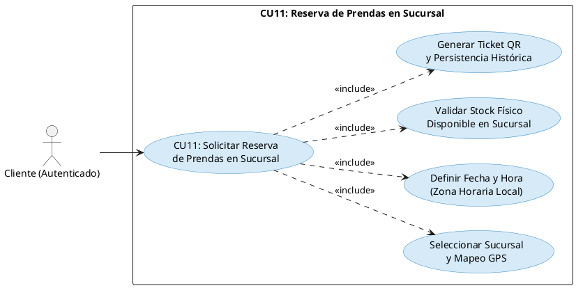
```plantuml
@startuml CU11_Solicitar_Reserva
left to right direction
skinparam usecase {
  BackgroundColor #D6EAF8
  BorderColor #2E86C1
}

actor "Cliente (Autenticado)" as Cliente

rectangle "CU11: Reserva de Prendas en Sucursal" {
  usecase "CU11: Solicitar Reserva\nde Prendas en Sucursal" as CU11
  usecase "Seleccionar Sucursal\ny Mapeo GPS" as UC_Sucursal
  usecase "Definir Fecha y Hora\n(Zona Horaria Local)" as UC_Fecha
  usecase "Validar Stock Físico\nDisponible en Sucursal" as UC_Validar
  usecase "Generar Ticket QR\ny Persistencia Histórica" as UC_QR
}

Cliente --> CU11
CU11 ..> UC_Sucursal : <<include>>
CU11 ..> UC_Fecha : <<include>>
CU11 ..> UC_Validar : <<include>>
CU11 ..> UC_QR : <<include>>
@enduml
```

#### b) Prototipo de Interfaz de Usuario (UI Wireframe)

- **Pantalla de Reserva (`/reservar`):**
  - Selector dinámico de sucursales con dirección, ciudad y capacidad de probadores inteligentes. El usuario debe elegir explícitamente la sucursal (sin asignaciones forzadas por defecto).
  - Selector de fecha de visita y hora programada respetando la zona horaria local (-04:00 Bolivia).
  - Catálogo de prendas seleccionadas con confirmación de stock físico en la sucursal elegida.
  - Botón de acción: "Confirmar y Generar Ticket QR de Reserva".
- **Pantalla de Tickets de Reserva (`/mis-tickets`):**
  - Historial completo y acumulativo de tickets generados por el cliente (no solo el último generado).
  - Visualización del código QR generado en formato Base64 Data URI y código de verificación alfanumérico legible (`qr_texto`).
  - Botones de acción: Descargar Ticket y Enviar a WhatsApp.

#### c) Tabla Detalle del Caso de Uso

| Atributo                | Detalle de la Especificación                                                                                                                                                                                                                                                                                                                                                                                                                                                                                                                                                                                                                     |
| ----------------------- | ------------------------------------------------------------------------------------------------------------------------------------------------------------------------------------------------------------------------------------------------------------------------------------------------------------------------------------------------------------------------------------------------------------------------------------------------------------------------------------------------------------------------------------------------------------------------------------------------------------------------------------------------ |
| **Identificador**       | CU11                                                                                                                                                                                                                                                                                                                                                                                                                                                                                                                                                                                                                                             |
| **Nombre**              | Solicitar Reserva de Prendas en Sucursal                                                                                                                                                                                                                                                                                                                                                                                                                                                                                                                                                                                                         |
| **Actores**             | Cliente Final (Autenticado).                                                                                                                                                                                                                                                                                                                                                                                                                                                                                                                                                                                                                     |
| **Propósito**           | Permitir al cliente apartar prendas para probárselas físicamente en una sucursal física determinada en un horario específico.                                                                                                                                                                                                                                                                                                                                                                                                                                                                                                                    |
| **Tipo**                | Primario / Omnicanal.                                                                                                                                                                                                                                                                                                                                                                                                                                                                                                                                                                                                                            |
| **Precondiciones**      | 1. Cliente con sesión activa (JWT válido). 2. Prendas seleccionadas con existencias físicas en la sucursal destino. 3. La sucursal debe encontrarse en estado OPERATIVA.                                                                                                                                                                                                                                                                                                                                                                                                                                                                         |
| **Postcondiciones**     | 1. Se registra la entidad `Reserva` con estado `PENDIENTE`. 2. Se asocian sus `ReservaDetalle` con productos, tallas y colores. 3. Se genera la imagen QR con token único UUID y el ticket se guarda en el historial del cliente. 4. Se aparta temporalmente el stock reservado en la tabla `inventario` (stock_reservado += cantidad).                                                                                                                                                                                                                                                                                                          |
| **Flujo Principal**     | 1. El cliente accede al módulo de reservas desde el catálogo o la barra de navegación. 2. Elige la sucursal física de su preferencia con dirección y GPS. 3. Define la fecha y hora estimada de visita respetando el huso horario local (-04:00). 4. El sistema valida la disponibilidad de stock en dicha sucursal con bloqueo pesimista (`SELECT ... FOR UPDATE`). 5. El cliente confirma la operación. 6. El backend persiste la reserva, genera el código QR con `qrcode` + `Pillow` en Base64 y devuelve el identificador al frontend. 7. El cliente visualiza su ticket en "Mis Tickets QR" con opción a consultarlo en cualquier momento. |
| **Flujos Alternativos** | **4a. Stock insuficiente:** El sistema informa que no existe la cantidad solicitada de la variante en la sucursal elegida e invita a seleccionar otra tienda o reducir cantidades. **3a. Sucursal en mantenimiento:** El sistema oculta sucursales con estado distinto a OPERATIVA del selector.                                                                                                                                                                                                                                                                                                                                                 |

---

### 1.3.2 Caso de Uso CU12: Preparar y Atender Reserva Presencial

#### a) Diseño del Caso de Uso (PlantUML)

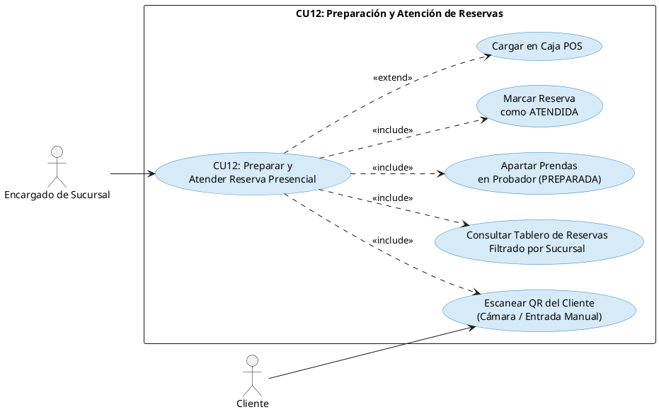
```plantuml
@startuml CU12_Preparar_Reserva
left to right direction
skinparam usecase {
  BackgroundColor #D6EAF8
  BorderColor #2E86C1
}

actor "Encargado de Sucursal" as Encargado
actor "Cliente" as Cliente

rectangle "CU12: Preparación y Atención de Reservas" {
  usecase "CU12: Preparar y\nAtender Reserva Presencial" as CU12
  usecase "Consultar Tablero de Reservas\nFiltrado por Sucursal" as UC_Tablero
  usecase "Apartar Prendas\nen Probador (PREPARADA)" as UC_Apartar
  usecase "Escanear QR del Cliente\n(Cámara / Entrada Manual)" as UC_Escanear
  usecase "Marcar Reserva\ncomo ATENDIDA" as UC_Atender
  usecase "Cargar en Caja POS" as UC_POS
}

Encargado --> CU12
Cliente --> UC_Escanear
CU12 ..> UC_Tablero : <<include>>
CU12 ..> UC_Apartar : <<include>>
CU12 ..> UC_Escanear : <<include>>
CU12 ..> UC_Atender : <<include>>
CU12 ..> UC_POS : <<extend>>
@enduml
```

#### b) Prototipo de Interfaz de Usuario (UI Wireframe)

- **Tablero del Encargado (`/encargado/reservas`):**
  - Filtro estricto por la sucursal asignada al encargado (`id_sucursal`).
  - Métricas rápidas: Total del Día, Pendientes de Preparación, Listas en Probador y Atendidas.
  - Tarjetas de reserva con prendas, tallas, colores y datos de contacto del cliente.
  - Botón "Apartar en Probador" para transicionar el estado a `PREPARADA`.
  - Módulo de escaneo interactivo de código QR con soporte para cámara web/móvil y entrada manual del token (`qr_texto`).
  - Confirmación inmediata con alerta y botón de acceso rápido para "Facturar en Caja POS (CU15)".

#### c) Tabla Detalle del Caso de Uso

| Atributo                | Detalle de la Especificación                                                                                                                                                                                                                                                                                                                                                                                                                                                                                                                                                      |
| ----------------------- | --------------------------------------------------------------------------------------------------------------------------------------------------------------------------------------------------------------------------------------------------------------------------------------------------------------------------------------------------------------------------------------------------------------------------------------------------------------------------------------------------------------------------------------------------------------------------------- |
| **Identificador**       | CU12                                                                                                                                                                                                                                                                                                                                                                                                                                                                                                                                                                              |
| **Nombre**              | Preparar y Atender Reserva Presencial                                                                                                                                                                                                                                                                                                                                                                                                                                                                                                                                             |
| **Actores**             | Encargado de Sucursal, Cliente Final.                                                                                                                                                                                                                                                                                                                                                                                                                                                                                                                                             |
| **Propósito**           | Gestionar el ciclo de vida físico de la reserva en tienda, desde el apartado físico de prendas en probadores hasta la llegada y confirmación presencial del cliente.                                                                                                                                                                                                                                                                                                                                                                                                              |
| **Tipo**                | Primario / Presencial.                                                                                                                                                                                                                                                                                                                                                                                                                                                                                                                                                            |
| **Precondiciones**      | 1. El encargado cuenta con rol `ENCARGADO_SUCURSAL` o `ADMINISTRADOR` y sucursal física asignada. 2. Existen reservas en estado `PENDIENTE` o `PREPARADA` asociadas a dicha tienda.                                                                                                                                                                                                                                                                                                                                                                                               |
| **Postcondiciones**     | 1. La reserva cambia de estado a `PREPARADA` al apartarse en probador. 2. Al escanear el QR válido, cambia a `ATENDIDA`. 3. La reserva queda lista para su facturación en mostrador (CU15).                                                                                                                                                                                                                                                                                                                                                                                       |
| **Flujo Principal**     | 1. El encargado ingresa a su tablero operativo de reservas. 2. Consulta las reservas en estado `PENDIENTE`. 3. Aparta las prendas en el probador inteligente y presiona "Apartar en Probador" (estado cambia a `PREPARADA`). 4. El cliente se presenta en tienda y muestra su ticket QR desde su teléfono móvil. 5. El encargado activa el lector de QR o digita el código alfanumérico. 6. El sistema valida la pertenencia de la reserva a esa sucursal y la marca como `ATENDIDA`. 7. El encargado puede derivar las prendas al cajero de mostrador para venta directa en POS. |
| **Flujos Alternativos** | **6a. QR inválido o de otra sucursal:** El sistema rechaza la lectura informando que el ticket no corresponde a esta tienda o que ya fue atendido previamente. **6b. Reserva ya vencida:** El sistema informa que la reserva ha expirado y las prendas han sido devueltas al stock general.                                                                                                                                                                                                                                                                                       |

---

### 1.3.3 Caso de Uso CU13: Administrar Carrito de Compras Omnicanal

#### a) Diseño del Caso de Uso (PlantUML)

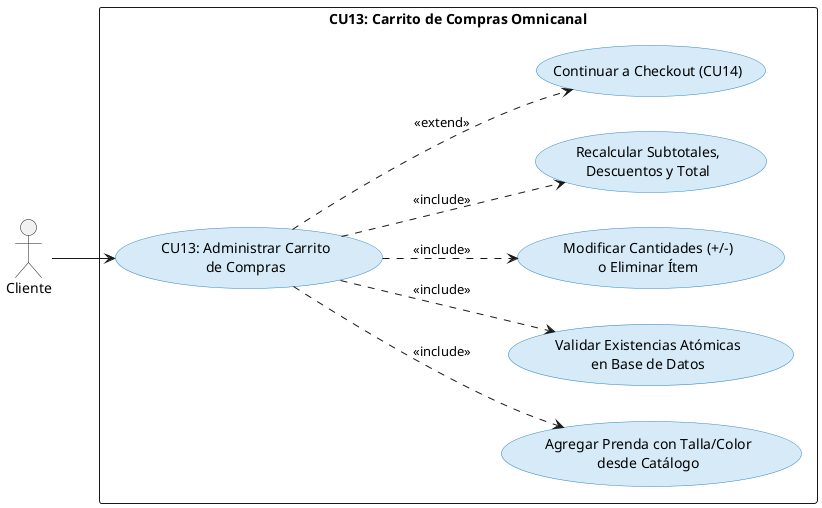
```plantuml
@startuml CU13_Administrar_Carrito
left to right direction
skinparam usecase {
  BackgroundColor #D6EAF8
  BorderColor #2E86C1
}

actor "Cliente" as Cliente

rectangle "CU13: Carrito de Compras Omnicanal" {
  usecase "CU13: Administrar Carrito\nde Compras" as CU13
  usecase "Agregar Prenda con Talla/Color\ndesde Catálogo" as UC_Agregar
  usecase "Validar Existencias Atómicas\nen Base de Datos" as UC_Validar
  usecase "Modificar Cantidades (+/-)\no Eliminar Ítem" as UC_Modificar
  usecase "Recalcular Subtotales,\nDescuentos y Total" as UC_Calcular
  usecase "Continuar a Checkout (CU14)" as UC_Checkout
}

Cliente --> CU13
CU13 ..> UC_Agregar : <<include>>
CU13 ..> UC_Validar : <<include>>
CU13 ..> UC_Modificar : <<include>>
CU13 ..> UC_Calcular : <<include>>
CU13 ..> UC_Checkout : <<extend>>
@enduml
```

#### b) Prototipo de Interfaz de Usuario (UI Wireframe)

- **Gaveta Lateral Desplegable (Cart Drawer):**
  - Acceso instantáneo desde cualquier vista mediante el icono de bolsa en la barra superior con badge numérico reactivo.
  - Listado de ítems con imagen en miniatura, SKU base, nombre del producto, talla seleccionada, color y precio unitario.
  - Controles incrementales interactivos (`+` / `-`) con bloqueo automático al alcanzar el stock físico máximo disponible.
  - Botón de eliminación directa por ítem con animación suave.
  - Resumen financiero en el pie del carrito: Subtotal en Bs., costo de envío preliminar y Total.
  - Botón de llamada a la acción: "Proceder al Pago (Checkout) -> CU14".

#### c) Tabla Detalle del Caso de Uso

| Atributo                | Detalle de la Especificación                                                                                                                                                                                                                                                                                                                                                                                                                                      |
| ----------------------- | ----------------------------------------------------------------------------------------------------------------------------------------------------------------------------------------------------------------------------------------------------------------------------------------------------------------------------------------------------------------------------------------------------------------------------------------------------------------- |
| **Identificador**       | CU13                                                                                                                                                                                                                                                                                                                                                                                                                                                              |
| **Nombre**              | Administrar Carrito de Compras Omnicanal                                                                                                                                                                                                                                                                                                                                                                                                                          |
| **Actores**             | Cliente Final.                                                                                                                                                                                                                                                                                                                                                                                                                                                    |
| **Propósito**           | Permitir al cliente acumular y modificar los artículos que desea comprar en línea antes de emitir la orden formal.                                                                                                                                                                                                                                                                                                                                                |
| **Tipo**                | Primario / E-Commerce.                                                                                                                                                                                                                                                                                                                                                                                                                                            |
| **Precondiciones**      | 1. Cliente autenticado navegando por el catálogo de prendas. 2. Existencias disponibles en inventario.                                                                                                                                                                                                                                                                                                                                                            |
| **Postcondiciones**     | 1. La bolsa de compras se almacena de forma persistente en la tabla `carritos` y `carrito_items`. 2. No se pierde al recargar la página. 3. Los subtotales y totales quedan recalculados.                                                                                                                                                                                                                                                                         |
| **Flujo Principal**     | 1. El cliente selecciona una prenda, escoge talla y color, y presiona "Añadir a la Bolsa". 2. El sistema envía una petición HTTP atómica al backend validando existencias. 3. El carrito se actualiza y la gaveta lateral se despliega automáticamente confirmando la adición. 4. El cliente puede modificar cantidades o remover prendas. 5. El total se recalcula dinámicamente. 6. El cliente hace clic en "Proceder al Pago" para iniciar el checkout (CU14). |
| **Flujos Alternativos** | **2a. Stock insuficiente:** El sistema rechaza la adición e informa que no hay existencias suficientes para la variante elegida. **4a. Cantidad excede stock:** El botón `+` se desactiva automáticamente al llegar al límite disponible.                                                                                                                                                                                                                         |

---

### 1.3.4 Caso de Uso CU14: Procesar Compra Digital y Checkout

#### a) Diseño del Caso de Uso (PlantUML)

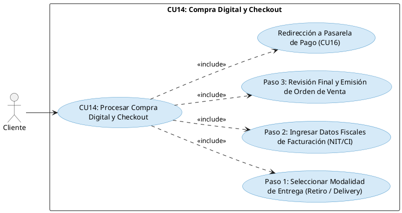
```plantuml
@startuml CU14_Checkout
left to right direction
skinparam usecase {
  BackgroundColor #D6EAF8
  BorderColor #2E86C1
}

actor "Cliente" as Cliente

rectangle "CU14: Compra Digital y Checkout" {
  usecase "CU14: Procesar Compra\nDigital y Checkout" as CU14
  usecase "Paso 1: Seleccionar Modalidad\nde Entrega (Retiro / Delivery)" as UC_Entrega
  usecase "Paso 2: Ingresar Datos Fiscales\nde Facturación (NIT/CI)" as UC_Factura
  usecase "Paso 3: Revisión Final y Emisión\nde Orden de Venta" as UC_Orden
  usecase "Redirección a Pasarela\nde Pago (CU16)" as UC_Pago
}

Cliente --> CU14
CU14 ..> UC_Entrega : <<include>>
CU14 ..> UC_Factura : <<include>>
CU14 ..> UC_Orden : <<include>>
CU14 ..> UC_Pago : <<include>>
@enduml
```

#### b) Prototipo de Interfaz de Usuario (UI Wireframe)

- **Flujo Guiado Wizard (`/checkout`):**
  - **Paso 1 (Logística de Entrega):** Pestañas para elegir entre "Retiro Gratuito en Sucursal" (con selector de tienda) o "Envío a Domicilio / Delivery" (con dirección, teléfono y cálculo de tarifa por geolocalización Haversine).
  - **Paso 2 (Facturación Fiscal):** Formulario para NIT o Carnet de Identidad y Razón Social, con opción rápida de "Usar mis datos de usuario registrado".
  - **Paso 3 (Revisión Final):** Cuadro de mando resumen con lista de prendas, desglose financiero (Subtotal, Costo de Envío y Total en Bs.) y botón "Confirmar Orden y Proceder al Pago".
- **Pantalla de Confirmación (`/checkout/confirmacion/:id`):** Resumen visual de la orden recién creada con número correlativo oficial y enlace directo a la pasarela electrónica de pago (`/pagos/orden/:id`).

#### c) Tabla Detalle del Caso de Uso

| Atributo                | Detalle de la Especificación                                                                                                                                                                                                                                                                                                                                                                                                                                                                                                                                                                                                                                              |
| ----------------------- | ------------------------------------------------------------------------------------------------------------------------------------------------------------------------------------------------------------------------------------------------------------------------------------------------------------------------------------------------------------------------------------------------------------------------------------------------------------------------------------------------------------------------------------------------------------------------------------------------------------------------------------------------------------------------- |
| **Identificador**       | CU14                                                                                                                                                                                                                                                                                                                                                                                                                                                                                                                                                                                                                                                                      |
| **Nombre**              | Procesar Compra Digital y Checkout                                                                                                                                                                                                                                                                                                                                                                                                                                                                                                                                                                                                                                        |
| **Actores**             | Cliente Final.                                                                                                                                                                                                                                                                                                                                                                                                                                                                                                                                                                                                                                                            |
| **Propósito**           | Formalizar los términos logísticos y fiscales de la compra, generando la orden de venta definitiva en base de datos.                                                                                                                                                                                                                                                                                                                                                                                                                                                                                                                                                      |
| **Tipo**                | Primario / Crítico Transaccional.                                                                                                                                                                                                                                                                                                                                                                                                                                                                                                                                                                                                                                         |
| **Precondiciones**      | 1. Carrito con al menos un ítem activo. 2. Usuario autenticado con sesión JWT válida.                                                                                                                                                                                                                                                                                                                                                                                                                                                                                                                                                                                     |
| **Postcondiciones**     | 1. Se crea el registro en `ordenes_venta` con número correlativo único (estado: `PENDIENTE_PAGO`). 2. Se asocian sus `ordenes_detalle`. 3. Se vacía el carrito del cliente. 4. Se deriva a la pasarela de pago (CU16).                                                                                                                                                                                                                                                                                                                                                                                                                                                    |
| **Flujo Principal**     | 1. El cliente accede al checkout desde la bolsa de compras. 2. Selecciona la modalidad de entrega (Retiro en Sucursal o Delivery a Domicilio). 3. Si eligió Delivery, el sistema calcula la tarifa mediante el algoritmo esférico Haversine con coordenadas GPS de la sucursal despacho y la dirección destino. 4. Proporciona o valida sus datos de facturación fiscal (NIT/CI y Razón Social). 5. Revisa el resumen financiero consolidado (Subtotal + Envío = Total). 6. Presiona "Confirmar Orden y Proceder al Pago". 7. El backend genera la orden de venta con número de factura correlativo único y el frontend redirige a la pasarela electrónica Stripe (CU16). |
| **Flujos Alternativos** | **2a. Stock agotado durante checkout:** El backend valida atómicamente el stock y rechaza la orden con HTTP 400 si algún ítem ya no está disponible. **3a. Dirección de Delivery fuera de cobertura:** El sistema informa que la distancia excede el radio de cobertura configurable.                                                                                                                                                                                                                                                                                                                                                                                     |

---

### 1.3.5 Caso de Uso CU15: Registrar Venta Presencial en Caja (POS)

#### a) Diseño del Caso de Uso (PlantUML)

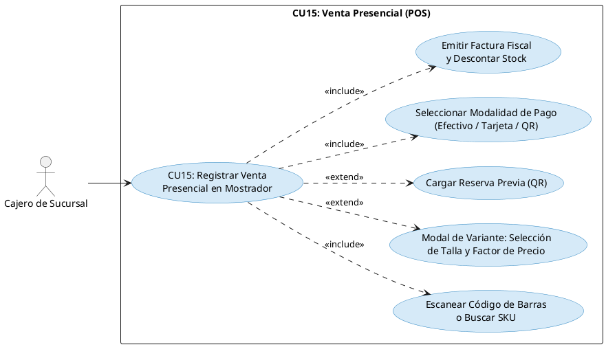
```plantuml
@startuml CU15_Venta_POS
left to right direction
skinparam usecase {
  BackgroundColor #D6EAF8
  BorderColor #2E86C1
}

actor "Cajero de Sucursal" as Cajero

rectangle "CU15: Venta Presencial (POS)" {
  usecase "CU15: Registrar Venta\nPresencial en Mostrador" as CU15
  usecase "Escanear Código de Barras\no Buscar SKU" as UC_Escanear
  usecase "Modal de Variante: Selección\nde Talla y Factor de Precio" as UC_Variante
  usecase "Cargar Reserva Previa (QR)" as UC_Reserva
  usecase "Seleccionar Modalidad de Pago\n(Efectivo / Tarjeta / QR)" as UC_Pago
  usecase "Emitir Factura Fiscal\ny Descontar Stock" as UC_Emitir
}

Cajero --> CU15
CU15 ..> UC_Escanear : <<include>>
CU15 ..> UC_Variante : <<extend>>
CU15 ..> UC_Reserva : <<extend>>
CU15 ..> UC_Pago : <<include>>
CU15 ..> UC_Emitir : <<include>>
@enduml
```

#### b) Prototipo de Interfaz de Usuario (UI Wireframe)

- **Terminal Punto de Venta (`/caja/pos` o `/pos`):**
  - **Barra Superior:** Identificador de sucursal física, cajero activo en turno y estado de caja abierta.
  - **Catálogo de Prendas Disponibles en Sucursal:** Cuadrícula compacta y estética (tarjetas de altura estandarizada de 230px, sin deformaciones alargadas) con renderizado instantáneo desde el primer segundo gracias a detección de cambios forzada.
  - **Modal de Selección de Variante y Precios Dinámicos:**
    - Selector interactivo de tallas con factores de ajuste porcentual visibles (S: -5%, M: Base, L: +5%, XL: +10%, XXL: +15%).
    - Controles de cantidad con recálculo dinámico en tiempo real del precio unitario y del subtotal acumulado antes de agregar al ticket.
  - **Ticket Virtual de Mostrador:** Listado de ítems con botones rápidos (+ / - / eliminar), subtotal, total en Bs., datos del cliente (NIT/CI, Razón Social o "Cliente Mostrador").
  - **Módulo de Pago Rápido:** Selección entre Efectivo (con atajos de billetes de Bs. 50, 100, 200 y cálculo automático de cambio a devolver), Tarjeta POS o QR Simple BCB.
  - **Impresión de Ticket Fiscal:** Modal de comprobante térmico con datos fiscales, detalle de prendas, firma de cajero y botón de impresión directa.

#### c) Tabla Detalle del Caso de Uso

| Atributo                | Detalle de la Especificación                                                                                                                                                                                                                                                                                                                                                                                                                                                                                                                                                                                                                                                                                                                                           |
| ----------------------- | ---------------------------------------------------------------------------------------------------------------------------------------------------------------------------------------------------------------------------------------------------------------------------------------------------------------------------------------------------------------------------------------------------------------------------------------------------------------------------------------------------------------------------------------------------------------------------------------------------------------------------------------------------------------------------------------------------------------------------------------------------------------------- |
| **Identificador**       | CU15                                                                                                                                                                                                                                                                                                                                                                                                                                                                                                                                                                                                                                                                                                                                                                   |
| **Nombre**              | Registrar Venta Presencial en Caja (POS)                                                                                                                                                                                                                                                                                                                                                                                                                                                                                                                                                                                                                                                                                                                               |
| **Actores**             | Cajero de Sucursal, Administrador.                                                                                                                                                                                                                                                                                                                                                                                                                                                                                                                                                                                                                                                                                                                                     |
| **Propósito**           | Cobrar y registrar ventas en mostrador físico, soportando escaneo de productos, conversión de reservas presenciales, recálculo dinámico de precios por talla y descuento en Kardex.                                                                                                                                                                                                                                                                                                                                                                                                                                                                                                                                                                                    |
| **Tipo**                | Primario / Crítico Transaccional.                                                                                                                                                                                                                                                                                                                                                                                                                                                                                                                                                                                                                                                                                                                                      |
| **Precondiciones**      | 1. Cajero autenticado con turno activo y sucursal asignada. 2. Inventario físico en la sucursal. 3. Al menos un método de pago habilitado en CU17.                                                                                                                                                                                                                                                                                                                                                                                                                                                                                                                                                                                                                     |
| **Postcondiciones**     | 1. Se registra la venta como orden facturada en estado `PAGADO` con canal `POS`. 2. Se emite el ticket fiscal con número correlativo. 3. Se descuenta el stock físico en la sucursal. 4. Se asienta el movimiento de tipo `VENTA` en la tabla `kardex_movimientos`.                                                                                                                                                                                                                                                                                                                                                                                                                                                                                                    |
| **Flujo Principal**     | 1. El cajero visualiza el catálogo de prendas o escanea un código de barras SKU. 2. Al pulsar una prenda, se despliega el modal de variantes donde selecciona talla y cantidad, recalculándose el precio unitario y subtotal al instante. 3. Presiona "Agregar al Ticket". 4. Opcionalmente, ingresa el código QR de una reserva previa (CU12) para cargar sus ítems al ticket. 5. Ingresa NIT/CI del cliente o selecciona "Cliente Mostrador". 6. Elige método de pago (si es Efectivo, ingresa el dinero recibido y el sistema calcula el vuelto). 7. Presiona "Cobrar e Imprimir Ticket". 8. El sistema valida que el método de pago esté habilitado (CU17), descuenta el stock, asienta la transacción en Kardex y despliega el ticket fiscal listo para imprimir. |
| **Flujos Alternativos** | **6a. Método de pago deshabilitado:** El sistema rechaza la selección e informa que el canal ha sido desactivado por administración (CU17). **2a. Stock insuficiente:** Se alerta que no quedan existencias de esa variante en la sucursal del cajero.                                                                                                                                                                                                                                                                                                                                                                                                                                                                                                                 |

---

### 1.3.6 Caso de Uso CU16: Procesar Pago con Pasarela Electrónica

#### a) Diseño del Caso de Uso (PlantUML)

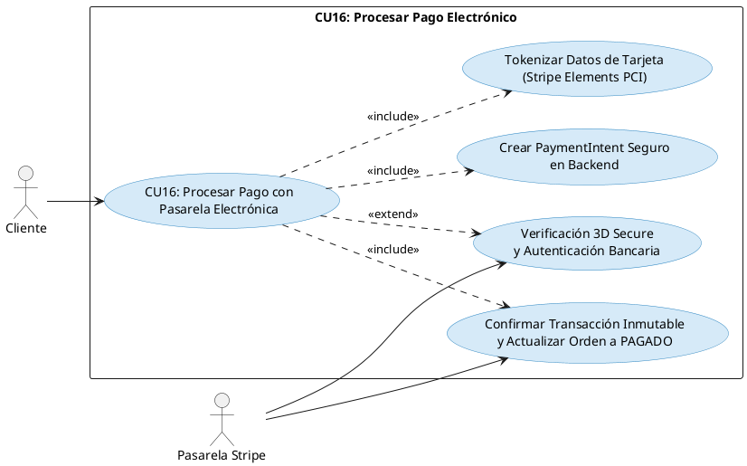
```plantuml
@startuml CU16_Procesar_Pago
left to right direction
skinparam usecase {
  BackgroundColor #D6EAF8
  BorderColor #2E86C1
}

actor "Cliente" as Cliente
actor "Pasarela Stripe" as Pasarela

rectangle "CU16: Procesar Pago Electrónico" {
  usecase "CU16: Procesar Pago con\nPasarela Electrónica" as CU16
  usecase "Crear PaymentIntent Seguro\nen Backend" as UC_Intent
  usecase "Tokenizar Datos de Tarjeta\n(Stripe Elements PCI)" as UC_Token
  usecase "Verificación 3D Secure\ny Autenticación Bancaria" as UC_3D
  usecase "Confirmar Transacción Inmutable\ny Actualizar Orden a PAGADO" as UC_Confirmar
}

Cliente --> CU16
Pasarela --> UC_3D
Pasarela --> UC_Confirmar
CU16 ..> UC_Intent : <<include>>
CU16 ..> UC_Token : <<include>>
CU16 ..> UC_3D : <<extend>>
CU16 ..> UC_Confirmar : <<include>>
@enduml
```

#### b) Prototipo de Interfaz de Usuario (UI Wireframe)

- **Pantalla de Cobro Seguro (`/pagos/orden/:id`):**
  - Columna izquierda: Resumen completo de la orden con prendas, tallas, colores, subtotal, costo de envío y total a pagar en Bs.
  - Columna derecha: Formulario embebido Stripe Elements estilizado en tema oscuro con validación en tiempo real del número de tarjeta, fecha de vencimiento (MM/AA) y código CVC.
  - Campo de Nombre del Titular de la Tarjeta.
  - Botón interactivo: "Pagar Bs. X.XX con Tarjeta".
  - Pantalla de éxito post-pago: Resumen con ID de transacción Stripe, últimos 4 dígitos de la tarjeta, fecha/hora y botón directo para **"Ver Seguimiento (CU18)"**.

#### c) Tabla Detalle del Caso de Uso

| Atributo                | Detalle de la Especificación                                                                                                                                                                                                                                                                                                                                                                                                                                                                                                                                                                                                                                         |
| ----------------------- | -------------------------------------------------------------------------------------------------------------------------------------------------------------------------------------------------------------------------------------------------------------------------------------------------------------------------------------------------------------------------------------------------------------------------------------------------------------------------------------------------------------------------------------------------------------------------------------------------------------------------------------------------------------------- |
| **Identificador**       | CU16                                                                                                                                                                                                                                                                                                                                                                                                                                                                                                                                                                                                                                                                 |
| **Nombre**              | Procesar Pago con Pasarela Electrónica                                                                                                                                                                                                                                                                                                                                                                                                                                                                                                                                                                                                                               |
| **Actores**             | Cliente Final, Pasarela Externa (Stripe Sandbox).                                                                                                                                                                                                                                                                                                                                                                                                                                                                                                                                                                                                                    |
| **Propósito**           | Realizar el cobro electrónico de una orden de venta de forma segura y tokenizada bajo estándares PCI-DSS.                                                                                                                                                                                                                                                                                                                                                                                                                                                                                                                                                            |
| **Tipo**                | Primario / Seguridad Financiera.                                                                                                                                                                                                                                                                                                                                                                                                                                                                                                                                                                                                                                     |
| **Precondiciones**      | 1. Orden de venta en estado `PENDIENTE_PAGO`. 2. Método Stripe habilitado en `metodos_pago` (CU17). 3. Claves API de Stripe configuradas en el backend.                                                                                                                                                                                                                                                                                                                                                                                                                                                                                                              |
| **Postcondiciones**     | 1. Se registra la transacción inmutable en `transacciones_pago` con el `payment_intent_id` de Stripe, monto, últimos 4 dígitos y marca de tarjeta. 2. La orden transiciona a estado de pago `PAGADO`. 3. El estado logístico avanza a `PREPARACION` si la modalidad es `DELIVERY`.                                                                                                                                                                                                                                                                                                                                                                                   |
| **Flujo Principal**     | 1. El cliente es derivado a la pantalla de pago de su orden. 2. El backend genera un `PaymentIntent` contra la API de Stripe en centavos y devuelve el `client_secret`. 3. El cliente ingresa los datos de su tarjeta mediante los elementos seguros de Stripe. 4. El frontend envía los datos directamente a Stripe para tokenización sin tocar el servidor de FashionStore (cero almacenamiento PCI). 5. Si se requiere, se ejecuta el desafío bancario 3D Secure. 6. Al confirmarse el cobro, el backend asienta la transacción inmutable en la base de datos. 7. El cliente visualiza la pantalla de confirmación con enlace directo al tracking en vivo (CU18). |
| **Flujos Alternativos** | **5a. Tarjeta rechazada:** Stripe devuelve error y el sistema muestra el motivo específico (fondos insuficientes, tarjeta expirada, etc.) sin revelar datos sensibles. **2a. Pasarela deshabilitada:** El sistema rechaza la operación con HTTP 400 informando que Stripe no está habilitado por administración.                                                                                                                                                                                                                                                                                                                                                     |

---

### 1.3.7 Caso de Uso CU17: Gestionar Tipos y Medios de Cobro

#### a) Diseño del Caso de Uso (PlantUML)

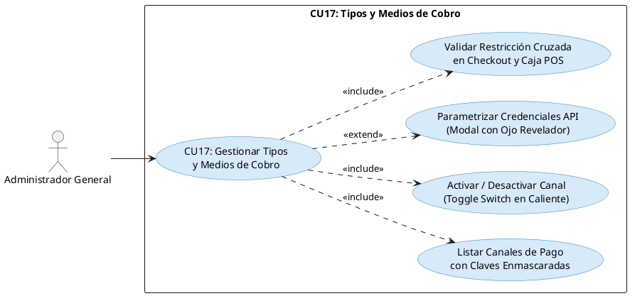
```plantuml
@startuml CU17_Medios_Cobro
left to right direction
skinparam usecase {
  BackgroundColor #D6EAF8
  BorderColor #2E86C1
}

actor "Administrador General" as Admin

rectangle "CU17: Tipos y Medios de Cobro" {
  usecase "CU17: Gestionar Tipos\ny Medios de Cobro" as CU17
  usecase "Listar Canales de Pago\ncon Claves Enmascaradas" as UC_Listar
  usecase "Activar / Desactivar Canal\n(Toggle Switch en Caliente)" as UC_Toggle
  usecase "Parametrizar Credenciales API\n(Modal con Ojo Revelador)" as UC_Param
  usecase "Validar Restricción Cruzada\nen Checkout y Caja POS" as UC_Restriccion
}

Admin --> CU17
CU17 ..> UC_Listar : <<include>>
CU17 ..> UC_Toggle : <<include>>
CU17 ..> UC_Param : <<extend>>
CU17 ..> UC_Restriccion : <<include>>
@enduml
```

#### b) Prototipo de Interfaz de Usuario (UI Wireframe)

- **Panel Administrativo (`/admin/pagos-config`):**
  - **Métricas Superiores:** Total de Canales Registrados, Canales Habilitados, Pasarelas Digitales y Canales Físicos.
  - **Cuadrícula de Canales:** Tarjetas para:
    1. `EFECTIVO` (Efectivo en Caja Mostrador - Físico).
    2. `TARJETA_POS` (Terminal POS / Tarjeta Física - Físico).
    3. `STRIPE` (Pasarela Digital Stripe - Digital Online).
    4. `QR_BCB` (Código QR Simple BCB - Omnicanal Interoperable).
  - **Controles por Tarjeta:**
    - Interruptor tipo iOS (Toggle Switch) para encender/apagar en tiempo real con confirmación Toast inmediata.
    - Bloque de parámetros de integración con valores enmascarados de seguridad (`sk_test_****dXFK`).
    - Botón "Configurar" para abrir el modal de parametrización.
  - **Modal de Credenciales:** Formulario reactivo con campos de tipo password e icono de ojo para alternar visibilidad de claves secretas. Guardado idempotente: si no se modifican los asteriscos, se preserva el secreto original en el backend.

#### c) Tabla Detalle del Caso de Uso

| Atributo                | Detalle de la Especificación                                                                                                                                                                                                                                                                                                                                                                                                                                                                                                                                        |
| ----------------------- | ------------------------------------------------------------------------------------------------------------------------------------------------------------------------------------------------------------------------------------------------------------------------------------------------------------------------------------------------------------------------------------------------------------------------------------------------------------------------------------------------------------------------------------------------------------------- |
| **Identificador**       | CU17                                                                                                                                                                                                                                                                                                                                                                                                                                                                                                                                                                |
| **Nombre**              | Gestionar Tipos y Medios de Cobro                                                                                                                                                                                                                                                                                                                                                                                                                                                                                                                                   |
| **Actores**             | Administrador General.                                                                                                                                                                                                                                                                                                                                                                                                                                                                                                                                              |
| **Propósito**           | Activar, desactivar y parametrizar los canales por los cuales la empresa recauda dinero, afectando en tiempo real al Checkout web y al POS.                                                                                                                                                                                                                                                                                                                                                                                                                         |
| **Tipo**                | Secundario / Configuración Administrativa.                                                                                                                                                                                                                                                                                                                                                                                                                                                                                                                          |
| **Precondiciones**      | 1. Usuario autenticado con rol `ADMINISTRADOR`.                                                                                                                                                                                                                                                                                                                                                                                                                                                                                                                     |
| **Postcondiciones**     | 1. Se actualiza la tabla `metodos_pago`. 2. Las pasarelas desactivadas son rechazadas inmediatamente en el Checkout (CU14/CU16) y en la Caja POS (CU15).                                                                                                                                                                                                                                                                                                                                                                                                            |
| **Flujo Principal**     | 1. El Administrador accede al módulo de Configuración Financiera (CU17). 2. Visualiza el estado operativo y métricas de todos los canales. 3. Activa o desactiva un canal mediante el Toggle Switch (el backend aplica un `PATCH` inmediato). 4. Si requiere actualizar llaves (ej. Stripe API Keys), presiona "Configurar". 5. El modal permite visualizar u ocultar claves sensibles mediante el icono de ojo. 6. El Administrador guarda los cambios; el backend persiste los parámetros y actualiza el cliente de Stripe en caliente sin reiniciar el servidor. |
| **Flujos Alternativos** | **3a. Desactivar el último canal activo:** El sistema advierte que no puede quedar sin ningún método de pago habilitado. **4a. Credenciales inválidas de Stripe:** El sistema valida la conexión con la API de Stripe antes de persistir las nuevas claves.                                                                                                                                                                                                                                                                                                         |

---

### 1.3.8 Caso de Uso CU18: Gestionar Despacho y Logística de Delivery

#### a) Diseño del Caso de Uso (PlantUML)

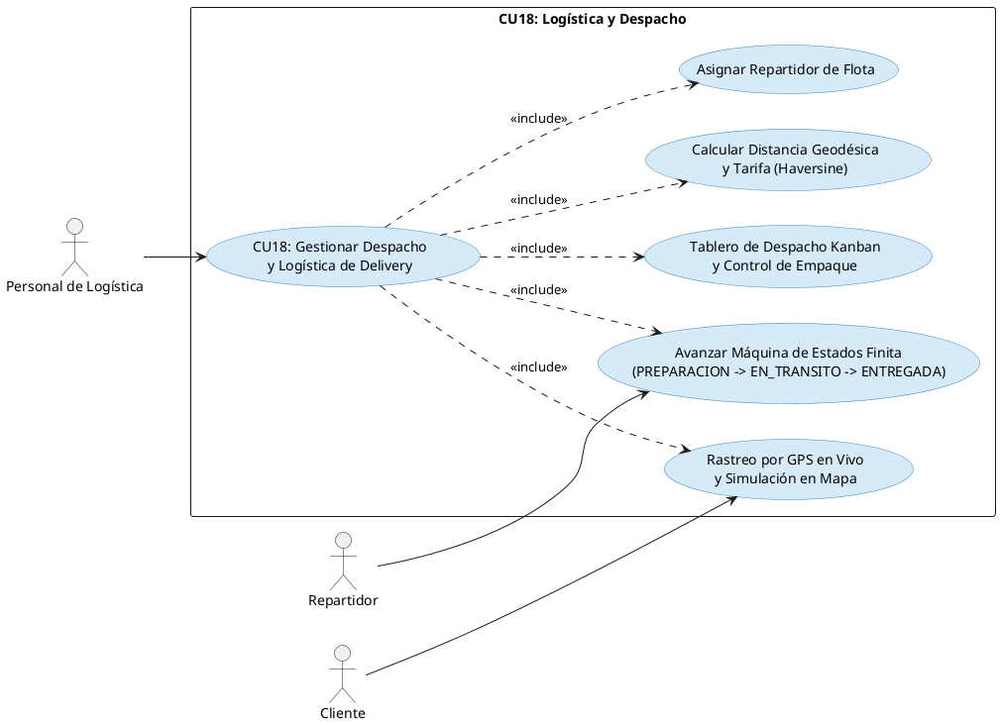
```plantuml
@startuml CU18_Logistica_Delivery
left to right direction
skinparam usecase {
  BackgroundColor #D6EAF8
  BorderColor #2E86C1
}

actor "Personal de Logística" as Logistica
actor "Repartidor" as Chofer
actor "Cliente" as Cliente

rectangle "CU18: Logística y Despacho" {
  usecase "CU18: Gestionar Despacho\ny Logística de Delivery" as CU18
  usecase "Tablero de Despacho Kanban\ny Control de Empaque" as UC_Tablero
  usecase "Calcular Distancia Geodésica\ny Tarifa (Haversine)" as UC_Haversine
  usecase "Asignar Repartidor de Flota" as UC_Asignar
  usecase "Avanzar Máquina de Estados Finita\n(PREPARACION -> EN_TRANSITO -> ENTREGADA)" as UC_Estados
  usecase "Rastreo por GPS en Vivo\ny Simulación en Mapa" as UC_Tracking
}

Logistica --> CU18
Chofer --> UC_Estados
Cliente --> UC_Tracking
CU18 ..> UC_Tablero : <<include>>
CU18 ..> UC_Haversine : <<include>>
CU18 ..> UC_Asignar : <<include>>
CU18 ..> UC_Estados : <<include>>
CU18 ..> UC_Tracking : <<include>>
@enduml
```

#### b) Prototipo de Interfaz de Usuario (UI Wireframe)

- **Tablero Logístico (`/logistica/dashboard`):**
  - Filtro por estado: `CREADA`, `PREPARACION`, `LISTO_DESPACHO`, `EN_TRANSITO`, `ENTREGADA`.
  - Lista de órdenes pagadas con detalle de prendas para empaque físico.
  - Selector para asignar chofer/repartidor con nombre y teléfono.
  - Botones de transición respetando la máquina de estados finita (emite HTTP 409 si se intenta un salto no permitido).
- **Pantalla de Seguimiento en Vivo (`/tracking/:id`):**
  - Cabecera con número de factura, cliente y fecha estimada.
  - Stepper visual de 4 etapas: **1. Orden Confirmada**, **2. En Preparación**, **3. En Camino**, **4. Entregada**.
  - Tarjeta de Repartidor Asignado con fotografía, nombre, teléfono y vehículo.
  - Tarjeta de Destino con coordenadas GPS (latitud/longitud) y dirección exacta.
  - Botón interactivo de simulación "Avanzar Estado" para demostración y evaluación académica en vivo.

#### c) Tabla Detalle del Caso de Uso

| Atributo                | Detalle de la Especificación                                                                                                                                                                                                                                                                                                                                                                                                                    |
| ----------------------- | ----------------------------------------------------------------------------------------------------------------------------------------------------------------------------------------------------------------------------------------------------------------------------------------------------------------------------------------------------------------------------------------------------------------------------------------------- |
| **Identificador**       | CU18                                                                                                                                                                                                                                                                                                                                                                                                                                            |
| **Nombre**              | Gestionar Despacho y Logística de Delivery                                                                                                                                                                                                                                                                                                                                                                                                      |
| **Actores**             | Personal de Logística, Repartidor, Cliente Final.                                                                                                                                                                                                                                                                                                                                                                                               |
| **Propósito**           | Coordinar el empaque, la asignación de choferes, el despacho físico y el seguimiento satelital de pedidos a domicilio.                                                                                                                                                                                                                                                                                                                          |
| **Tipo**                | Primario / Operativo Logístico.                                                                                                                                                                                                                                                                                                                                                                                                                 |
| **Precondiciones**      | 1. Orden de venta en estado `PAGADO` con modalidad de entrega `DELIVERY`. 2. Al menos un repartidor registrado como usuario con rol `LOGISTICA`.                                                                                                                                                                                                                                                                                                |
| **Postcondiciones**     | 1. La orden transiciona a `ENTREGADA` siguiendo la máquina de estados. 2. Se asientan las coordenadas geodésicas de destino, distancia calculada por Haversine y datos del repartidor asignado.                                                                                                                                                                                                                                                 |
| **Flujo Principal**     | 1. Logística recibe la orden pagada en estado `CREADA` o `PREPARACION`. 2. Se verifica el empaque de prendas y avanza a `LISTO_DESPACHO`. 3. Se asigna un repartidor disponible con sus datos de contacto. 4. El pedido pasa a `EN_TRANSITO`. 5. El cliente accede a `/tracking/:id` y visualiza la progresión del envío con mapa geodésico y datos del chofer. 6. El repartidor entrega el paquete y el pedido concluye en estado `ENTREGADA`. |
| **Flujos Alternativos** | **4a. Transición inválida en la máquina de estados:** El sistema responde con HTTP 409 Conflict si se intenta saltar de `CREADA` directamente a `EN_TRANSITO`, forzando el paso obligatorio por `PREPARACION` y `LISTO_DESPACHO`. **3a. Sin repartidores disponibles:** El sistema permite avanzar la orden a `LISTO_DESPACHO` pero advierte que no se ha asignado un chofer.                                                                   |

---

## 1.4 Estructurar Modelo de Casos de Uso (Ciclo 2)

El modelo global integra los 8 casos de uso del Ciclo 2 en perfecta sincronía con los actores del sistema:

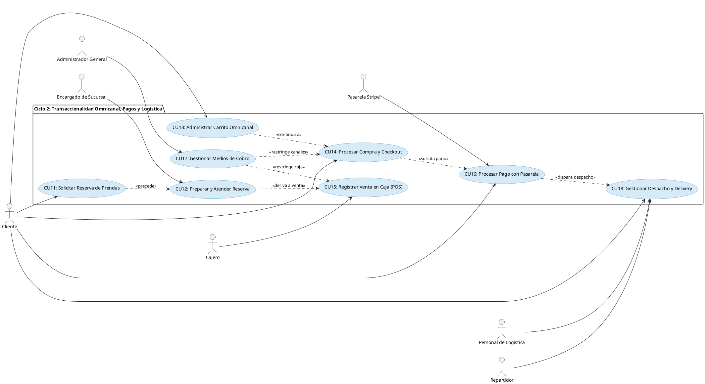
```plantuml
@startuml Estructurar_Caso_de_Uso_Ciclo2
left to right direction
skinparam usecase {
  BackgroundColor #D6EAF8
  BorderColor #2E86C1
}

actor "Cliente" as Cliente
actor "Encargado de Sucursal" as Encargado
actor "Cajero" as Cajero
actor "Administrador General" as Admin
actor "Personal de Logística" as Logistica
actor "Repartidor" as Delivery
actor "Pasarela Stripe" as Pasarela

package "Ciclo 2: Transaccionalidad Omnicanal, Pagos y Logística" {
  usecase "CU11: Solicitar Reserva de Prendas" as CU11
  usecase "CU12: Preparar y Atender Reserva" as CU12
  usecase "CU13: Administrar Carrito Omnicanal" as CU13
  usecase "CU14: Procesar Compra y Checkout" as CU14
  usecase "CU15: Registrar Venta en Caja (POS)" as CU15
  usecase "CU16: Procesar Pago con Pasarela" as CU16
  usecase "CU17: Gestionar Medios de Cobro" as CU17
  usecase "CU18: Gestionar Despacho y Delivery" as CU18
}

Cliente --> CU11
Cliente --> CU13
Cliente --> CU14
Cliente --> CU16
Cliente --> CU18

Encargado --> CU12
Cajero --> CU15
Pasarela --> CU16
Admin --> CU17
Logistica --> CU18
Delivery --> CU18

CU11 ..> CU12 : <<precede>>
CU12 ..> CU15 : <<deriva a venta>>
CU13 ..> CU14 : <<continua a>>
CU14 ..> CU16 : <<solicita pago>>
CU16 ..> CU18 : <<dispara despacho>>
CU17 ..> CU14 : <<restringe canales>>
CU17 ..> CU15 : <<restringe caja>>
@enduml
```

---

# 2. Flujo de Trabajo: Análisis

## 2.1 Análisis de Arquitectura

El análisis arquitectónico del Ciclo 2 extiende la base establecida en el Ciclo 1, incorporando los subsistemas transaccionales que materializan la cadena de valor comercial completa. Se mantiene la aplicación de los estereotipos de robustez de Ivar Jacobson:

- **Clases de Interfaz (`<<boundary>>`):** Encargadas de la interacción y comunicación directa con los actores humanos y externos (formularios de entrada, pantallas interactivas y endpoints API REST). Poseen atributos de captura visual y métodos de interacción (eventos de usuario).
- **Clases de Control (`<<control>>`):** Encargadas de orquestar la lógica de negocio, reglas algorítmicas, validaciones y transformaciones de dominio. Contienen exclusivamente métodos de negocio y NO poseen atributos propios, operando directamente sobre las entidades de datos.
- **Clases de Entidad (`<<entity>>`):** Representan la información persistente y los conceptos transaccionales del dominio (tablas, campos y registros de PostgreSQL).

### 2.1.1 Identificar Paquetes

- **Paquete 6: Reservas Presenciales (M10)**
  - Descripción: Gestión del ciclo de vida completo de visitas físicas a probadores de sucursal, incluyendo la generación de tickets QR con tokens UUID únicos, el apartado temporal de stock reservado, la coordinación operativa entre el cliente y el encargado de tienda, y la validación presencial mediante escaneo óptico o entrada manual del código QR.

- **Paquete 7: Venta Digital y Carrito (M11, M12)**
  - Descripción: Administración de la bolsa de compras persistente en base de datos, validación atómica de existencias contra la tabla de inventario en cada operación de adición/modificación, formalización del checkout guiado en 3 pasos (logística, facturación fiscal, revisión) y emisión de la orden de venta con número correlativo único.

- **Paquete 8: Punto de Venta POS (M13)**
  - Descripción: Facturación en mostrador físico con búsqueda ágil de prendas por código de barras SKU, selector interactivo de variantes con factores de ajuste de precio por talla, conversión de reservas presenciales a ventas directas, cobro multi-método (efectivo con cálculo de vuelto, tarjeta POS, QR BCB) y descuento inmutable en Kardex.

- **Paquete 9: Procesamiento de Pagos (M14, M15)**
  - Descripción: Integración completa con Stripe SDK (PaymentIntents con conversión a centavos, autenticación 3D Secure, tokenización PCI-DSS), registro de transacciones inmutables con metadatos de tarjeta (marca, últimos 4 dígitos), y panel administrativo de configuración de medios de cobro con toggle switches en tiempo real y enmascaramiento de claves API.

- **Paquete 10: Logística y Delivery (M19)**
  - Descripción: Máquina de estados finita estricta para envíos (CREADA -> PREPARACION -> LISTO_DESPACHO -> EN_TRANSITO -> ENTREGADA) con validación de transiciones que emite HTTP 409 ante saltos inválidos, asignación de choferes repartidores, cálculo de tarifas de envío mediante algoritmo esférico Haversine (R = 6371 km) y rastreo satelital GPS con stepper visual interactivo.

### 2.1.2 Relacionar paquetes y casos de uso

| Paquete de Análisis             | Casos de Uso Contenidos | Actores Asociados                       | Módulo Backend                               | Módulo Frontend                                       |
| ------------------------------- | ----------------------- | --------------------------------------- | -------------------------------------------- | ----------------------------------------------------- |
| **P6: Reservas Presenciales**   | CU11, CU12              | Cliente, Encargado de Sucursal          | `app.modules.reservas`                       | `app/pages/reservas`, `app/pages/encargado-dashboard` |
| **P7: Venta Digital y Carrito** | CU13, CU14              | Cliente Final                           | `app.modules.carrito`, `app.modules.ordenes` | `app/shared/carrito-sidebar`, `app/pages/checkout`    |
| **P8: Punto de Venta POS**      | CU15                    | Cajero, Administrador                   | `app.modules.pos`                            | `app/pages/pos`                                       |
| **P9: Pagos y Finanzas**        | CU16, CU17              | Cliente, Pasarela Stripe, Administrador | `app.modules.pagos`                          | `app/pages/pagos`, `app/pages/admin-pagos`            |
| **P10: Logística y Delivery**   | CU18                    | Personal Logística, Repartidor, Cliente | `app.modules.logistica`                      | `app/pages/logistica`, `app/pages/tracking`           |

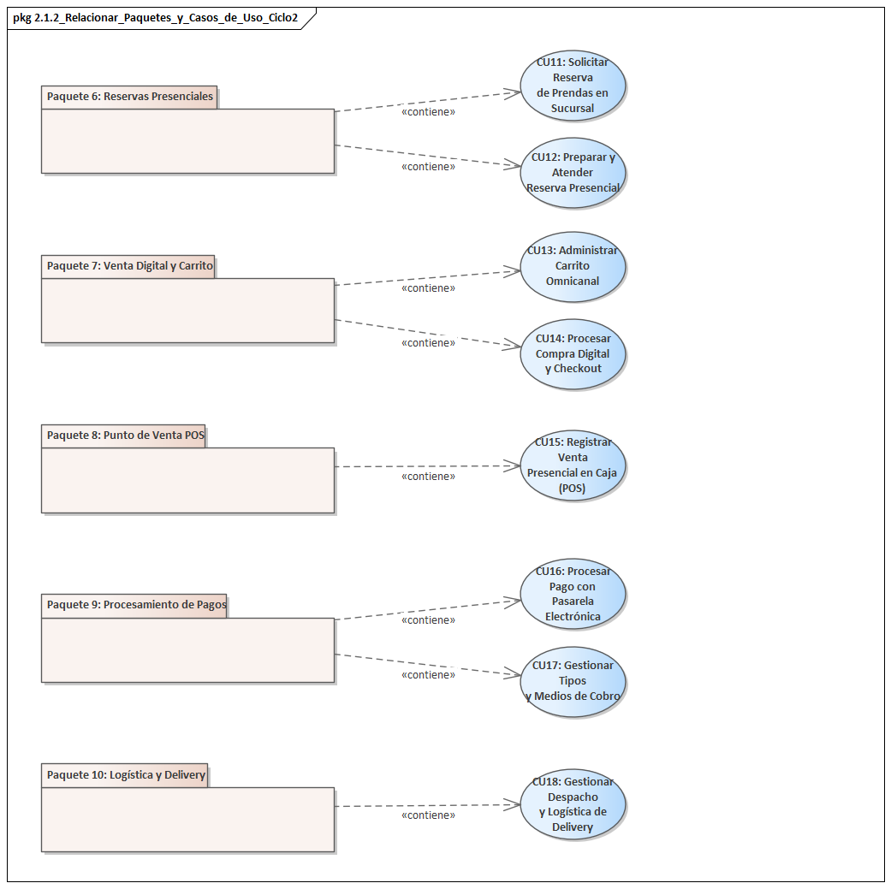

### 2.1.3 Vista de casos de uso

En la metodología PUDS, la Vista de Casos de Uso representa a los paquetes vistos desde su interior: el entorno/frontera exterior es el propio paquete contenedor y dentro de él residen los diagramas de casos de uso que dicho paquete contiene, junto con sus relaciones funcionales internas (`<<include>>`, `<<extend>>`, dependencias) y la conexión con los Actores que interactúan con ellos:

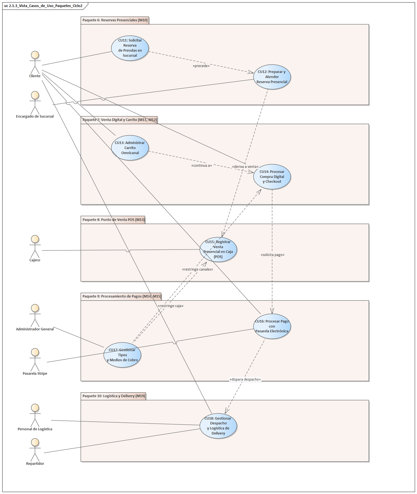

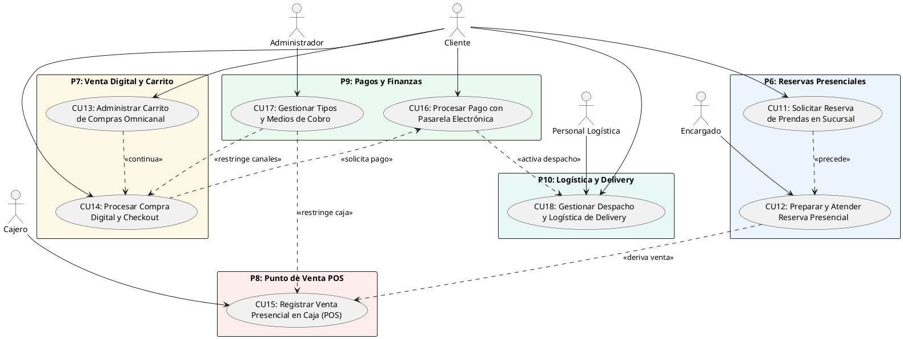
```plantuml
@startuml Vista_Casos_Uso_Paquetes_Ciclo2
skinparam packageStyle rectangle
skinparam shadowing false

package "P6: Reservas Presenciales" as P6 #EBF5FB {
  usecase "CU11: Solicitar Reserva\nde Prendas en Sucursal" as CU11
  usecase "CU12: Preparar y Atender\nReserva Presencial" as CU12
  CU11 ..> CU12 : <<precede>>
}

package "P7: Venta Digital y Carrito" as P7 #FEF9E7 {
  usecase "CU13: Administrar Carrito\nde Compras Omnicanal" as CU13
  usecase "CU14: Procesar Compra\nDigital y Checkout" as CU14
  CU13 ..> CU14 : <<continua>>
}

package "P8: Punto de Venta POS" as P8 #FDEDEC {
  usecase "CU15: Registrar Venta\nPresencial en Caja (POS)" as CU15
}

package "P9: Pagos y Finanzas" as P9 #EAFAF1 {
  usecase "CU16: Procesar Pago con\nPasarela Electrónica" as CU16
  usecase "CU17: Gestionar Tipos\ny Medios de Cobro" as CU17
}

package "P10: Logística y Delivery" as P10 #E8F8F5 {
  usecase "CU18: Gestionar Despacho\ny Logística de Delivery" as CU18
}

actor "Cliente" as Cliente
actor "Encargado" as Encargado
actor "Cajero" as Cajero
actor "Administrador" as Admin
actor "Personal Logística" as Logistica

Cliente --> CU11
Cliente --> CU13
Cliente --> CU14
Cliente --> CU16
Cliente --> CU18

Encargado --> CU12
Cajero --> CU15
Admin --> CU17
Logistica --> CU18

CU12 ..> CU15 : <<deriva venta>>
CU14 ..> CU16 : <<solicita pago>>
CU16 ..> CU18 : <<activa despacho>>
CU17 ..> CU14 : <<restringe canales>>
CU17 ..> CU15 : <<restringe caja>>
@enduml
```

---

## 2.2 Analizar Casos de Uso (Diagramas de Comunicación UML)

A continuación se presentan los Diagramas de Comunicación UML para cada uno de los 8 Casos de Uso del Ciclo 2. Conforme a las directrices de la cátedra expresadas en clase, cada caso de uso se modela de forma rigurosa mediante la colaboración entre la clase de interfaz (`<<boundary>>`), la clase de lógica (`<<control>>` sin atributos) y la clase de datos (`<<entity>>`), con mensajes numerados cronológicamente (`1`, `1.1`, `1.2`, etc.) en sintaxis estándar PlantUML / PlantText:

### 2.2.1 Diagrama de Comunicación - CU11: Solicitar Reserva de Prendas en Sucursal

Participantes: Actor Cliente (Autenticado) $\to$ `<<boundary>> :FormularioReserva` $\to$ `<<control>> :ControladorReservas` $\to$ `<<entity>> :InventarioEntity` / `<<entity>> :ReservaEntity` / `<<entity>> :ReservaDetalleEntity` / `<<entity>> :QRService`.

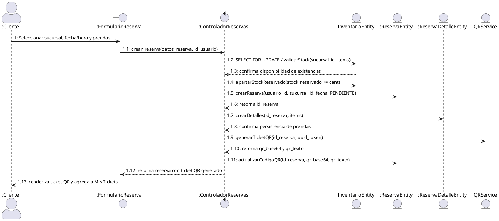
```plantuml
@startuml
skinparam actorStyle awesome

actor ":Cliente" as Cliente
boundary ":FormularioReserva" as UI
control ":ControladorReservas" as Ctrl
entity ":InventarioEntity" as InvEnt
entity ":ReservaEntity" as ResEnt
entity ":ReservaDetalleEntity" as DetEnt
entity ":QRService" as QREnt

Cliente -> UI : 1: Seleccionar sucursal, fecha/hora y prendas
UI -> Ctrl : 1.1: crear_reserva(datos_reserva, id_usuario)
Ctrl -> InvEnt : 1.2: SELECT FOR UPDATE / validarStock(sucursal_id, items)
InvEnt --> Ctrl : 1.3: confirma disponibilidad de existencias
Ctrl -> InvEnt : 1.4: apartarStockReservado(stock_reservado += cant)
Ctrl -> ResEnt : 1.5: crearReserva(usuario_id, sucursal_id, fecha, PENDIENTE)
ResEnt --> Ctrl : 1.6: retorna id_reserva
Ctrl -> DetEnt : 1.7: crearDetalles(id_reserva, items)
DetEnt --> Ctrl : 1.8: confirma persistencia de prendas
Ctrl -> QREnt : 1.9: generarTicketQR(id_reserva, uuid_token)
QREnt --> Ctrl : 1.10: retorna qr_base64 y qr_texto
Ctrl -> ResEnt : 1.11: actualizarCodigoQR(id_reserva, qr_base64, qr_texto)
Ctrl --> UI : 1.12: retorna reserva con ticket QR generado
UI --> Cliente : 1.13: renderiza ticket QR y agrega a Mis Tickets
@enduml
```

### 2.2.2 Diagrama de Comunicación - CU12: Preparar y Atender Reserva Presencial

Participantes: Actor Encargado de Sucursal / Actor Cliente $\to$ `<<boundary>> :TableroReservas` $\to$ `<<control>> :ControladorReservas` $\to$ `<<entity>> :ReservaEntity` / `<<entity>> :InventarioEntity`.

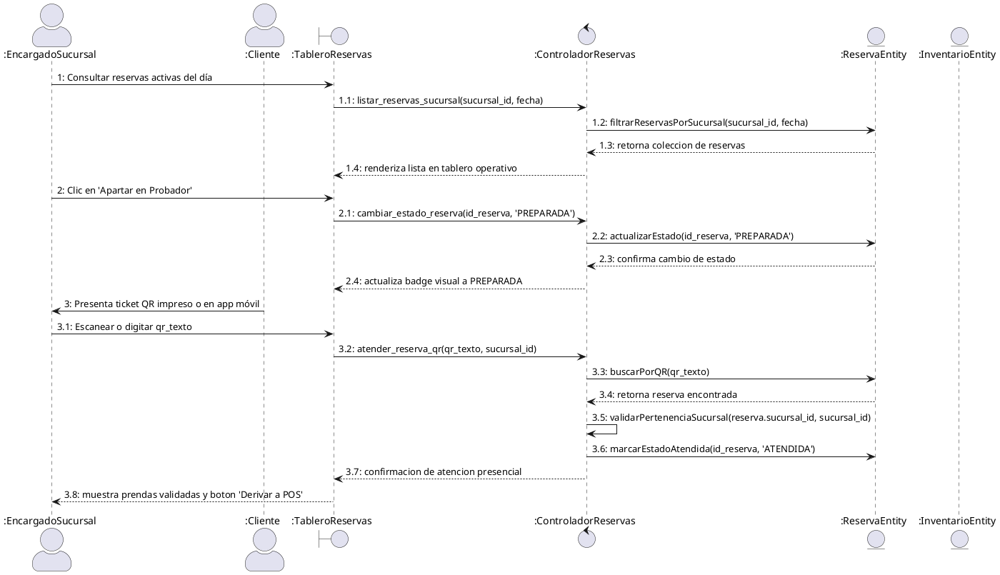
```plantuml
@startuml
skinparam actorStyle awesome

actor ":EncargadoSucursal" as Encargado
actor ":Cliente" as Cliente
boundary ":TableroReservas" as UI
control ":ControladorReservas" as Ctrl
entity ":ReservaEntity" as ResEnt
entity ":InventarioEntity" as InvEnt

Encargado -> UI : 1: Consultar reservas activas del día
UI -> Ctrl : 1.1: listar_reservas_sucursal(sucursal_id, fecha)
Ctrl -> ResEnt : 1.2: filtrarReservasPorSucursal(sucursal_id, fecha)
ResEnt --> Ctrl : 1.3: retorna coleccion de reservas
Ctrl --> UI : 1.4: renderiza lista en tablero operativo

Encargado -> UI : 2: Clic en 'Apartar en Probador'
UI -> Ctrl : 2.1: cambiar_estado_reserva(id_reserva, 'PREPARADA')
Ctrl -> ResEnt : 2.2: actualizarEstado(id_reserva, 'PREPARADA')
ResEnt --> Ctrl : 2.3: confirma cambio de estado
Ctrl --> UI : 2.4: actualiza badge visual a PREPARADA

Cliente -> Encargado : 3: Presenta ticket QR impreso o en app móvil
Encargado -> UI : 3.1: Escanear o digitar qr_texto
UI -> Ctrl : 3.2: atender_reserva_qr(qr_texto, sucursal_id)
Ctrl -> ResEnt : 3.3: buscarPorQR(qr_texto)
ResEnt --> Ctrl : 3.4: retorna reserva encontrada
Ctrl -> Ctrl : 3.5: validarPertenenciaSucursal(reserva.sucursal_id, sucursal_id)
Ctrl -> ResEnt : 3.6: marcarEstadoAtendida(id_reserva, 'ATENDIDA')
Ctrl --> UI : 3.7: confirmacion de atencion presencial
UI --> Encargado : 3.8: muestra prendas validadas y boton 'Derivar a POS'
@enduml
```

### 2.2.3 Diagrama de Comunicación - CU13: Administrar Carrito de Compras Omnicanal

Participantes: Actor Cliente (Autenticado) $\to$ `<<boundary>> :CarritoSidebar` $\to$ `<<control>> :ControladorCarrito` $\to$ `<<entity>> :InventarioEntity` / `<<entity>> :CarritoEntity` / `<<entity>> :CarritoItemEntity`.

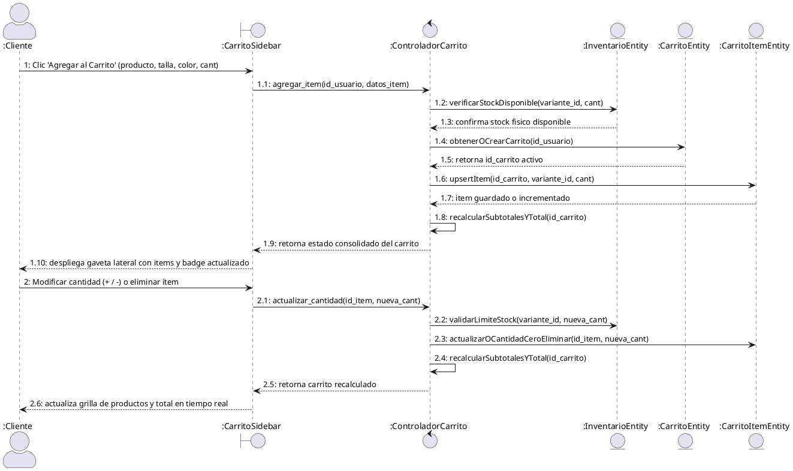
```plantuml
@startuml
skinparam actorStyle awesome

actor ":Cliente" as Cliente
boundary ":CarritoSidebar" as UI
control ":ControladorCarrito" as Ctrl
entity ":InventarioEntity" as InvEnt
entity ":CarritoEntity" as CarritoEnt
entity ":CarritoItemEntity" as ItemEnt

Cliente -> UI : 1: Clic 'Agregar al Carrito' (producto, talla, color, cant)
UI -> Ctrl : 1.1: agregar_item(id_usuario, datos_item)
Ctrl -> InvEnt : 1.2: verificarStockDisponible(variante_id, cant)
InvEnt --> Ctrl : 1.3: confirma stock fisico disponible
Ctrl -> CarritoEnt : 1.4: obtenerOCrearCarrito(id_usuario)
CarritoEnt --> Ctrl : 1.5: retorna id_carrito activo
Ctrl -> ItemEnt : 1.6: upsertItem(id_carrito, variante_id, cant)
ItemEnt --> Ctrl : 1.7: item guardado o incrementado
Ctrl -> Ctrl : 1.8: recalcularSubtotalesYTotal(id_carrito)
Ctrl --> UI : 1.9: retorna estado consolidado del carrito
UI --> Cliente : 1.10: despliega gaveta lateral con items y badge actualizado

Cliente -> UI : 2: Modificar cantidad (+ / -) o eliminar ítem
UI -> Ctrl : 2.1: actualizar_cantidad(id_item, nueva_cant)
Ctrl -> InvEnt : 2.2: validarLimiteStock(variante_id, nueva_cant)
Ctrl -> ItemEnt : 2.3: actualizarOCantidadCeroEliminar(id_item, nueva_cant)
Ctrl -> Ctrl : 2.4: recalcularSubtotalesYTotal(id_carrito)
Ctrl --> UI : 2.5: retorna carrito recalculado
UI --> Cliente : 2.6: actualiza grilla de productos y total en tiempo real
@enduml
```

### 2.2.4 Diagrama de Comunicación - CU14: Procesar Compra Digital y Checkout

Participantes: Actor Cliente (Autenticado) $\to$ `<<boundary>> :CheckoutWizard` $\to$ `<<control>> :ControladorOrdenes` $\to$ `<<control>> :ServicioGeo` $\to$ `<<entity>> :CarritoEntity` / `<<entity>> :OrdenVentaEntity` / `<<entity>> :OrdenDetalleEntity` / `<<entity>> :SucursalEntity`.

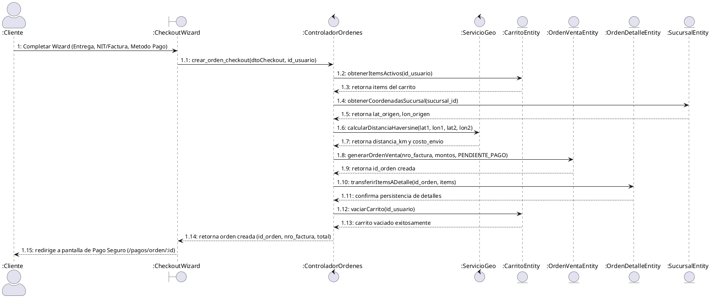
```plantuml
@startuml
skinparam actorStyle awesome

actor ":Cliente" as Cliente
boundary ":CheckoutWizard" as UI
control ":ControladorOrdenes" as Ctrl
control ":ServicioGeo" as GeoCtrl
entity ":CarritoEntity" as CarritoEnt
entity ":OrdenVentaEntity" as OrdenEnt
entity ":OrdenDetalleEntity" as DetalleEnt
entity ":SucursalEntity" as SucEnt

Cliente -> UI : 1: Completar Wizard (Entrega, NIT/Factura, Metodo Pago)
UI -> Ctrl : 1.1: crear_orden_checkout(dtoCheckout, id_usuario)
Ctrl -> CarritoEnt : 1.2: obtenerItemsActivos(id_usuario)
CarritoEnt --> Ctrl : 1.3: retorna items del carrito
Ctrl -> SucEnt : 1.4: obtenerCoordenadasSucursal(sucursal_id)
SucEnt --> Ctrl : 1.5: retorna lat_origen, lon_origen
Ctrl -> GeoCtrl : 1.6: calcularDistanciaHaversine(lat1, lon1, lat2, lon2)
GeoCtrl --> Ctrl : 1.7: retorna distancia_km y costo_envio
Ctrl -> OrdenEnt : 1.8: generarOrdenVenta(nro_factura, montos, PENDIENTE_PAGO)
OrdenEnt --> Ctrl : 1.9: retorna id_orden creada
Ctrl -> DetalleEnt : 1.10: transferirItemsADetalle(id_orden, items)
DetalleEnt --> Ctrl : 1.11: confirma persistencia de detalles
Ctrl -> CarritoEnt : 1.12: vaciarCarrito(id_usuario)
CarritoEnt --> Ctrl : 1.13: carrito vaciado exitosamente
Ctrl --> UI : 1.14: retorna orden creada (id_orden, nro_factura, total)
UI --> Cliente : 1.15: redirige a pantalla de Pago Seguro (/pagos/orden/:id)
@enduml
```

### 2.2.5 Diagrama de Comunicación - CU15: Registrar Venta Presencial en Caja (POS)

Participantes: Actor Cajero de Sucursal $\to$ `<<boundary>> :TerminalPOS` $\to$ `<<control>> :ControladorPOS` $\to$ `<<control>> :ControladorPagosConfig` $\to$ `<<entity>> :ProductoEntity` / `<<entity>> :InventarioEntity` / `<<entity>> :OrdenVentaEntity` / `<<entity>> :KardexMovimientoEntity`.

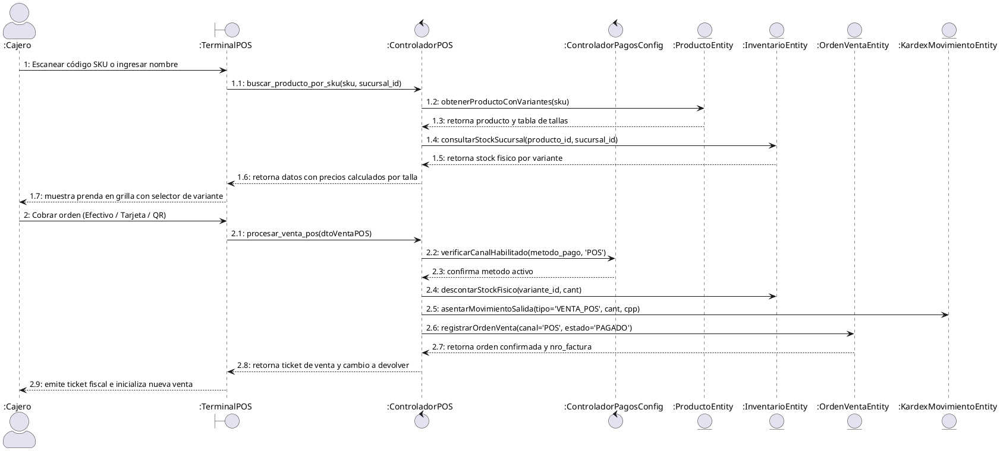
```plantuml
@startuml
skinparam actorStyle awesome

actor ":Cajero" as Cajero
boundary ":TerminalPOS" as UI
control ":ControladorPOS" as Ctrl
control ":ControladorPagosConfig" as ConfigCtrl
entity ":ProductoEntity" as ProdEnt
entity ":InventarioEntity" as InvEnt
entity ":OrdenVentaEntity" as OrdenEnt
entity ":KardexMovimientoEntity" as KardexEnt

Cajero -> UI : 1: Escanear código SKU o ingresar nombre
UI -> Ctrl : 1.1: buscar_producto_por_sku(sku, sucursal_id)
Ctrl -> ProdEnt : 1.2: obtenerProductoConVariantes(sku)
ProdEnt --> Ctrl : 1.3: retorna producto y tabla de tallas
Ctrl -> InvEnt : 1.4: consultarStockSucursal(producto_id, sucursal_id)
InvEnt --> Ctrl : 1.5: retorna stock fisico por variante
Ctrl --> UI : 1.6: retorna datos con precios calculados por talla
UI --> Cajero : 1.7: muestra prenda en grilla con selector de variante

Cajero -> UI : 2: Cobrar orden (Efectivo / Tarjeta / QR)
UI -> Ctrl : 2.1: procesar_venta_pos(dtoVentaPOS)
Ctrl -> ConfigCtrl : 2.2: verificarCanalHabilitado(metodo_pago, 'POS')
ConfigCtrl --> Ctrl : 2.3: confirma metodo activo
Ctrl -> InvEnt : 2.4: descontarStockFisico(variante_id, cant)
Ctrl -> KardexEnt : 2.5: asentarMovimientoSalida(tipo='VENTA_POS', cant, cpp)
Ctrl -> OrdenEnt : 2.6: registrarOrdenVenta(canal='POS', estado='PAGADO')
OrdenEnt --> Ctrl : 2.7: retorna orden confirmada y nro_factura
Ctrl --> UI : 2.8: retorna ticket de venta y cambio a devolver
UI --> Cajero : 2.9: emite ticket fiscal e inicializa nueva venta
@enduml
```

### 2.2.6 Diagrama de Comunicación - CU16: Procesar Pago con Pasarela Electrónica

Participantes: Actor Cliente / Actor Pasarela Stripe $\to$ `<<boundary>> :FormularioPago` $\to$ `<<control>> :ControladorPagos` $\to$ `<<entity>> :MetodoPagoConfigEntity` / `<<entity>> :OrdenVentaEntity` / `<<entity>> :TransaccionPagoEntity`.

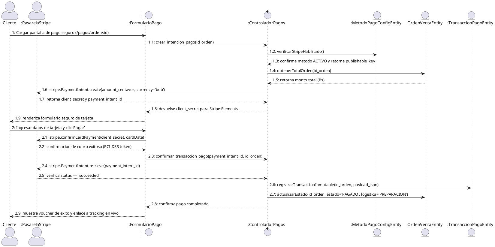
```plantuml
@startuml
skinparam actorStyle awesome

actor ":Cliente" as Cliente
actor ":PasarelaStripe" as StripeExt
boundary ":FormularioPago" as UI
control ":ControladorPagos" as Ctrl
entity ":MetodoPagoConfigEntity" as ConfigEnt
entity ":OrdenVentaEntity" as OrdenEnt
entity ":TransaccionPagoEntity" as TransEnt

Cliente -> UI : 1: Cargar pantalla de pago seguro (/pagos/orden/:id)
UI -> Ctrl : 1.1: crear_intencion_pago(id_orden)
Ctrl -> ConfigEnt : 1.2: verificarStripeHabilitado()
ConfigEnt --> Ctrl : 1.3: confirma metodo ACTIVO y retorna publishable_key
Ctrl -> OrdenEnt : 1.4: obtenerTotalOrden(id_orden)
OrdenEnt --> Ctrl : 1.5: retorna monto total (Bs)
Ctrl -> StripeExt : 1.6: stripe.PaymentIntent.create(amount_centavos, currency='bob')
StripeExt --> Ctrl : 1.7: retorna client_secret y payment_intent_id
Ctrl --> UI : 1.8: devuelve client_secret para Stripe Elements
UI --> Cliente : 1.9: renderiza formulario seguro de tarjeta

Cliente -> UI : 2: Ingresar datos de tarjeta y clic 'Pagar'
UI -> StripeExt : 2.1: stripe.confirmCardPayment(client_secret, cardData)
StripeExt --> UI : 2.2: confirmacion de cobro exitoso (PCI-DSS token)
UI -> Ctrl : 2.3: confirmar_transaccion_pago(payment_intent_id, id_orden)
Ctrl -> StripeExt : 2.4: stripe.PaymentIntent.retrieve(payment_intent_id)
StripeExt --> Ctrl : 2.5: verifica status == 'succeeded'
Ctrl -> TransEnt : 2.6: registrarTransaccionInmutable(id_orden, payload_json)
Ctrl -> OrdenEnt : 2.7: actualizarEstado(id_orden, estado='PAGADO', logistica='PREPARACION')
Ctrl --> UI : 2.8: confirma pago completado
UI --> Cliente : 2.9: muestra voucher de exito y enlace a tracking en vivo
@enduml
```

### 2.2.7 Diagrama de Comunicación - CU17: Gestionar Tipos y Medios de Cobro

Participantes: Actor Administrador General $\to$ `<<boundary>> :PanelPagosConfig` $\to$ `<<control>> :ControladorPagoConfig` $\to$ `<<entity>> :MetodoPagoConfigEntity` / `<<entity>> :BitacoraEntity`.

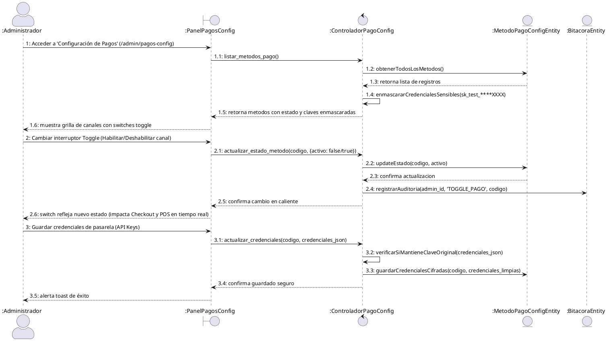
```plantuml
@startuml
skinparam actorStyle awesome

actor ":Administrador" as Admin
boundary ":PanelPagosConfig" as UI
control ":ControladorPagoConfig" as Ctrl
entity ":MetodoPagoConfigEntity" as ConfigEnt
entity ":BitacoraEntity" as BitacoraEnt

Admin -> UI : 1: Acceder a 'Configuración de Pagos' (/admin/pagos-config)
UI -> Ctrl : 1.1: listar_metodos_pago()
Ctrl -> ConfigEnt : 1.2: obtenerTodosLosMetodos()
ConfigEnt --> Ctrl : 1.3: retorna lista de registros
Ctrl -> Ctrl : 1.4: enmascararCredencialesSensibles(sk_test_****XXXX)
Ctrl --> UI : 1.5: retorna metodos con estado y claves enmascaradas
UI --> Admin : 1.6: muestra grilla de canales con switches toggle

Admin -> UI : 2: Cambiar interruptor Toggle (Habilitar/Deshabilitar canal)
UI -> Ctrl : 2.1: actualizar_estado_metodo(codigo, {activo: false/true})
Ctrl -> ConfigEnt : 2.2: updateEstado(codigo, activo)
ConfigEnt --> Ctrl : 2.3: confirma actualizacion
Ctrl -> BitacoraEnt : 2.4: registrarAuditoria(admin_id, 'TOGGLE_PAGO', codigo)
Ctrl --> UI : 2.5: confirma cambio en caliente
UI --> Admin : 2.6: switch refleja nuevo estado (impacta Checkout y POS en tiempo real)

Admin -> UI : 3: Guardar credenciales de pasarela (API Keys)
UI -> Ctrl : 3.1: actualizar_credenciales(codigo, credenciales_json)
Ctrl -> Ctrl : 3.2: verificarSiMantieneClaveOriginal(credenciales_json)
Ctrl -> ConfigEnt : 3.3: guardarCredencialesCifradas(codigo, credenciales_limpias)
Ctrl --> UI : 3.4: confirma guardado seguro
UI --> Admin : 3.5: alerta toast de éxito
@enduml
```

### 2.2.8 Diagrama de Comunicación - CU18: Gestionar Despacho y Logística de Delivery

Participantes: Actor Personal Logística / Actor Cliente $\to$ `<<boundary>> :TableroLogistica` / `<<boundary>> :PantallaTracking` $\to$ `<<control>> :ControladorLogistica` $\to$ `<<entity>> :OrdenVentaEntity` / `<<entity>> :SucursalEntity`.

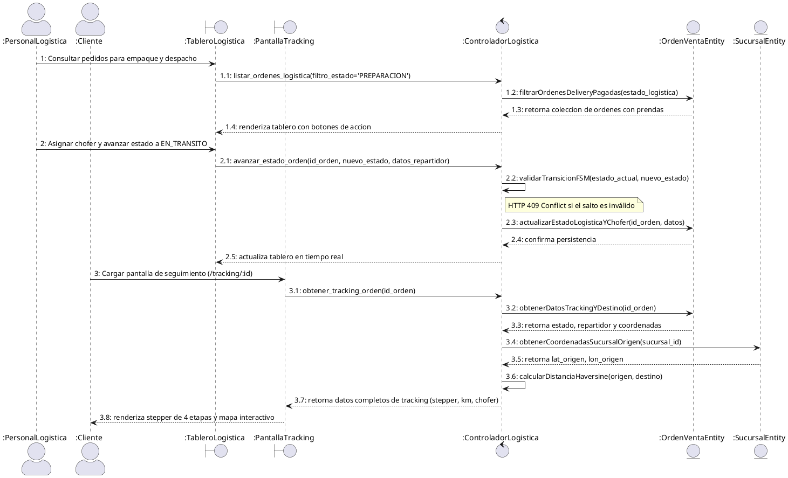
```plantuml
@startuml
skinparam actorStyle awesome

actor ":PersonalLogistica" as Logistica
actor ":Cliente" as Cliente
boundary ":TableroLogistica" as UILog
boundary ":PantallaTracking" as UITrack
control ":ControladorLogistica" as Ctrl
entity ":OrdenVentaEntity" as OrdenEnt
entity ":SucursalEntity" as SucEnt

Logistica -> UILog : 1: Consultar pedidos para empaque y despacho
UILog -> Ctrl : 1.1: listar_ordenes_logistica(filtro_estado='PREPARACION')
Ctrl -> OrdenEnt : 1.2: filtrarOrdenesDeliveryPagadas(estado_logistica)
OrdenEnt --> Ctrl : 1.3: retorna coleccion de ordenes con prendas
Ctrl --> UILog : 1.4: renderiza tablero con botones de accion

Logistica -> UILog : 2: Asignar chofer y avanzar estado a EN_TRANSITO
UILog -> Ctrl : 2.1: avanzar_estado_orden(id_orden, nuevo_estado, datos_repartidor)
Ctrl -> Ctrl : 2.2: validarTransicionFSM(estado_actual, nuevo_estado)
note right of Ctrl : HTTP 409 Conflict si el salto es inválido
Ctrl -> OrdenEnt : 2.3: actualizarEstadoLogisticaYChofer(id_orden, datos)
OrdenEnt --> Ctrl : 2.4: confirma persistencia
Ctrl --> UILog : 2.5: actualiza tablero en tiempo real

Cliente -> UITrack : 3: Cargar pantalla de seguimiento (/tracking/:id)
UITrack -> Ctrl : 3.1: obtener_tracking_orden(id_orden)
Ctrl -> OrdenEnt : 3.2: obtenerDatosTrackingYDestino(id_orden)
OrdenEnt --> Ctrl : 3.3: retorna estado, repartidor y coordenadas
Ctrl -> SucEnt : 3.4: obtenerCoordenadasSucursalOrigen(sucursal_id)
SucEnt --> Ctrl : 3.5: retorna lat_origen, lon_origen
Ctrl -> Ctrl : 3.6: calcularDistanciaHaversine(origen, destino)
Ctrl --> UITrack : 3.7: retorna datos completos de tracking (stepper, km, chofer)
UITrack --> Cliente : 3.8: renderiza stepper de 4 etapas y mapa interactivo
@enduml
```

---

## 2.3 Análisis de Clases

Conforme a la instrucción metodológica de la cátedra, el análisis de clases formaliza exhaustivamente las tres categorías de clases de robustez (BCE) con sus responsabilidades exactas para los 8 Casos de Uso del Ciclo 2:

- **Clases de Interfaz (`<<boundary>>`):** Poseen atributos de captura de datos visuales y métodos interactivos que reflejan las acciones y eventos del usuario (botones, selectores, clics).
- **Clases de Control (`<<control>>`):** Contienen exclusivamente métodos de orquestación lógica del backend y NO tienen atributos propios.
- **Clases de Entidad (`<<entity>>`):** Poseen tanto atributos de datos persistentes como métodos de encapsulamiento y consulta sobre la base de datos.

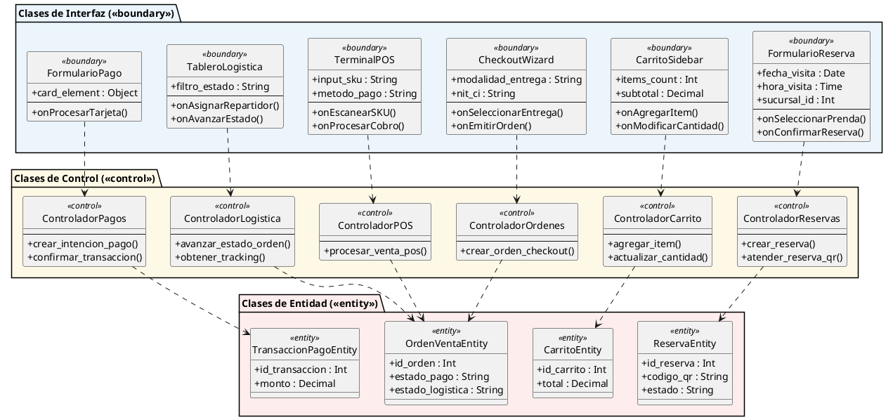
```plantuml
@startuml Clases_Analisis_BCE_Ciclo2
skinparam style strictuml
skinparam classAttributeIconSize 0
skinparam shadowing false

package "Clases de Interfaz (<<boundary>>)" #EBF5FB {
  class "FormularioReserva" as B_Reserva <<boundary>> {
    + fecha_visita : Date
    + hora_visita : Time
    + sucursal_id : Int
    --
    + onSeleccionarPrenda()
    + onConfirmarReserva()
  }

  class "CarritoSidebar" as B_Carrito <<boundary>> {
    + items_count : Int
    + subtotal : Decimal
    --
    + onAgregarItem()
    + onModificarCantidad()
  }

  class "CheckoutWizard" as B_Checkout <<boundary>> {
    + modalidad_entrega : String
    + nit_ci : String
    --
    + onSeleccionarEntrega()
    + onEmitirOrden()
  }

  class "TerminalPOS" as B_POS <<boundary>> {
    + input_sku : String
    + metodo_pago : String
    --
    + onEscanearSKU()
    + onProcesarCobro()
  }

  class "FormularioPago" as B_Pago <<boundary>> {
    + card_element : Object
    --
    + onProcesarTarjeta()
  }

  class "TableroLogistica" as B_Logistica <<boundary>> {
    + filtro_estado : String
    --
    + onAsignarRepartidor()
    + onAvanzarEstado()
  }
}

package "Clases de Control (<<control>>)" #FEF9E7 {
  class "ControladorReservas" as C_Reserva <<control>> {
    --
    + crear_reserva()
    + atender_reserva_qr()
  }

  class "ControladorCarrito" as C_Carrito <<control>> {
    --
    + agregar_item()
    + actualizar_cantidad()
  }

  class "ControladorOrdenes" as C_Ordenes <<control>> {
    --
    + crear_orden_checkout()
  }

  class "ControladorPOS" as C_POS <<control>> {
    --
    + procesar_venta_pos()
  }

  class "ControladorPagos" as C_Pagos <<control>> {
    --
    + crear_intencion_pago()
    + confirmar_transaccion()
  }

  class "ControladorLogistica" as C_Logistica <<control>> {
    --
    + avanzar_estado_orden()
    + obtener_tracking()
  }
}

package "Clases de Entidad (<<entity>>)" #FDEDEC {
  class "ReservaEntity" as E_Reserva <<entity>> {
    + id_reserva : Int
    + codigo_qr : String
    + estado : String
  }

  class "CarritoEntity" as E_Carrito <<entity>> {
    + id_carrito : Int
    + total : Decimal
  }

  class "OrdenVentaEntity" as E_Orden <<entity>> {
    + id_orden : Int
    + estado_pago : String
    + estado_logistica : String
  }

  class "TransaccionPagoEntity" as E_Pago <<entity>> {
    + id_transaccion : Int
    + monto : Decimal
  }
}

B_Reserva ..> C_Reserva
B_Carrito ..> C_Carrito
B_Checkout ..> C_Ordenes
B_POS ..> C_POS
B_Pago ..> C_Pagos
B_Logistica ..> C_Logistica

C_Reserva ..> E_Reserva
C_Carrito ..> E_Carrito
C_Ordenes ..> E_Orden
C_POS ..> E_Orden
C_Pagos ..> E_Pago
C_Logistica ..> E_Orden
@enduml
```

---

## 2.4 Análisis de Paquetes

En el análisis de paquetes se evalúa la arquitectura del Ciclo 2 bajo dos métricas cardinales de la ingeniería de software:

1. **Acoplamiento:** Medida de interdependencia entre los módulos. Se busca un bajo acoplamiento para evitar que modificaciones en un subsistema provoquen fallos en cascada.
2. **Cohesión:** Medida de afinidad y fortaleza asociativa interna de los elementos de un paquete. Se procura una alta cohesión funcional, agrupando en cada paquete clases estrictamente orientadas a un mismo objetivo de negocio.

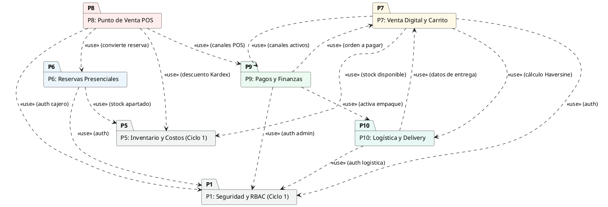
```plantuml
@startuml Dependencia_Paquetes_Ciclo2
skinparam packageStyle rectangle
skinparam shadowing false

package "P1: Seguridad y RBAC (Ciclo 1)" as P1 #F2F4F4
package "P5: Inventario y Costos (Ciclo 1)" as P5 #F2F4F4

package "P6: Reservas Presenciales" as P6 #EBF5FB
package "P7: Venta Digital y Carrito" as P7 #FEF9E7
package "P8: Punto de Venta POS" as P8 #FDEDEC
package "P9: Pagos y Finanzas" as P9 #EAFAF1
package "P10: Logística y Delivery" as P10 #E8F8F5

P6 ..> P1 : <<use>> (auth)
P6 ..> P5 : <<use>> (stock apartado)

P7 ..> P1 : <<use>> (auth)
P7 ..> P5 : <<use>> (stock disponible)
P7 ..> P9 : <<use>> (canales activos)
P7 ..> P10 : <<use>> (cálculo Haversine)

P8 ..> P1 : <<use>> (auth cajero)
P8 ..> P5 : <<use>> (descuento Kardex)
P8 ..> P9 : <<use>> (canales POS)
P8 ..> P6 : <<use>> (convierte reserva)

P9 ..> P1 : <<use>> (auth admin)
P9 ..> P7 : <<use>> (orden a pagar)
P9 ..> P10 : <<use>> (activa empaque)

P10 ..> P1 : <<use>> (auth logistica)
P10 ..> P7 : <<use>> (datos de entrega)
@enduml
```

| Paquete de Análisis          | Nivel de Cohesión        | Nivel de Acoplamiento                 | Justificación Técnica de Diseño                                                                                                                                                             |
| ---------------------------- | ------------------------ | ------------------------------------- | ------------------------------------------------------------------------------------------------------------------------------------------------------------------------------------------- |
| Reservas Presenciales (P6)   | Alta (Funcional)         | Bajo (Eferente: 2, Aferente: 1)       | Módulo autónomo que depende únicamente de Inventario (para apartar stock) y Seguridad (para autenticación JWT). POS puede consumir sus reservas como extensión.                             |
| Venta Digital y Carrito (P7) | Alta (Secuencial)        | Medio (Eferente: 3, Aferente: 1)      | Orquesta la cadena secuencial carrito, checkout y orden. Depende de Inventario para validaciones de stock, de Logística para el cálculo Haversine y de Pagos para la derivación a pasarela. |
| Punto de Venta POS (P8)      | Muy Alta (Transaccional) | Controlado (Eferente: 4, Aferente: 0) | Integra consultas de productos, descuento de inventario, registro en Kardex y validación de medios de cobro (CU17). Módulo consumidor neto sin dependientes.                                |
| Pagos y Finanzas (P9)        | Alta (Funcional)         | Bajo (Eferente: 1, Aferente: 2)       | Encapsula toda la lógica financiera y de pasarela. Solo depende de Órdenes para actualizar estado de pago. POS y Checkout dependen de este paquete para validar métodos habilitados.        |
| Logística y Delivery (P10)   | Alta (Operacional)       | Bajo (Eferente: 2, Aferente: 1)       | Depende de Órdenes (para leer pedidos pagados) y de Sucursales (para coordenadas GPS). El tracking del cliente depende de este paquete.                                                     |

---

# 3. Flujo de Trabajo: Diseño

## 3.1 Diseño de Arquitectura

### 3.1.1 Diseño Lógico de la Arquitectura (4 Capas UML)

Conforme a las explicaciones de cátedra, la arquitectura lógica del Ciclo 2 extiende las cuatro capas horizontales desacopladas del Ciclo 1, incorporando los subsistemas transaccionales de e-commerce, pagos y logística:

- **Capa 1 - Presentación:** Componentes standalone Angular 19 para Reservas, Carrito Sidebar, Checkout Wizard, Terminal POS, Pasarela de Pago, Panel de Medios de Cobro, Dashboard Logístico y Tracking en Vivo.
- **Capa 2 - Controladores API:** Routers FastAPI (`reservas/router.py`, `carrito/router.py`, `ordenes/router.py`, `pos/router.py`, `pagos/router.py`, `pagos/config_router.py`, `logistica/router.py`) que exponen los endpoints REST.
- **Capa 3 - Lógica de Negocio:** Servicios desacoplados (`ReservasService`, `CarritoService`, `OrdenesService`, `PosService`, `PagosService`, `PagoConfigService`, `LogisticaService`) con reglas algorítmicas, validaciones, cálculos de CPP/Haversine y máquina de estados.
- **Capa 4 - Persistencia:** Modelos SQLAlchemy (`Reserva`, `ReservaDetalle`, `Carrito`, `CarritoItem`, `OrdenVenta`, `OrdenDetalle`, `TransaccionPago`, `MetodoPagoConfig`) mapeados a tablas PostgreSQL con relaciones FK, constraints CHECK e índices de rendimiento.

```plantuml
@startuml Arquitectura_Logica_Ciclo2
skinparam packageStyle rectangle
skinparam linetype ortho
skinparam shadowing false

package "Capa 1: Presentación (Frontend Angular 19 SPA)" #EBF5FB {
  [Reservas & Tickets Component] as UI_Reservas
  [Carrito Gaveta Sidebar] as UI_Carrito
  [Checkout Wizard Multi-Paso] as UI_Checkout
  [Terminal POS de Caja] as UI_POS
  [Formulario Pagos Stripe] as UI_Pagos
  [Panel Medios de Cobro] as UI_AdminPagos
  [Dashboard Logística & Tracking GPS] as UI_Logistica
}

package "Capa 2: Controladores API REST (FastAPI Routers)" #E8F8F5 {
  [reservas/router.py] as R_Reservas
  [carrito/router.py] as R_Carrito
  [ordenes/router.py] as R_Ordenes
  [pos/router.py] as R_POS
  [pagos/router.py] as R_Pagos
  [pagos/config_router.py] as R_Config
  [logistica/router.py] as R_Logistica
}

package "Capa 3: Lógica de Negocio y Servicios (Services)" #FEF9E7 {
  [ReservasService\n(Bloqueo pesimista + QR Base64)] as S_Reservas
  [CarritoService\n(Validación stock + Upsert)] as S_Carrito
  [OrdenesService\n(Emisión orden + Haversine)] as S_Ordenes
  [PosService\n(Variantes + Factor Tallas + CPP)] as S_POS
  [PagosService\n(Stripe SDK + PaymentIntent)] as S_Pagos
  [PagoConfigService\n(Enmascaramiento + Cifrado)] as S_Config
  [LogisticaService\n(Máquina Estados FSM 409 + Tracking)] as S_Logistica
}

package "Capa 4: Persistencia y Acceso a Datos (SQLAlchemy / PostgreSQL)" #FDEDEC {
  [Reserva & ReservaDetalle] as M_Reservas
  [Carrito & CarritoItem] as M_Carrito
  [OrdenVenta & OrdenDetalle] as M_Ordenes
  [KardexMovimiento & Inventario] as M_Inventario
  [TransaccionPago] as M_Pagos
  [MetodoPagoConfig] as M_Config
  database "PostgreSQL 15+" as DB
}

UI_Reservas --> R_Reservas : HTTP POST/GET
UI_Carrito --> R_Carrito : HTTP POST/PUT
UI_Checkout --> R_Ordenes : HTTP POST
UI_POS --> R_POS : HTTP POST/GET
UI_Pagos --> R_Pagos : HTTP POST
UI_AdminPagos --> R_Config : HTTP GET/PUT
UI_Logistica --> R_Logistica : HTTP GET/PATCH

R_Reservas --> S_Reservas
R_Carrito --> S_Carrito
R_Ordenes --> S_Ordenes
R_POS --> S_POS
R_Pagos --> S_Pagos
R_Config --> S_Config
R_Logistica --> S_Logistica

S_Reservas --> M_Reservas
S_Carrito --> M_Carrito
S_Ordenes --> M_Ordenes
S_POS --> M_Inventario
S_POS --> M_Ordenes
S_Pagos --> M_Pagos
S_Pagos --> M_Ordenes
S_Config --> M_Config
S_Logistica --> M_Ordenes

M_Reservas --> DB
M_Carrito --> DB
M_Ordenes --> DB
M_Inventario --> DB
M_Pagos --> DB
M_Config --> DB
@enduml
```

### 3.1.2 Diseño Físico de la Arquitectura (Diagrama de Despliegue)

El diagrama de despliegue del Ciclo 2 extiende el del Ciclo 1, incorporando los nodos y conexiones de la pasarela de pagos Stripe y el servicio de cálculo geodésico:

- **Nodo Cliente Web (Angular 19 SPA):** Componentes standalone con detección de cambios reactiva (`ChangeDetectorRef`), Stripe.js y Stripe Elements embebidos directamente en el navegador.
- **Nodo Servidor Aplicación (FastAPI ASGI / Uvicorn):** Procesamiento asíncrono de peticiones REST, integración server-side con Stripe SDK (`stripe-python`), generación de QR con `qrcode` + `Pillow` y cálculo Haversine con módulo `math`.
- **Nodo Servidor Base de Datos (PostgreSQL 15+):** Tablas transaccionales con integridad ACID, constraints CHECK para máquinas de estado y bloqueos pesimistas `SELECT ... FOR UPDATE`.
- **Nodo Externo Stripe API (api.stripe.com):** Comunicación HTTPS/TLS con PaymentIntents, tokenización y autenticación 3D Secure.

```plantuml
@startuml Despliegue_Fisico_Ciclo2
skinparam nodeStyle rectangle
skinparam shadowing false

node "Dispositivo Cliente (PC / Tablet POS / Móvil)" as ClienteNode {
  artifact "Navegador Web (Chrome / Edge / Safari)" {
    component "Angular 19 SPA\n(Standalone Components)" as AngularApp
    component "Stripe.js & Elements SDK\n(Tokenización PCI-DSS)" as StripeJS
  }
}

node "Servidor de Aplicaciones (Backend Host)" as ServidorApp {
  node "Contenedor Docker / Runtime Python" {
    component "Servidor ASGI Uvicorn" as Uvicorn
    component "FastAPI REST Framework" as FastAPIApp
    component "Generador QR (Pillow + qrcode)" as QRGen
    component "Cálculo Geodésico (Haversine)" as GeoEngine
  }
}

node "Servidor de Base de Datos Relacional" as ServidorBD {
  database "PostgreSQL 15+ Engine" as PostgresEngine {
    folder "Esquema 'public' (3FN)" {
      artifact "Tablas Transaccionales:\nreservas, carritos, ordenes,\npagos, metodos_config" as TablasCiclo2
    }
  }
}

cloud "Nube de Pagos Seguros Stripe" as CloudStripe {
  node "api.stripe.com (Infraestructura PCI Nivel 1)" {
    component "Stripe Payment Engine\n(PaymentIntents API)" as StripeAPI
  }
}

AngularApp -- Uvicorn : HTTPS / JSON (Puerto 443/8000)
StripeJS -- StripeAPI : HTTPS / TLS 1.3 (Tokenización directa)
FastAPIApp -- QRGen : In-process call
FastAPIApp -- GeoEngine : In-process call
FastAPIApp -- StripeAPI : HTTPS / TLS 1.3 (Server-Side Secret Key)
FastAPIApp -- PostgresEngine : TCP / LibPQ (Puerto 5432 / SQLAlchemy Pool)
@enduml
```

---

## 3.2 Diseño de Casos de Uso

### 3.2.1 Diagramas de Secuencia

Los diagramas de secuencia modelan la interacción temporal entre los participantes (Actor, Boundary, Control, Entity) con operadores alt, opt y loop, reflejando con exactitud los flujos implementados en el código fuente FastAPI y Angular:

#### Diagrama de Secuencia - CU11: Solicitar Reserva de Prendas en Sucursal

Modela la selección de sucursal y prendas, la validación de stock con bloqueo pesimista, el apartado de stock reservado, la generación del ticket QR y la persistencia en el historial del cliente.

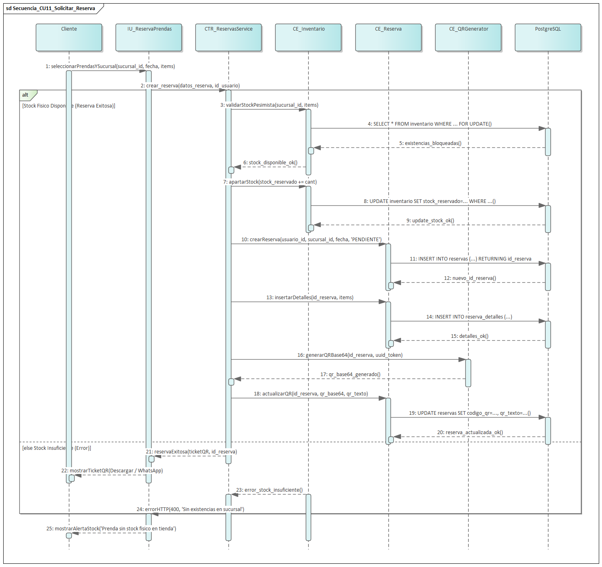

```plantuml
@startuml Secuencia_CU11_Solicitar_Reserva
skinparam style strictuml
skinparam sequenceMessageAlign center
autonumber

actor "Cliente" as Cliente
participant "UI: FormularioReserva" as UI
participant "CTR: ReservasService" as Ctrl
participant "ENT: Inventario" as InvEnt
participant "ENT: Reserva" as ResEnt
participant "SVC: QRGenerator" as QRGen
database "PostgreSQL" as DB

Cliente -> UI : seleccionarPrendasYSucursal(sucursal_id, fecha, items)
activate UI
UI -> Ctrl : crear_reserva(datos_reserva, id_usuario)
activate Ctrl

Ctrl -> InvEnt : validarStockPesimista(sucursal_id, items)
activate InvEnt
InvEnt -> DB : SELECT * FROM inventario WHERE ... FOR UPDATE
activate DB
DB --> InvEnt : existencias
deactivate DB

alt #LightCyan Stock Físico Disponible
    InvEnt --> Ctrl : stock_ok
    Ctrl -> InvEnt : apartarStock(stock_reservado += cant)
    InvEnt -> DB : UPDATE inventario SET stock_reservado = ...
    activate DB
    DB --> InvEnt : ok
    deactivate DB
    deactivate InvEnt

    Ctrl -> ResEnt : crearReserva(usuario_id, sucursal_id, fecha, 'PENDIENTE')
    activate ResEnt
    ResEnt -> DB : INSERT INTO reservas (...) RETURNING id_reserva
    activate DB
    DB --> ResEnt : id_reserva
    deactivate DB

    Ctrl -> ResEnt : insertarDetalles(id_reserva, items)
    ResEnt -> DB : INSERT INTO reserva_detalles (...)
    activate DB
    DB --> ResEnt : ok
    deactivate DB
    deactivate ResEnt

    Ctrl -> QRGen : generarQRBase64(id_reserva, uuid_token)
    activate QRGen
    QRGen --> Ctrl : qr_base64, qr_texto
    deactivate QRGen

    Ctrl -> ResEnt : actualizarQR(id_reserva, qr_base64, qr_texto)
    activate ResEnt
    ResEnt -> DB : UPDATE reservas SET codigo_qr=..., qr_texto=...
    activate DB
    DB --> ResEnt : ok
    deactivate DB
    deactivate ResEnt

    Ctrl --> UI : reservaExitosa(ticketQR, id_reserva)
    UI --> Cliente : mostrarTicketQR(opciones: Descargar / WhatsApp)
else #Pink Stock Insuficiente
    InvEnt --> Ctrl : error_stock_insuficiente
    activate InvEnt
    deactivate InvEnt
    Ctrl --> UI : errorHTTP(400, "Sin existencias en sucursal")
    UI --> Cliente : mostrarAlertaStock("Prenda sin stock físico en la tienda")
end
deactivate Ctrl
deactivate UI
@enduml
```

#### Diagrama de Secuencia - CU12: Preparar y Atender Reserva Presencial

Modela la consulta del tablero del encargado filtrado por sucursal, el apartado físico de prendas en probador (transición a PREPARADA), el escaneo/digitación del QR del cliente y la confirmación presencial (transición a ATENDIDA).

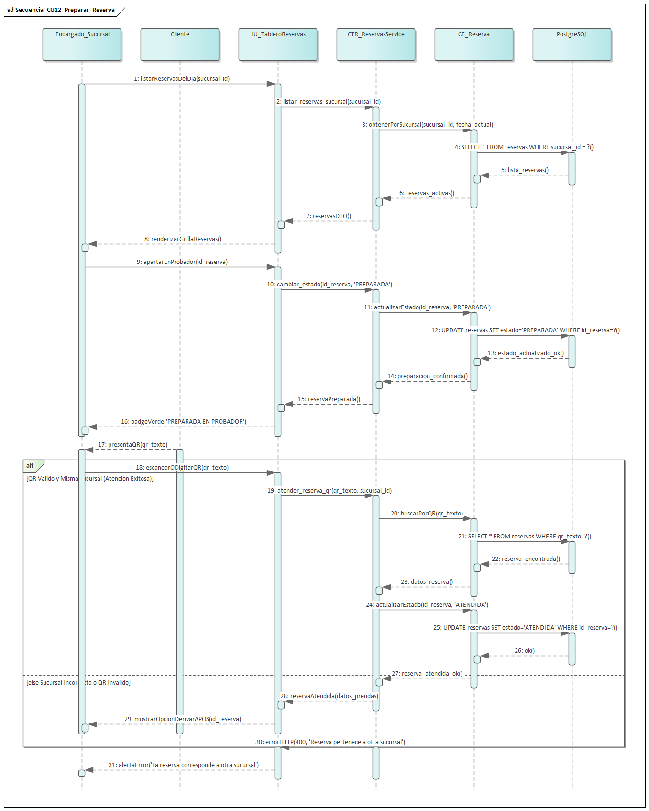

```plantuml
@startuml Secuencia_CU12_Atender_Reserva
skinparam style strictuml
skinparam sequenceMessageAlign center
autonumber

actor "Encargado Sucursal" as Encargado
actor "Cliente" as Cliente
participant "UI: TableroReservas" as UI
participant "CTR: ReservasService" as Ctrl
participant "ENT: Reserva" as ResEnt
database "PostgreSQL" as DB

Encargado -> UI : listarReservasDelDia(sucursal_id)
activate UI
UI -> Ctrl : listar_reservas_sucursal(sucursal_id)
activate Ctrl
Ctrl -> ResEnt : obtenerPorSucursal(sucursal_id, fecha_actual)
activate ResEnt
ResEnt -> DB : SELECT * FROM reservas WHERE sucursal_id = ? ...
activate DB
DB --> ResEnt : lista_reservas
deactivate DB
ResEnt --> Ctrl : reservas
deactivate ResEnt
Ctrl --> UI : reservas
UI --> Encargado : renderizarGrillaReservas()

Encargado -> UI : apartarEnProbador(id_reserva)
UI -> Ctrl : cambiar_estado(id_reserva, 'PREPARADA')
Ctrl -> ResEnt : actualizarEstado(id_reserva, 'PREPARADA')
activate ResEnt
ResEnt -> DB : UPDATE reservas SET estado='PREPARADA' WHERE id_reserva=?
activate DB
DB --> ResEnt : ok
deactivate DB
ResEnt --> Ctrl : ok
deactivate ResEnt
Ctrl --> UI : reservaPreparada()
UI --> Encargado : badgeVerde("PREPARADA EN PROBADOR")

Cliente -> Encargado : presentaQR(qr_texto)
Encargado -> UI : escanearODigitarQR(qr_texto)
UI -> Ctrl : atender_reserva_qr(qr_texto, sucursal_id)

Ctrl -> ResEnt : buscarPorQR(qr_texto)
activate ResEnt
ResEnt -> DB : SELECT * FROM reservas WHERE qr_texto=?
activate DB
DB --> ResEnt : reserva
deactivate DB
ResEnt --> Ctrl : reserva
deactivate ResEnt

alt #LightCyan QR Válido y Misma Sucursal
    Ctrl -> ResEnt : actualizarEstado(id_reserva, 'ATENDIDA')
    activate ResEnt
    ResEnt -> DB : UPDATE reservas SET estado='ATENDIDA' WHERE id_reserva=?
    activate DB
    DB --> ResEnt : ok
    deactivate DB
    ResEnt --> Ctrl : ok
    deactivate ResEnt
    Ctrl --> UI : reservaAtendida(datos_prendas)
    UI --> Encargado : mostrarOpcionDerivarAPOS(id_reserva)
else #Pink Sucursal Incorrecta o QR Inválido
    Ctrl --> UI : errorHTTP(400, "Reserva pertenece a otra sucursal")
    UI --> Encargado : alertaError("La reserva corresponde a otra sucursal")
end
deactivate Ctrl
deactivate UI
@enduml
```

#### Diagrama de Secuencia - CU13: Administrar Carrito de Compras Omnicanal

Modela la adición de prendas con validación atómica de existencias, la modificación de cantidades con bloqueo de máximo stock, la eliminación de ítems y el recálculo dinámico de subtotales y total.

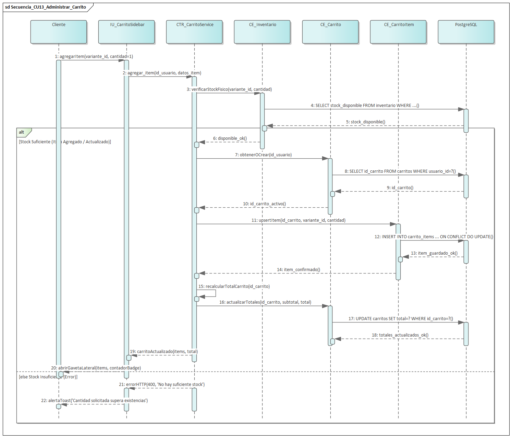

```plantuml
@startuml Secuencia_CU13_Administrar_Carrito
skinparam style strictuml
skinparam sequenceMessageAlign center
autonumber

actor "Cliente" as Cliente
participant "UI: CarritoSidebar" as UI
participant "CTR: CarritoService" as Ctrl
participant "ENT: Inventario" as InvEnt
participant "ENT: Carrito" as CarritoEnt
participant "ENT: CarritoItem" as ItemEnt
database "PostgreSQL" as DB

Cliente -> UI : agregarItem(variante_id, cantidad=1)
activate UI
UI -> Ctrl : agregar_item(id_usuario, datos_item)
activate Ctrl

Ctrl -> InvEnt : verificarStockFisico(variante_id, cantidad)
activate InvEnt
InvEnt -> DB : SELECT stock_disponible FROM inventario WHERE ...
activate DB
DB --> InvEnt : stock_disponible
deactivate DB
InvEnt --> Ctrl : disponible
deactivate InvEnt

alt #LightCyan Stock Suficiente
    Ctrl -> CarritoEnt : obtenerOCrear(id_usuario)
    activate CarritoEnt
    CarritoEnt -> DB : SELECT id_carrito FROM carritos WHERE usuario_id=?
    activate DB
    DB --> CarritoEnt : id_carrito
    deactivate DB
    CarritoEnt --> Ctrl : id_carrito
    deactivate CarritoEnt

    Ctrl -> ItemEnt : upsertItem(id_carrito, variante_id, cantidad)
    activate ItemEnt
    ItemEnt -> DB : INSERT INTO carrito_items ... ON CONFLICT DO UPDATE
    activate DB
    DB --> ItemEnt : item_guardado
    deactivate DB
    ItemEnt --> Ctrl : ok
    deactivate ItemEnt

    Ctrl -> Ctrl : recalcularTotalCarrito(id_carrito)
    Ctrl -> CarritoEnt : actualizarTotales(id_carrito, subtotal, total)
    activate CarritoEnt
    CarritoEnt -> DB : UPDATE carritos SET total=? WHERE id_carrito=?
    activate DB
    DB --> CarritoEnt : ok
    deactivate DB
    deactivate CarritoEnt

    Ctrl --> UI : carritoActualizado(items, total)
    UI --> Cliente : abrirGavetaLateral(items, contadorBadge)
else #Pink Stock Insuficiente
    Ctrl --> UI : errorHTTP(400, "No hay suficiente stock")
    UI --> Cliente : alertaToast("Cantidad solicitada supera existencias")
end
deactivate Ctrl
deactivate UI
@enduml
```

#### Diagrama de Secuencia - CU14: Procesar Compra Digital y Checkout

Modela el wizard de 3 pasos: selección de modalidad de entrega con cálculo Haversine, captura de datos fiscales (NIT/CI), revisión financiera, emisión de la orden con número correlativo, vaciado del carrito y redirección a la pasarela de pago.

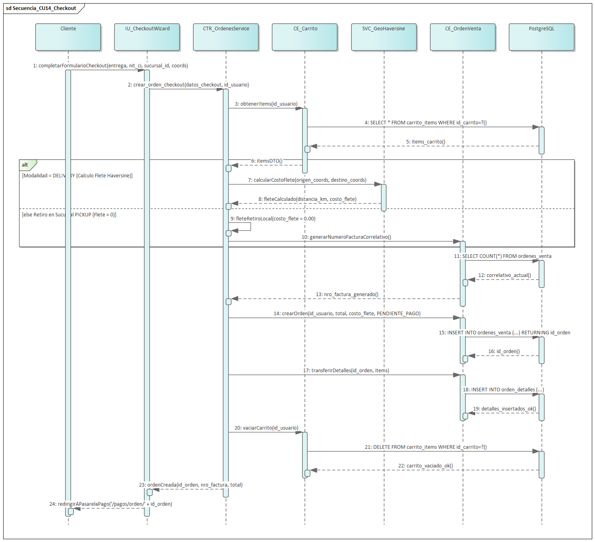

```plantuml
@startuml Secuencia_CU14_Checkout
skinparam style strictuml
skinparam sequenceMessageAlign center
autonumber

actor "Cliente" as Cliente
participant "UI: CheckoutWizard" as UI
participant "CTR: OrdenesService" as Ctrl
participant "SVC: GeoHaversine" as GeoSvc
participant "ENT: Carrito" as CarritoEnt
participant "ENT: OrdenVenta" as OrdenEnt
database "PostgreSQL" as DB

Cliente -> UI : completarFormularioCheckout(entrega, nit_ci, sucursal_id, coords)
activate UI
UI -> Ctrl : crear_orden_checkout(datos_checkout, id_usuario)
activate Ctrl

Ctrl -> CarritoEnt : obtenerItems(id_usuario)
activate CarritoEnt
CarritoEnt -> DB : SELECT * FROM carrito_items WHERE ...
activate DB
DB --> CarritoEnt : items
deactivate DB
CarritoEnt --> Ctrl : items
deactivate CarritoEnt

alt #LightCyan Modalidad = DELIVERY
    Ctrl -> GeoSvc : calcularCostoFlete(origen_coords, destino_coords)
    activate GeoSvc
    GeoSvc --> Ctrl : distancia_km, costo_flete
    deactivate GeoSvc
else Retiro en Sucursal (PICKUP)
    Ctrl -> Ctrl : costo_flete = 0.00
end

Ctrl -> OrdenEnt : generarNumeroFacturaCorrelativo()
activate OrdenEnt
OrdenEnt -> DB : SELECT COUNT(*) FROM ordenes_venta
activate DB
DB --> OrdenEnt : correlativo
deactivate DB
OrdenEnt --> Ctrl : nro_factura

Ctrl -> OrdenEnt : crearOrden(id_usuario, total, costo_flete, PENDIENTE_PAGO)
OrdenEnt -> DB : INSERT INTO ordenes_venta (...) RETURNING id_orden
activate DB
DB --> OrdenEnt : id_orden
deactivate DB

Ctrl -> OrdenEnt : transferirDetalles(id_orden, items)
OrdenEnt -> DB : INSERT INTO orden_detalles (...)
activate DB
DB --> OrdenEnt : ok
deactivate DB
deactivate OrdenEnt

Ctrl -> CarritoEnt : vaciarCarrito(id_usuario)
activate CarritoEnt
CarritoEnt -> DB : DELETE FROM carrito_items WHERE id_carrito=?
activate DB
DB --> CarritoEnt : ok
deactivate DB
deactivate CarritoEnt

Ctrl --> UI : ordenCreada(id_orden, nro_factura, total)
deactivate Ctrl
UI --> Cliente : redirigirAPasarelaPago("/pagos/orden/" + id_orden)
deactivate UI
@enduml
```

#### Diagrama de Secuencia - CU15: Registrar Venta Presencial en Caja (POS)

Modela la búsqueda de producto por SKU con stock de la sucursal, la selección de variante con factor de precio por talla, la validación del método de pago habilitado (CU17), el descuento de stock, el asiento en Kardex y la emisión del ticket fiscal con cálculo de cambio.

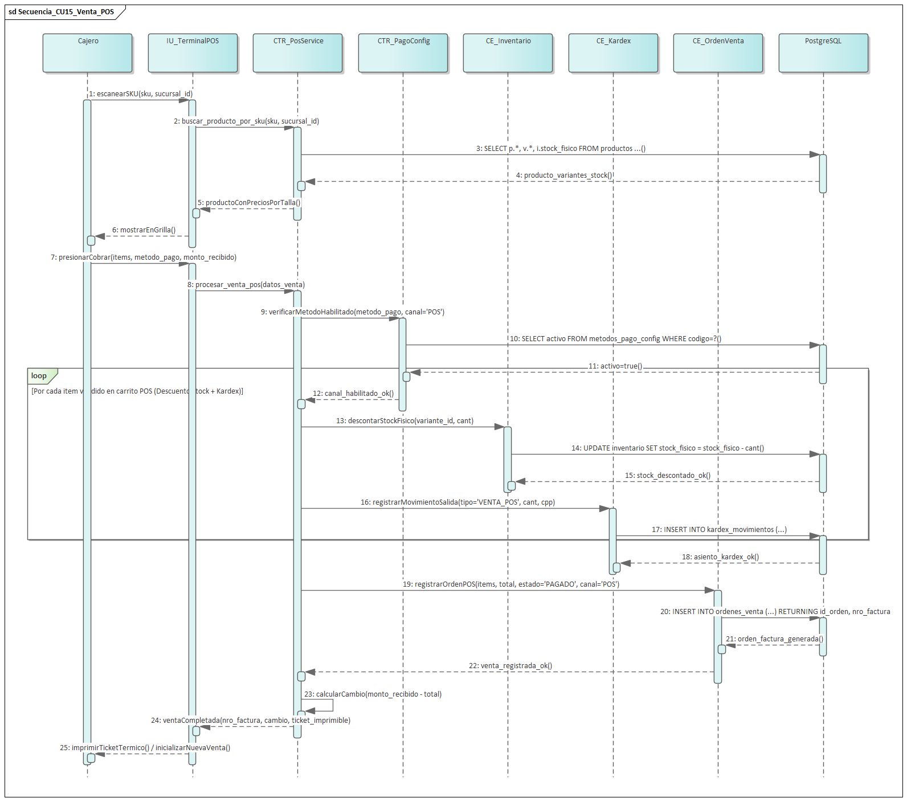

```plantuml
@startuml Secuencia_CU15_Venta_POS
skinparam style strictuml
skinparam sequenceMessageAlign center
autonumber

actor "Cajero" as Cajero
participant "UI: TerminalPOS" as UI
participant "CTR: PosService" as Ctrl
participant "CTR: PagoConfig" as ConfigCtrl
participant "ENT: Inventario" as InvEnt
participant "ENT: Kardex" as KardexEnt
participant "ENT: OrdenVenta" as OrdenEnt
database "PostgreSQL" as DB

Cajero -> UI : escanearSKU(sku, sucursal_id)
activate UI
UI -> Ctrl : buscar_producto_por_sku(sku, sucursal_id)
activate Ctrl
Ctrl -> DB : SELECT p.*, v.*, i.stock_fisico FROM productos ...
activate DB
DB --> Ctrl : producto_variantes_stock
deactivate DB
Ctrl --> UI : productoConPreciosPorTalla
UI --> Cajero : mostrarEnGrilla()

Cajero -> UI : presionarCobrar(items, metodo_pago, monto_recibido)
UI -> Ctrl : procesar_venta_pos(datos_venta)

Ctrl -> ConfigCtrl : verificarMetodoHabilitado(metodo_pago, canal='POS')
activate ConfigCtrl
ConfigCtrl -> DB : SELECT activo FROM metodos_pago_config WHERE codigo=?
activate DB
DB --> ConfigCtrl : activo=true
deactivate DB
ConfigCtrl --> Ctrl : canal_ok
deactivate ConfigCtrl

loop Por cada ítem vendido
    Ctrl -> InvEnt : descontarStockFisico(variante_id, cant)
    activate InvEnt
    InvEnt -> DB : UPDATE inventario SET stock_fisico = stock_fisico - cant
    activate DB
    DB --> InvEnt : ok
    deactivate DB
    deactivate InvEnt

    Ctrl -> KardexEnt : registrarMovimientoSalida(tipo='VENTA_POS', cant, cpp)
    activate KardexEnt
    KardexEnt -> DB : INSERT INTO kardex_movimientos (...)
    activate DB
    DB --> KardexEnt : ok
    deactivate DB
    deactivate KardexEnt
end

Ctrl -> OrdenEnt : registrarOrdenPOS(items, total, estado='PAGADO', canal='POS')
activate OrdenEnt
OrdenEnt -> DB : INSERT INTO ordenes_venta (...) RETURNING id_orden, nro_factura
activate DB
DB --> OrdenEnt : id_orden, nro_factura
deactivate DB
deactivate OrdenEnt

Ctrl -> Ctrl : calcularCambio(monto_recibido - total)
Ctrl --> UI : ventaCompletada(nro_factura, cambio, ticket_imprimible)
deactivate Ctrl
UI --> Cajero : imprimirTicketTermico() / inicializarNuevaVenta()
deactivate UI
@enduml
```

#### Diagrama de Secuencia - CU16: Procesar Pago con Pasarela Electrónica

Modela la creación del PaymentIntent en el backend (conversión a centavos), la tokenización PCI-DSS directa entre el navegador y Stripe (sin tocar el servidor), el desafío 3D Secure opcional, la verificación server-side, el registro de la transacción inmutable y la actualización de la orden a PAGADO.

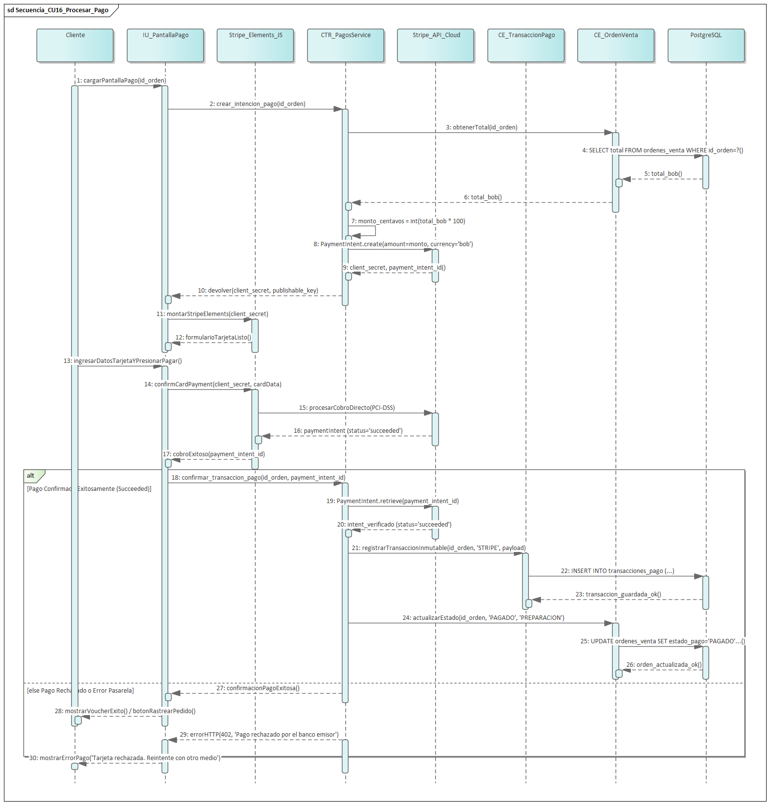

```plantuml
@startuml Secuencia_CU16_Procesar_Pago
skinparam style strictuml
skinparam sequenceMessageAlign center
autonumber

actor "Cliente" as Cliente
participant "UI: PantallaPago" as UI
participant "Stripe Elements\n(Client-Side)" as StripeJS
participant "CTR: PagosService" as Ctrl
participant "Stripe API\n(Server-Side)" as StripeAPI
participant "ENT: TransaccionPago" as TransEnt
participant "ENT: OrdenVenta" as OrdenEnt
database "PostgreSQL" as DB

Cliente -> UI : cargarPantallaPago(id_orden)
activate UI
UI -> Ctrl : crear_intencion_pago(id_orden)
activate Ctrl
Ctrl -> OrdenEnt : obtenerTotal(id_orden)
activate OrdenEnt
OrdenEnt -> DB : SELECT total FROM ordenes_venta WHERE id_orden=?
activate DB
DB --> OrdenEnt : total_bob
deactivate DB
OrdenEnt --> Ctrl : total_bob
deactivate OrdenEnt

Ctrl -> Ctrl : monto_centavos = int(total_bob * 100)
Ctrl -> StripeAPI : PaymentIntent.create(amount=monto_centavos, currency='bob')
activate StripeAPI
StripeAPI --> Ctrl : client_secret, payment_intent_id
deactivate StripeAPI
Ctrl --> UI : devolver(client_secret, publishable_key)
deactivate Ctrl

UI -> StripeJS : montarStripeElements(client_secret)
StripeJS --> UI : formularioTarjetaListo()

Cliente -> UI : ingresarDatosTarjetaYPresionarPagar()
UI -> StripeJS : confirmCardPayment(client_secret, cardData)
activate StripeJS
StripeJS -> StripeAPI : procesarCobroDirecto(PCI-DSS)
activate StripeAPI
StripeAPI --> StripeJS : paymentIntent (status='succeeded')
deactivate StripeAPI
StripeJS --> UI : cobroExitoso(payment_intent_id)
deactivate StripeJS

UI -> Ctrl : confirmar_transaccion_pago(id_orden, payment_intent_id)
activate Ctrl
Ctrl -> StripeAPI : PaymentIntent.retrieve(payment_intent_id)
activate StripeAPI
StripeAPI --> Ctrl : intent_verificado (status='succeeded')
deactivate StripeAPI

Ctrl -> TransEnt : registrarTransaccionInmutable(id_orden, 'STRIPE', payload_json)
activate TransEnt
TransEnt -> DB : INSERT INTO transacciones_pago (...)
activate DB
DB --> TransEnt : ok
deactivate DB
deactivate TransEnt

Ctrl -> OrdenEnt : actualizarEstado(id_orden, estado='PAGADO', logistica='PREPARACION')
activate OrdenEnt
OrdenEnt -> DB : UPDATE ordenes_venta SET estado_pago='PAGADO', estado_logistica='PREPARACION'
activate DB
DB --> OrdenEnt : ok
deactivate DB
deactivate OrdenEnt

Ctrl --> UI : confirmacionPagoExitosa()
deactivate Ctrl
UI --> Cliente : mostrarVoucherExito() / botonRastrearPedido()
deactivate UI
@enduml
```

#### Diagrama de Secuencia - CU17: Gestionar Tipos y Medios de Cobro

Modela la consulta de canales con enmascaramiento de credenciales, la activación/desactivación en caliente con Toggle Switch, la apertura del modal de configuración con revelación de claves por icono de ojo y el guardado idempotente de credenciales.

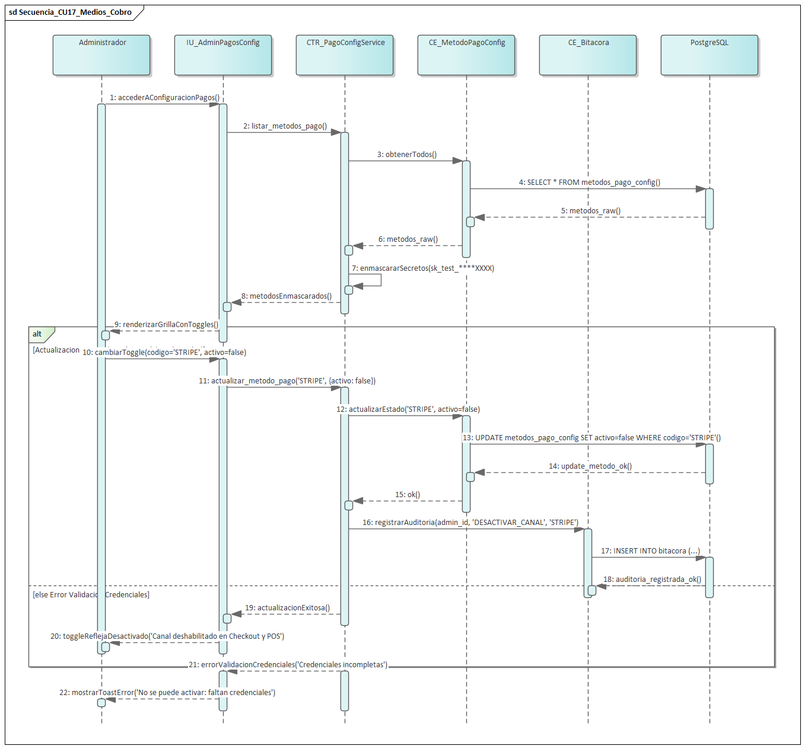

```plantuml
@startuml Secuencia_CU17_Medios_Cobro
skinparam style strictuml
skinparam sequenceMessageAlign center
autonumber

actor "Administrador" as Admin
participant "UI: AdminPagosConfig" as UI
participant "CTR: PagoConfigService" as Ctrl
participant "ENT: MetodoPagoConfig" as ConfigEnt
participant "ENT: Bitacora" as BitacoraEnt
database "PostgreSQL" as DB

Admin -> UI : accederAConfiguracionPagos()
activate UI
UI -> Ctrl : listar_metodos_pago()
activate Ctrl
Ctrl -> ConfigEnt : obtenerTodos()
activate ConfigEnt
ConfigEnt -> DB : SELECT * FROM metodos_pago_config
activate DB
DB --> ConfigEnt : metodos_raw
deactivate DB
ConfigEnt --> Ctrl : metodos_raw
deactivate ConfigEnt

Ctrl -> Ctrl : enmascararSecretos(sk_test_****XXXX)
Ctrl --> UI : metodosEnmascarados
deactivate Ctrl
UI --> Admin : renderizarGrillaConToggles()

Admin -> UI : cambiarToggle(codigo='STRIPE', activo=false)
UI -> Ctrl : actualizar_metodo_pago('STRIPE', {activo: false})
activate Ctrl
Ctrl -> ConfigEnt : actualizarEstado('STRIPE', activo=false)
activate ConfigEnt
ConfigEnt -> DB : UPDATE metodos_pago_config SET activo=false WHERE codigo='STRIPE'
activate DB
DB --> ConfigEnt : ok
deactivate DB
ConfigEnt --> Ctrl : ok
deactivate ConfigEnt

Ctrl -> BitacoraEnt : registrarAuditoria(admin_id, "DESACTIVAR_CANAL_PAGO", "STRIPE")
activate BitacoraEnt
BitacoraEnt -> DB : INSERT INTO bitacora (...)
activate DB
DB --> BitacoraEnt : ok
deactivate DB
deactivate BitacoraEnt

Ctrl --> UI : actualizacionExitosa()
deactivate Ctrl
UI --> Admin : toggleReflejaDesactivado("Canal deshabilitado en Checkout y POS")
deactivate UI
@enduml
```

#### Diagrama de Secuencia - CU18: Gestionar Despacho y Logística de Delivery

Modela la consulta del tablero logístico con filtro por estado, la asignación de repartidor, el avance de la máquina de estados finita con validación de transiciones (HTTP 409 ante saltos inválidos) y la consulta de tracking por el cliente con stepper visual y cálculo Haversine.

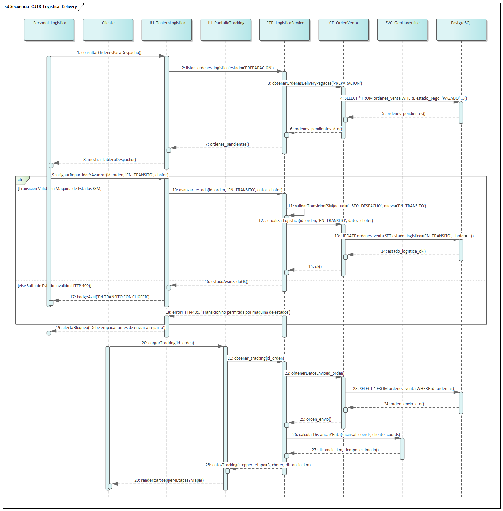

```plantuml
@startuml Secuencia_CU18_Logistica_Delivery
skinparam style strictuml
skinparam sequenceMessageAlign center
autonumber

actor "Personal Logística" as Logistica
actor "Cliente" as Cliente
participant "UI: TableroLogistica" as UILog
participant "UI: PantallaTracking" as UITrack
participant "CTR: LogisticaService" as Ctrl
participant "ENT: OrdenVenta" as OrdenEnt
participant "SVC: GeoHaversine" as GeoSvc
database "PostgreSQL" as DB

Logistica -> UILog : consultarOrdenesParaDespacho()
activate UILog
UILog -> Ctrl : listar_ordenes_logistica(estado='PREPARACION')
activate Ctrl
Ctrl -> OrdenEnt : obtenerOrdenesDeliveryPagadas('PREPARACION')
activate OrdenEnt
OrdenEnt -> DB : SELECT * FROM ordenes_venta WHERE estado_pago='PAGADO' AND ...
activate DB
DB --> OrdenEnt : ordenes_pendientes
deactivate DB
OrdenEnt --> Ctrl : ordenes_pendientes
deactivate OrdenEnt
Ctrl --> UILog : ordenes_pendientes
UILog --> Logistica : mostrarTableroDespacho()

Logistica -> UILog : asignarRepartidorYAvanzar(id_orden, 'EN_TRANSITO', chofer)
UILog -> Ctrl : avanzar_estado(id_orden, 'EN_TRANSITO', datos_chofer)

Ctrl -> Ctrl : validarTransicionFSM(actual='LISTO_DESPACHO', nuevo='EN_TRANSITO')

alt #LightCyan Transición Válida en Máquina de Estados
    Ctrl -> OrdenEnt : actualizarLogistica(id_orden, 'EN_TRANSITO', datos_chofer)
    activate OrdenEnt
    OrdenEnt -> DB : UPDATE ordenes_venta SET estado_logistica='EN_TRANSITO', chofer_nombre=...
    activate DB
    DB --> OrdenEnt : ok
    deactivate DB
    OrdenEnt --> Ctrl : ok
    deactivate OrdenEnt
    Ctrl --> UILog : estadoAvanzadoOk()
    UILog --> Logistica : badgeAzul("EN TRANSITO CON CHOFER")
else #Pink Salto de Estado Inválido
    Ctrl --> UILog : errorHTTP(409, "Transición no permitida por la máquina de estados")
    UILog --> Logistica : alertaBloqueo("Debe empacar antes de enviar a reparto")
end
deactivate Ctrl
deactivate UILog

Cliente -> UITrack : cargarTracking(id_orden)
activate UITrack
UITrack -> Ctrl : obtener_tracking(id_orden)
activate Ctrl
Ctrl -> OrdenEnt : obtenerDatosEnvio(id_orden)
activate OrdenEnt
OrdenEnt -> DB : SELECT * FROM ordenes_venta WHERE id_orden=?
activate DB
DB --> OrdenEnt : orden_envio
deactivate DB
OrdenEnt --> Ctrl : orden_envio
deactivate OrdenEnt

Ctrl -> GeoSvc : calcularDistanciaYRuta(sucursal_coords, cliente_coords)
activate GeoSvc
GeoSvc --> Ctrl : distancia_km, tiempo_estimado
deactivate GeoSvc

Ctrl --> UITrack : datosTracking(stepper_etapa=3, chofer, distancia_km)
deactivate Ctrl
UITrack --> Cliente : renderizarStepper4EtapasYMapa()
deactivate UITrack
@enduml
```

---

### 3.2.2 Diagramas de Estado - Dominio del Sistema

#### a) Ciclo de Vida de la Reserva de Probador (CU11 / CU12)

Modela las transiciones del estado de una reserva desde su creación hasta su cierre:

```plantuml
@startuml Estado_Reserva_Probador
skinparam state {
  BackgroundColor #EBF5FB
  BorderColor #2E86C1
}

[*] --> PENDIENTE : Confirmación cliente (CU11)\n[Stock reservado += cant]

state PENDIENTE {
  PENDIENTE : Prendas apartadas en sistema
  PENDIENTE : QR emitido y vigente
}

PENDIENTE --> PREPARADA : Encargado aparta en probador (CU12)
PENDIENTE --> CANCELADA : Cliente cancela voluntariamente
PENDIENTE --> VENCIDA : Expiración temporal automática

state PREPARADA {
  PREPARADA : Prendas físicas en percha de probador
  PREPARADA : Esperando llegada del cliente
}

PREPARADA --> ATENDIDA : Encargado escanea QR del cliente (CU12)
PREPARADA --> VENCIDA : Cliente no se presenta a la cita

state ATENDIDA {
  ATENDIDA : Cliente probándose prendas
  ATENDIDA : Opción derivar a venta POS
}

ATENDIDA --> [*] : Cierre o Conversión a POS (CU15)
CANCELADA --> [*] : Stock liberado al inventario
VENCIDA --> [*] : Stock liberado al inventario
@enduml
```

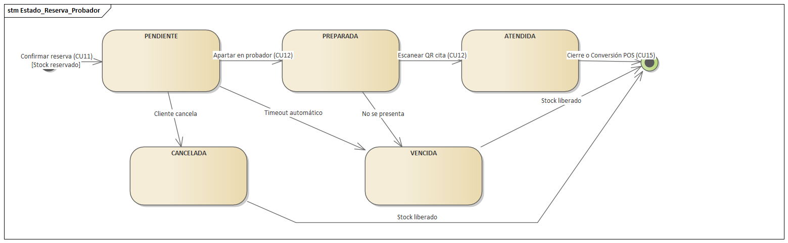

#### b) Ciclo de Vida de la Orden de Venta y Estado de Pago (CU13-CU16)

```plantuml
@startuml Estado_Orden_Venta_Pago
skinparam state {
  BackgroundColor #FEF9E7
  BorderColor #D4AC0D
}

[*] --> PENDIENTE_PAGO : Checkout digital (CU14) / POS preventa (CU15)

state PENDIENTE_PAGO {
  PENDIENTE_PAGO : Esperando procesamiento Stripe o cobro de caja
}

PENDIENTE_PAGO --> PAGADO : Stripe webhook 'succeeded' (CU16) / Cobro POS confirmado (CU15)
PENDIENTE_PAGO --> RECHAZADO : Tarjeta declinada o fondos insuficientes
PENDIENTE_PAGO --> ANULADO : Cancelación por timeout o abandono

RECHAZADO --> PENDIENTE_PAGO : Cliente reintenta con otra tarjeta
RECHAZADO --> ANULADO : Límite de reintentos agotado

state PAGADO {
  PAGADO : Transacción inmutable registrada
  PAGADO : Dispara flujo logístico (CU18)
}

PAGADO --> [*] : Venta formalizada y facturada
ANULADO --> [*] : Carrito o existencias descomprometidas
@enduml
```

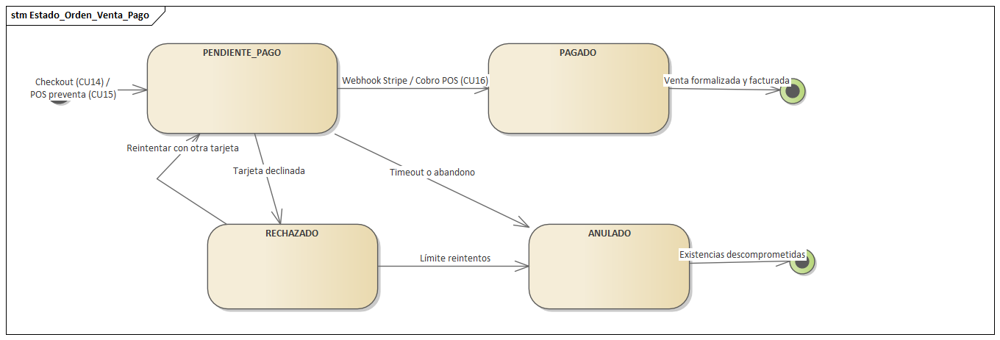

#### c) Ciclo de Vida de la Logística de Delivery - Máquina de Estados Finita (CU18)

Modela la máquina de estados estricta implementada en `LogisticaService` con validación `HTTP 409 Conflict`:

```plantuml
@startuml Estado_Logistica_Delivery_FSM
skinparam state {
  BackgroundColor #E8F8F5
  BorderColor #1ABC9C
}

[*] --> CREADA : Orden pagada (estado_pago = 'PAGADO')

state CREADA {
  CREADA : Pedido ingresado al panel de almacén
}

CREADA --> PREPARACION : Personal inicia empaque
CREADA -[#red]-> EN_TRANSITO : [BLOQUEADO: HTTP 409]

state PREPARACION {
  PREPARACION : Prendas extraídas de estantes y verificadas
}

PREPARACION --> LISTO_DESPACHO : Paquete embalado, pesado y rotulado

state LISTO_DESPACHO {
  LISTO_DESPACHO : Paquete en bahía de salida
}

LISTO_DESPACHO --> EN_TRANSITO : Repartidor recoge y sale a ruta (Delivery)
LISTO_DESPACHO --> ENTREGADA : Cliente retira en mostrador (Pick-up)

state EN_TRANSITO {
  EN_TRANSITO : En camino con chofer asignado y tracking GPS
}

EN_TRANSITO --> ENTREGADA : Repartidor confirma entrega en destino

state ENTREGADA {
  ENTREGADA : Confirmación final, stock descontado en Kardex
}

ENTREGADA --> [*] : Ciclo logístico completado
@enduml
```

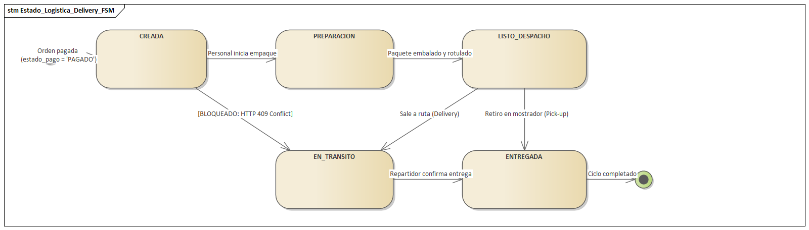

---

### 3.2.3 Diagrama de Navegación del Sistema (Ciclo 2)

Modela el flujo de navegación entre vistas y pantallas para la plataforma web del Ciclo 2:

```plantuml
@startuml Navegacion_Sistema_Ciclo2
skinparam state {
  BackgroundColor #F4F6F6
  BorderColor #5D6D7E
}

state "Catálogo Público (/catalogo)" as VCatalogo
state "Ficha Detalle Prenda (/prenda/:id)" as VDetalle
state "Reserva de Prendas (/reservar)" as VReserva
state "Mis Tickets QR (/mis-tickets)" as VTickets
state "Carrito Sidebar (Drawer Lateral)" as VCarrito
state "Checkout Wizard (/checkout)" as VCheckout
state "Pasarela de Pago (/pagos/orden/:id)" as VPago
state "Tracking en Vivo (/tracking/:id)" as VTracking
state "Tablero Encargado (/encargado/reservas)" as VEncargado
state "Terminal POS de Caja (/pos)" as VPOS
state "Panel Medios Cobro (/admin/pagos-config)" as VAdminPagos
state "Dashboard Logística (/logistica/dashboard)" as VLogistica

[*] --> VCatalogo : Visitante / Cliente
VCatalogo --> VDetalle : Clic prenda
VDetalle --> VReserva : 'Reservar en Sucursal'
VReserva --> VTickets : 'Confirmar Reserva' -> Ticket generado
VTickets --> VCatalogo : 'Seguir comprando'

VDetalle --> VCarrito : 'Agregar al Carrito'
VCarrito --> VCheckout : 'Iniciar Checkout'
VCheckout --> VPago : 'Emitir Orden' -> Redirección pago
VPago --> VTracking : 'Pago Aprobado' -> Ver despacho

[*] --> VEncargado : Encargado de Sucursal
VEncargado --> VPOS : 'Derivar reserva atendida a venta'

[*] --> VPOS : Cajero de Tienda
VPOS --> VPOS : Cobro finalizado -> Nueva venta

[*] --> VAdminPagos : Administrador General
VAdminPagos --> VAdminPagos : Toggle canales en tiempo real

[*] --> VLogistica : Personal de Despacho
VLogistica --> VTracking : Ver ruta de orden específica
@enduml
```

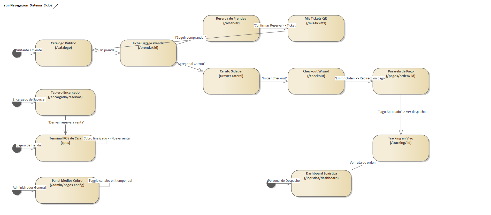

---

### 3.2.4 Diagrama de Tiempo

#### Ciclo de Vida Temporal de una Orden E-Commerce (Checkout -> Pago -> Delivery)

El diagrama modela 3 líneas de vida sincronizadas que comparten la misma escala de tiempo horizontal ($t \in [0, 100]$):

```plantuml
@startuml Diagrama_Tiempo_Orden_Ecommerce
robust "Estado_Pago_Orden" as Pago
robust "Estado_Logistica" as Logistica
concise "Stock_Disponible" as Stock

@0
Pago is PENDIENTE_PAGO
Logistica is CREADA
Stock is "30 uds"

@10
Pago is PENDIENTE_PAGO
Logistica is CREADA
Stock is "30 uds"
note bottom of Pago : Cliente ingresa tarjeta en Stripe Elements

@15
Pago is PAGADO
Logistica is PREPARACION
Stock is "30 uds"
note bottom of Pago : Stripe webhook confirma transacción exitosa

@30
Logistica is LISTO_DESPACHO
Stock is "30 uds"
note bottom of Logistica : Paquete sellado y rotulado

@50
Logistica is EN_TRANSITO
Stock is "30 uds"
note bottom of Logistica : Chofer asignado sale a reparto con GPS

@80
Logistica is ENTREGADA
Stock is "29 uds"
note bottom of Stock : Entrega confirmada y asentada en Kardex

@100
Logistica is ENTREGADA
Stock is "29 uds"
@enduml
```

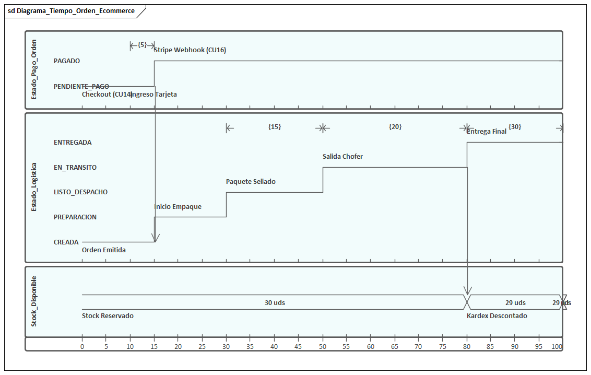

| Tiempo ($t$) | Evento / Estímulo                    |   Estado Pago    | Estado Logística | Stock Disponible | Restricción / Observación                        |
| :----------: | ------------------------------------ | :--------------: | :--------------: | :--------------: | ------------------------------------------------ |
|    **0**     | Checkout: Orden Emitida (CU14)       | `PENDIENTE_PAGO` |     `CREADA`     |      30 uds      | Carrito vaciado, stock reservado atómicamente.   |
|    **10**    | Cliente intenta pago con tarjeta     | `PENDIENTE_PAGO` |     `CREADA`     |      30 uds      | Stripe genera PaymentIntent.                     |
|    **15**    | Stripe confirma cobro exitoso (CU16) |     `PAGADO`     |  `PREPARACION`   |      30 uds      | Transacción inmutable registrada, orden avanza.  |
|    **30**    | Logística empaca prendas             |     `PAGADO`     | `LISTO_DESPACHO` |      30 uds      | Paquete sellado y etiquetado. Duración $\{15\}$. |
|    **50**    | Repartidor recoge paquete            |     `PAGADO`     |  `EN_TRANSITO`   |      30 uds      | Chofer asignado con datos GPS.                   |
|    **80**    | Repartidor entrega al cliente        |     `PAGADO`     |   `ENTREGADA`    |      29 uds      | Stock descontado definitivamente en Kardex.      |

---

## 3.3 Diseño de Datos

### 3.3.1 Diseño de Datos Lógico (Diagrama ER / Clases Persistentes)

Conforme a las directrices de modelado de datos relacional y clases persistentes en 3FN, el siguiente diagrama formaliza el modelo de datos unificado (**Ciclo 1 + Ciclo 2**) generado en Enterprise Architect, detallando entidades de negocio, cardinalidades, tipos de agregación y verbos de relación:

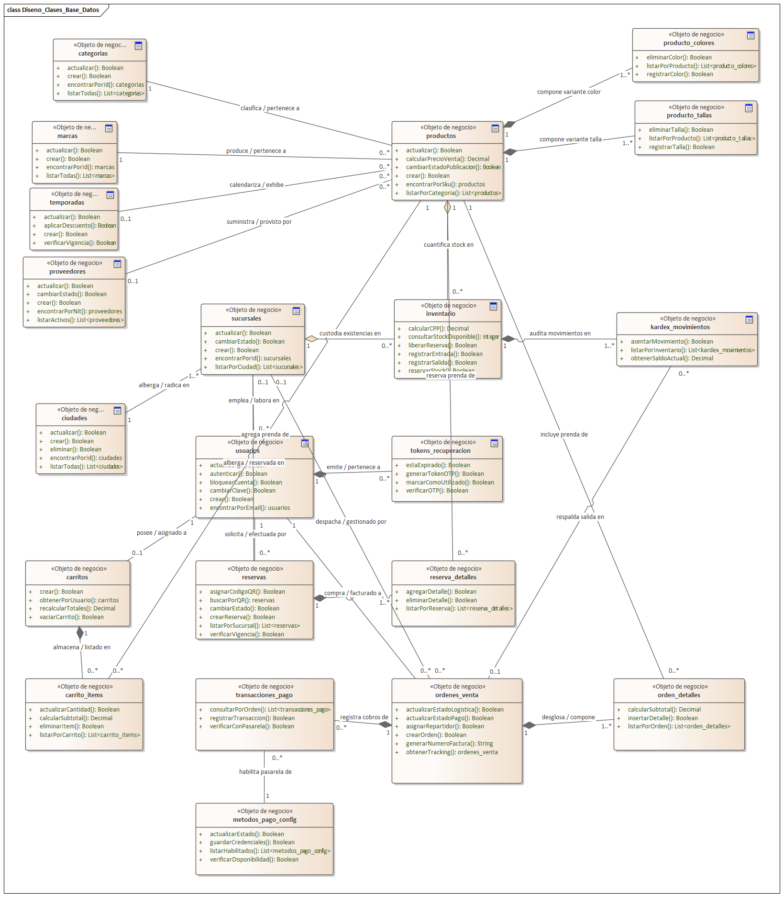

```plantuml
@startuml Diagrama_ER_Clases_Persistentes_Ciclo2
skinparam style strictuml
skinparam classAttributeIconSize 0
skinparam linetype ortho
skinparam shadowing false

class "reservas" as reservas <<entity>> {
  + id_reserva : SERIAL <<PK>>
  --
  # id_usuario : INT <<FK>>
  # id_sucursal : INT <<FK>>
  + codigo_qr : TEXT
  + qr_texto : VARCHAR(200)
  + fecha_visita : TIMESTAMP
  + estado : VARCHAR(20)
  + fecha_creacion : TIMESTAMP
}

class "reserva_detalles" as reserva_detalles <<entity>> {
  + id_reserva_detalle : SERIAL <<PK>>
  --
  # id_reserva : INT <<FK>>
  # id_producto : INT <<FK>>
  + id_variante : INT
  + talla : VARCHAR(10)
  + color : VARCHAR(30)
  + cantidad : INT
}

class "carritos" as carritos <<entity>> {
  + id_carrito : SERIAL <<PK>>
  --
  # id_usuario : INT <<FK>>
  + subtotal : NUMERIC(10,2)
  + total : NUMERIC(10,2)
  + fecha_creacion : TIMESTAMP
}

class "carrito_items" as carrito_items <<entity>> {
  + id_item : SERIAL <<PK>>
  --
  # id_carrito : INT <<FK>>
  # id_producto : INT <<FK>>
  + id_variante : INT
  + talla : VARCHAR(10)
  + color : VARCHAR(30)
  + cantidad : INT
  + precio_unitario : NUMERIC(10,2)
  + subtotal : NUMERIC(10,2)
}

class "ordenes_venta" as ordenes_venta <<entity>> {
  + id_orden : SERIAL <<PK>>
  --
  # id_usuario : INT <<FK>>
  # id_sucursal : INT <<FK>>
  + nro_factura : VARCHAR(50)
  + fecha_emision : TIMESTAMP
  + canal_venta : VARCHAR(20)
  + modalidad_entrega : VARCHAR(20)
  + estado_pago : VARCHAR(20)
  + estado_logistica : VARCHAR(30)
  + direccion_envio : TEXT
  + latitud_destino : NUMERIC(10,7)
  + longitud_destino : NUMERIC(10,7)
  + subtotal : NUMERIC(10,2)
  + costo_envio : NUMERIC(10,2)
  + total : NUMERIC(10,2)
  + nit_ci : VARCHAR(30)
  + razon_social : VARCHAR(150)
  + chofer_nombre : VARCHAR(100)
  + chofer_telefono : VARCHAR(30)
}

class "orden_detalles" as orden_detalles <<entity>> {
  + id_detalle : SERIAL <<PK>>
  --
  # id_orden : INT <<FK>>
  # id_producto : INT <<FK>>
  + id_variante : INT
  + talla : VARCHAR(10)
  + color : VARCHAR(30)
  + cantidad : INT
  + precio_unitario : NUMERIC(10,2)
  + subtotal : NUMERIC(10,2)
}

class "transacciones_pago" as transacciones_pago <<entity>> {
  + id_transaccion : SERIAL <<PK>>
  --
  # id_orden : INT <<FK>>
  + pasarela : VARCHAR(30)
  + id_transaccion_externo : VARCHAR(150)
  + monto : NUMERIC(10,2)
  + moneda : VARCHAR(10)
  + estado : VARCHAR(30)
  + payload_respuesta : JSONB
  + fecha_procesamiento : TIMESTAMP
}

class "metodos_pago_config" as metodos_pago_config <<entity>> {
  + id_metodo : SERIAL <<PK>>
  --
  + codigo : VARCHAR(30)
  + nombre_visible : VARCHAR(100)
  + activo : BOOLEAN
  + canales_permitidos : JSONB
  + credenciales_json : JSONB
  + comision_porcentaje : NUMERIC(5,2)
}

reservas "1" *-- "1..*" reserva_detalles : contiene
carritos "1" *-- "0..*" carrito_items : almacena
ordenes_venta "1" *-- "1..*" orden_detalles : desglosa
ordenes_venta "1" o-- "0..*" transacciones_pago : registra
@enduml
```

### 3.3.2 Diseño de Datos Físico (Script DDL SQL en PostgreSQL)

```sql
-- ============================================================================
-- SCRIPT DDL: EXTENSIONES DE BASE DE DATOS FASHIONSTORE (CICLO 2)
-- Motor: PostgreSQL 15+ | Esquema Normalizado 3FN
-- ============================================================================

-- 1. Tabla de Reservas de Probadores en Sucursales (CU11/CU12)
CREATE TABLE reservas (
    id_reserva SERIAL PRIMARY KEY,
    id_usuario INTEGER NOT NULL REFERENCES usuarios(id_usuario) ON DELETE CASCADE,
    id_sucursal INTEGER NOT NULL REFERENCES sucursales(id_sucursal) ON DELETE CASCADE,
    codigo_qr TEXT NOT NULL UNIQUE,
    qr_texto VARCHAR(200) UNIQUE,
    fecha_visita TIMESTAMP NOT NULL,
    estado VARCHAR(30) DEFAULT 'PENDIENTE' 
        CHECK (estado IN ('PENDIENTE', 'PREPARADA', 'ATENDIDA', 'VENCIDA', 'CANCELADA')),
    creado_en TIMESTAMP DEFAULT CURRENT_TIMESTAMP
);

CREATE TABLE reserva_detalles (
    id_reserva_detalle SERIAL PRIMARY KEY,
    id_reserva INTEGER NOT NULL REFERENCES reservas(id_reserva) ON DELETE CASCADE,
    id_producto INTEGER NOT NULL REFERENCES productos(id_producto) ON DELETE CASCADE,
    talla VARCHAR(20) NOT NULL,
    color VARCHAR(50) NOT NULL,
    cantidad INTEGER NOT NULL DEFAULT 1
);

-- 2. Tabla de Carrito de Compras Omnicanal (CU13)
CREATE TABLE carritos (
    id_carrito SERIAL PRIMARY KEY,
    id_usuario INTEGER NOT NULL UNIQUE REFERENCES usuarios(id_usuario) ON DELETE CASCADE,
    creado_en TIMESTAMP DEFAULT CURRENT_TIMESTAMP,
    actualizado_en TIMESTAMP DEFAULT CURRENT_TIMESTAMP
);

CREATE TABLE carrito_items (
    id_item SERIAL PRIMARY KEY,
    id_carrito INTEGER NOT NULL REFERENCES carritos(id_carrito) ON DELETE CASCADE,
    id_producto INTEGER NOT NULL REFERENCES productos(id_producto) ON DELETE CASCADE,
    talla VARCHAR(20) NOT NULL,
    color VARCHAR(50) NOT NULL,
    cantidad INTEGER NOT NULL DEFAULT 1,
    precio_unitario NUMERIC(10, 2) NOT NULL,
    subtotal NUMERIC(10, 2) NOT NULL,
    creado_en TIMESTAMP DEFAULT CURRENT_TIMESTAMP
);

-- 3. Tabla de Órdenes de Venta y Logística Omnicanal (CU14/CU15/CU18)
CREATE TABLE ordenes_venta (
    id_orden SERIAL PRIMARY KEY,
    id_usuario INTEGER REFERENCES usuarios(id_usuario) ON DELETE SET NULL,
    id_sucursal INTEGER REFERENCES sucursales(id_sucursal) ON DELETE SET NULL,
    numero_factura VARCHAR(50) UNIQUE,
    canal_venta VARCHAR(20) NOT NULL DEFAULT 'WEB' CHECK (canal_venta IN ('WEB', 'APP', 'POS')),
    modalidad_entrega VARCHAR(20) NOT NULL CHECK (modalidad_entrega IN ('DELIVERY', 'RETIRO_TIENDA', 'COMPRA_FISICA')),
    nit_factura VARCHAR(30),
    razon_social_factura VARCHAR(150),
    direccion_envio VARCHAR(255),
    telefono_contacto VARCHAR(30),
    notas_entrega TEXT,
    subtotal NUMERIC(10, 2) NOT NULL,
    costo_envio NUMERIC(10, 2) DEFAULT 0.00,
    total NUMERIC(10, 2) NOT NULL,
    estado_pago VARCHAR(20) DEFAULT 'PENDIENTE' CHECK (estado_pago IN ('PENDIENTE', 'PAGADO', 'RECHAZADO')),
    estado_logistica VARCHAR(30) DEFAULT 'CREADA' 
        CHECK (estado_logistica IN ('CREADA', 'PREPARACION', 'LISTO_DESPACHO', 'EN_TRANSITO', 'ENTREGADA')),
    creado_en TIMESTAMP DEFAULT CURRENT_TIMESTAMP,
    id_repartidor INTEGER REFERENCES usuarios(id_usuario) ON DELETE SET NULL,
    nombre_repartidor VARCHAR(100),
    telefono_repartidor VARCHAR(30),
    latitud_destino NUMERIC(10, 8),
    longitud_destino NUMERIC(11, 8),
    distancia_km NUMERIC(6, 2)
);

CREATE TABLE ordenes_detalle (
    id_detalle_orden SERIAL PRIMARY KEY,
    id_orden INTEGER NOT NULL REFERENCES ordenes_venta(id_orden) ON DELETE CASCADE,
    id_producto INTEGER NOT NULL REFERENCES productos(id_producto),
    talla VARCHAR(20) NOT NULL,
    color VARCHAR(50) NOT NULL,
    cantidad INTEGER NOT NULL,
    precio_unitario NUMERIC(10, 2) NOT NULL,
    subtotal NUMERIC(10, 2) NOT NULL
);

-- 4. Tabla de Pasarela de Pagos Electrónicos (CU16)
CREATE TABLE transacciones_pago (
    id_transaccion SERIAL PRIMARY KEY,
    id_orden INTEGER NOT NULL REFERENCES ordenes_venta(id_orden) ON DELETE CASCADE,
    pasarela VARCHAR(50) NOT NULL DEFAULT 'STRIPE',
    payment_intent_id VARCHAR(150) NOT NULL UNIQUE,
    monto NUMERIC(10, 2) NOT NULL,
    moneda VARCHAR(10) DEFAULT 'BOB',
    estado VARCHAR(30) DEFAULT 'SUCCEEDED',
    metodo_pago VARCHAR(50) DEFAULT 'card',
    marca_tarjeta VARCHAR(50),
    ultimos4 VARCHAR(4),
    detalles_raw TEXT,
    fecha_creacion TIMESTAMP DEFAULT CURRENT_TIMESTAMP
);

-- 5. Tabla de Configuración de Medios de Cobro (CU17)
CREATE TABLE metodos_pago (
    id_metodo SERIAL PRIMARY KEY,
    codigo VARCHAR(50) NOT NULL UNIQUE,
    nombre VARCHAR(100) NOT NULL,
    tipo VARCHAR(30) NOT NULL DEFAULT 'OMNICANAL' CHECK (tipo IN ('FISICO', 'DIGITAL', 'OMNICANAL')),
    descripcion VARCHAR(255),
    icono VARCHAR(50),
    activo BOOLEAN NOT NULL DEFAULT TRUE,
    requiere_credenciales BOOLEAN NOT NULL DEFAULT FALSE,
    credenciales_json TEXT,
    creado_en TIMESTAMP DEFAULT CURRENT_TIMESTAMP,
    actualizado_en TIMESTAMP DEFAULT CURRENT_TIMESTAMP
);

-- Índices de alto rendimiento para operaciones transaccionales
CREATE INDEX idx_reservas_usuario ON reservas(id_usuario);
CREATE INDEX idx_reservas_sucursal ON reservas(id_sucursal, estado);
CREATE INDEX idx_carritos_usuario ON carritos(id_usuario);
CREATE INDEX idx_ordenes_usuario ON ordenes_venta(id_usuario);
CREATE INDEX idx_ordenes_estado ON ordenes_venta(estado_pago, estado_logistica);
CREATE INDEX idx_transacciones_orden ON transacciones_pago(id_orden);
```

### 3.3.3 Población de Datos (Script DML SQL en PostgreSQL)

```sql
-- ============================================================================
-- SCRIPT DML: POBLACIÓN DE DATOS SEMILLA PARA EL CICLO 2
-- ============================================================================

-- 1. Métodos de Pago (CU17)
INSERT INTO metodos_pago (codigo, nombre, tipo, descripcion, icono, activo, requiere_credenciales, credenciales_json) VALUES
('EFECTIVO', 'Efectivo en Caja Mostrador', 'FISICO', 'Cobro presencial en efectivo con cálculo automático de vuelto', '💵', TRUE, FALSE, NULL),
('TARJETA_POS', 'Terminal POS / Tarjeta Física', 'FISICO', 'Pago con tarjeta de débito/crédito en terminal física de sucursal', '💳', TRUE, FALSE, NULL),
('STRIPE', 'Pasarela Digital Stripe', 'DIGITAL', 'Cobro online seguro con tokenización PCI-DSS y 3D Secure', '🔒', TRUE, TRUE, '{"publishable_key": "pk_test_ejemplo", "secret_key": "sk_test_ejemplo", "webhook_secret": "whsec_ejemplo"}'),
('QR_BCB', 'Código QR Simple BCB', 'OMNICANAL', 'Pago interoperable con estándar QR del Banco Central de Bolivia', '📱', FALSE, TRUE, NULL);

-- 2. Reserva de Demostración (CU11)
INSERT INTO reservas (id_usuario, id_sucursal, codigo_qr, qr_texto, fecha_visita, estado) VALUES
(6, 1, 'data:image/png;base64,RESERVA_QR_DEMO_BASE64', 'RSV-2026-A1B2C3', '2026-09-15 10:00:00', 'PENDIENTE');

INSERT INTO reserva_detalles (id_reserva, id_producto, talla, color, cantidad) VALUES
(1, 1, 'M', 'Azul Marino', 1),
(1, 2, '32', 'Beige Arena', 1);

-- 3. Carrito de Demostración (CU13)
INSERT INTO carritos (id_usuario) VALUES (6);

INSERT INTO carrito_items (id_carrito, id_producto, talla, color, cantidad, precio_unitario, subtotal) VALUES
(1, 1, 'L', 'Blanco Óptico', 2, 280.00, 560.00),
(1, 3, '40', 'Gris Plomo', 1, 650.00, 650.00);

-- 4. Orden de Venta de Demostración (CU14)
INSERT INTO ordenes_venta (id_usuario, id_sucursal, numero_factura, canal_venta, modalidad_entrega, nit_factura, razon_social_factura, direccion_envio, telefono_contacto, subtotal, costo_envio, total, estado_pago, estado_logistica, latitud_destino, longitud_destino, distancia_km) VALUES
(6, 1, 'FS-2026-000001', 'WEB', 'DELIVERY', '1234567013', 'Rodrigo Paz', 'Av. Banzer km 6, Santa Cruz', '+591 70012345', 1210.00, 25.00, 1235.00, 'PAGADO', 'PREPARACION', -17.75200000, -63.19800000, 3.45);

INSERT INTO ordenes_detalle (id_orden, id_producto, talla, color, cantidad, precio_unitario, subtotal) VALUES
(1, 1, 'L', 'Blanco Óptico', 2, 280.00, 560.00),
(1, 3, '40', 'Gris Plomo', 1, 650.00, 650.00);

-- 5. Transacción de Pago de Demostración (CU16)
INSERT INTO transacciones_pago (id_orden, pasarela, payment_intent_id, monto, moneda, estado, metodo_pago, marca_tarjeta, ultimos4) VALUES
(1, 'STRIPE', 'pi_3PdemoFashionStore2026', 1235.00, 'BOB', 'SUCCEEDED', 'card', 'visa', '4242');
```

---

# 4. Flujo de Trabajo: Implementación

## 4.1 Selección de Tecnologías Adicionales para Ciclo 2

Además del stack tecnológico base establecido en el Ciclo 1 (FastAPI, Angular 19, PostgreSQL, Docker), el Ciclo 2 incorpora:

- **Pasarela de Cobro Digital:** SDK de `stripe-python` integrado en FastAPI y Stripe Elements en Angular con autenticación 3D Secure y tokenización PCI-DSS.
- **Generación de Códigos QR:** Biblioteca Python `qrcode` y `Pillow` para generar tickets de reserva en Base64 Data URI y escaneo mediante entrada manual por token alfanumérico.
- **Cálculo Geoespacial:** Algoritmo matemático esférico de Haversine implementado en `app/modules/logistica/geo.py` con radio terrestre medio (R = 6371 km).
- **Monitoreo de Infraestructura:** Endpoint de métricas ejecutivas consolidadas `GET /api/v1/dashboard/metricas` con agregación SQL de alto rendimiento.

---

## 4.2 Implementación de la Arquitectura del Sistema Principal

La arquitectura del Ciclo 2 extiende los 3 niveles de abstracción del Ciclo 1:

1. **Capa de Presentación:** Componentes standalone Angular 19 para los módulos de Reservas, Carrito, Checkout, POS, Pagos, Configuración Financiera, Logística y Tracking. Comunicación asíncrona vía HTTPS / REST con payloads JSON.
2. **Capa de Lógica de Negocio:** Nuevos servicios desacoplados (`ReservasService`, `CarritoService`, `OrdenesService`, `PosService`, `PagosService`, `PagoConfigService`, `LogisticaService`) con reglas algorítmicas específicas.
3. **Capa de Persistencia:** Nuevos modelos SQLAlchemy (`Reserva`, `ReservaDetalle`, `Carrito`, `CarritoItem`, `OrdenVenta`, `OrdenDetalle`, `TransaccionPago`, `MetodoPagoConfig`) con constraints CHECK, bloqueos pesimistas y transaccionalidad ACID.

---

## 4.3 Implementación de la Arquitectura del Sub Sistema

El Ciclo 2 incorpora 5 subsistemas transaccionales adicionales, comunicados mediante interfaces de componentes estandarizadas según el patrón ball-and-socket:

### 4.3.0 Integración de los 5 Subsistemas del Ciclo 2 con Interfaces Provistas y Requeridas

- **IValidarMetodoPago:** Proporcionada por Pagos y Finanzas (P9) para que POS (P8) y Checkout (P7) verifiquen en tiempo real qué canales de cobro están habilitados.
- **ICrearOrdenVenta:** Proporcionada por Venta Digital (P7) para emitir órdenes correlativas que Pagos y Logística consumen.
- **IStockReservado:** Proporcionada por Reservas (P6) para que el inventario del Ciclo 1 gestione el apartado temporal de prendas.
- **IDespachoOrden:** Proporcionada por Logística (P10) para avanzar el estado de entrega de órdenes pagadas.
- **ISeguridadRBAC:** Heredada del Ciclo 1 (P1) para autorizar y autenticar cada transacción con tokens JWT y roles.

```plantuml
@startuml Diagrama_Integracion_5_Subsistemas_Ciclo2
skinparam componentStyle uml2
skinparam shadowing false

package "Ciclo 1: Plataforma Base" #F2F4F4 {
  [Sub1: Seguridad y RBAC] as Sub1
  [Sub5: Inventario y CPP] as Sub5
  interface "ISeguridadRBAC" as ISeg
  interface "IControlStock" as IStock
  Sub1 - ISeg
  Sub5 - IStock
}

package "Ciclo 2: Transaccionalidad Omnicanal" {

  package "Sub6: Reservas Presenciales (CU11, CU12)" #EBF5FB {
    [M10: ModuloReservas] as Sub6
    interface "IStockReservado" as IResStock
    Sub6 - IResStock
  }

  package "Sub7: Carrito y Checkout (CU13, CU14)" #FEF9E7 {
    [M11_M12: VentaDigital] as Sub7
    interface "ICrearOrdenVenta" as IOrden
    Sub7 - IOrden
  }

  package "Sub8: Terminal POS (CU15)" #FDEDEC {
    [M13: ModuloPOS] as Sub8
  }

  package "Sub9: Pagos y Finanzas (CU16, CU17)" #EAFAF1 {
    [M14_M15: ModuloPagos] as Sub9
    interface "IValidarMetodoPago" as IPagoVal
    interface "IProcesarCobro" as ICobro
    Sub9 - IPagoVal
    Sub9 - ICobro
  }

  package "Sub10: Logística y Delivery (CU18)" #E8F8F5 {
    [M19: ModuloLogistica] as Sub10
    interface "IDespachoOrden" as IDespacho
    Sub10 - IDespacho
  }
}

' Relaciones con interfaces
Sub6 ..> ISeg : requiere
Sub6 ..> IStock : aparta stock

Sub7 ..> ISeg : requiere
Sub7 ..> IStock : verifica stock
Sub7 ..> IPagoVal : consulta canales activos

Sub8 ..> ISeg : requiere
Sub8 ..> IStock : descuenta físico
Sub8 ..> IPagoVal : valida canal POS
Sub8 ..> IResStock : convierte reserva atendida

Sub7 ..> ICobro : deriva a pasarela
IDespacho <.. Sub9 : dispara al pagar orden
Sub10 ..> IOrden : consulta coordenadas y destino
@enduml
```

### 4.3.1 Sub Sistema 6: Reservas Presenciales Omnicanal (M10 - CU11, CU12)

Encapsula la generación de tickets QR con UUID único, el bloqueo pesimista de inventario (`SELECT ... FOR UPDATE`) para el apartado de stock reservado, la coordinación entre el cliente y el encargado de tienda, y la transición de estados (PENDIENTE -> PREPARADA -> ATENDIDA) con validación de pertenencia a sucursal.

### 4.3.2 Sub Sistema 7: Carrito y Checkout Digital (M11, M12 - CU13, CU14)

Gestiona la persistencia atómica del carrito de compras en base de datos (tabla `carritos` con relación 1:1 por usuario), la validación de existencias en cada operación de adición/modificación, el wizard de checkout en 3 pasos con cálculo de tarifa Haversine para delivery, y la emisión de la orden de venta con número de factura correlativo único.

### 4.3.3 Sub Sistema 8: Terminal Punto de Venta POS (M13 - CU15)

Implementa la búsqueda ágil de productos por código SKU con consulta de stock por sucursal, el selector de variantes con factores de ajuste de precio por talla (S:-5%, M:Base, L:+5%, XL:+10%, XXL:+15%), la conversión de reservas presenciales a ventas directas, el cobro multi-método con cálculo de cambio para efectivo y el registro inmutable de asientos de VENTA en el Kardex del inventario.

### 4.3.4 Sub Sistema 9: Procesamiento de Pagos y Configuración Financiera (M14, M15 - CU16, CU17)

Integra el SDK de Stripe con generación de PaymentIntents en centavos enteros (conversión Bs x 100), tokenización PCI-DSS sin almacenamiento de datos sensibles de tarjeta, verificación server-side del cobro y registro de transacciones inmutables. El panel de configuración permite toggle switches en tiempo real y enmascaramiento de claves API con revelación por icono de ojo.

### 4.3.5 Sub Sistema 10: Logística de Delivery y Tracking GPS (M19 - CU18)

Implementa la máquina de estados finita estricta (TRANSICIONES_PERMITIDAS definida en services.py) que valida cada transición y emite HTTP 409 Conflict ante saltos no autorizados. Incluye el cálculo de distancia geodésica Haversine (geo.py), la asignación de repartidores con datos de contacto, y el stepper visual de 4 etapas con simulación interactiva para demostración académica.

---

## 4.4 Módulos Backend y Frontend Implementados

### Módulos Backend (FastAPI):
- `app/modules/reservas/` - models.py, schemas.py, services.py, router.py (CU11, CU12)
- `app/modules/carrito/` - models.py, schemas.py, services.py, router.py (CU13)
- `app/modules/ordenes/` - models.py, schemas.py, services.py, router.py (CU14)
- `app/modules/pos/` - schemas.py, services.py, router.py (CU15)
- `app/modules/pagos/` - models.py, schemas.py, services.py, router.py, config_router.py (CU16, CU17)
- `app/modules/logistica/` - schemas.py, services.py, router.py, geo.py (CU18)
- `app/modules/dashboard/` - Consolidación de Métricas Ejecutivas

### Vistas y Componentes Frontend (Angular 19):
- `app/pages/reservas/` (CU11 - Reservar Prendas y Mis Tickets QR)
- `app/pages/encargado-dashboard/` (CU12 - Tablero de Probadores y Escáner QR)
- `app/shared/carrito-sidebar/` (CU13 - Gaveta Lateral del Carrito)
- `app/pages/checkout/` (CU14 - Wizard de Checkout 3 Pasos)
- `app/pages/pos/` (CU15 - Terminal Punto de Venta con Modal de Variantes)
- `app/pages/pagos/` (CU16 - Formulario Stripe Elements con 3D Secure)
- `app/pages/admin-pagos/` (CU17 - Panel de Configuración de Medios de Cobro)
- `app/pages/logistica/` (CU18 - Dashboard de Despacho con Kanban)
- `app/pages/tracking/` (CU18 - Seguimiento en Vivo con Stepper y GPS)

### Diseño de Clases del Dominio y Servicios (Backend FastAPI):

- **`ReservasService` (`app/modules/reservas/services.py`):**
  - `crear_reserva(...)`: Valida existencias con bloqueo pesimista en la sucursal, aparta stock temporal (stock_reservado += cantidad), genera imagen QR con biblioteca `qrcode` en Base64 y asocia `qr_texto` UUID.
  - `listar_reservas_sucursal(...)`: Filtra las reservas por tienda para la vista del encargado (CU12).
  - `atender_reserva(...)`: Realiza la lectura del QR presencial y transiciona a estado `ATENDIDA`.

- **`CarritoService` (`app/modules/carrito/services.py`):**
  - `agregar_item(...)`: Realiza inserción o incremento atómico validando que la suma no supere el stock de la prenda.
  - `actualizar_cantidad(...)` y `eliminar_item(...)`: Recalcula subtotales dinámicos.
  - `obtener_carrito(...)`: Retorna el carrito completo con totales agregados.

- **`OrdenesService` (`app/modules/ordenes/services.py`):**
  - `crear_orden_checkout(...)`: Formaliza la orden de venta desde el carrito, descuenta inventario atómicamente, calcula flete geodésico Haversine si es delivery y genera número de factura correlativo.

- **`PosService` (`app/modules/pos/services.py`):**
  - `buscar_producto_por_sku(...)`: Consulta rápida con atributos completos de variantes, tallas, colores y existencias en la sucursal del cajero.
  - `procesar_venta_pos(...)`: Valida que el canal de cobro esté habilitado en `metodos_pago` (CU17), calcula cambio de efectivo, asienta salida en Kardex y emite comprobante.

- **`PagosService` (`app/modules/pagos/services.py`):**
  - `crear_intencion_pago(...)`: Verifica que Stripe esté habilitado (CU17), genera el `PaymentIntent` en centavos enteros y asocia metadata.
  - `confirmar_transaccion_pago(...)`: Verifica contra la API de Stripe, actualiza la orden a `PAGADO` y registra la transacción inmutable.

- **`PagoConfigService` (`app/modules/pagos/services.py`):**
  - `listar_metodos_pago(...)`: Enmascara claves sensibles antes de enviarlas al frontend (`sk_test_****dXFK`).
  - `actualizar_metodo_pago(...)`: Actualiza el interruptor activo/inactivo y propaga llaves API de Stripe en tiempo de ejecución.

- **`LogisticaService` (`app/modules/logistica/services.py`):**
  - Implementa la máquina de estados finita estricta: CREADA -> PREPARACION -> LISTO_DESPACHO -> EN_TRANSITO -> ENTREGADA. Si se intenta una transición inválida, responde con HTTP 409 Conflict.
  - `calcular_distancia_haversine(...)` y `calcular_tarifa_delivery(...)`: Algoritmo matemático esférico sobre las coordenadas GPS de la sucursal y el cliente.

---

## 4.5 Diseño de Interfaz y Componentes (Frontend Angular 19)

El frontend utiliza componentes standalone de Angular 19 integrados con un diseño visual premium (Outfit typography, dark glassmorphism, micro-animaciones y paletas HSL seleccionadas):

- **Resolución Unificada de Endpoints (`API_BASE_URL`):**
  - Todos los servicios (`FashionApiService`, `PosService`, `PagoConfigService`, `LogisticaService`, `PagosService`, `CheckoutService`, `CarritoService`) consumen `api.constants.ts`.
  - Si se ejecuta en modo desarrollo en el puerto `4200`, redirige automáticamente hacia `http://localhost:8000/api/v1`. En producción o embebido en FastAPI, opera con ruta relativa `/api/v1`.
- **Detección de Cambios Reactiva (`ChangeDetectorRef`):**
  - Para resolver el problema de event coalescing en Angular standalone donde las respuestas HTTP asíncronas no renderizaban de inmediato, se inyectó `ChangeDetectorRef.detectChanges()` en puntos clave:
    - Carga inmediata del catálogo y variantes en Caja POS (CU15).
    - Carga de canales de cobro y toggle switches en Configuración Financiera (CU17).
    - Panel de control de métricas y KPIs en tiempo real (Dashboard).
    - Actualización del tracking de delivery en vivo (CU18).

---

# 5. Flujo de Trabajo: Pruebas

## 5.1 Pruebas de Casos de Uso (Caja Negra)

Se documentan las pruebas formales de caja negra realizadas sobre los 8 Casos de Uso del Ciclo 2 para validar exhaustivamente las condiciones de aceptación funcionales, transaccionales y de seguridad:

### Prueba de caso de uso CU11: Solicitar Reserva de Prendas en Sucursal

| Campo          | Detalle                                                                                                                                                                                                        |
| -------------- | -------------------------------------------------------------------------------------------------------------------------------------------------------------------------------------------------------------- |
| Caso de uso 11 | Solicitar Reserva de Prendas en Sucursal                                                                                                                                                                       |
| Descripción    | Permite al cliente reservar prendas para probárselas en una sucursal, seleccionando la tienda, fecha/hora de visita y las prendas con talla y color, generando un ticket QR único persistente en su historial. |
| Precondiciones | a) El cliente debe estar autenticado con sesión JWT activa. b) Deben existir prendas con stock disponible en la sucursal elegida. c) La sucursal debe encontrarse en estado OPERATIVA.                         |

| Paso | Acción                                                                                   | Resultado esperado                                                                                          | Estado        |
| ---- | ---------------------------------------------------------------------------------------- | ----------------------------------------------------------------------------------------------------------- | ------------- |
| 1    | Acceder al módulo de reservas desde la barra de navegación.                              | Se despliega el formulario con selector de sucursales y prendas disponibles.                                | Satisfactorio |
| 2    | Seleccionar sucursal "Equipetrol" y fecha/hora de visita en zona horaria local (-04:00). | Los campos se validan y muestran la dirección y probadores disponibles de la tienda.                        | Satisfactorio |
| 3    | Agregar prenda "Camisa Oxford Slim Fit" en talla M y color Azul Marino.                  | El sistema confirma stock disponible en la sucursal Equipetrol para la variante seleccionada.               | Satisfactorio |
| 4    | Presionar "Confirmar y Generar Ticket QR de Reserva".                                    | Se genera el ticket con imagen QR en Base64 y código alfanumérico (RSV-xxxx), se aparta el stock reservado. | Satisfactorio |
| 5    | Navegar a "Mis Tickets QR".                                                              | Se visualiza el historial completo de tickets generados con el código QR legible y la opción de descarga.   | Satisfactorio |
| 6    | Intentar reservar una prenda con stock 0 en la sucursal elegida.                         | El sistema rechaza con HTTP 400: "Stock insuficiente para el producto en talla y color".                    | Satisfactorio |

| Campo                  | Detalle             |
| ---------------------- | ------------------- |
| Responsable            | Cliente / Tester QA |
| Resultado de la prueba | Satisfactorio       |

---

### Prueba de caso de uso CU12: Preparar y Atender Reserva Presencial

| Campo          | Detalle                                                                                                                                                 |
| -------------- | ------------------------------------------------------------------------------------------------------------------------------------------------------- |
| Caso de uso 12 | Preparar y Atender Reserva Presencial                                                                                                                   |
| Descripción    | Permite al encargado de sucursal gestionar las reservas, apartar las prendas en el probador y validar la presencia del cliente escaneando su ticket QR. |
| Precondiciones | a) El encargado debe estar autenticado con rol ENCARGADO_SUCURSAL. b) Deben existir reservas en estado PENDIENTE asignadas a su sucursal.               |

| Paso | Acción                                                              | Resultado esperado                                                                             | Estado        |
| ---- | ------------------------------------------------------------------- | ---------------------------------------------------------------------------------------------- | ------------- |
| 1    | Acceder al tablero de reservas del encargado.                       | Se muestran las métricas del día y las reservas pendientes filtradas por la sucursal asignada. | Satisfactorio |
| 2    | Presionar "Apartar en Probador" sobre una reserva pendiente.        | El estado cambia a PREPARADA y las prendas quedan apartadas en el probador asignado.           | Satisfactorio |
| 3    | El cliente se presenta en tienda y muestra su ticket QR.            | El encargado visualiza el módulo de escaneo de QR con lector de cámara y entrada manual.       | Satisfactorio |
| 4    | Escanear el código QR del cliente o digitar el código alfanumérico. | El sistema valida que el QR pertenece a esa sucursal y marca la reserva como ATENDIDA.         | Satisfactorio |
| 5    | Verificar habilitación del botón "Facturar en Caja POS".            | El botón se habilita permitiendo derivar las prendas al cajero para venta directa.             | Satisfactorio |
| 6    | Intentar escanear un QR de otra sucursal.                           | El sistema rechaza con error: "El ticket no pertenece a esta sucursal".                        | Satisfactorio |

| Campo                  | Detalle               |
| ---------------------- | --------------------- |
| Responsable            | Encargado de Sucursal |
| Resultado de la prueba | Satisfactorio         |

---

### Prueba de caso de uso CU13: Administrar Carrito de Compras Omnicanal

| Campo          | Detalle                                                                                                                                                                |
| -------------- | ---------------------------------------------------------------------------------------------------------------------------------------------------------------------- |
| Caso de uso 13 | Administrar Carrito de Compras Omnicanal                                                                                                                               |
| Descripción    | Permite al cliente agregar prendas al carrito desde el catálogo, modificar cantidades y eliminar ítems, con persistencia en base de datos y validación de existencias. |
| Precondiciones | a) Cliente autenticado con sesión activa. b) Prendas publicadas con stock disponible. c) Conexión activa con el backend.                                               |

| Paso | Acción                                                                | Resultado esperado                                                                                        | Estado        |
| ---- | --------------------------------------------------------------------- | --------------------------------------------------------------------------------------------------------- | ------------- |
| 1    | Seleccionar prenda desde el catálogo y presionar "Añadir a la Bolsa". | La gaveta lateral se despliega mostrando el ítem agregado con imagen, talla, color y precio.              | Satisfactorio |
| 2    | Agregar un segundo producto con diferente talla y color.              | La bolsa muestra dos ítems con subtotales y total recalculados.                                           | Satisfactorio |
| 3    | Incrementar la cantidad de un ítem usando el botón "+".               | El subtotal y total se recalculan dinámicamente en tiempo real.                                           | Satisfactorio |
| 4    | Intentar superar el stock disponible con el botón "+".                | El botón se desactiva automáticamente al alcanzar el límite de stock disponible.                          | Satisfactorio |
| 5    | Eliminar un ítem del carrito usando el botón de eliminar.             | El ítem se remueve con animación suave y el total se actualiza correctamente.                             | Satisfactorio |
| 6    | Recargar la página y verificar persistencia del carrito.              | Los ítems del carrito se mantienen intactos gracias a la persistencia en la tabla carritos/carrito_items. | Satisfactorio |

| Campo                  | Detalle             |
| ---------------------- | ------------------- |
| Responsable            | Cliente / Tester QA |
| Resultado de la prueba | Satisfactorio       |

---

### Prueba de caso de uso CU14: Procesar Compra Digital y Checkout

| Campo          | Detalle                                                                                                                                                                        |
| -------------- | ------------------------------------------------------------------------------------------------------------------------------------------------------------------------------ |
| Caso de uso 14 | Procesar Compra Digital y Checkout                                                                                                                                             |
| Descripción    | Permite al cliente formalizar su compra mediante un wizard de 3 pasos, seleccionando modalidad de entrega, datos de facturación y confirmando la emisión de la orden de venta. |
| Precondiciones | a) Carrito con al menos un ítem activo. b) Usuario autenticado. c) Backend y base de datos activos.                                                                            |

| Paso | Acción                                                                    | Resultado esperado                                                                                        | Estado        |
| ---- | ------------------------------------------------------------------------- | --------------------------------------------------------------------------------------------------------- | ------------- |
| 1    | Acceder al checkout desde el botón "Proceder al Pago" del carrito.        | Se despliega el wizard en el Paso 1: Selección de modalidad de entrega.                                   | Satisfactorio |
| 2    | Seleccionar "Envío a Domicilio / Delivery" e ingresar dirección de envío. | Se calcula la tarifa de envío mediante la fórmula de Haversine y se muestra el costo en Bs.               | Satisfactorio |
| 3    | Avanzar al Paso 2 e ingresar NIT/CI y Razón Social para facturación.      | Los datos fiscales se validan y quedan asociados a la orden.                                              | Satisfactorio |
| 4    | Avanzar al Paso 3 y revisar el resumen financiero consolidado.            | Se visualiza el desglose: Subtotal, Costo de Envío y Total a pagar en Bs.                                 | Satisfactorio |
| 5    | Presionar "Confirmar Orden y Proceder al Pago".                           | Se genera la orden con número correlativo único, se vacía el carrito y se redirige a la pasarela de pago. | Satisfactorio |
| 6    | Verificar que el carrito queda vacío tras la confirmación.                | El badge del carrito muestra 0 y la gaveta lateral muestra "Tu bolsa está vacía".                         | Satisfactorio |

| Campo                  | Detalle                     |
| ---------------------- | --------------------------- |
| Responsable            | Cliente / Tester E-Commerce |
| Resultado de la prueba | Satisfactorio               |

---

### Prueba de caso de uso CU15: Registrar Venta Presencial en Caja (POS)

| Campo          | Detalle                                                                                                                                                                            |
| -------------- | ---------------------------------------------------------------------------------------------------------------------------------------------------------------------------------- |
| Caso de uso 15 | Registrar Venta Presencial en Caja (POS)                                                                                                                                           |
| Descripción    | Permite al cajero facturar ventas en mostrador con escaneo SKU, recálculo dinámico de precios por talla, cobro multi-método con cálculo de vuelto y descuento inmutable en Kardex. |
| Precondiciones | a) Cajero autenticado con turno activo y sucursal asignada. b) Inventario físico en la sucursal. c) Al menos un método de pago habilitado.                                         |

| Paso | Acción                                                         | Resultado esperado                                                                                         | Estado        |
| ---- | -------------------------------------------------------------- | ---------------------------------------------------------------------------------------------------------- | ------------- |
| 1    | Acceder a la terminal POS en `/pos`.                           | Se muestra la cuadrícula de prendas de la sucursal con tarjetas de 230px de altura, renderizado inmediato. | Satisfactorio |
| 2    | Seleccionar una prenda para ver el modal de variantes.         | Se despliega el selector de tallas con factores de ajuste (S: -5%, M: Base, L: +5%, XL: +10%).             | Satisfactorio |
| 3    | Cambiar la talla de M a XL y verificar el recálculo de precio. | El precio unitario se ajusta dinámicamente (+10%) y el subtotal se recalcula al instante.                  | Satisfactorio |
| 4    | Agregar al ticket y seleccionar método de pago "Efectivo".     | El cajero ingresa el monto recibido (Bs. 500) y el sistema calcula el vuelto exacto (ej. Bs. 220).         | Satisfactorio |
| 5    | Presionar "Cobrar e Imprimir Ticket".                          | El sistema descuenta stock, asienta movimiento VENTA en Kardex y emite el ticket fiscal.                   | Satisfactorio |
| 6    | Verificar el asiento en el Kardex de inventario.               | Se registra el movimiento con tipo VENTA, cantidad salida, nuevo saldo y CPP del momento.                  | Satisfactorio |

| Campo                  | Detalle             |
| ---------------------- | ------------------- |
| Responsable            | Cajero / Tester POS |
| Resultado de la prueba | Satisfactorio       |

---

### Prueba de caso de uso CU16: Procesar Pago con Pasarela Electrónica

| Campo          | Detalle                                                                                                                                                                            |
| -------------- | ---------------------------------------------------------------------------------------------------------------------------------------------------------------------------------- |
| Caso de uso 16 | Procesar Pago con Pasarela Electrónica                                                                                                                                             |
| Descripción    | Permite al cliente pagar su orden de compra digital de forma segura mediante Stripe Elements con tokenización PCI-DSS, verificación 3D Secure y registro de transacción inmutable. |
| Precondiciones | a) Orden en estado PENDIENTE_PAGO. b) Pasarela Stripe habilitada en CU17. c) Claves API de Stripe configuradas.                                                                    |

| Paso | Acción                                                                              | Resultado esperado                                                                                | Estado        |
| ---- | ----------------------------------------------------------------------------------- | ------------------------------------------------------------------------------------------------- | ------------- |
| 1    | Acceder a la pantalla de pago de la orden (`/pagos/orden/:id`).                     | Se muestra el resumen de la orden y el formulario Stripe Elements estilizado.                     | Satisfactorio |
| 2    | Ingresar tarjeta de prueba Stripe (4242 4242 4242 4242) con fecha futura y CVC 123. | Stripe Elements valida el formato en tiempo real sin errores.                                     | Satisfactorio |
| 3    | Presionar "Pagar Bs. X.XX con Tarjeta".                                             | Se crea el PaymentIntent, Stripe confirma el cobro y devuelve el resultado exitoso.               | Satisfactorio |
| 4    | Verificar la pantalla de éxito post-pago.                                           | Se muestra el ID de transacción Stripe, últimos 4 dígitos (4242), marca Visa y enlace a tracking. | Satisfactorio |
| 5    | Verificar que la orden pasó a estado PAGADO.                                        | La orden refleja estado_pago = PAGADO y estado_logistica = PREPARACION.                           | Satisfactorio |
| 6    | Desactivar Stripe en CU17 e intentar pagar una nueva orden.                         | El sistema rechaza con "Pasarela Stripe no está habilitada por administración".                   | Satisfactorio |

| Campo                  | Detalle                                  |
| ---------------------- | ---------------------------------------- |
| Responsable            | Cliente / Tester de Seguridad Financiera |
| Resultado de la prueba | Satisfactorio                            |

---

### Prueba de caso de uso CU17: Gestionar Tipos y Medios de Cobro

| Campo          | Detalle                                                                                                                                               |
| -------------- | ----------------------------------------------------------------------------------------------------------------------------------------------------- |
| Caso de uso 17 | Gestionar Tipos y Medios de Cobro                                                                                                                     |
| Descripción    | Permite al administrador activar/desactivar en tiempo real los canales de pago y configurar credenciales API con enmascaramiento y revelación segura. |
| Precondiciones | a) Sesión activa con rol ADMINISTRADOR. b) Métodos de pago cargados en la base de datos.                                                              |

| Paso | Acción                                                                 | Resultado esperado                                                                      | Estado        |
| ---- | ---------------------------------------------------------------------- | --------------------------------------------------------------------------------------- | ------------- |
| 1    | Acceder al panel de configuración financiera en `/admin/pagos-config`. | Se muestran las métricas y la cuadrícula de canales con Toggle Switches.                | Satisfactorio |
| 2    | Verificar que las claves API de Stripe aparecen enmascaradas.          | Las claves sensibles se muestran como `sk_test_****dXFK` sin revelar el valor completo. | Satisfactorio |
| 3    | Desactivar el canal "Stripe" con el Toggle Switch.                     | El toggle cambia visualmente y se emite Toast: "Canal Stripe desactivado".              | Satisfactorio |
| 4    | Intentar pagar con tarjeta en CU16 tras la desactivación.              | El sistema alerta que la pasarela está deshabilitada por administración.                | Satisfactorio |
| 5    | Abrir modal de configuración y pulsar icono de ojo en Secret Key.      | El texto enmascarado se hace legible para edición.                                      | Satisfactorio |
| 6    | Guardar cambios sin modificar los asteriscos de la clave.              | El backend preserva el secreto original, guardado idempotente confirmado.               | Satisfactorio |

| Campo                  | Detalle               |
| ---------------------- | --------------------- |
| Responsable            | Administrador General |
| Resultado de la prueba | Satisfactorio         |

---

### Prueba de caso de uso CU18: Gestionar Despacho y Logística de Delivery

| Campo          | Detalle                                                                                                                                      |
| -------------- | -------------------------------------------------------------------------------------------------------------------------------------------- |
| Caso de uso 18 | Gestionar Despacho y Logística de Delivery                                                                                                   |
| Descripción    | Permite gestionar el despacho de pedidos delivery con máquina de estados, asignación de repartidores y tracking GPS en vivo para el cliente. |
| Precondiciones | a) Orden pagada con modalidad DELIVERY. b) Al menos un repartidor registrado. c) Coordenadas GPS del destino registradas.                    |

| Paso | Acción                                                               | Resultado esperado                                                                      | Estado        |
| ---- | -------------------------------------------------------------------- | --------------------------------------------------------------------------------------- | ------------- |
| 1    | Acceder al dashboard de logística y filtrar por estado PREPARACION.  | Se listan las órdenes pagadas con detalle de prendas para empaque.                      | Satisfactorio |
| 2    | Asignar chofer "Juan Repartidor" con teléfono al pedido.             | Los datos del repartidor se asocian a la orden y se visualizan en la tarjeta.           | Satisfactorio |
| 3    | Avanzar estado a LISTO_DESPACHO.                                     | La orden transiciona correctamente y aparece en la columna correspondiente.             | Satisfactorio |
| 4    | Intentar saltar directamente de CREADA a EN_TRANSITO en otro pedido. | El sistema responde con HTTP 409 Conflict: "Transición no permitida".                   | Satisfactorio |
| 5    | Avanzar a EN_TRANSITO y verificar tracking del cliente.              | El cliente visualiza el stepper en etapa 3 "En Camino" con datos del chofer y mapa GPS. | Satisfactorio |
| 6    | Marcar como ENTREGADA y verificar estado final.                      | La orden llega a estado terminal ENTREGADA y el stepper marca las 4 etapas completadas. | Satisfactorio |

| Campo                  | Detalle                                  |
| ---------------------- | ---------------------------------------- |
| Responsable            | Personal de Logística / Tester Operativo |
| Resultado de la prueba | Satisfactorio                            |

---

# 6. Conclusiones y Recomendaciones

## 6.1 Conclusiones

1. **Materialización del Núcleo Comercial Omnicanal:** El Ciclo 2 convierte la base informativa del Ciclo 1 en un ecosistema transaccional completo, integrando la venta presencial (POS) y digital (E-Commerce) bajo un inventario unificado que previene el desabastecimiento o la sobreventa.

2. **Seguridad y Cumplimiento Normativo PCI-DSS:** La arquitectura implementada asegura cero almacenamiento de datos confidenciales de tarjetas (PCI-DSS), tokenizando mediante Stripe Elements directamente al servidor de Stripe sin que los datos sensibles toquen el backend de FashionStore, mientras que en mostrador físico permite facturación con cálculo automatizado de cambio y asientos de Kardex.

3. **Rigor Metodológico y Trazabilidad en Modelado UML 2.5+:** Se logró la correspondencia biunívoca entre la especificación analítica y el software desarrollado. Cada caso de uso del Ciclo 2 cuenta con su respectivo diagrama de casos de uso (con relaciones <<include>> y <<extend>>), diagramas de comunicación bajo el patrón Boundary-Control-Entity (BCE) con mensajes numerados, diagramas de interacción (secuencia con operadores alt, opt y loop), diagramas de estados finitos para reservas, pagos y logística, diagrama de tiempo para el ciclo e-commerce y delivery, y diagrama de navegación del sistema.

4. **Resiliencia y Experiencia de Usuario:** La corrección de detección reactiva asíncrona (`ChangeDetectorRef`), la resolución dinámica de URLs (`API_BASE_URL`) y la estandarización de cuadrículas visuales (tarjetas de 230px en POS) dotan al sistema de una interfaz de nivel comercial premium y alta usabilidad.

5. **Máquina de Estados Determinista:** La implementación de transiciones estrictas en la logística de delivery (con validación HTTP 409 ante saltos no autorizados) garantiza la integridad del flujo de despacho y permite auditar cada cambio de estado con trazabilidad completa.

## 6.2 Recomendaciones

1. **Concurrencia en Horas Pico:** Se recomienda implementar bloqueos pesimistas a nivel de base de datos (`SELECT ... FOR UPDATE`) en el instante de confirmación de pago para soportar eventos de alto tráfico (como Black Friday) sin riesgo de ventas duplicadas sobre la última unidad de stock. El módulo de reservas (CU11) ya implementa este patrón como referencia.

2. **WebSockets para Tracking en Vivo:** En el Ciclo 3, el seguimiento de envíos (CU18) puede evolucionar de la simulación guiada actual hacia streaming bidireccional por WebSockets conectando directamente a la aplicación móvil GPS del repartidor.

3. **Inteligencia Artificial y Realidad Aumentada:** Conectar las reservas de probador (CU11) con el motor de probador virtual 3D desarrollado en el catálogo permitirá al cliente visualizar el ajuste de la prenda en un avatar digital antes de presentarse en la tienda física.

---

# Bibliografía

Booch, G., Rumbaugh, J., & Jacobson, I. (2006). El Lenguaje Unificado de Modelado: Guía del Usuario (2a ed.). Addison-Wesley.

Fowler, M. (2003). UML Distilled: A Brief Guide to the Standard Object Modeling Language (3a ed.). Addison-Wesley.

Larman, C. (2003). UML y Patrones: Una introducción al análisis y diseño orientado a objetos y al desarrollo iterativo (2a ed.). Prentice Hall.

Jacobson, I., Booch, G., & Rumbaugh, J. (2000). El Proceso Unificado de Desarrollo de Software. Addison-Wesley.

Pressman, R. S., & Maxim, B. R. (2020). Ingeniería de Software: Un enfoque práctico (9a ed.). McGraw-Hill.

Stripe, Inc. (2024). Stripe API Reference: PaymentIntents. https://stripe.com/docs/api/payment_intents

---

# Anexos

## Enlace repositorio y QR

https://github.com/INGvainilla/1erParcial.git

## Enlace despliegue

- Web: https://despliegue-parcial1.onrender.com/app/#/catalogo