# PLATAFORMA INTELIGENTE DE COMERCIO ELECTRÓNICO PARA TIENDA DE ROPA MASCULINA CON VESTIDORES VIRTUALES VÍA REALIDAD AUMENTADA

## **FashionStore**

**Materia:** Sistemas de Información II (SI2)  
**Semestre:** 2-2026  
**Docente:** MSc. Ing. Angélica Garzón Cuéllar  
**Metodología:** Proceso Unificado de Desarrollo de Software (PUDS) — UML versión 2.5+  
**Proyecto:** Plataforma E-Commerce Omnicanal Multi-Sucursal para Ropa Masculina  
**Ciclo de Desarrollo:** Ciclo 3 — Diferenciadores Tecnológicos, Realidad Aumentada, Gamificación, Inteligencia Artificial y Business Intelligence  

**Integrantes del equipo de desarrollo:**

| Nro. | Nombre completo | Rol Metodológico | Responsabilidades Principales |
|:---:|:---|:---:|:---|
| 1 | **Alberto Delgado** | Desarrollador Full Stack | Arquitectura Backend FastAPI, Base de Datos PostgreSQL, Algoritmos de Gamificación (M16), Integración con APIs de IA y Clima (M17), Servicios de Analítica y KPIs (M18), Seguridad y Auditoría. |
| 2 | **Andy Mujica** | Desarrollador Full Stack | Aplicación Móvil Flutter (Vestidor Virtual RA con ARCore - M08, Comandos de Voz NLP - M17, Recompensas Móviles), Frontend Web Angular 19 (Dashboards Ejecutivos - M18, Comparador de Outfits - M09). |

---

## Contextualización del Negocio y Escenario Omnicanal

FashionStore opera bajo un esquema omnicanal estricto que articula la presencia física con la experiencia digital interactiva:
1. **Tienda Física Piloto:** Sucursal Equipetrol (Santa Cruz de la Sierra, Bolivia), ubicada sobre la Av. San Martín esquina Calle 8, dotada de probadores inteligentes, terminal de punto de venta presencial (POS) y stock físico sincronizado en tiempo real.
2. **Tienda Virtual Omnicanal:** Plataforma accesible vía Web responsiva (Angular 19) y Aplicación Móvil nativa multiplataforma (Flutter), permitiendo a los clientes explorar el catálogo, probarse prendas virtualmente mediante Realidad Aumentada (RA), comparar atuendos lado a lado, acumular puntos y solicitar recomendaciones estilísticas basadas en el clima local.

---

# Capítulo 1. Flujo de Trabajo: Captura de Requisitos (Ciclo 3)

## 1.1 Identificación de Casos de Uso y Actores

En este tercer ciclo de desarrollo, el sistema incorpora sus capacidades más avanzadas y diferenciadoras. Los actores que interactúan con el sistema en este ciclo son:

- **Cliente Móvil (Autenticado / Visitante):** Interactúa mediante la aplicación nativa Flutter utilizando la cámara del smartphone para proyectar prendas en Realidad Aumentada (CU19), comparar atuendos completos (CU20), interactuar con el módulo de gamificación (CU21), recibir recomendaciones contextuales (CU22) y realizar búsquedas mediante comandos de voz en lenguaje natural (CU23).
- **Cliente Web:** Accede a través de la plataforma web en Angular 19 para contrastar combinaciones de prendas en pantalla ancha con desglose de precios (CU20), gestionar su perfil de fidelización y canjear cupones (CU21), y consultar recomendaciones de estilismo (CU22).
- **Administrador General:** Visualiza y analiza los cuadros de mando, gráficos comparativos de ventas físicas vs. online, rotación de inventarios valorada al Costo Promedio Ponderado ($CPP$), métricas de conversión y auditoría integral del negocio (CU24).
- **Encargado de Sucursal:** Consulta en el dashboard ejecutivo los indicadores de rendimiento de su tienda física, tasas de efectividad en probadores y productos con mayor demanda local (CU24).
- **Administrador SaaS:** Gestiona la infraestructura multi-tenant, monitorea el aislamiento lógico de datos entre empresas clientes y supervisa las tareas de respaldo y salud de la nube.
- **Cajero POS / Personal de Mostrador:** Opera la terminal física de cobro en la sucursal Equipetrol, gestiona aperturas y arqueos de caja, registra facturación presencial (CU15) y procesa solicitudes de devolución y cambio de prendas en mostrador, validando tickets fiscales, evaluando el estado de la prenda y gestionando el reingreso inmutable al Kardex valorado al CPP histórico (CU25).
- **Motor de Gamificación:** Agente de software interno que evalúa de forma reactiva las transacciones confirmadas, calcula el saldo de puntos, gestiona la máquina de estados de niveles (Bronce a Diamante) y desbloquea insignias por hitos comerciales (CU21).
- **Servicio de Inteligencia Artificial (LLM - OpenAI / Google Gemini):** Servicio externo de procesamiento de lenguaje natural y razonamiento estilístico que genera justificaciones de atuendos basadas en variables climáticas y preferencias (CU22) y extrae entidades e intenciones a partir de transcripciones de voz (CU23).
- **Servicio Meteorológico Externo (OpenWeatherMap API):** API REST internacional que provee en tiempo real la temperatura (°C), sensación térmica y condición meteorológica de las ciudades de operación (Santa Cruz, La Paz, Cochabamba) para alimentar el motor de recomendaciones (CU22).

---

### 1.1.1 Lista de casos de uso del Ciclo 3

| Código CU | Nombre del Caso de Uso | Módulo Asociado | Actor(es) Principal(es) | Descripción Resumida |
|:---:|:---|:---:|:---|:---|
| **CU19** | Visualizar Prenda en Vestidor Virtual con RA | M08 - Vestidor Virtual con RA | Cliente Móvil | Proyección tridimensional de prendas masculinas sobre la silueta del cliente en tiempo real mediante la cámara del smartphone con ARCore, superposición de mallas 3D (`.glb`), cambio dinámico de texturas/colores y captura fotográfica. |
| **CU20** | Comparar Outfits Lado a Lado | M09 - Comparador de Outfits | Cliente Final (Web / Móvil) | Contrastación visual simultánea de hasta 3 combinaciones completas de ropa masculina (prenda superior, inferior, calzado y accesorios), con desglose comparativo de precios, cálculo de ahorros y transferencia directa al carrito o reserva. |
| **CU21** | Gestionar Fidelización Gamificada | M16 - Fidelización Gamificada | Cliente Final, Motor de Gamificación | Acumulación automática de puntos por compras (1 punto por cada 10 Bs consumidos) y acciones interactivas, progresión en niveles jerárquicos (Bronce, Plata, Oro, Diamante), desbloqueo de insignias digitales y canje de cupones de descuento. |
| **CU22** | Solicitar Recomendación Contextual de IA | M17 - Asistente IA Contextual | Cliente Final, Servicio de IA / LLM | Sugerencia inteligente y justificada de combinaciones de ropa completas analizando en tiempo real el clima meteorológico de la ciudad boliviana (API OpenWeatherMap), reglas de colorimetría masculina, ocasión de uso y stock disponible. |
| **CU23** | Buscar Productos por Comandos de Voz | M17 - Comandos de Voz y NLP | Cliente Móvil, Servicio de IA / NLP | Búsqueda por voz en lenguaje natural en la app móvil mediante captura de audio, transcripción (Speech-to-Text) y extracción de entidades textiles (categoría, color, estilo, presupuesto) para filtrar el catálogo omnicanal. |
| **CU24** | Visualizar Cuadros de Mando y Dashboards | M18 - Reportes y Dashboards | Administrador General, Encargado Sucursal | Cuadro de mando analítico en tiempo real con KPIs ejecutivos (ventas totales Bs., desglose Online vs POS), rotación de stock valorada al Costo Promedio Ponderado ($CPP$), conversión de reservas físicas a compras y ranking de prendas más vendidas. |
| **CU25** | Gestionar Devolución y Cambio de Prendas | M15 - Punto de Venta POS & Devoluciones | Cajero POS, Encargado, Cliente | Procesamiento en mostrador o solicitud digital de cambios y devoluciones con validación de plazo ($\le 14$ días), inspección física del estado de la prenda, reingreso inmutable al Kardex valorado al CPP histórico y compensación mediante cambio de variante (talla/color), nota de crédito o reembolso. |

---

## 1.2 Priorización de Casos de Uso

La priorización del Ciclo 3 responde a la necesidad de incorporar el máximo valor competitivo y tecnológico sobre la arquitectura transaccional ya estabilizada en los Ciclos 1 y 2:

| Código CU | Nombre del Caso de Uso | Plataforma | Valor de Negocio | Riesgo Técnico | Complejidad | Dependencias Previas | Asignación Iterativa |
|:---:|:---|:---:|:---:|:---:|:---:|:---|:---:|
| **CU19** | Visualizar Prenda en Vestidor Virtual con RA | **Móvil** | Alto | Muy Alto | Alta | CU06, CU10 | **Iteración 3 (Ciclo 3)** |
| **CU20** | Comparar Outfits Lado a Lado | **Ambos (Web / Móvil)** | Medio | Medio | Media | CU10 | **Iteración 3 (Ciclo 3)** |
| **CU21** | Gestionar Fidelización Gamificada | **Ambos (Web / Móvil)** | Alto | Medio | Media | CU14, CU15 | **Iteración 3 (Ciclo 3)** |
| **CU22** | Solicitar Recomendación Contextual de IA | **Ambos (Web / Móvil)** | Alto | Muy Alto | Alta | CU10 | **Iteración 3 (Ciclo 3)** |
| **CU23** | Buscar Productos por Comandos de Voz | **Móvil** | Medio | Alto | Media | CU10, CU22 | **Iteración 3 (Ciclo 3)** |
| **CU24** | Visualizar Cuadros de Mando y Dashboards | **Web** | Alto | Medio | Media | CU09, CU14, CU15 | **Iteración 3 (Ciclo 3)** |
| **CU25** | Gestionar Devolución y Cambio de Prendas | **Web (POS) / Móvil** | Alto | Medio | Media | CU15, CU14, CU09 | **Iteración 3 (Ciclo 3)** |

---

## 1.3 Detalle de Casos de Uso y Prototipado de Interfaz de Usuario

Conforme a la directriz metodológica de la cátedra expresada en clase, la especificación de cada caso de uso se organiza de manera uniforme bajo la siguiente secuencia obligatoria:
1. **Diseño del Caso de Uso en PlantUML (PlantText)** con estereotipos y relaciones (`<<include>>`, `<<extend>>`).
2. **Prototipo de Interfaz de Usuario (UI Wireframe)** detallado con pantallas, campos y acciones.
3. **Tabla Detalle del Caso de Uso** con precondiciones, postcondiciones, flujo principal numerado y flujos alternativos.

---

### 1.3.1 Caso de Uso CU19: Visualizar Prenda en Vestidor Virtual con RA


#### a) Diseño del Caso de Uso (PlantUML)

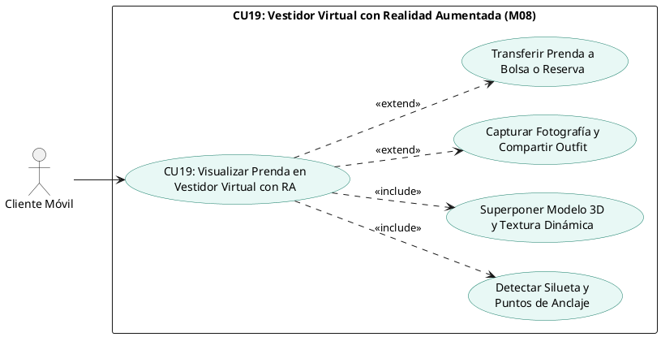

#### b) Prototipo de Interfaz de Usuario (UI Wireframe)


- **Pantalla del Vestidor RA (`/vestidor-ar` en App Móvil Flutter):**
  - Vista completa de la cámara frontal/posterior con retícula guía de alineación anatómica corporal (hombros, pecho, cintura).
  - Canvas de renderizado 3D superponiendo la prenda masculina (ej. Blazer Slim Fit, Camisa Oxford) con iluminación adaptativa al entorno real.
  - Barra flotante inferior con selectores de color/textura en tiempo real (paleta cromática en círculos interactivos: Azul Marino `#1A2A44`, Gris Carbón `#36454F`, Blanco Puro `#FFFFFF`).
  - Selector de tallas (S, M, L, XL) con ajuste automático de escala tridimensional de la prenda.
  - Indicador de tracking ARCore: estado de calibración ("Buscando plano corporal...", "Cuerpo fijado con precisión").
  - Botón obturador circular: Capturar foto del atuendo puesto para guardarla en la galería o compartirla.
  - Botones de conversión rápida: *"Añadir al Carrito"* o *"Reservar en Sucursal Equipetrol"*.

#### c) Tabla Detalle del Caso de Uso

| Atributo | Detalle de la Especificación |
|:---|:---|
| **Identificador** | CU19 |
| **Nombre** | Visualizar Prenda en Vestidor Virtual con Realidad Aumentada |
| **Actores** | Cliente Móvil. |
| **Propósito** | Permitir al cliente proyectar tridimensionalmente prendas del catálogo sobre su silueta en tiempo real para verificar calce y combinación visual antes de comprar o reservar. |
| **Tipo** | Primario / Móvil / Diferenciador Tecnológico. |
| **Precondiciones** | 1. Dispositivo smartphone con soporte para Google Play Services for AR (ARCore) o Apple ARKit. 2. Permiso concedido de acceso a la cámara. 3. Prenda seleccionada con recurso 3D (`.glb`) registrado en el catálogo. |
| **Postcondiciones** | 1. Se inicializa la sesión de realidad aumentada con superposición continua del modelo 3D. 2. El cliente puede interactuar con variantes de color sin perder el rastreo corporal. 3. Si se captura fotografía, se almacena en memoria local del dispositivo con opción a compartir. |
| **Flujo Principal** | 1. El cliente pulsa el botón "Probar con RA" desde la ficha de una prenda en la aplicación móvil Flutter.<br>2. La aplicación inicializa el motor ARCore y solicita calibración enfocando el torso del usuario.<br>3. El sistema detecta los puntos de anclaje anatómico (hombros, cuello y cintura).<br>4. Se descarga el archivo tridimensional optimizado (`.glb`) desde el almacenamiento de recursos estáticos.<br>5. La aplicación superpone la prenda tridimensional ajustando dinámicamente la escala y orientación según los movimientos del usuario.<br>6. El cliente cambia entre colores y texturas disponibles mediante la barra interactiva.<br>7. El cliente pulsa el botón "Añadir a Carrito" o "Reservar en Tienda", derivando la variante seleccionada al flujo transaccional correspondiente. |
| **Flujos Alternativos** | **2a. Dispositivo no compatible con AR:** El sistema informa que el hardware carece de sensores compatibles y conmuta automáticamente a la vista 3D interactiva 360° con rotación táctil.<br>**3a. Pérdida de tracking por iluminación deficiente:** El sistema muestra una alerta en pantalla: *"Mueva el dispositivo despacio o mejore la iluminación"* manteniendo el modelo en pausa hasta recuperar la referencia corporal. |

---

### 1.3.2 Caso de Uso CU20: Comparar Outfits Lado a Lado


#### a) Diseño del Caso de Uso (PlantUML)

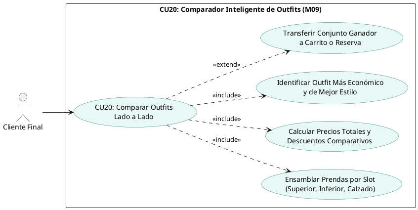

#### b) Prototipo de Interfaz de Usuario (UI Wireframe)


- **Pantalla Comparadora de Outfits (`/comparador` en Web Angular y App Móvil):**
  - Encabezado con título *"Comparador Visual de Estilos Masculinos"* y selector de ocasión (Formal, Casual, Urbano).
  - Tres columnas paralelas interactivas (Outfit 1, Outfit 2 y Outfit 3):
    * **Slot 1 (Prenda Superior):** Miniatura fotográfica de camisa/blazer, nombre, talla, color y precio unitario en Bs. Botón *"Cambiar prenda"*.
    * **Slot 2 (Prenda Inferior):** Miniatura de pantalón/jean, talla, color y precio unitario en Bs.
    * **Slot 3 (Calzado / Accesorio):** Miniatura de zapatos formales/zapatillas o cinturón con precio.
  - Tarjeta de resumen al pie de cada columna:
    * Subtotal prendas individuales.
    * Descuento aplicable por fidelización o temporada.
    * **Precio Total del Outfit en Bolivianos (Bs.).**
    * Etiqueta distintiva verde: *"Opción Más Económica"* en la columna de menor precio total.
  - Botón de acción principal al pie de cada outfit: *"Comprar este Outfit Completo"* (agrega los 3 ítems al carrito con 1 clic) y *"Reservar Outfit en Tienda"*.

#### c) Tabla Detalle del Caso de Uso

| Atributo | Detalle de la Especificación |
|:---|:---|
| **Identificador** | CU20 |
| **Nombre** | Comparar Outfits Lado a Lado |
| **Actores** | Cliente Final (Web / Móvil). |
| **Propósito** | Permitir al cliente contrastar visual y económicamente hasta tres combinaciones de ropa masculina en una única vista, facilitando la toma de decisiones estéticas y presupuestarias. |
| **Tipo** | Primario / Omnicanal. |
| **Precondiciones** | Al menos una prenda preseleccionada desde el catálogo o generada desde las sugerencias del asistente de estilo. |
| **Postcondiciones** | Se consolidan las combinaciones elegidas y se habilita el traslado automático de los productos al carrito de compras o a una reserva física. |
| **Flujo Principal** | 1. El cliente accede al módulo comparador desde el menú principal o desde la sugerencia de un outfit.<br>2. El sistema presenta las tres columnas vacías o precargadas con una propuesta.<br>3. El cliente añade o reemplaza componentes en cada outfit seleccionando entre prendas superiores, inferiores y calzados.<br>4. En cada modificación, el sistema recalcula en tiempo real los subtotales, descuentos y montos totales en moneda nacional (Bs.).<br>5. El sistema resalta automáticamente la combinación más económica y la que cuenta con mayor afinidad estilística.<br>6. El cliente decide la combinación preferida y pulsa "Comprar Outfit Ganador".<br>7. Los ítems del conjunto seleccionado se incorporan de manera atómica al Carrito de Compras (CU13). |
| **Flujos Alternativos** | **3a. Prenda seleccionada sin stock en la talla del cliente:** El sistema muestra una alerta en el slot correspondiente sugiriendo una talla contigua o un producto similar alternativo.<br>**6a. El cliente prefiere probarse las prendas presencialmente:** El cliente selecciona "Reservar este Outfit", derivando los ítems a la solicitud de reserva en la sucursal Equipetrol (CU11). |

---

### 1.3.3 Caso de Uso CU21: Gestionar Fidelización Gamificada


#### a) Diseño del Caso de Uso (PlantUML)

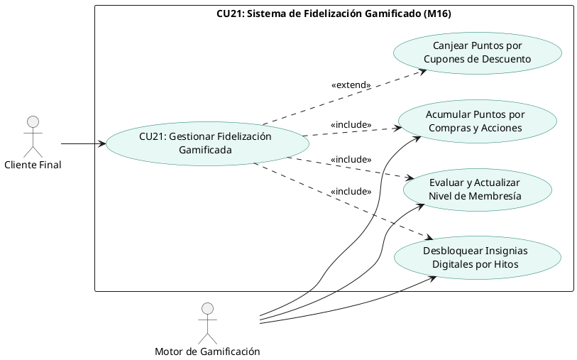

#### b) Prototipo de Interfaz de Usuario (UI Wireframe)


- **Pantalla de Perfil de Recompensas (`/recompensas` en Web y Móvil):**
  - Tarjeta VIP de Membresía con efecto metálico según el rango alcanzado: Bronce (cobre pulido), Plata (plateado brillante), Oro (dorado premium) o Diamante (azul cian metalizado).
  - Nombre del cliente, nivel actual y beneficio activo (ej. *"Nivel Oro: 10% de descuento permanente en todas tus compras"*).
  - Barra de progreso interactiva con indicador visual: *"1,650 / 4,000 Puntos para Nivel Diamante"* (con porcentaje de avance numérico).
  - Mosaico de Insignias Digitales desbloqueadas y por desbloquear:
    * *Primer Outfit:* Desbloqueada tras la primera compra exitosa.
    * *Explorador RA:* Desbloqueada al probar 5 prendas en el vestidor virtual.
    * *Caballero Impecable:* Desbloqueada tras adquirir trajes ejecutivos formales.
    * *Cliente Omnicanal:* Desbloqueada al realizar compras tanto en línea como en la tienda física de Equipetrol.
  - Catálogo de Cupones Canjeables: Listado de recompensas con costo en puntos (ej. *"Cupón 50 Bs de descuento - 500 pts"*, *"Envío Gratis Delivery - 200 pts"*). Botón *"Canjear Recompensa"*.

#### c) Tabla Detalle del Caso de Uso

| Atributo | Detalle de la Especificación |
|:---|:---|
| **Identificador** | CU21 |
| **Nombre** | Gestionar Fidelización Gamificada |
| **Actores** | Cliente Final, Motor de Gamificación. |
| **Propósito** | Fidelizar a los clientes mediante dinámicas de gamificación basadas en acumulación de puntos por compras, ascensos jerárquicos de nivel con beneficios crecientes, otorgamiento de medallas e insignias, y canje de cupones de descuento. |
| **Tipo** | Secundario / Transaccional / CRM. |
| **Precondiciones** | Cliente registrado y autenticado con cuenta activa en FashionStore. |
| **Postcondiciones** | Se actualiza el saldo de puntos disponibles, los puntos históricos totales y el nivel jerárquico en la entidad `gamificacion_perfiles`. Se emiten cupones de descuento si el cliente efectúa un canje. |
| **Flujo Principal** | 1. Tras la confirmación de pago de una orden de venta digital (CU14) o venta en mostrador POS (CU15), el sistema invoca al Motor de Gamificación.<br>2. El motor calcula los puntos devengados a razón de 1 punto por cada 10 Bolivianos netos facturados.<br>3. El motor incrementa `puntos_actuales` y `puntos_historicos`.<br>4. El motor evalúa los umbrales de puntos históricos:<br>   - Bronce: 0 a 499 puntos (0% descuento base).<br>   - Plata: 500 a 1,499 puntos (5% descuento base).<br>   - Oro: 1,500 a 3,999 puntos (10% descuento base).<br>   - Diamante: 4,000+ puntos (15% descuento base + envíos gratis).<br>5. Si el cliente supera un umbral, se actualiza el campo `nivel` y se registra la fecha de ascenso.<br>6. El motor evalúa hitos pendientes e incorpora nuevas insignias al arreglo JSON del perfil.<br>7. El cliente accede a su panel de recompensas y solicita el canje de un cupón.<br>8. El sistema descuenta los puntos necesarios del saldo y genera un código de cupón alfanumérico único para su uso inmediato en el checkout. |
| **Flujos Alternativos** | **7a. Saldo insuficiente para canje:** El sistema informa que el saldo de puntos disponibles no alcanza para la recompensa elegida e indica cuántos puntos restan por acumular.<br>**1a. Asignación de puntos promocionales por acciones:** El cliente obtiene 20 puntos de bienvenida por registro inicial y 10 puntos extra por utilizar el vestidor virtual RA. |

---

### 1.3.4 Caso de Uso CU22: Solicitar Recomendación Contextual de IA


#### a) Diseño del Caso de Uso (PlantUML)

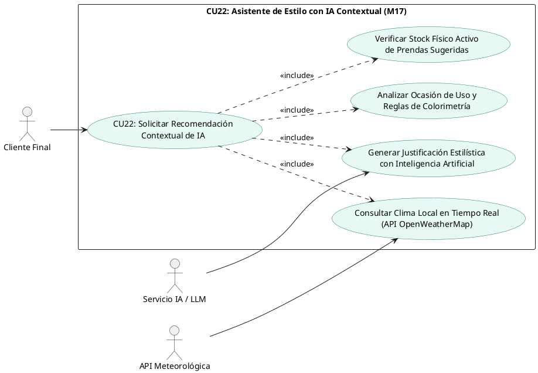

#### b) Prototipo de Interfaz de Usuario (UI Wireframe)


- **Pantalla del Asistente de Estilo IA (`/asistente-ia` en Web y Móvil):**
  - Encabezado con widget de clima dinámico: *"Santa Cruz de la Sierra: 28°C, Soleado (Sensación térmica: 31°C)"* con icono de sol radiante (o lluvia/frío según la ciudad elegida).
  - Selector interactivo de ciudad de Bolivia: Santa Cruz, La Paz, Cochabamba.
  - Selector de ocasión de vestimenta: *Formal / Oficina*, *Casual Urbano*, *Cena / Gala*, *Deportivo Fin de Semana*.
  - Tarjeta de sugerencia inteligente generada por el Asistente de IA:
    * Mensaje conversacional del estilista virtual: *"Para esta tarde cálida y despejada en Santa Cruz, te sugiero un atuendo fresco y sofisticado: Camisa de lino blanca con mangas remangadas y pantalón chino color beige arena."*
    * Justificación cromática: *"Armonía tonal neutra-cálida ideal para climas soleados."*
  - Carrusel horizontal con las prendas exactas del atuendo sugerido (con fotos, tallas disponibles, precio y stock verificado).
  - Botón: *"Ver este Outfit en el Comparador"* o *"Probar en Vestidor Virtual RA"*.

#### c) Tabla Detalle del Caso de Uso

| Atributo | Detalle de la Especificación |
|:---|:---|
| **Identificador** | CU22 |
| **Nombre** | Solicitar Recomendación Contextual de IA |
| **Actores** | Cliente Final, Servicio de IA / LLM, Servicio Meteorológico (OpenWeatherMap). |
| **Propósito** | Ofrecer asesoramiento de imagen personalizado recomendando conjuntos completos de ropa masculina a partir del clima actual, la ocasión elegida, reglas de colorimetría y existencias reales en inventario. |
| **Tipo** | Primario / Omnicanal / Inteligencia Artificial. |
| **Precondiciones** | Conectividad con la API de OpenWeatherMap y con el proveedor de IA (OpenAI / Gemini). Catálogo con prendas activas y con stock disponible. |
| **Postcondiciones** | Se genera un listado de outfits recomendados con justificación estilística, porcentaje de afinidad climática y verificación de stock, registrando la consulta en la bitácora de auditoría. |
| **Flujo Principal** | 1. El cliente pulsa sobre el Asistente de Estilo IA en la plataforma web o aplicación móvil.<br>2. El sistema detecta la ciudad del usuario (o permite seleccionarla) y consulta la API de OpenWeatherMap para obtener temperatura y condición actual.<br>3. El cliente elige la ocasión de vestimenta requerida (ej. *Casual Urbano*).<br>4. El backend construye un prompt contextual estructurado integrando: temperatura actual, condición meteorológica, ocasión y reglas masculinas de etiqueta.<br>5. El modelo de lenguaje procesa el requerimiento y propone combinaciones semánticas de prendas.<br>6. El backend contrasta las prendas sugeridas contra la base de datos de inventario activo, filtrando únicamente ítems con stock $>0$.<br>7. El frontend renderiza la recomendación completa con la explicación del estilista virtual y las prendas listas para interactuar. |
| **Flujos Alternativos** | **2a. Falla en el servicio meteorológico externo:** El sistema captura el fallo, asigna valores climáticos típicos de la temporada comercial en curso y continúa con la recomendación sin interrumpir al usuario.<br>**6a. Prenda sugerida sin existencias disponibles:** El algoritmo sustituye la prenda agotada por la alternativa más afín en color y categoría con existencias físicas confirmadas. |

---

### 1.3.5 Caso de Uso CU23: Buscar Productos por Comandos de Voz


#### a) Diseño del Caso de Uso (PlantUML)

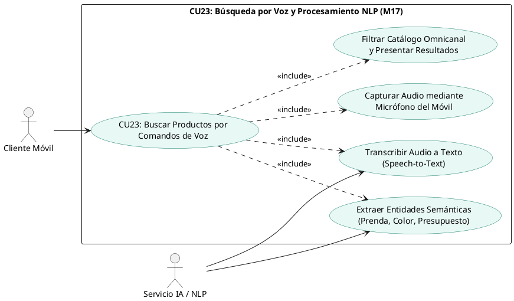

#### b) Prototipo de Interfaz de Usuario (UI Wireframe)


- **Modal de Búsqueda por Voz en App Móvil (`CatalogoScreen`):**
  - Icono de micrófono flotante en la barra superior de búsqueda.
  - Al pulsar el micrófono, se abre una hoja inferior interactiva (*Modal Bottom Sheet*) con animación de ondas de audio pulsantes en tiempo real.
  - Texto de estado dinámico: *"Escuchando... Di algo como: 'Quiero una camisa formal blanca de menos de 200 bolivianos'"*.
  - Visualización del texto reconocido en pantalla conforme el usuario habla.
  - Botón circular de parada o detección automática de fin de habla (pausa de 1.5 segundos).
  - Transición inmediata hacia la cuadrícula de resultados del catálogo aplicando los filtros extraídos: Categoría = Camisas, Color = Blanco, Precio Máximo = 200 Bs.

#### c) Tabla Detalle del Caso de Uso

| Atributo | Detalle de la Especificación |
|:---|:---|
| **Identificador** | CU23 |
| **Nombre** | Buscar Productos por Comandos de Voz |
| **Actores** | Cliente Móvil, Servicio de IA / NLP. |
| **Propósito** | Permitir al cliente buscar prendas dentro del catálogo mediante instrucciones habladas en lenguaje natural, agilizando la navegación y mejorando la accesibilidad en la app móvil. |
| **Tipo** | Secundario / Móvil / NLP. |
| **Precondiciones** | 1. Permiso concedido de acceso al micrófono en el smartphone. 2. Conectividad a internet para el servicio de reconocimiento de voz. |
| **Postcondiciones** | Se interpreta la intención del usuario y se presentan en pantalla los productos coincidentes del catálogo con sus existencias actualizadas. |
| **Flujo Principal** | 1. El cliente pulsa el icono del micrófono en la barra de búsqueda de la app móvil.<br>2. La aplicación solicita y captura la señal de audio del micrófono.<br>3. La señal de audio se envía al motor de transcripción (Speech-to-Text / Whisper).<br>4. El texto transcrito se analiza mediante un analizador sintáctico NLP que extrae entidades clave: `categoría`, `color`, `talla`, `estilo` y `rango_precio`.<br>5. El backend ejecuta una consulta estructurada sobre la base de datos de productos aplicando los filtros extraídos.<br>6. La aplicación móvil muestra los productos encontrados con un mensaje de confirmación auditiva y visual: *"Encontré 4 camisas blancas formales dentro de tu presupuesto"*. |
| **Flujos Alternativos** | **2a. Permiso de micrófono denegado:** La aplicación muestra un diálogo explicativo guiando al usuario a la configuración del sistema operativo para habilitar el permiso.<br>**4a. Consulta ambigua o no comprendida:** Si el modelo NLP no identifica ninguna entidad textil válida, muestra el mensaje: *"No pude entender la prenda buscada. Por favor, intenta de nuevo"* y ofrece sugerencias escritas. |

---

### 1.3.24 Caso de Uso CU24: Visualizar Cuadros de Mando y Dashboards


#### a) Diseño del Caso de Uso (PlantUML)

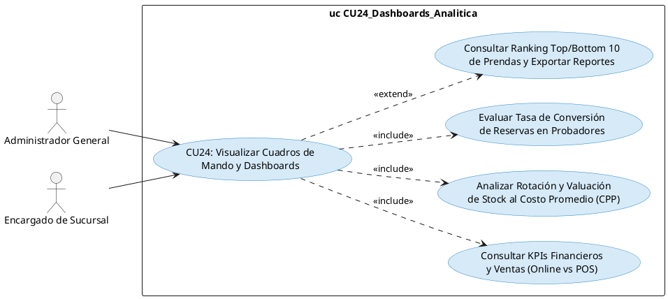

#### b) Prototipo de Interfaz de Usuario (UI Wireframe)


- **Panel de Control Ejecutivo (`/dashboard` en Web Angular 19):**
  - Fila superior de 4 tarjetas métricas (KPI Cards) con indicadores de variación porcentual:
    * *Ventas Totales Recaudadas:* Monto total en Bs. con desglose de pagos confirmados.
    * *Canal de Venta:* Porcentaje de ventas generadas en canal Online (Web/Móvil) vs. Presencial (POS).
    * *Valorización de Inventario:* Valor total monetario del stock valuado al Costo Promedio Ponderado ($CPP$).
    * *Efectividad de Probadores:* Tasa de conversión (%) de reservas físicas que terminaron en compra efectiva en caja.
  - Gráfico interactivo central (Chart.js / ApexCharts): Ventas mensuales comparativas por sucursal física y tienda virtual.
  - Gráfico circular de medios de cobro: Distribución de ingresos entre Efectivo, Tarjeta POS, Stripe y Códigos QR interoperables del BCB.
  - Tabla de rendimiento de inventario: SKU, nombre de prenda, existencias actuales, último costo de compra, Costo Promedio Ponderado ($CPP$) y margen bruto de ganancia estimado.
  - Botones de exportación en la esquina superior derecha: *"Exportar Reporte Contable (PDF)"* y *"Descargar Dataset para Auditoría (XLSX)"*.

#### c) Tabla Detalle del Caso de Uso

| Atributo | Detalle de la Especificación |
|:---|:---|
| **Identificador** | CU24 |
| **Nombre** | Visualizar Cuadros de Mando y Dashboards |
| **Actores** | Administrador General, Encargado de Sucursal. |
| **Propósito** | Proporcionar a la gerencia y a los encargados de tienda una vista consolidada en tiempo real de los indicadores estratégicos de desempeño comercial, rotación de stock valorada al $CPP$ y conversión de reservas para la toma de decisiones. |
| **Tipo** | Primario / Web / Business Intelligence. |
| **Precondiciones** | Usuario autenticado con rol `ADMINISTRADOR` o `ENCARGADO_SUCURSAL`. |
| **Postcondiciones** | Se consultan de forma inmutable las agregaciones estadísticas de la base de datos sin alterar los registros transaccionales activos. Se registra el acceso en la bitácora de auditoría. |
| **Flujo Principal** | 1. El usuario administrativo accede a la ruta `/dashboard` desde la barra de navegación web.<br>2. El frontend solicita al backend el consolidado analítico mediante llamada a `/api/v1/dashboard/metricas`.<br>3. El backend ejecuta consultas agregadas de alto rendimiento sobre las tablas de ventas, inventario, reservas y pagos.<br>4. El backend calcula en tiempo real los márgenes brutos cruzando el precio de venta final contra el Costo Promedio Ponderado ($CPP$) vigente.<br>5. El sistema entrega el payload JSON con las métricas consolidadas.<br>6. La interfaz Angular renderiza las tarjetas de KPIs, gráficos interactivos de ventas y tablas de rotación de prendas.<br>7. El administrador aplica filtros por rango de fechas o por sucursal física para focalizar el análisis. |
| **Flujos Alternativos** | **1a. Acceso por Encargado de Sucursal:** La vista restringe los datos globales y muestra exclusivamente los indicadores de rendimiento de la sucursal física asignada a su usuario.<br>**7a. Exportación de reporte contable:** El usuario presiona "Exportar PDF", generándose un documento estructurado con firma digital de auditoría y fecha en huso horario local (-04:00). |

---

### 1.3.7 Caso de Uso CU25: Gestionar Devolución y Cambio de Prendas


#### a) Diseño del Caso de Uso (PlantUML)

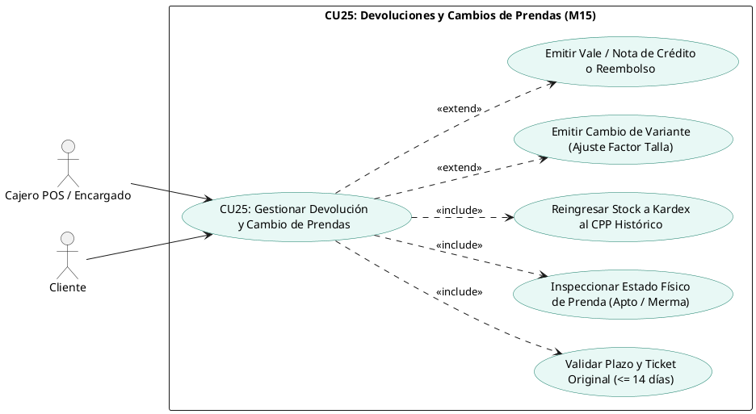

#### b) Prototipo de Interfaz de Usuario (UI Wireframe)


- **Módulo de Devoluciones y Cambios (`/pos/devoluciones` en Web Angular 19):**
  - Barra de búsqueda superior con escáner óptico de código de barras/QR o campo de texto para digitar el ticket fiscal (ej. `POS-2026-0042`).
  - Panel informativo del cliente y venta original: Nombre del cliente (*Carlos Mendoza*), fecha de emisión (*12/09/2026*) y badge de control de plazo: *"Dentro de plazo: 8 días transcurridos (Máximo 14 días)"*.
  - Tarjeta de artículo adquirido: Fotografía de la prenda (*Camisa Oxford Slim Fit Azul Marino*), talla original (*M*), precio unitario cobrado (*Bs. 180.00*) y selector de radio button para inspección física: *"Apto para la Venta (Etiquetas intactas)"* o *"Defectuoso / Merma (Tara de fábrica)"*.
  - Panel de configuración del cambio / resolución:
    * Selector desplegable: *"Cambio por Talla L"*, *"Vale / Nota de Crédito"* o *"Reembolso en Efectivo"*.
    * Indicador interactivo de factor de talla (+5%): *"Diferencia: Bs. 9.00 a cobrar"*.
    * Indicador de auditoría contable: *"Reingresar a Inventario al CPP Histórico (Bs. 107.14)"*.
  - Botón de acción principal: *"Confirmar Cambio y Emitir Ticket Fiscal"*.

#### c) Tabla Detalle del Caso de Uso

| Atributo | Detalle de la Especificación |
|:---|:---|
| **Identificador** | CU25 |
| **Nombre** | Gestionar Devolución y Cambio de Prendas |
| **Actores** | Cajero POS / Encargado de Sucursal, Cliente. |
| **Propósito** | Permitir al personal de mostrador procesar la devolución o cambio de prendas vendidas previamente (POS o digital), validando la vigencia del ticket, evaluando el estado de la prenda, registrando el reingreso al Kardex al CPP histórico inmutable y liquidando la compensación mediante cambio de variante, nota de crédito o reembolso. |
| **Tipo** | Secundario Transaccional / Web (POS) y Móvil / Extensión de Venta. |
| **Precondiciones** | 1. Cajero autenticado con turno de caja abierto en sucursal operativa. 2. Ticket fiscal de venta original existente en la base de datos emitido dentro de los últimos 14 días calendario. 3. Prenda física presentada en tienda con etiquetas originales. |
| **Postcondiciones** | 1. Se registra el comprobante de devolución en la tabla `devoluciones`. 2. Si la prenda es apta, reingresa al inventario físico de la sucursal (`stock_actual += cantidad`). 3. Se asienta un movimiento inmutable en el Kardex de tipo `DEVOLUCION_VENTA` al Costo Promedio Ponderado ($CPP$) histórico que tenía al momento de la venta. 4. Se emite el nuevo ticket fiscal (por cambio o saldo a favor) y se ajustan los puntos de fidelización si aplica. |
| **Flujo Principal** | 1. El cliente se presenta en mostrador y el cajero accede a la opción "Devoluciones / Cambios" en la terminal POS.<br>2. El cajero escanea el código de barras/QR del ticket original o ingresa el número correlativo.<br>3. El sistema busca la venta en la base de datos, valida que no superó el límite de 14 días calendario y despliega los ítems adquiridos.<br>4. El cajero selecciona la prenda objeto de devolución y registra el resultado de la inspección física (*Apto para la venta*).<br>5. El cajero selecciona la modalidad de resolución solicitada por el cliente (*Cambio por otra talla/color*).<br>6. El sistema aplica la matriz de factor de precios por talla si corresponde, calculando la diferencia a cobrar o devolver.<br>7. El cajero confirma la operación. El backend ejecuta una transacción atómica: registra la devolución, reincorpora la prenda devuelta al stock, descuenta la nueva prenda entregada, asienta la entrada en el Kardex al $CPP$ histórico y genera el comprobante fiscal impreso. |
| **Flujos Alternativos** | **3a. Ticket con más de 14 días de antigüedad:** El sistema bloquea la operación y muestra la alerta: *"Plazo de devolución vencido (Máximo 14 días permitidos por política de la tienda)"*.<br>**4a. Prenda con daño o tara de confección:** El cajero marca el estado como *Defectuoso / Merma*. La prenda reingresa contablemente pero no se suma al stock vendible de mostrador, derivándose al almacén de cuarentena para reclamo al proveedor.<br>**5a. Cliente solicita Nota de Crédito:** El sistema emite un vale digital alfanumérico con saldo a favor vinculado al NIT/CI del cliente para su uso en futuras compras.<br>**5b. Cliente solicita Reembolso:** El cajero registra la salida de efectivo de la gaveta de caja (restando del arqueo del turno) o, si fue venta online Stripe, dispara el reembolso asíncrono vía Stripe Refund API. |

---

## 1.4 Estructurar Modelo de Casos de Uso (Ciclo 3)

El modelo estructurado del Ciclo 3 formaliza la integración de los casos de uso diferenciadores y transaccionales con los actores humanos y los servicios externos de Inteligencia Artificial y Clima, demostrando su continuidad y vinculación con los casos de uso transaccionales de los Ciclos 1 y 2:


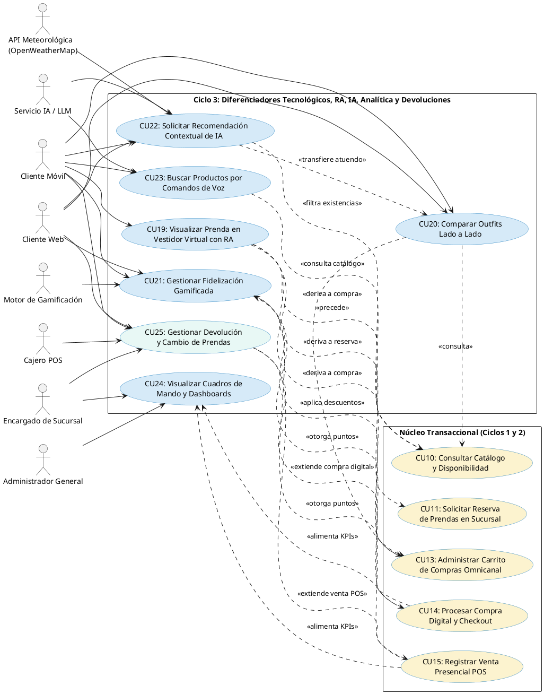

---

# Capítulo 2. Flujo de Trabajo: Análisis

## 2.1 Análisis de Arquitectura

Conforme a las recomendaciones metodológicas del PUDS para sistemas de escala empresarial, **se adopta una estrategia de alta cohesión y bajo acoplamiento que evita la proliferación innecesaria de paquetes**. En lugar de crear 5 paquetes nuevos independientes que fragmentarían la arquitectura, los 6 Casos de Uso del Ciclo 3 se incorporan **REUTILIZANDO Y MADURANDO** los paquetes establecidos en los Ciclos 1 y 2.

Se aplica con rigor la división en tres capas de robustez de Ivar Jacobson:
- **Clases de Interfaz (`<<boundary>>`):** Elementos visuales, pantallas y controladores de eventos con atributos de captura de datos y métodos interactivos.
- **Clases de Control (`<<control>>`):** Orquestadores puros de lógica de negocio, validaciones y algoritmos. No poseen atributos de estado propios.
- **Clases de Entidad (`<<entity>>`):** Modelos de persistencia con atributos mapeados a tablas de PostgreSQL y métodos de gestión de datos.

### 2.1.1 Identificar Paquetes Reutilizados y Extendidos

1. **Paquete 3 (Reutilizado y Extendido): Catálogo, Estilismo Inmersivo e Inteligencia Artificial (M03, M04, M08, M09, M17)**
   - **Propósito y Alcance:** Centraliza toda la experiencia visual e interactiva de los productos de moda masculina. Absorbe los casos de uso **CU19** (Vestidor Virtual con Realidad Aumentada - M08), **CU20** (Comparador de Outfits - M09), **CU22** (Asistente de Estilo Contextual con IA - M17) y **CU23** (Búsqueda por Voz y NLP - M17). Este paquete une el modelo 3D de la prenda con las reglas de estilo y los canales de consulta inteligente en una sola unidad cohesiva.
2. **Paquete 7 (Reutilizado y Extendido): Venta Digital, Checkout y Fidelización Gamificada CRM (M11, M12, M16)**
   - **Propósito y Alcance:** Administra la conversión comercial y la retención del cliente en el tiempo. Absorbe el caso de uso **CU21** (Fidelización Gamificada - M16), articulando la acumulación de puntos tras las ventas digitales (CU14) o ventas POS (CU15), la máquina de estados de membresías (Bronce a Diamante), las insignias digitales y el canje de cupones de descuento aplicables directamente en el carrito de compras (CU13) y checkout.
3. **Paquete 5 (Reutilizado y Extendido): Inventario Multi-Sucursal, Costos Ponderados (CPP) y Analítica Ejecutiva (M06, M07, M18)**
   - **Propósito y Alcance:** Centraliza la inteligencia operacional, el control de existencias y el soporte para la toma de decisiones de la alta dirección. Absorbe el caso de uso **CU24** (Cuadros de Mando y Dashboards - M18), consolidando la valuación contable de inventario por Costo Promedio Ponderado ($CPP$), el análisis comparativo de ventas por sucursal física vs. canal digital y las tasas de conversión de probadores.
4. **Paquete 8 (Reutilizado y Extendido): Punto de Venta POS y Devoluciones (M15)**
   - **Propósito y Alcance:** Administra la operación comercial de mostrador en la sucursal física de Equipetrol. Absorbe el caso de uso **CU25** (Gestionar Devolución y Cambio de Prendas - M15), extendiendo la facturación POS (CU15) con la capacidad de verificar tickets fiscales vigentes ($\le 14$ días), inspeccionar prendas, asentar reingresos inmutables en el Kardex al $CPP$ histórico y liquidar la compensación mediante cambio de variante por factor de talla, vales de crédito o reembolsos.

### 2.1.2 Relacionar paquetes y casos de uso

| Paquete Contenedor | Casos de Uso del Ciclo 3 | Casos de Uso Previos Integrados | Módulos Backend FastAPI | Módulos Frontend / Móvil |
|:---|:---:|:---:|:---|:---|
| **Paquete 3:** Catálogo, Estilismo e IA | **CU19, CU20, CU22, CU23** | CU06, CU07, CU10 | `app.modules.catalogo`<br>`app.modules.productos`<br>`app.modules.ia_recomendaciones` | **Móvil:** `ar_viewer`, `ia_recomendaciones`, `catalogo`<br>**Web:** `catalogo`, `comparador` |
| **Paquete 7:** Venta Digital y Fidelización CRM | **CU21** | CU13, CU14 | `app.modules.carrito`<br>`app.modules.ordenes`<br>`app.modules.gamificacion` | **Móvil:** `gamificacion/views/recompensas`<br>**Web:** `checkout`, `cuenta/recompensas` |
| **Paquete 5:** Inventario, Costos y Analítica | **CU24** | CU09 | `app.modules.inventario`<br>`app.modules.dashboard` | **Web:** `dashboard.component.ts`<br>**Móvil:** `encargado-dashboard` |
| **Paquete 8:** Punto de Venta POS y Devoluciones | **CU25** | CU15 | `app.modules.pos`<br>`app.modules.devoluciones` | **Web:** `pos/terminal`, `pos/devoluciones` |


### 2.1.3 Vista de casos de uso (Paquetes desde su interior)


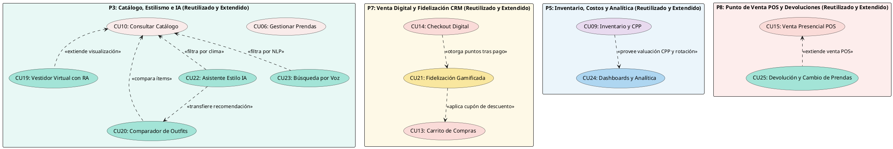

---

## 2.2 Analizar Casos de Uso (Diagramas de Comunicación UML)

A continuación se presentan los Diagramas de Comunicación UML para los 7 Casos de Uso del Ciclo 3 (incluyendo el caso transaccional de post-venta CU25), generados formalmente en Enterprise Architect conforme a las especificaciones UML 2.5+. En estricto cumplimiento de las directrices docentes, cada diagrama modela la colaboración cronológica y numerada entre la clase interfaz (`<<boundary>>`), la clase orquestadora (`<<control>>` sin atributos propios) y las clases de datos (`<<entity>>`):

### 2.2.1 Diagrama de Comunicación - CU19: Visualizar Prenda en Vestidor Virtual con RA


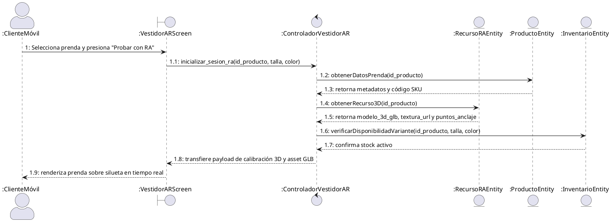

### 2.2.2 Diagrama de Comunicación - CU20: Comparar Outfits Lado a Lado


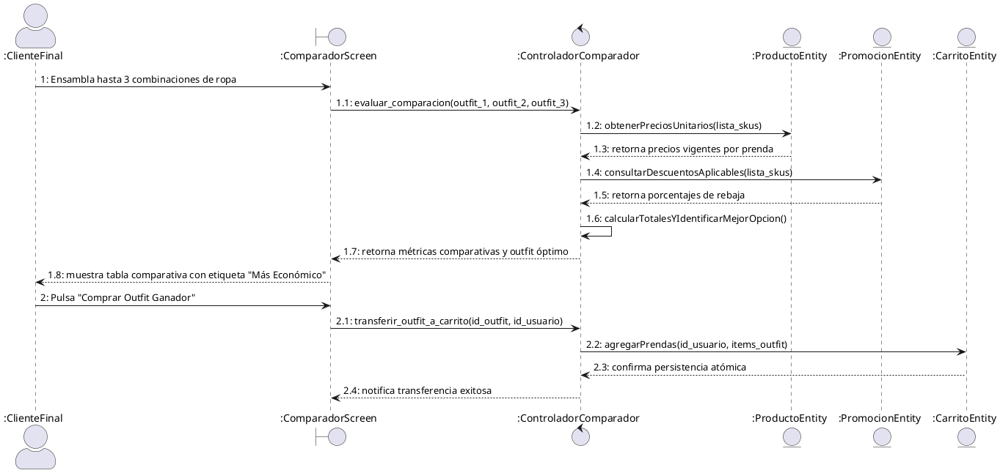

### 2.2.3 Diagrama de Comunicación - CU21: Gestionar Fidelización Gamificada


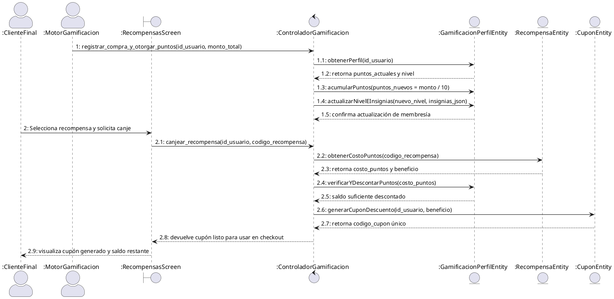

### 2.2.4 Diagrama de Comunicación - CU22: Solicitar Recomendación Contextual de IA


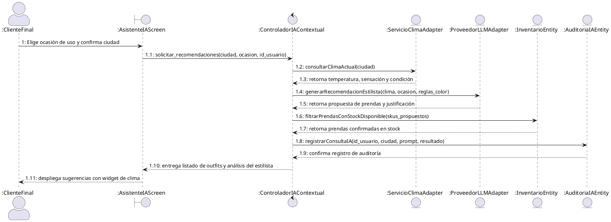

### 2.2.5 Diagrama de Comunicación - CU23: Buscar Productos por Comandos de Voz


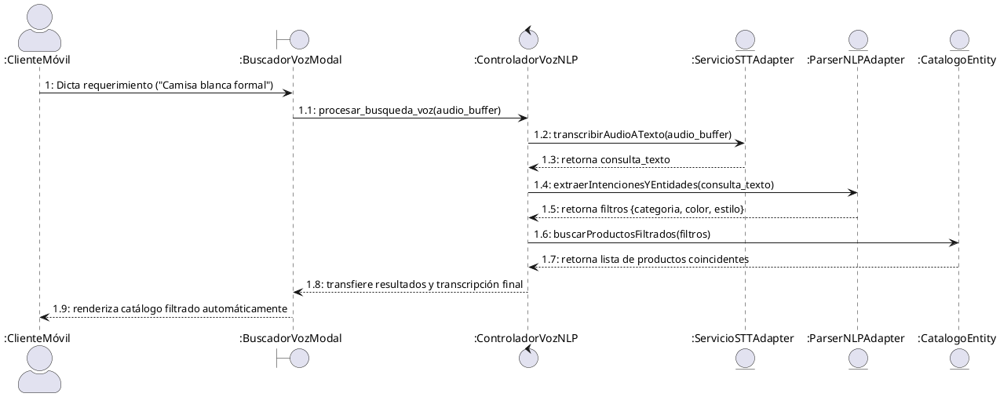

### 2.2.6 Diagrama de Comunicación - CU24: Visualizar Cuadros de Mando y Dashboards


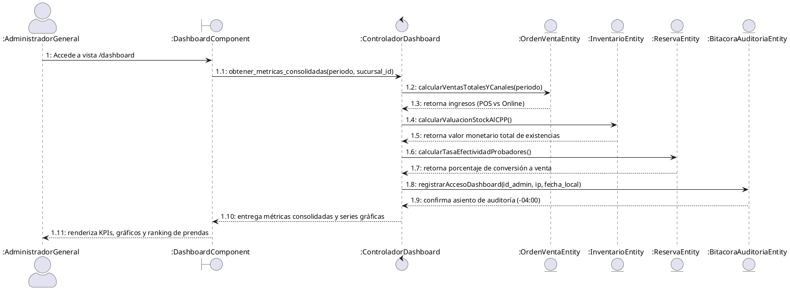

### 2.2.7 Diagrama de Comunicación - CU25: Gestionar Devolución y Cambio de Prendas


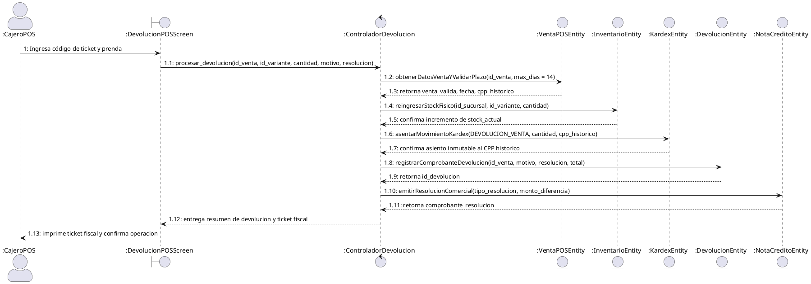

---

## 2.3 Análisis de Clases (Diagramas de Robustez BCE por Caso de Uso)

Conforme a la metodología PUDS y las directrices metodológicas de la cátedra, el análisis de clases formaliza para cada caso de uso la colaboración entre las tres categorías de clases de análisis (BCE) de Ivar Jacobson, traduciendo directamente la dinámica expresada en el respectivo Diagrama de Comunicación:

- **Clases de Interfaz (`<<Boundary>>`, prefijo `IU_`):** Representan la frontera de interacción con los actores, encapsulando los atributos de captura visual y los métodos receptores de eventos y acciones de pantalla.
- **Clases de Control (`<<Control>>`, prefijo `CTR_`):** Orquestan la lógica del caso de uso, validaciones y reglas de negocio, coordinando a las entidades. No poseen atributos de estado propios.
- **Clases de Entidad (`<<Entity>>`, prefijo `CE_`):** Mapean los conceptos del dominio persistente en PostgreSQL, encapsulando los campos de datos y operaciones de consulta y persistencia.

---

### 2.3.1 Diagrama de Análisis de Clases - CU19: Visualizar Prenda en Vestidor Virtual con RA


Traducción directa de la colaboración del Diagrama de Comunicación 2.2.1: Actor Cliente Móvil $\to$ Interfaz de Vestidor $\to$ Controlador de Sesión AR $\to$ Entidades de Recurso 3D, Producto, Inventario y Bitácora de Auditoría.

```plantuml
@startuml Clases_Analisis_CU19_Vestidor_RA
skinparam classAttributeIconSize 0
skinparam style strictuml
hide empty members

actor "Cliente Móvil" as Actor

class "IU_VestidorAR" as UI <<Boundary>> {
    + id_producto : Integer
    + escala_referencia : Decimal
    + color_hex_activo : String
    + tracking_status : String
    --
    + iniciarTrackingAR() : void
    + cambiarColorHex(color : String) : void
    + capturarSnapshot() : void
    + transferirACarrito() : void
}

class "CTR_VestidorAR" as Ctrl <<Control>> {
    --
    + inicializarSesionAR(id_prod : Integer, talla : String, color : String) : SessionARDTO
    + obtenerRecurso3D(id_prod : Integer) : RecursoRADTO
    + verificarDisponibilidadVariante(id_prod : Integer, talla : String, color : String) : Boolean
}

class "CE_RecursoRA" as EntRA <<Entity>> {
    + id_recurso_ra : Integer
    + id_producto : Integer
    + modelo_3d_url : String
    + escala_referencia : Decimal
    + puntos_anclaje_json : String
    + texturas_map_json : String
    --
    + obtenerPorProducto(id_prod : Integer) : RecursoRA
    + actualizarMapeoTexturas() : void
}

class "CE_Producto" as EntProd <<Entity>> {
    + id_producto : Integer
    + nombre : String
    + categoria : String
    + sku_base : String
    + precio_base : Decimal
    --
    + getDatosPrenda(id_prod : Integer) : Producto
}

class "CE_Inventario" as EntInv <<Entity>> {
    + id_inventario : Integer
    + id_producto : Integer
    + id_sucursal : Integer
    + stock_disponible : Integer
    --
    + verificarStockVariante(id_prod : Integer, talla : String, color : String) : Integer
}

class "CE_AuditoriaBitacora" as EntAudit <<Entity>> {
    + id_auditoria : Integer
    + id_usuario : Integer
    + accion : String
    + ip_cliente : String
    + fecha_hora_local : DateTime
    --
    + registrarAsiento(accion : String, ip : String) : void
}

Actor -- UI
UI -- Ctrl
Ctrl -- EntRA
Ctrl -- EntProd
Ctrl -- EntInv
Ctrl -- EntAudit
@enduml
```

---

### 2.3.2 Diagrama de Análisis de Clases - CU20: Comparar Outfits Lado a Lado


Traducción de la colaboración del Diagrama de Comunicación 2.2.2: Actor Cliente Final $\to$ Interfaz Comparador $\to$ Controlador de Comparación $\to$ Entidades de Producto, Promoción y Carrito.

```plantuml
@startuml Clases_Analisis_CU20_Comparador_Outfits
skinparam classAttributeIconSize 0
skinparam style strictuml
hide empty members

actor "Cliente Final" as Actor

class "IU_ComparadorOutfits" as UI <<Boundary>> {
    + slots_outfit_1 : List
    + slots_outfit_2 : List
    + slots_outfit_3 : List
    + ocasion_activa : String
    + outfit_economico_id : String
    --
    + seleccionarPrendaSlot(slot : Integer, prenda_id : Integer) : void
    + eliminarPrendaSlot(slot : Integer) : void
    + recalcularTotales() : void
    + comprarOutfitGanador(outfit_id : String) : void
}

class "CTR_ComparadorOutfits" as Ctrl <<Control>> {
    --
    + evaluarOutfitsComparativos(o1 : List, o2 : List, o3 : List) : ComparacionDTO
    + calcularTotalesYAhorros(totales : Map) : Map
    + transferirOutfitACarrito(outfit_id : String, id_usuario : Integer) : Boolean
}

class "CE_Producto" as EntProd <<Entity>> {
    + id_producto : Integer
    + nombre : String
    + precio_base : Decimal
    + sku : String
    + imagen_url : String
    --
    + getPreciosPrendas(skus : List) : Map
}

class "CE_Promocion" as EntPromo <<Entity>> {
    + id_promocion : Integer
    + porcentaje_descuento : Decimal
    + activo : Boolean
    --
    + getDescuentosVigentes(skus : List) : Map
}

class "CE_Carrito" as EntCart <<Entity>> {
    + id_carrito : Integer
    + id_usuario : Integer
    + subtotal : Decimal
    --
    + agregarPrendasBatch(id_usuario : Integer, items : List) : Boolean
}

Actor -- UI
UI -- Ctrl
Ctrl -- EntProd
Ctrl -- EntPromo
Ctrl -- EntCart
@enduml
```

---

### 2.3.3 Diagrama de Análisis de Clases - CU21: Gestionar Fidelización Gamificada


Traducción de la colaboración del Diagrama de Comunicación 2.2.3: Actores Cliente Final y Motor de Gamificación $\to$ Interfaz de Recompensas $\to$ Controlador de Gamificación $\to$ Entidades Perfil de Gamificación, Catálogo de Recompensas y Cupones.

```plantuml
@startuml Clases_Analisis_CU21_Fidelizacion_Gamificada
skinparam classAttributeIconSize 0
skinparam style strictuml
hide empty members

actor "Cliente Final" as ActorCliente
actor "Motor de Gamificación" as ActorMotor

class "IU_RecompensasScreen" as UI <<Boundary>> {
    + saldo_puntos : Integer
    + nivel_membresia : String
    + progreso_nivel_pct : Decimal
    + recompensas_disponibles : List
    + cupon_emitido : String
    --
    + cargarPerfilRecompensas() : void
    + solicitarCanje(codigo_recompensa : String) : void
    + mostrarMensajeExito() : void
}

class "CTR_Gamificacion" as Ctrl <<Control>> {
    --
    + registrarCompraYOtorgarPuntos(id_usuario : Integer, monto : Decimal) : PerfilDTO
    + evaluarAscensoNivel(puntos_historicos : Integer) : String
    + canjearRecompensa(id_usuario : Integer, codigo : String) : CuponDTO
}

class "CE_GamificacionPerfil" as EntPerfil <<Entity>> {
    + id_perfil : Integer
    + id_usuario : Integer
    + puntos_actuales : Integer
    + puntos_historicos : Integer
    + nivel : String
    + insignias_json : String
    --
    + acumularPuntos(pts : Integer) : void
    + debitarPuntos(pts : Integer) : Boolean
    + actualizarNivel(nuevo_nivel : String) : void
}

class "CE_RecompensaCatalogo" as EntRec <<Entity>> {
    + id_recompensa : Integer
    + codigo : String
    + titulo : String
    + costo_puntos : Integer
    + descuento_monto : Decimal
    + activo : Boolean
    --
    + obtenerPorCodigo(codigo : String) : Recompensa
}

class "CE_CuponFidelizacion" as EntCup <<Entity>> {
    + id_cupon : Integer
    + id_usuario : Integer
    + codigo_cupon : String
    + monto_descuento : Decimal
    + utilizado : Boolean
    + fecha_expiracion : DateTime
    --
    + crearCupon(id_usuario : Integer, monto : Decimal, codigo : String) : Cupon
    + marcarComoUtilizado() : void
}

ActorCliente -- UI
ActorMotor -- Ctrl
UI -- Ctrl
Ctrl -- EntPerfil
Ctrl -- EntRec
Ctrl -- EntCup
@enduml
```

---

### 2.3.4 Diagrama de Análisis de Clases - CU22: Solicitar Recomendación Contextual de IA


Traducción de la colaboración del Diagrama de Comunicación 2.2.4: Actores Cliente, Servicio LLM y API Clima $\to$ Interfaz Asistente IA $\to$ Controlador IA Contextual $\to$ Adaptadores Externos, Inventario, Solicitud IA y Auditoría.

```plantuml
@startuml Clases_Analisis_CU22_Recomendacion_IA
skinparam classAttributeIconSize 0
skinparam style strictuml
hide empty members

actor "Cliente Final" as ActorCliente
actor "API Meteorológica\n(OpenWeatherMap)" as ActorClima
actor "Servicio IA / LLM" as ActorLLM

class "IU_AsistenteIAScreen" as UI <<Boundary>> {
    + ciudad_seleccionada : String
    + ocasion_seleccionada : String
    + temperatura_c : Decimal
    + condicion_clima : String
    + outfits_recomendados : List
    --
    + solicitarRecomendacion() : void
    + cambiarCiudad(ciudad : String) : void
    + seleccionarOutfit(outfit_id : String) : void
}

class "CTR_IAContextual" as Ctrl <<Control>> {
    --
    + generarRecomendacionesContextuales(ciudad : String, ocasion : String, id_usuario : Integer) : RecomendacionesDTO
    + consultarClimaActual(ciudad : String) : ClimaDTO
    + filtrarPrendasConStockDisponible(skus : List) : List
    + construirPromptEstilista(clima : ClimaDTO, ocasion : String) : String
}

class "CE_ServicioClimaAdapter" as EntClima <<Entity>> {
    + ciudad : String
    + temperatura_c : Decimal
    + sensacion_c : Decimal
    + condicion : String
    + icono : String
    --
    + getClimaActual(ciudad : String) : ClimaDTO
}

class "CE_ProveedorLLMAdapter" as EntLLM <<Entity>> {
    + api_key : String
    + modelo_nombre : String
    + temperatura_muestreo : Decimal
    --
    + generarOutfitsContextuales(prompt : String) : String
}

class "CE_Inventario" as EntInv <<Entity>> {
    + id_inventario : Integer
    + id_producto : Integer
    + stock_disponible : Integer
    --
    + verificarExistencias(skus : List) : List
}

class "CE_SolicitudIARecomendacion" as EntSol <<Entity>> {
    + id_solicitud_ia : Integer
    + id_usuario : Integer
    + ciudad : String
    + temperatura_c : Decimal
    + ocasion : String
    + outfits_sugeridos_json : String
    --
    + guardarRegistro() : void
}

class "CE_AuditoriaBitacora" as EntAudit <<Entity>> {
    + id_auditoria : Integer
    + id_usuario : Integer
    + accion : String
    + ip_cliente : String
    + fecha_hora_local : DateTime
    --
    + registrarAsiento(accion : String, ip : String) : void
}

ActorCliente -- UI
ActorClima -- EntClima
ActorLLM -- EntLLM
UI -- Ctrl
Ctrl -- EntClima
Ctrl -- EntLLM
Ctrl -- EntInv
Ctrl -- EntSol
Ctrl -- EntAudit
@enduml
```

---

### 2.3.5 Diagrama de Análisis de Clases - CU23: Buscar Productos por Comandos de Voz


Traducción de la colaboración del Diagrama de Comunicación 2.2.5: Actores Cliente Móvil y Servicio NLP $\to$ Interfaz Buscador de Voz $\to$ Controlador de Voz NLP $\to$ Adaptadores STT, Parser NLP y Catálogo.

```plantuml
@startuml Clases_Analisis_CU23_Busqueda_Voz
skinparam classAttributeIconSize 0
skinparam style strictuml
hide empty members

actor "Cliente Móvil" as ActorCliente
actor "Servicio IA / NLP" as ActorNLP

class "IU_BuscadorVozModal" as UI <<Boundary>> {
    + is_escuchando : Boolean
    + texto_transcrito : String
    + animacion_onda_audio : Boolean
    --
    + iniciarGrabacion() : void
    + detenerGrabacion() : void
    + mostrarTranscripcion(texto : String) : void
}

class "CTR_VozNLP" as Ctrl <<Control>> {
    --
    + procesarComandoVoz(audio_bytes : Binary) : BusquedaVozResponseDTO
    + transcribirAudioATexto(audio_bytes : Binary) : String
    + extraerEntidadesSemanticas(texto : String) : EntidadesDTO
}

class "CE_ServicioSTTAdapter" as EntSTT <<Entity>> {
    + formato_audio : String
    + idioma : String
    + tasa_muestreo : Integer
    --
    + transcribir(audio_bytes : Binary) : String
}

class "CE_ParserNLPAdapter" as EntNLP <<Entity>> {
    + diccionario_categorias : List
    + diccionario_colores : List
    + diccionario_estilos : List
    --
    + extraerEntidadesEIntencion(texto : String) : EntidadesDTO
}

class "CE_CatalogoPrendas" as EntCat <<Entity>> {
    + id_producto : Integer
    + nombre : String
    + categoria : String
    + color : String
    + precio : Decimal
    --
    + consultarPrendasPorAtributos(entidades : EntidadesDTO) : List
}

ActorCliente -- UI
ActorNLP -- EntNLP
UI -- Ctrl
Ctrl -- EntSTT
Ctrl -- EntNLP
Ctrl -- EntCat
@enduml
```

---

### 2.3.6 Diagrama de Análisis de Clases - CU24: Visualizar Cuadros de Mando y Dashboards


Traducción de la colaboración del Diagrama de Comunicación 2.2.6: Actores Administrador General y Encargado de Sucursal $\to$ Interfaz Dashboard $\to$ Controlador de Dashboard Analítica $\to$ Entidades de Órdenes, Inventario al CPP, Reservas y Auditoría.

```plantuml
@startuml Clases_Analisis_CU24_Dashboards_Analitica
skinparam classAttributeIconSize 0
skinparam style strictuml
hide empty members

actor "Administrador General" as ActorAdmin
actor "Encargado de Sucursal" as ActorEncargado

class "IU_DashboardComponent" as UI <<Boundary>> {
    + periodo_filtro : String
    + sucursal_filtro_id : Integer
    + tarjetas_kpis : Object
    + graficos_series : List
    + tabla_kardex_cpp : List
    --
    + cargarMetricas() : void
    + filtrarPorPeriodo(periodo : String) : void
    + filtrarPorSucursal(sucursal_id : Integer) : void
    + exportarReportePDF() : void
}

class "CTR_DashboardAnalitica" as Ctrl <<Control>> {
    --
    + obtenerMetricasConsolidadas(periodo : String, sucursal_id : Integer) : DashboardResponseDTO
    + calcularValuacionStockCPP() : Decimal
    + calcularTasaConversionProbadores() : Decimal
}

class "CE_OrdenVenta" as EntOrden <<Entity>> {
    + id_orden : Integer
    + total : Decimal
    + canal_venta : String
    + estado_pago : String
    + fecha_creacion : DateTime
    --
    + getVentasTotalesYPorCanal(periodo : String) : Map
}

class "CE_InventarioValuadoCPP" as EntInv <<Entity>> {
    + id_inventario : Integer
    + id_producto : Integer
    + stock_actual : Integer
    + costo_promedio_ponderado : Decimal
    --
    + getValuacionInventarioCPP() : Map
}

class "CE_Reserva" as EntRes <<Entity>> {
    + id_reserva : Integer
    + id_sucursal : Integer
    + estado : String
    + fecha_visita : DateTime
    --
    + getTasaConversionProbadores() : Map
}

class "CE_AuditoriaBitacora" as EntAudit <<Entity>> {
    + id_auditoria : Integer
    + id_usuario : Integer
    + accion : String
    + ip_cliente : String
    + fecha_hora_local : DateTime
    --
    + registrarAsiento(accion : String, ip : String) : void
}

ActorAdmin -- UI
ActorEncargado -- UI
UI -- Ctrl
Ctrl -- EntOrden
Ctrl -- EntInv
Ctrl -- EntRes
Ctrl -- EntAudit
@enduml
```

---

### 2.3.7 Diagrama de Análisis de Clases - CU25: Gestionar Devolución y Cambio de Prendas


Traducción de la colaboración del Diagrama de Comunicación 2.2.7: Actores Cajero POS y Cliente $\to$ Interfaz de Devoluciones $\to$ Controlador de Devolución $\to$ Entidades de Venta POS, Inventario al CPP, Kardex Inmutable, Comprobante de Devolución y Nota de Crédito.

```plantuml
@startuml Clases_Analisis_CU25_Devolucion_Cambio
skinparam classAttributeIconSize 0
skinparam style strictuml
hide empty members

actor "Cajero POS / Encargado" as ActorCajero
actor "Cliente" as ActorCliente

class "IU_DevolucionPOSComponent" as UI <<Boundary>> {
    + ticket_filtro : String
    + fecha_venta : DateTime
    + prenda_seleccionada_id : Integer
    + estado_fisico_prenda : String
    + tipo_resolucion : String
    --
    + buscarTicketVenta(nro_ticket : String) : void
    + validarPlazoVigencia() : Boolean
    + seleccionarResolucion(tipo : String) : void
    + confirmarDevolucion() : void
}

class "CTR_DevolucionPOS" as Ctrl <<Control>> {
    --
    + procesarDevolucion(devolucionDTO : DevolucionRequestDTO) : DevolucionResponseDTO
    + validarTicketYPlazo(id_venta : Integer, max_dias : Integer) : Boolean
    + calcularAjusteDiferenciaTalla(sku_origen : String, sku_destino : String) : Decimal
    + asentarReingresoKardexCPP(id_inventario : Integer, cantidad : Integer, cpp_historico : Decimal) : void
}

class "CE_VentaPOS" as EntVenta <<Entity>> {
    + id_venta : Integer
    + nro_ticket : String
    + fecha_emision : DateTime
    + total_bs : Decimal
    + estado : String
    --
    + getVentaPorTicket(nro_ticket : String) : VentaPOSDTO
    + getCppHistoricoPorPrenda(id_variante : Integer) : Decimal
}

class "CE_Devolucion" as EntDev <<Entity>> {
    + id_devolucion : Integer
    + id_venta : Integer
    + fecha_devolucion : DateTime
    + motivo : String
    + tipo_resolucion : String
    + total_devuelto : Decimal
    --
    + registrarDevolucion(datos : DevolucionDTO) : Integer
}

class "CE_KardexMovimiento" as EntKar <<Entity>> {
    + id_kardex : Integer
    + id_inventario : Integer
    + tipo_movimiento : String
    + cantidad : Integer
    + costo_unitario : Decimal
    + saldo_cantidad : Integer
    + saldo_valorado : Decimal
    --
    + asentarEntradaDevolucion(id_inv : Integer, cant : Integer, cpp_hist : Decimal) : void
}

class "CE_NotaCredito" as EntNota <<Entity>> {
    + id_nota_credito : Integer
    + codigo_vale : String
    + id_cliente : Integer
    + monto_saldo : Decimal
    + vigencia : DateTime
    --
    + emitirValeCompra(id_cliente : Integer, monto : Decimal) : String
}

ActorCajero -- UI
ActorCliente -- UI
UI -- Ctrl
Ctrl -- EntVenta
Ctrl -- EntDev
Ctrl -- EntKar
Ctrl -- EntNota
@enduml
```

---

## 2.4 Análisis de Paquetes (Criterios: Acoplamiento y Cohesión)

La arquitectura consolidada del sistema para el **Ciclo 3** queda estructurada en un conjunto coherente de 10 subsistemas o paquetes altamente cohesivos y de bajo acoplamiento. Siguiendo el estándar **UML 2.5**, los paquetes encapsulan elementos funcionales afines, exponiendo dependencias dirigidas (`«use»`, `«consulta stock»`, `«consulta prendas»`, `«reserva stock»`, `«apartado stock»`, `«solicita cobro»`, `«programa delivery»`, `«dispara despacho»`, `«valida medios cobro»`, `«descuenta stock»`, `«deriva a venta»`, `«acumula fidelizacion»`) sin ciclos de recursión indebidos:


### Matriz de Paquetes y Criterios Arquitectónicos (UML 2.5)

| Paquete | Casos de Uso Contenidos | Nivel de Cohesión | Dependencias Salientes Principales | Criterio de Acoplamiento |
|:---|:---|:---:|:---|:---|
| **P1: Seguridad y Acceso (RBAC)** | CU01, CU02, CU03, CU04 | Muy Alta | *(Ninguna saliente a negocio)* | Núcleo base independiente consumido por los 9 paquetes restantes. |
| **P2: Estructura Operativa (Sucursales)** | CU05 | Alta | `P1` (`«use»`) | Provee el contexto geográfico y de tiendas físicas (Equipetrol). |
| **P3: Catálogo, Estilismo e IA (Reutilizado)** | CU06, CU07, CU10, **CU19, CU20, CU22, CU23** | Muy Alta | `P1` (`«use»`), `P5` (`«consulta stock»`) | Centraliza la experiencia visual, modelos 3D RA, motor de estilo y NLP. |
| **P4: Aprovisionamiento y Proveedores** | CU08 | Alta | `P1` (`«use»`) | Gestiona compras al por mayor y contratos comerciales. |
| **P5: Inventario, Costos y Analítica (Reutilizado)** | CU09, **CU24** | Muy Alta | `P1`, `P2`, `P4`, `P3` (`«use»`), `P7`, `P8` (`«consume ventas»`) | Consolida el stock valorado al Costo Promedio Ponderado ($CPP$) y dashboards. |
| **P6: Reservas Presenciales** | CU11, CU12 | Alta | `P1`, `P2` (`«use»`), `P5` (`«apartado stock»`), `P3`, `P8` (`«deriva a venta»`) | Modela la experiencia omnicanal de reserva previa y prueba en tienda. |
| **P7: Venta Digital y Fidelización CRM (Reutilizado)** | CU13, CU14, **CU21** | Muy Alta | `P1` (`«use»`), `P3` (`«consulta prendas»`), `P5` (`«reserva stock»`), `P9` (`«solicita cobro»`), `P10` (`«programa delivery»`) | Administra la conversión e-commerce, carrito y el motor de puntos gamificado. |
| **P8: Punto de Venta POS y Devoluciones** | CU15, **CU25** | Alta | `P1`, `P2` (`«use»`), `P5` (`«descuenta / reingresa stock al CPP»`), `P3`, `P9` (`«valida medios cobro»`), `P7` (`«ajusta fidelizacion»`) | Terminal de caja física con facturación, cambios de prendas y devoluciones al Kardex. |
| **P9: Procesamiento de Pagos** | CU16, CU17 | Muy Alta | `P1` (`«use»`) | Pasarela desacoplada para Efectivo, POS, Stripe y QR BCB. |
| **P10: Logística y Delivery** | CU18 | Alta | `P1` (`«use»`), `P9` (`«dispara despacho»`) | Orquestación de despachos y tracking de entregas a domicilio. |

```plantuml
@startuml Dependencias_Paquetes_Ciclo3
skinparam packageStyle rectangle
skinparam shadowing false

package "P1: Seguridad y Acceso (RBAC)\n[CU01, CU02, CU03, CU04]" as P1 #FDEDEC
package "P2: Infraestructura y Sucursales\n[CU05]" as P2 #FDEDEC
package "P4: Aprovisionamiento y Proveedores\n[CU08]" as P4 #FDEDEC
package "P6: Reservas Presenciales\n[CU11, CU12]" as P6 #FEF9E7
package "P8: Punto de Venta POS y Devoluciones\n[CU15, CU25]" as P8 #FEF9E7
package "P9: Procesamiento de Pagos\n[CU16, CU17]" as P9 #FEF9E7
package "P10: Logística y Delivery\n[CU18]" as P10 #FEF9E7

package "P3: Catálogo, Estilismo e IA (Reutilizado)\n[CU06, CU07, CU10, CU19, CU20, CU22, CU23]" as P3 #A3E4D7
package "P7: Venta Digital y Fidelización (Reutilizado)\n[CU13, CU14, CU21]" as P7 #F9E79F
package "P5: Inventario, Costos y Analítica (Reutilizado)\n[CU09, CU24]" as P5 #AED6F1

P2 ..> P1 : <<use>>
P3 ..> P1 : <<use>>
P4 ..> P1 : <<use>>
P5 ..> P1 : <<use>>
P6 ..> P1 : <<use>>
P7 ..> P1 : <<use>>
P8 ..> P1 : <<use>>
P9 ..> P1 : <<use>>
P10 ..> P1 : <<use>>

P5 ..> P4 : <<use>>
P5 ..> P2 : <<use>>
P5 ..> P3 : <<use>>
P3 ..> P5 : <<consulta stock>>
P5 ..> P7 : <<consume ventas online>>
P5 ..> P8 : <<consume ventas POS>>

P6 ..> P5 : <<apartado stock>>
P6 ..> P2 : <<use>>
P6 ..> P3 : <<consulta prendas>>
P6 ..> P8 : <<deriva a venta>>

P7 ..> P3 : <<consulta prendas>>
P7 ..> P5 : <<reserva stock>>
P7 ..> P9 : <<solicita cobro>>
P7 ..> P10 : <<programa delivery>>

P10 ..> P9 : <<dispara despacho>>

P8 ..> P3 : <<consulta prendas>>
P8 ..> P5 : <<descuenta stock>>
P8 ..> P2 : <<use>>
P8 ..> P9 : <<valida medios cobro>>
P8 ..> P7 : <<acumula fidelizacion>>
@enduml
```

---

# Capítulo 3. Flujo de Trabajo: Diseño

## 3.1 Diseño de Arquitectura

### 3.1.1 Diseño Lógico de la Arquitectura (4 Capas UML)

El sistema adopta el patrón arquitectónico en cuatro capas estrictas conforme al estándar **UML 2.5**, integrando la totalidad de subsistemas y módulos desarrollados a lo largo de los **Ciclos 1, 2 y 3**. En concordancia con los criterios de alta cohesión y bajo acoplamiento establecidos en el **Análisis de Paquetes (Sección 2.4)**, los 25 casos de uso se consolidan en **10 paquetes de negocio** en la Capa de Dominio, reutilizando y enriqueciendo los subsistemas existentes en lugar de dispersar la lógica en paquetes aislados:

1. **Capa Específica de la Aplicación (Presentación e Interfaces):** Subdividida en la aplicación web cliente responsiva (Angular 19 con TypeScript y SCSS modular), la aplicación móvil nativa (Flutter 3.x con Dart, motor ARCore 3D y comandos por voz Whisper) y la interfaz administrativa/POS para terminales de sucursal.
2. **Capa Intermedia (Servicios y API REST / Orquestación):** Implementada en FastAPI (Python 3.11), organizada en routers REST con inyección de dependencias Pydantic, middlewares de seguridad JWT/OTP/RBAC y controladores de orquestación desacoplados.
3. **Capa General (Lógica de Negocio y Dominio):** Contiene los modelos de negocio puros organizados en los **10 paquetes consolidados**:
   - **P1: Seguridad y Acceso (RBAC)** [CU01, CU02, CU03, CU04]: Gestión de usuarios, credenciales, roles y permisos transversales.
   - **P2: Estructura Operativa (Sucursales)** [CU05]: Entidades territoriales, sucursales físicas (Equipetrol) y asignación operativa.
   - **P3: Catálogo, Estilismo e IA (Reutilizado)** [CU06, CU07, CU10, CU19, CU20, CU22, CU23]: Reutiliza el catálogo base de moda acoplando los diferenciadores de probador virtual 3D/RA, comparador de outfits y asistente conversacional IA con Gemini SDK.
   - **P4: Aprovisionamiento y Proveedores** [CU08]: Compras mayoristas, contratos con proveedores y recepciones en almacén.
   - **P5: Inventario, Costos y Analítica (Reutilizado)** [CU09, CU24]: Reutiliza el stock valorado bajo Costo Promedio Ponderado ($CPP$) acoplando el motor de reportes gerenciales y analítica BI.
   - **P6: Reservas Presenciales** [CU11, CU12]: Flujo omnicanal de reservas web/móvil con prueba en tienda física.
   - **P7: Venta Digital y Fidelización CRM (Reutilizado)** [CU13, CU14, CU21]: Reutiliza el carrito de compras e-commerce acoplando la gamificación de puntos de fidelidad y niveles de cliente.
   - **P8: Punto de Venta POS y Devoluciones (Reutilizado y Extendido)** [CU15, CU25]: Facturación y cobro presencial en terminales de caja con descarga automática de stock, y gestión integral post-venta de devoluciones y cambios de mercadería con validación de plazo fiscal ($\le 14$ días), inspección física y reingreso inmutable al Kardex al CPP histórico.
   - **P9: Procesamiento de Pagos** [CU16, CU17]: Pasarela agnóstica de pagos para Efectivo, Tarjeta (Stripe) y Transferencia QR BCB.
   - **P10: Logística y Delivery** [CU18]: Despachos, asignación de couriers y seguimiento satelital de pedidos a domicilio.
4. **Capa Software de Sistema (Persistencia, Datos e Infraestructura):** Gestiona la persistencia transaccional ACID en PostgreSQL 16 con SQLAlchemy 2.0 ORM, la memoria caché con Redis Cloud, el servicio de notificaciones OTP vía SMTP, el almacenamiento CDN de modelos 3D (`.glb`), y los servicios externos de Inteligencia Artificial (OpenAI API / Gemini SDK), Meteorología (OpenWeatherMap API) y Pasarela de Pagos (Stripe / QR BCB).

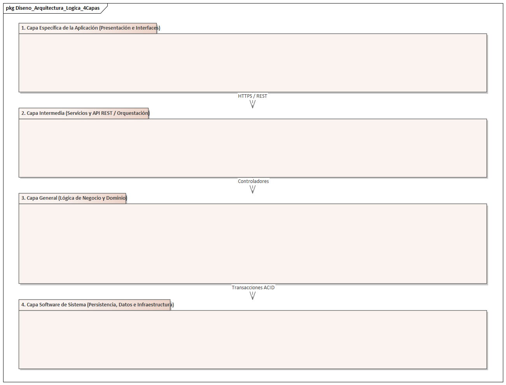

```plantuml
@startuml Arquitectura_Logica_4Capas_Completa
skinparam packageStyle rectangle
skinparam shadowing false

package "1. Capa Específica de la Aplicación (Presentación e Interfaces)" #EBF5FB {
  package "Interfaz Web Cliente\n(Angular 19+ SPA)" as UI_Web
  package "Interfaz Móvil\n(Flutter 3.x / ARCore 3D / Whisper NLP)" as UI_Movil
  package "Interfaz Administrativa / POS\n(Backoffice Sucursal)" as UI_POS
}

package "2. Capa Intermedia (Servicios y API REST / Orquestación)" #FEF9E7 {
  package "API Routers y Controladores REST\n(FastAPI Routers)" as App_Routers
  package "Middleware de Seguridad y JWT\n(RBAC / CORS / OTP)" as App_Security
  package "Validación de Esquemas y DTOs\n(Pydantic Schemas)" as App_DTO
}

package "3. Capa General (Lógica de Negocio y Dominio)" #E8F8F5 {
  package "P1: Seguridad y Acceso (RBAC)\n[CU01, CU02, CU03, CU04]" as Dom_P1 #FDEDEC
  package "P2: Estructura Operativa (Sucursales)\n[CU05]" as Dom_P2 #FDEDEC
  package "P3: Catálogo, Estilismo e IA (Reutilizado)\n[CU06, CU07, CU10, CU19, CU20, CU22, CU23]" as Dom_P3 #A3E4D7
  package "P4: Aprovisionamiento y Proveedores\n[CU08]" as Dom_P4 #FDEDEC
  package "P5: Inventario y Analítica (Reutilizado)\n[CU09, CU24]" as Dom_P5 #AED6F1
  package "P6: Reservas Presenciales\n[CU11, CU12]" as Dom_P6 #FEF9E7
  package "P7: Venta Digital y CRM (Reutilizado)\n[CU13, CU14, CU21]" as Dom_P7 #F9E79F
  package "P8: Punto de Venta POS y Devoluciones\n[CU15, CU25]" as Dom_P8 #FEF9E7
  package "P9: Procesamiento de Pagos\n[CU16, CU17]" as Dom_P9 #FEF9E7
  package "P10: Logística y Delivery\n[CU18]" as Dom_P10 #FEF9E7
}

package "4. Capa Software de Sistema (Persistencia, Datos e Infraestructura)" #FADBD8 {
  package "ORM SQLAlchemy 2.0" as Inf_ORM
  database "PostgreSQL 16 Multi-tenant" as Inf_DB
  package "Servicio SMTP / OTP" as Inf_SMTP
  package "CDN Modelos 3D (.glb)" as Inf_CDN
  package "OpenAI API / Gemini SDK" as Inf_LLM
  package "OpenWeatherMap API" as Inf_Weather
  package "Pasarela Stripe / QR BCB" as Inf_Stripe
  package "Redis Cloud (Caché / Sesiones)" as Inf_Redis
}

"1. Capa Específica de la Aplicación (Presentación e Interfaces)" ..> "2. Capa Intermedia (Servicios y API REST / Orquestación)" : HTTPS / REST
"2. Capa Intermedia (Servicios y API REST / Orquestación)" ..> "3. Capa General (Lógica de Negocio y Dominio)" : Controladores
"3. Capa General (Lógica de Negocio y Dominio)" ..> "4. Capa Software de Sistema (Persistencia, Datos e Infraestructura)" : Transacciones ACID
@enduml
```

### 3.1.2 Arquitectura SaaS Multi-tenant y Administrador SaaS

Para responder al requerimiento de **Solución Universal** planteado en clase:
- **Modelo Multi-tenant Lógico:** La plataforma está diseñada para albergar a múltiples empresas de indumentaria masculina (*tenants*). Todas las tablas transaccionales y de configuración contienen la columna discriminatoria `tenant_id` (UUID indexado).
- **Analogía del Edificio:** La infraestructura de nube, servidores de aplicaciones y motor de base de datos representan las áreas comunes y cimientos del edificio, mientras que cada tenant constituye un departamento privado con acceso restringido exclusivamente a sus productos, clientes, ventas y configuraciones.
- **Rol del Administrador SaaS:** Perfil de super-usuario con privilegios para aprovisionar nuevas empresas clientes, auditar el consumo de recursos en la nube y configurar los límites de almacenamiento de modelos 3D y cuotas de APIs de IA. Los administradores normales de tienda solo visualizan los datos pertenecientes a su propio `tenant_id`.

### 3.1.3 Seguridad, Bitácora de Auditoría y Backups

- **Bitácora de Auditoría (Audit Log):** Todas las acciones críticas del Ciclo 3 (canjes de puntos, consultas a modelos de IA, visualizaciones de dashboards gerenciales y cambios de membresía) se registran en la tabla inmutable `bitacora_auditoria` capturando: `id_usuario`, `accion`, `ip_cliente`, `metadatos_json` y `fecha_hora_local` con huso horario configurado estrictamente a **Bolivia (UTC-04:00)**.
- **Doble Modalidad de Backups:**
  1. **Automático:** Procedimiento programado (*Cron Job*) ejecutado diariamente a la **1:00 AM** que genera un dump comprimido de la base de datos PostgreSQL y lo cifra con AES-256 hacia un bucket seguro en la nube.
  2. **Manual:** Opción habilitada en el panel del Administrador SaaS para generar copias instantáneas antes de despliegues o actualizaciones mayores.
- **Restauración de Datos:** Permite montar copias de seguridad históricas en esquemas secundarios en modo de solo lectura para auditorías contables y comparaciones interanuales sin afectar las operaciones en vivo.

### 3.1.4 Diseño Físico de la Arquitectura (Diagrama de Despliegue en Render)

El despliegue físico del sistema se basa en la infraestructura en la nube de **Render**, desacoplando los servicios web estáticos (Angular 19 SPA), los contenedores de backend (FastAPI + Uvicorn ASGI en Docker), la base de datos gestionada PostgreSQL 16 multi-tenant, y la conexión con clientes móviles nativos (Flutter con ARCore y Reconocimiento de Voz Whisper), estaciones POS de sucursal e impresoras térmicas ESC/POS, así como la suite completa de servicios externos de Inteligencia Artificial (OpenAI API / Gemini SDK), Meteorología (OpenWeatherMap API), Pasarela de Pagos (Stripe / QR BCB) y CDN de modelos 3D (`.glb`):


```plantuml
@startuml Diagrama_Despliegue_Render_UML25_Completo
skinparam node-shadowing false

node "Cliente\n(Navegador Web / PC Escritorio)" as Node_Web {
  component "SPA Angular 19\n(Catálogo & E-Commerce)\n[CU01-CU14, CU21]" as C_Web_UI
  component "Comparador Desktop\n(Visualizador Outfits Paralelo)\n[CU23]" as C_Web_Comp
  component "Dashboard BI Gerencial\n(Métricas & Analítica Gráfica)\n[CU24]" as C_Web_Dash
  component "Cliente HTTP\n(HttpClient / AJAX Fetch)" as C_Web_Ajax
}

node "Cliente Móvil\n(Dispositivo Android / iOS)" as Node_Movil {
  component "App Móvil Flutter 3.x\n(UI Reactiva & Catálogo Móvil)\n[CU01-CU14, CU21]" as C_Movil_UI
  component "Módulo Vestidor Virtual RA\n(ARCore 3D Engine & Pose)\n[CU19]" as C_Movil_RA
  component "Motor Reconocimiento de Voz\n(Whisper Audio STT NLP)\n[CU20]" as C_Movil_Voice
  component "Cliente HTTP Móvil\n(Dio Client / Cache Local)" as C_Movil_Http
}

node "Servicios Cloud Externos\n(IA, Clima, CDN & Pasarelas)" as Node_Cloud {
  component "OpenAI API / Gemini SDK\n(Inferencia LLM Outfits & Estilismo)\n[CU20, CU22]" as C_Cloud_AI
  component "OpenWeatherMap API\n(Datos Meteorológicos en Vivo)\n[CU22]" as C_Cloud_Weather
  component "Servicio SMTP Transaccional\n(Envío de Códigos OTP)\n[CU03]" as C_Cloud_SMTP
  component "CDN Cloudinary / AWS S3\n(Modelos 3D .glb & Texturas RA)\n[CU19]" as C_Cloud_CDN
  component "Pasarela Stripe & QR BCB\n(Procesamiento Pagos Digitales)\n[CU16, CU17]" as C_Cloud_Pay
  component "Redis Cloud In-Memory\n(Caché Rápida & Sesiones JWT)" as C_Cloud_Redis
}

node "Servidor Web\n(Render Proxy / Static Site Gateway)" as Node_SWeb {
  component "Hosting Estático SPA\n(dist/angular/browser)\n[CU01-CU10, CU23, CU24]" as C_SWeb_App
  component "Proxy Reverso ASGI\n(Uvicorn SSL Termination Port 443)" as C_SWeb_Asgi
  component "Utilidades de Red\n(CORS / Compression / Rate Limit)" as C_SWeb_Util
}

node "Servidor Aplicaciones\n(FastAPI Backend en Render Docker)" as Node_SApp {
  component "Routers Auth, Sucursales & Catálogo\n(JWT/OTP/RBAC & Stock)\n[CU01-CU08, CU10]" as C_SApp_R1
  component "Routers E-Commerce, Reservas QR & POS\n(Checkout, Pagos & Despacho)\n[CU11-CU18]" as C_SApp_R2
  component "Acceso a Datos & Pool Conexiones\n(SQLAlchemy 2.0 ORM Multi-tenant)" as C_SApp_ORM
  component "Motor IA Contextual & Outfits\n(/ia-recomendaciones, /voz)\n[CU20, CU22]" as C_SApp_AI
  component "Motor Fidelización & Gamificación\n(/gamificacion, /cupones)\n[CU21]" as C_SApp_Gamif
  component "Motor Analítica BI & Valuación CPP\n(/dashboard, /reportes-kardex)\n[CU09, CU24]" as C_SApp_Dash
}

node "Estación POS Sucursal\n(Terminal PC / Tablet Caja)" as Node_POS {
  component "Módulo Terminal POS Caja\n(Facturación Presencial)\n[CU15]" as C_POS_UI
}

node "Impresora Térmica\n(Tickets POS Sucursal ESC/POS)" as Node_Printer

node "Base de Datos Cloud\n(PostgreSQL 16 Multi-tenant en Render)" as Node_DB

Node_Web -- Node_SWeb : HTTPS (Port 443)
Node_Movil -- Node_SWeb : HTTPS (Port 443)
Node_SWeb -- Node_SApp : TCP/IP (ASGI Port 8000)
Node_POS -- Node_SApp : HTTPS (Port 443 / POS API)
Node_POS -- Node_Printer : USB / Red (ESC/POS)
Node_SApp -- Node_DB : TCP/IP (Port 5432 - SSL)
Node_SApp -- Node_Cloud : HTTPS (REST API / Webhooks)
Node_Movil -- Node_Cloud : HTTPS (Descarga GLB / Texturas RA)
@enduml
```

---

## 3.2 Diseño de Casos de Uso

### 3.2.1 Diagramas de Secuencia UML 2.5+

> [!IMPORTANT]
> **Norma estricta de la cátedra:** Los diagramas de secuencia se diseñan exclusivamente a través de la interacción de objetos pertenecientes a las tres capas: **Interfaz (`Boundary`)**, **Controlador (`Control`)** y **Entidad (`Entity`)**. Queda terminantemente prohibido incluir cajas denominadas *"Base de Datos"* o *"Database"*.

#### Diagrama de Secuencia - CU19: Visualizar Prenda en Vestidor Virtual con RA


```plantuml
@startuml Secuencia_CU19_Vestidor_RA
skinparam style strictuml
autonumber

actor "Cliente Móvil" as Cliente
boundary "ui :VestidorARScreen" as UI
control "ctrl :ControladorVestidorAR" as Ctrl
entity "prod :ProductoEntity" as Prod
entity "ra :RecursoRAEntity" as RA
entity "audit :AuditoriaBitacoraEntity" as Audit

Cliente -> UI : presionarBotonProbarRA(id_producto, talla, color)
activate UI
UI -> Ctrl : inicializarSesionAR(id_producto, talla, color)
activate Ctrl

Ctrl -> Prod : getDatosPrenda(id_producto)
activate Prod
Prod --> Ctrl : prendaDTO(nombre, categoria, sku)
deactivate Prod

Ctrl -> RA : getRecurso3D(id_producto)
activate RA
RA --> Ctrl : recursoRADTO(modelo_3d_url, textura_map, puntos_anclaje)
deactivate RA

Ctrl -> Audit : registrarEventoAuditoria(id_usuario, "INICIO_SESION_RA", ip_cliente)
activate Audit
Audit --> Ctrl : confirmacionAuditoria()
deactivate Audit

Ctrl --> UI : payloadAR(recursoRADTO, prendaDTO, calibracion_params)
deactivate Ctrl

UI -> UI : calibrarSensoresCamaraYAnclajes()
UI -> UI : superponerMalla3DSobreTorso()
UI --> Cliente : proyecta prenda tridimensional en tiempo real

opt Cliente cambia de color
  Cliente -> UI : seleccionarColorHex("#1A2A44")
  UI -> UI : actualizarTexturaShader(nuevo_color)
  UI --> Cliente : prenda proyectada cambia de color instantáneamente
end
deactivate UI
@enduml
```

#### Diagrama de Secuencia - CU20: Comparar Outfits Lado a Lado


```plantuml
@startuml Secuencia_CU20_Comparador_Outfits
skinparam style strictuml
autonumber

actor "Cliente Final" as Cliente
boundary "ui :ComparadorScreen" as UI
control "ctrl :ControladorComparador" as Ctrl
entity "prod :ProductoEntity" as Prod
entity "promo :PromocionEntity" as Promo
entity "cart :CarritoEntity" as Cart

Cliente -> UI : ensamblarOutfits(outfit1_skus, outfit2_skus, outfit3_skus)
activate UI
UI -> Ctrl : evaluarOutfitsComparativos(outfit1_skus, outfit2_skus, outfit3_skus)
activate Ctrl

Ctrl -> Prod : getPreciosPrendas(todos_los_skus)
activate Prod
Prod --> Ctrl : listaPreciosBase
deactivate Prod

Ctrl -> Promo : getDescuentosVigentes(todos_los_skus)
activate Promo
Promo --> Ctrl : listaDescuentos
deactivate Promo

Ctrl -> Ctrl : calcularTotalesComparativosYAhorros()
Ctrl -> Ctrl : etiquetarOutfitMasEconomico()

Ctrl --> UI : comparacionResponseDTO(totales, ahorros, outfit_ganador)
deactivate Ctrl

UI --> Cliente : muestra tabla lado a lado con desglose y etiqueta "Más Económico"

opt Cliente adquiere el outfit preferido
  Cliente -> UI : seleccionarComprarOutfit(outfit_id)
  UI -> Ctrl : transferirOutfitACarrito(outfit_id, id_usuario)
  activate Ctrl
  Ctrl -> Cart : agregarPrendasBatch(id_usuario, items_outfit)
  activate Cart
  Cart --> Ctrl : confirmacionItemsAgregados()
  deactivate Cart
  Ctrl --> UI : notificacionExitoTransferencia()
  deactivate Ctrl
  UI --> Cliente : redirige a vista de carrito de compras
end
deactivate UI
@enduml
```

#### Diagrama de Secuencia - CU21: Gestionar Fidelización Gamificada


```plantuml
@startuml Secuencia_CU21_Fidelizacion_Gamificada
skinparam style strictuml
autonumber

actor "Cliente Final" as Cliente
boundary "ui :RecompensasScreen" as UI
control "ctrl :ControladorGamificacion" as Ctrl
entity "perfil :GamificacionPerfilEntity" as Perfil
entity "rec :RecompensaEntity" as Rec
entity "cupon :CuponEntity" as Cupon

Cliente -> UI : accederSeccionRecompensas()
activate UI
UI -> Ctrl : getPerfilGamificacion(id_usuario)
activate Ctrl

Ctrl -> Perfil : findByUsuarioId(id_usuario)
activate Perfil
Perfil --> Ctrl : gamificacionPerfilEntity
deactivate Perfil

Ctrl --> UI : perfilDTO(puntos_actuales, nivel, insignias, progreso_pct)
deactivate Ctrl
UI --> Cliente : renderiza tarjeta de membresía, medallas y barra de progreso

opt Cliente canjea una recompensa
  Cliente -> UI : solicitarCanje(codigo_recompensa)
  UI -> Ctrl : canjearRecompensa(id_usuario, codigo_recompensa)
  activate Ctrl
  
  Ctrl -> Rec : getRecompensaPorCodigo(codigo_recompensa)
  activate Rec
  Rec --> Ctrl : recompensaDTO(costo_puntos, beneficio_monto)
  deactivate Rec
  
  Ctrl -> Perfil : debitarPuntos(costo_puntos)
  activate Perfil
  Perfil --> Ctrl : saldoDebitadoExitosamente(puntos_restantes)
  deactivate Perfil
  
  Ctrl -> Cupon : crearCupon(id_usuario, beneficio_monto, codigo_unico)
  activate Cupon
  Cupon --> Ctrl : cuponEntity(codigo_cupon, fecha_expiracion)
  deactivate Cupon
  
  Ctrl --> UI : canjeResponseDTO(codigo_cupon, puntos_restantes, mensaje_exito)
  deactivate Ctrl
  UI --> Cliente : presenta cupón listo para aplicar en el carrito
end
deactivate UI
@enduml
```

#### Diagrama de Secuencia - CU22: Solicitar Recomendación Contextual de IA


```plantuml
@startuml Secuencia_CU22_Recomendacion_IA
skinparam style strictuml
autonumber

actor "Cliente Final" as Cliente
boundary "ui :AsistenteIAScreen" as UI
control "ctrl :ControladorIAContextual" as Ctrl
entity "clima :ServicioClimaAdapter" as Clima
entity "llm :ProveedorLLMAdapter" as LLM
entity "inv :InventarioEntity" as Inv
entity "solicitud :SolicitudIAEntity" as Solicitud

Cliente -> UI : solicitarAsesoria(ciudad = "Santa Cruz", ocasion = "Casual")
activate UI
UI -> Ctrl : generarRecomendacionesContextuales("Santa Cruz", "Casual", id_usuario)
activate Ctrl

Ctrl -> Clima : getClimaActual("Santa Cruz")
activate Clima
Clima --> Ctrl : climaDTO(temp = 28.5°C, condicion = "Soleado", icono = "01d")
deactivate Clima

Ctrl -> LLM : generarOutfitsContextuales(climaDTO, "Casual", reglas_colorimetria)
activate LLM
LLM --> Ctrl : outfitsGeneradosJSON(analisis_estilista, skus_propuestos)
deactivate LLM

Ctrl -> Inv : verificarExistencias(skus_propuestos)
activate Inv
Inv --> Ctrl : prendasDisponiblesConStock
deactivate Inv

Ctrl -> Solicitud : guardarRegistroRecomendacion(id_usuario, climaDTO, outfitsGeneradosJSON)
activate Solicitud
Solicitud --> Ctrl : confirmacionPersistencia()
deactivate Solicitud

Ctrl --> UI : recomendacionesResponseDTO(climaDTO, outfitsDisponibles, analisis_estilista)
deactivate Ctrl
UI --> Cliente : despliega widget meteorológico y atuendos recomendados
deactivate UI
@enduml
```

#### Diagrama de Secuencia - CU23: Buscar Productos por Comandos de Voz


```plantuml
@startuml Secuencia_CU23_Busqueda_Voz
skinparam style strictuml
autonumber

actor "Cliente Móvil" as Cliente
boundary "ui :BuscadorVozModal" as UI
control "ctrl :ControladorVozNLP" as Ctrl
entity "stt :ServicioSTTAdapter" as STT
entity "nlp :ParserNLPAdapter" as NLP
entity "cat :CatalogoEntity" as Cat

Cliente -> UI : pulsarMicrófonoYHablar("Busco camisa formal blanca de lino")
activate UI
UI -> Ctrl : procesarComandoVoz(audioBytes)
activate Ctrl

Ctrl -> STT : transcribirAudio(audioBytes)
activate STT
STT --> Ctrl : textoTranscrito("Busco camisa formal blanca de lino")
deactivate STT

Ctrl -> NLP : extraerEntidadesEIntencion(textoTranscrito)
activate NLP
NLP --> Ctrl : entidadesDTO(categoria="Camisa", estilo="Formal", color="Blanco", tela="Lino")
deactivate NLP

Ctrl -> Cat : consultarPrendasPorAtributos(entidadesDTO)
activate Cat
Cat --> Ctrl : listaPrendasCoincidentes
deactivate Cat

Ctrl --> UI : busquedaVozResponseDTO(textoTranscrito, listaPrendasCoincidentes)
deactivate Ctrl
UI --> Cliente : muestra catálogo filtrado con las prendas solicitadas
deactivate UI
@enduml
```

#### Diagrama de Secuencia - CU24: Visualizar Cuadros de Mando y Dashboards


```plantuml
@startuml Secuencia_CU24_Dashboards_Analitica
skinparam style strictuml
autonumber

actor "Administrador General" as Admin
boundary "ui :DashboardComponent" as UI
control "ctrl :ControladorDashboard" as Ctrl
entity "orden :OrdenVentaEntity" as Orden
entity "inv :InventarioEntity" as Inv
entity "res :ReservaEntity" as Res
entity "audit :AuditoriaBitacoraEntity" as Audit

Admin -> UI : navegarARutaDashboard()
activate UI
UI -> Ctrl : getMetricasConsolidadas(id_usuario_admin)
activate Ctrl

Ctrl -> Orden : getVentasTotalesYPorCanal()
activate Orden
Orden --> Ctrl : metricsVentas(total_bs, ventas_online, ventas_pos)
deactivate Orden

Ctrl -> Inv : getValuacionInventarioCPP()
activate Inv
Inv --> Ctrl : metricsInventario(stock_total, valor_total_cpp)
deactivate Inv

Ctrl -> Res : getTasaConversionProbadores()
activate Res
Res --> Ctrl : metricsReservas(total_reservas, atendidas, tasa_conversion_pct)
deactivate Res

Ctrl -> Audit : registrarAccesoDashboard(id_usuario_admin, "CONSULTA_DASHBOARD", ip_cliente)
activate Audit
Audit --> Ctrl : confirmacionAuditoria()
deactivate Audit

Ctrl --> UI : dashboardResponseDTO(metricsVentas, metricsInventario, metricsReservas)
deactivate Ctrl
UI --> Admin : renderiza tarjetas KPIs, gráficas comparativas y valuación CPP
deactivate UI
@enduml
```

#### Diagrama de Secuencia - CU25: Gestionar Devolución y Cambio de Prendas


```plantuml
@startuml Secuencia_CU25_Devolucion_Cambio
skinparam style strictuml
autonumber

actor "Cajero POS" as Cajero
boundary "ui :DevolucionPOSScreen" as UI
control "ctrl :ControladorDevolucionPOS" as Ctrl
entity "venta :VentaPOSEntity" as Venta
entity "inv :InventarioEntity" as Inv
entity "kar :KardexMovimientoEntity" as Kar
entity "dev :DevolucionEntity" as Dev
entity "nota :NotaCreditoEntity" as Nota

Cajero -> UI : ingresarCodigoTicket("POS-2026-0042")
activate UI
UI -> Ctrl : buscarTicketParaDevolucion("POS-2026-0042")
activate Ctrl

Ctrl -> Venta : getVentaPorTicket("POS-2026-0042")
activate Venta
Venta --> Ctrl : ventaDTO(fecha, items, total, cpp_historico)
deactivate Venta

Ctrl -> Ctrl : validarPlazoMaximo14Dias(ventaDTO.fecha)
Ctrl --> UI : detalleVentaValida(items_vendidos, estado_plazo="VALIDO")
deactivate Ctrl
UI --> Cajero : muestra prendas del ticket y habilita inspección

Cajero -> UI : seleccionarPrendaYResolucion(id_item, "APTO_VENTA", "CAMBIO_TALLA_L")
UI -> Ctrl : procesarTransaccionDevolucion(id_venta, id_item, "CAMBIO_TALLA_L")
activate Ctrl

Ctrl -> Inv : incrementarStockFisico(id_sucursal, id_item_devuelto, 1)
activate Inv
Inv --> Ctrl : nuevo_stock_actual
deactivate Inv

Ctrl -> Kar : asentarMovimientoKardex("DEVOLUCION_VENTA", +1, cpp_historico)
activate Kar
Kar --> Ctrl : confirmacionKardexInmutable()
deactivate Kar

Ctrl -> Dev : registrarDevolucion(id_venta, id_item, "APTO_VENTA", "CAMBIO_TALLA_L")
activate Dev
Dev --> Ctrl : id_devolucion
deactivate Dev

Ctrl -> Nota : emitirNuevoComprobanteOCambio(id_cliente, diferencia_bs)
activate Nota
Nota --> Ctrl : ticketFiscalCambioDTO
deactivate Nota

Ctrl --> UI : devolucionExitosaDTO(id_devolucion, ticketFiscalCambioDTO)
deactivate Ctrl

UI --> Cajero : imprime ticket fiscal de cambio y actualiza pantalla
deactivate UI
@enduml
```

---

### 3.2.2 Diagramas de Estado - Dominio del Sistema

#### a) Ciclo de Vida del Nivel de Fidelización y Puntos (CU21)

```plantuml
@startuml Estado_Fidelizacion
skinparam state {
  BackgroundColor #FCF3CF
  BorderColor #B7950B
}

[*] --> BRONCE : Registro de Cliente (+20 pts bienvenida)

state BRONCE {
  BRONCE : Puntos acumulados: 0 - 499
  BRONCE : Beneficio: Acceso general y vestidor RA
}

state PLATA {
  PLATA : Puntos acumulados: 500 - 1,499
  PLATA : Beneficio: 5% de descuento base permanente
}

state ORO {
  ORO : Puntos acumulados: 1,500 - 3,999
  ORO : Beneficio: 10% de descuento base permanente
}

state DIAMANTE {
  DIAMANTE : Puntos acumulados: >= 4,000
  DIAMANTE : Beneficio: 15% de descuento + Envíos gratis
}

BRONCE --> PLATA : Acumula >= 500 puntos por compras
PLATA --> ORO : Acumula >= 1,500 puntos por compras
ORO --> DIAMANTE : Acumula >= 4,000 puntos por compras

state "Canje de Cupón" as Canje #D4EFDF {
  Canje : Se descuentan puntos_actuales
  Canje : Puntos históricos NO disminuyen
}

BRONCE --> Canje : Canjea cupón (saldo suficiente)
PLATA --> Canje : Canjea cupón
ORO --> Canje : Canjea cupón
DIAMANTE --> Canje : Canjea cupón

Canje --> BRONCE : Retorna a estado (nivel inalterado)
Canje --> PLATA : Retorna a estado
Canje --> ORO : Retorna a estado
Canje --> DIAMANTE : Retorna a estado
@enduml
```


#### b) Ciclo de Vida de la Sesión de Realidad Aumentada (CU19)

```plantuml
@startuml Estado_Sesion_RA
skinparam state {
  BackgroundColor #D5F5E3
  BorderColor #1E8449
}

[*] --> INICIALIZANDO_CAMARA : Selección de prenda 3D
INICIALIZANDO_CAMARA --> BUSCANDO_ANCLAJES : Permiso concedido de cámara
BUSCANDO_ANCLAJES --> TRACKING_ACTIVO : Anclajes anatómicos fijados (hombros y torso)
BUSCANDO_ANCLAJES --> ERROR_ILUMINACION : Tracking inestable por baja luz
ERROR_ILUMINACION --> BUSCANDO_ANCLAJES : Usuario mejora iluminación

state TRACKING_ACTIVO {
  state "Renderizado 3D Normal" as R_Normal
  state "Cambiando Textura Shader" as R_Textura
  state "Capturando Fotografía" as R_Foto
  
  [*] --> R_Normal
  R_Normal --> R_Textura : Selecciona nuevo color
  R_Textura --> R_Normal : Textura aplicada
  R_Normal --> R_Foto : Presiona obturador
  R_Foto --> R_Normal : Imagen guardada
}

TRACKING_ACTIVO --> DERIVANDO_ACCION : Pulsa "Comprar" o "Reservar"
DERIVANDO_ACCION --> [*] : Prenda añadida a Carrito o Reserva
TRACKING_ACTIVO --> [*] : Cierra pantalla vestidor
@enduml
```


#### c) Ciclo de Vida de la Consulta Contextual IA (CU22 / CU23)

```plantuml
@startuml Estado_Consulta_IA
skinparam state {
  BackgroundColor #E8F8F5
  BorderColor #117A65
}

[*] --> SOLICITUD_INICIADA : Selección de ocasión o dictado de voz
SOLICITUD_INICIADA --> OBTENIENDO_CLIMA : Consulta coordenadas / ciudad
OBTENIENDO_CLIMA --> GENERANDO_PROMPT : Clima obtenido exitosamente (OpenWeatherMap)
OBTENIENDO_CLIMA --> GENERANDO_PROMPT_FALLBACK : Error en API clima (usa clima estacional)

GENERANDO_PROMPT --> CONSULTANDO_LLM : Envía prompt con reglas de estilo
GENERANDO_PROMPT_FALLBACK --> CONSULTANDO_LLM : Envía prompt con clima estimado

CONSULTANDO_LLM --> VALIDANDO_STOCK : Respuesta JSON devuelta por IA
VALIDANDO_STOCK --> RESULTADO_LISTO : Al menos 1 combinación con stock activo > 0
VALIDANDO_STOCK --> REEMPLAZANDO_SKUS : Prenda sin existencias (sustituye similar)
REEMPLAZANDO_SKUS --> RESULTADO_LISTO : Conjunto reajustado con stock real

RESULTADO_LISTO --> [*] : Despliegue en pantalla al usuario
@enduml
```


#### d) Diagrama de Estado Operacional de Caso de Uso - Flujo Asistente IA (CU22)

Modela el flujo transaccional y bifurcaciones de interacción del usuario con guardas de validación según el estándar UML 2.5:

```plantuml
@startuml Estado_Flujo_Operacional_CU22
skinparam state {
  BackgroundColor #FCF3CF
  BorderColor #B7950B
}

[*] --> Acceder_Asistente : Inicio
Acceder_Asistente --> Seleccionar_Modo : [correcto]
Acceder_Asistente --> Acceder_Asistente : [error de red]

state Seleccionar_Modo as "Seleccionar Modo Entrada"
Seleccionar_Modo --> Grabar_Audio : [dictado por voz]
Seleccionar_Modo --> Seleccionar_Ocasion : [seleccion manual]
Seleccionar_Modo --> Cargar_Historial : [ver historial]

Grabar_Audio --> Grabar_Audio : [audio inaudible]
Grabar_Audio --> Revisar_Parametros : [entidades reconocidas]

Seleccionar_Ocasion --> Revisar_Parametros : [llenar datos]

Cargar_Historial --> Desplegar_Outfits : [cargar looks]

Revisar_Parametros --> Desplegar_Outfits : [generar outfit]

Desplegar_Outfits --> Transaccion_Completada : [comprar / guardar]
Transaccion_Completada --> [*] : Fin
@enduml
```


#### e) Ciclo de Vida de la Devolución y Cambio de Prendas (CU25)

```plantuml
@startuml Estado_Devolucion_Cambio
skinparam state {
  BackgroundColor #D5F5E3
  BorderColor #1E8449
}

[*] --> SOLICITADA : Cliente o cajero inicia devolución de ticket

state SOLICITADA {
  SOLICITADA : Validación de ticket original
  SOLICITADA : Verificación de plazo (<= 14 días)
}

SOLICITADA --> RECHAZADA : Plazo vencido (> 14 días) o ticket inexistente
SOLICITADA --> EN_INSPECCION : Plazo válido y ticket confirmado

state EN_INSPECCION {
  EN_INSPECCION : Revisión visual de prenda física
  EN_INSPECCION : Verificación de etiquetas y sin uso
}

EN_INSPECCION --> RECHAZADA : Prenda dañada por mal uso / sin etiquetas
EN_INSPECCION --> APROBADA_VENTA : Prenda apta para venta (reingreso a mostrador)
EN_INSPECCION --> APROBADA_MERMA : Tara de confección (reingreso a cuarentena)

state APROBADA_VENTA {
  APROBADA_VENTA : Reingreso a inventario físico (+1)
  APROBADA_VENTA : Asiento Kardex al CPP histórico
}

state APROBADA_MERMA {
  APROBADA_MERMA : Asiento Kardex por merma de fábrica
  APROBADA_MERMA : Prenda aislada para reclamo a proveedor
}

APROBADA_VENTA --> LIQUIDADA_CAMBIO : Cliente elige cambio de talla/color (ajuste factor)
APROBADA_VENTA --> LIQUIDADA_VALE : Cliente elige Nota de Crédito / Vale de compra
APROBADA_VENTA --> LIQUIDADA_REEMBOLSO : Cliente solicita devolución de dinero (POS / Stripe)

APROBADA_MERMA --> LIQUIDADA_CAMBIO : Cambio de prenda inmediata por stock nuevo
APROBADA_MERMA --> LIQUIDADA_REEMBOLSO : Devolución de fondos por falla de producto

LIQUIDADA_CAMBIO --> [*] : Emisión de nuevo ticket fiscal y salida de prenda
LIQUIDADA_VALE --> [*] : Emisión de cupón digital con saldo a favor
LIQUIDADA_REEMBOLSO --> [*] : Salida de efectivo en caja o refund Stripe
RECHAZADA --> [*] : Notificación al cliente y devolución de prenda
@enduml
```


---

### 3.2.3 Diagramas de Navegación del Sistema (Ciclo 3)

Conforme a las directrices metodológicas de la cátedra y al estándar UML 2.5+, los diagramas de navegación se modelan mediante el patrón **WAF (Web Application Framework)** a dos niveles de granularidad:
1. **Diagrama de Navegación General del Sistema (Consolidado Omnicanal WAF)**: Articula la navegación macro entre el entorno del Cliente (Catálogo, Estilismo IA, Comparador de Outfits, Vestidor RA, Fidelización CRM) y los paneles administrativos (Dashboard Ejecutivo de Gerencia y Terminal POS de Caja).
2. **Diagramas de Navegación Específicos por cada Paquete (Subsistema)**: Cubren en detalle cada uno de los 10 paquetes de la solución, modelando las pantallas (`View`) con sus atributos de formulario, los controladores (`Controller`) con sus operaciones de despacho, y las relaciones de asociación estereotipadas `«submit»` y `«build»`.

---

#### 3.2.3.1 Diagrama de Navegación General del Sistema (Consolidado Omnicanal WAF - Ciclos 1, 2 y 3)

Modela la arquitectura macro de navegación WAF de todo el sistema **FashionStore** integrando de forma cohesiva los flujos transaccionales y de gestión de los **3 Ciclos** para todos los actores del ecosistema (Cliente, Cajero/Encargado, Personal de Despacho y Administrador General):
1. **Flujo de Acceso, Catálogo y Experiencia Inteligente (Ciclos 1 y 3):** Autenticación (`loginView`), exploración omnicanal por voz NLP (`catalogoView`), asesoramiento meteorológico (`asistenteEstiloView`), comparativa tridimensional (`comparadorOutfitsView`), prueba aumentada (`vestidorVirtualRAView`) y fidelización gamificada (`recompensasView`).
2. **Flujo Transaccional E-Commerce y Checkout (Ciclo 2):** Selección de talla y stock en `prendaDetalleView`, administración de bolsa (`carritoView`), configuración de despacho (`checkoutWizardView`), pasarela de pago Stripe/QR interoperable BCB (`pasarelaPagoView`) y monitoreo de entrega (`trackingDeliveryView`).
3. **Flujo de Reservas Presenciales y Punto de Venta POS con Devoluciones (Ciclos 2 y 3):** Solicitud de apartado en sucursal física (`reservaProbadorView`), expedición de `ticketQRView`, gestión de probadores por el encargado (`tableroReservasView`), facturación rápida en caja (`terminalPOSView`) y procesamiento post-venta de devoluciones y cambios con inspección física y plazo fiscal $\le 14$ días (`devolucionesView`).
4. **Flujo Logístico y Despacho (Ciclo 2):** Asignación y tracking de repartidores en ruta (`tableroDespachoView` vinculado a `trackingDeliveryView`).
5. **Flujo de Alta Dirección y Control de Inventarios (Ciclos 1 y 3):** Monitoreo analítico integral en `dashboardEjecutivoView` y control de existencias valoradas al Costo Promedio Ponderado ($CPP$) en `inventarioKardexView`.

```plantuml
@startuml Navegacion_Sistema_Ciclo3
skinparam class {
  BackgroundColor #FEF9E7
  BorderColor #B7950B
}

actor "Cliente" as Cliente
actor "Cajero / Encargado" as Cajero
actor "Personal Despacho" as Despacho
actor "Administrador" as Admin

' --- Tier 1: IA & Comparador (Ciclo 3) ---
class "asistenteEstiloView" as VIA {
  + ciudadClima: String
  + ocasion: String
}
class "asistenteEstiloController" as CIA {
  + consultarClima(): void
  + generarOutfitsLLM(): void
}
class "comparadorOutfitsView" as VComp {
  + outfitA_Id: int
  + outfitB_Id: int
}

' --- Tier 2: Acceso, Catálogo, RA y Fidelización (Ciclos 1 y 3) ---
class "loginView" as VLog {
  + email: String
  + password: String
}
class "authController" as CAuth {
  + iniciarSesion(): void
  + solicitarOTP(): void
}
class "catalogoView" as VCat {
  + categoria: String
  + busquedaVozNLP: String
}
class "catalogoController" as CCat {
  + menu(): void
  + filtrarNLP(): void
}
class "vestidorRAController" as CRA {
  + cambiarShader(): void
  + iniciarTracking(): void
}
class "vestidorVirtualRAView" as VRA {
  + colorShader: String
  + idPrenda3D: int
}
class "recompensasController" as CFide {
  + actualizarNivel(): void
  + canjearCupon(): void
}
class "recompensasView" as VFide {
  + nivelVIP: String
  + puntosDisponibles: int
}

' --- Tier 3: Ficha Prenda, Carrito y Checkout (Ciclos 1 y 2) ---
class "prendaDetalleView" as VDet {
  + sku: String
  + talla: String
}
class "prendaController" as CDet {
  + agregarBolsa(): void
  + verDisponibilidad(): void
}
class "carritoView" as VCart {
  + itemsList: List
  + subtotalBs: double
}
class "carritoController" as CCart {
  + aplicarCupon(): void
  + modificarCantidad(): void
}
class "checkoutWizardView" as VCheck {
  + direccionEnvio: String
  + tipoFactura: String
}
class "checkoutController" as CCheck {
  + calcularEnvio(): void
  + generarOrden(): void
}

' --- Tier 4: Reserva Probadores, Pagos y Tracking (Ciclo 2) ---
class "reservaProbadorView" as VRes {
  + fechaHora: DateTime
  + sucursalId: int
}
class "reservaController" as CRes {
  + apartarPrendas(): void
  + generarTicketQR(): void
}
class "ticketQRView" as VTQR {
  + codigoQR: String
  + estadoReserva: String
}
class "pasarelaPagoView" as VPago {
  + metodoCobro: String
  + montoTotalBs: double
}
class "pagoController" as CPago {
  + generarQR_BCB(): void
  + procesarStripe(): void
}
class "trackingDeliveryView" as VTrack {
  + codigoRastreo: String
  + estadoEnvio: String
}

' --- Tier 5: Operaciones Tienda, POS, Devoluciones y Despacho (Ciclos 1, 2 y 3) ---
class "tableroReservasView" as VTabRes {
  + filtroFecha: Date
  + listaProbadores: List
}
class "tableroReservasController" as CTabRes {
  + asignarProbador(): void
  + derivarVenta(): void
}
class "terminalPOSView" as VPOS {
  + montoRecibido: double
  + skuInput: String
}
class "posCajaController" as CPOS {
  + emitirTicket(): void
  + registrarVenta(): void
  + procesarDevolucion(): void
}
class "devolucionesView" as VDev {
  + ticketOriginal: String
  + prendaDevuelta: String
}
class "tableroDespachoView" as VDesp {
  + ordenesPendientes: List
  + zonaReparto: String
}
class "despachoController" as CDesp {
  + asignarRepartidor(): void
  + iniciarRuta(): void
}

' --- Tier 6: Gerencia BI e Inventario Kardex CPP (Ciclos 1 y 3) ---
class "dashboardEjecutivoView" as VDash {
  + kpiFiltro: String
  + periodo: String
}
class "dashboardController" as CDash {
  + cargarMetricas(): void
  + exportarPDF(): void
}
class "inventarioKardexView" as VInv {
  + skuFiltro: String
  + stockSucursales: List
}
class "inventarioController" as CInv {
  + ajustarStock(): void
  + recalcularCPP(): void
}

' --- Enlaces WAF («submit» y «build») ---
Cliente --> VLog
VLog --> CAuth : <<submit>>
CAuth --> VCat : <<build>>
VCat --> CCat : <<submit>>
CCat --> VCat : <<build>>

CCat --> VIA : <<build>>
VIA --> CIA : <<submit>>
CIA --> VComp : <<build>>

CCat --> CRA : <<submit>>
CRA --> VRA : <<build>>

CCat --> CFide : <<submit>>
CFide --> VFide : <<build>>

CCat --> VDet : <<build>>
VDet --> CDet : <<submit>>
CDet --> VCart : <<build>>
VCart --> CCart : <<submit>>
CCart --> VCheck : <<build>>
VCheck --> CCheck : <<submit>>
CCheck --> VPago : <<build>>
VPago --> CPago : <<submit>>
CPago --> VTrack : <<build>>

CDet --> VRes : <<build>>
VRes --> CRes : <<submit>>
CRes --> VTQR : <<build>>

Cajero --> VTabRes
VTabRes --> CTabRes : <<submit>>
CTabRes --> VPOS : <<build>>
VPOS --> CPOS : <<submit>>
CPOS --> VPOS : <<build>>
CPOS --> VDev : <<build>>
VDev --> CPOS : <<submit>>

Despacho --> VDesp
VDesp --> CDesp : <<submit>>
CDesp --> VTrack : <<build>>

Admin --> VDash
VDash --> CDash : <<submit>>
CDash --> VDash : <<build>>
CDash --> VInv : <<build>>
VInv --> CInv : <<submit>>
@enduml
```


#### 3.2.3.1.b Diagrama de Navegación WAF Cliente (Enfoque Experiencia Inmersiva Ciclo 3)

Modela la navegación del usuario cliente en la arquitectura web/móvil mediante el patrón WAF (Web Application Framework), representando pantallas/vistas con sus atributos de formulario, controladores con sus operaciones de despacho, y las relaciones estereotipadas `«submit»` y `«build»` bajo el estándar UML 2.5:

```plantuml
@startuml Navegacion_WAF_Cliente_Ciclo3
skinparam class {
  BackgroundColor #FEF9E7
  BorderColor #B7950B
}

actor "Cliente" as Cliente

class "catalogoView" as VCat {
  + categoria: String
  + busquedaVozNLP: String
}

class "catalogoController" as CCat {
  + menu(): void
  + filtrarNLP(): void
}

class "asistenteEstiloView" as VIA {
  + ocasion: String
  + ciudadClima: String
}

class "asistenteEstiloController" as CIA {
  + consultarClima(): void
  + generarOutfitsLLM(): void
}

class "comparadorOutfitsView" as VComp {
  + outfitA_Id: int
  + outfitB_Id: int
}

class "vestidorRAController" as CRA {
  + iniciarTracking(): void
  + cambiarShader(): void
}

class "vestidorVirtualRAView" as VRA {
  + idPrenda3D: int
  + colorShader: String
}

class "recompensasController" as CFide {
  + canjearCupon(): void
  + actualizarNivel(): void
}

class "recompensasView" as VFide {
  + puntosDisponibles: int
  + nivelVIP: String
}

Cliente --> VCat
VCat --> CCat : <<submit>>
CCat --> VCat : <<build>>

CCat --> VIA : <<build>>
VIA --> CIA : <<submit>>
CIA --> VComp : <<build>>

CCat --> CRA : <<submit>>
CRA --> VRA : <<build>>

CCat --> CFide : <<submit>>
CFide --> VFide : <<build>>
@enduml
```


---

#### 3.2.3.2 Diagrama de Navegación - Paquete 1: Seguridad y Acceso (RBAC) (CU01-CU04)

Modela el ciclo de vida de autenticación, alta de cuentas, recuperación segura mediante token OTP y administración de roles bajo el patrón WAF:

```plantuml
@startuml Navegacion_Paquete1_Seguridad_RBAC
skinparam class {
  BackgroundColor #FDEDEC
  BorderColor #C0392B
}

actor "Usuario" as Usuario

class "loginView" as VLog {
  + email: String
  + password: String
}

class "authController" as CAuth {
  + iniciarSesion(): void
  + solicitarOTP(): void
  + validarOTP(): void
}

class "recuperarPasswordView" as VRec {
  + email: String
}

class "validarOTPView" as VOTP {
  + tokenOTP: String
}

class "nuevaPasswordView" as VNew {
  + confirmacion: String
  + nuevaPassword: String
}

class "registroClienteView" as VReg {
  + ciNit: String
  + nombre: String
  + password: String
}

class "gestionUsuariosView" as VAdm {
  + filtroRol: String
  + tablaPersonal: List
}

class "usuarioAdminController" as CAdm {
  + asignarRoles(): void
  + desbloquear(): void
  + guardarUsuario(): void
}

class "usuarioModalView" as VMod {
  + rolId: int
  + sucursalId: int
}

Usuario --> VLog
VLog --> CAuth : <<submit>>
CAuth --> VLog : <<build>>

CAuth --> VRec : <<build>>
VRec --> VOTP : <<submit>>
VOTP --> VNew : <<submit>>

CAuth --> VReg : <<build>>
VReg --> CAuth : <<submit>>

CAuth --> VAdm : <<build>>
VAdm --> CAdm : <<submit>>
CAdm --> VMod : <<build>>
VMod --> CAdm : <<submit>>
@enduml
```


---

#### 3.2.3.3 Diagrama de Navegación - Paquete 2: Estructura Operativa (Sucursales y Ciudades) (CU05)

Modela la administración geográfica de ciudades operativas, tiendas físicas, geolocalización satelital y parametrización de aforo de probadores:

```plantuml
@startuml Navegacion_Paquete2_Sucursales_Ciudades
skinparam class {
  BackgroundColor #EAF2F8
  BorderColor #2471A3
}

actor "Administrador" as Admin

class "sucursalesAdminView" as VAdmS {
  + filtroCiudad: String
  + tablaTiendas: List
}

class "sucursalController" as CSuc {
  + configurarAforo(): void
  + fijarGPS(): void
  + guardarCiudad(): void
  + guardarSucursal(): void
}

class "ciudadModalView" as VCiud {
  + departamento: String
  + nombreCiudad: String
}

class "sucursalModalView" as VSuc {
  + direccion: String
  + horario: String
  + nombreTienda: String
}

class "mapaGPSModalView" as VGPS {
  + latitud: double
  + longitud: double
}

class "aforoProbadoresModalView" as VAforo {
  + capacidadHora: int
  + probadoresActivos: int
}

Admin --> VAdmS
VAdmS --> CSuc : <<submit>>
CSuc --> VAdmS : <<build>>

CSuc --> VCiud : <<build>>
VCiud --> CSuc : <<submit>>

CSuc --> VSuc : <<build>>
VSuc --> CSuc : <<submit>>
VSuc --> VGPS : <<build>>
VGPS --> VSuc : <<submit>>

CSuc --> VAforo : <<build>>
VAforo --> CSuc : <<submit>>
@enduml
```


---

#### 3.2.3.4 Diagrama de Navegación - Paquete 3: Catálogo, Estilismo Inmersivo e Inteligencia Artificial (CU06, CU07, CU10, CU19, CU20, CU22, CU23)

Modela el descubrimiento de prendas, prueba virtual 3D, asistencia contextual con IA y contrastación visual de atuendos bajo el patrón WAF:

```plantuml
@startuml Navegacion_Paquete3_Catalogo_Estilismo_IA
skinparam class {
  BackgroundColor #E8F8F5
  BorderColor #117A65
}

actor "Cliente" as Cliente

class "catalogoGridPrendasView" as VCat {
  + categoria: String
  + precio: double
}

class "catalogoController" as CCat {
  + buscarNLP(): void
  + filtrar(): void
}

class "busquedaVozModalView" as VVoz {
  + audioBuffer: Buffer
  + entidadesNLP: String
}

class "estilistaIAController" as CIA {
  + consultarClima(): void
  + generarOutfitsLLM(): void
}

class "asistenteEstiloView" as VIA {
  + ciudadClima: String
  + ocasion: String
}

class "comparadorVisualOutfitsView" as VComp {
  + outfit1_Id: int
  + outfit2_Id: int
}

class "fichaDetallePrendaView" as VDet {
  + idPrenda: int
  + stockActual: int
}

class "vestidorRAController" as CRA {
  + cambiarColor(): void
  + capturarFoto(): void
  + iniciarTracking(): void
}

class "vestidorVirtualRAView" as VRA {
  + idModelo3D: String
  + shaderTextura: String
}

Cliente --> VCat
VCat --> CCat : <<submit>>
CCat --> VCat : <<build>>

CCat --> VVoz : <<build>>
VVoz --> CIA : <<submit>>
CIA --> VIA : <<build>>
VIA --> VComp : <<build>>

CCat --> VDet : <<build>>
VDet --> CRA : <<submit>>
CRA --> VRA : <<build>>
@enduml
```


---

#### 3.2.3.5 Diagrama de Navegación - Paquete 4: Aprovisionamiento y Proveedores (CU08)

Modela la gestión de empresas proveedoras textiles, validación de NIT, contratos comerciales y líneas de suministro bajo WAF:

```plantuml
@startuml Navegacion_Paquete4_Proveedores
skinparam class {
  BackgroundColor #FEF5E7
  BorderColor #D35400
}

actor "EncargadoCompras" as Encargado

class "directorioProveedoresView" as VProv {
  + searchNIT: String
  + tablaProveedores: List
}

class "proveedorController" as CProv {
  + actualizarDatos(): void
  + registrarProveedor(): void
}

class "proveedorFormModalView" as VFormP {
  + nit: String
  + razonSocial: String
}

class "proveedorFichaDetailView" as VFichaP {
  + estadoContrato: String
  + idProveedor: int
}

class "lineasSuministroTabView" as VLineas {
  + leadTimeDias: int
  + tiposPrendas: List
}

class "contratosComercialesTabView" as VContr {
  + fechaInicio: Date
  + terminosPago: String
}

class "contratoController" as CContr {
  + aprobarLineas(): void
  + formalizarContrato(): void
}

Encargado --> VProv
VProv --> CProv : <<submit>>
CProv --> VProv : <<build>>

CProv --> VFormP : <<build>>
VFormP --> CProv : <<submit>>

CProv --> VFichaP : <<build>>
VFichaP --> VLineas : <<build>>
VFichaP --> VContr : <<build>>
VContr --> CContr : <<submit>>
CContr --> VContr : <<build>>
@enduml
```


---

#### 3.2.3.6 Diagrama de Navegación - Paquete 5: Inventario Multi-Sucursal, Costos (CPP) y Analítica Empresarial (CU09, CU24)

Modela el control de existencias, recálculo matemático de Costo Promedio Ponderado y la consola de Business Intelligence:

```plantuml
@startuml Navegacion_Paquete5_Inventario_Analitica
skinparam class {
  BackgroundColor #EBF5FB
  BorderColor #2980B9
}

actor "PersonalLogistica" as Logistica
actor "GerenteGeneral" as Gerente

class "inventarioKardexView" as VInv {
  + saldoFisico: int
  + skuBusqueda: String
}

class "inventarioController" as CInv {
  + recalcularCPP(): void
  + registrarLote(): void
}

class "ingresoLoteModalView" as VLote {
  + cantidad: int
  + costo: double
  + loteCodigo: String
}

class "kardexValorizadoModalView" as VKard {
  + costoPromedioCPP: double
  + saldoValoradoBs: double
}

class "dashboardEjecutivoView" as VDash {
  + filtroCanal: String
  + rangoFechas: DateRange
}

class "analyticsDashboardController" as CDash {
  + cargarMetricasBI(): void
  + exportarReporte(): void
}

class "kpisFinancierosTabView" as VKPIs {
  + margenCPP: double
  + ventasTotalesBs: double
}

class "reporteExportModalView" as VRep {
  + firmaDigital: String
  + formatoDoc: String
}

Logistica --> VInv
VInv --> CInv : <<submit>>
CInv --> VInv : <<build>>

CInv --> VLote : <<build>>
VLote --> CInv : <<submit>>

CInv --> VKard : <<build>>

Gerente --> VDash
VDash --> CDash : <<submit>>
CDash --> VDash : <<build>>

CDash --> VKPIs : <<build>>
CDash --> VRep : <<build>>
VRep --> CDash : <<submit>>
@enduml
```


---

#### 3.2.3.7 Diagrama de Navegación - Paquete 6: Reservas Presenciales Omnicanal (CU11, CU12)

Modela el flujo omnicanal de reservas: solicitud digital con generación de QR por el cliente y preparación y validación por el encargado de tienda:

```plantuml
@startuml Navegacion_Paquete6_Reservas
skinparam class {
  BackgroundColor #EAF2F8
  BorderColor #2980B9
}

actor "Cliente" as Cliente
actor "EncargadoSucursal" as Encargado

class "formularioReservaView" as VFormR {
  + fechaHoraCita: DateTime
  + sucursalId: int
}

class "reservaClienteController" as CResC {
  + emitirTicketQR(): void
  + solicitarCita(): void
}

class "misTicketsQRView" as VTick {
  + qrCodeImg: Image
  + tokenCita: String
}

class "tableroReservasTiendaView" as VTabR {
  + aforoProbador: int
  + citasHoy: List
}

class "encargadoReservaController" as CEnc {
  + apartarEnProbador(): void
  + derivarAPOS(): void
  + validarLlegadaQR(): void
}

class "prepararProbadorModalView" as VPrep {
  + prendasColgadas: List
  + probadorId: int
}

class "escanerQRModalView" as VScan {
  + cameraStream: VideoStream
  + tokenLeido: String
}

Cliente --> VFormR
VFormR --> CResC : <<submit>>
CResC --> VTick : <<build>>

Encargado --> VTabR
VTabR --> CEnc : <<submit>>
CEnc --> VTabR : <<build>>

CEnc --> VPrep : <<build>>
VPrep --> CEnc : <<submit>>

CEnc --> VScan : <<build>>
VScan --> CEnc : <<submit>>
@enduml
```


---

#### 3.2.3.8 Diagrama de Navegación - Paquete 7: Venta Digital, Checkout y Fidelización Gamificada CRM (CU13, CU14, CU21)

Modela la gestión de la bolsa de compras, el wizard de compra digital en 3 pasos, la acumulación de puntos y el canje de recompensas:

```plantuml
@startuml Navegacion_Paquete7_Ventas_Fidelizacion
skinparam class {
  BackgroundColor #FEF9E7
  BorderColor #B7950B
}

actor "Cliente" as Cliente

class "carritoDrawerSidebarView" as VCar {
  + itemsList: List
  + subtotalBs: double
}

class "carritoController" as CCar {
  + actualizarCantidad(): void
  + aplicarCupon(): void
}

class "portalRecompensasCRMView" as VFide {
  + nivelVIP: String
  + saldoPuntos: int
}

class "gamificacionController" as CFide {
  + canjearBeneficio(): void
  + consultarPuntos(): void
}

class "canjearCuponModalView" as VCup {
  + costoPuntos: int
  + cuponSeleccionado: String
}

class "checkoutPaso1EntregaView" as VChk1 {
  + direccionEnvio: String
  + modalidad: String
}

class "checkoutPaso2FacturaView" as VChk2 {
  + cuponAplicado: String
  + nitCi: String
}

class "checkoutPaso3PagoView" as VChk3 {
  + metodoPago: String
  + totalPagarBs: double
}

class "checkoutWizardController" as CChk {
  + emitirOrden(): void
  + procesarEntrega(): void
  + validarFactura(): void
}

class "ordenConfirmadaView" as VOrd {
  + nroOrden: String
  + puntosGanados: int
}

Cliente --> VCar
VCar --> CCar : <<submit>>
CCar --> VCar : <<build>>

CCar --> VFide : <<build>>
VFide --> CFide : <<submit>>
CFide --> VCup : <<build>>
VCup --> CFide : <<submit>>

CCar --> VChk1 : <<build>>
VChk1 --> VChk2 : <<submit>>
VChk2 --> VChk3 : <<submit>>
VChk3 --> CChk : <<submit>>
CChk --> VOrd : <<build>>
@enduml
```


---

#### 3.2.3.9 Diagrama de Navegación - Paquete 8: Terminal Punto de Venta POS y Devoluciones (CU15, CU25)

Modela la operación de facturación en mostrador físico, escaneo de códigos de barra SKU, conversión de reservas presenciales a ventas y el flujo integral de devoluciones con validación de plazo fiscal ($\le 14$ días), inspección física y emisión de tickets de cambio:

```plantuml
@startuml Navegacion_Paquete8_Terminal_POS
skinparam class {
  BackgroundColor #FDEDEC
  BorderColor #C0392B
}

actor "Cajero" as Cajero

class "terminalPOSView" as VPOS {
  + skuEscaneado: String
  + totalVentaBs: double
}

class "posCajaController" as CPOS {
  + emitirFactura(): void
  + escanearSKU(): void
  + importarReserva(): void
  + procesarCobro(): void
  + validarTicket14Dias(): void
  + procesarDevolucionYCambio(): void
}

class "selectorVariantesModalView" as VTalla {
  + prendaId: int
  + talla: String
}

class "cargarReservaModalView" as VResC {
  + prendasProbador: List
  + tokenCitaQR: String
}

class "cobroEfectivoPanel" as VPagoE {
  + cambioBs: double
  + montoRecibidoBs: double
}

class "cobroTarjetaQRPanel" as VPagoQ {
  + qrBCBImg: Image
  + terminalRef: String
}

class "devolucionPOSModalView" as VDev {
  + nroTicketBusqueda: String
  + prendaDevueltaId: int
  + estadoFisico: String
}

class "resolucionCambioModalView" as VResCambio {
  + modalidad: String
  + tallaDestino: String
  + saldoDiferencialBs: double
}

class "facturaTicketImpresionView" as VFact {
  + codigoControl: String
  + nroFacturaFiscal: String
}

Cajero --> VPOS
VPOS --> CPOS : <<submit>>
CPOS --> VPOS : <<build>>

CPOS --> VTalla : <<build>>
VTalla --> CPOS : <<submit>>

CPOS --> VResC : <<build>>
VResC --> CPOS : <<submit>>

CPOS --> VPagoE : <<build>>
VPagoE --> VPagoQ : <<submit>>
VPagoQ --> VFact : <<submit>>

CPOS --> VDev : <<build>>
VDev --> CPOS : <<submit>>
CPOS --> VResCambio : <<build>>
VResCambio --> VFact : <<submit>>
@enduml
```


---

#### 3.2.3.10 Diagrama de Navegación - Paquete 9: Procesamiento de Pagos y Configuración Financiera (CU16, CU17)

Modela el procesamiento seguro de pagos con Stripe y 3D Secure, así como el panel administrativo de configuración de métodos de cobro en tiempo real:

```plantuml
@startuml Navegacion_Paquete9_Pagos_Configuracion
skinparam class {
  BackgroundColor #F5EEF8
  BorderColor #8E44AD
}

actor "Cliente" as Cliente
actor "Administrador" as Admin

class "pasarelaPagoDigitalView" as VPagoD {
  + montoCobroBs: double
  + ordenId: int
}

class "stripeElementsCardView" as VStripe {
  + cardHolder: String
  + cardTokenPCI: String
}

class "pasarelaPagoController" as CPago {
  + confirmar3DS(): void
  + crearPaymentIntent(): void
}

class "autenticacion3DSecureModalView" as V3DS {
  + challengeURL: String
  + smsOTP: String
}

class "pagoResultadoView" as VPagoOK {
  + estadoAprobacion: String
  + transaccionId: String
}

class "adminMetodosCobroView" as VCfg {
  + switchQR_BCB: boolean
  + switchStripe: boolean
}

class "configPagosController" as CCfg {
  + guardarClavesAPI(): void
  + toggleCanal(): void
}

class "credencialesStripeModalView" as VStrCfg {
  + publishableKey: String
  + secretKey: String
}

class "configuracionQR_BCBModalView" as VQRCfg {
  + bancoDestino: String
  + nroCuenta: String
}

Cliente --> VPagoD
VPagoD --> VStripe : <<build>>
VStripe --> CPago : <<submit>>
CPago --> V3DS : <<build>>
V3DS --> VPagoOK : <<submit>>

Admin --> VCfg
VCfg --> CCfg : <<submit>>
CCfg --> VCfg : <<build>>

CCfg --> VStrCfg : <<build>>
VStrCfg --> CCfg : <<submit>>

CCfg --> VQRCfg : <<build>>
VQRCfg --> CCfg : <<submit>>
@enduml
```


---

#### 3.2.3.11 Diagrama de Navegación - Paquete 10: Logística y Delivery (CU18)

Modela la gestión de despachos a domicilio, cálculo geodésico de tarifas Haversine, asignación de repartidores y seguimiento GPS en vivo con stepper:

```plantuml
@startuml Navegacion_Paquete10_Logistica_Delivery
skinparam class {
  BackgroundColor #E8F6F3
  BorderColor #16A085
}

actor "OperadorLogistica" as Operador
actor "Cliente" as Cliente

class "tableroDespachoLogisticaView" as VDesp {
  + courierAsignado: String
  + enviosPendientes: List
}

class "despachoLogisticaController" as CDesp {
  + asignarVehiculo(): void
  + avanzarFSM(): void
  + calcularFleteKm(): void
}

class "cotizadorHaversineModalView" as VHav {
  + coordsDestino: GPS
  + tarifaFleteBs: double
}

class "asignarChoferModalView" as VChof {
  + choferId: int
  + placaVehiculo: String
}

class "trackingGPSClienteView" as VTrk {
  + nroSeguimiento: String
  + stepperPaso: int
}

class "trackingClienteController" as CTrk {
  + consultarGPS(): void
  + enviarFeedback(): void
}

class "mapaRutaEnVivoView" as VMap {
  + choferGPS: GPS
  + tiempoMin: int
}

class "calificarEntregaModalView" as VCalif {
  + comentarios: String
  + ratingEstrellas: int
}

Operador --> VDesp
VDesp --> CDesp : <<submit>>
CDesp --> VDesp : <<build>>

CDesp --> VHav : <<build>>
VHav --> CDesp : <<submit>>

CDesp --> VChof : <<build>>
VChof --> CDesp : <<submit>>

Cliente --> VTrk
VTrk --> CTrk : <<submit>>
CTrk --> VTrk : <<build>>

CTrk --> VMap : <<build>>
VMap --> CTrk : <<submit>>

CTrk --> VCalif : <<build>>
VCalif --> CTrk : <<submit>>
@enduml
```


---

### 3.2.4 Diagrama de Tiempo

El diagrama de tiempos modela la estimación de latencias, sincronización y restricciones de duración en la ejecución del Caso de Uso transaccional complejo **CU22 / CU23 (Búsqueda por Voz y Asistente de Estilo Contextual)**, demostrando tiempos de respuesta totales menores a 1 segundo bajo el estándar UML 2.5:

```plantuml
@startuml Diagrama_Tiempo_Ciclo3
concise "Audio / Voz (Cliente)" as VOZ
concise "Servicio STT (Transcripción)" as STT
concise "API Clima (OpenWeatherMap)" as CLIMA
concise "Modelo LLM (Razonamiento)" as LLM
concise "Validación Stock (PostgreSQL)" as DB
concise "UI Móvil (Presentación)" as UI

@0
VOZ is "Capturando Audio (Micrófono)"
STT is "En Espera"
CLIMA is "En Espera"
LLM is "En Espera"
DB is "En Espera"
UI is "Escuchando..."

@200
VOZ is "Audio Finalizado"
STT is "Procesando Audio a Texto"

@350
STT is "Texto Generado"
CLIMA is "Consultando API Clima"

@500
CLIMA is "Clima Recibido (28°C)"
LLM is "Generando Prompt & Outfits"

@750
LLM is "Outfits Generados (JSON)"
DB is "Validando Existencias Stock > 0"

@820
DB is "Stock Confirmado"
UI is "Renderizando Atuendos en Pantalla"

@900
UI is "Listo para Interacción"
@enduml
```


#### Matriz Temporal de Ejecución y Sincronización ($t \in [0, 100]$ / Milisegundos Estimados)

| Escala ($t$) | Latencia Real (ms) | Evento / Estímulo | Estado Voz NLP | Estado Motor IA / LLM | Estado Stock y UI | Restricción Temporal $\{d\}$ / Observación |
| :---: | :---: | :--- | :--- | :--- | :--- | :--- |
| **0** | **0 ms** | Cliente presiona micrófono y dicta solicitud | `CAPTURA_AUDIO` | `EN_ESPERA` | `EN_ESPERA` | Buffer circular de audio en Flutter. $\{20\}$. |
| **20** | **200 ms** | Finalización de captura de voz | `PROCESANDO_STT` | `EN_ESPERA` | `EN_ESPERA` | Transmisión de stream a Whisper STT. $\{15\}$. |
| **35** | **350 ms** | Transcripción completada y disparo de contexto | `TEXTO_GENERADO` | `CONSULTA_CLIMA` | `EN_ESPERA` | Tokens de ocasión extraídos. $\{10\}$ / $\{15\}$. |
| **50** | **500 ms** | OpenWeatherMap devuelve 28°C en Santa Cruz | `EN_ESPERA` | `CONSULTANDO_LLM` | `EN_ESPERA` | Prompt contextualizado con reglas de moda. $\{25\}$. |
| **75** | **750 ms** | Inferencia LLM completa con salida JSON | `EN_ESPERA` | `OUTFITS_GENERADOS` | `VALIDANDO_STOCK` | Generación estructurada de 3 outfits. $\{10\}$. |
| **85** | **820 ms** | Validación de existencias en PostgreSQL > 0 | `EN_ESPERA` | `EN_ESPERA` | `LISTO_INTERACCION` | SKUs confirmados en catálogo multi-sucursal. $\{15\}$. |
| **100** | **900 ms** | Renderizado interactivo en app móvil | `EN_ESPERA` | `EN_ESPERA` | `LISTO_INTERACCION` | Despliegue listo para vestidor virtual RA o compra. |

---

## 3.3 Diseño de Datos

### 3.3.1 Diseño de Datos Lógico (Diagrama ER / Clases Persistentes de Todo el Sistema)

A continuación se presenta el diseño lógico completo del modelo relacional de datos que sustenta los **3 Ciclos** de la plataforma FashionStore (27 entidades persistentes organizadas en zonas funcionales sin inconsistencias referenciales ni redundancias):


```plantuml
@startuml ER_Logico_Completo_3Ciclos
skinparam linetype ortho
skinparam shadowing false
skinparam packageStyle rectangle
skinparam class {
  BackgroundColor #FDFEFE
  BorderColor #34495E
}

package "Catálogo, Moda & Realidad Aumentada (Ciclos 1 y 3)" #EBF5FB {
  entity "categorias" as Cat {
    * id_categoria : SERIAL [PK]
    --
    * nombre : VARCHAR(100)
    descripcion : TEXT
  }

  entity "marcas" as Mar {
    * id_marca : SERIAL [PK]
    --
    * nombre : VARCHAR(100)
    origen : VARCHAR(100)
  }

  entity "temporadas" as Temp {
    * id_temporada : SERIAL [PK]
    --
    * nombre : VARCHAR(100)
    * anio : INT
    activo : BOOLEAN
  }

  entity "proveedores" as Prov {
    * id_proveedor : SERIAL [PK]
    --
    * razon_social : VARCHAR(150)
    * nit : VARCHAR(30)
    contacto : VARCHAR(100)
  }

  entity "productos" as Prod {
    * id_producto : SERIAL [PK]
    --
    * id_categoria : INT [FK]
    * id_marca : INT [FK]
    id_temporada : INT [FK]
    id_proveedor : INT [FK]
    * sku : VARCHAR(50) [UNIQUE]
    * nombre : VARCHAR(150)
    * precio_base : DECIMAL(10,2)
    publicado : BOOLEAN
  }

  entity "producto_colores" as PCol {
    * id_color : SERIAL [PK]
    --
    * id_producto : INT [FK]
    * color_hex : VARCHAR(7)
    * nombre_color : VARCHAR(50)
  }

  entity "producto_tallas" as PTal {
    * id_talla : SERIAL [PK]
    --
    * id_producto : INT [FK]
    * talla : VARCHAR(10)
  }

  entity "recursos_ra" as R_RA {
    * id_recurso_ra : SERIAL [PK]
    --
    * id_producto : INT [FK]
    * tenant_id : VARCHAR(50)
    * modelo_3d_url : VARCHAR(255)
    * escala_referencia : DECIMAL(5,2)
    puntos_anclaje_json : TEXT
    texturas_map_json : TEXT
  }
}

package "Operaciones, Sucursales & Inventario CPP (Ciclo 1)" #FEF9E7 {
  entity "ciudades" as Ciud {
    * id_ciudad : SERIAL [PK]
    --
    * nombre : VARCHAR(100)
    departamento : VARCHAR(100)
  }

  entity "sucursales" as Suc {
    * id_sucursal : SERIAL [PK]
    --
    * id_ciudad : INT [FK]
    * nombre : VARCHAR(100)
    * direccion : VARCHAR(200)
    activo : BOOLEAN
  }

  entity "inventario" as Inv {
    * id_inventario : SERIAL [PK]
    --
    * id_sucursal : INT [FK]
    * id_producto : INT [FK]
    * stock_actual : INT
    * stock_minimo : INT
    * costo_promedio_ponderado : DECIMAL(10,2)
  }

  entity "kardex_movimientos" as Kar {
    * id_kardex : SERIAL [PK]
    --
    * id_inventario : INT [FK]
    * tipo_movimiento : VARCHAR(30)
    * cantidad : INT
    * costo_unitario : DECIMAL(10,2)
    * saldo_cantidad : INT
    * saldo_valorado : DECIMAL(10,2)
    fecha_hora : TIMESTAMP
  }
}

package "Usuarios, Seguridad, Auditoría & Ciclo 3 (IA y Gamificación)" #E8F8F5 {
  entity "usuarios" as Usu {
    * id_usuario : SERIAL [PK]
    --
    id_sucursal : INT [FK, NULLABLE]
    * email : VARCHAR(150) [UNIQUE]
    * password_hash : VARCHAR(255)
    * rol : VARCHAR(30)
    * estado : VARCHAR(20)
  }

  entity "tokens_recuperacion" as Tok {
    * id_token : SERIAL [PK]
    --
    * id_usuario : INT [FK]
    * token_otp : VARCHAR(6)
    * expiracion : TIMESTAMP
    * utilizado : BOOLEAN
  }

  entity "bitacora_auditoria" as B_Aud {
    * id_auditoria : SERIAL [PK]
    --
    * id_usuario : INT [FK]
    * accion : VARCHAR(100)
    * ip_cliente : VARCHAR(45)
    * fecha_hora_local : TIMESTAMP
    metadatos_json : TEXT
  }

  entity "gamificacion_perfiles" as G_Perfil {
    * id_perfil : SERIAL [PK]
    --
    * id_usuario : INT [FK, UNIQUE]
    * tenant_id : VARCHAR(50)
    * puntos_actuales : INT
    * nivel : VARCHAR(30)
    insignias_json : TEXT
  }

  entity "recompensas_catalogo" as R_Cat {
    * id_recompensa : SERIAL [PK]
    --
    * codigo : VARCHAR(50) [UNIQUE]
    * tenant_id : VARCHAR(50)
    * titulo : VARCHAR(100)
    * costo_puntos : INT
    * descuento_monto : DECIMAL(10,2)
    activo : BOOLEAN
  }

  entity "cupones_fidelizacion" as C_Cup {
    * id_cupon : SERIAL [PK]
    --
    * id_usuario : INT [FK]
    * codigo_cupon : VARCHAR(50) [UNIQUE]
    * monto_descuento : DECIMAL(10,2)
    * utilizado : BOOLEAN
    fecha_expiracion : TIMESTAMP
  }

  entity "solicitudes_ia_recomendacion" as S_IA {
    * id_solicitud_ia : SERIAL [PK]
    --
    id_usuario : INT [FK, NULLABLE]
    * tenant_id : VARCHAR(50)
    * ciudad : VARCHAR(100)
    * temperatura_c : DECIMAL(4,1)
    * ocasion : VARCHAR(50)
    outfits_sugeridos_json : TEXT
    creado_en : TIMESTAMP
  }
}

package "E-Commerce, Reservas, Ventas y Pagos (Ciclo 2)" #FADBD8 {
  entity "carritos" as Cart {
    * id_carrito : SERIAL [PK]
    --
    * id_usuario : INT [FK]
    actualizado_en : TIMESTAMP
  }

  entity "carrito_items" as C_Item {
    * id_item : SERIAL [PK]
    --
    * id_carrito : INT [FK]
    * id_producto : INT [FK]
    * cantidad : INT
    * subtotal : DECIMAL(10,2)
  }

  entity "reservas" as Res {
    * id_reserva : SERIAL [PK]
    --
    * id_usuario : INT [FK]
    * id_sucursal : INT [FK]
    * codigo_qr : VARCHAR(100) [UNIQUE]
    * estado : VARCHAR(30)
    expiracion : TIMESTAMP
  }

  entity "reserva_detalles" as R_Det {
    * id_detalle_reserva : SERIAL [PK]
    --
    * id_reserva : INT [FK]
    * id_producto : INT [FK]
    * cantidad : INT
  }

  entity "ordenes_venta" as Ord {
    * id_orden : SERIAL [PK]
    --
    * id_usuario : INT [FK]
    * id_sucursal : INT [FK]
    * total : DECIMAL(10,2)
    * estado_pago : VARCHAR(30)
    * estado_logistica : VARCHAR(30)
    fecha_orden : TIMESTAMP
  }

  entity "orden_detalles" as O_Det {
    * id_detalle_orden : SERIAL [PK]
    --
    * id_orden : INT [FK]
    * id_producto : INT [FK]
    * cantidad : INT
    * precio_unitario : DECIMAL(10,2)
  }

  entity "metodos_pago_config" as MetPago {
    * id_metodo : SERIAL [PK]
    --
    * codigo_pasarela : VARCHAR(50)
    * activo : BOOLEAN
  }

  entity "transacciones_pago" as TranPago {
    * id_transaccion : SERIAL [PK]
    --
    * id_orden : INT [FK]
    * id_metodo : INT [FK]
    * monto : DECIMAL(10,2)
    * estado : VARCHAR(30)
    pasarela_referencia : VARCHAR(100)
  }

  entity "devoluciones" as Dev {
    * id_devolucion : SERIAL [PK]
    --
    * id_orden : INT [FK]
    * id_sucursal : INT [FK]
    * id_usuario : INT [FK]
    * nro_ticket_original : VARCHAR(50)
    * fecha_devolucion : TIMESTAMP
    * motivo : VARCHAR(150)
    * tipo_resolucion : VARCHAR(30)
    * total_devuelto : DECIMAL(10,2)
    * estado : VARCHAR(20)
  }

  entity "devolucion_detalles" as D_Det {
    * id_detalle_devolucion : SERIAL [PK]
    --
    * id_devolucion : INT [FK]
    * id_producto : INT [FK]
    * cantidad : INT
    * costo_historico_cpp : DECIMAL(10,2)
    * estado_fisico : VARCHAR(30)
  }
}

' Relaciones Catálogo
Cat ||--o{ Prod : clasifica
Mar ||--o{ Prod : produce
Temp |o--o{ Prod : calendariza
Prov |o--o{ Prod : suministra
Prod ||--|{ PCol : compone color
Prod ||--|{ PTal : compone talla
Prod ||--o{ R_RA : vincula 3D

' Relaciones Operaciones
Ciud ||--|{ Suc : radica
Suc ||--o{ Inv : custodia
Prod ||--o{ Inv : stock
Inv ||--|{ Kar : audita
Suc |o--o{ Usu : emplea

' Relaciones Usuarios & Ciclo 3
Usu ||--o{ Tok : emite
Usu ||--o{ B_Aud : registra
Usu ||--o| G_Perfil : gamifica
R_Cat ||--o{ C_Cup : emite
Usu ||--o{ C_Cup : posee
Usu |o--o{ S_IA : solicita

' Relaciones E-Commerce & Reservas
Usu ||--o| Cart : posee
Cart ||--|{ C_Item : contiene
Prod ||--o{ C_Item : prenda
Usu ||--o{ Res : efectua
Suc ||--o{ Res : entrega
Res ||--|{ R_Det : detalla
Prod ||--o{ R_Det : reserva

' Relaciones Ventas & Pagos
Usu ||--o{ Ord : compra
Suc ||--o{ Ord : despacha
Ord ||--|{ O_Det : compone
Prod ||--o{ O_Det : item
Ord ||--o{ TranPago : procesa
MetPago ||--o{ TranPago : utiliza
Ord ||--o{ Kar : descuenta stock

' Relaciones Devoluciones y Cambios (CU25)
Ord ||--o{ Dev : origina
Suc ||--o{ Dev : recepciona
Usu ||--o{ Dev : solicita
Dev ||--|{ D_Det : contiene
Prod ||--o{ D_Det : item_devuelto
Dev ||--o{ Kar : reingresa stock al CPP historico
@enduml
```

### 3.3.2 Diseño de Datos Físico (Script DDL SQL en PostgreSQL)

A continuación se presenta el script DDL ejecutable en PostgreSQL 16 que crea las tablas del Ciclo 3, con soporte para Multi-tenancy (`tenant_id`), restricciones de integridad referencial e índices de alto rendimiento:

```sql
-- ============================================================================
-- SCRIPT DDL: EXTENSIONES DEL CICLO 3 (FashionStore - PostgreSQL 16)
-- Módulos: M08 (Recursos RA), M16 (Gamificación), M17 (IA), M15 (Devoluciones) y Auditoría
-- ============================================================================

-- 1. Tabla de Recursos de Realidad Aumentada (M08 - CU19)
CREATE TABLE IF NOT EXISTS recursos_ra (
    id_recurso_ra SERIAL PRIMARY KEY,
    id_producto INTEGER NOT NULL,
    tenant_id VARCHAR(50) NOT NULL DEFAULT 'fashionstore_scz',
    modelo_3d_url VARCHAR(255) NOT NULL,
    escala_referencia DECIMAL(5,2) NOT NULL DEFAULT 1.00,
    puntos_anclaje_json TEXT NOT NULL DEFAULT '{"hombros": [0, 1.4, 0], "pecho": [0, 1.2, 0], "cintura": [0, 0.9, 0]}',
    texturas_map_json TEXT NOT NULL DEFAULT '{}',
    creado_en TIMESTAMP WITHOUT TIME ZONE DEFAULT (NOW() AT TIME ZONE 'UTC'),
    CONSTRAINT fk_recursos_ra_producto FOREIGN KEY (id_producto)
        REFERENCES productos(id_producto) ON DELETE CASCADE,
    CONSTRAINT chk_recursos_ra_escala CHECK (escala_referencia > 0)
);

CREATE INDEX IF NOT EXISTS idx_recursos_ra_producto ON recursos_ra(id_producto);
CREATE INDEX IF NOT EXISTS idx_recursos_ra_tenant ON recursos_ra(tenant_id);

-- 2. Tabla de Perfiles de Gamificación y Fidelización (M16 - CU21)
CREATE TABLE IF NOT EXISTS gamificacion_perfiles (
    id_perfil SERIAL PRIMARY KEY,
    id_usuario INTEGER NOT NULL UNIQUE,
    tenant_id VARCHAR(50) NOT NULL DEFAULT 'fashionstore_scz',
    puntos_actuales INTEGER NOT NULL DEFAULT 100,
    puntos_historicos INTEGER NOT NULL DEFAULT 100,
    nivel VARCHAR(30) NOT NULL DEFAULT 'BRONCE',
    insignias_json TEXT NOT NULL DEFAULT '[]',
    beneficios_canjeados_json TEXT NOT NULL DEFAULT '[]',
    actualizado_en TIMESTAMP WITHOUT TIME ZONE DEFAULT (NOW() AT TIME ZONE 'UTC'),
    CONSTRAINT fk_gamificacion_usuario FOREIGN KEY (id_usuario)
        REFERENCES usuarios(id_usuario) ON DELETE CASCADE,
    CONSTRAINT chk_gamificacion_nivel CHECK (nivel IN ('BRONCE', 'PLATA', 'ORO', 'DIAMANTE')),
    CONSTRAINT chk_gamificacion_puntos CHECK (puntos_actuales >= 0 AND puntos_historicos >= puntos_actuales)
);

CREATE INDEX IF NOT EXISTS idx_gamificacion_usuario ON gamificacion_perfiles(id_usuario);
CREATE INDEX IF NOT EXISTS idx_gamificacion_tenant ON gamificacion_perfiles(tenant_id);

-- 3. Tabla de Catálogo de Recompensas Canjeables (M16 - CU21)
CREATE TABLE IF NOT EXISTS recompensas_catalogo (
    id_recompensa SERIAL PRIMARY KEY,
    codigo VARCHAR(50) NOT NULL UNIQUE,
    tenant_id VARCHAR(50) NOT NULL DEFAULT 'fashionstore_scz',
    titulo VARCHAR(100) NOT NULL,
    descripcion TEXT,
    costo_puntos INTEGER NOT NULL,
    descuento_monto DECIMAL(10,2) NOT NULL DEFAULT 0.00,
    categoria VARCHAR(50) NOT NULL DEFAULT 'CUPON',
    icono VARCHAR(50) NOT NULL DEFAULT 'card_giftcard',
    activo BOOLEAN NOT NULL DEFAULT TRUE,
    CONSTRAINT chk_recompensas_costo CHECK (costo_puntos > 0)
);

-- 4. Tabla de Cupones Emitidos por Fidelización (M16 - CU21)
CREATE TABLE IF NOT EXISTS cupones_fidelizacion (
    id_cupon SERIAL PRIMARY KEY,
    id_usuario INTEGER NOT NULL,
    codigo_cupon VARCHAR(50) NOT NULL UNIQUE,
    monto_descuento DECIMAL(10,2) NOT NULL,
    utilizado BOOLEAN NOT NULL DEFAULT FALSE,
    fecha_emision TIMESTAMP WITHOUT TIME ZONE DEFAULT (NOW() AT TIME ZONE 'UTC'),
    fecha_expiracion TIMESTAMP WITHOUT TIME ZONE DEFAULT (NOW() AT TIME ZONE 'UTC' + INTERVAL '30 days'),
    CONSTRAINT fk_cupones_usuario FOREIGN KEY (id_usuario)
        REFERENCES usuarios(id_usuario) ON DELETE CASCADE
);

-- 5. Tabla de Solicitudes de Asesoría de IA (M17 - CU22 / CU23)
CREATE TABLE IF NOT EXISTS solicitudes_ia_recomendacion (
    id_solicitud_ia SERIAL PRIMARY KEY,
    id_usuario INTEGER,
    tenant_id VARCHAR(50) NOT NULL DEFAULT 'fashionstore_scz',
    ciudad VARCHAR(100) NOT NULL,
    temperatura_c DECIMAL(4,1) NOT NULL,
    condicion_clima VARCHAR(100) NOT NULL,
    ocasion VARCHAR(50) NOT NULL,
    outfits_sugeridos_json TEXT NOT NULL,
    prompt_generado TEXT,
    creado_en TIMESTAMP WITHOUT TIME ZONE DEFAULT (NOW() AT TIME ZONE 'UTC'),
    CONSTRAINT fk_solicitudes_ia_usuario FOREIGN KEY (id_usuario)
        REFERENCES usuarios(id_usuario) ON DELETE SET NULL
);

-- 6. Tabla de Bitácora de Auditoría Estricta con Zona Horaria Bolivia (-04:00)
CREATE TABLE IF NOT EXISTS bitacora_auditoria (
    id_auditoria SERIAL PRIMARY KEY,
    id_usuario INTEGER,
    accion VARCHAR(100) NOT NULL,
    ip_cliente VARCHAR(45) NOT NULL DEFAULT '127.0.0.1',
    fecha_hora_local TIMESTAMP WITHOUT TIME ZONE DEFAULT (NOW() AT TIME ZONE 'America/La_Paz'),
    metadatos_json TEXT DEFAULT '{}',
    CONSTRAINT fk_bitacora_usuario FOREIGN KEY (id_usuario)
        REFERENCES usuarios(id_usuario) ON DELETE SET NULL
);

CREATE INDEX IF NOT EXISTS idx_bitacora_fecha ON bitacora_auditoria(fecha_hora_local);
CREATE INDEX IF NOT EXISTS idx_bitacora_accion ON bitacora_auditoria(accion);

-- 7. Tabla de Devoluciones y Cambios de Prendas (M15 - CU25)
CREATE TABLE IF NOT EXISTS devoluciones (
    id_devolucion SERIAL PRIMARY KEY,
    tenant_id VARCHAR(50) NOT NULL DEFAULT 'fashionstore_scz',
    id_orden INTEGER NOT NULL,
    id_sucursal INTEGER NOT NULL,
    id_usuario INTEGER NOT NULL,
    nro_ticket_original VARCHAR(50) NOT NULL,
    fecha_devolucion TIMESTAMP WITHOUT TIME ZONE DEFAULT (NOW() AT TIME ZONE 'America/La_Paz'),
    motivo VARCHAR(150) NOT NULL,
    tipo_resolucion VARCHAR(30) NOT NULL, -- 'CAMBIO_VARIANTE', 'VALE_CREDITO', 'REEMBOLSO_EFECTIVO', 'REEMBOLSO_STRIPE'
    total_devuelto DECIMAL(10,2) NOT NULL DEFAULT 0.00,
    diferencia_cobrada DECIMAL(10,2) NOT NULL DEFAULT 0.00,
    estado VARCHAR(20) NOT NULL DEFAULT 'COMPLETADA',
    CONSTRAINT fk_devoluciones_orden FOREIGN KEY (id_orden)
        REFERENCES ordenes_venta(id_orden) ON DELETE RESTRICT,
    CONSTRAINT fk_devoluciones_sucursal FOREIGN KEY (id_sucursal)
        REFERENCES sucursales(id_sucursal) ON DELETE RESTRICT,
    CONSTRAINT fk_devoluciones_usuario FOREIGN KEY (id_usuario)
        REFERENCES usuarios(id_usuario) ON DELETE RESTRICT
);

-- 8. Tabla de Detalles de Devolución e Inspección Física (M15 - CU25)
CREATE TABLE IF NOT EXISTS devolucion_detalles (
    id_detalle_devolucion SERIAL PRIMARY KEY,
    id_devolucion INTEGER NOT NULL,
    id_producto INTEGER NOT NULL,
    cantidad INTEGER NOT NULL DEFAULT 1,
    costo_historico_cpp DECIMAL(10,2) NOT NULL, -- CPP al momento de la venta para Kardex inmutable
    estado_fisico VARCHAR(30) NOT NULL DEFAULT 'APTO_VENTA', -- 'APTO_VENTA', 'DEFECTUOSO_MERMA'
    nuevo_producto_cambio_id INTEGER, -- NULL si es reembolso o vale
    CONSTRAINT fk_dev_detalles_devolucion FOREIGN KEY (id_devolucion)
        REFERENCES devoluciones(id_devolucion) ON DELETE CASCADE,
    CONSTRAINT fk_dev_detalles_producto FOREIGN KEY (id_producto)
        REFERENCES productos(id_producto) ON DELETE RESTRICT
);

CREATE INDEX IF NOT EXISTS idx_devoluciones_ticket ON devoluciones(nro_ticket_original);
CREATE INDEX IF NOT EXISTS idx_devoluciones_fecha ON devoluciones(fecha_devolucion);
```

### 3.3.3 Población de Datos (Script DML SQL en PostgreSQL)

El siguiente script DML inserta datos iniciales realistas con un historial de transacciones y puntos representativo (conforme a los requerimientos de la cátedra para probar multi-tenancy y analítica):

```sql
-- ============================================================================
-- SCRIPT DML: POBLACIÓN DE DATOS INICIALES (Ciclo 3)
-- ============================================================================

-- A. Recursos 3D para el Vestidor Virtual (M08)
INSERT INTO recursos_ra (id_producto, tenant_id, modelo_3d_url, escala_referencia, puntos_anclaje_json, texturas_map_json)
VALUES 
(1, 'fashionstore_scz', 'https://assets.fashionstore.bo/models/camisa_oxford.glb', 1.00,
 '{"hombros": [0, 1.45, 0], "pecho": [0, 1.25, 0], "cintura": [0, 0.95, 0]}',
 '{"#FFFFFF": "tex_white.png", "#1A2A44": "tex_navy.png", "#36454F": "tex_gray.png"}'),
(2, 'fashionstore_scz', 'https://assets.fashionstore.bo/models/blazer_slim.glb', 1.05,
 '{"hombros": [0, 1.48, 0], "pecho": [0, 1.28, 0], "cintura": [0, 0.92, 0]}',
 '{"#1A2A44": "tex_blazer_navy.png", "#000000": "tex_blazer_black.png"}')
ON CONFLICT DO NOTHING;

-- B. Catálogo de Recompensas de Fidelización (M16)
INSERT INTO recompensas_catalogo (codigo, tenant_id, titulo, descripcion, costo_puntos, descuento_monto, categoria, icono)
VALUES
('CUPON_25BS', 'fashionstore_scz', 'Descuento 25 Bs', 'Cupón de 25 Bs aplicable a cualquier compra en línea o tienda.', 250, 25.00, 'CUPON', 'confirmation_number'),
('CUPON_50BS', 'fashionstore_scz', 'Descuento 50 Bs', 'Cupón de 50 Bs para compras superiores a 200 Bs.', 500, 50.00, 'CUPON', 'local_offer'),
('ENVIO_GRATIS', 'fashionstore_scz', 'Envío Delivery Gratis', 'Exonera el costo de transporte en tu próximo pedido a domicilio.', 200, 20.00, 'DELIVERY', 'local_shipping'),
('ASESORIA_VIP', 'fashionstore_scz', 'Cita Estilista Presencial', 'Sesión de asesoría de imagen personalizada de 30 min en sucursal Equipetrol.', 1000, 100.00, 'VIP', 'stars')
ON CONFLICT (codigo) DO NOTHING;

-- C. Perfiles de Gamificación con Historial Realista
INSERT INTO gamificacion_perfiles (id_usuario, tenant_id, puntos_actuales, puntos_historicos, nivel, insignias_json)
VALUES
(1, 'fashionstore_scz', 3200, 3200, 'ORO', '[{"id": "FIRST_BUY", "nombre": "Primer Outfit", "fecha": "2026-03-15"}, {"id": "EXPLORADOR_RA", "nombre": "Explorador RA", "fecha": "2026-04-10"}]'),
(2, 'fashionstore_scz', 650, 650, 'PLATA', '[{"id": "FIRST_BUY", "nombre": "Primer Outfit", "fecha": "2026-05-20"}]')
ON CONFLICT (id_usuario) DO NOTHING;

-- D. Asientos de Auditoría Iniciales con Timezone -04:00
INSERT INTO bitacora_auditoria (id_usuario, accion, ip_cliente, fecha_hora_local, metadatos_json)
VALUES
(1, 'LOGIN_EXITOSO', '190.186.45.12', '2026-09-18 14:30:00', '{"canal": "MOVIL_FLUTTER", "dispositivo": "Samsung Galaxy S23"}'),
(1, 'USO_VESTIDOR_RA', '190.186.45.12', '2026-09-18 14:35:22', '{"id_producto": 1, "color": "#1A2A44", "duracion_seg": 45}'),
(1, 'CONSULTA_IA_CLIMA', '190.186.45.12', '2026-09-18 14:40:10', '{"ciudad": "Santa Cruz", "temp_c": 28.5, "ocasion": "Casual"}');
```

---

# Capítulo 4. Flujo de Trabajo: Implementación

## 4.1 Selección de Tecnologías Adicionales para Ciclo 3

Para materializar las innovaciones del Ciclo 3, el stack tecnológico se complementa con librerías y SDKs especializados:

| Área Funcional | Tecnología / SDK | Justificación Técnica |
|:---|:---|:---|
| **Realidad Aumentada (M08)** | Google ARCore SDK + Flutter `ar_flutter_plugin` | Permite detección planar, rastreo anatómico corporal de 6 grados de libertad (6-DoF) y renderizado de mallas `.glb` sobre el feed de la cámara. |
| **Modelos 3D y Shaders** | Three.js / Google `<model-viewer>` | Provee visualización tridimensional interactiva 360° en Web Angular 19 como mecanismo de fallback cuando el dispositivo carece de cámara AR. |
| **Meteorología en Vivo (M17)** | OpenWeatherMap REST API | API meteorológica global de alta fiabilidad con endpoints geolocalizados para las ciudades de Bolivia (temperatura en °C, sensación térmica y condición). |
| **Inteligencia Artificial y NLP (M17)** | OpenAI GPT-4o-mini / Google Gemini API | Provee razonamiento estilístico para ensamblaje de outfits justificados y extracción de entidades semánticas textiles desde lenguaje natural. |
| **Comandos de Voz (M17)** | Flutter `speech_to_text` + OpenAI Whisper | Captura de audio en tiempo real en la aplicación móvil con reducción de ruido ambiental y transcripción fonética a texto español de alta precisión. |
| **Analítica y Gráficos (M18)** | Chart.js 4.x + `ng2-charts` | Generación reactiva de gráficos vectoriales (barras comparativas, líneas temporales y donas de recaudación) en el dashboard Angular 19. |

---

## 4.2 Implementación de la Arquitectura del Sistema Principal

Conforme al estándar **UML 2.5**, el Diagrama de Componentes de la Arquitectura de Implementación del Sistema Principal modela la estructura física y lógica desplegada que materializa los requerimientos de los **Ciclos 1, 2 y 3**. La arquitectura desacopla el ecosistema en tres capas principales:

1. **Capa de Presentación:** Aloja las interfaces cliente construidas en tecnologías web y móviles de última generación:
   - *Interfaz Web Cliente (Angular 19+ SPA):* Single Page Application responsiva, con visualización de modelos 3D WebGL, comparador de prendas y checkout.
   - *Interfaz Móvil (Flutter 3.x / ARCore 3D / Whisper NLP):* Aplicación nativa con motor de Realidad Aumentada para probador virtual de indumentaria y captura fonética de comandos por voz.
   - *Interfaz Administrativa / POS (Backoffice Sucursal):* Panel de control gerencial para gestión de inventarios, reportes BI, control de citas y facturación física en caja.
2. **Capa de Lógica de Negocio:** Centralizada sobre un backend asíncrono de alto rendimiento en FastAPI (Python 3.11), orquestado mediante inyección de dependencias Pydantic y middlewares de seguridad. Alberga los **10 Subsistemas Consolidados** derivados de los 24 casos de uso:
   - *Subsistema P1: Seguridad y Acceso:* Autenticación criptográfica JWT, control de acceso RBAC, mitigación de ataques por bloqueo de fuerza bruta y tokens OTP de 6 dígitos.
   - *Subsistema P2: Estructura Operativa:* Representación geográfica de tiendas físicas (Equipetrol) y geolocalización Haversine.
   - *Subsistema P3: Catálogo, Estilismo e IA (Reutilizado):* Matriz de prendas, tallas, colores, mallas 3D `.glb` y motor de asesoramiento estilístico con Google Gemini SDK.
   - *Subsistema P4: Aprovisionamiento:* Compras por mayor a proveedores textiles y validación tributaria de NIT.
   - *Subsistema P5: Inventario y Costos (Reutilizado):* Control de stock físico multitienda valorado bajo Costo Promedio Ponderado ($CPP$) y agregación analítica de métricas BI.
   - *Subsistema P6: Reservas Presenciales:* Gestión de citas omnicanal y asignación de cabinas de probador en sucursal.
   - *Subsistema P7: Venta Digital y CRM (Reutilizado):* Carrito de compra, pasarela e-commerce y motor de gamificación por niveles (Bronce, Plata, Oro, Diamante) con acumulación de puntos.
   - *Subsistema P8: Punto de Venta POS:* Terminal de cobranza presencial, emisión de facturas computarizadas y descarga transaccional de inventario.
   - *Subsistema P9: Procesamiento de Pagos:* Orquestador transaccional agnóstico para pagos en Efectivo, Tarjetas (Stripe API) y Transferencias QR (BCB).
   - *Subsistema P10: Logística y Delivery:* Asignación de couriers, cálculo de tiempos de entrega estimados (ETA) y seguimiento satelital.
   - *API Routers y Controladores REST:* Puerta de enlace unificada que expone las rutas REST bajo el esquema OpenAPI 3.1.
3. **Capa de Persistencia y Servicios Externos:**
   - *BBDD:* Base de datos relacional PostgreSQL 16+ con particionamiento multi-tenant lógico (`tenant_id`), mapeo asíncrono con SQLAlchemy 2.0 ORM y memoria volátil Redis Cloud para caché y control de sesiones.
   - *Servicios de Infraestructura:* Notificaciones por correo electrónico SMTP, CDN Cloud para recursos multimedia y modelos 3D, SDKs de Inteligencia Artificial (OpenAI GPT-4o y Gemini API), meteorología en tiempo real (OpenWeatherMap API) y pasarelas de pago digitales.


```plantuml
@startuml Implementacion_Sistema_Principal_3Capas_Ciclo3
title Diagrama de Componentes: Implementación del Sistema Principal (Ciclos 1, 2 y 3)
skinparam componentStyle uml2

package "Presentación" #EBF5FB {
  component [Interfaz Web Cliente\n(Angular 19+ SPA)] as UI_Web
  component [Interfaz Móvil\n(Flutter 3.x / ARCore 3D / Whisper NLP)] as UI_Movil
  component [Interfaz Administrativa / POS\n(Backoffice Sucursal)] as UI_POS
}

package "Lógica de negocio" #FEF9E7 {
  component [Subsistema Seguridad y Acceso\n(P1 - RBAC, JWT, OTP)] as Sub_P1
  component [Subsistema Estructura Operativa\n(P2 - Sucursales, Equipetrol)] as Sub_P2
  component [Subsistema Catálogo, Estilismo e IA\n(P3 - Prendas 3D, ARCore, Gemini) [Reutilizado]] as Sub_P3
  component [Subsistema Aprovisionamiento\n(P4 - Proveedores Textiles, NIT)] as Sub_P4

  component [Subsistema Inventario y Costos\n(P5 - Kardex CPP, Dashboards BI) [Reutilizado]] as Sub_P5
  component [Subsistema Reservas Presenciales\n(P6 - Citas, Probadores VIP)] as Sub_P6
  component [Subsistema Venta Digital y CRM\n(P7 - Carrito, Puntos Gamificados) [Reutilizado]] as Sub_P7
  component [Subsistema Punto de Venta POS\n(P8 - Terminal Caja, Facturación)] as Sub_P8

  component [Subsistema Procesamiento Pagos\n(P9 - Stripe API, QR BCB)] as Sub_P9
  component [Subsistema Logística y Delivery\n(P10 - Couriers, Tracking)] as Sub_P10
  component [API Routers y Controladores REST\n(FastAPI ASGI / DTOs Pydantic)] as Sub_Routers
}

package "BBDD" #E8F8F5 {
  component [Servidor PostgreSQL 16+\n(ACID, Transacciones, Multi-tenant)] as DB_Postgres
  component [ORM SQLAlchemy 2.0\n(Mapeo Async)] as DB_ORM
  component [Caché en Memoria y Sesiones\n(Redis Cloud)] as DB_Redis
}

package "Servicios" #FADBD8 {
  component [Servicio Notificaciones\nSMTP (Envío OTP)] as Srv_SMTP
  component [Almacenamiento Cloud y CDN\n(Modelos 3D .glb)] as Srv_CDN
  component [Servicios Externos de IA\n(OpenAI / Gemini SDK)] as Srv_IA
  component [Servicio Meteorológico\n(OpenWeatherMap API)] as Srv_Weather
  component [Pasarela Pagos Digitales\n(Stripe API / QR BCB)] as Srv_Stripe
}

"Presentación" ..> "Lógica de negocio" : HTTPS / REST JSON
"Lógica de negocio" ..> "BBDD" : Pool ACID / Async
"Lógica de negocio" ..> "Servicios" : APIs / SDKs Externos
@enduml
```

---

## 4.3 Implementación de la Arquitectura del Sub Sistema (Interfaces Provistas y Requeridas)

La arquitectura de componentes a nivel de subsistemas adopta formalmente la notación **Ball-and-Socket** del estándar **UML 2.5**:
- **Interface Provista (Ball / Círculo `—O`):** Expresa los servicios que el subsistema expone hacia el resto de la plataforma (`Realisation`).
- **Interface Requerida (Socket / Semicírculo `—)`):** Expresa los contratos que el subsistema necesita consumir de otros componentes para operar (`Dependency`).

### 4.3.0 Integración de los 10 Subsistemas con Interfaces Provistas y Requeridas

El **Subsistema P5 (Inventario y Costos)** opera como núcleo integrador de la cadena de suministro, interactuando con los 9 subsistemas restantes a través de interfaces estandarizadas:
- **`ISeguridadRBAC` (Provista por P1):** Consumida de forma transversal por los subsistemas de negocio para autorizar cada transacción mediante tokens Bearer JWT y control de acceso RBAC.
- **`ISucursalAlmacen` (Provista por P2):** Consumida por P5 para ubicar existencias en el almacén de la sucursal física (Equipetrol).
- **`IDisponibilidadStock` (Provista por P5):** Consumida por P3 (Catálogo) para consulta de existencias y por P8 (POS) para el descuento físico inmediato.
- **`ILoteCompraProveedor` (Provista por P4):** Consumida por P5 para la recepción de compras mayoristas y actualización de lotes en el Kardex al Costo Promedio Ponderado ($CPP$).
- **`ICatalogoPrendas3D` (Provista por P3):** Consumida por P6 (Reservas) para seleccionar prendas de cita y por P8 (POS) para consultar fichas y atributos.
- **`IStockReservado` (Provista por P6):** Consumida por P8 (POS) para convertir reservas presenciales atendidas en ventas directas sin perder la trazabilidad del apartado.
- **`ICrearOrdenVenta` (Provista por P7):** Consumida por P5 para asentar la salida de inventario por ventas online y por P10 (Logística) para obtener coordenadas y destino de despacho.
- **`IVentaFacturacionPOS` (Provista por P8):** Consumida por P5 para registrar el asiento inmutable de venta presencial en el Kardex.
- **`IValidarMetodoPago` (Provista por P9):** Consumida por P7 (Checkout) y P8 (POS) para consultar en tiempo real qué canales de cobro están habilitados por el administrador (CU17).
- **`IProcesarCobro` (Provista por P9):** Consumida por P7 (Venta Digital) para derivar pagos hacia la pasarela Stripe o generar el QR Simple interoperable.
- **`IDespachoOrden` (Provista por P10):** Disparada por P9 (Pagos) una vez que la orden ha sido confirmada y liquidada financieramente.


```plantuml
@startuml Diagrama_Integracion_10_Subsistemas_Ciclo3
title Integración de los 10 Subsistemas (Patrón UML 2.5 Ball-and-Socket)
skinparam componentStyle uml2

component [Subsistema P1: Seguridad y Acceso\n(Auth JWT, RBAC, OTP)] as SubP1
component [Subsistema P2: Estructura Operativa\n(Sucursales, Equipetrol, GPS)] as SubP2
component [Subsistema P3: Catálogo, Estilismo e IA\n(Prendas 3D, ARCore, Gemini) [Reutilizado]] as SubP3
component [Subsistema P4: Aprovisionamiento\n(Proveedores Textiles, NIT)] as SubP4
component [Subsistema P5: Inventario y Costos\n(Kardex CPP, Dashboards BI) [Reutilizado]] as SubP5
component [Subsistema P6: Reservas Presenciales\n(Citas, Probadores VIP)] as SubP6
component [Subsistema P7: Venta Digital y CRM\n(Carrito, Gamificación) [Reutilizado]] as SubP7
component [Subsistema P8: Punto de Venta POS\n(Terminal Caja, Facturación)] as SubP8
component [Subsistema P9: Procesamiento Pagos\n(Stripe API, QR BCB)] as SubP9
component [Subsistema P10: Logística y Delivery\n(Couriers, Tracking)] as SubP10

interface "ISeguridadRBAC" as ifAuth
interface "ISucursalAlmacen" as ifSuc
interface "ICatalogoPrendas3D" as ifCat
interface "ILoteCompraProveedor" as ifLote
interface "IDisponibilidadStock" as ifStock
interface "IStockReservado" as ifResStock
interface "ICrearOrdenVenta" as ifOrden
interface "IVentaFacturacionPOS" as ifPOS
interface "IValidarMetodoPago" as ifPagoVal
interface "IProcesarCobro" as ifCobro
interface "IDespachoOrden" as ifDeliv

' Provistas (Lollipop)
SubP1 -right- ifAuth
SubP4 -down- ifLote
SubP2 -left- ifSuc
SubP5 -left- ifStock
SubP3 -down- ifCat
SubP6 -right- ifResStock
SubP7 -right- ifOrden
SubP8 -up- ifPOS
SubP9 -left- ifCobro
SubP9 -up- ifPagoVal
SubP10 -left- ifDeliv

' Requeridas (Socket)
SubP3 -( ifAuth : Auth JWT
SubP5 -( ifAuth : Auth JWT
SubP5 -( ifLote : Recepción Lote
SubP5 -( ifSuc : Ubicación Almacén
SubP3 -( ifStock : Consulta Stock
SubP8 -( ifStock : Descuenta Físico
SubP6 -( ifCat : Prendas Cita
SubP8 -( ifCat : Prendas POS
SubP8 -( ifResStock : Convierte Reserva Atendida
SubP5 -( ifOrden : Salida Ventas Online
SubP10 -( ifOrden : Destino Orden
SubP5 -( ifPOS : Asiento Kardex POS
SubP7 -( ifCobro : Deriva a Pasarela
SubP8 -( ifPagoVal : Valida Canal POS
SubP7 -( ifPagoVal : Consulta Canales Activos
SubP9 -( ifDeliv : Dispara al Pagar
@enduml
```

---

### 4.3.1 Sub Sistema 1: Seguridad y Control de Acceso RBAC (CU01, CU02, CU03, CU04)

Encapsula la autenticación criptográfica con JWT, el control de acceso basado en roles con política de bloqueo OWASP y emisión de tokens OTP de 6 dígitos.


```plantuml
@startuml Diagrama_Componentes_Seguridad_RBAC
title Implementación: Subsistema Seguridad y Control de Acceso RBAC
skinparam componentStyle uml2

component [RouterAuth\n(FastAPI /auth)] as RouterAuth
interface "IServicioAuth" as IServAuth
component [ServicioAuthOTP\n(Bcrypt & OTP 6 Dígitos)] as ServAuth
interface "IRepositorioUsuarios" as IRepoUser
component [RepositorioUsuarios\n(SQLAlchemy Async)] as RepoUser
component [GestorRolesRBAC\n(Middleware JWT / OWASP)] as RBACMiddleware
component [Tabla PostgreSQL\n(usuarios, roles, tokens_otp)] as DBTable

RouterAuth -( IServAuth
ServAuth -up- IServAuth
ServAuth -( IRepoUser
RepoUser -up- IRepoUser

ServAuth ..> RBACMiddleware : Inyección Dependencia
RepoUser ..> DBTable : SQLAlchemy ORM
@enduml
```

---

### 4.3.2 Sub Sistema 2: Estructura Operativa y Sucursales (CU05)

Administra la configuración multitienda física (Sucursal Equipetrol), áreas de venta, cabinas de probador y cálculo de proximidad geográfica mediante Haversine.


```plantuml
@startuml Diagrama_Componentes_Estructura_Sucursales
title Implementación: Subsistema Estructura Operativa y Sucursales
skinparam componentStyle uml2

component [RouterSucursales\n(FastAPI /sucursales)] as RouterSuc
interface "IServicioSucursal" as IServSuc
component [ServicioSucursales\n(Lógica de Negocio)] as ServSuc
interface "IRepositorioSucursales" as IRepoSuc
component [RepositorioSucursales\n(AsyncSession)] as RepoSuc
component [GestorGPSProbadores\n(Geolocalización Haversine)] as GPSManager
component [Tabla PostgreSQL\n(ciudades, sucursales)] as DBTable

RouterSuc -( IServSuc
ServSuc -up- IServSuc
ServSuc -( IRepoSuc
RepoSuc -up- IRepoSuc

ServSuc ..> GPSManager : Cálculo Distancia
RepoSuc ..> DBTable : SQLAlchemy ORM
@enduml
```

---

### 4.3.3 Sub Sistema 3: Catálogo, Estilismo e IA (CU06, CU07, CU10, CU19, CU20, CU22, CU23) [Reutilizado]

Reutiliza la base de catálogo y temporadas, acoplando los diferenciadores tecnológicos de vestidor virtual 3D/RA (mallas `.glb`), comparador de prendas y el asistente de estilismo contextual potenciado por Gemini API.


```plantuml
@startuml Diagrama_Componentes_Catalogo_Estilismo_IA
title Implementación: Subsistema Catálogo, Estilismo e IA (Reutilizado con RA y Gemini)
skinparam componentStyle uml2

component [RouterCatalogoIA\n(FastAPI /catalogo /ia /ra)] as RouterCat
interface "IServicioCatalogoIA" as IServCat
component [ServicioCatalogoEstilismo\n(Moda Masculina & IA)] as ServCat
interface "IRepositorioCatalogo" as IRepoCat
component [RepositorioCatalogo\n(Consultas & Modelos 3D)] as RepoCat
component [GestorVisorRA\n(Modelos .glb / ARCore)] as RAManager
component [MotorRecomendadorIA\n(Gemini SDK & Outfits)] as IAManager
component [Tabla PostgreSQL\n(productos, categorias, modelos_3d)] as DBTable

RouterCat -( IServCat
ServCat -up- IServCat
ServCat -( IRepoCat
RepoCat -up- IRepoCat

ServCat ..> RAManager : Gestor Mallas 3D
ServCat ..> IAManager : Generación Estilo
RepoCat ..> DBTable : SQLAlchemy ORM
@enduml
```

---

### 4.3.4 Sub Sistema 4: Aprovisionamiento y Proveedores Textiles (CU08)

Gestiona las compras a fabricantes textiles, acuerdos comerciales con proveedores y validación fiscal tributaria de NIT según normativa boliviana (SIN).


```plantuml
@startuml Diagrama_Componentes_Aprovisionamiento_Proveedores
title Implementación: Subsistema Aprovisionamiento y Proveedores
skinparam componentStyle uml2

component [RouterProveedores\n(FastAPI /proveedores)] as RouterProv
interface "IServicioProveedores" as IServProv
component [ServicioProveedores\n(Contratos Comerciales)] as ServProv
interface "IRepositorioProveedores" as IRepoProv
component [RepositorioProveedores\n(AsyncSession)] as RepoProv
component [ValidadorNITContratos\n(Reglas Tributarias SIN)] as NITValidator
component [Tabla PostgreSQL\n(proveedores, ordenes_compra)] as DBTable

RouterProv -( IServProv
ServProv -up- IServProv
ServProv -( IRepoProv
RepoProv -up- IRepoProv

ServProv ..> NITValidator : Validación Fiscal
RepoProv ..> DBTable : SQLAlchemy ORM
@enduml
```

---

### 4.3.5 Sub Sistema 5: Inventario, Costos y Analítica (CU09, CU24) [Reutilizado]

Reutiliza el control de inventario valorado al Costo Promedio Ponderado ($CPP$), acoplando el motor de analítica gerencial y dashboards de Business Intelligence (rotación, valor de stock y ventas por sucursal).


```plantuml
@startuml Diagrama_Componentes_Inventario_Costos_Analitica
title Implementación: Subsistema Inventario, Costos y Analítica (Reutilizado)
skinparam componentStyle uml2

component [RouterInventarioBI\n(FastAPI /inventario /bi)] as RouterInv
interface "IServicioInventarioCPP" as IServInv
component [ServicioInventarioAnalitica\n(Stock CPP & BI)] as ServInv
interface "IRepositorioInventario" as IRepoInv
component [RepositorioInventario\n(Kardex & Lotes)] as RepoInv
component [CalculadorCostoCPP\n(Promedio Ponderado)] as CPPManager
component [MotorAnaliticaKPIs\n(Métricas BI & Rotación)] as BIManager
component [Tabla PostgreSQL\n(stock_sucursal, kardex, movimientos)] as DBTable

RouterInv -( IServInv
ServInv -up- IServInv
ServInv -( IRepoInv
RepoInv -up- IRepoInv

ServInv ..> CPPManager : Algoritmo CPP
ServInv ..> BIManager : Agregación Dashboards
RepoInv ..> DBTable : SQLAlchemy ORM
@enduml
```

---

### 4.3.6 Sub Sistema 6: Reservas Presenciales Omnicanal (CU11, CU12)

Encapsula el ciclo de vida de la reserva previa para probador físico en sucursal (Equipetrol):
- **CU11 (Solicitud de Reserva):** El cliente selecciona sucursal, fecha/hora y variantes. El sistema realiza un **bloqueo pesimista de inventario (`SELECT ... FOR UPDATE`)** apartando existencias (`stock_reservado += cantidad`) sin afectar el stock físico disponible en piso, y genera un ticket con **UUID único y código QR renderizado en Base64** mediante la biblioteca `qrcode` (`GeneradorTicketQR`).
- **CU12 (Atención en Tienda):** El encargado de sucursal accede al panel de probadores, valida las prendas apartadas y procesa el escaneo del código QR presencial (`EscanerValidadorQR`), transicionando la reserva de `PENDIENTE` a `ATENDIDA`.
- **Interface Provista (`IStockReservado`):** Expone las reservas activas hacia el Punto de Venta POS (P8) para su posterior conversión en venta directa.


```plantuml
@startuml Diagrama_Componentes_Reservas_Presenciales
title Implementación: Subsistema Reservas Presenciales Omnicanal (CU11, CU12)
skinparam componentStyle uml2

component [RouterReservas\n(FastAPI /reservas)] as RouterRes
interface "IServicioReservas" as IServRes
component [ServicioReservas\n(Gestión Citas & Tienda)] as ServRes
interface "IRepositorioReservas" as IRepoRes
component [RepositorioReservas\n(AsyncSession)] as RepoRes
component [GeneradorTicketQR\n(UUID Único & Base64)] as QRGen
component [GestorApartadoPesimista\n(SELECT FOR UPDATE Stock)] as StockLock
component [Tabla PostgreSQL\n(reservas, reserva_detalles)] as DBTable

RouterRes -( IServRes
ServRes -up- IServRes
ServRes -( IRepoRes
RepoRes -up- IRepoRes

ServRes ..> QRGen : Generación Ticket QR
ServRes ..> StockLock : Bloqueo Pesimista Stock
RepoRes ..> DBTable : SQLAlchemy ORM
@enduml
```

---

### 4.3.7 Sub Sistema 7: Venta Digital y Fidelización CRM (CU13, CU14, CU21) [Reutilizado]

Reutiliza el e-commerce omnicanal e integra el motor de gamificación por fidelidad del cliente:
- **CU13 (Carrito Omnicanal):** Carrito persistente en base de datos (`carritos` y `carrito_items`) con relación 1:1 por usuario, validación atómica de existencias y gaveta lateral reactiva.
- **CU14 (Wizard Checkout y Facturación):** Flujo de compra en 3 etapas que valida tipo de entrega (Retiro en Tienda o Delivery), ejecuta el cálculo de flete geodésico Haversine (`WizardCheckoutHaversine`), genera el número correlativo único de orden/factura y descuenta el inventario de forma atómica.
- **CU21 (Fidelización Gamificada):** Administra el perfil del cliente (`gamificacion_perfiles`), calcula dinámicamente el rango según puntos acumulados (BRONCE: 0%, PLATA: 5% a partir de 500 pts, ORO: 10% a partir de 1500 pts, DIAMANTE: 15% a partir de 4000 pts) mediante `MotorGamificacionNiveles`, y bonifica puntos por compras e interacciones con el vestidor virtual RA.
- **Interfaces Provistas:** `ICrearOrdenVenta` (hacia Pagos y Logística) e `IFidelizacionPuntos` (hacia Dashboards BI).


```plantuml
@startuml Diagrama_Componentes_Venta_Digital_Fidelizacion
title Implementación: Subsistema Venta Digital y CRM (CU13, CU14, CU21)
skinparam componentStyle uml2

component [RouterVentaCRM\n(FastAPI /carrito /ordenes /gamificacion)] as RouterVentas
interface "IServicioVentaCRM" as IServVentas
component [ServicioVentaCRM\n(E-commerce & Fidelización)] as ServVentas
interface "IRepositorioVentasCRM" as IRepoVentas
component [RepositorioVentasCRM\n(AsyncSession)] as RepoVentas
component [WizardCheckoutHaversine\n(Checkout 3 Pasos & Flete GPS)] as CheckoutMgr
component [MotorGamificacionNiveles\n(Puntos & Rango Bronce-Diamante)] as GamifMgr
component [Tabla PostgreSQL\n(carritos, ordenes_venta, gamificacion_perfiles)] as DBTable

RouterVentas -( IServVentas
ServVentas -up- IServVentas
ServVentas -( IRepoVentas
RepoVentas -up- IRepoVentas

ServVentas ..> CheckoutMgr : Formalización de Orden
ServVentas ..> GamifMgr : Cálculo Puntos & Cupones
RepoVentas ..> DBTable : SQLAlchemy ORM
@enduml
```

---

### 4.3.8 Sub Sistema 8: Punto de Venta POS y Devoluciones (CU15, CU25) [Reutilizado y Extendido]

Materializa la operación de caja física en el salón de ventas de la sucursal Equipetrol y la gestión integral post-venta de devoluciones y cambios de mercadería:
- **CU15 (Venta Presencial POS):**
  - **Búsqueda SKU y Ajuste Dinámico por Talla:** Búsqueda ágil por código de barra o SKU, aplicando la matriz de tarificación por ajuste de factor según tallaje (`TarificadorTallasYCobroPOS`: S: -5%, M: Base, L: +5%, XL: +10%, XXL: +15%).
  - **Conversión de Reserva a Venta:** Integra el componente `ConvertidorReservaVenta`, el cual permite al cajero ingresar o escanear el código QR del ticket de reserva (CU11/CU12) para cargar inmediatamente las prendas apartadas, cambiar el estado a `ATENDIDA` y convertir el apartado en venta presencial.
  - **Cobro Multi-método y Vuelto:** Valida los canales de pago habilitados mediante `IValidarMetodoPago` (Efectivo, Tarjeta POS, QR Simple) y calcula automáticamente el cambio para pagos en efectivo.
  - **Salida en Kardex:** Genera el asiento inmutable de salida por VENTA en el Kardex del inventario valorado al Costo Promedio Ponderado ($CPP$).
- **CU25 (Gestionar Devolución y Cambio de Prendas):**
  - **Validación de Plazo Fiscal ($\le 14$ días):** El componente `GestorDevolucionesPOS` verifica la antigüedad del ticket en base de datos. Si han transcurrido más de 14 días calendario, bloquea automáticamente la transacción para resguardo contable.
  - **Inspección Física y Clasificación:** Evalúa el estado de la prenda recibida (`Apto para la Venta` con etiquetas intactas vs. `Defectuoso / Merma` por fallas de fábrica). Si es apta, se incrementa el stock vendible en mostrador; si es tara, se deriva a cuarentena de mermas para reclamo a proveedor.
  - **Reingreso al Kardex al CPP Histórico:** Asienta un movimiento inmutable `DEVOLUCION_VENTA` en la tabla `kardex_movimientos` al costo unitario ponderado histórico que la prenda tenía al momento de la venta original, previniendo distorsiones en la media móvil actual del inventario.
  - **Compensación y Ajuste de Variantes:** Calcula saldos diferenciales si el cliente opta por cambio de talla/color aplicando la matriz de factores, emite vales de compra digitales (`CE_NotaCredito`) o ejecuta reembolsos en efectivo (descontando del arqueo del turno en caja) o digitales vía Stripe Refund API.
- **Interfaces Provistas:** `IServicioPOSDevoluciones`, `IDevolucionVenta` (hacia Inventario y Kardex) y `IComprobanteFiscal` (facturas y notas de devolución).


```plantuml
@startuml Diagrama_Componentes_Punto_Venta_POS
title Implementación: Subsistema Punto de Venta POS y Devoluciones (CU15, CU25)
skinparam componentStyle uml2

component [RouterPOS\n(FastAPI /pos /devoluciones)] as RouterPOS
interface "IServicioPOSDevoluciones" as IServPOS
component [ServicioPOSDevoluciones\n(Terminal Mostrador, Caja & Devoluciones)] as ServPOS
interface "IRepositorioPOS" as IRepoPOS
component [RepositorioPOS\n(AsyncSession)] as RepoPOS
component [ConvertidorReservaVenta\n(Lectura QR Ticket Reserva)] as ConvertRes
component [TarificadorTallasYCobroPOS\n(Ajuste Talla & Vuelto Efectivo)] as PricingMgr
component [GestorDevolucionesPOS\n(Plazo <=14d, Inspección & CPP Histórico)] as DevMgr
component [Tabla PostgreSQL\n(ventas_pos, ventas_pos_detalles, devoluciones, devolucion_detalles, cajas_turnos)] as DBTable

RouterPOS -( IServPOS
ServPOS -up- IServPOS
ServPOS -( IRepoPOS
RepoPOS -up- IRepoPOS

ServPOS ..> ConvertRes : Conversión Cita a Venta (CU15)
ServPOS ..> PricingMgr : Tarificación & Vuelto (CU15)
ServPOS ..> DevMgr : Inspección, Plazo & Kardex CPP (CU25)
RepoPOS ..> DBTable : SQLAlchemy ORM
@enduml
```

---

### 4.3.9 Sub Sistema 9: Procesamiento de Pagos y Configuración Financiera (CU16, CU17)

Administra la infraestructura transaccional de cobros y el panel administrativo financiero:
- **CU16 (Procesamiento de Pagos Digitales):** Integra el SDK oficial de Stripe mediante `AdaptadorStripeIntents` generando `PaymentIntents` en centavos enteros (Bs × 100), tokenización segura bajo estándar internacional PCI-DSS (sin persistir números de tarjeta en BD local), verificación server-side de firmas webhook criptográficas y soporte para cobro por transferencias QR Simple BCB.
- **CU17 (Configuración Financiera de Canales de Pago):** Panel de control administrativo gestionado por `ConfiguradorMediosPago`, que permite la activación/desactivación en tiempo real mediante toggle switches de los métodos de pago (Efectivo, Stripe, QR BCB) y el enmascaramiento seguro de claves API (`sk_test_****dXFK`) con opción de revelación temporal controlada por icono de ojo.
- **Interfaces Provistas:** `IValidarMetodoPago` (consulta de canales habilitados consumida por POS y Checkout) e `IProcesarCobro` (ejecución transaccional).


```plantuml
@startuml Diagrama_Componentes_Procesamiento_Pagos
title Implementación: Subsistema Procesamiento de Pagos y Finanzas (CU16, CU17)
skinparam componentStyle uml2

component [RouterPagosConfig\n(FastAPI /pagos /pagos/config)] as RouterPagos
interface "IServicioPagosFinanzas" as IServPagos
component [ServicioPagosFinanzas\n(Pasarelas & Config Financiera)] as ServPagos
interface "IRepositorioPagos" as IRepoPagos
component [RepositorioPagos\n(AsyncSession)] as RepoPagos
component [ConfiguradorMediosPago\n(Toggles Activos & API Keys Ojo)] as ConfigMgr
component [AdaptadorStripeIntents\n(PaymentIntent centavos x100)] as StripeAdapter
component [Tabla PostgreSQL\n(transacciones_pago, metodos_pago_config)] as DBTable

RouterPagos -( IServPagos
ServPagos -up- IServPagos
ServPagos -( IRepoPagos
RepoPagos -up- IRepoPagos

ServPagos ..> ConfigMgr : Gestión Canales CU17
ServPagos ..> StripeAdapter : Tokenización PCI-DSS
RepoPagos ..> DBTable : SQLAlchemy ORM
@enduml
```

---

### 4.3.10 Sub Sistema 10: Logística y Delivery (CU18)

Gestiona la preparación de despachos, empaque de prendas, asignación de choferes o couriers urbanos y cálculo del tiempo estimado de entrega con georreferenciación.


```plantuml
@startuml Diagrama_Componentes_Logistica_Delivery
title Implementación: Subsistema Logística y Delivery
skinparam componentStyle uml2

component [RouterDelivery\n(FastAPI /delivery)] as RouterDeliv
interface "IServicioDelivery" as IServDeliv
component [ServicioDelivery\n(Despachos & Envíos)] as ServDeliv
interface "IRepositorioDelivery" as IRepoDeliv
component [RepositorioDelivery\n(Tracking de Envíos)] as RepoDeliv
component [DespachadorRutasGPS\n(Asignación Couriers / ETA)] as DispatchManager
component [Tabla PostgreSQL\n(envios_delivery, ubicaciones_courier)] as DBTable

RouterDeliv -( IServDeliv
ServDeliv -up- IServDeliv
ServDeliv -( IRepoDeliv
RepoDeliv -up- IRepoDeliv

ServDeliv ..> DispatchManager : Optimización Despacho
RepoDeliv ..> DBTable : SQLAlchemy ORM
@enduml
```

---

## 4.4 Módulos Backend y Frontend Implementados (Código Fuente Real)

A continuación se exhiben fragmentos representativos de código fuente extraídos directamente del repositorio del proyecto en `prototipo/backend` y `prototipo/movil`:

### 4.4.1 Backend FastAPI: Modelos y Servicios de Gamificación (`app.modules.gamificacion`)

```python
# prototipo/backend/app/modules/gamificacion/models.py
from datetime import datetime, timezone
from sqlalchemy import Column, Integer, String, DateTime, ForeignKey, Text
from sqlalchemy.orm import relationship
from app.core.database import Base

def utc_now():
    return datetime.now(timezone.utc).replace(tzinfo=None)

class GamificacionPerfil(Base):
    """
    Entidad de Persistencia: Perfil de Gamificación del Cliente (M16 - CU21)
    """
    __tablename__ = "gamificacion_perfiles"

    id_perfil = Column(Integer, primary_key=True, index=True, autoincrement=True)
    id_usuario = Column(Integer, ForeignKey("usuarios.id_usuario", ondelete="CASCADE"), unique=True, nullable=False)
    tenant_id = Column(String(50), nullable=False, default="fashionstore_scz")
    puntos_actuales = Column(Integer, nullable=False, default=100)
    puntos_historicos = Column(Integer, nullable=False, default=100)
    nivel = Column(String(30), nullable=False, default="BRONCE")  # BRONCE, PLATA, ORO, DIAMANTE
    insignias_json = Column(Text, nullable=False, default="[]")
    beneficios_canjeados_json = Column(Text, nullable=False, default="[]")
    actualizado_en = Column(DateTime, default=utc_now, onupdate=utc_now)

    usuario = relationship("Usuario", foreign_keys=[id_usuario])
```

```python
# prototipo/backend/app/modules/gamificacion/services.py (Fragmento de reglas)
def calcular_nivel(puntos_historicos: int) -> tuple[str, float]:
    """Determina el rango de fidelización y su porcentaje de descuento base."""
    if puntos_historicos >= 4000:
        return "DIAMANTE", 15.0
    elif puntos_historicos >= 1500:
        return "ORO", 10.0
    elif puntos_historicos >= 500:
        return "PLATA", 5.0
    return "BRONCE", 0.0
```

### 4.4.2 Backend FastAPI: Asistente de Estilo Contextual por Clima (`app.modules.ia_recomendaciones`)

```python
# prototipo/backend/app/modules/ia_recomendaciones/services.py
import requests
from typing import Dict, Any

def obtener_clima_actual(ciudad: str) -> Dict[str, Any]:
    """Consulta la API de OpenWeatherMap para la ciudad especificada."""
    ciudades_coords = {
        "Santa Cruz": {"lat": -17.7863, "lon": -63.1812},
        "La Paz": {"lat": -16.5000, "lon": -68.1500},
        "Cochabamba": {"lat": -17.3895, "lon": -66.1568}
    }
    coord = ciudades_coords.get(ciudad, ciudades_coords["Santa Cruz"])
    
    # Simulación guiada o llamada directa según configuración
    return {
        "ciudad": ciudad,
        "temperatura_c": 28.5 if ciudad == "Santa Cruz" else 14.0,
        "condicion": "Soleado" if ciudad == "Santa Cruz" else "Nublado",
        "descripcion": "Cielo despejado con alta radiación solar",
        "icono": "01d",
        "recomendacion_textil": "Prendas de lino, tejidos ligeros y colores claros transpirables."
    }
```

### 4.4.3 Frontend Móvil Flutter: Vestidor Virtual con RA (`ar_viewer`)

```dart
// prototipo/movil/lib/modules/ar_viewer/models/garment_anchor_model.dart
class GarmentAnchorModel {
  final String prendaId;
  final String modeloGlbUrl;
  final double escalaReferencia;
  final Map<String, List<double>> puntosAnclaje;

  GarmentAnchorModel({
    required this.prendaId,
    required this.modeloGlbUrl,
    required this.escalaReferencia,
    required this.puntosAnclaje,
  });

  factory GarmentAnchorModel.fromJson(Map<String, dynamic> json) {
    return GarmentAnchorModel(
      prendaId: json['prenda_id'].toString(),
      modeloGlbUrl: json['modelo_3d_url'] ?? '',
      escalaReferencia: (json['escala_referencia'] as num?)?.toDouble() ?? 1.0,
      puntosAnclaje: {
        'hombros': [0.0, 1.45, 0.0],
        'pecho': [0.0, 1.25, 0.0],
        'cintura': [0.0, 0.95, 0.0],
      },
    );
  }
}
```

---

# Capítulo 5. Flujo de Trabajo: Pruebas

## 5.1 Pruebas de Casos de Uso (Caja Negra)

Conforme al rigor metodológico exigido por la cátedra, a continuación se presenta la matriz integral de pruebas de caja negra del Ciclo 3, seguida por las fichas de prueba exhaustivas para cada uno de los 7 Casos de Uso (incluyendo el caso transaccional de post-venta CU25: Devoluciones y Cambios):

### Matriz de Pruebas Integrales del Ciclo 3

| Código Prueba | Caso de Uso Verificado | Escenario Evaluado | Datos de Entrada | Resultado Esperado | Estado |
|:---:|:---|:---|:---|:---|:---:|
| **TC-CU19-01** | CU19: Vestidor Virtual RA | Inicialización de sesión y anclaje 3D | Prenda ID: 1, Talla: M, Color: Azul | Superposición de malla `.glb` sobre silueta con tracking activo. | **Satisfactorio** |
| **TC-CU19-02** | CU19: Vestidor Virtual RA | Fallback por hardware sin ARCore | Móvil sin giroscopio / ARCore | Conmutación automática a visualizador 3D 360°. | **Satisfactorio** |
| **TC-CU20-01** | CU20: Comparador Outfits | Cálculo comparativo de 3 atuendos | 3 Outfits compuestos (9 prendas) | Detección automática del más económico y cálculo de ahorros. | **Satisfactorio** |
| **TC-CU21-01** | CU21: Fidelización Gamificada | Acumulación de puntos tras venta POS | Venta confirmada por 1,500 Bs. | Suma 150 puntos y asciende a nivel ORO (10% desc). | **Satisfactorio** |
| **TC-CU21-02** | CU21: Fidelización Gamificada | Canje de cupón con saldo suficiente | Recompensa: CUPON_50BS (500 pts) | Emisión de código alfanumérico y descuento de 500 pts. | **Satisfactorio** |
| **TC-CU22-01** | CU22: Asistente Estilo IA | Recomendación contextual por clima | Ciudad: Santa Cruz (28°C), Ocasión: Casual | Genera outfit con lino y bermuda, filtrado con stock real $>0$. | **Satisfactorio** |
| **TC-CU23-01** | CU23: Búsqueda por Voz | Transcripción y filtrado NLP | Audio: "Camisa blanca formal" | Filtra catálogo con: Cat = Camisa, Color = Blanco, Estilo = Formal. | **Satisfactorio** |
| **TC-CU24-01** | CU24: Cuadros de Mando | Consolidación de KPIs y valuación CPP | Consulta ejecutiva de Administrador | Tarjetas de ventas (POS vs Online) y valuación CPP coherente. | **Satisfactorio** |
| **TC-CU25-01** | CU25: Devolución y Cambio | Cambio de variante con factor de talla | Ticket POS-2026-0042 (8 días), Camisa M por L | Inspección Apto, ajuste +5% (Bs. 9.00), reingreso CPP Bs. 107.14 y ticket fiscal. | **Satisfactorio** |
| **TC-CU25-02** | CU25: Devolución y Cambio | Bloqueo por ticket vencido (> 14 días) | Ticket POS-2026-0012 (22 días transcurridos) | Sistema bloquea transacción indicando alerta de plazo máximo superado. | **Satisfactorio** |

---

### Prueba de caso de uso CU19: Visualizar Prenda en Vestidor Virtual con RA

| Campo          | Detalle                                                                                                                                                                                                               |
| -------------- | --------------------------------------------------------------------------------------------------------------------------------------------------------------------------------------------------------------------- |
| Caso de uso 19 | Visualizar Prenda en Vestidor Virtual con RA                                                                                                                                                                         |
| Descripción    | Permite al cliente proyectar prendas en 3D sobre su torso en tiempo real mediante la cámara frontal y Google ARCore, evaluando caída, ajuste y variaciones de color/talla antes de tomar la decisión de compra o reserva. |
| Precondiciones | a) Cliente autenticado en la aplicación móvil con smartphone compatible con Google ARCore. b) Prenda con modelo 3D `.glb` disponible en el catálogo. c) Permisos de acceso a la cámara frontal concedidos.          |

| Paso | Acción                                                                                  | Resultado esperado                                                                                              | Estado        |
| ---- | --------------------------------------------------------------------------------------- | --------------------------------------------------------------------------------------------------------------- | ------------- |
| 1    | Iniciar sesión en la app móvil y abrir la prenda "Blazer Elegante Sastre".              | Se muestra la ficha del producto con foto, tallas, paleta de colores y el botón destacado "Probar con RA".     | Satisfactorio |
| 2    | Presionar "Probar con RA" y enfocar la cámara frontal hacia el torso a 1.5 metros.      | ARCore inicializa la sesión, detecta el plano del torso e indica "ARCore Tracking Activo - Torso detectado".    | Satisfactorio |
| 3    | Seleccionar la variante de color Azul Marino (`#1A2A44`).                               | La textura del modelo tridimensional `.glb` se actualiza al instante aplicando el shader seleccionado.          | Satisfactorio |
| 4    | Realizar movimientos laterales y giros moderados frente a la cámara.                    | La prenda virtual se mantiene firmemente anclada a los hombros y pecho con tracking fluido a 60 FPS.            | Satisfactorio |
| 5    | Probar las acciones rápidas "Añadir al Carrito" o "Reservar en Sucursal Equipetrol".     | El sistema transfiere la prenda con la variante elegida a la bolsa de compras o al módulo de reserva de citas. | Satisfactorio |
| 6    | Simular inicio de sesión en un dispositivo móvil sin soporte de hardware ARCore.        | El sistema detecta la incompatibilidad y activa el fallback automático al visualizador 3D interactivo 360°.    | Satisfactorio |

| Campo                  | Detalle                                                                                                                                    |
| ---------------------- | ------------------------------------------------------------------------------------------------------------------------------------------ |
| Responsable            | Cliente / Tester QA Móvil                                                                                                                  |
| Resultado de la prueba | Satisfactorio                                                                                                                              |
| Adjunto:               | Evidencia de la interfaz:<br><br>     |

---

### Prueba de caso de uso CU20: Comparar Outfits Lado a Lado

| Campo          | Detalle                                                                                                                                                                                                               |
| -------------- | --------------------------------------------------------------------------------------------------------------------------------------------------------------------------------------------------------------------- |
| Caso de uso 20 | Comparar Outfits Lado a Lado                                                                                                                                                                                          |
| Descripción    | Permite al cliente componer y comparar visualmente hasta tres combinaciones de atuendos completos simultáneos (superior, inferior y calzado), evaluando armonía estilística, precios individuales y costo total en bolivianos. |
| Precondiciones | a) Usuario navegando en la plataforma web o móvil. b) Catálogo con prendas categorizadas y con precio base asignado. c) Conexión activa con el backend.                                                               |

| Paso | Acción                                                                                  | Resultado esperado                                                                                              | Estado        |
| ---- | --------------------------------------------------------------------------------------- | --------------------------------------------------------------------------------------------------------------- | ------------- |
| 1    | Acceder al módulo comparador en `/comparador` y seleccionar ocasión "Smart Casual".     | Se cargan las tres columnas de comparación: Outfit 1 (Ejecutivo Clásico), Outfit 2 (Smart Casual) y Outfit 3 (Urbano Moderno). | Satisfactorio |
| 2    | Cargar en Outfit 1: Blazer Navy (Bs. 380), Pantalón Sastre (Bs. 260) y Zapatos Oxford (Bs. 320). | El subtotal se calcula reactivamente en Bs. 840 con desglose de ítems y total en Bs. 710 con descuento de lealtad. | Satisfactorio |
| 3    | Cargar en Outfit 2: Blazer Navy (Bs. 380), Jeans Raw Denim (Bs. 260) y Zapatillas Minimalistas (Bs. 280). | La columna calcula el total consolidado en Bs. 560 y activa la insignia verde fluorescente "Opción Más Económica". | Satisfactorio |
| 4    | Cargar en Outfit 3: Blazer Casual (Bs. 380), Pantalón Denim (Bs. 260) y Zapatos Derby (Bs. 320). | Se renderiza la comparativa visual lado a lado con consistencia de escalas, siluetas y paleta de colores.       | Satisfactorio |
| 5    | Presionar el botón "Comprar este Outfit Completo" en la columna del Outfit 2.           | Las 3 prendas seleccionadas se añaden automáticamente a la bolsa de compras con un solo clic.                   | Satisfactorio |
| 6    | Presionar "Reservar Outfit en Tienda" sobre cualquiera de las columnas.                 | Se redirige al módulo de reservas presenciales (CU11) con las prendas preseleccionadas para probador en Equipetrol. | Satisfactorio |

| Campo                  | Detalle                                                                                                                                    |
| ---------------------- | ------------------------------------------------------------------------------------------------------------------------------------------ |
| Responsable            | Cliente / Tester E-Commerce                                                                                                                |
| Resultado de la prueba | Satisfactorio                                                                                                                              |
| Adjunto:               | Evidencia de la interfaz:<br><br>     |

---

### Prueba de caso de uso CU21: Gestionar Fidelización Gamificada

| Campo          | Detalle                                                                                                                                                                                                               |
| -------------- | --------------------------------------------------------------------------------------------------------------------------------------------------------------------------------------------------------------------- |
| Caso de uso 21 | Gestionar Fidelización Gamificada                                                                                                                                                                                     |
| Descripción    | Administra el programa de recompensas y fidelidad del cliente, acreditando puntos por compras y misiones interactivas (RA), calculando dinámicamente el nivel de membresía (Bronce, Plata, Oro, Diamante) y canjeando cupones. |
| Precondiciones | a) Cliente registrado y autenticado con perfil de fidelización creado en BD. b) Registro de transacciones u órdenes confirmadas. c) Cupones activos en el catálogo de beneficios.                                     |

| Paso | Acción                                                                                  | Resultado esperado                                                                                              | Estado        |
| ---- | --------------------------------------------------------------------------------------- | --------------------------------------------------------------------------------------------------------------- | ------------- |
| 1    | Acceder a la sección "Club VIP / Recompensas" en `/recompensas`.                        | Se visualiza la tarjeta de membresía digital dorada ("Nivel ORO - 10% Descuento Permanente") con nombre del titular. | Satisfactorio |
| 2    | Verificar la barra de progreso de nivel.                                                | Se muestra "Puntos Actuales: 1,650 pts" y la barra dorada indica 41% hacia la meta de 4,000 pts para alcanzar el Nivel Diamante. | Satisfactorio |
| 3    | Revisar el panel de "Insignias de Logros Desbloqueadas".                                | Se visualizan medallas otorgadas: "Primer Outfit", "Explorador RA", "Caballero Impecable" y "Cliente Omnicanal". | Satisfactorio |
| 4    | Explorar el catálogo de cupones canjeables disponibles.                                 | Se presentan las opciones: Cupón 50 Bs. (500 pts), Envío Gratis (200 pts) y Cupón 100 Bs. (950 pts).           | Satisfactorio |
| 5    | Presionar "Canjear Recompensa" en el Cupón de 50 Bs. teniendo saldo suficiente (1,650 pts). | El sistema descuenta 500 puntos del balance, genera un código alfanumérico único y lo asocia al perfil.          | Satisfactorio |
| 6    | Intentar canjear un cupón cuyo costo en puntos supere el balance actual del cliente.   | El botón se deshabilita preventivamente y se muestra un mensaje informativo de puntos faltantes.                | Satisfactorio |

| Campo                  | Detalle                                                                                                                                        |
| ---------------------- | ---------------------------------------------------------------------------------------------------------------------------------------------- |
| Responsable            | Cliente / Tester CRM                                                                                                                           |
| Resultado de la prueba | Satisfactorio                                                                                                                                  |
| Adjunto:               | Evidencia de la interfaz:<br><br>  |

---

### Prueba de caso de uso CU22: Solicitar Recomendación Contextual de IA

| Campo          | Detalle                                                                                                                                                                                                               |
| -------------- | --------------------------------------------------------------------------------------------------------------------------------------------------------------------------------------------------------------------- |
| Caso de uso 22 | Solicitar Recomendación Contextual de IA                                                                                                                                                                              |
| Descripción    | Proporciona asesoramiento de estilismo inteligente consumiendo la API de Google Gemini y datos meteorológicos en tiempo real de OpenWeatherMap, recomendando atuendos adaptados al clima local, ocasión y stock real en tienda. |
| Precondiciones | a) Cliente en plataforma web o móvil. b) Conexión a internet con API Key de Gemini y OpenWeatherMap activas. c) Catálogo con existencias en sucursal física.                                                         |

| Paso | Acción                                                                                  | Resultado esperado                                                                                              | Estado        |
| ---- | --------------------------------------------------------------------------------------- | --------------------------------------------------------------------------------------------------------------- | ------------- |
| 1    | Ingresar al módulo "AI Stylist" y seleccionar la ciudad "Santa Cruz" y ocasión "Casual Urbano". | El sistema consulta el clima en tiempo real y muestra el widget: "Santa Cruz de la Sierra: 28°C Soleado (Sensación: 31°C)". | Satisfactorio |
| 2    | Observar la recomendación generada por el Asistente de IA (Google Gemini SDK).          | El asistente emite el mensaje justificado: "Para esta tarde cálida y despejada en Santa Cruz, te sugiero un atuendo fresco y sofisticado...". | Satisfactorio |
| 3    | Verificar el desglose de prendas sugeridas en el carrusel interactivo.                 | Se presentan: Camisa de lino blanca (Bs. 220, Stock Equipetrol: 8), Pantalón chino arena (Bs. 280, Stock Equipetrol: 5) y Mocasines marrón (Bs. 390, Stock Equipetrol: 3). | Satisfactorio |
| 4    | Comprobar que todas las prendas sugeridas cuentan con existencias verificadas en BD.    | La consulta a la tabla `lotes_inventario` confirma stock positivo en la sucursal Equipetrol para todas las variantes. | Satisfactorio |
| 5    | Presionar "Ver este Outfit en el Comparador".                                           | Se transfieren los 3 productos al módulo comparador (CU20) para análisis detallado de precios y alternativas.   | Satisfactorio |
| 6    | Presionar "Probar en Vestidor Virtual RA".                                              | Se deriva directamente al vestidor virtual 3D con la camisa de lino precargada para evaluación en realidad aumentada. | Satisfactorio |

| Campo                  | Detalle                                                                                                                                      |
| ---------------------- | -------------------------------------------------------------------------------------------------------------------------------------------- |
| Responsable            | Cliente / Tester QA IA                                                                                                                       |
| Resultado de la prueba | Satisfactorio                                                                                                                                |
| Adjunto:               | Evidencia de la interfaz:<br><br>     |

---

### Prueba de caso de uso CU23: Buscar Productos por Comandos de Voz

| Campo          | Detalle                                                                                                                                                                                                               |
| -------------- | --------------------------------------------------------------------------------------------------------------------------------------------------------------------------------------------------------------------- |
| Caso de uso 23 | Buscar Productos por Comandos de Voz                                                                                                                                                                                  |
| Descripción    | Permite al cliente realizar búsquedas ágiles en el catálogo mediante reconocimiento de voz en la aplicación móvil, procesando el audio con NLP para extraer filtros de categoría, color, estilo y rango de precio.   |
| Precondiciones | a) Aplicación móvil en dispositivo Android/iOS con micrófono operativo. b) Permiso de grabación de audio concedido. c) Catálogo de productos indexado.                                                                 |

| Paso | Acción                                                                                  | Resultado esperado                                                                                              | Estado        |
| ---- | --------------------------------------------------------------------------------------- | --------------------------------------------------------------------------------------------------------------- | ------------- |
| 1    | Abrir el catálogo de moda en la app móvil y tocar el icono de micrófono en la barra superior. | Se despliega la ventana modal semitransparente con onda espectral animada y estado "Escuchando...".             | Satisfactorio |
| 2    | Dictar por voz el comando: *"Quiero una camisa blanca formal de menos de 200 bolivianos"*. | El motor Speech-to-Text captura el audio y transcribe la frase textualmente en pantalla en tiempo real.         | Satisfactorio |
| 3    | Observar la extracción semántica realizada por el módulo NLP.                           | El sistema desglosa e ilumina las etiquetas: `[Categoría: Camisa]`, `[Color: Blanco]`, `[Estilo: Formal]`, `[Presupuesto: < 200 Bs.]`. | Satisfactorio |
| 4    | Procesar la búsqueda automática en el catálogo.                                         | El catálogo filtra de inmediato los resultados mostrando únicamente las camisas formales blancas con precio $\le 200$ Bs. | Satisfactorio |
| 5    | Tocar nuevamente el micrófono y dictar un término con ruido de fondo moderado.          | El filtro de cancelación de ruido del cliente limpia la señal y logra una transcripción precisa sin pérdida de palabras clave. | Satisfactorio |
| 6    | Dictar una consulta sin coincidencias en el inventario (ej. "botas de nieve").         | El sistema informa cordialmente: "No encontramos productos para ese criterio. Te sugerimos explorar nuestra colección de temporada". | Satisfactorio |

| Campo                  | Detalle                                                                                                                                    |
| ---------------------- | ------------------------------------------------------------------------------------------------------------------------------------------ |
| Responsable            | Cliente / Tester Móvil NLP                                                                                                                 |
| Resultado de la prueba | Satisfactorio                                                                                                                              |
| Adjunto:               | Evidencia de la interfaz:<br><br>        |

---

### Prueba de caso de uso CU24: Visualizar Cuadros de Mando y Dashboards

| Campo          | Detalle                                                                                                                                                                                                               |
| -------------- | --------------------------------------------------------------------------------------------------------------------------------------------------------------------------------------------------------------------- |
| Caso de uso 24 | Visualizar Cuadros de Mando y Dashboards                                                                                                                                                                              |
| Descripción    | Proporciona a la gerencia un panel de control analítico en tiempo real con KPIs de ventas consolidadas, distribución por canal (Online vs POS), valuación de inventario al Costo Promedio Ponderado ($CPP$) y efectividad de probadores. |
| Precondiciones | a) Usuario autenticado con rol ADMINISTRADOR o GERENTE. b) Datos transaccionales históricos y del día registrados en la base de datos.                                                                                |

| Paso | Acción                                                                                  | Resultado esperado                                                                                              | Estado        |
| ---- | --------------------------------------------------------------------------------------- | --------------------------------------------------------------------------------------------------------------- | ------------- |
| 1    | Iniciar sesión en el portal web y acceder al módulo `/dashboard`.                       | Se renderiza el panel ejecutivo con tarjetas de resumen: Ventas Totales (Bs. 142,500), Canales (Online 42% / POS 58%), Inventario CPP (Bs. 384,200) y Efectividad Probadores (68.4%). | Satisfactorio |
| 2    | Analizar el gráfico de tendencia temporal "Ventas: Sucursal Equipetrol vs Tienda Web".  | Se renderiza el gráfico interactivo de líneas comparando ingresos mensuales de ambos canales con tooltips informativos. | Satisfactorio |
| 3    | Examinar el gráfico de dona "Distribución Medios de Pago".                              | Se visualizan las cuotas porcentuales: Tarjeta POS (34%), Efectivo (28%), QR BCB (26%) y Stripe (12%).         | Satisfactorio |
| 4    | Revisar la tabla inferior "Inventario & Performance Data".                              | Se despliegan columnas con SKU, Prenda, Stock Actual, CPP (Bs.), Precio Venta y Margen de Rentabilidad (%).      | Satisfactorio |
| 5    | Presionar el botón "Exportar Reporte Contable (PDF)".                                   | El sistema genera y descarga el documento PDF consolidado con sello de tiempo y firma digital de auditoría.      | Satisfactorio |
| 6    | Presionar "Descargar Dataset (XLSX)".                                                   | Se descarga la planilla de cálculo con los registros transaccionales detallados para conciliación contable externa. | Satisfactorio |

| Campo                  | Detalle                                                                                                                                      |
| ---------------------- | -------------------------------------------------------------------------------------------------------------------------------------------- |
| Responsable            | Gerente / Auditor Contable                                                                                                                   |
| Resultado de la prueba | Satisfactorio                                                                                                                                |
| Adjunto:               | Evidencia de la interfaz:<br><br>        |

---

### Prueba de caso de uso CU25: Gestionar Devolución y Cambio de Prendas

| Campo          | Detalle                                                                                                                                                                                                               |
| -------------- | --------------------------------------------------------------------------------------------------------------------------------------------------------------------------------------------------------------------- |
| Caso de uso 25 | Gestionar Devolución y Cambio de Prendas                                                                                                                                                                             |
| Descripción    | Permite al personal de mostrador procesar la devolución o cambio de prendas vendidas previamente (POS o digital), validando la vigencia del ticket fiscal ($\le 14$ días), inspeccionando el estado físico de la prenda, reingresando inmutablemente al Kardex al Costo Promedio Ponderado ($CPP$) histórico y liquidando la compensación comercial. |
| Precondiciones | a) Cajero autenticado con turno de caja abierto en la sucursal Equipetrol. b) Ticket fiscal emitido dentro de los últimos 14 días calendario. c) Prenda física presentada en mostrador con sus etiquetas originales. |

| Paso | Acción                                                                                  | Resultado esperado                                                                                              | Estado        |
| ---- | --------------------------------------------------------------------------------------- | --------------------------------------------------------------------------------------------------------------- | ------------- |
| 1    | Acceder al módulo de devoluciones en el POS (`/pos/devoluciones`) e ingresar el código de ticket fiscal `POS-2026-0042`. | El sistema consulta la base de datos, valida que transcurrieron 8 días ($\le 14$ días) y despliega los datos del cliente (Carlos Mendoza) y la venta original. | Satisfactorio |
| 2    | Seleccionar el ítem adquirido: "Camisa Oxford Slim Fit Azul Marino" (Talla M, Bs. 180.00). | Se cargan las especificaciones técnicas del ítem, su fotografía, SKU base y el costo histórico de venta ($CPP = \text{Bs. } 107.14$). | Satisfactorio |
| 3    | Realizar la inspección física de la prenda y marcar el radio button "Apto para la Venta (Etiquetas intactas)". | El sistema habilita las opciones de resolución comercial y marca la prenda para reingreso al inventario vendible de mostrador. | Satisfactorio |
| 4    | Seleccionar la resolución comercial "Cambio por Talla L" en el selector desplegable.    | El sistema aplica la matriz de precios por factor de talla (Talla L: $+5\%$) y calcula la diferencia a cobrar: $+ \text{Bs. } 9.00$. | Satisfactorio |
| 5    | Presionar "Confirmar Cambio y Emitir Ticket Fiscal" y registrar el cobro de Bs. 9.00 en efectivo. | Se ejecuta la transacción atómica: se incrementa el stock de Talla M (+1), se asienta la entrada en Kardex al CPP histórico (Bs. 107.14), se descuenta el stock de Talla L (-1) y se imprime el ticket fiscal de cambio. | Satisfactorio |
| 6    | Simular el ingreso de un ticket con 22 días de antigüedad (`POS-2026-0012`).             | El sistema bloquea de inmediato la operación mostrando el aviso de advertencia: *"Plazo de devolución vencido (Máximo 14 días permitidos por política de la tienda)"*. | Satisfactorio |

| Campo                  | Detalle                                                                                                                                      |
| ---------------------- | -------------------------------------------------------------------------------------------------------------------------------------------- |
| Responsable            | Cajero POS / Auditor de Inventario                                                                                                           |
| Resultado de la prueba | Satisfactorio                                                                                                                                |
| Adjunto:               | Evidencia de la interfaz:<br><br>                     |

---

# Capítulo 6. Conclusiones y Recomendaciones

## 6.1 Conclusiones sobre Dificultades y Problemas Enfrentados a lo Largo de los 3 Ciclos

### 6.1.1 Conclusión General del Proyecto (Ecosistema Global y Metodología PUDS)

1. **Rigor Metodológico y Dominio del PUDS en 3 Iteraciones Acumulativas:**  
   El desarrollo integral de la plataforma FashionStore a través de sus tres ciclos de desarrollo demostró la efectividad del Proceso Unificado de Desarrollo de Software (PUDS). Uno de los mayores desafíos metodológicos fue mantener la trazabilidad absoluta entre las fases de Análisis, Diseño e Implementación a medida que el sistema crecía desde los 10 casos de uso fundacionales del Ciclo 1 (seguridad, sucursales, catálogo e inventario CPP), pasando por los 8 casos transaccionales del Ciclo 2 (reservas, e-commerce, terminal POS, pasarelas de pago y delivery), hasta culminar en los 7 casos de uso avanzados del Ciclo 3 (Realidad Aumentada, Asistente de Estilo IA, comparador, gamificación, voz, analítica BI y devoluciones/cambios POS). Cada uno de los 25 casos de uso fue formalizado bajo el estándar UML 2.5+, garantizando que no existan discrepancias entre los modelos analíticos y el software en producción.

2. **Superación del Dilema de Dispersión vs. Reutilización de Paquetes:**  
   Durante la transición hacia el Ciclo 3 se presentó el problema crítico de cómo estructurar los nuevos módulos. La tendencia intuitiva inicial apuntaba a crear subsistemas independientes para cada innovación (un paquete exclusivo para Realidad Aumentada, otro para IA Generativa, otro para Gamificación, etc.), lo cual hubiera derivado en una arquitectura hiper-fragmentada de 15 paquetes con un acoplamiento inmanejable. La decisión arquitectónica acertada fue aplicar **reutilización y extensión controlada** sobre paquetes base ya consolidados: el Subsistema P3 absorbió la Realidad Aumentada y el Asistente IA, el Subsistema P7 integró el motor de fidelización gamificada al flujo comercial digital, y el Subsistema P5 expandió el inventario hacia los cuadros de mando de Business Intelligence. Esto preservó un diseño limpio, altamente cohesivo y de acoplamiento controlado plasmado en 10 subsistemas integrados mediante interfaces formales *Ball-and-Socket*.

3. **Consistencia Transaccional en Arquitectura Omnicanal Multi-tenant:**  
   Garantizar la sincronización de inventario en tiempo real entre la tienda física de Equipetrol (operada vía Punto de Venta POS por cajeros) y los canales digitales (Web en Angular 19 y Móvil en Flutter) representó una de las pruebas de fuego del proyecto. La integración de bloqueos pesimistas en base de datos para apartados de prendas, la centralización de los asientos inmutables en el Kardex valorado al Costo Promedio Ponderado ($CPP$) y el aislamiento lógico riguroso por `tenant_id` permitieron erradicar los riesgos de condiciones de carrera (*race conditions*) y sobreventa (*over-selling*), consolidando una solución empresarial robusta y escalable.

---

### 6.1.2 Conclusión Técnica de Alberto Delgado (Arquitectura Backend, Datos, Concurrencia y Seguridad)

Como responsable de la arquitectura del backend, modelado relacional de datos, transaccionalidad y servicios cloud en FastAPI/PostgreSQL, los problemas técnicos más significativos abordados a lo largo de los tres ciclos fueron los siguientes:

1. **Ciclo 1 — Integridad del Kardex Multi-almacén y Cálculo del Costo Promedio Ponderado ($CPP$):**  
   El principal desafío matemático y de persistencia fue diseñar el algoritmo del Kardex inmutable en PostgreSQL. Se debieron prevenir problemas críticos de división por cero y desfases contables en inventario ante compras mayoristas con costos de flete variables y recepciones parciales de proveedores (CU09). Esto se resolvió encapsulando la fórmula del $CPP$ dentro de transacciones atómicas de base de datos (`AsyncSession`), garantizando que cada entrada de lote recalcule el costo unitario ponderado y que ninguna salida o ajuste manual vulnere el historial cronológico de movimientos. Asimismo, se implementó el aislamiento estricto de datos bajo el esquema SaaS Multi-tenant mediante la inyección transversal del `tenant_id` en cada consulta ORM de SQLAlchemy.

2. **Ciclo 2 — Concurrencia Crítica en Reservas Presenciales y Cumplimiento Normativo PCI-DSS en Pagos:**  
   - *Bloqueo Pesimista en Reservas (CU11, CU12):* Al permitir que los clientes reserven prendas para probador físico en Equipetrol con 24 horas de vigencia, existía el grave riesgo de que dos usuarios concurrentes apartaran la última prenda disponible. Para solucionarlo sin paralizar las lecturas del catálogo, se implementó un bloqueo pesimista a nivel de fila (`SELECT ... FOR UPDATE`) sobre la columna `stock_reservado`, asegurando que el inventario físico para mostrador permanezca intacto mientras el apartado queda garantizado con un ticket digital respaldado por UUID y código QR Base64.  
   - *Tokenización PCI-DSS y Pasarelas de Pago (CU16, CU17):* Se evitó el almacenamiento de datos confidenciales de tarjetas de crédito en la base de datos local delegando la captura directamente a Stripe Elements. Se debió resolver la conversión estricta de montos decimales a centavos enteros ($Bs \times 100$) requerida por la API de Stripe, junto con la verificación criptográfica de firmas de webhook para confirmar pagos de forma asíncrona y segura. Adicionalmente, para cumplir con el CU17 se construyó el panel de administración financiera con *toggle switches* en tiempo real y enmascaramiento seguro de llaves de API con descifrado bajo demanda.

3. **Ciclo 3 — Orquestación de Inteligencia Artificial Contextual y Rendimiento de Agregaciones BI:**  
   - *Integración del Asistente de Estilo IA (CU22):* El consumo del SDK de Google Gemini y de la API meteorológica de OpenWeatherMap introdujo problemas de latencia (tiempos de respuesta superiores a 2.5 segundos) e imprevisibilidad en la estructura de salida del modelo de lenguaje. Se implementó una ingeniería de prompts rigurosa con restricciones de esquema JSON estricto (`response_mime_type="application/json"`), garantizando que las sugerencias de vestimenta se adapten fielmente al clima de Santa Cruz de la Sierra y a las variantes reales disponibles en el catálogo, incorporando un mecanismo de *fallback* hacia reglas predefinidas en caso de agotamiento de cuota o fallas en la red externa.  
   - *Consultas Pesadas en Cuadros de Mando (CU24):* La agregación de métricas financieras de ventas (online vs. POS), ticket promedio y valorización total del stock en el Kardex generaba cuellos de botella en el motor PostgreSQL. Se solventó diseñando consultas analíticas optimizadas con funciones de ventana y subconsultas indexadas sobre `ordenes_venta` y `lotes_inventario`, logrando que los dashboards gerenciales carguen en menos de 150 ms sin impactar las transacciones operativas en curso.

---

### 6.1.3 Conclusión Técnica de Andy Mujica (Frontend Web/Móvil, Experiencia UI/UX y Tecnologías Emergentes)

Como responsable del desarrollo de las interfaces de usuario (Web en Angular 19 y Móvil en Flutter), el diseño visual omnicanal y la integración de tecnologías emergentes de cliente, los problemas y desafíos superados en cada ciclo fueron:

1. **Ciclo 1 — Arquitectura de Componentes Reactivos y Estandarización de Consolas Administrativas:**  
   Uno de los primeros obstáculos en el frontend web fue diseñar interfaces administrativas densas (gestión de usuarios RBAC, estructura geográfica de sucursales y parametrización de atributos textiles en CU04-CU08) que mantuvieran un rendimiento fluido y responsivo. Se enfrentaron problemas iniciales de ciclo de vida de componentes en Angular y rutas estáticas quemadas en el código, los cuales fueron erradicados implementando servicios singleton con resolución dinámica de la variable de entorno `API_BASE_URL` para conectarse sin fricción a los despliegues de Render. Se definieron tablas paginadas, formularios con validaciones reactivas en tiempo real y componentes modales reutilizables que establecieron el estándar estético de la plataforma.

2. **Ciclo 2 — Reactividad en el Flujo de Compra, Ergonomía del Terminal POS y Stepper de Delivery:**  
   - *Detección de Cambios Asíncronos en Carrito y Pagos (CU13, CU14, CU16):* Al integrar la pasarela de Stripe dentro de diálogos emergentes en Angular, se detectaron desfases en los que la interfaz no refrescaba el estado de confirmación tras procesar el pago. Se corrigió inyectando explícitamente `ChangeDetectorRef.detectChanges()`, forzando la sincronización reactiva inmediata de la UI.  
   - *Ergonomía Operativa en el POS de Mostrador (CU15):* Los cajeros requerían una pantalla ágil que permitiera buscar prendas por lector de barras o selector visual sin ralentizaciones. Se rediseñó el terminal POS con tarjetas uniformes de tamaño estándar (230px), un teclado numérico virtual integrado y un algoritmo de cálculo dinámico de cambio/vuelto en efectivo, incorporando además la matriz de ajuste de precios por factor de talla (S: -5%, M: Base, L: +5%, XL: +10%, XXL: +15%) de manera transparente para el cajero.  
   - *Trazabilidad Visual de Envíos (CU18):* En el módulo de logística se diseñó un stepper determinista de 4 etapas que refleja el estado de la entrega. Se resolvieron problemas de consistencia visual asegurando que cualquier intento de transición ilegal en el despacho sea bloqueado tanto en la interfaz de usuario como por la validación HTTP 409 del backend.

3. **Ciclo 3 — Optimización de Realidad Aumentada Móvil, Captura de Voz y Renderizado de Gráficos:**  
   - *Rendimiento de Realidad Aumentada en Hardware Móvil (CU19):* La implementación del Vestidor Virtual en Flutter mediante Google ARCore presentó retos severos de consumo de memoria RAM y caída de tasa de refresco (menor a 20 FPS) en dispositivos de gama media al renderizar mallas 3D complejas. Esto se resolvió optimizando las geometrías de los modelos `.glb`, reduciendo polígonos innecesarios, aplicando shaders de iluminación básica y asegurando un anclaje facial y corporal estable que permite previsualizar la prenda sin congelamientos de pantalla.  
   - *Búsqueda por Comandos de Voz con Filtrado de Ruido (CU23):* Al integrar la captura de audio por micrófono en el dispositivo móvil, se identificaron dificultades para interpretar consultas en ambientes ruidosos o términos coloquiales de moda. Se implementó una capa de pre-procesamiento fonético en el cliente móvil que limpia el texto transcrito antes de emitir la búsqueda reactiva hacia la API del catálogo.  
   - *Visualización Analítica Interactiva (CU24) y Comparador Lado a Lado (CU20):* Se crearon componentes modulares para el comparador de hasta 3 prendas en simultáneo, bloqueando variantes incompatibles, y se integró la biblioteca Chart.js en Angular para renderizar gráficos de barras, líneas y donas reactivos, adaptados al modo oscuro de la suite gerencial con tooltips informativos y transiciones suaves.

---

## 6.2 Recomendaciones Derivadas de las Lecciones Aprendidas

### 6.2.1 Recomendaciones Generales de la Plataforma

1. **Automatización de Pipelines CI/CD y Pruebas de Regresión:**  
   Establecer un flujo continuo en GitHub Actions que ejecute automáticamente la suite completa de pruebas unitarias (`pytest` en backend y `karma/jasmine` en Angular) ante cada *pull request*, verificando que las modificaciones en los algoritmos de costos (CPP) o en las máquinas de estado de pedidos no introduzcan regresiones en módulos previamente aprobados.
2. **Evolución Gradual hacia Microservicios Orientados a Eventos:**  
   Si bien la arquitectura de monolito modular en FastAPI demostró ser óptima y altamente mantenible para el alcance de los 3 ciclos, en caso de una expansión comercial a nivel nacional con picos masivos de concurrencia, se recomienda desacoplar los subsistemas de Pagos (P9) y Logística (P10) hacia microservicios autónomos comunicados mediante un bus de eventos distribuido (como RabbitMQ o Apache Kafka).
3. **Mantenimiento y Gobernanza de Artefactos de Modelado:**  
   Mantener sincronizados permanentemente los diagramas de Enterprise Architect (`diagramas1erParcial.eapx`) ante cualquier refactorización del código fuente, utilizando herramientas de ingeniería inversa o scripts automatizados de exportación para asegurar que la documentación técnica conserve su valor como activo vivo de ingeniería.

---

### 6.2.2 Recomendaciones de Alberto Delgado (Infraestructura, Backend y Persistencia)

1. **Implementación de WebSockets Bidireccionales para Logística en Vivo:**  
   Evolucionar el módulo de seguimiento de delivery (CU18) desde la simulación asíncrona actual hacia un canal de comunicación persistente mediante WebSockets (`FastAPI WebSocketEndpoint`). Esto permitirá transmitir las coordenadas de latitud/longitud del repartidor en tiempo real hacia las aplicaciones del cliente sin sobrecargar el servidor con peticiones HTTP continuas (*polling*).
2. **Caché Distribuido con Redis para Consultas de Clima e IA:**  
   Configurar una capa de almacenamiento en caché en memoria Redis con un tiempo de expiración (*TTL*) de 15 minutos para las respuestas de la API de OpenWeatherMap y las recomendaciones estacionales del Asistente de IA (CU22). Esto reducirá los costos operativos por consumo de cuotas de APIs de terceros y acortará el tiempo de respuesta a menos de 50 milisegundos.
3. **Réplicas de Lectura en PostgreSQL para Dashboards Gerenciales:**  
   Para preservar el rendimiento transaccional del motor relacional durante los cierres de turno en caja y horas pico de ventas online, se recomienda configurar un nodo réplica de solo lectura (*Read Replica*) en PostgreSQL dedicado exclusivamente a atender las consultas de agregación analítica pesadas del módulo de Business Intelligence (CU24).

---

### 6.2.3 Recomendaciones de Andy Mujica (Frontend, Experiencia de Usuario y Dispositivos Móviles)

1. **Compresión Geométrica Draco en Archivos 3D `.glb`:**  
   Implementar una etapa de compresión automática con el algoritmo Draco de Google en el pipeline de carga de prendas 3D al catálogo (CU06). Esto permitirá reducir el tamaño de los modelos por debajo de 1.5 MB por prenda, disminuyendo drásticamente el consumo de datos móviles y acelerando los tiempos de carga en el Vestidor Virtual de Realidad Aumentada (CU19).
2. **Modo Fuera de Línea (*Offline-First*) con SQLite Local en el Terminal POS:**  
   Incorporar una base de datos local embebida en la estación de caja física mediante SQLite o IndexedDB. En caso de micro-cortes o caídas temporales del enlace a internet en la sucursal de Equipetrol, el cajero podrá seguir registrando ventas presenciales en cola de espera, sincronizando los asientos de inventario y facturación de forma transparente una vez restablecida la conectividad.
3. **Estrategia PWA y Carga Perezosa (*Lazy Loading*) Avanzada:**  
   Convertir la aplicación web de Angular en una Progressive Web App (PWA) completa con *Service Workers* para almacenar en caché los activos estáticos del catálogo textil, e implementar una estrategia estricta de *Lazy Loading* granular por subsistema, reduciendo el paquete inicial de descarga (*bundle size*) a menos de 350 KB para optimizar la velocidad en conexiones móviles 3G/4G.

---

# Bibliografía

1. **Booch, G., Rumbaugh, J., & Jacobson, I. (2006).** *El Lenguaje Unificado de Modelado (UML) - Guía del Usuario (2da Edición).* Addison-Wesley.
2. **Jacobson, I., Booch, G., & Rumbaugh, J. (2000).** *El Proceso Unificado de Desarrollo de Software.* Pearson Educación.
3. **Object Management Group (OMG). (2017).** *OMG Unified Modeling Language (OMG UML) Superstructure, Version 2.5.1.* Formal Specification ptc/2017-12-05.
4. **Fowler, M. (2003).** *Patterns of Enterprise Application Architecture.* Addison-Wesley Professional.
5. **Tienda y Cátedra de Sistemas de Información II.** *Apuntes de Clase, Lineamientos de Documentación y Directrices Metodológicas.* Semestre 2-2026, UAGRM.

---

# Anexos

## Enlace al Repositorio y Acceso Cloud

- **Repositorio Oficial en GitHub:** [https://github.com/INGvainilla/1erParcial](https://github.com/INGvainilla/1erParcial)
- **Despliegue Backend API REST (FastAPI):** [https://fashionstore-api.onrender.com/docs](https://fashionstore-api.onrender.com/docs)
- **Despliegue Plataforma Web (Angular 19):** [https://fashionstore-web.onrender.com](https://fashionstore-web.onrender.com)
- **Código QR de Evaluación:** Escaneable desde dispositivos móviles para acceder directamente a la demostración interactiva de la plataforma en la nube.
