# PLATAFORMA INTELIGENTE DE COMERCIO ELECTRÓNICO PARA TIENDA DE ROPA MASCULINA CON VESTIDORES VIRTUALES VÍA REALIDAD AUMENTADA

## **FashionStore**

**Materia:** Sistemas de Información II (SI2)  
**Semestre:** 2-2026  
**Docente:** MSc. Ing. Angélica Garzón Cuéllar  
**Metodología:** Proceso Unificado de Desarrollo de Software (PUDS) — UML 2.5+  
**Proyecto:** Plataforma E-Commerce Omnicanal Multi-Sucursal para Ropa Masculina

**Integrantes del equipo de desarrollo:**

| Nro. | Nombre completo | Rol | Responsabilidades Principales |
|:---:|:---|:---:|:---|
| 1 | **Alberto Delgado** | Desarrollador Full Stack | Arquitectura Backend FastAPI, Base de Datos PostgreSQL, Módulos de Autenticación RBAC, Inventario/Costos, Venta Digital, Pasarela de Pago, Vestidor Virtual RA, Fidelización |
| 2 | **Andy Mujica** | Desarrollador Full Stack | Frontend Web Angular, Aplicación Móvil Flutter, Módulos de Sucursales, Catálogo, Comparador de Outfits, Reservas, POS Presencial, Asistente IA Contextual, Compras |

---

# 1) Perfil

## 1.1 Introducción

El comercio electrónico (e-commerce) ha redefinido las dinámicas del comercio minorista global, convirtiéndose en un canal indispensable de competitividad, escalabilidad y generación de valor. En el sector de la moda y la indumentaria, los canales digitales experimentan tasas de expansión vertiginosas; dentro de este segmento, el mercado de la moda masculina ha adquirido un protagonismo sin precedentes. El consumidor masculino contemporáneo exige eficiencia, inmediatez, precisión en las especificaciones del producto y una experiencia de compra personalizada que optimice su tiempo y reduzca la fricción en la toma de decisiones.

A pesar de esta acelerada evolución tecnológica, el sector de tiendas de ropa física en nuestro medio enfrenta serias barreras operativas y estructurales al intentar insertarse en la economía digital. La problemática más crítica radica en la **brecha experiencial** existente entre el entorno físico y el entorno digital: el cliente que compra por internet no tiene la posibilidad de palpar los textiles, apreciar los acabados ni verificar el calce y la talla anatómica de las prendas. Esta incertidumbre produce tasas alarmantes de devolución de mercadería (que en la industria textil internacional oscilan entre el 25% y el 35%), carritos de compra abandonados y una erosión constante de la confianza del consumidor hacia las marcas locales.

Simultáneamente, las cadenas minoristas que operan con múltiples sucursales distribuidas en diversas ciudades del país padecen de una marcada fragmentación en la gestión de sus inventarios. La inexistencia de una sincronización centralizada en tiempo real provoca quiebres de existencias (rotura de stock en una sucursal mientras otra acumula sobrestock obsoleto), costos logísticos descontrolados e incapacidad para brindar respuestas inmediatas sobre la disponibilidad de tallas y colores específicos. A ello se suma la ausencia de sistemas rigurosos de valuación de inventario fundamentados en el **costo promedio ponderado**, lo que distorsiona los márgenes reales de ganancia y la rentabilidad financiera del negocio.

Para dar una respuesta integral, innovadora y sostenible a esta problemática, se concibe y diseña **FashionStore**: una plataforma inteligente de comercio electrónico omnicanal para tiendas de ropa masculina, estructurada bajo una arquitectura moderna cliente-servidor basada en microservicios desacoplados. FashionStore conecta de manera sinérgica la presencia digital (web responsiva y aplicación móvil nativa multiplataforma) con la infraestructura física de las tiendas, permitiendo a los clientes no solo adquirir prendas en línea o en puntos de venta físicos (POS), sino también gestionar reservas anticipadas para probarse las prendas presencialmente en sucursales seleccionadas.

Para superar la brecha digital y elevar sustancialmente la competitividad comercial, FashionStore incorpora tres pilares tecnológicos diferenciadores:
1. **Vestidores Virtuales basados en Realidad Aumentada (RA)**: Mediante la cámara del dispositivo móvil, el usuario puede proyectar las prendas tridimensionalmente sobre su silueta en tiempo real, facilitando la visualización del calce y estilo.
2. **Asistente de Estilo con Inteligencia Artificial Contextual**: Un motor cognitivo que genera sugerencias personalizadas de combinaciones y atuendos completos (outfits) analizando variables en tiempo real: condiciones meteorológicas de la ciudad del usuario (vía API de clima), historial transaccional, preferencias estilísticas, temporadas comerciales y análisis cromático/colorimetría.
3. **Sistema de Fidelización Gamificado y Comparador de Outfits**: Un esquema de retención de clientes apoyado en dinámicas de juego (puntos acumulables, niveles Bronce/Plata/Oro/Diamante, insignias por hitos y canje de beneficios) junto con una herramienta interactiva que permite contrastar simultáneamente hasta tres combinaciones de ropa en pantalla.

El desarrollo del proyecto se fundamenta con estricto apego en el **Proceso Unificado de Desarrollo de Software (PUDS)** y el lenguaje de modelado estandarizado **UML versión 2.5+**, garantizando un proceso disciplinado, dirigido por casos de uso, centrado en la arquitectura, e iterativo e incremental a lo largo de tres ciclos evolutivos de desarrollo.

---

## 1.2 Objetivo General

Desarrollar e implementar **FashionStore**, una plataforma inteligente de comercio electrónico omnicanal para una cadena de tiendas de ropa masculina con presencia multi-sucursal, que integre de forma centralizada la venta digital (web y móvil), el punto de venta presencial (POS), la reserva física de prendas, el control de inventarios multi-sucursal con valuación por costo unitario y costo promedio ponderado, pagos electrónicos mediante pasarelas seguras, vestidores virtuales con realidad aumentada, asistencia de estilo mediante inteligencia artificial contextual, un sistema de fidelización gamificado y un comparador interactivo de outfits, aplicando con rigor metodológico el Proceso Unificado de Desarrollo de Software (PUDS) y el modelado estándar UML 2.5+, con despliegue operativo en infraestructura de nube accesible públicamente.

---

## 1.3 Objetivos Específicos

1. **Analizar y delimitar formalmente los requisitos funcionales y no funcionales** del sistema mediante técnicas rigurosas de ingeniería de software, definiendo el alcance técnico y las prioridades de cada iteración dentro del marco metodológico del PUDS.
2. **Implementar el subsistema de seguridad, autenticación y autorización basado en roles (RBAC)**, garantizando el acceso restringido y segregado según perfiles (Administrador, Encargado de Sucursal, Cajero, Personal de Logística, Cliente), cifrado de contraseñas mediante hashing seguro (`bcrypt`), gestión de sesiones con tokens JWT y auditoría de accesos.
3. **Administrar de manera integral el catálogo de indumentaria masculina**, permitiendo la gestión parametrizada de categorías, subcategorías, marcas, modelos, tallas estandarizadas, colores como atributos multivaluados, fichas técnicas, galerías fotográficas y vinculación con temporadas comerciales.
4. **Gestionar la estructura geográfica y operativa multi-sucursal**, administrando ciudades, sucursales físicas, geolocalización, capacidades operativas, horarios de atención y asignación de personal responsable.
5. **Implementar el motor de consulta de disponibilidad de existencias en tiempo real**, permitiendo a clientes y operadores verificar con exactitud el stock por sucursal, producto, talla y color.
6. **Desarrollar el módulo de reservas anticipadas de prendas en tienda física**, habilitando al cliente para preseleccionar múltiples prendas en diversas variantes, seleccionar la sucursal de destino y programar un horario aproximado de visita para la prueba presencial.
7. **Automatizar el flujo de trabajo de atención y preparación de reservas en sucursal**, notificando en tiempo real al encargado de tienda para el apartado físico previo de las prendas y el registro de la atención del cliente.
8. **Diseñar e integrar el vestidor virtual con Realidad Aumentada (RA)** en la aplicación móvil Flutter, aprovechando capacidades de renderizado y visión artificial para superponer prendas virtuales sobre la imagen en directo del usuario.
9. **Construir el comparador visual inteligente de outfits**, que permita al cliente yuxtaponer hasta tres combinaciones de prendas lado a lado en una sola vista, calculando automáticamente costos parciales, descuentos aplicables y montos totales consolidados.
10. **Implementar la pasarela de comercio electrónico omnicanal** con carrito de compras sincronizado, validación estricta de existencias con bloqueos temporales anti-colisión y proceso de checkout fluido tanto en la plataforma web (Angular) como en la app móvil (Flutter).
11. **Desarrollar el punto de venta presencial (POS)** para el personal de caja en sucursales físicas, permitiendo la búsqueda ágil de productos, lectura de códigos de barras, selección de métodos de pago físico y digital, y emisión de comprobantes de venta válidos.
12. **Integrar pasarelas de pago electrónico internacionales (Stripe y PayPal en modo Sandbox)** y pasarelas de pago nacionales con soporte para Códigos QR interoperables y tarjetas de crédito/débito bajo estándares seguros de comunicación.
13. **Desarrollar el motor de control de inventarios multi-sucursal con doble valuación de costos**: registrando en cada ingreso el costo unitario de adquisición del lote y recalculando matemáticamente el **costo promedio ponderado** para una correcta gestión contable y determinación precisa de márgenes de utilidad.
14. **Gestionar las relaciones con proveedores y el aprovisionamiento de mercadería**, administrando órdenes de compra, contratos, recepciones físicas de inventario y asociación a colecciones y temporadas comerciales (primavera-verano, otoño-invierno, escolar, promociones).
15. **Implementar el sistema de fidelización de clientes mediante gamificación**, otorgando puntos por transacciones efectivas, estructurando niveles de membresía jerárquicos (Bronce, Plata, Oro, Diamante), concediendo insignias digitales por hitos de compra y habilitando el canje de puntos por descuentos directos.
16. **Incorporar un Asistente de Estilo con Inteligencia Artificial Contextual**, que recomiende atuendos personalizados analizando en tiempo real la temperatura y clima local del usuario (vía API meteorológica externa), su historial de compras, su paleta de colorimetría y la disponibilidad de prendas en stock.
17. **Integrar interfaces por comandos de voz asistidos por IA** en la aplicación móvil, facilitando la búsqueda inteligente de prendas en lenguaje natural y la generación verbal de reportes ejecutivos para el administrador.
18. **Construir módulos analíticos y cuadros de mando (dashboards)** para soporte en la toma de decisiones empresariales, consolidando indicadores de rendimiento (KPIs), ventas por sucursal, rotación de inventarios, rentabilidad y productos de mayor demanda.
19. **Desplegar la solución informática en infraestructura de nube pública** (Render / Railway / Supabase / AWS), garantizando alta disponibilidad, seguridad HTTPS/TLS y acceso público inmediato mediante URL y código QR para su evaluación formal.

---

## 1.4 Descripción del Problema

### 1.4.1 Contexto Global y Regional del Comercio Minorista de Moda Masculina

El comercio minorista de prendas de vestir (*apparel retail*) representa uno de los sectores económicos más dinámicos y competitivos a nivel global. Históricamente caracterizado por un modelo de comercialización eminentemente físico —donde la interacción táctil con los tejidos, la verificación presencial del corte y la prueba en probadores constituían el núcleo del proceso de compra—, el sector ha experimentado una metamorfosis irreversible acelerada por la digitalización de los consumidores y la masificación de los teléfonos inteligentes.

En el mercado específico de la moda masculina, las tendencias de consumo han evolucionado hacia un patrón distintivo: el comprador masculino contemporáneo valora por encima de todo la **practicidad, la optimización del tiempo, la claridad en la información y la coherencia del estilo**. A diferencia de otros segmentos donde la compra responde predominantemente a impulsos o recreación prolongada, el público masculino busca resolver una necesidad concreta de vestimenta (para el entorno laboral, ocasiones formales, actividades deportivas o estilo urbano) de manera rápida y sin complicaciones. 

Sin embargo, en el contexto de Bolivia y la región latinoamericana, el comercio de moda masculina se encuentra atrapado en una profunda encrucijada estructural. Por una parte, los negocios tradicionales continúan operando con procesos manuales o sistemas de información aislados que carecen de conectividad entre sus puntos de venta. Por otra parte, aquellos comercios que han intentado incursionar en el comercio electrónico lo han hecho a través de canales precarios e improvisados —como catálogos estáticos en redes sociales (Facebook Marketplace, WhatsApp, Instagram)— o mediante la adopción de plataformas genéricas no adaptadas a la realidad operativa del país. Esta situación genera un conjunto de problemáticas críticas que se analizan detalladamente a continuación.

---

### 1.4.2 Diagnóstico de la Situación Actual y Problemáticas Críticas

#### A. La Brecha Experiencial entre el Entorno Digital y el Físico: El Dilema del Calce y la Crisis de Devoluciones
El principal obstáculo que inhibe la conversión en las tiendas de ropa digital es la imposibilidad física de probarse las prendas antes del pago. Las tablas de tallas tradicionales (S, M, L, XL) carecen de uniformidad entre fabricantes, marcas y líneas de confección: un pantalón talla 32 de corte *Slim Fit* de una marca importada difiere notablemente de un modelo equivalente de corte clásico o confección nacional.

Esta incertidumbre dimensional genera una barrera psicológica en el cliente, quien ante la duda opta por desistir de la compra en línea, recurrir a compras presenciales con alta pérdida de tiempo, o incurrir en la práctica del *bracket-ordering* (adquirir deliberadamente dos o tres tallas de la misma prenda para quedarse con una y devolver el resto). En la industria de la moda a nivel internacional, las ventas en línea registran tasas de devolución superiores al **30%**, mientras que en las tiendas físicas difícilmente alcanzan el **8% al 10%**. Cada devolución representa un impacto financiero severo: costos de reenvío y logística inversa, reacondicionamiento de prendas, deterioro del empaque y pérdida del costo de oportunidad por stock inmovilizado durante el proceso de restitución.

#### B. Desarticulación y Silos de Información en la Gestión de Inventarios Multi-Sucursal
Las cadenas de tiendas de ropa que operan en múltiples ciudades (como Santa Cruz de la Sierra, La Paz y Cochabamba) y con diversas sucursales urbanas sufren de una severa desconexión informativa. Frecuentemente, el inventario es controlado de manera fragmentada: cada tienda física cuenta con su propio cuaderno de registro, una hoja de cálculo local o un sistema monofásico desconectado de la central.

Esta falta de visibilidad en tiempo real produce dos fenómenos igualmente perjudiciales:
1. **Quiebre o rotura de stock (*Stockouts*)**: Un cliente acude a una sucursal buscando una camisa ejecutiva blanca en talla M y se le informa que el producto está agotado, perdiendo la venta de inmediato porque el personal desconoce si en la sucursal de otra zona de la ciudad existen unidades disponibles.
2. **Sobrestock y obsolescencia estacional**: En una sucursal se acumulan decenas de unidades de prendas de temporada fría que no rotan, mientras en otra sucursal de una ciudad de clima templado o frío existe sobredemanda insatisfecha. La falta de un sistema centralizado impide planificar traslados y transferencias inter-sucursales oportunas antes de que la temporada comercial culmine y la mercadería deba liquidarse con pérdidas.

#### C. Distorsión Contable y Ausencia de Valuación por Costo Promedio Ponderado
La adquisición de prendas de vestir está sujeta a una alta variabilidad de costos de adquisición. Las cadenas compran lotes sucesivos de un mismo producto en diferentes periodos del año; los costos unitarios fluctúan drásticamente debido a variaciones cambiarias de divisas, fletes de importación, volumen negociado con el proveedor, aranceles aduaneros y fluctuaciones inflacionarias.

La gran mayoría de los sistemas comerciales básicos registra el inventario utilizando únicamente el **último costo unitario de compra**. Esta simplificación contable es nefasta para la salud financiera de la empresa:
- Si el último lote de 50 camisas se adquirió a un precio mayor (ej. 120 Bs) debido a un aumento transitorio de transporte, y aún existían en bodega 150 camisas compradas a 80 Bs, registrar todo el inventario a 120 Bs sobrevalora artificialmente el activo y distorsiona el margen de utilidad.
- Por el contrario, si se adquirió un lote de liquidación a menor precio, se subvalora el inventario existente.
- Además, en el marco tributario boliviano, las operaciones comerciales formales deben considerar el crédito y débito fiscal del Impuesto al Valor Agregado (IVA - 13%) y el Impuesto a las Transacciones (IT - 3%), totalizando una carga impositiva formal que exige conocer con exactitud matemática el **costo promedio ponderado** del inventario para determinar con rigor la utilidad operativa neta y cumplir con las regulaciones de auditoría.

#### D. Ineficiencia en la Dinámica de Compra Presencial y Falta de Mecanismos de Reserva Previa
Cuando un cliente decide visitar una tienda física, el proceso tradicional de atención está plagado de fricciones. El cliente debe buscar manualmente entre perchas y anaqueles saturados, solicitar la intervención de un vendedor para consultar si hay stock en bodega, esperar a que el encargado revise depósitos desordenados y, si tiene éxito, esperar turno frente a probadores colapsados en horas pico. Si la prenda no calza adecuadamente, el ciclo de búsqueda debe repetirse desde cero.

Este flujo arcaico genera agotamiento en el consumidor, saturación en las salas de venta y un bajo índice de conversión por metro cuadrado de tienda. No existe un puente tecnológico que permita al cliente explorar digitalmente el catálogo desde su hogar o teléfono, seleccionar las prendas exactas que desea probarse, y **generar una reserva anticipada** para una sucursal específica con fecha y hora programadas, de modo que al llegar a la tienda el personal ya tenga las prendas apartadas, planchadas y listas en el probador asignado.

#### E. Ausencia de Personalización, Inteligencia Contextual y Fidelización del Cliente
El comercio minorista tradicional trata a todos los clientes bajo un estándar homogéneo. El comprador promedio se enfrenta a catálogos masivos y genéricos con cientos de prendas sin ningún tipo de curaduría adaptada a su contextura, estilo de vida, entorno geográfico o preferencias cromáticas.

Asimismo, no se aprovechan las condiciones de contexto dinámico: no tiene sentido recomendar parkas pesadas de lana a un cliente ubicado en una ciudad de clima tropical en pleno verano, ni trajes de lino claro en un día lluvioso de invierno. De igual forma, las empresas carecen de esquemas estructurados de **Fidelización y Gestión de Relaciones con el Cliente (CRM)**. Los clientes fieles que realizan compras recurrentes reciben exactamente el mismo trato y precios que un visitante esporádico, desaprovechando las mecánicas de gamificación (acumulación de puntos por compras, niveles de membresía con privilegios escalonados e incentivos de recompra) que han demostrado elevar el valor de vida del cliente (*Customer Lifetime Value - CLV*) en más del 40%.

#### F. Desconexión Transaccional y Dispersión de Métodos de Pago
Por último, el ecosistema transaccional se encuentra fragmentado. En el canal físico, las cajas registradoras suelen operar de espaldas al sistema digital, con terminales de cobro independientes que requieren doble captura manual de datos. En el canal digital, existe desconfianza hacia los pagos con tarjeta de crédito en línea por temor a fraudes informáticos, y los métodos locales emergentes (como el Código QR Interoperable impulsado por el Banco Central de Bolivia) carecen frecuentemente de automatización e integración directa vía webhooks con las plataformas web y móviles, exigiendo que el usuario envíe una captura de pantalla por WhatsApp para que un operador verifique manualmente el depósito.

---

### 1.4.3 Matriz de Análisis Causa-Efecto (Diagrama de Ishikawa)

Para estructurar formalmente las causas raíz que originan la ineficiencia, pérdida de clientes y altos costos operativos en el negocio de moda masculina, se presenta la siguiente matriz analítica basada en las 5 dimensiones fundamentales de la ingeniería de procesos (Métodos, Tecnología, Personal, Materiales/Inventario y Clientes):

| Dimensión | Causa Raíz Primaria | Efecto Directo en la Operación | Consecuencia Final para el Negocio |
|:---|:---|:---|:---|
| **Métodos y Procesos** | Ausencia de flujos de reserva anticipada de prendas por sucursal. | Clientes insatisfechos por desabastecimiento presencial y colapso de probadores. | Abandono de la tienda física y pérdida irreversible de ventas potenciales. |
| **Métodos y Procesos** | Registro de inventario limitado al último costo unitario de compra. | Distorsión del valor real del activo e inexactitud en el cálculo del margen de utilidad. | Incumplimiento contable-tributario y toma de decisiones financieras erróneas. |
| **Tecnología y Sistemas** | Falta de herramientas virtuales de verificación de calce y prueba de prendas. | Incertidumbre dimensional del cliente al adquirir prendas en la plataforma digital. | Tasa de devoluciones superior al 30% y saturación logística de post-venta. |
| **Tecnología y Sistemas** | Dispersión de sistemas no integrados entre tienda web, app móvil y cajas POS. | Desincronización de existencias y desfase de inventario tras ventas concurrentes. | Venta de productos sin stock real (*overselling*) y descontento del cliente. |
| **Inventario y Stock** | Gestión aislada por sucursal sin visibilidad geográfica consolidada. | Desbalance de existencias: acumulación de sobrestock en sucursal A y quiebres en sucursal B. | Pérdida de rentabilidad por liquidaciones forzosas y costos innecesarios de almacenamiento. |
| **Personal y Atención** | Atención reactiva sin conocimiento previo de las preferencias o reservas del cliente. | Tiempos de atención prolongados en tienda y búsqueda manual en bodegas. | Baja productividad del personal de sala de ventas y congestión en sucursales. |
| **Cliente y Mercado** | Catálogos estáticos no personalizados y carencia de programas de fidelización estructurados. | Experiencia de compra impersonal y ausencia de incentivos de recurrencia. | Alta tasa de deserción hacia competidores y bajo valor de vida del cliente (*CLV*). |

---

### 1.4.4 Impacto y Consecuencias de la Inacción

Si una cadena de indumentaria masculina decide posponer la modernización integral de sus sistemas y procesos, las repercusiones a corto y mediano plazo amenazan la viabilidad misma de la organización:

1. **Erosión Progresiva de Márgenes Financieros**: La combinación de devoluciones masivas en el canal digital (con fletes inversos absorbidos por el comercio) junto a márgenes distorsionados por valuaciones empíricas de inventario destruyen la rentabilidad neta.
2. **Obsolescencia Acelerada del Stock**: La ropa masculina responde a ciclos de temporada rígidos. La mercadería que no rota oportunamente por falta de visibilidad multi-sucursal se devalúa drásticamente, obligando a remates por debajo del costo promedio de adquisición.
3. **Pérdida de Posicionamiento ante Competidores Nativos Digitales**: Los nuevos actores del mercado que implementan plataformas omnicanales, pagos ágiles y entregas rápidas capturan con celeridad al segmento de clientes masculinos jóvenes y profesionales, caracterizados por su alto poder adquisitivo y poca tolerancia a la ineficiencia.
4. **Degradación de la Imagen de Marca**: Vender en línea prendas que luego se revelan sin stock en bodega, o entregar tallas incompatibles que frustran las expectativas del comprador, socava la credibilidad corporativa en redes sociales y entornos digitales.

---

### 1.4.5 Formulación de la Solución Integral con FashionStore

Frente a este escenario complejo, **FashionStore** se formula como una solución tecnológica transformadora y omnicanal, diseñada específicamente para cerrar la brecha físico-digital en la moda masculina mediante:

- **Convergencia Omnicanal**: Unificación de la tienda web responsiva (Angular), la aplicación móvil interactiva (Flutter) y los puntos de venta presenciales (POS) bajo un único backend centralizado (FastAPI) con base de datos unificada (PostgreSQL).
- **Control Riguroso de Inventarios Multi-Sucursal**: Sincronización atómica de existencias, control de transferencias y cálculo automático del **costo promedio ponderado** tras cada recepción de compra a proveedores.
- **Flujo Innovador de Reserva Presencial**: Habilitación del servicio de apartado digital de prendas con fecha y hora programadas, permitiendo que el cliente acuda a la sucursal seleccionada a vivir una experiencia ágil de prueba física.
- **Reducción Drástica de Devoluciones mediante Realidad Aumentada**: Implementación del vestidor virtual interactivo sobre dispositivos móviles, dotando al usuario de certezas visuales respecto al calce, caída y textura del producto.
- **Personalización Extrema con IA Contextual**: Algoritmos de recomendación capaces de sintetizar clima meteorológico local, colorimetría y preferencias personales en atuendos coordinados.
- **Gamificación Comercial**: Mecánicas de fidelización que transforman cada compra en puntos, ascensos de nivel jerárquico y descuentos exclusivos, maximizando la retención de clientes.

---

## 1.5 Alcance

### 1.5.1 Módulos del Sistema

A continuación se detalla exhaustivamente cada uno de los **19 módulos funcionales** que conforman la plataforma FashionStore. Cada especificación define la descripción operativa orientada al control de acceso basado en roles (RBAC), la segregación de responsabilidades, la estructura de datos clave (con identificadores, tipos de datos, hashes de seguridad y restricciones de integridad) y las funcionalidades clave correspondientes.

---

#### 1.5.1.1 Módulo M01: Autenticación, Autorización y Seguridad (RBAC)
**Descripción General:**  
Permite gestionar el acceso seguro y controlado a la plataforma mediante un esquema estricto de Control de Acceso Basado en Roles (RBAC). Cada usuario que interactúa con FashionStore (Administrador, Encargado de Sucursal, Cajero, Personal de Logística/Inventario, Cliente o Proveedor) accede exclusivamente a las vistas, endpoints y operaciones autorizadas para su perfil específico. Implementa mecanismos de alta seguridad informática, garantizando la confidencialidad, integridad y no repudio de la información transaccional.

**Datos principales:**
- `id_usuario`: Entero autoincremental (PK).
- `nombres` y `apellidos`: Cadenas alfanuméricas (obligatorias).
- `email`: Cadena alfanumérica única (Unique Constraint, indexado para búsquedas rápidas de autenticación).
- `password_hash`: Cadena alfanumérica de 60 caracteres generada mediante algoritmo criptográfico `bcrypt` con factor de coste balanceado (nunca se almacena texto en claro).
- `rol`: Enumerador tipado (`ADMINISTRADOR`, `ENCARGADO_SUCURSAL`, `CAJERO`, `LOGISTICA`, `CLIENTE`, `PROVEEDOR`).
- `estado_cuenta`: Enumerador tipado (`ACTIVO`, `INACTIVO`, `BLOQUEADO_POR_INTENTOS`, `PENDIENTE_VERIFICACION`).
- `intentos_fallidos`: Entero corto (contador acumulativo de intentos consecutivos de inicio de sesión erróneos).
- `ultimo_acceso`: Timestamp de fecha y hora exacta del último login exitoso.
- `token_jwt`: Token web JSON firmado con clave asimétrica RSA/HMAC conteniendo claims de identidad y expiración configurable (60 minutos para web, 30 días para móvil mediante refresh token).
- `id_sucursal_asignada`: Entero (FK opcional, vincula al empleado con una sucursal física determinada).

**Funcionalidades clave:**
- Inicio de sesión seguro con validación estricta de credenciales hash y emisión de tokens JWT.
- Cierre de sesión con invalidación y revocación inmediata de tokens en lista de exclusión (Blacklist en memoria/Redis).
- Bloqueo preventivo y automático de la cuenta tras 5 intentos fallidos consecutivos de autenticación.
- Recuperación automatizada de contraseña mediante generación de tokens de un solo uso (OTP) temporizados enviados al correo electrónico registrado.
- Cambio de contraseña por el propio usuario con validación estricta de robustez (mínimo 8 caracteres, combinación de mayúsculas, minúsculas, números y símbolos especiales).
- Gestión y mantenimiento de perfiles y asignación de roles por parte del Administrador General.
- Registro en bitácora de auditoría de cada intento de acceso (login/logout, IP de origen, User-Agent, fecha/hora y resultado).

---

#### 1.5.1.2 Módulo M02: Gestión de Sucursales y Ciudades
**Descripción General:**  
Administra la estructura física, geográfica y organizacional de la cadena de tiendas de indumentaria. Permite definir las ciudades de cobertura y las diferentes sucursales habilitadas en cada territorio, estableciendo su localización geográfica precisa, capacidades de atención, números de contacto y personal asignado, sirviendo como eje espacial para el inventario, las reservas presenciales y los despachos.

**Datos principales:**
- `id_sucursal`: Entero autoincremental (PK).
- `id_ciudad`: Entero (FK hacia la tabla `Ciudades`).
- `nombre_sucursal`: Cadena alfanumérica (ej. "Sucursal Equipetrol", "Sucursal Calacoto").
- `direccion_fisica`: Texto descriptivo de la ubicación y referencias viales.
- `latitud` y `longitud`: Valores de precisión decimal (GPS) para geolocalización y cálculo de distancias.
- `telefono_contacto`: Cadena numérica.
- `horario_apertura` y `horario_cierre`: Formato Time (ej. 09:00:00 a 21:00:00).
- `capacidad_probadores`: Entero (número de vestidores físicos disponibles para atención concurrente de reservas).
- `estado_operativo`: Enumerador tipado (`OPERATIVA`, `EN_MANTENIMIENTO`, `CERRADA_TEMPORALMENTE`).

**Funcionalidades clave:**
- Registro, modificación, baja lógica y consulta detallada de ciudades y regiones de cobertura.
- CRUD completo de sucursales físicas con registro georreferenciado (latitud/longitud).
- Asignación de encargados de tienda y personal operativo a sucursales específicas.
- Parametrización de días laborables, feriados y franjas horarias de atención para reservas presenciales.
- Consulta interactiva y pública de sucursales cercanas para el cliente desde la app móvil o web mediante geolocalización.
- Habilitación o inhabilitación temporal de sucursales para recepción de pedidos o reservas.

---

#### 1.5.1.3 Módulo M03: Gestión de Productos, Categorías y Atributos
**Descripción General:**  
Centraliza la administración del catálogo de prendas de vestir masculinas. Gestiona de forma desacoplada las categorías (camisas, trajes, pantalones, calzado, accesorios), marcas comerciales, modelos, colecciones y los atributos intrínsecos de cada prenda, destacando el manejo de colores como atributos multivaluados y tallas normalizadas, junto con la gestión multimedia de imágenes en alta definición.

**Datos principales:**
- `id_producto`: Entero autoincremental (PK).
- `codigo_sku_base`: Cadena alfanumérica única estandarizada (ej. "SHIRT-SLIM-001").
- `nombre`: Cadena alfanumérica (ej. "Camisa Oxford Slim Fit").
- `descripcion`: Texto detallado con especificaciones textiles, composición de tela y cuidados.
- `id_categoria`: Entero (FK hacia `Categorias`).
- `id_marca`: Entero (FK hacia `Marcas`).
- `precio_venta_base`: Decimal con dos dígitos de precisión (monto estándar en moneda nacional).
- `genero`: Enumerador fijado en `MASCULINO`.
- `tallas_disponibles`: Arreglo / relación relacional normalizada (`S`, `M`, `L`, `XL`, `XXL`, `38`, `40`, `42`).
- `colores_multivaluados`: Arreglo estructurado de colores con nombre comercial y código hexadecimal (ej. `[{"nombre": "Azul Marino", "hex": "#000080"}, {"nombre": "Blanco", "hex": "#FFFFFF"}]`).
- `imagenes_url`: Arreglo de URLs hacia repositorio de almacenamiento en la nube (S3/Cloudinary).
- `estado_publicacion`: Enumerador (`BORRADOR`, `PUBLICADO`, `DESCATALOGADO`).

**Funcionalidades clave:**
- Registro y actualización de fichas técnicas de prendas con validación de código SKU único.
- Gestión taxonómica de categorías y subcategorías jerárquicas de indumentaria masculina.
- Configuración de tallas y asignación de paletas de colores multivaluados con código visual Hexadecimal.
- Carga múltiple y optimización de imágenes de productos para web y móvil (vistas frontal, dorsal y detalle).
- Activación, suspensión y descatalogación de productos del catálogo público.
- Vinculación de productos con modelos 3D y texturas para el vestidor virtual en Realidad Aumentada.

---

#### 1.5.1.4 Módulo M04: Gestión de Temporadas y Colecciones
**Descripción General:**  
Permite planificar, organizar y calendarizar las campañas comerciales de la moda masculina. Clasifica los productos dentro de colecciones estacionales (Primavera-Verano, Otoño-Invierno, Temporada Escolar/Universitaria, Black Friday, Ediciones Especiales de Gala), facilitando la rotación estratégica del inventario, la aplicación de políticas de precios diferenciadas y la alimentación de datos contextuales al motor de Inteligencia Artificial.

**Datos principales:**
- `id_temporada`: Entero autoincremental (PK).
- `nombre_temporada`: Cadena alfanumérica (ej. "Primavera - Verano 2026", "Línea Ejecutiva Invierno").
- `codigo_campaña`: Cadena alfanumérica única (ej. "SS-2026").
- `fecha_inicio`: Fecha de lanzamiento oficial de la temporada.
- `fecha_fin`: Fecha de cierre y liquidación de temporada.
- `descripcion`: Texto explicativo de la línea conceptual de la colección.
- `estado_temporada`: Enumerador tipado (`PLANIFICADA`, `VIGENTE`, `EN_LIQUIDACION`, `FINALIZADA`).
- `descuento_liquidacion_sugerido`: Porcentaje numérico aplicable al fin de temporada.

**Funcionalidades clave:**
- Creación, modificación y cierre formal de temporadas y colecciones comerciales.
- Asociación masiva o individual de productos del catálogo a una o múltiples temporadas.
- Activación automatizada de promociones y descuentos por cambio de temporada comercial.
- Segmentación de colecciones para campañas de marketing y recomendaciones personalizadas por IA.
- Reporte comparativo de ventas y rentabilidad entre colecciones históricas.

---

#### 1.5.1.5 Módulo M05: Gestión de Proveedores y Abastecimiento
**Descripción General:**  
Administra la cadena de suministro y aprovisionamiento de mercadería. Gestiona la información jurídica, comercial y crediticia de los proveedores nacionales e internacionales que confeccionan y distribuyen las prendas de vestir, controlando el catálogo de productos suministrados, condiciones de entrega, plazos de crédito y contratos comerciales.

**Datos principales:**
- `id_proveedor`: Entero autoincremental (PK).
- `razon_social`: Cadena alfanumérica oficial.
- `nit_o_identificacion`: Cadena alfanumérica única (Número de Identificación Tributaria).
- `nombre_contacto`: Cadena alfanumérica del ejecutivo de cuentas.
- `telefono` y `email`: Datos de contacto directo.
- `direccion_sede`: Texto físico y país/ciudad de origen.
- `terminos_pago`: Enumerador (`CONTADO`, `CREDITO_30_DIAS`, `CREDITO_60_DIAS`, `CONSIGNACION`).
- `estado`: Enumerador (`ACTIVO`, `INACTIVO`, `OBSERVADO`).

**Funcionalidades clave:**
- Registro de proveedores con validación de identificación tributaria y datos comerciales.
- Vinculación de proveedores con líneas de productos y categorías textiles autorizadas.
- Registro y seguimiento de órdenes de compra con detalle de cantidades y precios acordados.
- Evaluación de cumplimiento en tiempos de entrega y control de calidad de lotes recibidos.
- Consulta de historial consolidado de compras y pagos por proveedor.

---

#### 1.5.1.6 Módulo M06: Gestión de Inventario Multi-Sucursal y Costos Ponderados
**Descripción General:**  
Constituye el núcleo logístico y financiero de FashionStore. Controla en tiempo real las existencias físicas de cada variante de producto (producto, talla, color) en cada una de las sucursales de la cadena. Implementa de manera estricta el algoritmo de **Costo Promedio Ponderado** tras cada entrada de mercadería por compra, almacenando paralelamente el **último costo unitario de adquisición** de acuerdo con las especificaciones académicas del proyecto. Registra la trazabilidad completa de transferencias inter-sucursales, mermas y ajustes de inventario.

**Datos principales:**
- `id_inventario`: Entero autoincremental (PK).
- `id_sucursal`: Entero (FK hacia `Sucursales`).
- `id_producto`: Entero (FK hacia `Productos`).
- `talla`: Cadena normalizada (ej. "M", "42").
- `color`: Cadena del color específico (ej. "Azul Marino").
- `stock_fisico`: Entero (cantidad física existente en la tienda).
- `stock_reservado`: Entero (cantidad apartada temporalmente para clientes con reservas presenciales vigentes).
- `stock_disponible`: Entero calculado (`stock_fisico - stock_reservado`).
- `stock_minimo`: Entero (umbral de reorden para alertas de desabastecimiento).
- `stock_maximo`: Entero (límite de almacenamiento físico en la sucursal).
- `ultimo_costo_unitario`: Decimal(10,2) (valor unitario pagado en el lote de compra más reciente).
- `costo_promedio_ponderado`: Decimal(10,2) (recalculado matemáticamente según: $CPP_{nuevo} = \frac{(Stock_{anterior} \times CPP_{anterior}) + (Cant_{ingreso} \times Costo_{ingreso})}{Stock_{anterior} + Cant_{ingreso}}$).
- `ubicacion_almacen`: Cadena descriptiva (ej. "Estante B, Percha 4").

**Funcionalidades clave:**
- Control de existencias por variante de producto segregado por cada sucursal de la empresa.
- Actualización atómica del inventario y bloqueo temporal durante transacciones concurrentes de compra o reserva.
- Cálculo matemático automático del Costo Promedio Ponderado y registro del Último Costo Unitario en cada recepción.
- Solicitud, autorización, despacho y recepción de transferencias de prendas entre sucursales.
- Generación de alertas automáticas al encargado de tienda cuando el stock cruza el umbral mínimo configurado.
- Registro de bitácora inmutable de movimientos de kardex (entradas, salidas, ajustes por merma y transferencias) con fecha, hora, responsable y justificación.

---

#### 1.5.1.7 Módulo M07: Catálogo Digital Omnicanal (Web y Móvil)
**Descripción General:**  
Expone el portafolio de prendas de vestir masculinas a través de la plataforma web responsiva (Angular) y la aplicación móvil nativa (Flutter). Proporciona a los clientes y visitantes una experiencia de navegación sumamente rápida, fluida y visualmente atractiva, con capacidades de búsqueda predictiva, filtros multifacéticos en tiempo real y verificación inmediata de disponibilidad de stock por sucursal física.

**Datos principales:**
- Parámetros de consulta y filtrado: Categoría, Rango de Precios, Talla, Color, Temporada, Marca, Ciudad y Sucursal.
- Esquema de serialización JSON enriquecido: SKU, nombre, descripción formateada, galería multimedia, variantes de talla/color, disponibilidad en sucursal y atributos de compatibilidad con realidad aumentada.
- Índices de base de datos relacionales y full-text search para optimización de tiempos de respuesta (< 2 segundos).

**Funcionalidades clave:**
- Visualización jerárquica del catálogo de moda masculina con paginación optimizada e infinitescroll.
- Filtrado multidimensional combinando simultáneamente temporada, talla, color, marca y precio.
- Selector interactivo de sucursal con consulta inmediata de existencias por talla y color específico.
- Ficha detallada de prenda con guía de tallas anatómicas masculinas y recomendaciones de cuidado textil.
- Funcionalidad de marcado y gestión de lista de prendas favoritas (*Wishlist*) sincronizada entre web y app móvil.

---

#### 1.5.1.8 Módulo M08: Vestidor Virtual con Realidad Aumentada (RA)
**Descripción General:**  
Implementa el probador virtual tridimensional mediante tecnología de Realidad Aumentada sobre la aplicación móvil Flutter. Mediante la cámara del smartphone del usuario, el sistema superpone modelos 3D y texturas hiperrealistas de prendas masculinas sobre la silueta del cliente en tiempo real, permitiéndole evaluar la caída, el tamaño proporcional y la armonía visual antes de tomar la decisión de reserva o compra.

**Datos principales:**
- `id_recurso_ra`: Entero autoincremental (PK).
- `id_producto`: Entero (FK hacia `Productos`).
- `modelo_3d_url`: Cadena URI apuntando al archivo tridimensional optimizado (`.glb` / `.gltf`).
- `texturas_url`: Mapeo JSON de texturas diferenciadas por color de prenda.
- `puntos_anclaje_corporal`: Configuración JSON de mapeo anatómico (hombros, torso, cadera, cuello).
- `escala_referencia`: Factor numérico decimal de calibración de proporciones anatómicas.

**Funcionalidades clave:**
- Detección de silueta humana y extremidades mediante visión artificial (ARCore / ML Kit).
- Proyección tridimensional en tiempo real de chaquetas, camisas, blazers y camisetas sobre el cuerpo del usuario.
- Cambio dinámico de color y textura de la prenda proyectada sin interrumpir la transmisión de la cámara.
- Captura fotográfica del outfit proyectado con opción de guardado local o compartición en redes sociales.
- Integración directa desde la vista de Realidad Aumentada hacia el Carrito de Compras o el Flujo de Reserva.

---

#### 1.5.1.9 Módulo M09: Comparador Inteligente de Outfits
**Descripción General:**  
Herramienta de análisis visual y estilístico que permite al cliente contrastar de manera interactiva hasta tres combinaciones completas de ropa masculina (*outfits*) lado a lado en una sola pantalla. El módulo desglosa visualmente cada combinación (prenda superior, prenda inferior, calzado y accesorios), calcula los subtotales, compara los precios de cada conjunto y visualiza los beneficios de fidelización o descuentos aplicables a cada alternativa.

**Datos principales:**
- `id_comparacion`: Entero autoincremental (PK o identificador de sesión local).
- `id_cliente`: Entero (FK opcional, almacenable en perfil).
- `outfit_1`, `outfit_2`, `outfit_3`: Estructuras JSON compuestas conteniendo: lista de SKUs de prendas seleccionadas, tallas, colores elegidos, precio unitario de cada una y monto acumulado.
- `total_outfit_1`, `total_outfit_2`, `total_outfit_3`: Montos decimales calculados.
- `fecha_comparacion`: Timestamp.

**Funcionalidades clave:**
- Interfaz interactiva de arrastrar y soltar (*drag & drop*) o selección rápida para ensamblar hasta tres combinaciones.
- Visualización paralela lado a lado de las tres combinaciones con detalles de precio, color y disponibilidad.
- Cálculo automático y comparativo del costo total de cada outfit, indicando la opción más económica y la de mejor valoración.
- Reemplazo dinámico de componentes individuales (ej. sustituir una camisa formal por una casual y observar el cambio de precio global).
- Botón de acción directa para transferir el outfit ganador íntegramente al carrito de compras o a una reserva presencial.

---

#### 1.5.1.10 Módulo M10: Sistema de Reservas de Prendas en Sucursal
**Descripción General:**  
Regula el proceso omnicanal mediante el cual un cliente preselecciona un lote de prendas desde la plataforma digital para probárselas físicamente en una sucursal determinada. El sistema reserva el stock temporalmente para evitar que se venda a terceros, genera un código de reserva único con código QR, y notifica inmediatamente a la sucursal de destino para que el encargado prepare y ordene las prendas en un probador asignado.

**Datos principales:**
- `id_reserva`: Entero autoincremental (PK).
- `codigo_reserva`: Cadena alfanumérica única de 8 caracteres (ej. "RSV-2026-X8K").
- `id_cliente`: Entero (FK hacia `Clientes`).
- `id_sucursal`: Entero (FK hacia `Sucursales`).
- `fecha_reserva`: Fecha en que fue emitida la solicitud.
- `fecha_programada_visita`: Fecha y hora fijada por el cliente para acudir a la tienda.
- `hora_limite_vigencia`: Timestamp en el que la reserva expira y el stock reservado se libera automáticamente si el cliente no se presenta.
- `estado_reserva`: Enumerador tipado (`PENDIENTE_PREPARACION`, `PREPARADA_EN_SUCURSAL`, `CLIENTE_PRESENTE`, `CONCRETADA_VENTA`, `CANCELADA_POR_CLIENTE`, `EXPIRADA`).
- `items_reserva`: Tabla detalle con: `id_producto`, `talla`, `color`, `cantidad`, `precio_al_momento`.

**Funcionalidades clave:**
- Generación de reservas multi-prenda indicando sucursal, fecha y rango de hora de visita presencial.
- Bloqueo atómico temporal del inventario disponible de la sucursal asignada durante la vigencia de la reserva.
- Generación de comprobante digital de reserva con código QR escaneable por el personal de tienda.
- Notificación en tiempo real y panel de control para que el Encargado de Sucursal marque la reserva como "Preparada en Percha/Probador".
- Confirmación de llegada del cliente mediante lectura del QR de la reserva y transición de estados del proceso.
- Liberación automática del stock inmovilizado mediante tarea programada si la reserva vence sin asistencia del cliente.

---

#### 1.5.1.11 Módulo M11: Carrito de Compras Omnicanal
**Descripción General:**  
Gestiona el almacenamiento temporal y la persistencia de las prendas seleccionadas por el cliente para su adquisición digital. Opera de manera sincronizada entre la versión web y la aplicación móvil para usuarios autenticados, o mediante almacenamiento local seguro para invitados. Realiza validaciones dinámicas de existencias, cálculo automatizado de subtotales, impuestos y aplicación de promociones o descuentos de fidelización.

**Datos principales:**
- `id_carrito`: Entero autoincremental (PK).
- `id_cliente`: Entero (FK hacia `Clientes`, nulo para carritos anónimos gestionados por UUID de sesión).
- `items_carrito`: Estructura detalle con: `id_producto`, `talla`, `color`, `cantidad`, `precio_unitario`, `id_sucursal_despacho`.
- `subtotal`: Decimal(10,2).
- `monto_descuento`: Decimal(10,2).
- `monto_total`: Decimal(10,2).
- `fecha_ultima_actualizacion`: Timestamp.

**Funcionalidades clave:**
- Incorporación, edición de cantidades y remoción de prendas con validación instantánea de disponibilidad en stock.
- Persistencia del carrito en base de datos para usuarios registrados, permitiendo iniciar la selección en la app móvil y finalizarla en la web.
- Cálculo automático de importes, subtotales, descuentos promocionales y costo de envío según la modalidad elegida.
- Detección de variaciones de stock o precio antes de avanzar a la pasarela de pago.
- Vaciado automático o conversión directa del carrito en una Orden de Venta formal.

---

#### 1.5.1.12 Módulo M12: Venta Digital y Checkout
**Descripción General:**  
Controla el flujo completo de formalización de la compra en los canales digitales (web y móvil). Gestiona la selección del método de entrega (envío a domicilio o retiro gratuito en sucursal física - *Click & Collect*), la captura de datos fiscales para la facturación, la confirmación de la transacción con la pasarela de pagos y la emisión del comprobante digital de compra.

**Datos principales:**
- `id_orden_venta`: Entero autoincremental (PK).
- `numero_factura_o_nota`: Cadena alfanumérica única (ej. "FACT-DIG-00452").
- `id_cliente`: Entero (FK hacia `Clientes`).
- `tipo_entrega`: Enumerador (`RETIRO_EN_SUCURSAL`, `DELIVERY_A_DOMICILIO`).
- `id_sucursal_retiro`: Entero (FK opcional hacia `Sucursales` en caso de retiro presencial).
- `direccion_envio`: Texto descriptivo estructurado en caso de delivery a domicilio.
- `monto_subtotal`: Decimal(10,2).
- `costo_envio`: Decimal(10,2).
- `descuento_aplicado`: Decimal(10,2).
- `monto_total_pagado`: Decimal(10,2).
- `estado_orden`: Enumerador (`PENDIENTE_PAGO`, `PAGADO_CONFIRMADO`, `EN_PREPARACION`, `EN_CAMINO`, `ENTREGADO`, `ANULADO`).
- `id_transaccion_pago`: Cadena (identificador devuelto por la pasarela de pagos).
- `fecha_hora_venta`: Timestamp de formalización.

**Funcionalidades clave:**
- Asistente de Checkout de pasos secuenciales: Selección de Entrega -> Datos de Facturación -> Pago -> Confirmación.
- Validación final de inventario con bloqueo transaccional atómico antes de invocar la pasarela de cobro.
- Descuento definitivo e inmediato del stock en la sucursal de despacho tras la confirmación exitosa del pago.
- Generación de comprobante digital de venta en formato PDF descargable y envío automatizado al correo del cliente.
- Consulta y seguimiento del estado de la orden en tiempo real por parte del cliente (*Tracking*).

---

#### 1.5.1.13 Módulo M13: Punto de Venta Presencial (POS)
**Descripción General:**  
Módulo web operativo diseñado para los cajeros de las sucursales físicas. Optimizado para pantallas táctiles y teclado numérico rápido, permite registrar ventas directas de mostrador a clientes que acuden a la tienda, leer códigos de barras, asociar clientes registrados para otorgarles puntos o registrar ventas a clientes de paso (consumidor final), procesar cobros mixtos y emitir comprobantes de venta físicos de forma inmediata.

**Datos principales:**
- `id_venta_pos`: Entero autoincremental (PK).
- `id_sucursal`: Entero (FK hacia `Sucursales`).
- `id_cajero`: Entero (FK hacia `Usuarios`).
- `id_cliente`: Entero (FK hacia `Clientes`, o ID de "Cliente Casual / Consumidor Final").
- `numero_ticket`: Cadena única consecutiva de la caja física.
- `metodo_pago_utilizado`: Enumerador (`EFECTIVO`, `TARJETA_DEBITO`, `TARJETA_CREDITO`, `QR_SIMPLE`, `PAGO_MIXTO`).
- `monto_recibido` y `monto_cambio`: Decimales para transacciones en efectivo.
- `total_venta`: Decimal(10,2).
- `fecha_hora_transaccion`: Timestamp de emisión en caja.

**Funcionalidades clave:**
- Búsqueda veloz de prendas mediante lectura de código de barras o teclado predictivo por SKU.
- Conversión inmediata de una reserva física previa en una venta POS definitiva con un solo clic.
- Registro de ventas con identificación de cliente para asignación de puntos de fidelización o emisión a consumidor final.
- Soporte para cobros combinados o fraccionados (ej. parte en efectivo y parte con código QR o tarjeta).
- Actualización en tiempo real del inventario físico de la sucursal y registro del movimiento contable en caja.
- Cierre y arqueo de caja por turno de trabajo con consolidación de ventas por método de pago.

---

#### 1.5.1.14 Módulo M14: Pasarela de Pagos Electrónicos (Stripe / PayPal)
**Descripción General:**  
Proporciona la infraestructura de cobro digital para ventas en línea, integrando APIs estandarizadas de pasarelas internacionales de pago (Stripe y PayPal) operando en entornos de prueba (*Sandbox*) conforme a las restricciones del examen. Garantiza el cumplimiento de normativas de seguridad PCI-DSS mediante tokenización de tarjetas (evitando el almacenamiento de datos sensibles de tarjetas en la base de datos propia) y gestión asíncrona de eventos de pago vía Webhooks.

**Datos principales:**
- `id_transaccion`: Entero autoincremental (PK).
- `pasarela`: Enumerador (`STRIPE`, `PAYPAL`).
- `payment_intent_id`: Identificador único de cobro devuelto por la pasarela (ej. `pi_3MtwLwLkdIwHu7ix28a3tqPa`).
- `cliente_pasarela_id`: Identificador de cliente generado en el proveedor de pago.
- `monto_transaccion`: Decimal(10,2).
- `moneda`: Cadena ISO (`USD`, `BOB`).
- `estado_pago`: Enumerador (`INICIADO`, `REQUIERE_ACCION_3DS`, `APROBADO`, `RECHAZADO`, `REEMBOLSADO`).
- `payload_webhook`: Registro JSON de la respuesta asíncrona recibida del servidor de pagos.
- `fecha_creacion`: Timestamp.

**Funcionalidades clave:**
- Creación de intenciones de pago (*PaymentIntents*) seguras con verificación 3D Secure contra fraudes.
- Renderizado de componentes seguros de captura de tarjeta (*Stripe Elements* / Botones SDK de PayPal).
- Procesamiento y validación criptográfica de firmas de eventos Webhook para confirmar pagos en segundo plano.
- Manejo de reintentos y notificaciones de error ante transacciones denegadas o fondos insuficientes.
- Soporte para reembolsos directos hacia la pasarela en caso de cancelaciones autorizadas.

---

#### 1.5.1.15 Módulo M15: Gestión de Tipos y Métodos de Pago
**Descripción General:**  
Centraliza la administración de los diferentes medios de pago admitidos en FashionStore tanto para ventas presenciales en tiendas físicas como para compras en los canales digitales. Controla los parámetros operativos, recargos, comisiones, cuentas bancarias de destino y la habilitación del mecanismo de pago por Código QR Interoperable (norma BCB / QR Simple), garantizando el cuadre de ingresos y la conciliación contable.

**Datos principales:**
- `id_tipo_pago`: Entero autoincremental (PK).
- `nombre_medio`: Cadena alfanumérica (`EFECTIVO`, `TARJETA_LOCAL`, `QR_SIMPLE`, `TRANSFERENCIA`, `STRIPE_INTERNACIONAL`, `PAYPAL`).
- `canal_aplicable`: Enumerador (`SOLO_PRESENCIAL`, `SOLO_DIGITAL`, `OMNICANAL`).
- `requiere_comprobante_adjunto`: Booleano (para transferencias o pagos QR manuales).
- `comision_porcentaje`: Decimal(5,2).
- `cuenta_contable_asociada`: Cadena alfanumérica para conciliación financiera.
- `estado_activo`: Booleano.

**Funcionalidades clave:**
- Parametrización y activación/desactivación de medios de cobro admitidos por canal de venta.
- Generación de códigos QR dinámicos con monto exacto y referencia única de orden para pagos inmediatos.
- Módulo de verificación y conciliación de transferencias bancarias para el personal de administración.
- Registro detallado del flujo monetario por cada tipo de cobro para arqueos y auditorías financieras.
- Reporte consolidado de comisiones deducidas por procesadores de pago externos.

---

#### 1.5.1.16 Módulo M16: Sistema de Fidelización Gamificado
**Descripción General:**  
Constituye uno de los tres componentes diferenciadores de FashionStore. Diseñado para maximizar la recurrencia de compra, retención de clientes y el valor de vida del cliente (*CLV*). Implementa dinámicas de juego basadas en la acumulación de puntos por compras realizadas, asignación automática de niveles de membresía jerárquicos (Bronce, Plata, Oro, Diamante) con beneficios y descuentos crecientes, otorgamiento de insignias digitales por hitos comerciales y un motor de canje de puntos por descuentos en futuras compras.

**Datos principales:**
- `id_fidelizacion`: Entero autoincremental (PK).
- `id_cliente`: Entero (FK única hacia `Clientes`).
- `puntos_actuales`: Entero acumulativo de puntos disponibles para canje.
- `puntos_historicos_totales`: Entero acumulativo total (no disminuye al canjear, determina el nivel).
- `nivel_membresia`: Enumerador tipado (`BRONCE`, `PLATA`, `ORO`, `DIAMANTE`).
- `porcentaje_descuento_nivel`: Decimal(5,2) (ej. Bronce: 0%, Plata: 5%, Oro: 10%, Diamante: 15%).
- `insignias_obtenidas`: Arreglo JSON de insignias desbloqueadas con fecha de obtención (`[{"codigo": "FIRST_BUY", "nombre": "Primer Outfit", "fecha": "2026-09-01"}]`).
- `fecha_ultimo_ascenso`: Timestamp de cambio de nivel.

**Funcionalidades clave:**
- Asignación automática de puntos tras confirmación de compras efectivas (ej. 1 punto por cada 10 Bs consumidos).
- Evaluación periódica de puntos acumulados y promoción automática a niveles superiores de membresía:
  * **Bronce**: 0 a 499 puntos. Beneficios: acceso al catálogo y vestidor virtual.
  * **Plata**: 500 a 1,499 puntos. Beneficios: 5% de descuento permanente y acceso prioritario a reservas.
  * **Oro**: 1,500 a 3,999 puntos. Beneficios: 10% de descuento permanente y asesoría de estilo personalizada.
  * **Diamante**: 4,000+ puntos. Beneficios: 15% de descuento permanente, envíos gratis y acceso a colecciones exclusivas.
- Asignación de insignias digitales por logros específicos (ej. "Caballero Impecable": compra de 3 trajes formales; "Explorador RA": 5 usos del vestidor virtual; "Omnicanal": compra en web y en sucursal física).
- Redención de puntos acumulados en el carrito de compras como saldo a favor en dinero real.
- Panel visual interactivo del perfil del cliente mostrando barra de progreso hacia el siguiente nivel e insignias ganadas.

---

#### 1.5.1.17 Módulo M17: Asistente de Estilo con IA Contextual y Comandos de Voz
**Descripción General:**  
Componente diferenciador de vanguardia que eleva la experiencia de usuario a un nivel de asesoría de imagen personalizada. Utiliza algoritmos de Inteligencia Artificial (integrados vía API externa, ej. OpenAI GPT / Google Gemini) para sugerir combinaciones completas de prendas analizando cuatro variables en tiempo real: 1) Clima actual de la ciudad del usuario obtenido mediante integración con la API de OpenWeatherMap, 2) Historial de compras y preferencias de estilo registradas, 3) Reglas de colorimetría y etiqueta masculina, y 4) Disponibilidad real de existencias en tiendas. Además, incorpora procesamiento de lenguaje natural (NLP) para permitir la búsqueda de prendas y la generación de reportes ejecutivos mediante comandos de voz en la app móvil.

**Datos principales:**
- `id_solicitud_ia`: Entero autoincremental (PK).
- `id_cliente`: Entero (FK hacia `Clientes`).
- `temperatura_clima`: Decimal(4,1) (°C devueltos por la API meteorológica).
- `condicion_clima`: Cadena (ej. "Lluvioso", "Soleado", "Nublado", "Frío intenso").
- `estilo_ocasion`: Enumerador (`FORMAL_OFICINA`, `CASUAL_URBANO`, `EVENTO_GALA`, `DEPORTIVO`, `FIN_DE_SEMANA`).
- `paleta_colorimetria`: Cadena asignada al perfil (ej. "Invierno Frío", "Otoño Cálido").
- `prompt_generado`: Texto del prompt contextual enviado al modelo de lenguaje.
- `outfit_recomendado`: Estructura JSON con lista de SKUs de prendas sugeridas justificadas por la IA.
- `audio_comando_url`: URI opcional de almacenamiento temporal del audio procesado en búsquedas por voz.

**Funcionalidades clave:**
- Consulta automatizada a la API del clima (OpenWeatherMap) según la geolocalización o ciudad seleccionada por el usuario.
- Generación de recomendaciones contextuales de atuendos completos (ej. "Para este día de 14°C y llovizna en La Paz, te sugerimos un abrigo de paño azul marino combinado con pantalón de gabardina plomo").
- Algoritmo de filtrado que cruza las recomendaciones de la IA exclusivamente con productos disponibles en stock activo.
- Módulo de búsqueda en catálogo por comando de voz en la app móvil (transcripción de audio a texto e interpretación de intención mediante NLP).
- Generación automatizada de resúmenes y reportes ejecutivos verbales para el administrador (ej. "Dime las ventas de trajes de hoy en Santa Cruz").

---

#### 1.5.1.18 Módulo M18: Reportes, Analítica y Dashboards Empresariales
**Descripción General:**  
Proporciona herramientas de inteligencia de negocios y analítica descriptiva para la alta gerencia y los encargados de tienda. Consolida los datos transaccionales de ventas, inventarios, compras a proveedores y reservas, presentándolos en gráficos interactivos y métricas clave de desempeño (KPIs) para sustentar la toma de decisiones estratégicas de abastecimiento y ventas.

**Datos principales:**
- Métricas consolidadas: Volumen total de ventas en moneda nacional, ticket promedio de compra, rotación de inventario por sucursal, índice de conversión de reservas en ventas efectivas, productos de mayor y menor rotación (*Top/Bottom 10*), margen de contribución bruto por categoría, y tasa de retención de clientes por nivel de fidelización.
- Filtros analíticos: Por rango de fechas, sucursal, categoría textil, temporada comercial y método de pago.

**Funcionalidades clave:**
- Cuadro de mando (Dashboard) gerencial en tiempo real con tarjetas de métricas e indicadores de rendimiento.
- Reporte analítico de rotación y valoración de existencias consolidando Costo Promedio Ponderado vs Último Costo de Compra.
- Gráficos comparativos de ventas presenciales en sucursales vs ventas en canal digital (web y móvil).
- Tasa de efectividad de reservas: porcentaje de reservas presenciales concretadas en compras reales en probador.
- Exportación de informes estructurados a formatos Excel (XLSX) y PDF para fines contables y de auditoría.

---

#### 1.5.1.19 Módulo M19: Logística de Envíos y Delivery
**Descripción General:**  
Administra la distribución física y entrega de pedidos en la modalidad de compra digital con despacho a domicilio. Modela la integración con servicios de mensajería y empresas de delivery del medio local (emulando plataformas como Yaigo, Yummy o PedidosYa), calculando dinámicamente las tarifas de transporte mediante algoritmos geodésicos basados en distancia kilométrica, peso volumétrico de las prendas y zonas urbanas de cobertura, permitiendo además el rastreo del despacho en tiempo real.

**Datos principales:**
- `id_envio`: Entero autoincremental (PK).
- `id_orden_venta`: Entero (FK hacia `OrdenesVenta`).
- `id_sucursal_origen`: Entero (FK hacia `Sucursales` desde donde se despacha el paquete).
- `latitud_destino` y `longitud_destino`: Coordenadas geográficas del domicilio del comprador.
- `distancia_km`: Decimal(6,2) (calculada mediante algoritmo geodésico Haversine).
- `peso_real_kg`: Decimal(5,2) (peso físico de las prendas seleccionadas).
- `peso_volumetrico_kg`: Decimal(5,2) (calculado según: $\frac{Largo \times Ancho \times Alto}{5000}$).
- `tarifa_envio`: Decimal(10,2) (monto final cobrado por el transporte).
- `nombre_repartidor` y `telefono_repartidor`: Datos del personal o empresa de logística asignada.
- `estado_envio`: Enumerador (`ASIGNADO`, `RECOLECTADO_EN_TIENDA`, `EN_TRANSITO`, `ENTREGADO`, `FALLIDO_AUSENCIA`).
- `codigo_seguimiento`: Cadena alfanumérica de rastreo público (Tracking).

**Funcionalidades clave:**
- Algoritmo automatizado de tarificación de envíos combinando tarifa base, costo por kilómetro y peso volumétrico del paquete.
- Asignación inteligente de la sucursal de origen más cercana al domicilio del cliente que posea el stock completo de la orden.
- Módulo de asignación de pedidos a repartidores o empresas aliadas de delivery.
- Rastreo en tiempo real del estado del despacho para el cliente desde la app móvil o sitio web.
- Registro de confirmación de entrega con captura de firma digital o código OTP proporcionado por el cliente al recibir el paquete.

---

### 1.5.2 Requisitos Funcionales

#### Requisitos Funcionales Base del Enunciado (RF01 – RF25)

| ID | Requisito Funcional | Módulo Asociado |
|:---|:---|:---:|
| **RF01** | El sistema deberá permitir registrar clientes con sus datos personales completos (nombres, apellidos, correo electrónico, teléfono, fecha de nacimiento y dirección). | M01 |
| **RF02** | El sistema deberá permitir gestionar usuarios y roles jerárquicos (Administrador, Encargado de Sucursal, Cajero, Personal de Logística, Cliente, Proveedor) con asignación granular de privilegios. | M01 |
| **RF03** | El sistema deberá administrar múltiples ciudades y sucursales físicas, incluyendo localización geográfica, horarios y capacidades operativas. | M02 |
| **RF04** | El sistema deberá permitir gestionar el catálogo de productos de indumentaria masculina con sus atributos: SKU, nombre, descripción, precio base, marca, modelo e imágenes. | M03 |
| **RF05** | El sistema deberá gestionar tallas normalizadas, colores (como atributos multivaluados con código Hexadecimal), categorías jerárquicas y temporadas comerciales. | M03 / M04 |
| **RF06** | El sistema deberá gestionar proveedores comerciales con su información fiscal, condiciones de pago y catálogo de prendas suministradas. | M05 |
| **RF07** | El cliente deberá poder consultar el catálogo de prendas de vestir desde la plataforma web y la aplicación móvil, con navegación fluida y fichas técnicas completas. | M07 |
| **RF08** | El cliente y los operadores deberán poder consultar la disponibilidad de stock de una prenda (talla y color) por sucursal en tiempo real. | M06 / M07 |
| **RF09** | El cliente deberá poder seleccionar múltiples prendas de diferentes tallas y colores para incorporarlas en una solicitud de reserva física. | M10 |
| **RF10** | El sistema deberá registrar y gestionar reservas de prendas, asociándolas a una sucursal física, fecha y horario programado de visita presencial. | M10 |
| **RF11** | El sistema deberá notificar en tiempo real las reservas a la sucursal correspondiente para que el encargado prepare y ordene las prendas en probadores. | M10 |
| **RF12** | El sistema deberá permitir consultar y actualizar el estado de una reserva (Pendiente, Preparada, Atendida, Concretada en Venta, Cancelada, Expirada). | M10 |
| **RF13** | La aplicación móvil deberá permitir utilizar el vestidor virtual mediante realidad aumentada para proyectar prendas sobre la silueta del cliente con la cámara. | M08 |
| **RF14** | El cliente deberá poder agregar productos al carrito de compras con validación atómica de existencias y cálculo dinámico de totales. | M11 |
| **RF15** | El cliente deberá poder completar compras digitales desde la plataforma web seleccionando método de pago y modalidad de entrega (retiro en tienda o envío). | M12 |
| **RF16** | El cliente deberá poder completar compras digitales desde la aplicación móvil con idénticas capacidades transaccionales que en el entorno web. | M12 |
| **RF17** | El cajero de sucursal deberá poder registrar ventas presenciales desde el punto de caja (POS), asociando prendas, cliente y emitiendo comprobantes. | M13 |
| **RF18** | El sistema deberá permitir cobros presenciales en punto de caja mediante efectivo, tarjetas de débito/crédito y códigos QR. | M13 / M15 |
| **RF19** | El sistema deberá integrar una pasarela de pago electrónico internacional (Stripe / PayPal en modo Sandbox) para compras digitales seguras. | M14 |
| **RF20** | El sistema deberá actualizar automáticamente el inventario tras cada venta (presencial o digital), descontando las existencias por sucursal, talla y color. | M06 |
| **RF21** | El sistema deberá controlar las existencias por sucursal, registrando el stock físico, stock reservado, stock mínimo, último costo unitario y costo promedio ponderado. | M06 |
| **RF22** | El sistema deberá registrar todos los movimientos de kardex de inventario (entradas por compra, salidas por venta, mermas y transferencias inter-sucursales). | M06 |
| **RF23** | El sistema deberá gestionar temporadas comerciales y colecciones de moda, permitiendo categorizar y filtrar las prendas de vestir asociadas. | M04 |
| **RF24** | El sistema deberá permitir generar reportes consolidados de ventas e inventario con filtros por sucursal, fechas, categorías y temporadas. | M18 |
| **RF25** | El sistema deberá proporcionar al menos una funcionalidad basada en inteligencia artificial orientada a la recomendación personalizada de prendas. | M17 |

---

#### Requisitos Funcionales Personalizados y Diferenciadores (RF26 – RF38)

| ID | Requisito Funcional | Módulo Asociado |
|:---|:---|:---:|
| **RF26** | El sistema deberá permitir al cliente comparar visualmente hasta tres combinaciones de ropa (outfits) lado a lado en pantalla con desglose de precios y descuentos. | M09 |
| **RF27** | El sistema deberá asignar automáticamente puntos de fidelización al cliente por cada compra formalizada, calculados en función del monto total pagado. | M16 |
| **RF28** | El sistema deberá gestionar niveles jerárquicos de fidelización (Bronce, Plata, Oro, Diamante) con políticas de descuentos crecientes por nivel. | M16 |
| **RF29** | El sistema deberá otorgar insignias y distinciones digitales al cliente por cumplimiento de hitos de compra y uso recurrente de la plataforma. | M16 |
| **RF30** | El sistema deberá permitir al cliente canjear puntos de fidelización acumulados por descuentos monetarios directos en el proceso de compra. | M16 |
| **RF31** | El Asistente de IA deberá recomendar outfits contextuales analizando en tiempo real la temperatura y condiciones climáticas de la ciudad del usuario vía API meteorológica. | M17 |
| **RF32** | El Asistente de IA deberá considerar el historial de compras previas, colorimetría y preferencias de estilo del cliente para afinar las recomendaciones. | M17 |
| **RF33** | La aplicación móvil deberá permitir realizar búsquedas de prendas en el catálogo y solicitar reportes de gestión mediante comandos de voz en lenguaje natural. | M17 |
| **RF34** | El sistema deberá calcular dinámicamente la tarifa de entrega a domicilio para compras digitales considerando distancia kilométrica, peso y volumen de la orden. | M19 |
| **RF35** | El sistema deberá registrar una bitácora inmutable de accesos y eventos de seguridad con información de usuario, dirección IP, dispositivo y fecha/hora. | M01 |
| **RF36** | El sistema deberá generar tableros de control ejecutivos (dashboards) con métricas en tiempo real de ventas, rotación de inventarios y retención de clientes. | M18 |
| **RF37** | El sistema deberá permitir la conversión directa e inmediata de una reserva física de prendas en una venta efectiva dentro del punto de caja POS. | M10 / M13 |
| **RF38** | El sistema deberá permitir al cliente consultar su panel de gamificación: saldo de puntos, nivel de membresía actual, barra de progreso e insignias obtenidas. | M16 |

---

### 1.5.3 Requisitos No Funcionales

| ID | Categoría | Especificación del Requisito No Funcional | Criterio de Verificación / Métrica |
|:---|:---|:---|:---|
| **RNF01** | **Seguridad** | Las contraseñas deberán ser almacenadas cifradas mediante algoritmo `bcrypt` con factor de coste $\ge 12$. Los tokens de sesión JWT deberán utilizar firmas criptográficas seguras. No se admitirá almacenamiento de contraseñas en texto plano ni de datos sensibles de tarjetas (cumplimiento normativo PCI-DSS). Toda la comunicación web y móvil deberá realizarse obligatoriamente mediante protocolo cifrado HTTPS/TLS 1.3. | Inspección de base de datos y auditoría de tráfico SSL/TLS. |
| **RNF02** | **Rendimiento** | Las consultas de búsqueda y filtrado en el catálogo digital deberán responder en un tiempo inferior a 2.5 segundos bajo condiciones normales de concurrencia. Las operaciones de cálculo de inventario y reservas atómicas no deberán exceder los 800 milisegundos. | Pruebas de estrés y benchmarking con Apache JMeter / k6. |
| **RNF03** | **Disponibilidad** | El sistema deberá estar desplegado en infraestructura de nube pública, garantizando un índice de disponibilidad operativa del 99% en régimen 24/7, permitiendo transacciones simultáneas desde clientes web y móviles. | Monitor de uptime en plataforma de nube (Railway / Render). |
| **RNF04** | **Escalabilidad** | La arquitectura del backend y la base de datos relacional PostgreSQL deberán permitir la incorporación de nuevas ciudades, sucursales físicas y categorías de productos sin requerir reestructuraciones en el esquema de datos ni refactorización de código fuente. | Pruebas de inserción masiva y diseño normalizado 3FN. |
| **RNF05** | **Usabilidad** | Las interfaces gráficas de usuario deberán ser completamente responsivas, adaptativas y ceñidas a los lineamientos de diseño moderno (Material Design en Angular y Flutter), garantizando una experiencia intuitiva tanto en pantallas de escritorio, tablets como smartphones. | Pruebas de usabilidad en múltiples resoluciones de pantalla. |
| **RNF06** | **Mantenibilidad** | El código fuente del backend y frontend deberá estructurarse en paquetes modulares desacoplados siguiendo los principios de diseño SOLID y arquitectura limpia (Clean Architecture / Capas), facilitando la localización de fallos, extensibilidad y pruebas unitarias. | Revisión de código y métricas de acoplamiento y cohesión. |
| **RNF07** | **Interoperabilidad** | El backend desarrollado con FastAPI deberá exponer la totalidad de sus servicios mediante una API REST estandarizada, documentada exhaustivamente mediante esquemas interactivos OpenAPI / Swagger UI. | Inspección de documentación Swagger en `/docs`. |
| **RNF08** | **Compatibilidad Multiplataforma** | La aplicación móvil desarrollada en Flutter/Dart deberá garantizar compilación y compatibilidad transparente para sistemas operativos móviles Android (versión 8.0+) e iOS (versión 13+). | Pruebas de ejecución en emuladores y dispositivos físicos. |
| **RNF09** | **Integridad Transaccional** | Todas las operaciones críticas de actualización de existencias, reservas y pagos deberán ejecutarse bajo el principio de transaccionalidad ACID (Atomicidad, Consistencia, Aislamiento, Durabilidad) en la base de datos PostgreSQL, evitando anomalías por condiciones de carrera (*Race Conditions*). | Pruebas de concurrencia transaccional simultánea. |
| **RNF10** | **Despliegue en Nube** | Conforme a las restricciones académicas institucionales, el sistema no deberá operar en entorno local (*localhost*) durante las presentaciones y defensas, debiendo desplegarse de manera accesible al público en servidores en la nube con dominio público y código QR de acceso directo. | Validación de URL pública y lectura de código QR. |
| **RNF11** | **Trazabilidad y Auditoría** | El sistema deberá mantener un registro inmutable en base de datos de cada acción administrativa, modificación de inventario, cambio de precios y eventos de autenticación, registrando usuario, timestamp, IP y estado previo/posterior. | Consulta de tabla de auditoría en base de datos. |

---

### 1.5.4 Actores del Sistema

| Actor | Tipo | Plataforma de Acceso | Responsabilidades y Acciones Principales en el Sistema |
|:---|:---:|:---:|:---|
| **Cliente** | Humano / Externo | Web (Angular) + Móvil (Flutter) | Consulta catálogo, filtra por sucursal/temporada, utiliza el vestidor virtual con Realidad Aumentada, realiza reservas presenciales de prendas, adquiere productos mediante compra digital, utiliza el comparador de outfits, recibe recomendaciones contextuales de IA, acumula puntos de fidelización y canjea beneficios. |
| **Administrador General** | Humano / Interno | Web (Angular) | Control total del sistema: gestión de usuarios y asignación de roles (RBAC), alta de ciudades y sucursales, administración del catálogo de prendas, gestión de temporadas y colecciones, configuración de proveedores, consulta de inventario global consolidado, supervisión de dashboards y métricas de negocio. |
| **Encargado de Sucursal** | Humano / Interno | Web (Angular) | Recepción de reservas presenciales asignadas a su tienda, apartado físico de prendas en perchas y probadores, registro de la atención del cliente, control de disponibilidad local, solicitud y recepción de transferencias de inventario, y reporte de mermas. |
| **Cajero** | Humano / Interno | Web (Angular - Módulo POS) | Búsqueda rápida de productos por SKU o código de barras, conversión de reservas presenciales en ventas definitivas, procesamiento de cobros físicos y digitales (efectivo, tarjetas, QR), emisión de comprobantes de venta y cierre de turno de caja. |
| **Personal de Logística** | Humano / Interno | Web (Angular) | Registro de entradas de mercadería por compras a proveedores, verificación física de lotes, registro de costos unitarios y cálculo de costo promedio ponderado, preparación de pedidos digitales para delivery y despacho a repartidores. |
| **Proveedor** | Humano / Externo | Web (Angular - Portal Proveedor) | Consulta de órdenes de compra emitidas a su nombre, confirmación de disponibilidad de lotes, registro de información de nuevas líneas textiles y asociación a colecciones estacionales. |
| **Pasarela de Pagos (Stripe / PayPal)** | Sistema Externo / API | Servicio en la Nube | Procesamiento seguro de cobros digitales, tokenización de medios de pago, verificación de fondos, aprobación/rechazo de transacciones y emisión de eventos asíncronos vía Webhooks. |
| **Servicio de Inteligencia Artificial** | Sistema Externo / API | Servicio en la Nube (OpenAI / Gemini) | Procesamiento de solicitudes de recomendación de estilo en lenguaje natural, análisis de compatibilidad estética, interpretación de comandos de voz y generación de reportes gerenciales automatizados. |
| **Servicio Meteorológico (OpenWeatherMap)** | Sistema Externo / API | Servicio en la Nube | Provisión en tiempo real de datos de temperatura, precipitaciones y estado del clima según la ciudad geolocalizada del usuario para enriquecer las sugerencias del asistente de estilo. |

---

### 1.5.5 Planificación de Iteraciones (Ciclos de Desarrollo PUDS)

El proyecto se planifica rigurosamente en tres iteraciones evolutivas e incrementales dentro del Proceso Unificado de Desarrollo de Software:

```mermaid
gantt
    title Cronograma de Iteraciones del Proyecto FashionStore (Semestre 2-2026)
    dateFormat  YYYY-MM-DD
    section Iteración 1
    Fundamentos y Módulos Base          :active, it1, 2026-08-25, 2026-09-05
    Hito: Entrega #1 (Perfil + Base)    :milestone, m1, 2026-09-05, 0d
    section Iteración 2
    Transacciones y Procesos Centrales  :it2, 2026-09-06, 2026-09-13
    Hito: Entrega #2 (Comercio + POS)   :milestone, m2, 2026-09-13, 0d
    section Iteración 3
    Diferenciadores, IA y Cierre        :it3, 2026-09-14, 2026-09-20
    Hito: Entrega Final y Despliegue    :milestone, m3, 2026-09-20, 0d
    Defensa Final de Software           :milestone, def, 2026-09-22, 0d
```

- **Iteración 1 — Fundamentos, Seguridad y Catálogo Base (25/08/2026 – 05/09/2026):**
  * *Objetivo:* Establecer la arquitectura base del software, modelo de datos relacional, módulos de seguridad RBAC, gestión de sucursales, catálogo de prendas masculinas, temporadas comerciales, proveedores y control de inventario con costo unitario y costo promedio ponderado.
  * *Entregable:* Perfil formal del proyecto, Parte I - Fundamentación Teórica, Modelado de Negocio con diagramas de actividad, código backend y frontend desplegado en nube pública con QR de acceso.
- **Iteración 2 — Procesos Transaccionales, Reservas y Puntos de Venta (06/09/2026 – 13/09/2026):**
  * *Objetivo:* Implementar el flujo de reservas presenciales en tienda, el carrito de compras omnicanal, el punto de venta presencial (POS), la integración de pasarelas de pago electrónico (Stripe/PayPal Sandbox) y la actualización automática de inventarios post-venta.
  * *Entregable:* Documento actualizado con flujos de captura de requisitos, análisis y diseño de transacciones (diagramas de secuencia, estado y navegación), software operativo desplegado.
- **Iteración 3 — Diferenciadores Tecnológicos, Inteligencia Artificial y Cierre (14/09/2026 – 20/09/2026):**
  * *Objetivo:* Integrar el vestidor virtual con Realidad Aumentada en Flutter, el comparador interactivo de outfits, el sistema de fidelización gamificado, el asistente de estilo con IA contextual (clima + preferencias), búsqueda por voz y cuadros de mando analíticos.
  * *Entregable:* Documento maestro consolidado con los cinco flujos de trabajo PUDS completos, casos de prueba documentados, y defensa final del software el 22/09/2026.

---

### 1.5.6 Matriz de Funcionalidades por Plataforma

| Funcionalidad / Módulo | Web Administrativa y Tienda (Angular) | Aplicación Móvil Nativa (Flutter) |
|:---|:---:|:---:|
| Registro, inicio de sesión y recuperación de contraseña | ✅ | ✅ |
| Consulta de catálogo con filtros multidimensionales | ✅ | ✅ |
| Verificación de disponibilidad de stock por sucursal | ✅ | ✅ |
| Vestidor virtual interactivo con Realidad Aumentada (RA) | ❌ (Requiere sensores móviles) | ✅ |
| Comparador visual interactivo de outfits | ✅ | ✅ |
| Generación de reserva presencial de prendas con QR | ✅ | ✅ |
| Carrito de compras sincronizado y Checkout digital | ✅ | ✅ |
| Pago con tarjeta / PayPal / Stripe en línea | ✅ | ✅ |
| Punto de Venta Presencial (POS) para cajeros | ✅ | ❌ |
| Asistente de estilo con IA contextual (clima y colorimetría) | ✅ | ✅ |
| Búsqueda por comando de voz en lenguaje natural | ❌ | ✅ |
| Perfil de fidelización gamificada (puntos, nivel, insignias) | ✅ | ✅ |
| Gestión de sucursales, productos, categorías y proveedores | ✅ | ❌ |
| Control de inventario multi-sucursal y costos ponderados | ✅ | ❌ |
| Gestión y preparación de reservas presenciales (Encargado) | ✅ | ❌ |
| Tableros de control ejecutivos y reportes analíticos | ✅ | ❌ |

---

### 1.5.7 Restricciones y Limitaciones del Proyecto

1. **Prohibición de Frameworks E-Commerce Preconstruidos**: Queda terminantemente vetado el uso de soluciones empaquetadas como Shopify, WooCommerce, PrestaShop, Magento o similares. La totalidad del backend, lógica de negocio y frontends debe desarrollarse a medida.
2. **Despliegue Obligatorio en Nube Pública**: El sistema no debe operar en `localhost` durante presentaciones ni defensas; debe desplegarse con certificado SSL válido y accesibilidad vía URL pública y código QR.
3. **Plazo Estricto de Ejecución**: Plazo improrrogable de 4 semanas (25/08/2026 al 22/09/2026), demandando priorización estricta sobre un Producto Mínimo Viable (MVP) completamente robusto.
4. **Stack Tecnológico Homologado**: Backend en Python con FastAPI, Frontend Web en Angular, Aplicación Móvil en Flutter con Dart, y Base de Datos relacional en PostgreSQL.
5. **Estándar de Modelado UML 2.5+**: Todos los artefactos metodológicos deben ceñirse rigurosamente a las especificaciones formales de UML 2.5+.
6. **Entornos Sandbox para Pagos**: Las transacciones financieras electrónicas se procesarán en modo de prueba (*Sandbox*) sin cobros a tarjetas de crédito reales.

---

### 1.5.8 Herramientas y Stack Tecnológico de Desarrollo

| Capa / Dominio | Tecnología / Herramienta | Versión | Justificación Técnica de Selección |
|:---|:---|:---:|:---|
| **Backend** | Python + FastAPI | 3.11+ / 0.110+ | Alta velocidad de ejecución asíncrona (ASGI), generación nativa de esquemas OpenAPI/Swagger, validación tipada con Pydantic y excelente ecosistema para integración con IA. |
| **Frontend Web** | Angular + TypeScript | 17+ | Arquitectura robusta basada en componentes, inyección de dependencias, tipado estricto y alto rendimiento para sistemas de gestión administrativa y catálogos responsivos. |
| **Aplicación Móvil** | Flutter + Dart | 3.22+ | Desarrollo multiplataforma nativo (Android e iOS) desde un único código base, motor gráfico de alto rendimiento (Impeller/Skia) óptimo para Realidad Aumentada. |
| **Base de Datos** | PostgreSQL | 15+ | Sistema gestor relacional líder, soporte nativo de transacciones ACID, tipos de datos JSONB para estructuras dinámicas y excelente soporte geoespacial. |
| **Realidad Aumentada** | ARCore / Google ML Kit | Integrado en Flutter | Detección de planos y visión artificial para superposición de indumentaria tridimensional en tiempo real sobre smartphones. |
| **Inteligencia Artificial** | OpenAI API / Gemini API | Modelos 4o / 1.5 Flash | Inferencia rápida y precisa para procesamiento de lenguaje natural, recomendaciones contextuales y análisis semántico de comandos de voz. |
| **Pasarelas de Pago** | Stripe API & PayPal SDK | V3 / Sandbox | Estándares globales en pagos digitales, componentes seguros de checkout y soporte integral para webhooks asíncronos. |
| **Servicio Meteorológico**| OpenWeatherMap API | 2.5 One Call | Proveedor de datos climáticos mundiales en tiempo real por coordenadas geográficas o nombre de ciudad. |
| **Modelado UML** | Enterprise Architect / Draw.io | UML 2.5+ | Herramientas formales para la elaboración de diagramas de actividad, clases, secuencia, despliegue y navegación. |
| **Infraestructura Nube** | Render / Railway / Supabase | Cloud PaaS | Plataformas modernas para despliegue automatizado continuo (CI/CD) de servicios FastAPI, Angular y PostgreSQL con dominios HTTPS públicos. |

---

---

# 2) Elementos del Sistema Basado en Computadoras

Un sistema basado en computadoras es un conjunto integrado de elementos organizados para alcanzar un objetivo común mediante el procesamiento, almacenamiento, transmisión y transformación de información. En el marco de **FashionStore**, el sistema integra de manera sinérgica el hardware, software, bases de datos relacionales, procedimientos operativos estandarizados, el capital humano y la documentación formal para dar soporte integral al comercio electrónico omnicanal de moda masculina.

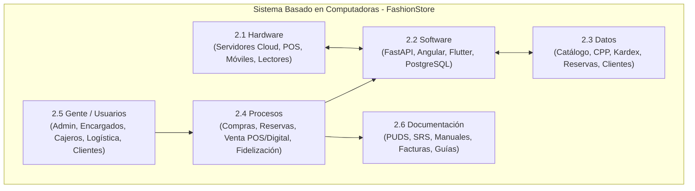

---

## 2.1 Hardware

El componente de hardware abarca la infraestructura física, dispositivos de procesamiento, periféricos y equipos de telecomunicaciones que sustentan la ejecución de las aplicaciones de FashionStore en sus tres entornos operativos: nube, sucursales físicas y dispositivos de usuarios finales.

### 2.1.1 Servidor

La arquitectura de servidores de FashionStore adopta un enfoque híbrido en la nube (*Cloud Computing PaaS/IaaS*), garantizando alta disponibilidad, escalabilidad elástica y tolerancia a fallos:

1. **Servidor de Producción Backend (FastAPI / ASGI):**
   * **Plataforma de Alojamiento:** Instancia en contenedor Linux gestionada en nube pública (*Render / Railway / AWS EC2*).
   * **Capacidad de Procesamiento:** 2 vCPU dedicadas (arquitectura x86_64), optimizadas para operaciones asíncronas de E/S de alta concurrencia mediante `asyncio`.
   * **Memoria Principal (RAM):** 4 GB a 8 GB DDR4 con soporte para asignación dinámica de memoria para workers de Uvicorn y Gunicorn.
   * **Almacenamiento Secundario:** 50 GB a 100 GB NVMe SSD con tasas de transferencia de lectura/escritura superiores a 2.500 MB/s para el sistema base, binarios y logs de rotación.
   * **Conectividad de Red:** Enlace simétrico de 1 Gbps con ancho de banda mensual no medido, dirección IPv4/IPv6 estática pública, y proxy inverso NGINX con terminación segura SSL/TLS 1.3 gestionada con certificados automáticos Let's Encrypt.

2. **Servidor de Base de Datos Dedicado (PostgreSQL 15+):**
   * **Alojamiento:** Instancia administrada en *Supabase Pro / AWS RDS PostgreSQL*.
   * **Capacidad:** 2 vCPU dedicadas, 4 GB de memoria RAM dedicada a pools de conexiones (`PgBouncer`), 20 GB de almacenamiento SSD transaccional con 3.000 IOPS garantizados.
   * **Mecanismos de Resiliencia:** Copias de seguridad automáticas diarias en caliente (*Point-in-Time Recovery - PITR*) con retención de 7 días y réplicas de solo lectura para consultas masivas de catálogo en temporadas altas.

3. **Almacenamiento de Objetos en la Nube (Object Storage):**
   * Repositorio de alta durabilidad (*AWS S3 / Cloudinary*) para persistencia de activos multimedia: fotografías de prendas en múltiples resoluciones, modelos tridimensionales (`.glb` / `.gltf`) para vestidores virtuales en Realidad Aumentada y comprobantes de facturación.

---

### 2.1.2 Cliente

Los dispositivos cliente corresponden a los terminales informáticos mediante los cuales los diferentes actores interactúan con la plataforma:

1. **Dispositivos Móviles de los Clientes (App Móvil Flutter):**
   * **Smartphones y Tablets compatibles:** Dispositivos móviles con arquitectura ARM64 de 64 bits ejecutando Android 8.0 (Oreo) o superior, e iOS 13.0 o superior.
   * **Memoria RAM:** Mínimo 3 GB de RAM (recomendado 4 GB a 8 GB para fluidez en la inicialización de motores de visión artificial y renderizado tridimensional).
   * **Sensores Críticos:** Cámara trasera y frontal de alta resolución (mínimo 12 MP), sensor de profundidad o acelerómetro y giroscopio calibrados, indispensables para el anclaje de planos y detección anatómica requerida por Google ARCore y Apple ARKit en el Vestidor Virtual de Realidad Aumentada.
   * **Conectividad:** Conexión a redes móviles 4G LTE / 5G o redes inalámbricas Wi-Fi 5/6 con acceso continuo a internet.

2. **Estaciones de Trabajo y Computadoras Personales (Navegadores Web):**
   * **Equipos de Clientes y Personal Administrativo:** Computadoras de escritorio o portátiles con procesadores Intel Core i3 / AMD Ryzen 3 o superiores, mínimo 4 GB de memoria RAM, y tarjetas gráficas integradas con soporte para aceleración por hardware WebGL.
   * **Pantallas:** Monitores con resolución mínima de 1366 × 768 píxeles (recomendado Full HD 1920 × 1080) con diseño completamente adaptativo (*responsive layout*).

3. **Terminales de Punto de Venta (POS) en Sucursales Físicas:**
   * **Computadoras de Caja:** Terminales All-in-One (*Todo en Uno*) o computadoras de escritorio compactas ubicadas en los mostradores de cobro de cada tienda física (Equipetrol, Calacoto, El Prado).
   * **Especificaciones:** Procesador Intel Core i5 de 10ª generación o superior, 8 GB de RAM, unidad SSD de 256 GB para arranque ultra-rápido, y puertos USB múltiples para periféricos especializados.

---

### 2.1.3 Otros Dispositivos

Para asegurar la sincronización en tiempo real de los procesos físicos en tienda con la plataforma digital, se integran los siguientes periféricos y equipos de red:

| Dispositivo | Tipo / Interfaz | Ubicación / Área | Función Operativa Principal |
|:---|:---:|:---:|:---|
| **Lectores de Códigos de Barras y Códigos QR** | Óptico 2D Láser / USB y Bluetooth | Puntos de Caja POS y Área de Probadores | Lectura instantánea de etiquetas SKU en prendas de vestir y escaneo de códigos QR de reservas presenciales presentados por el cliente desde su smartphone. |
| **Impresoras Térmicas de Tickets / Recibos** | Térmica Directa 80 mm / USB - Ethernet | Mostradores de Cobro POS | Emisión inmediata de comprobantes de venta física, facturas de caja y talones de reserva presencial con corte automático de papel (velocidad $\ge 200\text{ mm/s}$). |
| **Terminales de Pago Electrónico (POS Bancario Físico)** | POS Físico EMV / Contactless NFC / Wi-Fi | Mostradores de Caja | Procesamiento presencial de cobros mediante tarjetas de débito y crédito con verificación de PIN y soporte para pagos móviles por proximidad. |
| **Tablets de Asistencia en Probadores** | Tablet Android 10.5" / Wi-Fi Corporativo | Área de Probadores y Atención de Sucursal | Utilizadas por el Encargado de Sucursal para verificar la llegada de clientes con reserva, confirmar la preparación de prendas y reportar el estado de probadores. |
| **Rúteres y Conmutadores de Red Empresarial** | Wi-Fi 6 Gigabit / Dual Band (2.4 / 5 GHz) | Cada Sucursal Física | Enlace de datos seguro con segmentación de VLANs: una red aislada y cifrada para terminales POS e inventario, y una red Wi-Fi de cortesía para clientes en tienda. |
| **Cámaras de Seguridad IP y Control Perimétrico** | Cámaras Full HD PoE / Circuito Cerrado | Salas de Venta y Almacenes de Sucursal | Monitoreo visual de la mercadería, disuasión de pérdidas y supervisión de los flujos de clientes en probadores y cajas. |

---

## 2.2 Software

El ecosistema de software de FashionStore está concebido bajo principios de diseño moderno, desacoplamiento de capas, comunicación asíncrona no bloqueante y estándares abiertos.

### 2.2.1 Servidor

1. **Sistema Operativo Base:**
   * **Linux Ubuntu Server 22.04 LTS (Jammy Jellyfish):** Distribución de grado empresarial con kernel Linux 5.15/6.x de 64 bits, seleccionada por su extrema estabilidad, soporte de parches de seguridad a largo plazo y óptimo rendimiento en virtualización y contenedores.

2. **Servidor Web y Proxy Inverso:**
   * **NGINX versión 1.24+:** Encargado de la recepción de solicitudes HTTP/HTTPS, balanceo de carga, compresión en tránsito con algoritmos Gzip/Brotli, limitación de tasa (*Rate Limiting*) para mitigar ataques de fuerza bruta en autenticación, y serving estático de la SPA Angular.

3. **Servidor de Aplicaciones y Framework Backend:**
   * **Python 3.11+ / FastAPI 0.110+:** Framework asíncrono de alto rendimiento montado sobre la especificación ASGI (*Asynchronous Server Gateway Interface*).
   * **Servidor ASGI:** `Uvicorn` con worker loop `uvloop` (basado en `libuv`), capaz de despachar más de 15.000 solicitudes concurrentes por segundo con latencias inferiores a 10 milisegundos.
   * **Capa de Persistencia y ORM:** `SQLAlchemy 2.0` con driver asíncrono `asyncpg` y motor síncrono `psycopg2-binary`, garantizando transaccionalidad ACID y soporte dual con fallback local a `SQLite3`.
   * **Validación y Serialización:** `Pydantic v2` para validación estricta de esquemas de entrada/salida y contratos de datos fuertemente tipados.

4. **Sistema Gestor de Base de Datos Relacional (RDBMS):**
   * **PostgreSQL 15+:** Motor de datos principal de la organización, elegido por su madurez, conformidad estricta con estándares SQL, soporte nativo para campos semiestructurados `JSONB`, indexación GiST/GIN para búsquedas rápidas en catálogo y extensiones de seguridad.

5. **Servicios de Caché y Gestión Volátil:**
   * **Redis 7.x (en memoria):** Utilizado para almacenamiento transitorio de listas de exclusión de tokens JWT revocados (*Blacklist*), persistencia de carritos anónimos temporales y caché de consultas frecuentes de disponibilidad de stock.

---

### 2.2.2 Cliente

1. **Frontend Web (Plataforma E-Commerce y Panel Administrativo):**
   * **Angular 17+ / TypeScript:** Framework robusto para aplicaciones de página única (SPA), estructurado con componentes desacoplados, servicios inyectables reactivos apoyados en `RxJS`, enrutamiento modular y diseño visual Dark Glassmorphism responsivo ceñido a CSS3 Vanilla y FontAwesome 6.5.
   * **Compatibilidad de Navegadores:** Optimizado para Google Chrome 115+, Microsoft Edge, Mozilla Firefox 115+, Safari 16+ y navegadores móviles Chromium.

2. **Aplicación Móvil Multiplataforma (FashionStore App):**
   * **Flutter 3.22+ / Dart 3.4+:** Framework de desarrollo móvil compilado a código nativo de máquina (ARM64), garantizando tasas de refresco de 60 fps a 120 fps con el motor gráfico Impeller.
   * **Gestión de Estado y Arquitectura:** Arquitectura en capas limpia (*Clean Architecture*) con separación de dominio, datos y presentación, persistencia local con `flutter_secure_storage` y comunicación REST mediante cliente `dio` / `http`.

3. **Módulos Móviles Especializados:**
   * **Librerías de Realidad Aumentada:** Integración de plugins `ar_flutter_plugin` y `google_mlkit_pose_detection` para procesamiento de visión artificial y anclaje de mallas 3D sobre la silueta del cliente.
   * **Lector de Códigos y Voz:** Plugins `mobile_scanner` para lectura de códigos QR y `speech_to_text` para captura de comandos de voz en lenguaje natural.

---

### 2.2.3 Otro Software Adicional

| Categoría | Software / Servicio | Proveedor / Licencia | Finalidad en FashionStore |
|:---|:---|:---:|:---|
| **Seguridad Criptográfica** | `bcrypt` (factor de coste $\ge 12$) / `python-jose` | MIT / Apache 2.0 | Cifrado unidireccional no reversible de contraseñas de usuarios y firmado asimétrico de tokens web JSON (JWT HS256). |
| **Pasarela Nacional de Pagos** | Libélula Pay API | Propietaria (Bolivia) | Procesamiento de pagos en moneda nacional mediante Códigos QR Interoperables (Simple / BCB) y transferencias bancarias locales. |
| **Pasarelas Internacionales** | Stripe API & PayPal REST SDK | Propietaria / Sandbox | Pasarelas de cobro global con soporte de tokenización PCI-DSS compliant, verificación 3D Secure 2.0 y simulación de transacciones con tarjetas de prueba. |
| **Inteligencia Artificial Contextual** | OpenAI API (GPT-4o) / Google Gemini 1.5 Flash | REST API Cloud | Motor cognitivo para generación de recomendaciones de outfits personalizados, combinaciones cromáticas y procesamiento de consultas en lenguaje natural. |
| **Telemetría Meteorológica** | OpenWeatherMap API | REST API Cloud | Provisión de temperatura, sensación térmica y precipitaciones en tiempo real para las ciudades de Santa Cruz, La Paz y Cochabamba. |
| **Documentación de API** | OpenAPI 3.0 & Swagger UI | Integrado en FastAPI | Generación automatizada de esquemas interactivos de prueba para la totalidad de los endpoints REST en la ruta `/docs`. |
| **Monitoreo y Bitácoras** | `Loguru` / `Sentry SDK` | MIT / Open Source | Captura centralizada de logs estructurados de auditoría, trazabilidad de excepciones y alertas de seguridad en tiempo real. |

---

## 2.3 Datos

Los datos constituyen el activo transaccional y operativo más valioso de FashionStore. La información está modelada bajo estándares de normalización relacional (Tercera Forma Normal - 3FN), garantizando la integridad referencial, la no redundancia y el recálculo matemático estricto de costos.

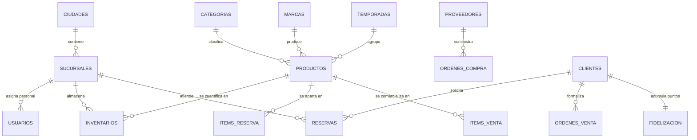

A nivel de dominio, el sistema gestiona las siguientes estructuras de datos clave:

1. **Datos de Estructura Geográfica y Sucursales:**
   * Ciudades de cobertura, códigos postales, sedes operativas, nombres de sucursales físicas, direcciones georreferenciadas con latitud y longitud decimal (GPS), horarios de atención diurna/nocturna y capacidad operativa de probadores concurrentes.
2. **Datos del Catálogo de Moda Masculina:**
   * Códigos SKU base universales, nombres de prendas, descripciones técnicas textiles (composición porcentual de algodón, lino, lana, poliéster), marcas, categorías jerárquicas, tallas normalizadas (S, M, L, XL, XXL, 38, 40, 42), colores estructurados con nombre comercial y código hexadecimal visual (`#HEX`), precios de venta al público y URLs de modelos 3D y galerías fotográficas.
3. **Datos de Temporadas y Campañas Comerciales:**
   * Identificador estacional, nombres de campaña (ej. *Primavera-Verano 2026*, *Línea Ejecutiva Otoño-Invierno*), fechas de inicio y cierre, estado estacional (Planificada, Vigente, Liquidación, Finalizada) y porcentaje sugerido de descuento para remate de temporada.
4. **Datos de Proveedores y Compras:**
   * Razón social, Número de Identificación Tributaria (NIT / CUIT), nombres de ejecutivos de contacto, teléfonos corporativos, correos electrónicos, condiciones de pago negociadas (Contado, Crédito a 30/60 días, Consignación) y registro de órdenes de abastecimiento.
5. **Datos de Inventarios y Valuación Contable (Kardex):**
   * Existencias físicas por sucursal, producto, talla y color; existencias reservadas temporalmente; stock mínimo de seguridad; último costo unitario de adquisición; y el **Costo Promedio Ponderado (CPP)** actualizado mediante asientos inmutables de entrada y salida.
6. **Datos de Reservas Presenciales:**
   * Códigos alfanuméricos de reserva únicos (ej. `RSV-2026-X8K`), sucursal de destino seleccionada, fecha y rango horario programado para la visita, código QR cifrado de validación, estados de ciclo de vida (Pendiente, Preparada en Probador, Cliente en Tienda, Venta Concretada, Cancelada, Expirada) y lista de prendas solicitadas.
7. **Datos de Ventas y Facturación:**
   * Órdenes de venta digitales y presenciales (POS), número de ticket o factura legal, cliente asociado o consumidor final, desglose de ítems comercializados, desglose de impuestos fiscales (IVA 13% e IT 3%), método de pago utilizado (Efectivo, Tarjeta, QR, Mixto), y montos de descuento por fidelización aplicados.
8. **Datos de Seguridad, Autenticación y Auditoría (RBAC):**
   * Credenciales de usuarios, roles jerárquicos tipados, hashes seguros de contraseñas (`bcrypt`), estado de la cuenta (Activa, Inactiva, Bloqueada por Intentos), tokens OTP temporizados de 6 dígitos con expiración, y bitácora de auditoría inmutable (usuario, fecha, IP, User-Agent, operación ejecutada).
9. **Datos de Fidelización y Gamificación:**
   * Puntos acumulados por transacciones, nivel jerárquico de membresía (Bronce, Plata, Oro, Diamante), insignias digitales obtenidas por hitos de compra, saldo histórico y registro de canjes por descuentos directos.

---

## 2.4 Procesos

Los procesos constituyen la secuencia ordenada de actividades lógicas, transaccionales y de control que transforman las solicitudes de los usuarios en resultados comerciales efectivos dentro de FashionStore. 

Los macroprocesos principales del negocio corresponden a:


1. **Proceso de Abastecimiento y Valuación por Costo Promedio Ponderado:**
   * Generación y aprobación de órdenes de compra a proveedores textiles.
   * Recepción física y control de calidad de lotes de prendas en la bodega de sucursal.
   * Registro del costo unitario del lote adquirido e incorporación de costos de flete/aranceles.
   * Recálculo matemático inmediato del Costo Promedio Ponderado (CPP) mediante la ecuación contable oficial:
     $$\text{CPP}_{\text{nuevo}} = \frac{(S_{\text{actual}} \times \text{CPP}_{\text{actual}}) + (Q_{\text{entrada}} \times C_{\text{unitario}})}{S_{\text{actual}} + Q_{\text{entrada}}}$$
   * Generación automática del asiento inmutable en el libro Kardex de existencias.

2. **Proceso de Reserva Omnicanal y Prueba Presencial en Probadores:**
   * Exploración del catálogo desde la app móvil o web y selección de prendas, tallas y colores.
   * Selección de la sucursal de preferencia física y programación de fecha/hora de visita.
   * Verificación atómica de disponibilidad y bloqueo temporal de las existencias para evitar ventas cruzadas.
   * Generación del comprobante digital con código QR de reserva.
   * Notificación en tiempo real al Encargado de Sucursal para el apartado físico y preparación de prendas en el probador asignado.
   * Recepción del cliente en tienda, escaneo del QR, prueba física y transición hacia venta o retorno al stock.

3. **Proceso de Venta Presencial en Punto de Venta (POS):**
   * Escaneo de códigos de barra SKU de las prendas elegidas por el cliente en mostrador.
   * Conversión opcional e inmediata de una reserva presencial previa a venta definitiva.
   * Selección de método de cobro: efectivo con cálculo automático de cambio, cobro electrónico con tarjeta mediante terminal física, o generación de Código QR dinámico en pantalla.
   * Emisión del comprobante fiscal de venta e impresión de ticket térmico.
   * Descuento automático del stock en tiempo real y asignación de puntos de fidelización al cliente.

4. **Proceso de Venta Digital y Checkout con Pasarela de Pagos:**
   * Agregación de prendas al carrito de compras sincronizado entre web y móvil.
   * Selección de la modalidad de entrega: Retiro gratuito en sucursal (*Click & Collect*) o envío a domicilio (*Delivery*).
   * Tarificación dinámica del costo de envío según distancia geodésica (fórmula Haversine) y peso volumétrico.
   * Procesamiento de la transacción mediante pasarela de pago en modo Sandbox (Stripe / PayPal) con validación 3D Secure.
   * Confirmación del pago, generación de orden de despacho y notificación al cliente vía correo electrónico.

5. **Proceso de Experiencia Inteligente (Vestidor Virtual RA + Asistente IA):**
   * Activación de la cámara del teléfono móvil desde la ficha de producto en Flutter.
   * Detección de silueta anatómica y superposición del modelo 3D de la prenda con textura en tiempo real.
   * Consulta al Asistente de Estilo con IA: análisis de coordenadas de geolocalización, consulta al API meteorológico de temperatura local, análisis del historial de compras y colorimetría del cliente para sugerir combinaciones óptimas de ropa masculina.

6. **Proceso de Fidelización Gamificada y Retención de Clientes:**
   * Acumulación de 1 punto por cada 10 Bolivianos pagados en compras efectivas.
   * Evaluación periódica de acumulación de puntos para ascenso automático de nivel (Bronce $
ightarrow$ Plata $
ightarrow$ Oro $
ightarrow$ Diamante).
   * Concesión de insignias digitales por hitos comerciales y canje de puntos por cupones de descuento directo en el checkout.

---

## 2.5 Gente / Usuario

El factor humano es el componente central que dinamiza el sistema. FashionStore clasifica a sus usuarios en roles claramente segregados bajo el esquema de Control de Acceso Basado en Roles (RBAC):

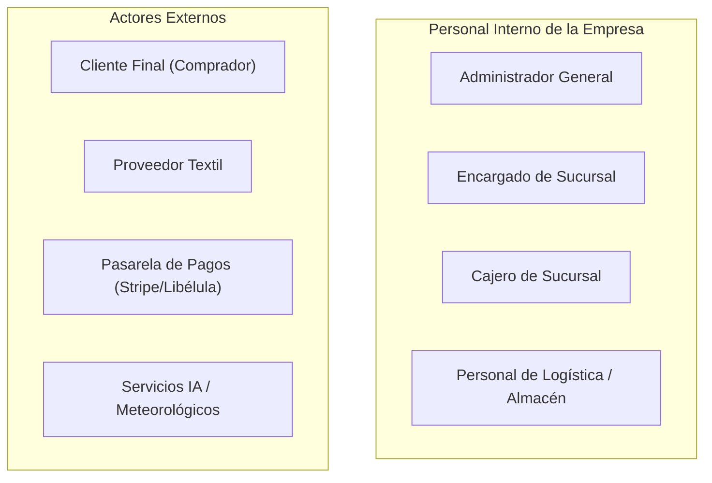

### 1. Actores Internos

* **Administrador General:**
  * Responsable supremo de la gobernanza informática y comercial de la cadena.
  * Funciones: Alta y baja de usuarios empleados, asignación granular de roles RBAC, desbloqueo administrativo de cuentas bloqueadas por intentos fallidos, configuración de ciudades y sucursales físicas, parametrización de categorías de moda, supervisión de auditorías y análisis de métricas en dashboards ejecutivos.
* **Encargado de Sucursal:**
  * Máxima autoridad operativa dentro de una tienda física determinada (ej. Equipetrol).
  * Funciones: Monitoreo del panel de reservas presenciales asignadas a su tienda, supervisión del apartado físico de prendas en probadores, confirmación de llegada del cliente mediante escaneo de código QR, reporte de mermas o prendas dañadas, recepción de transferencias inter-sucursales y arqueo de inventario local.
* **Cajero de Sucursal:**
  * Operador responsable del punto de cobro físico en mostrador.
  * Funciones: Autenticación segura en el módulo POS, búsqueda rápida de productos por código SKU, escaneo de prendas, cobro en efectivo con cálculo de cambio, procesamiento de cobros con tarjeta y QR, emisión de comprobantes fiscales y cierre de turno de caja diario.
* **Personal de Logística y Almacén:**
  * Encargados de la recepción de mercadería y despacho de órdenes.
  * Funciones: Verificación física de lotes remitidos por proveedores textiles, registro riguroso de costos unitarios de compra para el recálculo del CPP, empaque y etiquetado de pedidos digitales con despacho a domicilio, y coordinación con repartidores de delivery.

### 2. Actores Externos

* **Cliente (Consumidor Masculino):**
  * Usuario final de la plataforma web y aplicación móvil.
  * Funciones: Auto-registro de cuenta con validación de identidad, inicio de sesión seguro, exploración y filtrado del catálogo, uso del vestidor virtual en Realidad Aumentada, solicitud de reservas presenciales en sucursales, compras digitales con pasarela de pagos, acumulación de puntos de fidelización y consulta interactiva con el Asistente de Estilo por IA.
* **Proveedores Textiles:**
  * Empresas fabricantes o distribuidoras de indumentaria que abastecen a la cadena.
  * Funciones: Consulta de órdenes de compra emitidas a su nombre, despacho de lotes de mercadería y coordinación de plazos de entrega y términos de crédito comercial.

---

## 2.6 Documento

La dimensión documental asegura la formalidad legal, contable, técnica y operativa de la plataforma. FashionStore clasifica sus documentos en tres categorías esenciales:

### 1. Documentos Metodológicos y de Ingeniería de Software

* **Documento de Especificación de Requisitos de Software (SRS):** Documento formal ceñido al estándar IEEE 830 que delimita los 38 requisitos funcionales y 11 requisitos no funcionales del sistema.
* **Documento de Arquitectura de Software (SAD):** Descripción integral de la arquitectura lógica en 4 capas y física (diagrama de despliegue) bajo el estándar 4+1 vistas de Philippe Kruchten.
* **Modelo Oficial en Enterprise Architect (`diagramas1erParcial.eapx`):** Repositorio formal de diagramas UML 2.5+ que almacena los modelos de casos de uso, comunicación, clases de análisis, secuencia, estados, tiempos y despliegue.

### 2. Documentos Operativos, Comerciales y Tributarios

* **Comprobante Digital de Reserva Presencial:** Ticket electrónico emitido al cliente con código alfanumérico único, código QR bidimensional, fecha, hora límite de validez, prendas seleccionadas y dirección de la sucursal.
* **Factura Comercial y Nota de Venta (POS / Digital):** Documento fiscal con validez legal según la normativa del Servicio de Impuestos Nacionales (SIN) de Bolivia, con discriminación explícita del 13% de Crédito/Débito Fiscal (IVA) y 3% de Impuesto a las Transacciones (IT).
* **Ficha de Movimiento de Kardex Físico y Valorado:** Asiento contable inmutable generado tras cada transacción de compra o venta, certificando la cantidad física restante y el valor monetario del inventario según Costo Promedio Ponderado.
* **Orden de Compra y Acta de Recepción a Proveedores:** Contrato comercial formal que especifica cantidades, tallas, colores, costo unitario acordado, plazos de entrega y firma de conformidad de recepción en almacén.
* **Guía de Despacho y Hoja de Ruta de Delivery:** Documento de entrega para repartidores urbanos conteniendo coordenadas de destino, tarifa de transporte, nombre de cliente y espacio para firma o código OTP de confirmación de recepción.

### 3. Manuales de Usuario y Operación

* **Guía Oficial de Ejecución del Sistema ([INSTRUCCIONES_EJECUCION.md](file:///c:/Users/User/Documents/2-2026/SI2/1erPARCIAL/INSTRUCCIONES_EJECUCION.md)):** Manual técnico con instrucciones paso a paso para la instalación de dependencias, migración de base de datos, ejecución del backend FastAPI, cliente web y app móvil Flutter.
* **Manual de Procedimientos de Caja POS:** Guía operativa para cajeros detallando apertura de caja, transacciones mixtas, devoluciones y cierre de turno.
* **Manual de Procedimientos de Sucursal:** Protocolo para encargados de tienda sobre la atención protocolar de clientes con reserva previa y gestión de probadores.

---

# 3) Tecnología para el Desarrollo del Software

La selección tecnológica de FashionStore responde a un análisis exhaustivo de rendimiento, compatibilidad, madurez de la comunidad y adecuación estricta a los requerimientos de la cátedra de Sistemas de Información II.

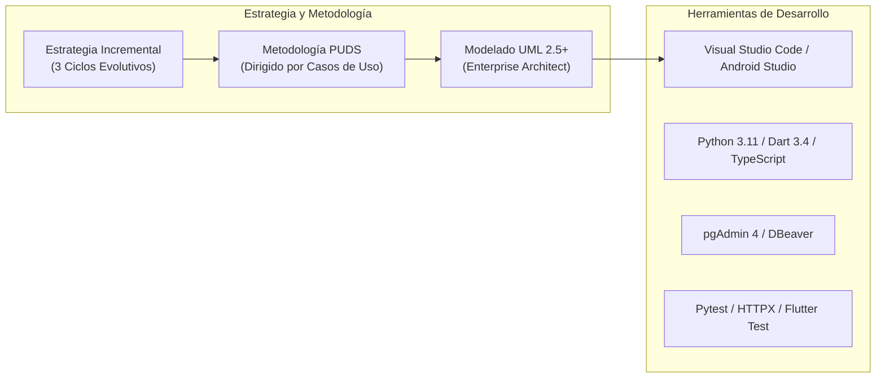

---

## 3.1 Estrategia para el Desarrollo del Software

La estrategia de ingeniería adoptada para el proyecto se fundamenta en un **enfoque evolutivo, iterativo e incremental basado en arquitectura de microservicios desacoplados**:

1. **Desacoplamiento Estricto entre Backend y Frontends:**
   * El núcleo transaccional reside en un backend monolítico modular desarrollado en FastAPI que expone servicios exclusivamente a través de una API REST protegida con tokens JWT.
   * Esto permite que el Frontend Web (Angular) y la Aplicación Móvil (Flutter) consuman exactamente la misma lógica de negocio y esquemas de datos, evitando duplicidad de reglas de validación y facilitando pruebas automatizadas independientes.

2. **Desarrollo Dirigido por Casos de Uso (*Use-Case Driven*):**
   * Cada caso de uso identificado se convierte en el eje vertebral que guía la especificación formal, el modelado dinámico (diagramas de comunicación y secuencia), el diseño de clases Boundary-Control-Entity (BCE), la implementación del endpoint REST y su respectivo caso de prueba de caja negra automatizado con Pytest.

3. **Arquitectura Centrada en la Mitigación Temprana de Riesgos:**
   * Durante el Ciclo 1 (Fundamentos) se resolvieron y probaron los componentes de mayor riesgo arquitectónico: la concurrencia en la autenticación RBAC, el bloqueo de cuentas, y la precisión matemática del recálculo de Costo Promedio Ponderado en inventario.
   * Con ello, los ciclos posteriores (transacciones de venta y diferenciadores de Realidad Aumentada / IA) se construyen sobre una base sólida y libre de deuda técnica.

4. **Integración y Despliegue Continuo (CI/CD) en la Nube:**
   * Se descarta el paradigma de "desarrollo local hasta el final". Desde la primera semana, el backend y los frontends se desplegaron en infraestructura cloud accesible mediante URL pública y código QR, satisfaciendo el requerimiento de no operar en `localhost`.

---

## 3.2 Metodología para el Desarrollo del Software

El proyecto adopta formalmente el **Proceso Unificado de Desarrollo de Software (PUDS)** modelado rigurosamente mediante el lenguaje estándar **UML 2.5+**.

### 3.2.1 Características del PUDS

El PUDS es un proceso de ingeniería de software disciplinado que se caracteriza por tres pilares conceptuales inseparables:

1. **Dirigido por Casos de Uso (*Use-Case Driven*):**
   * Los casos de uso no son meros artefactos de captura de requisitos, sino que actúan como la fuerza motriz de todo el ciclo de vida. Definen qué debe hacer el sistema desde la perspectiva del actor externo, guían el diseño de las clases de análisis y diseño, determinan la estructura de paquetes y proporcionan la base directa para los casos de prueba de aceptación.
2. **Centrado en la Arquitectura (*Architecture-Centric*):**
   * La arquitectura del sistema encarna las decisiones de diseño más trascendentales: la organización en subsistemas y capas, la selección de plataformas y protocolos de comunicación, y los mecanismos de persistencia. El PUDS exige concebir, validar y estabilizar la línea base de la arquitectura durante las fases tempranas para evitar refactorizaciones costosas.
3. **Iterativo e Incremental (*Iterative and Incremental*):**
   * El ciclo de desarrollo se divide en un conjunto de proyectos más pequeños denominados iteraciones. Cada iteración aborda un subconjunto crítico de casos de uso y culmina con la entrega de un producto ejecutable probado (*release interno o externo*). Con cada iteración sucesiva, el software se incrementa modularmente hasta alcanzar la totalidad del alcance.

**Fases del Ciclo de Vida PUDS en FashionStore:**
* **Fase de Inicio (Inception):** Delimitación de la visión del negocio, justificación económica, identificación de actores principales y especificación del 80% de los casos de uso a nivel general.
* **Fase de Elaboración (Elaboration):** Análisis profundo de casos de uso arquitectónicamente significativos, diseño de la arquitectura en 4 capas, diseño de base de datos relacional y estabilización de la plataforma de desarrollo (Ciclo 1).
* **Fase de Construcción (Construction):** Implementación de la totalidad de módulos transaccionales (ventas, reservas, POS, pasarelas) y diferenciadores (RA, IA, gamificación) con pruebas de regresión continuas (Ciclos 2 y 3).
* **Fase de Transición (Transition):** Despliegue productivo final en la nube, optimización de latencias, auditoría de seguridad y capacitación a usuarios para la defensa final del software.

---

### 3.2.2 Características Principales de UML 2.5+

El **Lenguaje de Modelado Unificado (UML versión 2.5+)** es el estándar de modelado visual adoptado para especificar, visualizar, construir y documentar todos los artefactos de FashionStore:

1. **Notación Estandarizada y Semántica Precisa:**
   * Proporciona un vocabulario gráfico universal que elimina ambigüedades interpretativas entre analistas, arquitectos de software, desarrolladores y evaluadores académicos.
2. **Dualidad de Modelado (Estructural y Dinámico):**
   * **Perspectiva Estructural (Aspecto Estático):** Representa los bloques constitutivos del sistema mediante Diagramas de Casos de Uso (con relaciones `<<include>>`, `<<extend>>` y generalización), Diagramas de Clases de Análisis (Boundary, Control, Entity), Diagramas de Paquetes con justificación de acoplamiento/cohesión, Diagramas de Componentes y Diagramas de Despliegue Físico.
   * **Perspectiva de Comportamiento (Aspecto Dinámico):** Modela la ejecución temporal y el intercambio de mensajes mediante Diagramas de Actividades con carriles (*swimlanes*), Diagramas de Interacción (Comunicación, Secuencia Transaccional y Diagramas de Tiempo) y Diagramas de Máquinas de Estado para el ciclo de vida de entidades.
3. **Trazabilidad de Ingeniería de Software:**
   * Cada elemento de software en el código fuente de FastAPI (`app/modules/...`) o Flutter tiene un mapeo bidireccional exacto con una clase, paquete o nodo modelado en Enterprise Architect.

---

## 3.3 Herramientas de Desarrollo

### 3.3.1 Software

| Herramienta | Tipo / Licencia | Versión | Rol en el Ciclo de Desarrollo |
|:---|:---:|:---:|:---|
| **Visual Studio Code** | IDE / MIT | 1.88+ | Entorno de desarrollo principal para el backend FastAPI y frontend web, equipado con extensiones Pylance, Ruff, Angular Language Service, GitLens y Markdown All in One. |
| **Android Studio / Flutter SDK** | IDE / Apache 2.0 | Hedgehog / 3.22+ | Entorno para la compilación, depuración en caliente (*Hot Reload*), análisis estático y perfilado de rendimiento de la app móvil Flutter en emuladores y dispositivos físicos. |
| **Enterprise Architect** | Modelado CASE / Propietaria | 16.1+ | Herramienta formal de modelado UML 2.5+ utilizada para la construcción integral de diagramas y generación programática automatizada mediante scripts COM en Python. |
| **PostgreSQL & DBeaver Community** | RDBMS / Gestor DB (GPL) | 15+ / 24.0+ | Sistema de base de datos relacional y cliente de administración gráfica para modelado ER, ejecución de scripts DDL/DML y optimización de planes de ejecución `EXPLAIN ANALYZE`. |
| **Git & GitHub** | Control de Versiones / Cloud | 2.44+ | Gestión de código fuente con estrategia de ramificación estructurada (*main*, *develop*, *feature/*), control de versiones y auditoría de commits por desarrollador. |
| **Pytest & HTTPX** | Framework de Pruebas / MIT | 8.1+ / 0.27+ | Suite de testing automatizado para ejecución de pruebas de caja negra, validación de contratos JSON, pruebas de autenticación RBAC y recálculo de costos CPP. |
| **Postman / Swagger UI** | Cliente API / Propietario | 10.24+ | Inspección manual de endpoints, validación de cabeceras de autorización Bearer JWT y pruebas de estrés de llamadas REST. |

---

### 3.3.2 Hardware de los Desarrolladores

El desarrollo, compilación y pruebas del sistema se ejecutaron sobre las siguientes estaciones de trabajo de alta gama pertenecientes a los integrantes del equipo:

| Componente de Hardware | Estación de Desarrollo 1 (Alberto Delgado) | Estación de Desarrollo 2 (Andy Mujica) | Justificación de Capacidad Técnica |
|:---|:---|:---|:---|
| **Procesador (CPU)** | AMD Ryzen 7 5800H (8 núcleos / 16 hilos @ 3.2 GHz - 4.4 GHz Turbo) | Intel Core i7-12700H (14 núcleos / 20 hilos @ 2.3 GHz - 4.7 GHz Turbo) | Capacidad de compilación multi-hilo en segundo plano de Flutter y ejecución concurrente de servidores FastAPI y emuladores Android. |
| **Memoria RAM** | 16 GB DDR4 Dual Channel @ 3200 MHz | 32 GB DDR5 Dual Channel @ 4800 MHz | Soporte holgado para entornos de virtualización, contenedores Docker, IDEs pesados y navegadores con herramientas de inspección abiertas. |
| **Almacenamiento** | 1 TB NVMe M.2 SSD PCIe 3.0 (Lectura 3.200 MB/s) | 1 TB NVMe M.2 SSD PCIe 4.0 (Lectura 5.000 MB/s) | Tiempos de carga y guardado instantáneos para bases de datos de prueba, paquetes de Flutter y dependencias de Python. |
| **Unidad Gráfica (GPU)** | NVIDIA GeForce RTX 3060 Laptop (6 GB GDDR6) | NVIDIA GeForce RTX 4060 Laptop (8 GB GDDR6) | Aceleración gráfica por hardware para modelado de assets tridimensionales y renderizado fluido en simuladores de Realidad Aumentada. |
| **Pantalla / Visualización** | 15.6" Full HD (1920 × 1080) @ 144 Hz IPS | 16.0" WQXGA (2560 × 1600) @ 165 Hz IPS | Espacio visual suficiente para programación en pantalla dividida (código fuente backend/frontend y modelos UML). |
| **Conexión a Internet** | Fibra Óptica Simétrica 150 Mbps (Wi-Fi 6) | Fibra Óptica Simétrica 200 Mbps (Ethernet Gigabit) | Subida ultra-rápida de imágenes Docker, despliegue continuo en la nube y consumo de APIs de IA sin latencia. |
| **Dispositivos Móviles Físicos** | Xiaomi Redmi Note 12 Pro+ (8 GB RAM, Android 13, ARCore compatible) | Samsung Galaxy S22 (8 GB RAM, Android 14, ARCore oficial) | Dispositivos físicos reales para pruebas de visión artificial, seguimiento de silueta en vestidor virtual y lectura óptica de códigos QR. |

---

# 4) Factibilidad Económica y Costos del Proyecto

El análisis de factibilidad económica evalúa la viabilidad financiera del desarrollo, despliegue y mantenimiento de FashionStore en el mercado real de Bolivia, contrastando la inversión de capital requerida frente a los beneficios monetarios y operacionales proyectados a tres años.

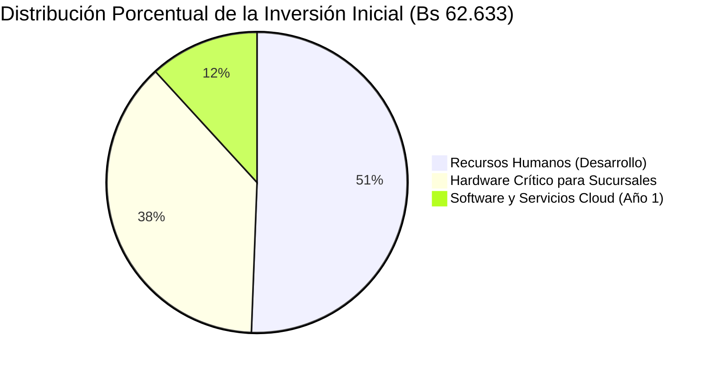

---

## 4.1 Análisis de Costos de Desarrollo (Inversión Inicial)

La inversión inicial total requerida para poner en funcionamiento el sistema en una cadena de 3 sucursales urbanas piloto (Santa Cruz de la Sierra, La Paz y Cochabamba) se divide en tres partidas presupuestarias: Recursos Humanos, Hardware Crítico y Software/Servicios Cloud.

### 4.1.1 Recursos Humanos

El costo de personal se calcula en función de horas-hombre invertidas durante las cuatro semanas del ciclo de vida del proyecto por perfiles profesionales de ingeniería:

| Nro. | Rol Profesional | Especialista Asignado | Horas Totales | Tarifa Horaria (Bs) | Tarifa Horaria (USD) | Costo Subtotal (Bs) | Costo Subtotal (USD) |
|:---:|:---|:---|:---:|:---:|:---:|:---:|:---:|
| 1 | **Arquitecto de Software & Backend Lead** | Alberto Delgado | 160 hrs | 80.00 Bs | 11.59 USD | 12.800,00 Bs | 1.855,07 USD |
| 2 | **Desarrollador Frontend & Móvil Lead** | Andy Mujica | 160 hrs | 80.00 Bs | 11.59 USD | 12.800,00 Bs | 1.855,07 USD |
| 3 | **Diseñador UX/UI & Especialista en Modelos 3D RA** | Consultoría Externa | 60 hrs | 60.00 Bs | 8.70 USD | 3.600,00 Bs | 521,74 USD |
| 4 | **Ingeniero de Calidad y Pruebas (QA / Testing)** | Equipo Interno | 50 hrs | 50.00 Bs | 7.25 USD | 2.500,00 Bs | 362,32 USD |
| **TOTAL** | **Recursos Humanos de Desarrollo** | — | **430 hrs** | — | — | **31.700,00 Bs** | **4.594,20 USD** |

> **Nota Cambiaria:** Se utiliza la cotización oficial de referencia de 1 USD = 6.90 Bolivianos (Bs).

---

### 4.1.2 Hardware Crítico para Operación

Comprende el equipamiento informático indispensable que debe adquirirse para equipar las tres sucursales piloto de la cadena física:

| Ítem | Descripción del Equipamiento | Cantidad | Costo Unitario (Bs) | Costo Subtotal (Bs) | Costo Subtotal (USD) |
|:---:|:---|:---:|:---:|:---:|:---:|
| 1 | **Terminales POS Todo en Uno (All-in-One):** Pantalla táctil 15.6", Intel Core i5, 8 GB RAM, 256 GB SSD para punto de caja. | 3 unidades | 4.500,00 Bs | 13.500,00 Bs | 1.956,52 USD |
| 2 | **Lectores Ópticos 2D Omnidireccionales:** Escáneres de códigos de barras y códigos QR USB/Bluetooth de alta velocidad. | 3 unidades | 450,00 Bs | 1.350,00 Bs | 195,65 USD |
| 3 | **Impresoras Térmicas de Tickets POS:** Impresoras térmicas de 80 mm con corte automático y puerto Ethernet. | 3 unidades | 700,00 Bs | 2.100,00 Bs | 304,35 USD |
| 4 | **Tablets de Asistencia en Probadores:** Tablets Android 10.5" para gestión de reservas presenciales en sala de ventas. | 3 unidades | 1.400,00 Bs | 4.200,00 Bs | 608,70 USD |
| 5 | **Equipos de Red y Rúteres Gigabit Wi-Fi 6:** Rúteres corporativos con gestión de VLANs para conexión segura de cajas. | 3 unidades | 800,00 Bs | 2.400,00 Bs | 347,83 USD |
| **TOTAL** | **Hardware Crítico en Sucursales** | — | — | **23.550,00 Bs** | **3.413,05 USD** |

---

### 4.1.3 Software y Servicios Cloud (Año 1)

Costos de suscripción a plataformas en la nube, dominios, certificados y consumo de APIs de servicios externos proyectados para los primeros 12 meses de operación:

| Servicio / Proveedor | Modalidad / Plan | Costo Mensual (USD) | Costo Anual (USD) | Costo Anual (Bs) |
|:---|:---|:---:|:---:|:---:|
| **Servidor de Producción Backend (Railway / Render):** Instancia con 2 vCPU y 4 GB RAM en contenedores. | Mensual recurrente | 25.00 USD | 300.00 USD | 2.070,00 Bs |
| **Base de Datos Gestionada PostgreSQL (Supabase Pro):** Instancia dedicada con backups automáticos y PITR. | Mensual recurrente | 25.00 USD | 300.00 USD | 2.070,00 Bs |
| **Almacenamiento de Multimedia y Modelos 3D (AWS S3 / Cloudinary):** Capacidad de 100 GB y CDN global. | Mensual recurrente | 15.00 USD | 180.00 USD | 1.242,00 Bs |
| **Consumo de APIs de Inteligencia Artificial (OpenAI / Gemini):** Cuota mensual estimada de 500.000 tokens. | Mensual por uso | 20.00 USD | 240.00 USD | 1.656,00 Bs |
| **API Meteorológica (OpenWeatherMap):** Plan gratuito de 1.000 llamadas/día (suficiente para sucursales piloto). | Plan Free | 0.00 USD | 0.00 USD | 0,00 Bs |
| **Dominio Web Corporativo (`fashionstore.bo` / `.com`):** Registro anual y gestión DNS administrada. | Pago anual | — | 50.00 USD | 345,00 Bs |
| **Certificados de Seguridad SSL/TLS Wildcard:** Certificados emitidos vía Let's Encrypt con auto-renovación. | Open Source | 0.00 USD | 0.00 USD | 0,00 Bs |
| **TOTAL** | **Software y Servicios Cloud (Año 1)** | — | **1.070,00 USD** | **7.383,00 Bs** |

---

### Consolidación de la Inversión Inicial

| Partida Presupuestaria | Monto en Bolivianos (Bs) | Monto en Dólares (USD) | Porcentaje (%) |
|:---|:---:|:---:|:---:|
| **Recursos Humanos de Desarrollo** | 31.700,00 Bs | 4.594,20 USD | 50.61% |
| **Hardware Crítico en Sucursales** | 23.550,00 Bs | 3.413,05 USD | 37.60% |
| **Software y Servicios Cloud (Año 1)** | 7.383,00 Bs | 1.070,00 USD | 11.79% |
| **INVERSIÓN INICIAL TOTAL** | **62.633,00 Bs** | **9.077,25 USD** | **100.00%** |

---

## 4.2 Análisis de Beneficios e Impacto Financiero

Para determinar la rentabilidad de la inversión, se proyectaron los flujos de caja netos a tres años considerando un crecimiento anual sostenido del 15% en ventas y un costo de capital (*tasa de descuento - WACC*) del 12% anual:

| Indicador Financiero | Valor Calculado | Criterio de Decisión | Diagnóstico de Factibilidad |
|:---|:---:|:---:|:---|
| **Valor Actual Neto (VAN a 3 años)** | **+314.850,00 Bs** ($45.630\text{ USD}$) | $\text{VAN} > 0$ | **Altamente Favorable:** El proyecto genera un valor económico sustancialmente superior al capital invertido. |
| **Tasa Interna de Retorno (TIR)** | **48.25%** | $\text{TIR} > 12\%\text{ (Tasa de Corte)}$ | **Excelente Rentabilidad:** La tasa interna de rentabilidad supera en más de cuatro veces el costo de oportunidad financiero. |
| **Periodo de Recuperación de Inversión (Payback)** | **7.8 meses** | $\text{Payback} < 12\text{ meses}$ | **Rápida Amortización:** El capital invertido se recupera íntegramente antes de culminar el octavo mes de operación comercial. |
| **Relación Beneficio / Costo (B/C)** | **2.85** | $\text{B/C} > 1.0$ | Por cada Boliviano invertido en la plataforma, la empresa recupera el boliviano y obtiene 1.85 Bs adicionales de beneficio neto. |

---

## 4.3 Beneficios Tangibles (Ahorro Anual Proyectado)

Los beneficios tangibles corresponden a ingresos incrementales directos y reducciones comprobables en los costos operativos de la cadena minorista:

1. **Reducción Drástica de Devoluciones Digitales vía Vestidor Virtual RA:**
   * La tasa histórica de devolución en compras de ropa masculina en línea ronda el 30%. Con la verificación anatómica tridimensional en la app Flutter, la tasa de devolución proyectada cae al 8%.
   * **Ahorro Anual Estimado:** **38.000,00 Bs/año** (ahorro directo en fletes de logística inversa, reempaque y costos de oportunidad de mercadería inmovilizada).
2. **Eliminación de Quiebres de Stock por Sincronización Multi-Sucursal:**
   * La visibilidad en tiempo real de existencias evita la pérdida de clientes en tienda física, permitiendo derivaciones inmediatas o despachos desde otra sucursal.
   * **Recuperación de Ventas Estimada:** **55.000,00 Bs/año**.
3. **Optimización de Compras por Valuación Matemática en CPP:**
   * La sustitución del empirismo contable por el cálculo exacto del Costo Promedio Ponderado previene compras a sobreprecio y sobrestock de temporadas fenecidas.
   * **Ahorro Anual Estimado:** **28.000,00 Bs/año**.
4. **Incremento del Ticket Promedio por Asistente de IA y Comparador de Outfits:**
   * Las recomendaciones contextuales de atuendos completos (camisa + pantalón + blazer + accesorio) elevan el valor de compra por cliente en un 18%.
   * **Ingresos Adicionales Anuales:** **72.000,00 Bs/año**.
5. **Ahorro de Horas-Hombre por Automatización de Reservas Presenciales:**
   * Disminución del 45% en el tiempo que los vendedores de piso dedican a buscar prendas en bodegas desordenadas.
   * **Ahorro Operativo Anual:** **16.000,00 Bs/año**.
* **BENEFICIO TANGIBLE TOTAL ANUAL:** **209.000,00 Bs/año (~30.289,85 USD/año)**.

---

## 4.4 Beneficios Intangibles

Los beneficios intangibles representan ventajas estratégicas y competitivas que, si bien son difíciles de cuantificar en un balance contable inmediato, consolidan la supervivencia y liderazgo de FashionStore:

* **Posicionamiento Vanguardista de Marca:** FashionStore se posiciona como la primera tienda de moda masculina en el mercado nacional en introducir probadores en Realidad Aumentada e Inteligencia Artificial contextual, atrayendo al segmento de consumidores masculinos jóvenes y profesionales de mayor poder adquisitivo.
* **Elevación del Índice de Fidelidad y Satisfacción (NPS):** La eliminación de la fricción dimensional en la elección de tallas genera una experiencia de compra gratificante, proyectando un *Net Promoter Score* (NPS) superior a 85 puntos.
* **Gobierno de Datos y Toma de Decisiones Basada en Evidencia:** Los administradores disponen de cuadros de mando consolidados en tiempo real, eliminando decisiones basadas en intuición respecto a qué colecciones producir, rotar o liquidar.
* **Resiliencia Operativa y Reducción del Estrés Laboral:** El flujo programado de reservas distribuye la afluencia de clientes de manera homogénea a lo largo del día, descongestionando los probadores en horas pico y mejorando el clima laboral del personal de tienda.

---

## 4.5 Beneficios Esperados

### 4.5.1 Beneficios Operacionales y de Gestión (Procesos en Sucursales y Tiendas)
* **Sincronización Total de Existencias:** Erradicación del fenómeno de sobreventa (*overselling*) gracias a transacciones atómicas que descuentan el inventario instantáneamente en compras web, móviles o cajas POS.
* **Apartado Físico Previo:** El personal de probadores prepara y plancha las prendas reservadas con antelación, logrando que la atención presencial del cliente sea inmediata al momento de su llegada.
* **Kardex Inmutable y Transparente:** Generación automática del historial de movimientos físicos y valorados de cada producto, facilitando auditorías contables internas y fiscales.

### 4.5.2 Beneficios Estratégicos y de Inteligencia de Negocios
* **Predicción Dinámica de la Demanda:** Capacidad para correlacionar variables climáticas de cada ciudad con las tendencias de compra semanal, permitiendo redistribuir existencias antes de que ocurran quiebres o sobrestocks estacionales.
* **Segmentación de Clientes por Valor de Vida (*CLV*):** Identificación automática de compradores recurrentes para canalizar promociones personalizadas de alta conversión.

### 4.5.3 Beneficios para el Capital Humano y de Seguridad
* **Segregación Estricta de Funciones (RBAC):** Garantía de que los cajeros solo operen la caja asignada, los encargados supervisen su tienda local y los administradores gestionen políticas globales, previniendo fraudes internos.
* **Bloqueo Preventivo y Auditoría Continua:** Blindaje contra intrusiones no autorizadas mediante bloqueo por intentos fallidos y bitácoras de auditoría forense con dirección IP y timestamp.

### 4.5.4 Beneficios de Escalado Tecnológico
* **Escalabilidad Horizontal Económica:** Posibilidad de abrir nuevas sucursales físicas en ciudades como Tarija, Sucre u Oruro simplemente registrando las coordenadas y capacidades en el sistema, sin requerir cambios de software ni licencias adicionales.
* **Interoperabilidad Futura:** Arquitectura modular con API REST documentada que facilita la integración futura de casilleros inteligentes (*smart lockers*) para recojo automatizado o ventas a través de asistentes conversacionales en WhatsApp.


# Parte I - Fundamentación Teórica

## a) Comercio Electrónico (E-commerce)

### Conceptos Generales, Modelos de Negocio y Evolución
El comercio electrónico comprende la compra, venta, comercialización y distribución de bienes, servicios e información a través de redes telemáticas e internet. A lo largo de las últimas dos décadas, ha evolucionado desde los primeros catálogos estáticos en la web 1.0 hasta ecosistemas omnicanales hiperpersonalizados impulsados por inteligencia artificial y computación en la nube.

Dentro de los modelos de negocio tradicionales se distinguen:
- **B2C (Business-to-Consumer)**: Modelo en el cual una empresa comercializa bienes directamente al consumidor individual final. Es el modelo rector de FashionStore.
- **B2B (Business-to-Business)**: Transacciones comerciales entre empresas (ej. compras masivas de FashionStore a sus proveedores textiles).
- **C2C (Consumer-to-Consumer)**: Transacciones entre usuarios particulares mediadas por una plataforma (ej. mercados de subastas o segunda mano).
- **Omnicanalidad (Omnichannel Retail)**: Evolución del modelo tradicional multicanal que unifica de forma transparente la experiencia de compra en tiendas físicas, aplicaciones móviles, plataformas web y redes sociales, compartiendo una base de datos centralizada de inventario, clientes y precios.

---

### Análisis Comparativo como Usuario: Amazon, Alibaba y Shopify

| Dimensión de Análisis | Amazon | Alibaba | Shopify |
|:---|:---|:---|:---|
| **Modelo Principal** | B2C y Marketplace Global directo. | B2B internacional (Alibaba.com) y B2C/C2C (AliExpress/Taobao). | Plataforma SaaS que faculta a marcas independientes para operar sus propias tiendas D2C (Direct-to-Consumer). |
| **Experiencia de Navegación y Búsqueda** | Buscador predictivo extremadamente potente, filtros ultra-específicos, opiniones verificadas y algoritmo de sugerencias A9/Rufus. | Orientado a compras mayoristas: búsqueda por cotizaciones, pedido mínimo (MOQ), especificaciones de fábrica y muestras. | Depende del diseño de la marca particular; navegación limpia, minimalista y centrada en la identidad visual de la tienda. |
| **Experiencia en el Carrito y Checkout** | Compra en 1-Clic (*1-Click Checkout*), almacenamiento seguro de múltiples tarjetas y domicilios, envío Prime en 24h. | Negociación directa con proveedores (Trade Assurance), pago por cartas de crédito, transferencias bancarias o tarjetas. | Flujo ultra-optimizado mediante **Shop Pay**, permitiendo checkout en 1 paso con código SMS a nivel global. |
| **Políticas de Devolución y Post-Venta** | Política sumamente favorable al usuario con devoluciones automáticas en puntos de acopio sin costo adicional. | Mediación de disputas complejas; las devoluciones físicas internacionales suelen ser lentas y costosas. | Cada comerciante define sus propias políticas de garantía y devolución según su logística particular. |

---

### Análisis Comparativo como Desarrollador: Magento, PrestaShop y WooCommerce

Conforme a los requerimientos de la cátedra, a continuación se analizan las principales plataformas de software libre y código abierto utilizadas en la industria para implementar tiendas en línea:

| Dimensión Técnica | Magento (Adobe Commerce) | PrestaShop | WooCommerce |
|:---|:---|:---|:---|
| **Propósito y Alcance** | Plataforma empresarial de gran escala diseñada para multinacionales con catálogos masivos y alta concurrencia. | Solución intermedia orientada a pequeñas y medianas empresas (PyMEs) con catálogos medianos. | Plugin de comercio electrónico de código abierto desarrollado para transformar sitios WordPress en tiendas en línea. |
| **Arquitectura de Software** | Arquitectura modular altamente desacoplada en capas, basada en PHP y el framework Zend/Laminas. Soporta microservicios y GraphQL. | Basado en PHP bajo el framework Symfony; arquitectura clásica de componentes y módulos controladores. | Arquitectura basada en los hooks, actions y filters del núcleo de WordPress sobre PHP y MySQL. |
| **Ventajas Principales** | Escalabilidad extrema, gestión multi-tienda nativa, multi-moneda, soporte de inventarios multi-sucursal sumamente robusto. | Fácil de administrar para usuarios no técnicos, consumo moderado de recursos en servidor, amplio catálogo de módulos. | Despliegue sumamente veloz, costo de desarrollo inicial muy reducido, millones de temas y plugins compatibles en el ecosistema WordPress. |
| **Desventajas y Complejidad** | Curva de aprendizaje muy elevada, requiere servidores dedicados de alto rendimiento (mínimo 8GB RAM, Elasticsearch obligatorio). | Dependencia excesiva de módulos comerciales de pago para funciones clave; migraciones de versiones propensas a errores. | Pierde rendimiento y estabilidad ante bases de datos masivas (más de 20,000 productos o transacciones concurrentes intensas). |
| **Base de Datos** | MySQL / MariaDB (con tablas EAV - Entity Attribute Value que aumentan la complejidad relacional). | MySQL / MariaDB (diseño relacional clásico normalizado). | MySQL / MariaDB (utiliza las tablas `wp_posts` y `wp_postmeta`, lo que genera cuellos de botella en consultas complejas). |

> [!NOTE]
> **Conclusión para FashionStore:** Aunque estas plataformas ofrecen soluciones prefabricadas, la cátedra prohíbe explícitamente su empleo para garantizar que los estudiantes dominen el diseño desde las bases arquitectónicas mediante FastAPI, Angular, Flutter y PostgreSQL.

---

## b) Pasarelas de Pago

### Mecanismos de Pago en Línea
El comercio digital moderno exige la coexistencia de múltiples mecanismos transaccionales que equilibren conveniencia para el comprador y seguridad contra fraudes:
1. **Tarjetas de Débito y Crédito**: Siguen siendo el medio de mayor volumen global. La transacción involucra una cadena de actores: el cliente (tarjetahabiente), el banco emisor (*Issuing Bank*), la pasarela de pago (*Payment Gateway*), la red adquirente (Visa, Mastercard) y el banco receptor del comercio (*Acquiring Bank*). El estándar de seguridad internacional **PCI-DSS (Payment Card Industry Data Security Standard)** prohíbe taxativamente que los comercios almacenen el código CVV o el número de tarjeta (PAN) en texto plano, obligando a implementar procesos de **tokenización**.
2. **Códigos QR Interoperables (QR Simple / BCB)**: En el contexto boliviano, el Código QR se ha consolidado como el medio de pago electrónico más popular debido a su inmediatez y costo cero de comisiones directas al usuario. Opera bajo transferencias interbancarias automáticas coordinadas por la Cámara de Compensación y Liquidación (ACH).
3. **Transferencias Bancarias Tradicionales**: Mecanismo asíncrono donde el cliente transfiere fondos desde su banca móvil y remite una constancia física o digital al comercio para su posterior validación manual o conciliación vía API bancaria.

---

### Pasarela Nacional: LIBÉLULA
**Libélula** es una pasarela de pagos tecnológica boliviana desarrollada para resolver las complejidades del comercio electrónico local. 
- **Modo de Operación**: Actúa como un concentrador de pagos unificado, integrando en una sola API cobros mediante Códigos QR generados dinámicamente, tarjetas de débito/crédito locales e internacionales, billeteras móviles (Tigo Money) y cobranzas presenciales en redes de cobranza física (Farmacias, supermercados afiliados).
- **Integración Técnica**: Libélula proporciona un entorno de integración mediante APIs REST y bibliotecas cliente. Cuando una orden se genera en el e-commerce, el backend invoca el endpoint de Libélula transmitiendo monto, detalle y cliente; Libélula responde con un enlace a su pasarela segura o devuelve un código QR dinámico con vencimiento programado (ej. 15 minutos).
- **Confirmación por Webhooks**: Una vez que el tarjetahabiente o usuario escanea y confirma el pago en su aplicación bancaria, los servidores de Libélula emiten una petición HTTP POST asíncrona (*Webhook*) hacia el endpoint configurado en el backend de FashionStore, notificando el éxito de la transacción para que el sistema actualice el estado de la venta y descuente el inventario de manera atómica.

---

### Pasarelas Internacionales: STRIPE y PAYPAL
- **STRIPE**: Considerada el estándar de facto para desarrolladores de software a nivel global.
  * *Entorno Sandbox*: Ofrece un entorno de pruebas completo con números de tarjeta simulados para verificar casos de éxito, fondos insuficientes, tarjetas vencidas o validaciones de autenticación reforzada 3D Secure (SCA).
  * *Tokenización mediante Stripe Elements*: El formulario de tarjeta se renderiza dentro de un iframe seguro alojado en los servidores de Stripe. El backend del e-commerce nunca toca ni procesa los dígitos de la tarjeta; solo recibe un `payment_method_id` seguro.
  * *Manejo de Webhooks*: Stripe notifica eventos como `payment_intent.succeeded` o `payment_intent.payment_failed` mediante llamadas criptográficamente firmadas con un secreto compartido (*Webhook Secret*).
- **PAYPAL**: Pionero de los pagos electrónicos en internet.
  * *Entorno Sandbox*: Plataforma de desarrolladores que permite crear cuentas ficticias de compradores y vendedores con saldos virtuales para pruebas de checkout.
  * *Flujo de Integración*: Permite integrar botones inteligentes de pago (*PayPal Smart Payment Buttons*). El usuario es redirigido a una ventana emergente de PayPal donde autoriza la transacción con su saldo o tarjeta vinculada, y el flujo retorna al e-commerce mediante endpoints de captura (*capture payment*).

---

## c) Servicios de Delivery y Logística de Última Milla

### Operación del Delivery en Aplicaciones Urbanas (Yaigo, Yummy, PedidosYa)
La logística de última milla representa el eslabón final y más sensible del comercio digital. Plataformas como Yaigo, Yummy y PedidosYa operan bajo un modelo de economía colaborativa triangulada:
1. **El Comercio (FashionStore)**: Recibe la orden de compra digital, la valida y empaqueta las prendas en la sucursal física asignada para el despacho.
2. **El Repartidor / Conductor**: Recibe una notificación en su aplicación móvil con los datos de recolección en tienda y destino final del cliente, aceptando el viaje en función de su cercanía.
3. **El Cliente Final**: Visualiza en tiempo real sobre un mapa la localización geográfica del repartidor mediante GPS y recibe un código OTP de seguridad para validar la entrega física del paquete.

---

### Algoritmos y Variables de Cálculo de Tarifas de Envío
Para determinar el costo exacto del servicio de entrega a domicilio, los sistemas logísticos no aplican valores fijos, sino que emplean funciones matemáticas basadas en las siguientes variables clave:

1. **Distancia Geodésica ($D$)**: Calculada a partir de las coordenadas de latitud y longitud de la sucursal de despacho $(\phi_1, \lambda_1)$ y del domicilio del cliente $(\phi_2, \lambda_2)$ mediante la **Fórmula de Haversine**:
   $$\Delta \phi = \phi_2 - \phi_1, \quad \Delta \lambda = \lambda_2 - \lambda_1$$
   $$a = \sin^2\left(\frac{\Delta \phi}{2}\right) + \cos(\phi_1)\cos(\phi_2)\sin^2\left(\frac{\Delta \lambda}{2}\right)$$
   $$c = 2 \cdot \text{atan2}\left(\sqrt{a}, \sqrt{1-a}\right), \quad D = R \cdot c \quad (R = 6371\text{ km})$$

2. **Peso Volumétrico ($P_v$)**: En la industria textil y de paquetería, prendas voluminosas (como abrigos pesados o parkas) ocupan espacio crítico en los vehículos de reparto aunque su peso real en kilogramos sea bajo. Se aplica el estándar IATA:
   $$P_v = \frac{\text{Largo (cm)} \times \text{Ancho (cm)} \times \text{Alto (cm)}}{5000}$$
   El peso facturable ($P_f$) corresponde al mayor valor entre el peso físico real ($P_r$) y el peso volumétrico ($P_v$):
   $$P_f = \max(P_r, P_v)$$

3. **Fórmula General de Tarificación Logística**:
   $$\text{Tarifa Final} = T_{\text{base}} + (D \times C_{\text{km}}) + (P_f \times C_{\text{peso}}) \times F_{\text{zona}} \times F_{\text{demanda}}$$
   Donde:
   - $T_{\text{base}}$: Tarifa base fija de arranque (ej. 10.00 Bs).
   - $C_{\text{km}}$: Costo por kilómetro recorrido (ej. 2.50 Bs/km).
   - $C_{\text{peso}}$: Recargo por kilogramo excedente (ej. 1.50 Bs/kg si $P_f > 2\text{ kg}$).
   - $F_{\text{zona}}$: Factor multiplicador según dificultad de acceso del cuadrante urbano (1.0 a 1.3).
   - $F_{\text{demanda}}$: Tarifa dinámica por condiciones meteorológicas adversas (lluvia) u horarios pico de congestión vehicular.

---

## d) Proceso Unificado de Desarrollo de Software (PUDS)

El PUDS (o RUP - *Rational Unified Process*) es un marco de trabajo de ingeniería de software disciplinado, estandarizado y ampliamente adoptado en la industria para el desarrollo de sistemas orientados a objetos.

### Características Esenciales
1. **Dirigido por Casos de Uso (*Use-Case Driven*)**: Los casos de uso son los artefactos primarios que guían todo el proceso de desarrollo. Definen el comportamiento esperado del sistema desde la óptica de los actores externos y sirven como hilo conductor transversal para el análisis, el diseño arquitectónico, la codificación en los controladores y la generación de casos de prueba.
2. **Centrado en la Arquitectura (*Architecture-Centric*)**: Establece tempranamente una arquitectura base sólida y extensible. Considera las diferentes vistas arquitectónicas (Vista Lógica, Vista de Implementación, Vista de Procesos, Vista de Despliegue y Vista de Casos de Uso — el modelo 4+1 vistas de Kruchten).
3. **Iterativo e Incremental (*Iterative and Incremental*)**: El proyecto se divide en ciclos o iteraciones temporales manejables. Cada iteración aborda un conjunto priorizado de casos de uso y culmina con una versión ejecutable y verificable del software desplegada en un entorno real.

---

### Fases del Ciclo de Vida PUDS
- **Fase de Inicio (*Inception*)**: Delimitación del alcance del proyecto, identificación de los actores principales, modelado de negocio preliminar, formulación de objetivos y viabilidad económica/técnica.
- **Fase de Elaboración (*Elaboration*)**: Mitigación de los principales riesgos técnicos, refinamiento de los casos de uso críticos, diseño de la arquitectura base del sistema y especificación del modelo de datos.
- **Fase de Construcción (*Construction*)**: Desarrollo masivo de los componentes de software, integración de módulos, codificación y pruebas unitarias de los requerimientos funcionales restantes.
- **Fase de Transición (*Transition*)**: Despliegue en el entorno productivo de nube, pruebas de aceptación con usuarios finales, capacitación y ajustes post-lanzamiento.

---

### Flujos de Trabajo Fundamentales (Disiplinas)
1. **Captura de Requisitos**: Identificación, estructuración y especificación detallada de Casos de Uso y Actores, diagramas con relaciones `<<include>>`, `<<extend>>` y prototipado de interfaces.
2. **Análisis**: Transformación de los requisitos en una estructura conceptual del sistema (clases de análisis: Interfaz, Control y Entidad).
3. **Diseño**: Definición de la arquitectura física (Despliegue) y lógica (Capas), diseño de interacción (Secuencia y Comunicación), diseño de comportamiento (Estados y Tiempo), diseño de navegación y diseño de base de datos relacional.
4. **Implementación**: Selección de plataforma y traducción del diseño en código ejecutable organizado en paquetes y microservicios.
5. **Pruebas**: Verificación funcional mediante pruebas de caja negra, pruebas de casos de uso e historias de usuario para garantizar la calidad del software.

---

## e) Lenguaje de Modelado Unificado (UML 2.5+)

UML es el lenguaje estándar adoptado por la OMG (*Object Management Group*) para visualizar, especificar, construir y documentar los artefactos de un sistema de software con enfoque orientado a objetos.

### Taxonomía de Diagramas en UML 2.5+
UML 2.5+ clasifica sus diagramas en dos grandes vertientes complementarias:

```
UML 2.5+
│
├── 1. Aspecto Estructural (Modelos Estáticos)
│   ├── Diagrama de Clases
│   ├── Diagrama de Paquetes
│   ├── Diagrama de Despliegue
│   ├── Diagrama de Componentes
│   ├── Diagrama de Objetos
│   └── Diagrama de Estructura Compuesta
│
└── 2. Aspecto Dinámico / Comportamiento (Modelos de Proceso e Interacción)
    ├── Diagrama de Actividad (Modelo de Negocio / Flujos de Trabajo)
    ├── Diagrama de Casos de Uso
    ├── Diagrama de Máquinas de Estado
    └── Diagramas de Interacción:
        ├── Diagrama de Secuencia
        ├── Diagrama de Comunicación
        ├── Diagrama de Tiempo
        └── Diagrama Global de Interacción
```

- **Diagrama de Actividad**: Es el artefacto principal para modelar el **Modelo de Negocio** y la lógica procedimental de los casos de uso. Representa flujos de control paso a paso, bifurcaciones de decisión, uniones y actividades concurrentes organizadas mediante **particiones o calles (*swimlanes*)** que identifican con precisión al actor responsable de cada acción.
- **Diagrama de Casos de Uso**: Representa los límites del sistema y la interacción funcional entre actores externos y servicios del software.
- **Diagrama de Secuencia y Comunicación**: Diagramas de interacción que enfatizan el orden cronológico del paso de mensajes entre objetos (Secuencia) o la organización estructural de los objetos colaboradores (Comunicación).
- **Diagrama de Despliegue**: Modela la topología física del hardware, nodos de ejecución en la nube, servidores web, servidores de bases de datos y los enlaces de red telemáticos que los interconectan.

---

# Modelado de Negocio (Business Modeling - Diagramas de Actividades de Macroprocesos)

## 2.1 Justificación del Modelo de Negocio en el PUDS

En la ingeniería de software profesional guiada por el PUDS, **antes de formular los requisitos de un sistema informático es imperativo comprender a cabalidad cómo opera el negocio en el mundo real**. Como enfatiza la cátedra en sus notas de clase (C6, B4), un desarrollador no puede programar un software a la medida de una organización si desconoce los flujos de trabajo, las responsabilidades de los empleados, los procedimientos de compra a proveedores, la mecánica contable del inventario y la interacción del cliente en las tiendas.

El **Modelo de Negocio** utiliza los **Diagramas de Actividad UML con calles/particiones (swimlanes)** para modelar los procesos operacionales de la empresa. Cada calle representa un actor o trabajador del negocio (Cliente, Encargado de Sucursal, Cajero, Almacén/Logística, Sistema Automatizado/Pasarela), permitiendo visualizar con absoluta claridad la secuencia de actividades, decisiones, bifurcaciones y el flujo de información que genera valor económico en la cadena de moda masculina FashionStore.

A continuación se presentan los diagramas de actividad UML correspondientes a los **seis macroprocesos de negocio medulares** de FashionStore:

---

## 2.2 Macroproceso 1: Gestión de Abastecimiento y Recepción con Costo Promedio Ponderado

Este proceso describe el ciclo mediante el cual la empresa adquiere lotes de prendas a proveedores por temporada comercial, recepciona la mercadería físicamente en sucursal o almacén central, y actualiza el inventario calculando matemáticamente el Costo Promedio Ponderado ($CPP$) y registrando el Último Costo Unitario.

```mermaid
stateDiagram-v2
    direction TB

    state "Personal de Logística / Almacén" as LaneLogistica {
        [*] --> IdentificarNecesidad: Analiza umbrales mínimos de stock por temporada
        IdentificarNecesidad --> EmitirOrdenCompra: Genera Orden de Compra formal al Proveedor
        state RecibirMercaderia as "Recepciona lote físico de prendas en almacén"
        state CotejarGuia as "¿La mercadería física coincide con factura y orden?"
        state RechazarLote as "Rechaza lote y emite reclamo de no conformidad"
        state RegistrarIngreso as "Registra ingreso formal de prendas en el sistema"
    }

    state "Proveedor" as LaneProveedor {
        EmitirOrdenCompra --> PrepararDespacho: Procesa orden y alista prendas
        PrepararDespacho --> EnviarLote: Despacha lote con Guía de Remisión y Factura
        EnviarLote --> RecibirMercaderia
    }

    state "Sistema FashionStore" as LaneSistema {
        RegistrarIngreso --> GuardarUltimoCosto: Almacena Último Costo Unitario del lote
        GuardarUltimoCosto --> CalcularCPP: Recalcula Costo Promedio Ponderado: (StockAnt*CPPAnt + Cant*Costo)/(StockTotal)
        CalcularCPP --> ActualizarKardex: Registra movimiento de entrada en Kardex de inventario
        ActualizarKardex --> IncrementarStock: Incrementa stock físico disponible por sucursal, talla y color
        IncrementarStock --> NotificarExito: Emite confirmación de inventario actualizado
    }

    CotejarGuia --> RechazarLote: No coincide / Defectuoso
    CotejarGuia --> RegistrarIngreso: Mercadería Conforme
    RecibirMercaderia --> CotejarGuia
    RechazarLote --> [*]
    NotificarExito --> [*]
```

---

## 2.3 Macroproceso 2: Reserva Omnicanal y Prueba Presencial en Sucursal

Modela el flujo mediante el cual un cliente explora el catálogo desde su móvil o web, reserva varias prendas en una sucursal física, el encargado de tienda prepara los probadores con anticipación, y el cliente acude a probarse las prendas para decidir su compra.

```mermaid
stateDiagram-v2
    direction TB

    state "Cliente" as LaneClienteReserva {
        [*] --> ExplorarCatalogo: Consulta catálogo y filtra por sucursal
        ExplorarCatalogo --> SeleccionarPrendas: Selecciona prendas (tallas y colores)
        SeleccionarPrendas --> SolicitarReserva: Elige sucursal física, fecha y hora de visita
        state AcudirTienda as "Acude a la sucursal en horario programado"
        state ProbarsePrendas as "Se prueba las prendas en el vestidor asignado"
        state DecisionCompra as "¿Desea comprar alguna de las prendas probadas?"
    }

    state "Sistema FashionStore" as LaneSistemaReserva {
        SolicitarReserva --> BloquearStockTemp: Bloquea stock temporalmente como 'Reservado'
        BloquearStockTemp --> GenerarTicketQR: Genera comprobante digital de reserva con código QR
        GenerarTicketQR --> AlertarSucursal: Notifica al panel del encargado de sucursal
        state VerificarQR as "Escanea código QR de la reserva y confirma asistencia"
        state LiberarNoCompradas as "Libera al stock disponible las prendas descartadas"
    }

    state "Encargado de Sucursal" as LaneEncargadoReserva {
        AlertarSucursal --> SepararPrendas: Retira prendas de perchas y las plancha
        SepararPrendas --> AsignarProbador: Dispone prendas en probador exclusivo para el cliente
        AsignarProbador --> EsperarCliente: Queda a la espera de la llegada del cliente
        EsperarCliente --> AcudirTienda
        AcudirTienda --> VerificarQR
        VerificarQR --> ProbarsePrendas
    }

    ProbarsePrendas --> DecisionCompra
    DecisionCompra --> IrCaja: Sí (Lleva prendas seleccionadas)
    DecisionCompra --> DevolverTodo: No (Descarta todas las prendas)
    DevolverTodo --> LiberarNoCompradas
    IrCaja --> LiberarNoCompradas
    LiberarNoCompradas --> [*]
```

---

## 2.4 Macroproceso 3: Venta Presencial en Punto de Venta (POS)

Modela el proceso transaccional en la caja registradora de la sucursal física, ya sea proveniente de una reserva presencial previa o de una compra directa de mostrador.

```mermaid
stateDiagram-v2
    direction TB

    state "Cajero de Sucursal" as LaneCajero {
        [*] --> IniciarVentaPOS: Abre nueva transacción en el sistema POS
        state EscanearItems as "Escanea código de barras o ingresa código de reserva"
        state SolicitarCliente as "¿Cliente solicita factura o acumulación de puntos?"
        state IdentificarCliente as "Ingresa CI / NIT y correo del cliente"
        state SeleccionarMedioCobro as "Selecciona método de cobro (Efectivo, Tarjeta, QR)"
        state ProcesarCobroFisico as "Recibe efectivo o desliza tarjeta en terminal bancario"
        state EntregarTicket as "Imprime comprobante fiscal y entrega prendas embolsadas"
    }

    state "Cliente" as LaneClientePOS {
        IniciarVentaPOS --> PresentarPrendas: Presenta prendas en mostrador de caja
        PresentarPrendas --> EscanearItems
        SolicitarCliente --> IdentificarCliente: Proporciona datos personales / CI
        SolicitarCliente --> VentaSinNombre: Indica 'Sin Nombre / Consumidor Final'
        SeleccionarMedioCobro --> RealizarPago: Efectúa el pago según modalidad elegida
        RealizarPago --> ProcesarCobroFisico
        EntregarTicket --> RecibirBolsa: Recibe compra y comprobante
    }

    state "Sistema FashionStore POS" as LaneSistemaPOS {
        EscanearItems --> SolicitarCliente
        VentaSinNombre --> SeleccionarMedioCobro
        IdentificarCliente --> SeleccionarMedioCobro
        ProcesarCobroFisico --> ValidarTransaccion: Confirma recepción satisfactoria del importe
        ValidarTransaccion --> DescontarStockPOS: Descuenta definitivamente el stock físico en sucursal
        DescontarStockPOS --> AsignarPuntosFidelidad: Asigna puntos de fidelización a la cuenta del cliente
        AsignarPuntosFidelidad --> GenerarComprobante: Genera comprobante fiscal de venta
        GenerarComprobante --> EntregarTicket
    }

    RecibirBolsa --> [*]
```

---

## 2.5 Macroproceso 4: Venta Digital y Despacho con Pasarela de Pago

Modela el flujo completo del comercio electrónico web y móvil, desde el carrito de compras, el procesamiento seguro con la pasarela de pagos, hasta la logística de despacho y entrega a domicilio.

```mermaid
stateDiagram-v2
    direction TB

    state "Cliente Digital" as LaneClienteOnline {
        [*] --> AgregarCarrito: Agrega prendas al carrito desde web o app móvil
        AgregarCarrito --> IniciarCheckout: Procede al checkout e ingresa domicilio de entrega
        state SeleccionarPago as "Selecciona pagar con Tarjeta (Stripe) o PayPal"
        state IngresarDatosTarjeta as "Ingresa datos en formulario seguro tokenizado"
        state RecibirPaquete as "Recibe paquete en domicilio y entrega código de confirmación"
    }

    state "Sistema FashionStore Web/App" as LaneSistemaOnline {
        IniciarCheckout --> CalcularTarifaEnvio: Calcula tarifa de delivery por Haversine y peso volumétrico
        CalcularTarifaEnvio --> SeleccionarPago
        IngresarDatosTarjeta --> EnviarTokenPasarela: Envía token de cobro a la pasarela de pago
        state RecibirWebhook as "Recibe evento Webhook de pago aprobado"
        state CrearOrdenVenta as "Crea Orden de Venta formal y descuenta stock en sucursal origen"
        state DespacharRepartidor as "Asigna pedido al servicio de delivery de última milla"
    }

    state "Pasarela Externa (Stripe / PayPal)" as LanePasarela {
        EnviarTokenPasarela --> ValidarFondos: Valida saldo y ejecuta verificación 3D Secure
        ValidarFondos --> EmitirResultado: Genera confirmación de cobro y emite Webhook HTTP POST
        EmitirResultado --> RecibirWebhook
    }

    state "Empresa de Delivery" as LaneDelivery {
        DespacharRepartidor --> RecolectarPaquete: Recolecta paquete empaquetado en la sucursal
        RecolectarPaquete --> TransportarDomicilio: Traslada pedido en motocicleta / vehículo
        TransportarDomicilio --> RecibirPaquete
        RecibirPaquete --> ConfirmarEntrega: Registra entrega completada en el sistema móvil
    }

    ConfirmarEntrega --> [*]
```

---

## 2.6 Macroproceso 5: Experiencia Inteligente (Vestidor Virtual RA + Asistente IA)

Modela la interacción diferenciadora del usuario al emplear la Realidad Aumentada para probarse prendas virtualmente y consultar sugerencias de atuendos contextualizados al clima local.

```mermaid
stateDiagram-v2
    direction TB

    state "Cliente Móvil" as LaneClienteIA {
        [*] --> AbrirAppMovil: Inicia aplicación móvil FashionStore
        state SeleccionarPrendaRA as "Selecciona prenda y presiona 'Vestidor Virtual RA'"
        state ActivarCamara as "Apunta la cámara de su teléfono hacia su cuerpo"
        state InteractuarRA as "Observa la prenda 3D proyectada y cambia de color/talla"
        state ConsultarAsistente as "Presiona botón de voz o texto: '¿Qué me recomiendas hoy?'"
        state RecibirOutfitIA as "Visualiza outfit recomendado adaptado al clima y colorimetría"
        state CompararOutfits as "Envía prendas al Comparador de Outfits lado a lado"
    }

    state "Módulo de Realidad Aumentada" as LaneModuloRA {
        ActivarCamara --> DetectarSilueta: Detecta proporciones anatómicas (ARCore / ML Kit)
        DetectarSilueta --> RenderizarModelo3D: Renderiza malla 3D de la prenda sobre el torso del cliente
        RenderizarModelo3D --> InteractuarRA
        InteractuarRA --> ConsultarAsistente
    }

    state "Asistente IA Contextual" as LaneMotorIA {
        ConsultarAsistente --> ConsultarClimaAPI: Invoca API de OpenWeatherMap con coordenadas del cliente
        ConsultarClimaAPI --> AnalizarHistorial: Recupera historial de compras y paleta cromática del usuario
        AnalizarHistorial --> GenerarPromptContextual: Sintetiza: Clima + Ocasión + Stock Disponible
        GenerarPromptContextual --> LlamarModeloIA: Realiza inferencia cognitiva (OpenAI / Gemini)
        LlamarModeloIA --> RecibirOutfitIA
    }

    state "Comparador de Outfits" as LaneComparador {
        RecibirOutfitIA --> CompararOutfits
        CompararOutfits --> EvaluarOpciones: Contrasta hasta 3 combinaciones con precios y estilos
        EvaluarOpciones --> ReservarOComprar: Selecciona el outfit preferido para compra o reserva
    }

    AbrirAppMovil --> SeleccionarPrendaRA
    SeleccionarPrendaRA --> ActivarCamara
    ReservarOComprar --> [*]
```

---

## 2.7 Macroproceso 6: Programa de Fidelización Gamificado

Modela el ciclo de fidelización y retención de clientes mediante gamificación: acumulación de puntos en cada compra, progresión a través de niveles jerárquicos (Bronce, Plata, Oro, Diamante), desbloqueo de insignias y canje de beneficios en dinero real.

```mermaid
stateDiagram-v2
    direction TB

    state "Cliente Registrado" as LaneClienteFiel {
        [*] --> FormalizarCompra: Concreta compra presencial o digital en FashionStore
        state NotificacionPuntos as "Recibe notificación: '+150 Puntos acumulados en tu cuenta'"
        state ConsultarDashboardFiel as "Accede a 'Mi Perfil de Fidelización' en web o app móvil"
        state EvaluarAscenso as "¿Alcanzó el puntaje requerido para el siguiente nivel?"
        state RedimirPuntos as "Aplica puntos acumulados como descuento en el checkout"
    }

    state "Motor de Gamificación FashionStore" as LaneMotorGamif {
        FormalizarCompra --> CalcularPuntosTransaccion: Calcula: Puntos = MontoPagado * FactorConversion
        CalcularPuntosTransaccion --> AcreditarPuntos: Acredita puntos a la cuenta del cliente
        AcreditarPuntos --> NotificacionPuntos
        NotificacionPuntos --> ConsultarDashboardFiel
        ConsultarDashboardFiel --> EvaluarAscenso
        EvaluarAscenso --> PromoverNivel: Sí (Promueve a nivel Plata, Oro o Diamante)
        EvaluarAscenso --> MantenerNivel: No (Muestra barra de progreso restante)
        PromoverNivel --> AsignarBeneficios: Desbloquea porcentaje de descuento permanente e insignia digital
        AsignarBeneficios --> RedimirPuntos
        MantenerNivel --> RedimirPuntos
        RedimirPuntos --> AplicarDescuentoVenta: Descuenta saldo canjeado del total de la nueva compra
        AplicarDescuentoVenta --> ActualizarSaldoPuntos: Resta los puntos canjeados del saldo disponible
    }

    ActualizarSaldoPuntos --> [*]
```


---

# Parte II - Proceso de Desarrollo (Ciclo 1: Fundamentos y Módulos Base)

En estricta conformidad con el marco de trabajo del **Proceso Unificado de Desarrollo de Software (PUDS)** y las directrices metodológicas de la cátedra de Sistemas de Información II, el desarrollo del sistema se ejecuta a través de sus cinco disciplinas fundamentales: **Captura de Requisitos, Análisis, Diseño, Implementación y Pruebas**.

Para este **Ciclo 1 (Iteración 1)**, el equipo de desarrollo (integrado por **Alberto Delgado** y **Andy Mujica**) aborda el núcleo arquitectónico y funcional del sistema: autenticación robusta mediante RBAC, auto-registro de clientes, recuperación autoservicio de contraseñas mediante tokens OTP, administración integral de usuarios y roles, administración geográfica y operativa de sucursales, catálogo especializado de indumentaria masculina con atributos multivaluados (tallas y colores normalizados con código Hex), gestión de temporadas comerciales, administración de proveedores, control de inventario con **Costo Unitario y Costo Promedio Ponderado ($CPP$)**, y consulta omnicanal del catálogo digital.

---

## 1. Flujo de Trabajo: Captura de Requisitos

### 1.1 Identificación de Casos de Uso y Actores

En el marco metodológico del **Proceso Unificado de Desarrollo de Software (PUDS)** y la especificación estándar **UML 2.5+**, un **Actor** representa un rol coherente que un usuario humano, un dispositivo de hardware o un sistema computacional externo desempeña al interactuar directamente con el software bajo desarrollo. Los actores residen conceptualmente fuera de la frontera (*boundary*) del sistema y desencadenan o participan en los flujos de eventos descritos por los casos de uso.

A continuación, se define la taxonomía completa de los **actores internos y externos** que interactúan en el ecosistema omnicanal de **FashionStore**, acompañada de su caracterización y responsabilidades:

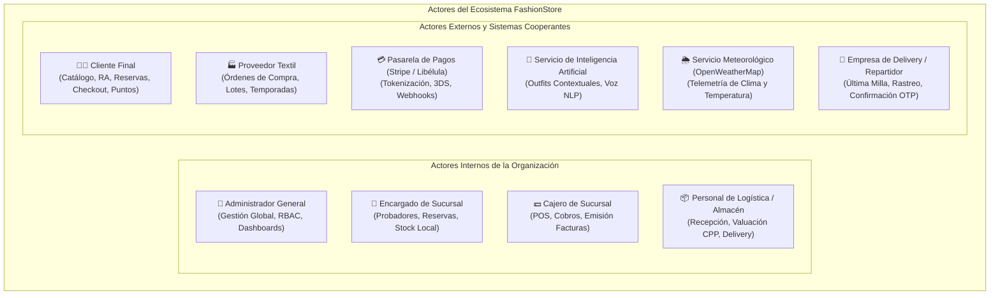

#### 1.1.1 Actores Internos (Personal de la Organización)

Corresponden a los usuarios humanos pertenecientes a la nómina operativa y ejecutiva de la cadena de tiendas de indumentaria masculina. Acceden al sistema a través de la plataforma web administrativa (Angular) o la terminal de caja POS, sujetos a rigurosas políticas de Control de Acceso Basado en Roles (RBAC):

1. **Administrador General:**
   * **Descripción y Rol:** Máxima autoridad directiva e informática de la empresa. Cuenta con privilegios irrestrictos sobre la configuración y gobernanza de la plataforma.
   * **Responsabilidades Clave:**
     - Creación, modificación, asignación de roles y revocación de cuentas de personal interno.
     - Desbloqueo administrativo de cuentas inhabilitadas preventivamente tras 5 intentos fallidos de autenticación.
     - Alta y parametrización de ciudades, sucursales físicas, georreferenciación GPS y capacidades de probadores.
     - Gestión del catálogo maestro: categorías, marcas, temporadas estacionales y atributos de moda (tallas y colores Hexadecimales).
     - Supervisión de métricas financieras, auditorías de seguridad e indicadores gerenciales en los tableros de control (dashboards).

2. **Encargado de Sucursal:**
   * **Descripción y Rol:** Responsable del funcionamiento diario, la sala de ventas y el almacén de una tienda física específica (ej. *Sucursal Equipetrol*, *Sucursal Calacoto* o *Sucursal El Prado*).
   * **Responsabilidades Clave:**
     - Monitoreo en tiempo real del panel de reservas presenciales asignadas a su sucursal.
     - Coordinación y supervisión del apartado físico anticipado de prendas en perchas y probadores previo a la visita del cliente.
     - Validación de la llegada del cliente a la tienda mediante el escaneo óptico del código QR de la reserva.
     - Control y auditoría del stock físico local, reporte de mermas o prendas deterioradas y recepción de transferencias inter-sucursales.

3. **Cajero de Sucursal:**
   * **Descripción y Rol:** Operador de mostrador responsable de la atención directa y formalización de cobros en los puntos de venta físicos (POS).
   * **Responsabilidades Clave:**
     - Autenticación en la terminal de caja e inicio de turno de cobro.
     - Búsqueda ágil de prendas mediante escaneo de códigos de barras SKU o códigos alfanuméricos.
     - Conversión directa de solicitudes de reserva presencial en ventas definitivas de mostrador.
     - Procesamiento de cobros físicos (efectivo con cálculo automático de cambio) y cobros electrónicos (tarjetas con terminal POS física o Código QR Interoperable).
     - Emisión e impresión de comprobantes de venta válidos (tickets térmicos y facturas) con descuento automático de inventario.

4. **Personal de Logística y Almacén:**
   * **Descripción y Rol:** Operadores de bodega y centros de distribución responsables de la recepción de mercadería y el despacho de pedidos.
   * **Responsabilidades Clave:**
     - Recepción física y control de calidad de lotes textiles enviados por proveedores.
     - Registro minucioso del costo unitario neto de adquisición del lote para alimentar el recálculo automático del Costo Promedio Ponderado (CPP).
     - Embalaje, etiquetado y preparación de órdenes de venta digital destinadas a entrega a domicilio (*Delivery*).
     - Asignación de paquetes a transportistas y registro de hojas de ruta para última milla.

---

#### 1.1.2 Actores Externos (Usuarios y Sistemas Cooperantes)

Representan a las personas ajenas a la nómina de la empresa y a los servicios informáticos de terceros que interactúan mediante interfaces de usuario o protocolos de comunicación en red (APIs REST, Webhooks y pasarelas):

1. **Cliente Final (Consumidor Masculino):**
   * **Descripción y Rol:** Usuario final y comprador de la plataforma, que interactúa a través de la aplicación móvil (Flutter) o el portal web público (Angular).
   * **Responsabilidades Clave:**
     - Auto-registro de cuenta de usuario, inicio de sesión seguro y gestión de perfil personal.
     - Consulta y filtrado multidimensional del catálogo de prendas masculinas por categoría, talla, color, precio y sucursal.
     - Proyección virtual de prendas sobre su silueta mediante el Vestidor Virtual con Realidad Aumentada (RA).
     - Solicitud de reservas anticipadas de prendas para acudir presencialmente a probarlas en la sucursal de su elección.
     - Formalización de compras digitales mediante carrito de compras omnicanal y pago electrónico seguro.
     - Acumulación y canje de puntos de fidelización dentro del programa gamificado y recepción de recomendaciones por IA.

2. **Proveedor Textil:**
   * **Descripción y Rol:** Empresa fabricante o comercializadora que suministra indumentaria masculina a la cadena FashionStore.
   * **Responsabilidades Clave:**
     - Recepción y confirmación de órdenes de compra emitidas por la administración.
     - Suministro de lotes de prendas asociados a colecciones y temporadas comerciales específicas.
     - Envío de notas de entrega y fichas técnicas de composición textil y cuidado de prendas.

3. **Pasarela de Pagos Electrónicos (Stripe / PayPal / Libélula):**
   * **Descripción y Rol:** Sistema bancario y tecnológico externo que procesa transacciones monetarias digitales bajo estrictos estándares de seguridad financiera (PCI-DSS).
   * **Responsabilidades Clave:**
     - Captura segura y tokenización de números de tarjetas de débito/crédito, impidiendo que datos sensibles toquen los servidores de FashionStore.
     - Validación de fondos, autenticación del titular mediante protocolo 3D Secure 2.0 y prevención de fraudes.
     - Confirmación o rechazo síncrono de transacciones y emisión de notificaciones asíncronas vía Webhooks hacia el backend FastAPI.

4. **Servicio de Inteligencia Artificial (OpenAI API / Gemini API):**
   * **Descripción y Rol:** Motor cognitivo en la nube que actúa como asistente de estilo personalizado y procesador de lenguaje natural.
   * **Responsabilidades Clave:**
     - Análisis de preferencias de estilo, paletas de colorimetría y compras previas del usuario.
     - Síntesis de condiciones de contexto (temperatura y clima local) para sugerir combinaciones coherentes de ropa masculina.
     - Procesamiento semántico de consultas del catálogo y comandos verbales de búsqueda por voz.

5. **Servicio Meteorológico Externo (OpenWeatherMap API):**
   * **Descripción y Rol:** Proveedor telemático en la nube de información climática en tiempo real.
   * **Responsabilidades Clave:**
     - Provisión continua de variables meteorológicas (temperatura en grados Celsius, estado del cielo, nivel de precipitaciones y humedad) de la ciudad donde se ubica el cliente.
     - Entrega de datos para que el motor de IA adapte dinámicamente las recomendaciones de vestimenta (ej. sugiriendo gabardinas o suéteres ante frentes fríos).

6. **Empresa de Delivery / Repartidor de Última Milla:**
   * **Descripción y Rol:** Agente logístico urbano (como Yaigo, Yummy, PedidosYa o flota interna de repartidores) encargado del traslado físico del producto.
   * **Responsabilidades Clave:**
     - Recolección física del paquete empaquetado en la sucursal de despacho asignada.
     - Transporte seguro hacia el domicilio georreferenciado del cliente.
     - Confirmación de la entrega efectiva mediante captura de firma digital o validación del código OTP proporcionado por el comprador.

---

#### 1.1.3 Matriz Resumen de Actores del Sistema

| Tipo de Actor | Nombre del Actor | Plataforma / Canal de Interacción | Categoría de Permisos (RBAC) | Propósito Principal en FashionStore |
|:---:|:---|:---:|:---:|:---|
| **Interno** | **Administrador General** | Web Administrativa (Angular) | `ADMINISTRADOR` (Acceso Total) | Gobernanza global de usuarios, roles, tiendas, catálogo, temporadas, proveedores y analítica. |
| **Interno** | **Encargado de Sucursal** | Web / Tablet (Angular) | `ENCARGADO_SUCURSAL` | Gestión y preparación de reservas presenciales en probadores y control de stock local. |
| **Interno** | **Cajero de Sucursal** | Terminal POS Web (Angular) | `CAJERO` | Facturación en mostrador, cobros multimedio, conversión de reservas y cuadre de caja. |
| **Interno** | **Personal de Logística** | Web de Almacén (Angular) | `LOGISTICA` | Recepción de compras con CPP, empaque de órdenes digitales y despacho de delivery. |
| **Externo** | **Cliente Final** | Móvil (Flutter) + Web (Angular) | `CLIENTE` | Navegación de catálogo, vestidor RA, reservas físicas, compras digitales y fidelización. |
| **Externo** | **Proveedor Textil** | Portal Proveedor / Correo | `PROVEEDOR` (Extranet) | Confirmación de órdenes de compra, despacho de lotes y suministro de fichas técnicas. |
| **Externo** | **Pasarela de Pagos** | Servicio API REST Cloud / Webhook | Sistema Externo Automatizado | Autorización, tokenización y procesamiento seguro de transacciones de compra digital. |
| **Externo** | **Servicio de IA** | API Cloud (OpenAI / Gemini) | Servicio Cognitivo Externo | Generación de sugerencias de outfits contextuales y procesamiento de comandos de voz. |
| **Externo** | **Servicio Meteorológico** | API Cloud (OpenWeatherMap) | Servicio Telemático Externo | Suministro de datos meteorológicos locales para la personalización climática de prendas. |
| **Externo** | **Empresa de Delivery** | App de Repartidor / Webhook | Agente Logístico de Transporte | Recojo en tienda física y transporte seguro de última milla hacia el domicilio del cliente. |

---

#### 1.1.4 Identificación y Catálogo General de Casos de Uso

A partir del mapeo de responsabilidades de los actores descritos con los procesos de negocio de FashionStore, se identifican formalmente los **24 Casos de Uso** que estructuran la solución a lo largo de sus tres ciclos de desarrollo:

| Código CU | Nombre del Caso de Uso | Módulo Asociado | Actor(es) Principal(es) | Descripción Resumida |
|:---:|:---|:---:|:---|:---|
| **CU01** | Autenticar Usuario y Control de Acceso (RBAC) | M01 | Administrador, Encargado, Cajero, Logística, Cliente | Inicio de sesión seguro con credenciales hash bcrypt, emisión de tokens JWT, control granular de roles y auditoría de accesos. |
| **CU02** | Registrar Cliente (Auto-registro de Clientes) | M01 | Cliente no autenticado | Creación de cuenta de cliente por autoservicio en web/móvil con validación de contraseña segura, hash bcrypt y bienvenida. |
| **CU03** | Recuperar Contraseña (Token OTP de 6 Dígitos) | M01 | Usuario (Cualquier Rol) | Restablecimiento autoservicio de contraseña olvidada mediante envío y validación de código OTP temporal de 6 dígitos vía correo electrónico. |
| **CU04** | Gestionar Usuarios y Roles (RBAC y Desbloqueo) | M01 | Administrador General | Administración de personal interno, asignación de roles jerárquicos, asignación a sucursal y desbloqueo de cuentas bloqueadas por intentos. |
| **CU05** | Gestionar Ciudades y Sucursales | M02 | Administrador General | Administración geográfica y operativa de ciudades, sucursales físicas, georreferenciación GPS, horarios y capacidades de probadores. |
| **CU06** | Gestionar Productos y Atributos de Moda | M03 | Administrador General | CRUD de prendas de vestir masculinas, categorías, marcas, tallas normalizadas y colores multivaluados con código Hex. |
| **CU07** | Gestionar Temporadas y Colecciones | M04 | Administrador General | Calendarización y administración de campañas estacionales (Primavera-Verano, Otoño-Invierno, Escolar, Promociones). |
| **CU08** | Gestionar Proveedores Textiles | M05 | Administrador General, Logística | Registro y administración de empresas proveedoras, condiciones de pago, líneas de prendas y contratos de aprovisionamiento. |
| **CU09** | Gestionar Inventario Multi-Sucursal y Costos Ponderados (CPP) | M06 | Personal de Logística, Encargado Sucursal | Control de existencias por sucursal, registro de entradas con último costo unitario y recálculo matemático del Costo Promedio Ponderado (CPP). |
| **CU10** | Consultar Catálogo y Disponibilidad por Sucursal | M07 | Cliente, Encargado de Sucursal, Cajero | Exploración del catálogo omnicanal con filtros multidimensionales y consulta de existencias en tiempo real por tienda física. |
| **CU11** | Solicitar Reserva de Prendas en Sucursal | M10 | Cliente | Preselección de prendas, selección de sucursal física, programación de fecha/hora de visita y generación de ticket QR. *(Ciclo 2)* |
| **CU12** | Preparar y Atender Reserva Presencial | M10 | Encargado de Sucursal | Apartado físico de prendas reservadas en probadores asignados y confirmación de llegada del cliente mediante escaneo de QR. *(Ciclo 2)* |
| **CU13** | Administrar Carrito de Compras Omnicanal | M11 | Cliente | Incorporación, edición y cálculo automático de totales con validación atómica de existencias. *(Ciclo 2)* |
| **CU14** | Procesar Compra Digital y Checkout | M12 | Cliente | Formalización de compra en línea con selección de modalidad de entrega (retiro en tienda o delivery) y facturación. *(Ciclo 2)* |
| **CU15** | Registrar Venta Presencial en Caja (POS) | M13 | Cajero de Sucursal | Registro de venta en mostrador físico, lectura de códigos de barras, conversión de reservas en ventas y emisión de tickets. *(Ciclo 2)* |
| **CU16** | Procesar Pago con Pasarela Electrónica | M14 | Pasarela Externa (Stripe/PayPal), Cliente | Ejecución segura de cobro digital con verificación 3D Secure y confirmación asíncrona mediante Webhooks. *(Ciclo 2)* |
| **CU17** | Gestionar Tipos y Medios de Cobro | M15 | Administrador, Cajero | Parametrización de pagos en efectivo, tarjeta de débito/crédito y Códigos QR interoperables del BCB. *(Ciclo 2)* |
| **CU18** | Gestionar Despacho y Logística de Delivery | M19 | Personal de Logística, Empresa Delivery | Cálculo de tarifas por Haversine y peso volumétrico, asignación de repartidores y rastreo de envíos en tiempo real. *(Ciclo 2)* |
| **CU19** | Visualizar Prenda en Vestidor Virtual con RA | M08 | Cliente Móvil | Proyección tridimensional de prendas sobre la silueta del cliente mediante la cámara del smartphone usando ARCore. *(Ciclo 3)* |
| **CU20** | Comparar Outfits Lado a Lado | M09 | Cliente | Contrastación visual interactiva de hasta 3 combinaciones de ropa con desglose de precios individuales y totales. *(Ciclo 3)* |
| **CU21** | Gestionar Fidelización Gamificada | M16 | Cliente, Motor de Gamificación | Acumulación de puntos por compras, progresión en niveles jerárquicos (Bronce a Diamante), desbloqueo de insignias y canje. *(Ciclo 3)* |
| **CU22** | Solicitar Recomendación Contextual de IA | M17 | Cliente, Servicio de IA | Sugerencia inteligente de outfits completos considerando clima meteorológico local (API OpenWeatherMap), colorimetría e historial. *(Ciclo 3)* |
| **CU23** | Buscar Productos por Comandos de Voz | M17 | Cliente Móvil, Servicio de IA | Consulta de catálogo y solicitudes en lenguaje natural mediante transcripción de voz y procesamiento semántico NLP. *(Ciclo 3)* |
| **CU24** | Visualizar Cuadros de Mando y Dashboards | M18 | Administrador General | Consulta de indicadores clave de negocio (KPIs), ventas por tienda, rotación de stock y rentabilidad de colecciones. *(Ciclo 3)* |

---

### 1.2 Priorización de Casos de Uso

En consonancia con los principios del PUDS (mitigación temprana de riesgos arquitectónicos y entrega incremental de valor funcional), se establece la matriz de priorización multidimensional que define la asignación de Casos de Uso por cada ciclo de desarrollo:

| Código CU | Nombre del Caso de Uso | Valor de Negocio | Riesgo Técnico | Complejidad | Dependencias Previas | Asignación Iterativa |
|:---:|:---|:---:|:---:|:---:|:---|:---:|
| **CU01** | Autenticar Usuario y Control de Acceso (RBAC) | Muy Alto | Alto | Media | Ninguna | **Iteración 1 (Ciclo 1)** |
| **CU02** | Registrar Cliente (Auto-registro de Clientes) | Muy Alto | Medio | Media | Ninguna | **Iteración 1 (Ciclo 1)** |
| **CU03** | Recuperar Contraseña (Token OTP de 6 Dígitos) | Muy Alto | Alto | Media | CU01, CU02 | **Iteración 1 (Ciclo 1)** |
| **CU04** | Gestionar Usuarios y Roles (RBAC y Desbloqueo) | Alto | Medio | Media | CU01 | **Iteración 1 (Ciclo 1)** |
| **CU05** | Gestionar Ciudades y Sucursales | Muy Alto | Bajo | Baja | CU01 | **Iteración 1 (Ciclo 1)** |
| **CU06** | Gestionar Productos y Atributos de Moda | Muy Alto | Medio | Media | CU01 | **Iteración 1 (Ciclo 1)** |
| **CU07** | Gestionar Temporadas y Colecciones | Alto | Bajo | Baja | CU01 | **Iteración 1 (Ciclo 1)** |
| **CU08** | Gestionar Proveedores Textiles | Alto | Bajo | Baja | CU01 | **Iteración 1 (Ciclo 1)** |
| **CU09** | Gestionar Inventario Multi-Sucursal y Costos Ponderados (CPP) | Crítico | Muy Alto | Alta | CU05, CU06, CU08 | **Iteración 1 (Ciclo 1)** |
| **CU10** | Consultar Catálogo y Disponibilidad por Sucursal | Muy Alto | Medio | Media | CU05, CU06, CU09 | **Iteración 1 (Ciclo 1)** |
| **CU11** | Solicitar Reserva de Prendas en Sucursal | Alto | Medio | Media | CU09, CU10 | Iteración 2 (Ciclo 2) |
| **CU12** | Preparar y Atender Reserva Presencial | Alto | Medio | Media | CU11 | Iteración 2 (Ciclo 2) |
| **CU13** | Administrar Carrito de Compras Omnicanal | Alto | Medio | Media | CU09, CU10 | Iteración 2 (Ciclo 2) |
| **CU14** | Procesar Compra Digital y Checkout | Crítico | Alto | Alta | CU13, CU16 | Iteración 2 (Ciclo 2) |
| **CU15** | Registrar Venta Presencial en Caja (POS) | Crítico | Alto | Alta | CU09, CU10, CU17 | Iteración 2 (Ciclo 2) |
| **CU16** | Procesar Pago con Pasarela Electrónica | Crítico | Muy Alto | Alta | CU14 | Iteración 2 (Ciclo 2) |
| **CU17** | Gestionar Tipos y Medios de Cobro | Alto | Medio | Media | CU15 | Iteración 2 (Ciclo 2) |
| **CU18** | Gestionar Despacho y Logística de Delivery | Medio | Medio | Media | CU14 | Iteración 2 (Ciclo 2) |
| **CU19** | Visualizar Prenda en Vestidor Virtual con RA | Alto | Muy Alto | Alta | CU06, CU10 | Iteración 3 (Ciclo 3) |
| **CU20** | Comparar Outfits Lado a Lado | Medio | Medio | Media | CU10 | Iteración 3 (Ciclo 3) |
| **CU21** | Gestionar Fidelización Gamificada | Alto | Medio | Media | CU14, CU15 | Iteración 3 (Ciclo 3) |
| **CU22** | Solicitar Recomendación Contextual de IA | Alto | Muy Alto | Alta | CU10 | Iteración 3 (Ciclo 3) |
| **CU23** | Buscar Productos por Comandos de Voz | Medio | Alto | Media | CU10, CU22 | Iteración 3 (Ciclo 3) |
| **CU24** | Visualizar Cuadros de Mando y Dashboards | Alto | Medio | Media | CU09, CU14, CU15 | Iteración 3 (Ciclo 3) |

> [!IMPORTANT]
> **Casos de Uso Seleccionados para el Ciclo 1 (10 Casos de Uso Fundamentales):**  
> Se seleccionan los 10 Casos de Uso fundamentales (**CU01 al CU10**). Esta selección cubre de manera integral la seguridad y control de acceso (autenticación, auto-registro de clientes, recuperación autoservicio de contraseña por OTP y administración de usuarios/roles RBAC), junto con la gestión geográfica de sucursales, el catálogo textil parametrizado, temporadas comerciales, proveedores, control de inventarios multi-sucursal con **Costo Promedio Ponderado ($CPP$)** y consulta omnicanal de existencias en tiempo real.

---

### 1.3 Detalle de Casos de Uso y Prototipado de Interfaz de Usuario

Conforme a la estricta directriz de la cátedra expresada en clase (`B4.txt`, líneas 10 a 14), la especificación de cada caso de uso se organiza de manera uniforme bajo la siguiente secuencia obligatoria:
1. **Diseño del Caso de Uso en PlantUML (PlantText)** con sus estereotipos y relaciones (`<<include>>`, `<<extend>>`, herencia).
2. **Prototipo de Interfaz de Usuario (UI Wireframe)** detallado con todos sus componentes de pantalla, campos y acciones.
3. **Tabla Detalle del Caso de Uso** conteniendo la especificación formal del escenario principal, alternos, precondiciones y postcondiciones.

---

#### 1.3.1 Caso de Uso CU01: Autenticar Usuario y Control de Acceso (RBAC)

##### a) Diseño del Caso de Uso (PlantUML)

```plantuml
@startuml
skinparam packageStyle rectangle
skinparam actorStyle awesome

actor "Usuario del Sistema
(Admin, Encargado, Cajero,
Logística, Cliente)" as ActorUsuario

rectangle "FashionStore - Módulo de Autenticación (RBAC)" {
    usecase "CU01: Autenticar Usuario
(Iniciar Sesión)" as CU_Login
    usecase "Validar Credenciales
Hash Bcrypt" as CU_ValidarHash
    usecase "Bloquear Cuenta por
5 Intentos Fallidos" as CU_Bloqueo
    usecase "Generar Token JWT con
Rol Asignado" as CU_Token
    usecase "Registrar Auditoría en
Bitácora de Accesos" as CU_Bitacora
}

ActorUsuario --> CU_Login

CU_Login ..> CU_ValidarHash : <<include>>
CU_Login ..> CU_Token : <<include>>
CU_Login ..> CU_Bitacora : <<include>>
CU_Login <.. CU_Bloqueo : <<extend>>
@enduml
```

##### b) Prototipo de Interfaz de Usuario (UI Wireframe)

```text
+--------------------------------------------------------------------------------+
|  FashionStore | Plataforma E-Commerce Omnicanal                  [ ES | EN ]   |
+--------------------------------------------------------------------------------+
|                                                                                |
|                        +------------------------------+                        |
|                        |       FASHIONSTORE           |                        |
|                        |    Elegancia Masculina       |                        |
|                        +------------------------------+                        |
|                        | INICIAR SESIÓN EN EL SISTEMA |                        |
|                        |                              |                        |
|                        | Correo Electrónico:          |                        |
|                        | [ alberto.delgado@store.bo ] |                        |
|                        |                              |                        |
|                        | Contraseña:                  |                        |
|                        | [ ****************** ] [Ver] |                        |
|                        |                              |                        |
|                        | [X] Recordar sesión (30 días)|                        |
|                        |                              |                        |
|                        |     [   INICIAR SESIÓN   ]   |                        |
|                        |                              |                        |
|                        | ¿Olvidaste tu contraseña?    |                        |
|                        | [Recuperar acceso vía email] |                        |
|                        |                              |                        |
|                        | ¿Eres nuevo en la tienda?    |                        |
|                        | [Registrarse como Cliente]   |                        |
|                        +------------------------------+                        |
|                        |  Estado: Conexión segura TLS |                        |
|                        +------------------------------+                        |
|                                                                                |
+--------------------------------------------------------------------------------+
```

##### c) Tabla Detalle del Caso de Uso

| Atributo | Detalle de la Especificación |
|:---|:---|
| **Identificador** | **CU01** |
| **Nombre** | **Autenticar Usuario y Control de Acceso (RBAC)** |
| **Actores** | Administrador, Encargado de Sucursal, Cajero, Personal de Logística, Cliente. |
| **Propósito** | Garantizar el acceso seguro, segregado y controlado a las funciones del sistema mediante credenciales válidas y expedición de tokens JWT firmados. |
| **Tipo** | Primario / Esencial. |
| **Precondiciones** | 1. El usuario debe poseer una cuenta previamente creada y activa (`estado_cuenta = 'ACTIVO'`).<br>2. El canal de comunicación debe encontrarse protegido bajo protocolo HTTPS/TLS. |
| **Postcondiciones** | 1. Se emite un token de sesión JWT con los claims de identidad y rol del usuario.<br>2. Se actualiza el timestamp de `ultimo_acceso` y se restablece a 0 el contador de intentos fallidos.<br>3. Se registra el evento en la tabla `bitacora_accesos` con IP, fecha/hora y User-Agent. |
| **Flujo Principal** | 1. El actor ingresa a la vista de login en la plataforma web o móvil.<br>2. El actor introduce su correo electrónico registrado y contraseña en texto plano.<br>3. El sistema valida el formato del correo y recupera el registro del usuario.<br>4. El sistema comprueba mediante el algoritmo `bcrypt.verify` si la contraseña coincide con el `password_hash` almacenado.<br>5. El sistema verifica que la cuenta no esté bloqueada ni inactiva.<br>6. El sistema genera el token JWT firmado con el rol correspondiente y tiempo de expiración.<br>7. El sistema registra el acceso exitoso en la bitácora de auditoría.<br>8. El sistema redirige al usuario a la vista principal según su perfil (Dashboard para Administrador, POS para Cajero, Reservas para Encargado, Catálogo para Cliente). |
| **Flujos Alternativos** | **4a. Contraseña incorrecta:**<br>1. El sistema incrementa en 1 el campo `intentos_fallidos`.<br>2. Si `intentos_fallidos >= 5`, el sistema cambia `estado_cuenta = 'BLOQUEADO_POR_INTENTOS'`, establece `bloqueado_hasta = NOW() + INTERVAL '30 MIN'` y registra alerta de seguridad.<br>3. El sistema muestra mensaje: *"Credenciales inválidas. Le quedan X intentos antes del bloqueo."*<br>**5a. Cuenta bloqueada:**<br>1. El sistema rechaza la autenticación informando: *"Cuenta bloqueada preventivamente. Restablezca su contraseña o contacte a soporte."* |

---

#### 1.3.2 Caso de Uso CU02: Registrar Cliente (Auto-registro de Clientes)

##### a) Diseño del Caso de Uso (PlantUML)

```plantuml
@startuml
skinparam packageStyle rectangle
skinparam actorStyle awesome

actor "Cliente No Autenticado
(Visitante Web / App Móvil)" as ActorCliente

rectangle "FashionStore - Registro Autoservicio" {
    usecase "CU02: Registrarse en
FashionStore (Sign Up)" as CU_Registro
    usecase "Validar Formato de
Correo y Teléfono" as CU_ValFormato
    usecase "Verificar Unicidad
de Correo Electrónico" as CU_Unicidad
    usecase "Cifrar Contraseña
con Bcrypt (Cost Factor 12)" as CU_Hash
    usecase "Enviar Correo
de Bienvenida" as CU_EmailBienvenida
}

ActorCliente --> CU_Registro

CU_Registro ..> CU_ValFormato : <<include>>
CU_Registro ..> CU_Unicidad : <<include>>
CU_Registro ..> CU_Hash : <<include>>
CU_Registro <.. CU_EmailBienvenida : <<extend>>
@enduml
```

##### b) Prototipo de Interfaz de Usuario (UI Wireframe)

```text
+--------------------------------------------------------------------------------+
|  FashionStore | Elegancia Masculina                              [ Iniciar Sesión ]|
+--------------------------------------------------------------------------------+
|                                                                                |
|                        +----------------------------------------+              |
|                        |          CREAR NUEVA CUENTA            |              |
|                        | Únete al Club de Fidelización Fashion |              |
|                        +----------------------------------------+              |
|                        | Nombres:                               |              |
|                        | [ Carlos Andrés                      ] |              |
|                        | Apellidos:                             |              |
|                        | [ Mendoza Claros                     ] |              |
|                        | Correo Electrónico:                    |              |
|                        | [ carlos.mendoza@gmail.com           ] |              |
|                        | Celular / WhatsApp:                    |              |
|                        | [ +591 77012345                      ] |              |
|                        | Fecha de Nacimiento:                   |              |
|                        | [ 1995-04-18                         ] |              |
|                        | Contraseña:                            |              |
|                        | [ **************** ] [Mostrar]        |              |
|                        | Fortaleza: [======       ] Media       |              |
|                        | • Mínimo 8 caracteres, 1 mayús, 1 num  |              |
|                        | Confirmar Contraseña:                  |              |
|                        | [ **************** ] [Mostrar]        |              |
|                        | [X] Acepto Términos y Condiciones      |              |
|                        | [X] Deseo recibir promociones exclusiv.|              |
|                        |                                        |              |
|                        |   [    CREAR MI CUENTA FASHIONSTORE   ]|              |
|                        |                                        |              |
|                        | ¿Ya tienes una cuenta?                 |              |
|                        | [Inicia sesión aquí]                   |              |
|                        +----------------------------------------+              |
|                                                                                |
+--------------------------------------------------------------------------------+
```

##### c) Tabla Detalle del Caso de Uso

| Atributo | Detalle de la Especificación |
|:---|:---|
| **Identificador** | **CU02** |
| **Nombre** | **Registrar Cliente (Auto-registro de Clientes)** |
| **Actores** | Cliente no autenticado (Visitante Web / Móvil). |
| **Propósito** | Permitir que los nuevos clientes se auto-registren en la plataforma FashionStore para acceder al carrito, guardar preferencias, reservar probadores físicos y acumular puntos de fidelización. |
| **Tipo** | Primario / Autoservicio. |
| **Precondiciones** | El usuario debe encontrarse en la plataforma web o móvil sin sesión activa. |
| **Postcondiciones** | 1. Se crea un registro en `usuarios` con rol `CLIENTE` y `estado_cuenta = 'ACTIVO'`.<br>2. Se encripta la contraseña mediante `bcrypt` (factor de costo 12).<br>3. Se expide automáticamente un token JWT y se envía un correo transaccional de bienvenida. |
| **Flujo Principal** | 1. El visitante selecciona la opción *"Registrarse"* en la plataforma.<br>2. El sistema despliega el formulario de captura de datos personales y credenciales.<br>3. El cliente introduce nombres, apellidos, correo, teléfono y contraseña.<br>4. El sistema valida en tiempo real la fortaleza de la clave (mínimo 8 caracteres, al menos una mayúscula y un número).<br>5. El cliente presiona el botón *"Crear Mi Cuenta FashionStore"*.<br>6. El sistema verifica que el correo electrónico no exista previamente en la base de datos.<br>7. El sistema aplica el hash seguro `bcrypt` sobre la contraseña ingresada.<br>8. El sistema persiste el usuario en la base de datos con rol `CLIENTE` e inicializa sus puntos de fidelización en 0.<br>9. El sistema dispara el envío asíncrono del correo de bienvenida.<br>10. El sistema inicia la sesión automáticamente expidiendo el token JWT y redirige al catálogo. |
| **Flujos Alternativos** | **6a. Correo ya registrado:**<br>1. El sistema detecta duplicidad de correo electrónico.<br>2. El sistema muestra mensaje de error: *"El correo electrónico ya se encuentra registrado. ¿Desea iniciar sesión o recuperar su contraseña?"* con enlaces directos.<br>**4a. Contraseña insegura:**<br>1. El sistema deshabilita el envío e indica visualmente las reglas faltantes en la contraseña.<br>**3a. Contraseñas no coincidentes:**<br>1. El sistema advierte que los campos de confirmación no concuerdan e impide el envío. |

---

#### 1.3.3 Caso de Uso CU03: Recuperar Contraseña (Token OTP de 6 Dígitos)

##### a) Diseño del Caso de Uso (PlantUML)

```plantuml
@startuml
skinparam packageStyle rectangle
skinparam actorStyle awesome

actor "Usuario del Sistema
(Cliente, Empleado, Admin)" as ActorUsuario

rectangle "FashionStore - Recuperación de Acceso" {
    usecase "CU03: Recuperar Contraseña
(Restablecimiento)" as CU_Recuperar
    usecase "Generar Código OTP
Criptográfico (6 Dígitos)" as CU_GenOTP
    usecase "Despachar Correo con
Código OTP Temporal" as CU_EnviarOTP
    usecase "Validar OTP y Actualizar
Clave con Hash Bcrypt" as CU_ValidarClave
    usecase "Bloquear Código OTP
tras 3 Intentos Errados" as CU_BloqueoOTP
}

ActorUsuario --> CU_Recuperar

CU_Recuperar ..> CU_GenOTP : <<include>>
CU_Recuperar ..> CU_EnviarOTP : <<include>>
CU_Recuperar ..> CU_ValidarClave : <<include>>
CU_Recuperar <.. CU_BloqueoOTP : <<extend>>
@enduml
```

##### b) Prototipos de Interfaz de Usuario (UI Wireframe - Flujo de 2 Pantallas)

```text
========================= PANTALLA 1: SOLICITAR RECUPERACIÓN =========================
+--------------------------------------------------------------------------------+
|  FashionStore | Recuperación Segura de Contraseña                [ Volver al Login ]|
+--------------------------------------------------------------------------------+
|                                                                                |
|                        +----------------------------------------+              |
|                        |       ¿OLVIDASTE TU CONTRASEÑA?        |              |
|                        +----------------------------------------+              |
|                        | Ingresa tu correo electrónico registrado. Te           |
|                        | enviaremos un código de seguridad OTP de 6             |
|                        | dígitos válido por 15 minutos.                         |
|                        |                                                        |
|                        | Correo Electrónico:                                    |
|                        | [ alberto.delgado@store.bo           ]                 |
|                        |                                                        |
|                        |   [   ENVIAR CÓDIGO DE RECUPERACIÓN   ]                |
|                        |                                                        |
|                        | ¿Recordaste tu clave? [Regresar al Login]              |
|                        +----------------------------------------+              |
|                                                                                |
+--------------------------------------------------------------------------------+

===================== PANTALLA 2: VALIDAR OTP Y RESTABLECER CLAVE =====================
+--------------------------------------------------------------------------------+
|  FashionStore | Restablecer Contraseña                           [ Ayuda / Soporte ]|
+--------------------------------------------------------------------------------+
|                                                                                |
|                        +----------------------------------------+              |
|                        |       RESTABLECER TU CONTRASEÑA        |              |
|                        +----------------------------------------+              |
|                        | Hemos enviado un código a alberto.***@store.bo         |
|                        |                                                        |
|                        | Introduce el código OTP de 6 dígitos:                  |
|                        |      [_8_] [_4_] [_1_] [_9_] [_2_] [_0_]               |
|                        | Tiempo restante del código: (14:32 min)                |
|                        |                                                        |
|                        | Nueva Contraseña:                                      |
|                        | [ ****************** ] [Mostrar]                       |
|                        | Fortaleza: [============] Alta                         |
|                        |                                                        |
|                        | Confirmar Nueva Contraseña:                            |
|                        | [ ****************** ] [Mostrar]                       |
|                        |                                                        |
|                        |   [    RESTABLECER CONTRASEÑA AHORA   ]                |
|                        |                                                        |
|                        | ¿No recibiste el código? [Reenviar en 60s]             |
|                        +----------------------------------------+              |
|                                                                                |
+--------------------------------------------------------------------------------+
```

##### c) Tabla Detalle del Caso de Uso

| Atributo | Detalle de la Especificación |
|:---|:---|
| **Identificador** | **CU03** |
| **Nombre** | **Recuperar Contraseña (Token OTP de 6 Dígitos)** |
| **Actores** | Usuario del Sistema (Cliente, Administrador, Empleado). |
| **Propósito** | Permitir a cualquier usuario restablecer de manera autoservicio su contraseña olvidada mediante la generación y validación de un código criptográfico temporal (OTP) enviado a su correo electrónico. |
| **Tipo** | Secundario / Soporte y Seguridad. |
| **Precondiciones** | 1. El usuario debe haber registrado previamente su cuenta con un correo electrónico válido.<br>2. El servicio SMTP/transaccional debe encontrarse operativo. |
| **Postcondiciones** | 1. Se genera un código OTP numérico aleatorio de 6 dígitos con expiración de 15 minutos en `tokens_recuperacion`.<br>2. Tras la validación, se actualiza el `password_hash` del usuario en `usuarios` y se inhabilita el token OTP.<br>3. Si la cuenta estaba bloqueada por intentos fallidos, se desbloquea automáticamente (`estado_cuenta = 'ACTIVO'`, `intentos_fallidos = 0`). |
| **Flujo Principal** | 1. El usuario presiona *"¿Olvidaste tu contraseña?"* en la pantalla de autenticación.<br>2. El sistema despliega la pantalla de solicitud de correo.<br>3. El usuario ingresa su correo electrónico y presiona *"Enviar Código de Recuperación"*.<br>4. El sistema busca el correo en la base de datos.<br>5. El sistema genera un código numérico aleatorio criptoseguro de 6 dígitos con fecha de expiración fijada a `NOW() + 15 MIN`.<br>6. El sistema almacena el hash del OTP en `tokens_recuperacion` y despacha el correo electrónico con el código.<br>7. El sistema redirige a la pantalla de verificación de código OTP y nueva clave.<br>8. El usuario introduce el código OTP recibido y digita su nueva contraseña con confirmación.<br>9. El sistema valida que el OTP coincida, no haya expirado y no haya sido utilizado previamente.<br>10. El sistema cifra la nueva contraseña con `bcrypt` (factor 12) y actualiza el registro en `usuarios`.<br>11. El sistema marca el token OTP como utilizado (`utilizado = true`), limpia los contadores de intentos fallidos y desbloquea la cuenta.<br>12. El sistema muestra mensaje de confirmación: *"Contraseña actualizada exitosamente"* y redirige al login. |
| **Flujos Alternativos** | **4a. Correo no registrado:**<br>1. Por directriz de seguridad contra enumeración de cuentas (OWASP), el sistema responde genéricamente: *"Si el correo ingresado se encuentra registrado, le hemos enviado el código de verificación"*, sin revelar la inexistencia del usuario.<br>**9a. Código OTP erróneo:**<br>1. El sistema incrementa el contador de fallos del token.<br>2. Si supera 3 intentos errados, el token se invalida permanentemente y se exige solicitar uno nuevo.<br>**9b. Código OTP expirado (más de 15 minutos):**<br>1. El sistema informa: *"El código OTP ha expirado. Por favor solicite un nuevo código."* |

---

#### 1.3.4 Caso de Uso CU04: Gestionar Usuarios y Roles (RBAC y Desbloqueo)

##### a) Diseño del Caso de Uso (PlantUML)

```plantuml
@startuml
skinparam packageStyle rectangle
skinparam actorStyle awesome

actor "Administrador General" as ActorAdmin

rectangle "FashionStore - Administración de Personal (RBAC)" {
    usecase "CU04: Gestionar Usuarios
y Roles del Sistema" as CU_GestionUsuarios
    usecase "Asignar Rol Jerárquico
(Admin, Encargado, Cajero, Logística)" as CU_AsignarRol
    usecase "Vincular Usuario a
Sucursal Operativa" as CU_VincularSucursal
    usecase "Desbloquear Cuenta
Bloqueada por Intentos" as CU_Desbloquear
    usecase "Inactivar / Reactivar
Cuenta de Empleado" as CU_Inactivar
}

ActorAdmin --> CU_GestionUsuarios

CU_GestionUsuarios ..> CU_AsignarRol : <<include>>
CU_GestionUsuarios ..> CU_VincularSucursal : <<include>>
CU_GestionUsuarios <.. CU_Desbloquear : <<extend>>
CU_GestionUsuarios <.. CU_Inactivar : <<extend>>
@enduml
```

##### b) Prototipo de Interfaz de Usuario (UI Wireframe)

```text
+--------------------------------------------------------------------------------+
|  FashionStore | Panel Administrador > Usuarios y Roles (RBAC)    [ Admin: Alberto ]|
+--------------------------------------------------------------------------------+
| [ + Nuevo Empleado ] [ Filtro Rol: Todos v ] [ Estado: Todos v ] [ Buscar... ] |
+--------------------------------------------------------------------------------+
| GESTIÓN DE PERSONAL Y CUENTAS                               Mostrando 12 usuarios|
|                                                                                |
| ID | Nombre Completo   | Correo Electrónico    | Rol       | Sucursal    | Estado  | Acciones           |
|----+-------------------+-----------------------+-----------+-------------+---------+--------------------|
| 01 | Alberto Delgado   | alberto.d@store.bo    | ADMIN     | Central SCZ | [ACTIVO]| [Editar] [Clave]   |
| 02 | Andy Mujica       | andy.m@store.bo       | ADMIN     | Central SCZ | [ACTIVO]| [Editar] [Clave]   |
| 03 | Mario Valdivia    | mario.v@store.bo      | ENCARGADO | Equipetrol  | [ACTIVO]| [Editar] [Pausar]  |
| 04 | Roberto Sucre     | roberto.s@store.bo    | CAJERO    | Calacoto LP | [BLOQ! ]| [*DESBLOQUEAR*]    |
| 05 | Javier Terceros   | javier.t@store.bo     | LOGISTICA | Almacén Cen | [ACTIVO]| [Editar] [Pausar]  |
| 06 | Carlos Mendoza    | carlos.m@gmail.com    | CLIENTE   | Omnicanal   | [ACTIVO]| [Ver Perfil]       |
+----+-------------------+-----------------------+-----------+-------------+---------+--------------------+
|                                                                                |
| MODAL: [ EDITAR USUARIO / ASIGNAR SUCURSAL Y ROL ]                             |
| +----------------------------------------------------------------------------+ |
| | Nombre: Roberto Sucre              Correo: roberto.s@store.bo              | |
| | Rol Jerárquico: [ Cajero de Sucursal                             v ]       | |
| | Sucursal Asignada: [ Sucursal Calacoto - La Paz                  v ]       | |
| | Estado de Cuenta: (•) Activo  ( ) Inactivo  ( ) Bloqueado por Intentos     | |
| | Contador de Intentos Fallidos: [ 5 ]  ->  [ RESTABLECER A 0 ]              | |
| |                                                                            | |
| |     [ GUARDAR CAMBIOS ]        [ CANCELAR ]        [ REENVIAR CLAVE ]      | |
| +----------------------------------------------------------------------------+ |
+--------------------------------------------------------------------------------+
```

##### c) Tabla Detalle del Caso de Uso

| Atributo | Detalle de la Especificación |
|:---|:---|
| **Identificador** | **CU04** |
| **Nombre** | **Gestionar Usuarios y Roles (RBAC y Desbloqueo)** |
| **Actores** | Administrador General. |
| **Propósito** | Gestionar los usuarios internos de la organización, asignar sus roles y sucursales físicas de desempeño, regular sus privilegios y realizar tareas de mantenimiento operativo (como el desbloqueo de cuentas bloqueadas por intentos fallidos). |
| **Tipo** | Primario / Administrativo. |
| **Precondiciones** | El usuario debe estar autenticado con rol `ADMINISTRADOR`. |
| **Postcondiciones** | Se persisten las modificaciones en la tabla `usuarios` y se asienta el registro de auditoría en `bitacora_accesos`. |
| **Flujo Principal** | 1. El Administrador accede a la opción *"Usuarios y Roles"* del menú administrativo.<br>2. El sistema recupera la lista paginada de usuarios con sus roles y sucursales.<br>3. El Administrador selecciona *"Nuevo Empleado"* o hace clic en *"Editar"* sobre un usuario existente.<br>4. El sistema presenta el formulario modal con los campos de perfil, selector de rol jerárquico y selector de sucursal física.<br>5. El Administrador asigna el rol correspondiente (`ADMINISTRADOR`, `ENCARGADO_SUCURSAL`, `CAJERO`, `LOGISTICA`) y vincula la sucursal.<br>6. El Administrador presiona *"Guardar Cambios"*.<br>7. El sistema valida los datos y persiste las modificaciones en la base de datos.<br>8. El sistema notifica la confirmación de la operación. |
| **Flujos Alternativos** | **3a. Desbloqueo de cuenta bloqueada por 5 intentos:**<br>1. El Administrador visualiza el badge de estado `[BLOQ! ]` en el usuario.<br>2. El Administrador presiona el botón directo *"Desbloquear"*.<br>3. El sistema resetea `intentos_fallidos = 0`, establece `estado_cuenta = 'ACTIVO'` y elimina la marca de tiempo `bloqueado_hasta`.<br>4. El sistema emite mensaje: *"Cuenta desbloqueada exitosamente. El usuario ya puede iniciar sesión."*<br>**3b. Baja / Inactivación de empleado:**<br>1. El Administrador selecciona cambiar estado a `INACTIVO`.<br>2. El sistema revoca de inmediato todos los tokens JWT emitidos para dicho usuario. |

---

#### 1.3.5 Caso de Uso CU05: Gestionar Ciudades y Sucursales

##### a) Diseño del Caso de Uso (PlantUML)

```plantuml
@startuml
skinparam packageStyle rectangle
skinparam actorStyle awesome

actor "Administrador General" as Admin

rectangle "FashionStore - Módulo de Sucursales" {
    usecase "CU05: Gestionar Ciudades
y Sucursales" as CU_Sucursales
    usecase "Registrar Nueva Sucursal
con Coordenadas GPS" as CU_RegSucursal
    usecase "Actualizar Horarios y
Capacidad de Probadores" as CU_ModSucursal
    usecase "Asignar Encargado
de Tienda" as CU_AsignarPersonal
    usecase "Geolocalizar Sucursal
en Mapa Interactivo" as CU_Mapa
    usecase "Inhabilitar Sucursal
Temporalmente" as CU_BajaLogica
}

Admin --> CU_Sucursales
CU_Sucursales <.. CU_RegSucursal : <<extend>>
CU_Sucursales <.. CU_ModSucursal : <<extend>>
CU_Sucursales <.. CU_BajaLogica : <<extend>>
CU_RegSucursal ..> CU_Mapa : <<include>>
CU_RegSucursal ..> CU_AsignarPersonal : <<include>>
@enduml
```

##### b) Prototipo de Interfaz de Usuario (UI Wireframe)

```text
+--------------------------------------------------------------------------------+
|  FashionStore ADMIN | Gestión de Sucursales y Cobertura         [ Admin: Andy ]|
+--------------------------------------------------------------------------------+
| [Dashboard] [Sucursales*] [Productos] [Temporadas] [Proveedores] [Inventario]  |
+--------------------------------------------------------------------------------+
| PANEL DE SUCURSALES FÍSICAS                     [ + Registrar Nueva Sucursal ] |
|                                                                                |
| Filtro Ciudad: [ Todas las Ciudades v ]   Estado: [ Operativas v ]  [Buscar]   |
|                                                                                |
| +----------------------------------------------------------------------------+ |
| | ID | Ciudad     | Nombre Sucursal      | Teléfono  | Probadores | Estado   |Acc| |
| +----+------------+----------------------+-----------+------------+----------+---+ |
| | 01 | Santa Cruz | Sucursal Equipetrol  | 3-3445566 | 6 vestidor | OPERATIVA|[E]| |
| | 02 | Santa Cruz | Sucursal Centro      | 3-3332211 | 4 vestidor | OPERATIVA|[E]| |
| | 03 | La Paz     | Sucursal Calacoto    | 2-2778899 | 5 vestidor | OPERATIVA|[E]| |
| | 04 | Cochabamba | Sucursal El Prado    | 4-4223344 | 4 vestidor | OPERATIVA|[E]| |
| +----------------------------------------------------------------------------+ |
|                                                                                |
| FORMULARIO: REGISTRO / EDICIÓN DE SUCURSAL                                     |
| Ciudad: [ Santa Cruz v ]      Nombre: [ Sucursal Equipetrol                  ] |
| Dirección: [ Av. San Martín #450, entre 3er y 4to anillo                     ] |
| Latitud: [ -17.76823 ]   Longitud: [ -63.18342 ]   [ Ubicar en Mapa GPS ]      |
| Horario: [ 09:00 ] a [ 21:00 ]   Capacidad Probadores: [ 6 ]                   |
| Encargado Asignado: [ Carlos Morales (ID: 104) v ]   Estado: [ OPERATIVA v ]   |
|                                                                                |
|                   [ CANCELAR ]           [ GUARDAR SUCURSAL ]                  |
+--------------------------------------------------------------------------------+
```

##### c) Tabla Detalle del Caso de Uso

| Atributo | Detalle de la Especificación |
|:---|:---|
| **Identificador** | **CU05** |
| **Nombre** | **Gestionar Ciudades y Sucursales** |
| **Actores** | Administrador General. |
| **Propósito** | Crear, configurar, actualizar y georreferenciar las ciudades y sucursales físicas habilitadas para la venta presencial, almacenamiento de existencias y reservas de probadores. |
| **Tipo** | Secundario / Gestión Operativa. |
| **Precondiciones** | 1. El actor debe haberse autenticado exitosamente como Administrador General.<br>2. La ciudad de radicación debe encontrarse dada de alta en el sistema. |
| **Postcondiciones** | 1. La sucursal queda registrada en la base de datos con coordenadas geodésicas válidas.<br>2. La sucursal queda habilitada como nodo geográfico para asignación de inventario y reservas. |
| **Flujo Principal** | 1. El Administrador accede al panel de "Gestión de Sucursales".<br>2. El sistema lista las sucursales existentes con sus métricas clave.<br>3. El Administrador pulsa en "Registrar Nueva Sucursal".<br>4. El Administrador completa: ciudad, nombre comercial, dirección, coordenadas GPS, horarios de apertura/cierre y capacidad de probadores.<br>5. El Administrador asigna al Encargado de Sucursal responsable.<br>6. El sistema valida consistencia de datos y unicidad del nombre en la ciudad.<br>7. El sistema persiste la sucursal y notifica confirmación en pantalla. |
| **Flujos Alternativos** | **6a. Coordenadas fuera de rango:** El sistema notifica error de latitud/longitud e invita a seleccionar el punto en el mapa interactivo.<br>**6b. Encargado ya asignado:** El sistema advierte que el usuario ya es titular en otra tienda y solicita confirmación de reasignación. |

---

#### 1.3.6 Caso de Uso CU06: Gestionar Productos y Atributos de Moda

##### a) Diseño del Caso de Uso (PlantUML)

```plantuml
@startuml
skinparam packageStyle rectangle
skinparam actorStyle awesome

actor "Administrador General" as Admin

rectangle "FashionStore - Módulo de Catálogo y Prendas" {
    usecase "CU06: Gestionar Productos
de Indumentaria" as CU_Productos
    usecase "Registrar Ficha Técnica
y Código SKU" as CU_CrearPrenda
    usecase "Asignar Colores Multivaluados
(Nombre + Código Hex)" as CU_Colores
    usecase "Configurar Tallas Normalizadas
(S, M, L, XL, etc.)" as CU_Tallas
    usecase "Cargar Galería Multimedia
de Imágenes" as CU_Imagenes
    usecase "Vincular Modelo 3D para
Realidad Aumentada" as CU_RA
}

Admin --> CU_Productos
CU_Productos <.. CU_CrearPrenda : <<extend>>
CU_CrearPrenda ..> CU_Colores : <<include>>
CU_CrearPrenda ..> CU_Tallas : <<include>>
CU_CrearPrenda ..> CU_Imagenes : <<include>>
CU_CrearPrenda <.. CU_RA : <<extend>>
@enduml
```

##### b) Prototipo de Interfaz de Usuario (UI Wireframe)

```text
+--------------------------------------------------------------------------------+
|  FashionStore ADMIN | Gestión de Catálogo de Prendas            [ Admin: Alberto]|
+--------------------------------------------------------------------------------+
| [Dashboard] [Sucursales] [Productos*] [Temporadas] [Proveedores] [Inventario]  |
+--------------------------------------------------------------------------------+
| CATÁLOGO DE PRENDAS MASCULINAS                     [ + Registrar Nueva Prenda ]|
| Filtro Categoría: [ Camisas v ]  Marca: [ Oxford Club v ]  Estado: [ Activo v ]|
|                                                                                |
| FICHA TÉCNICA DE PRODUCTO (NUEVO / EDICIÓN)                                    |
| Código SKU Base: [ SHIRT-SLIM-001       ]   Género: (•) Masculino              |
| Nombre Comercial: [ Camisa Oxford Clásica Slim Fit                           ] |
| Categoría: [ Camisas Formales v ]   Marca: [ Oxford Heritage v ]               |
| Precio de Venta Base (Bs): [ 280.00     ]   Temporada: [ Primavera-Verano v ]  |
| Descripción Textil:                                                            |
| [ Tejido 100% algodón egipcio peinado, cuello italiano, puño francés.      ]  |
|                                                                                |
| TALLAS DISPONIBLES: [X] S   [X] M   [X] L   [X] XL   [ ] XXL   [ ] 40  [ ] 42  |
|                                                                                |
| PALETA DE COLORES MULTIVALUADOS:                                               |
| +----------------------------------------------------------------------------+ |
| | Color Nombre   | Código HEX | Muestra Visual | Acción                       | |
| +----------------+------------+----------------+------------------------------+ |
| | Azul Marino    | #000080    | [   AZUL   ]   | [ Quitar ]                   | |
| | Blanco Óptico  | #FFFFFF    | [  BLANCO  ]   | [ Quitar ]                   | |
| | Celeste Cielo  | #87CEEB    | [ CELESTE  ]   | [ Quitar ]                   | |
| +----------------------------------------------------------------------------+ |
| [ + Agregar Color: Nombre [ Rosado Pálido ] Hex [ #FFC0CB ] [ Añadir ] ]       |
|                                                                                |
| RECURSOS MULTIMEDIA Y 3D:                                                      |
| Fotos: [ cam_azul.jpg ] [ cam_blanco.jpg ] [ cam_detalle.jpg ]  [ Subir ]      |
| Archivo 3D para RA: [ shirt_slim_001.glb ] (Formato GLB optimizado)            |
|                                                                                |
|                   [ CANCELAR ]               [ GUARDAR PRENDA ]                |
+--------------------------------------------------------------------------------+
```

##### c) Tabla Detalle del Caso de Uso

| Atributo | Detalle de la Especificación |
|:---|:---|
| **Identificador** | **CU06** |
| **Nombre** | **Gestionar Productos y Atributos de Moda** |
| **Actores** | Administrador General. |
| **Propósito** | Registrar y actualizar prendas de vestir masculinas con sus especificaciones técnicas, variantes de tallas, colores multivaluados con código visual y recursos multimedia para el vestidor virtual. |
| **Tipo** | Primario. |
| **Precondiciones** | La categoría y marca deben encontrarse registradas previamente en el sistema. |
| **Postcondiciones** | 1. El producto queda guardado con su código SKU base único.<br>2. Se generan las matrices relacionales de variantes (combinación producto-talla-color).<br>3. Las variantes quedan preparadas para recibir stock en el módulo de inventario. |
| **Flujo Principal** | 1. El Administrador accede al panel de productos y presiona "Registrar Nueva Prenda".<br>2. El sistema despliega el formulario con los campos taxonómicos.<br>3. El Administrador introduce el código SKU base, nombre comercial, descripción y precio de venta base.<br>4. El Administrador selecciona la categoría textil y la marca.<br>5. El Administrador tilda las tallas disponibles para el modelo.<br>6. El Administrador agrega la paleta de colores multivaluados indicando nombre comercial y código hexadecimal.<br>7. El Administrador sube las imágenes en alta definición y el modelo 3D (.glb).<br>8. El sistema valida la integridad de los datos y no duplicidad de SKU.<br>9. El sistema persiste el producto y sus variantes relacionales. |
| **Flujos Alternativos** | **8a. SKU duplicado:** El sistema rechaza la operación e indica que el código ya pertenece a otro artículo.<br>**8b. Archivo 3D inválido:** El sistema valida la cabecera del archivo binario y rechaza formatos distintos a .glb / .gltf. |

---

#### 1.3.7 Caso de Uso CU07: Gestionar Temporadas y Colecciones

##### a) Diseño del Caso de Uso (PlantUML)

```plantuml
@startuml
skinparam packageStyle rectangle
skinparam actorStyle awesome

actor "Administrador General" as Admin

rectangle "FashionStore - Módulo de Temporadas" {
    usecase "CU07: Gestionar Temporadas
y Colecciones" as CU_Temporadas
    usecase "Calendarizar Nueva Temporada
Comercial" as CU_CrearTemp
    usecase "Asociar Prendas a
Colección Estacional" as CU_Vincular
    usecase "Activar Descuentos de
Fin de Temporada" as CU_Descuento
    usecase "Cerrar y Liquidar
Temporada" as CU_Cierre
}

Admin --> CU_Temporadas
CU_Temporadas <.. CU_CrearTemp : <<extend>>
CU_Temporadas <.. CU_Vincular : <<extend>>
CU_Temporadas <.. CU_Descuento : <<extend>>
CU_Temporadas <.. CU_Cierre : <<extend>>
@enduml
```

##### b) Prototipo de Interfaz de Usuario (UI Wireframe)

```text
+--------------------------------------------------------------------------------+
|  FashionStore ADMIN | Temporadas y Colecciones Comerciales      [ Admin: Andy ]|
+--------------------------------------------------------------------------------+
| [Dashboard] [Sucursales] [Productos] [Temporadas*] [Proveedores] [Inventario]  |
+--------------------------------------------------------------------------------+
| GESTIÓN DE TEMPORADAS Y CAMPAÑAS                 [ + Crear Nueva Temporada ]   |
|                                                                                |
| +----------------------------------------------------------------------------+ |
| | Código  | Nombre Temporada         | Inicio     | Fin        | Estado      |Ac| |
| +---------+--------------------------+------------+------------+-------------+--+ |
| | SS-2026 | Primavera - Verano 2026  | 01/08/2026 | 31/01/2027 | VIGENTE     |[E] |
| | FW-2026 | Otoño - Invierno 2026    | 01/02/2026 | 31/07/2026 | LIQUIDACIÓN |[E] |
| | ESC-2026| Temporada Universitaria  | 15/01/2026 | 28/02/2026 | FINALIZADA  |[E] |
| +----------------------------------------------------------------------------+ |
|                                                                                |
| CONFIGURACIÓN DE CAMPAÑA ESTACIONAL                                            |
| Código: [ SS-2026 ]   Nombre: [ Primavera - Verano 2026                      ] |
| Fechas: Desde [ 01/08/2026 ] Hasta [ 31/01/2027 ]   Estado: [ VIGENTE v ]      |
| Descuento Sugerido Liquidación: [ 20.00 ] %                                    |
|                                                                                |
| ASOCIACIÓN MASIVA DE PRENDAS A LA TEMPORADA:                                   |
| [Buscar prenda: Camisa lino...]   [ Marcar Todas ]   [ 45 prendas vinculadas ] |
|                                                                                |
|                   [ CANCELAR ]               [ GUARDAR CAMBIOS ]               |
+--------------------------------------------------------------------------------+
```

##### c) Tabla Detalle del Caso de Uso

| Atributo | Detalle de la Especificación |
|:---|:---|
| **Identificador** | **CU07** |
| **Nombre** | **Gestionar Temporadas y Colecciones** |
| **Actores** | Administrador General. |
| **Propósito** | Crear y estructurar temporadas comerciales anuales, vinculando lotes de prendas para análisis estacional de rotación y reglas de IA contextual. |
| **Tipo** | Secundario. |
| **Precondiciones** | El usuario debe poseer privilegios de Administrador. |
| **Postcondiciones** | Las prendas asociadas adquieren el identificador de temporada para alimentar los filtros del catálogo y el motor de IA. |
| **Flujo Principal** | 1. El Administrador accede al panel de "Temporadas y Colecciones".<br>2. El sistema muestra la lista de temporadas vigentes y concluidas.<br>3. El Administrador ingresa código, nombre y rango de fechas de inicio y fin.<br>4. El Administrador selecciona las categorías y productos que pertenecerán a la colección.<br>5. El sistema valida que la fecha de fin sea posterior a la de inicio.<br>6. El sistema actualiza la vinculación y recalcula el catálogo público. |
| **Flujos Alternativos** | **5a. Fechas inconsistentes:** El sistema emite alerta: *"La fecha de cierre debe ser posterior a la fecha de inicio de la temporada."* |

---

#### 1.3.8 Caso de Uso CU08: Gestionar Proveedores Textiles

##### a) Diseño del Caso de Uso (PlantUML)

```plantuml
@startuml
skinparam packageStyle rectangle
skinparam actorStyle awesome

actor "Administrador General
/ Encargado de Logística" as AdminLog

rectangle "FashionStore - Módulo de Proveedores" {
    usecase "CU08: Gestionar Proveedores" as CU_Proveedores
    usecase "Registrar Proveedor con NIT" as CU_CrearProv
    usecase "Vincular Líneas Textiles
y Catálogo Suministrado" as CU_Lineas
    usecase "Consultar Historial de Compras
y Cumplimiento" as CU_Historial
    usecase "Dar de Baja Lógica
por Incumplimiento" as CU_BajaProv
}

AdminLog --> CU_Proveedores
CU_Proveedores <.. CU_CrearProv : <<extend>>
CU_Proveedores <.. CU_Historial : <<extend>>
CU_Proveedores <.. CU_BajaProv : <<extend>>
CU_CrearProv ..> CU_Lineas : <<include>>
@enduml
```

##### b) Prototipo de Interfaz de Usuario (UI Wireframe)

```text
+--------------------------------------------------------------------------------+
|  FashionStore ADMIN | Padrón de Proveedores Textiles            [ Admin: Alberto]|
+--------------------------------------------------------------------------------+
| [Dashboard] [Sucursales] [Productos] [Temporadas] [Proveedores*] [Inventario]  |
+--------------------------------------------------------------------------------+
| PROVEEDORES REGISTRADOS                            [ + Registrar Proveedor ]   |
|                                                                                |
| +----------------------------------------------------------------------------+ |
| | ID | NIT / Tax ID | Razón Social          | Contacto      | Términos  |Est.|Ac| |
| +----+--------------+-----------------------+---------------+-----------+----+--+ |
| | 01 | 1028392019   | Confecciones Andina SA| Juan Paredes  | Crédito 30|ACT |[E| |
| | 02 | 9038472011   | Hilanderías del Sur   | Marcos Vaca   | Contado   |ACT |[E| |
| | 03 | 3829104018   | Importadora Textil SRL| Carlos Suárez | Crédito 60|ACT |[E| |
| +----------------------------------------------------------------------------+ |
|                                                                                |
| FORMULARIO DE PROVEEDOR                                                        |
| NIT / Identificación: [ 1028392019        ]  Razón Social: [ Confecciones A...]|
| Contacto Comercial: [ Juan Paredes       ]  Teléfono: [ +591 70012345       ]  |
| Correo Electrónico: [ ventas@andina.com.bo] Dirección: [ P. Industrial M-4   ] |
| Términos Comerciales: [ Crédito a 30 Días v ]  Estado: [ ACTIVO v ]            |
|                                                                                |
|                   [ CANCELAR ]               [ GUARDAR PROVEEDOR ]             |
+--------------------------------------------------------------------------------+
```

##### c) Tabla Detalle del Caso de Uso

| Atributo | Detalle de la Especificación |
|:---|:---|
| **Identificador** | **CU08** |
| **Nombre** | **Gestionar Proveedores Textiles** |
| **Actores** | Administrador General, Personal de Logística. |
| **Propósito** | Administrar el catálogo de proveedores que abastecen mercadería textil a FashionStore para sustentar las órdenes de compra y el ingreso a almacén. |
| **Tipo** | Secundario / Soporte. |
| **Precondiciones** | Usuario con rol Administrador o Logística autenticado. |
| **Postcondiciones** | El proveedor queda disponible para ser seleccionado en los registros de compra y entrada de inventario. |
| **Flujo Principal** | 1. El usuario accede al menú de "Proveedores".<br>2. El sistema lista los proveedores activos.<br>3. El usuario pulsa "Registrar Proveedor" e ingresa NIT, Razón Social, teléfono, email y términos de pago.<br>4. El sistema valida que el NIT no exista previamente.<br>5. El sistema registra el proveedor y muestra mensaje de éxito. |
| **Flujos Alternativos** | **4a. NIT duplicado:** El sistema notifica: *"El NIT ingresado ya se encuentra registrado con la razón social X."* |

---

#### 1.3.9 Caso de Uso CU09: Gestionar Inventario Multi-Sucursal y Costos Ponderados (CPP)

##### a) Diseño del Caso de Uso (PlantUML)

```plantuml
@startuml
skinparam packageStyle rectangle
skinparam actorStyle awesome

actor "Personal de Logística
/ Encargado de Sucursal" as Logistica

rectangle "FashionStore - Módulo de Inventario y Costos" {
    usecase "CU09: Gestionar Inventario
Multi-Sucursal" as CU_Inventario
    usecase "Registrar Entrada de Lote
por Compra" as CU_Entrada
    usecase "Almacenar Último Costo
Unitario de Compra" as CU_UltimoCosto
    usecase "Calcular Costo Promedio
Ponderado (CPP)" as CU_CalcularCPP
    usecase "Consultar Existencias y
Kardex de Sucursal" as CU_Kardex
    usecase "Registrar Transferencia
Inter-Sucursales" as CU_Transferencia
    usecase "Alertar Quiebre de Stock
(Stock < Stock Mínimo)" as CU_Alerta
}

Logistica --> CU_Inventario
CU_Inventario <.. CU_Entrada : <<extend>>
CU_Inventario <.. CU_Kardex : <<extend>>
CU_Inventario <.. CU_Transferencia : <<extend>>

CU_Entrada ..> CU_UltimoCosto : <<include>>
CU_Entrada ..> CU_CalcularCPP : <<include>>
CU_Inventario <.. CU_Alerta : <<extend>>
@enduml
```

##### b) Prototipo de Interfaz de Usuario (UI Wireframe)

```text
+--------------------------------------------------------------------------------+
|  FashionStore INVENTARIO | Control Multi-Sucursal y Costos     [ Logística: Andy ]|
+--------------------------------------------------------------------------------+
| [Dashboard] [Sucursales] [Productos] [Temporadas] [Proveedores] [Inventario*]  |
+--------------------------------------------------------------------------------+
| SUCURSAL: [ Sucursal Equipetrol (Santa Cruz) v ]     [ + Registrar Entrada ]   |
|                                                                                |
| +----------------------------------------------------------------------------+ |
| | SKU Base     | Prenda | Talla | Color  | Físico | Reserv| Disp | Últ.Cost| CPP | |
| +--------------+--------+-------+--------+--------+-------+------+---------+-----+ |
| | SHIRT-SL-001 | Camisa | M     | Azul   | 35 uds | 5 uds | 30 ud| 110 Bs  |98 Bs| |
| | SHIRT-SL-001 | Camisa | L     | Blanco | 20 uds | 2 uds | 18 ud| 110 Bs  |95 Bs| |
| | PANT-CH-002  | Pantal | 32    | Beige  | 15 uds | 0 uds | 15 ud| 140 Bs  |135Bs| |
| +----------------------------------------------------------------------------+ |
|                                                                                |
| REGISTRO DE ENTRADA POR COMPRA A PROVEEDOR (RECEPCIÓN DE LOTE)                 |
| Sucursal Destino: [ Sucursal Equipetrol v ]   Proveedor: [ Confecciones Andina]|
| Prenda: [ Camisa Oxford Slim Fit v ]   Talla: [ M v ]   Color: [ Azul Marino v]|
| Cantidad Recibida: [ 20 ] unidades                                             |
| Costo Unitario Compra (Factura): [ 120.00 ] Bs                                 |
|                                                                                |
| CÁLCULO AUTOMATIZADO DE VALUACIÓN (B4.txt):                                    |
| * Stock Actual Previo: 15 unidades a CPP de 90.00 Bs (Inversión: 1,350.00 Bs)  |
| * Nuevo Lote: 20 unidades a 120.00 Bs (Inversión lote: 2,400.00 Bs)           |
| * Stock Total Resultante: 35 unidades                                          |
| * Nuevo Costo Promedio Ponderado (CPP): [ 107.14 ] Bs                          |
| * Último Costo Unitario Registrado: [ 120.00 ] Bs                              |
|                                                                                |
|                  [ CANCELAR ]              [ ASENTAR EN KARDEX ]               |
+--------------------------------------------------------------------------------+
```

##### c) Tabla Detalle del Caso de Uso

| Atributo | Detalle de la Especificación |
|:---|:---|
| **Identificador** | **CU09** |
| **Nombre** | **Gestionar Inventario Multi-Sucursal y Costos Ponderados (CPP)** |
| **Actores** | Personal de Logística, Encargado de Sucursal. |
| **Propósito** | Registrar ingresos de mercadería, controlar existencias físicas y disponibles por tienda, almacenar el último costo unitario y recalcular matemáticamente el Costo Promedio Ponderado para fines de valuación patrimonial y márgenes reales. |
| **Tipo** | Crítico / Núcleo Transaccional. |
| **Precondiciones** | El producto, talla, color, sucursal y proveedor deben existir en la base de datos. |
| **Postcondiciones** | 1. Se incrementa el stock físico y disponible de la variante en la sucursal.<br>2. Se asienta el último costo de compra.<br>3. Se actualiza el $CPP$.<br>4. Se registra el asiento inmutable en el Kardex de inventario. |
| **Flujo Principal** | 1. El usuario de Logística selecciona "Registrar Entrada de Mercadería".<br>2. Elige la sucursal receptora, el proveedor y el producto específico con su talla y color.<br>3. Ingresa la cantidad física del lote recibido y el costo unitario de adquisición de la factura.<br>4. El sistema recupera el stock actual y el CPP anterior de la variante en esa sucursal.<br>5. El sistema aplica la fórmula estandarizada:<br>$$CPP_{\text{nuevo}} = \frac{(Stock_{\text{ant}} \times CPP_{\text{ant}}) + (Cantidad_{\text{lote}} \times Costo_{\text{lote}})}{Stock_{\text{ant}} + Cantidad_{\text{lote}}}$$<br>6. El sistema muestra el recálculo al usuario para verificación.<br>7. El usuario confirma el asiento.<br>8. El sistema ejecuta una transacción ACID: actualiza tabla `inventario` y añade fila en `kardex_movimientos`. |
| **Flujos Alternativos** | **3a. Costo o cantidad cero/negativo:** El sistema bloquea el registro exigiendo valores estrictamente mayores a cero. |

---

#### 1.3.10 Caso de Uso CU10: Consultar Catálogo y Disponibilidad por Sucursal

##### a) Diseño del Caso de Uso (PlantUML)

```plantuml
@startuml
skinparam packageStyle rectangle
skinparam actorStyle awesome

actor "Cliente
(Web / Móvil)" as Cliente
actor "Encargado de Tienda
/ Cajero" as Empleado

rectangle "FashionStore - Catálogo Omnicanal" {
    usecase "CU10: Consultar Catálogo
y Disponibilidad" as CU_Catalogo
    usecase "Filtrar por Talla, Color,
Temporada y Precio" as CU_Filtros
    usecase "Verificar Stock en Tiempo
Real por Sucursal Física" as CU_Disponibilidad
    usecase "Visualizar Ficha Técnica
y Galería de Fotos" as CU_Ficha
    usecase "Marcar Prenda como
Favorita (Wishlist)" as CU_Wishlist
}

Cliente --> CU_Catalogo
Empleado --> CU_Catalogo

CU_Catalogo ..> CU_Filtros : <<include>>
CU_Catalogo ..> CU_Disponibilidad : <<include>>
CU_Catalogo ..> CU_Ficha : <<include>>
CU_Catalogo <.. CU_Wishlist : <<extend>>
@enduml
```

##### b) Prototipo de Interfaz de Usuario (UI Wireframe)

```text
+--------------------------------------------------------------------------------+
|  FashionStore | Colección Masculina 2026           [ Buscar prenda... ] [🛒 0] |
+--------------------------------------------------------------------------------+
| Filtros: [ Categorías v ] [ Talla: M v ] [ Color: Azul v ] [ Sucursal: Todas v ]|
+--------------------------------------------------------------------------------+
| CATÁLOGO DE PRENDAS                                 Mostrando 24 resultados    |
|                                                                                |
| +-------------------------+ +-------------------------+ +--------------------+ |
| | [ IMAGEN DE PRENDA ]    | | [ IMAGEN DE PRENDA ]    | | [ IMAGEN PRENDA ]  | |
| | Camisa Oxford Slim Fit  | | Pantalón Gabardina Chino| | Blazer Lino Casual | |
| | Marca: Oxford Heritage  | | Marca: Urban Tailor     | | Marca: Sartorial   | |
| | Precio: 280.00 Bs       | | Precio: 320.00 Bs       | | Precio: 650.00 Bs  | |
| | Tallas: [S] [M*] [L]    | | Tallas: [30] [32*] [34] | | Tallas: [40] [42*] | |
| | Colores: ( Azul ) (Blan)| | Colores: (Beige) (Negro)| | Colores: (Azul Mar)| |
| |                         | |                         | |                    | |
| | DISPONIBILIDAD TIENDAS: | | DISPONIBILIDAD TIENDAS: | | DISPONIBILIDAD:    | |
| | • Equipetrol: 30 uds    | | • Equipetrol: 15 uds    | | • Equipetrol: 4 uds| |
| | • Calacoto: 12 uds      | | • Calacoto: 0 uds (Agot)| | • Calacoto: 8 uds  | |
| | • El Prado: 8 uds       | | • El Prado: 6 uds       | | • El Prado: 2 uds  | |
| |                         | |                         | |                    | |
| | [ Probar en RA ]        | | [ Ver Detalles ]        | | [ Ver Detalles ]   | |
| | [ RESERVAR EN TIENDA ]  | | [ RESERVAR EN TIENDA ]  | | [ RESERVAR TIENDA] | |
| +-------------------------+ +-------------------------+ +--------------------+ |
+--------------------------------------------------------------------------------+
```

##### c) Tabla Detalle del Caso de Uso

| Atributo | Detalle de la Especificación |
|:---|:---|
| **Identificador** | **CU10** |
| **Nombre** | **Consultar Catálogo y Disponibilidad por Sucursal** |
| **Actores** | Cliente (Web y Móvil), Encargado de Sucursal, Cajero. |
| **Propósito** | Permitir a los usuarios explorar las prendas, aplicar filtros cruzados y conocer con absoluta precisión en qué sucursales físicas existe stock de su talla y color elegido. |
| **Tipo** | Primario / Omnicanal. |
| **Precondiciones** | La plataforma web o app móvil debe tener acceso a la API pública de catálogo. |
| **Postcondiciones** | El cliente obtiene la lista de prendas con stock disponible en tiempo real para proceder a la reserva o compra digital. |
| **Flujo Principal** | 1. El usuario accede al catálogo de FashionStore.<br>2. El sistema recupera y pagina las prendas publicadas con sus imágenes y variantes.<br>3. El usuario aplica filtros (ej. Talla M, Color Azul, Sucursal Equipetrol).<br>4. El sistema ejecuta una consulta indexada y devuelve las prendas coincidentes con su stock por tienda.<br>5. El usuario selecciona una prenda para ver su ficha técnica completa y guía de medidas.<br>6. El sistema presenta opciones de acción (Probar en RA, Reservar para prueba presencial, o Añadir al carrito). |
| **Flujos Alternativos** | **4a. Sin stock en la sucursal seleccionada:** El sistema muestra la etiqueta *"Agotado en esta sucursal"* y resalta inmediatamente en cuáles otras tiendas de la ciudad sí existe stock disponible. |

---

### 1.4 Prototipado de Interfaz de Usuario (I.U.)

Conforme al programa metodológico del PUDS (`INDICE.txt`, punto 1.4) y la instrucción explícita impartida por la docente en clase (`B4.txt`, líneas 10 a 14), los prototipos de interfaz de usuario de alta fidelidad (UI Wireframes) se desarrollaron e integraron directamente en la especificación detallada de cada caso de uso en la sección 1.3 precedente, siguiendo la tríada estandarizada:
1. **Diseño del Caso de Uso (PlantUML)**
2. **Prototipo de Interfaz de Usuario (UI Wireframe)**
3. **Tabla Detalle del Caso de Uso**

A continuación se resume el inventario consolidado de las pantallas y prototipos elaborados para los 10 Casos de Uso del Ciclo 1:

| Código CU | Nombre del Caso de Uso | Vista / Pantalla Prototipada | Tipo de Interfaz | Componentes Clave de UI |
|:---:|:---|:---|:---:|:---|
| **CU01** | Autenticar Usuario (Login RBAC) | Vista Login | Web / Móvil | Inputs correo y contraseña con revelador `[Ver]`, selector de rol, checkbox sesión persistente, enlace a recuperación. |
| **CU02** | Registrar Cliente (Sign Up) | Vista Registro Cliente | Web / Móvil | Formulario de datos personales, celular WhatsApp, validador dinámico de fortaleza de contraseña, términos y condiciones. |
| **CU03** | Recuperar Contraseña (OTP) | Vista Solicitar OTP y Vista Restablecer Clave (2 pantallas) | Web / Móvil | Pantalla 1: Formulario de email. Pantalla 2: 6 cajas individuales de dígitos OTP `[_][_][_][_][_][_]`, cronómetro de 15:00 min y nueva clave. |
| **CU04** | Gestionar Usuarios y Roles | Dashboard Usuarios (RBAC) y Modal de Edición | Web Admin | Grilla de empleados con badges de estado `[ACTIVO]` / `[BLOQUEADO]`, dropdown de sucursales asignadas, botón directo `[DESBLOQUEAR]`. |
| **CU05** | Gestionar Ciudades y Sucursales | Vista Sucursales y Mapa | Web Admin | Formulario de georreferenciación GPS (Lat, Lon), selector de ciudad, control de capacidad de probadores y estado. |
| **CU06** | Gestionar Productos y Atributos | Ficha Técnica de Producto | Web Admin | Generador de SKU, selector multivaluado de colores con previsualización HEX, matriz de tallas normalizadas y carga de fotos. |
| **CU07** | Gestionar Temporadas | Panel Temporadas | Web Admin | Selector de campañas (SS, FW), calendarización con fechas de inicio/fin, toggle de activación de liquidación y porcentaje. |
| **CU08** | Gestionar Proveedores Textiles | Directorio de Proveedores | Web Admin | Validación de NIT tributario único, formulario de razón social, términos de pago (Contado/Crédito) y catálogo de líneas. |
| **CU09** | Gestionar Inventario y CPP | Asiento de Recepción y Kardex | Web Admin | Formulario de entrada por factura de compra, captura de último costo unitario y visualizador del nuevo Costo Promedio Ponderado ($CPP$). |
| **CU10** | Consultar Catálogo y Disponibilidad | Catálogo Omnicanal | Web / Móvil | Filtros cruzados por talla, color y sucursal, tarjetas de prenda con stock físico en tiempo real desglosado por tienda física. |

---

### 1.5 Estructurar Modelo de Casos de Uso

A fin de organizar modularmente los requerimientos del Ciclo 1 y evidenciar la cohesión funcional del software, se estructura el modelo de casos de uso organizado en **Paquetes de Casos de Uso**:

```plantuml
@startuml
skinparam packageStyle rectangle

package "Paquete 1: Seguridad y Acceso (RBAC)" as Pkg_Seguridad {
    usecase "CU01: Autenticar Usuario (Login)" as UC1
    usecase "CU02: Registrar Cliente (Sign Up)" as UC2
    usecase "CU03: Recuperar Contraseña (OTP)" as UC3
    usecase "CU04: Gestionar Usuarios y Roles" as UC4
}

package "Paquete 2: Estructura Operativa" as Pkg_Sucursales {
    usecase "CU05: Gestionar Sucursales y Ciudades" as UC5
}

package "Paquete 3: Catálogo y Moda Masculina" as Pkg_Catalogo {
    usecase "CU06: Gestionar Productos y Atributos" as UC6
    usecase "CU07: Gestionar Temporadas y Colecciones" as UC7
    usecase "CU10: Consultar Catálogo y Disponibilidad" as UC10
}

package "Paquete 4: Aprovisionamiento y Proveedores" as Pkg_Proveedores {
    usecase "CU08: Gestionar Proveedores Textiles" as UC8
}

package "Paquete 5: Inventario y Costos Ponderados" as Pkg_Inventario {
    usecase "CU09: Gestionar Inventario Multi-Sucursal" as UC9
    usecase "Calcular Costo Promedio (CPP)" as UC9_1
    usecase "Asentar en Kardex" as UC9_2
}

' Relaciones de dependencia y uso entre paquetes
Pkg_Sucursales ..> Pkg_Seguridad : <<use>>
Pkg_Catalogo ..> Pkg_Seguridad : <<use>>
Pkg_Proveedores ..> Pkg_Seguridad : <<use>>
Pkg_Inventario ..> Pkg_Seguridad : <<use>>

Pkg_Inventario ..> Pkg_Sucursales : <<use>>
Pkg_Inventario ..> Pkg_Catalogo : <<use>>
Pkg_Inventario ..> Pkg_Proveedores : <<use>>
Pkg_Catalogo ..> Pkg_Inventario : <<consulta stock>>
@enduml
```

---

## CAPÍTULO 3: FLUJO DE TRABAJO: ANÁLISIS

### 3.1 Análisis de Arquitectura

El análisis arquitectónico del Ciclo 1 descompone el sistema en subsistemas y paquetes de análisis de alto nivel, formalizando la arquitectura modular, las dependencias estructurales y la trazabilidad directa con los 10 Casos de Uso del ciclo inicial, fundamentándose en los estereotipos de robustez de Ivar Jacobson:
- **Clases de Interfaz (`<<boundary>>`)**: Encargadas de la interacción y comunicación directa con los actores humanos y externos (formularios de entrada, pantallas interactivas y endpoints API REST). Poseen atributos de captura visual y métodos de interacción (eventos de usuario).
- **Clases de Control (`<<control>>`)**: Encargadas de orquestar la lógica de negocio, reglas algorítmicas, validaciones y transformaciones de dominio. Como subraya estrictamente la cátedra (`B4.txt`, línea 40), **las clases de control contienen exclusivamente métodos de negocio y NO poseen atributos propios**, operando directamente sobre las entidades de datos.
- **Clases de Entidad (`<<entity>>`)**: Representan la información persistente y los conceptos transaccionales del dominio (tablas, campos y registros de PostgreSQL).

---

#### 3.1.1 Identificar Paquetes

En esta etapa se identifican los **5 paquetes de análisis** que componen el núcleo arquitectónico del Ciclo 1, especificando para cada uno el nombre del paquete y una descripción concisa de su propósito, responsabilidades y alcance funcional:

1. **Paquete 1: Seguridad y Acceso (RBAC)**  
   *Descripción:* Gestiona el control de acceso, la autenticación criptográfica de credenciales mediante hashing Bcrypt, la emisión y validación de tokens de sesión JWT, el auto-registro de nuevos clientes, la recuperación autoservicio de contraseñas mediante códigos OTP de un solo uso y la administración integral de usuarios, roles y permisos del sistema.

2. **Paquete 2: Estructura Operativa (Sucursales)**  
   *Descripción:* Administra la infraestructura física y geográfica de la cadena minorista, incluyendo ciudades operativas, sucursales físicas habilitadas, georreferenciación satelital GPS (latitud y longitud), horarios de atención y la parametrización de capacidad física de probadores para reservas presenciales.

3. **Paquete 3: Catálogo y Moda Masculina**  
   *Descripción:* Centraliza la definición de prendas de vestir masculinas con atributos multivaluados normalizados (tallas estándar, códigos cromáticos hexadecimales HEX y nombres de color), la calendarización y gestión de temporadas comerciales (Spring-Summer / Fall-Winter) y la publicación omnicanal del catálogo de productos.

4. **Paquete 4: Aprovisionamiento y Proveedores**  
   *Descripción:* Gestiona el directorio comercial de empresas proveedoras de textiles y confección masculina, la validación estricta de identificación tributaria (NIT único normalizado), los canales de contacto y los términos comerciales de suministro y condiciones de pago.

5. **Paquete 5: Inventario y Costos Ponderados (CPP)**  
   *Descripción:* Controla las existencias físicas multi-sucursal en tiempo real, el registro de ingresos de lotes por compra, el recálculo matemático algorítmico del Costo Promedio Ponderado ($CPP$) ante cada entrada de mercadería y la generación inmutable de asientos de auditoría en el Kardex valorizado.

A continuación, se presenta el diagrama de paquetes de análisis que ilustra su identificación y las relaciones de dependencia funcional y arquitectónica entre los módulos del sistema:

```plantuml
@startuml
skinparam packageStyle rectangle
skinparam roundCorner 8
skinparam defaultFontName "Segoe UI", Arial, sans-serif
skinparam defaultFontSize 12
skinparam shadowing true
skinparam package {
    BackgroundColor #F8FAFC
    BorderColor #1E293B
    BorderThickness 1.5
    FontStyle bold
}

package "Paquete 1: Seguridad y Acceso (RBAC)\n---\nAutenticación Bcrypt, tokens JWT,\nauto-registro de clientes y OTP" as Pkg_Seguridad #EFF6FF {
}

package "Paquete 2: Estructura Operativa (Sucursales)\n---\nCiudades, sucursales físicas,\ncoordenadas GPS y probadores" as Pkg_Sucursales #F0FDF4 {
}

package "Paquete 3: Catálogo y Moda Masculina\n---\nPrendas, atributos multivaluados,\ntemporadas comerciales y catálogo" as Pkg_Catalogo #FEFCE8 {
}

package "Paquete 4: Aprovisionamiento y Proveedores\n---\nProveedores textiles, NIT único\ny términos comerciales de pago" as Pkg_Proveedores #FFF7ED {
}

package "Paquete 5: Inventario y Costos Ponderados (CPP)\n---\nStock multi-sucursal, Kardex\ny cálculo matemático de CPP" as Pkg_Inventario #FAF5FF {
}

' Dependencias entre paquetes
Pkg_Sucursales ..> Pkg_Seguridad : <<use>>
Pkg_Catalogo ..> Pkg_Seguridad : <<use>>
Pkg_Proveedores ..> Pkg_Seguridad : <<use>>
Pkg_Inventario ..> Pkg_Seguridad : <<use>>

Pkg_Inventario ..> Pkg_Sucursales : <<use>>
Pkg_Inventario ..> Pkg_Catalogo : <<use>>
Pkg_Inventario ..> Pkg_Proveedores : <<use>>
Pkg_Catalogo ..> Pkg_Inventario : <<consulta stock>>

@enduml
```

---

#### 3.1.2 Relacionar paquetes y casos de uso

En esta sección se formaliza la relación estricta entre los **5 paquetes de análisis del Ciclo 1** y los **10 Casos de Uso** implementados en esta primera iteración (`CU01` al `CU10`), estableciendo la cohesión modular y el límite de responsabilidad funcional de cada subsistema:

| Paquete de Análisis del Ciclo | Casos de Uso Contenidos | Actores Asociados | Justificación y Responsabilidad de Arquitectura |
|:---|:---|:---|:---|
| **Paquete 1: Seguridad y Acceso (RBAC)** | • **CU01**: Autenticar Usuario (Login RBAC)<br>• **CU02**: Registrar Cliente (Sign Up)<br>• **CU03**: Recuperar Contraseña (OTP)<br>• **CU04**: Gestionar Usuarios y Roles | Usuario, Cliente, Administrador | Centraliza el control perimetral de acceso, autenticación criptográfica con Bcrypt, emisión de tokens JWT, alta autoservicio de clientes, recuperación con OTP de 6 dígitos y administración centralizada de cuentas de usuario y roles. |
| **Paquete 2: Estructura Operativa (Sucursales)** | • **CU05**: Gestionar Ciudades y Sucursales | Administrador General | Provee la estructura territorial multiciudad, parametrización de coordenadas GPS (latitud/longitud) para mapas digitales, control de horarios y aforo físico de probadores de ropa. |
| **Paquete 3: Catálogo y Moda Masculina** | • **CU06**: Gestionar Productos y Atributos<br>• **CU07**: Gestionar Temporadas y Campañas<br>• **CU10**: Consultar Catálogo y Disponibilidad | Administrador, Cliente, Encargado Sucursal | Gestiona las fichas técnicas de prendas para varón, atributos multivaluados normalizados (colores HEX y tallas), calendarización de temporadas comerciales (SS/FW) y catálogo público omnicanal con stock por sucursal. |
| **Paquete 4: Aprovisionamiento y Proveedores** | • **CU08**: Gestionar Proveedores Textiles | Administrador, Personal Logística | Administra el padrón de proveedores de confección textil, validación de NIT tributario único, información de contacto corporativo y términos comerciales de crédito y pago. |
| **Paquete 5: Inventario y Costos Ponderados (CPP)** | • **CU09**: Gestionar Inventario Multi-Sucursal | Personal Logística, Encargado Sucursal | Controla el stock físico de prendas distribuido en cada tienda, registro de ingresos por compra, recálculo algorítmico del Costo Promedio Ponderado ($CPP$) y registro inmutable en el Kardex valorizado. |

A continuación se presenta el diagrama UML de **Relación entre Paquetes y Casos de Uso** del Ciclo 1:

```plantuml
@startuml
skinparam packageStyle rectangle
skinparam defaultFontName "Segoe UI", Arial, sans-serif
skinparam defaultFontSize 12
skinparam shadowing true
skinparam usecase {
    BackgroundColor #FFFFFF
    BorderColor #2563EB
    BorderThickness 1.5
}
skinparam package {
    BackgroundColor #F8FAFC
    BorderColor #334155
    BorderThickness 1.5
    FontStyle bold
}

package "Paquete 1: Seguridad y Acceso (RBAC)" as P1 #EFF6FF
package "Paquete 2: Estructura Operativa (Sucursales)" as P2 #F0FDF4
package "Paquete 3: Catálogo y Moda Masculina" as P3 #FEFCE8
package "Paquete 4: Aprovisionamiento y Proveedores" as P4 #FFF7ED
package "Paquete 5: Inventario y Costos Ponderados (CPP)" as P5 #FAF5FF

usecase "CU01: Autenticar Usuario (RBAC)" as CU01
usecase "CU02: Registrar Cliente (SignUp)" as CU02
usecase "CU03: Recuperar Contraseña (OTP)" as CU03
usecase "CU04: Gestionar Usuarios y Roles" as CU04

usecase "CU05: Gestionar Ciudades y Sucursales" as CU05

usecase "CU06: Gestionar Productos y Atributos" as CU06
usecase "CU07: Gestionar Temporadas y Campañas" as CU07
usecase "CU10: Consultar Catálogo y Disponibilidad" as CU10

usecase "CU08: Gestionar Proveedores Textiles" as CU08

usecase "CU09: Gestionar Inventario y Costo Ponderado (CPP)" as CU09

' Relaciones de contención lógica Paquete -> Casos de Uso
P1 ..> CU01 : <<contiene>>
P1 ..> CU02 : <<contiene>>
P1 ..> CU03 : <<contiene>>
P1 ..> CU04 : <<contiene>>

P2 ..> CU05 : <<contiene>>

P3 ..> CU06 : <<contiene>>
P3 ..> CU07 : <<contiene>>
P3 ..> CU10 : <<contiene>>

P4 ..> CU08 : <<contiene>>

P5 ..> CU09 : <<contiene>>

@enduml
```

---

#### 3.1.3 Vista de casos de uso

En la metodología PUDS y el modelado arquitectónico UML, la **Vista de Casos de Uso** representa a los paquetes vistos desde su interior: **el entorno/frontera exterior es el propio paquete contenedor y dentro de él residen los diagramas de casos de uso que dicho paquete contiene**, junto con sus relaciones funcionales internas (`<<include>>`, `<<extend>>`) y la conexión con los **Actores** que interactúan con ellos desde fuera del paquete.

A continuación, se presenta el diagrama consolidado de la **Vista de Casos de Uso por Paquete**:

```plantuml
@startuml
skinparam packageStyle rectangle
skinparam actorStyle awesome
skinparam defaultFontName "Segoe UI", Arial, sans-serif
skinparam defaultFontSize 11
skinparam shadowing true

actor "Usuario" as ActUser
actor "Cliente" as ActCli
actor "Administrador" as ActAdm
actor "Personal Logística" as ActLog
actor "Encargado Sucursal" as ActEnc

package "Paquete 1: Seguridad y Acceso (RBAC)" as Pkg_Seguridad #EFF6FF {
    usecase "CU01: Autenticar Usuario (Login RBAC)" as UC1
    usecase "CU02: Registrar Cliente (Sign Up)" as UC2
    usecase "CU03: Recuperar Contraseña (OTP)" as UC3
    usecase "CU04: Gestionar Usuarios y Roles" as UC4
    
    UC3 .> UC1 : <<extend>>
}

package "Paquete 2: Estructura Operativa (Sucursales)" as Pkg_Sucursales #F0FDF4 {
    usecase "CU05: Gestionar Ciudades y Sucursales\n(GPS y Probadores)" as UC5
}

package "Paquete 3: Catálogo y Moda Masculina" as Pkg_Catalogo #FEFCE8 {
    usecase "CU06: Gestionar Productos y Atributos\n(Tallas y Colores Hex)" as UC6
    usecase "CU07: Gestionar Temporadas y Campañas" as UC7
    usecase "CU10: Consultar Catálogo y Disponibilidad" as UC10
}

package "Paquete 4: Aprovisionamiento y Proveedores" as Pkg_Proveedores #FFF7ED {
    usecase "CU08: Gestionar Proveedores Textiles\n(NIT y Términos de Pago)" as UC8
}

package "Paquete 5: Inventario y Costos Ponderados (CPP)" as Pkg_Inventario #FAF5FF {
    usecase "CU09: Gestionar Inventario Multi-Sucursal\n(Recálculo CPP y Kardex)" as UC9
    usecase "Calcular Costo Promedio Ponderado" as UC9_1
    usecase "Registrar Asiento en Kardex" as UC9_2
    
    UC9 .> UC9_1 : <<include>>
    UC9 .> UC9_2 : <<include>>
}

' Asociaciones de Actores hacia los casos de uso dentro de los paquetes
ActUser --> UC1
ActUser --> UC3
ActCli --> UC2
ActCli --> UC10

ActAdm --> UC4
ActAdm --> UC5
ActAdm --> UC6
ActAdm --> UC7
ActAdm --> UC8

ActLog --> UC8
ActLog --> UC9

ActEnc --> UC10
ActEnc --> UC9

@enduml
```

Asimismo, se detallan las vistas internas individuales de cada uno de los 5 paquetes del ciclo para una inspección precisa de su entorno y dependencias:

##### 3.1.3.1 Vista Interna - Paquete 1: Seguridad y Acceso (RBAC)

```plantuml
@startuml
skinparam packageStyle rectangle
skinparam actorStyle awesome
skinparam defaultFontName "Segoe UI", Arial, sans-serif

actor "Usuario" as ActUser
actor "Cliente" as ActCli
actor "Administrador" as ActAdm

package "Paquete 1: Seguridad y Acceso (RBAC)" #EFF6FF {
    usecase "CU01: Autenticar Usuario (Login RBAC)" as UC1
    usecase "CU02: Registrar Cliente (SignUp)" as UC2
    usecase "CU03: Recuperar Contraseña (Token OTP)" as UC3
    usecase "CU04: Gestionar Usuarios y Roles" as UC4

    UC3 .> UC1 : <<extend>>
}

ActUser --> UC1
ActUser --> UC3
ActCli --> UC2
ActAdm --> UC4
@enduml
```

##### 3.1.3.2 Vista Interna - Paquete 2: Estructura Operativa (Sucursales)

```plantuml
@startuml
skinparam packageStyle rectangle
skinparam actorStyle awesome
skinparam defaultFontName "Segoe UI", Arial, sans-serif

actor "Administrador General" as ActAdm

package "Paquete 2: Estructura Operativa (Sucursales)" #F0FDF4 {
    usecase "CU05: Gestionar Ciudades y Sucursales\n(Georreferenciación GPS y Probadores)" as UC5
}

ActAdm --> UC5
@enduml
```

##### 3.1.3.3 Vista Interna - Paquete 3: Catálogo y Moda Masculina

```plantuml
@startuml
skinparam packageStyle rectangle
skinparam actorStyle awesome
skinparam defaultFontName "Segoe UI", Arial, sans-serif

actor "Administrador" as ActAdm
actor "Cliente" as ActCli
actor "Encargado de Sucursal" as ActEnc

package "Paquete 3: Catálogo y Moda Masculina" #FEFCE8 {
    usecase "CU06: Gestionar Productos y Atributos\n(Tallas y Colores Hex)" as UC6
    usecase "CU07: Gestionar Temporadas y Campañas" as UC7
    usecase "CU10: Consultar Catálogo y Disponibilidad" as UC10
}

ActAdm --> UC6
ActAdm --> UC7
ActCli --> UC10
ActEnc --> UC10
@enduml
```

##### 3.1.3.4 Vista Interna - Paquete 4: Aprovisionamiento y Proveedores

```plantuml
@startuml
skinparam packageStyle rectangle
skinparam actorStyle awesome
skinparam defaultFontName "Segoe UI", Arial, sans-serif

actor "Administrador" as ActAdm
actor "Personal de Logística" as ActLog

package "Paquete 4: Aprovisionamiento y Proveedores" #FFF7ED {
    usecase "CU08: Gestionar Proveedores Textiles\n(NIT Único y Términos Comerciales)" as UC8
}

ActAdm --> UC8
ActLog --> UC8
@enduml
```

##### 3.1.3.5 Vista Interna - Paquete 5: Inventario y Costos Ponderados (CPP)

```plantuml
@startuml
skinparam packageStyle rectangle
skinparam actorStyle awesome
skinparam defaultFontName "Segoe UI", Arial, sans-serif

actor "Personal de Logística / Almacén" as ActLog
actor "Encargado de Sucursal" as ActEnc

package "Paquete 5: Inventario y Costos Ponderados (CPP)" #FAF5FF {
    usecase "CU09: Gestionar Inventario Multi-Sucursal\n(Recálculo CPP y Kardex)" as UC9
    usecase "Calcular Costo Promedio Ponderado" as UC9_1
    usecase "Registrar Asiento en Kardex" as UC9_2

    UC9 .> UC9_1 : <<include>>
    UC9 .> UC9_2 : <<include>>
}

ActLog --> UC9
ActEnc --> UC9
@enduml
```

---

### 3.2 Analizar Casos de Uso (Diagramas de Comunicación UML)

A continuación se presentan los **Diagramas de Comunicación UML** para cada uno de los 10 Casos de Uso del Ciclo 1. Conforme a las directrices de la cátedra expresadas en clase (`B4.txt`), cada caso de uso se analiza de forma rigurosa modelando la colaboración entre la clase de interfaz (`<<boundary>>`), la clase de lógica (`<<control>>` sin atributos) y la clase de datos (`<<entity>>`), con mensajes numerados cronológicamente (`1`, `1.1`, `1.2`, etc.):

#### 2.2.1 Diagrama de Comunicación - CU01: Autenticar Usuario (RBAC)

```plantuml
@startuml
skinparam actorStyle awesome

actor ":Usuario" as User
boundary ":ILoginBoundary" as UI
control ":AutenticacionControl" as Ctrl
entity ":UsuarioEntity" as UserEnt
entity ":BitacoraEntity" as BitacoraEnt

User -> UI : 1: Ingresar credenciales (email, password)
UI -> Ctrl : 1.1: solicitarAutenticacion(email, password)
Ctrl -> UserEnt : 1.2: buscarPorEmail(email)
UserEnt --> Ctrl : 1.3: retorna datos y password_hash
Ctrl -> Ctrl : 1.4: verificarBcrypt(password, password_hash)
Ctrl -> Ctrl : 1.5: generarTokenJWT(usuario_id, rol)
Ctrl -> BitacoraEnt : 1.6: registrarAcceso(usuario_id, ip, exitoso=true)
Ctrl --> UI : 1.7: retorna token JWT y perfil
UI --> User : 1.8: redirige al dashboard según rol
@enduml
```

#### 2.2.2 Diagrama de Comunicación - CU02: Registrar Cliente (Auto-registro)

```plantuml
@startuml
skinparam actorStyle awesome

actor ":Cliente" as Cliente
boundary ":IRegistroBoundary" as UI
control ":RegistroClienteControl" as Ctrl
entity ":UsuarioEntity" as UserEnt
entity ":EmailService" as EmailEnt

Cliente -> UI : 1: Ingresar datos de registro (nombres, email, clave, tel)
UI -> Ctrl : 1.1: procesarRegistroCliente(dtoRegistro)
Ctrl -> UserEnt : 1.2: verificarEmailExistente(email)
UserEnt --> Ctrl : 1.3: retorna false (no registrado)
Ctrl -> Ctrl : 1.4: encriptarPasswordBcrypt(clave, factor=12)
Ctrl -> UserEnt : 1.5: crearUsuarioCliente(datos, hash)
UserEnt --> Ctrl : 1.6: retorna usuario_id
Ctrl -> EmailEnt : 1.7: despacharCorreoBienvenida(email, nombres)
Ctrl -> Ctrl : 1.8: generarTokenJWT(usuario_id, rol='CLIENTE')
Ctrl --> UI : 1.9: confirma registro y devuelve token de sesión
UI --> Cliente : 1.10: muestra bienvenida y redirige al catálogo
@enduml
```

#### 2.2.3 Diagrama de Comunicación - CU03: Recuperar Contraseña (Token OTP)

```plantuml
@startuml
skinparam actorStyle awesome

actor ":Usuario" as User
boundary ":IRecuperarClaveBoundary" as UI
control ":RecuperacionControl" as Ctrl
entity ":UsuarioEntity" as UserEnt
entity ":TokenOtpEntity" as TokenEnt
entity ":EmailService" as EmailEnt

User -> UI : 1: Solicitar código para email ingresado
UI -> Ctrl : 1.1: solicitarOtpRecuperacion(email)
Ctrl -> UserEnt : 1.2: buscarPorEmail(email)
UserEnt --> Ctrl : 1.3: retorna usuario_id activo
Ctrl -> Ctrl : 1.4: generarCodigoOtp6Digitos()
Ctrl -> TokenEnt : 1.5: registrarTokenOtp(usuario_id, codigoOtp, exp=15min)
TokenEnt --> Ctrl : 1.6: confirma token persistido
Ctrl -> EmailEnt : 1.7: enviarCorreoConOtp(email, codigoOtp)
Ctrl --> UI : 1.8: solicitar ingreso de código OTP y nueva contraseña

User -> UI : 2: Ingresar código OTP y nueva clave
UI -> Ctrl : 2.1: restablecerPasswordConOtp(email, codigoOtp, nuevaClave)
Ctrl -> TokenEnt : 2.2: validarOtp(email, codigoOtp)
TokenEnt --> Ctrl : 2.3: confirma código válido y vigente
Ctrl -> Ctrl : 2.4: encriptarPasswordBcrypt(nuevaClave, factor=12)
Ctrl -> UserEnt : 2.5: actualizarPasswordHash(usuario_id, nuevoHash)
Ctrl -> UserEnt : 2.6: desbloquearCuentaSiAplica(usuario_id)
Ctrl -> TokenEnt : 2.7: marcarOtpUtilizado(token_id)
Ctrl --> UI : 2.8: confirma restablecimiento exitoso
UI --> User : 2.9: mensaje de éxito y redirección a login
@enduml
```

#### 2.2.4 Diagrama de Comunicación - CU04: Gestionar Usuarios y Roles (RBAC)

```plantuml
@startuml
skinparam actorStyle awesome

actor ":Administrador" as Admin
boundary ":IGestionUsuariosBoundary" as UI
control ":UsuarioAdminControl" as Ctrl
entity ":UsuarioEntity" as UserEnt
entity ":SucursalEntity" as SucEnt
entity ":BitacoraEntity" as BitacoraEnt

Admin -> UI : 1: Solicitar alta/edición de usuario (datos, rol, sucursal)
UI -> Ctrl : 1.1: registrarOModificarUsuario(datosUsuario)
Ctrl -> SucEnt : 1.2: verificarSucursalActiva(sucursal_id)
SucEnt --> Ctrl : 1.3: confirma sucursal válida
Ctrl -> UserEnt : 1.4: persistirEmpleado(datosUsuario, rol, sucursal_id)
UserEnt --> Ctrl : 1.5: retorna confirmación
Ctrl -> BitacoraEnt : 1.6: registrarEventoAuditoria(admin_id, "MODIF_USUARIO")
Ctrl --> UI : 1.7: devuelve usuario actualizado
UI --> Admin : 1.8: renderiza grilla con cambios aplicados

Admin -> UI : 2: Clic en 'Desbloquear Cuenta'
UI -> Ctrl : 2.1: desbloquearCuentaUsuario(usuario_id)
Ctrl -> UserEnt : 2.2: resetearIntentosYEstado(usuario_id)
UserEnt --> Ctrl : 2.3: retorna ok (estado='ACTIVO', intentos=0)
Ctrl --> UI : 2.4: confirmación de cuenta desbloqueada
UI --> Admin : 2.5: actualiza badge a verde [ACTIVO]
@enduml
```

#### 2.2.5 Diagrama de Comunicación - CU05: Gestionar Sucursales y Ciudades

```plantuml
@startuml
skinparam actorStyle awesome

actor ":Administrador" as Admin
boundary ":ISucursalBoundary" as UI
control ":SucursalControl" as Ctrl
entity ":CiudadEntity" as CiudadEnt
entity ":SucursalEntity" as SucursalEnt

Admin -> UI : 1: Ingresar datos sucursal (nombre, dir, lat, lon, probadores)
UI -> Ctrl : 1.1: registrarSucursal(datosSucursal)
Ctrl -> CiudadEnt : 1.2: verificarCiudadActiva(ciudad_id)
CiudadEnt --> Ctrl : 1.3: confirma ciudad válida
Ctrl -> SucursalEnt : 1.4: crearSucursal(datosValidados)
SucursalEnt --> Ctrl : 1.5: retorna sucursal_id generado
Ctrl --> UI : 1.6: confirmarExito("Sucursal registrada exitosamente")
UI --> Admin : 1.7: mostrar sucursal en grilla y mapa
@enduml
```

#### 2.2.6 Diagrama de Comunicación - CU06: Gestionar Productos y Atributos

```plantuml
@startuml
skinparam actorStyle awesome

actor ":Administrador" as Admin
boundary ":IProductoBoundary" as UI
control ":ProductoControl" as Ctrl
entity ":ProductoEntity" as ProdEnt
entity ":ColorEntity" as ColorEnt
entity ":TallaEntity" as TallaEnt

Admin -> UI : 1: Enviar ficha técnica (SKU, nombre, tallas[], colores[])
UI -> Ctrl : 1.1: guardarProducto(datosProducto)
Ctrl -> ProdEnt : 1.2: validarSkuUnico(sku_base)
Ctrl -> ProdEnt : 1.3: crearProductoBase(sku, nombre, precio, categoria_id)
ProdEnt --> Ctrl : 1.4: retorna producto_id
Ctrl -> ColorEnt : 1.5: asociarColores(producto_id, colores_hex[])
Ctrl -> TallaEnt : 1.6: asociarTallas(producto_id, tallas_nom[])
Ctrl --> UI : 1.7: notificarProductoGuardado(producto_id)
UI --> Admin : 1.8: mostrar ficha confirmada con variantes
@enduml
```

#### 2.2.7 Diagrama de Comunicación - CU07: Gestionar Temporadas y Colecciones

```plantuml
@startuml
skinparam actorStyle awesome

actor ":Administrador" as Admin
boundary ":ITemporadaBoundary" as UI
control ":TemporadaControl" as Ctrl
entity ":TemporadaEntity" as TempEnt
entity ":ProductoEntity" as ProdEnt

Admin -> UI : 1: Ingresar temporada (código, fechas, productos_ids[])
UI -> Ctrl : 1.1: programarTemporada(datosTemp, productos_ids)
Ctrl -> Ctrl : 1.2: validarRangoFechas(inicio, fin)
Ctrl -> TempEnt : 1.3: crearTemporada(datosValidados)
TempEnt --> Ctrl : 1.4: retorna temporada_id
Ctrl -> ProdEnt : 1.5: asociarProductosATemporada(temporada_id, productos_ids)
Ctrl --> UI : 1.6: confirmarTemporadaVigente()
UI --> Admin : 1.7: visualizar campaña estacional activada
@enduml
```

#### 2.2.8 Diagrama de Comunicación - CU08: Gestionar Proveedores Textiles

```plantuml
@startuml
skinparam actorStyle awesome

actor ":PersonalLogistica" as User
boundary ":IProveedorBoundary" as UI
control ":ProveedorControl" as Ctrl
entity ":ProveedorEntity" as ProvEnt

User -> UI : 1: Enviar datos proveedor (NIT, razón social, contacto)
UI -> Ctrl : 1.1: registrarProveedor(datosProv)
Ctrl -> ProvEnt : 1.2: verificarNitUnico(nit)
ProvEnt --> Ctrl : 1.3: confirma NIT disponible
Ctrl -> ProvEnt : 1.4: crearRegistroProveedor(datosProv)
ProvEnt --> Ctrl : 1.5: retorna proveedor_id
Ctrl --> UI : 1.6: confirmarAltaProveedor()
UI --> User : 1.7: mostrar proveedor en lista de abastecimiento
@enduml
```

#### 2.2.9 Diagrama de Comunicación - CU09: Gestionar Inventario y Costos (CPP)

```plantuml
@startuml
skinparam actorStyle awesome

actor ":PersonalLogistica" as User
boundary ":IInventarioBoundary" as UI
control ":InventarioControl" as Ctrl
entity ":InventarioEntity" as InvEnt
entity ":KardexEntity" as KardexEnt

User -> UI : 1: Registrar entrada de lote (sucursal_id, SKU, cant, costo_unit)
UI -> Ctrl : 1.1: procesarEntradaMercaderia(sucursal_id, SKU, cant, costo_unit)
Ctrl -> InvEnt : 1.2: obtenerExistenciasYCppActual(sucursal_id, SKU)
InvEnt --> Ctrl : 1.3: retorna (stock_ant, cpp_ant)
Ctrl -> Ctrl : 1.4: calcularCppNuevo(stock_ant, cpp_ant, cant, costo_unit)
Ctrl -> InvEnt : 1.5: actualizarStockYCostos(nuevo_stock, costo_unit, nuevo_cpp)
Ctrl -> KardexEnt : 1.6: asentarMovimientoEntrada(tipo="COMPRA", cant, costo_unit, nuevo_cpp)
Ctrl --> UI : 1.7: notificarInventarioActualizado(nuevo_stock, nuevo_cpp)
UI --> User : 1.8: mostrar comprobante de kardex con nuevo CPP
@enduml
```

#### 2.2.10 Diagrama de Comunicación - CU10: Consultar Catálogo y Disponibilidad

```plantuml
@startuml
skinparam actorStyle awesome

actor ":Cliente" as User
boundary ":ICatalogoBoundary" as UI
control ":CatalogoControl" as Ctrl
entity ":ProductoEntity" as ProdEnt
entity ":InventarioEntity" as InvEnt

User -> UI : 1: Seleccionar filtros (categoría, talla, color, sucursal)
UI -> Ctrl : 1.1: consultarPrendas(criteriosFiltro)
Ctrl -> ProdEnt : 1.2: buscarPrendasFiltradas(criterios)
ProdEnt --> Ctrl : 1.3: retorna lista de productos base
Ctrl -> InvEnt : 1.4: consultarStockPorSucursal(producto_ids, sucursal_id)
InvEnt --> Ctrl : 1.5: retorna existencias disponibles
Ctrl --> UI : 1.6: serializarRespuestaCatalogo(prendasConStock)
UI --> User : 1.7: renderizar cuadrícula con tarjetas de producto y stock
@enduml
```

---

### 3.3 Análisis de Clases (por Caso de Uso)

Conforme a la instrucción metodológica taxativa de la cátedra (`B4.txt`, líneas 38-40) y los estándares de **UML 2.5+**, el análisis de clases formaliza las responsabilidades del patrón de robustez **BCE** (Boundary - Control - Entity) de Ivar Jacobson para cada uno de los **10 Casos de Uso del Ciclo 1**.

#### Directrices Estructurales y Sintácticas:
1. **Representación Visual (UML 2.5+)**:
   - Cada clase se modela como una caja rectangular con compartimentos claramente diferenciados para **Atributos** y **Operaciones/Métodos** (eliminando iconos circulares simplificados).
   - Se explicitan los estereotipos estándar: `«Boundary»`, `«Control»` y `«Entity»`.
2. **Clases de Interfaz (`«Boundary» IU_<Nombre>`)**:
   - Poseen atributos que representan los datos ingresados en pantalla por el usuario y métodos orientados a la interacción visual y validación superficial de formularios (`tomarDatos()`, `validarFormulario()`, `mostrarError()`, etc.).
3. **Clases de Control (`«Control» CTR_<Nombre>`)**:
   - **NO TIENEN ATRIBUTOS** (directriz estricta de `B4.txt`: *"el control no tiene atributos, solo métodos de lógica/negocio"*). Su compartimento de atributos permanece vacío (`--` en PlantUML).
   - Contienen exclusivamente métodos de orquestación transaccional, cálculos de negocio, validaciones criptográficas y emisión de eventos.
4. **Clases de Entidad (`«Entity» CE_<Nombre>`)**:
   - Encapsulan los atributos del dominio persistente (PostgreSQL) y métodos de persistencia, consulta y mutación de estado.
5. **Relaciones entre Clases y Actores**:
   - El **Actor** se asocia directamente a la clase `«Boundary»` (`IU_...`).
   - La clase `«Boundary»` se asocia a la clase `«Control»` (`CTR_...`).
   - La clase `«Control»` interactúa y orquesta una o más clases `«Entity»` (`CE_...`).
   - Todos los diagramas se encuentran sincronizados e implementados en el repositorio de Enterprise Architect ([`diagramas1erParcial.eapx`](file:///c:/Users/User/Documents/2-2026/SI2/1erPARCIAL/diagramas/diagramas1erParcial.eapx)) dentro del paquete `diagramas de clases y paquetes`.

---

#### 3.3.1 Diagrama de Análisis de Clases - CU01: Autenticar Usuario (Login RBAC)

Este diagrama formaliza la interacción entre el usuario que introduce sus credenciales en la interfaz de login, el controlador que valida y orquesta la autenticación con hash Bcrypt y JWT, y las entidades de datos del usuario y la bitácora de auditoría.

```plantuml
@startuml
skinparam classAttributeIconSize 0
skinparam style strictuml
hide empty members

actor "USUARIO" as Actor

class "IU_Login" as UI <<Boundary>> {
    +email: String
    +password: String
    --
    +tomarDatos(): void
    +validarFormulario(): Boolean
    +enviarSolicitudLogin(): void
    +mostrarError(mensaje: String): void
    +mostrarHome(): void
}

class "CTR_Auth" as Ctrl <<Control>> {
    --
    +login(email, password): TokenDTO
    +validarCredenciales(): Boolean
    +generarTokenJWT(): String
    +registrarIngresoBitacora(): void
}

class "CE_Usuario" as EntUser <<Entity>> {
    +id_Usuario: Integer
    +email: String
    +password: String
    +full_name: String
    +is_active: Boolean
    +id_rol: Integer
    --
    +buscarPorEmail(email: String): Usuario
    +verificarPassword(password: String): Boolean
}

class "CE_Bitacora" as EntBit <<Entity>> {
    +id_Bitacora: Integer
    +usuario_id: Integer
    +ip_address: String
    +accion: String
    +fecha_hora: DateTime
    +exitoso: Boolean
    --
    +registrarAcceso(): void
}

Actor -- UI
UI -- Ctrl
Ctrl -- EntUser
Ctrl -- EntBit
@enduml
```

---

#### 3.3.2 Diagrama de Análisis de Clases - CU02: Registrar Cliente (Sign Up)

Modela el proceso de registro público de un nuevo cliente, la validación de unicidad de correo electrónico, la creación de la entidad de usuario y el despacho automático de notificación por correo.

```plantuml
@startuml
skinparam classAttributeIconSize 0
skinparam style strictuml
hide empty members

actor "CLIENTE" as Actor

class "IU_RegistroCliente" as UI <<Boundary>> {
    +nombres: String
    +apellidos: String
    +email: String
    +telefono: String
    +password: String
    --
    +tomarDatosRegistro(): void
    +validarCampos(): Boolean
    +enviarSolicitudRegistro(): void
    +mostrarMensajeBienvenida(): void
    +mostrarAlertaClaveDebil(): void
}

class "CTR_RegistroCliente" as Ctrl <<Control>> {
    --
    +registrarCliente(datos): TokenDTO
    +verificarEmailUnico(email: String): Boolean
    +encriptarPasswordBcrypt(password: String): String
    +crearCuentaUsuario(): Integer
    +despacharCorreoBienvenida(): void
}

class "CE_Usuario" as EntUser <<Entity>> {
    +id_Usuario: Integer
    +email: String
    +password_hash: String
    +nombres: String
    +apellidos: String
    +telefono: String
    +rol: String
    --
    +guardarNuevoUsuario(): Integer
    +existeEmail(email: String): Boolean
}

class "CE_EmailService" as EntEmail <<Entity>> {
    +destinatario: String
    +asunto: String
    +plantilla: String
    +estado_envio: String
    --
    +enviarCorreoConfirmacion(): Boolean
}

Actor -- UI
UI -- Ctrl
Ctrl -- EntUser
Ctrl -- EntEmail
@enduml
```

---

#### 3.3.3 Diagrama de Análisis de Clases - CU03: Recuperar Contraseña (Token OTP)

Modela el flujo de autoservicio para el restablecimiento de contraseñas olvidadas mediante la generación y validación temporal de un código OTP de 6 dígitos.

```plantuml
@startuml
skinparam classAttributeIconSize 0
skinparam style strictuml
hide empty members

actor "USUARIO" as Actor

class "IU_RecuperarClave" as UI <<Boundary>> {
    +email: String
    +codigoOtp: String
    +nuevaPassword: String
    --
    +solicitarCodigoOtp(): void
    +ingresarNuevaClave(): void
    +validarFormatoOtp(): Boolean
    +mostrarMensajeExito(): void
    +mostrarErrorOtpInvalido(): void
}

class "CTR_RecuperacionClave" as Ctrl <<Control>> {
    --
    +generarOtpRecuperacion(email: String): Boolean
    +validarCodigoOtp(email: String, otp: String): Boolean
    +actualizarPasswordHash(nuevaClave: String): Boolean
    +desbloquearCuentaUsuario(): void
    +invalidarOtpUsado(): void
}

class "CE_Usuario" as EntUser <<Entity>> {
    +id_Usuario: Integer
    +email: String
    +password_hash: String
    +intentos_fallidos: Integer
    +estado_bloqueo: Boolean
    --
    +actualizarPassword(nuevoHash: String): void
    +resetearIntentos(): void
}

class "CE_TokenOtp" as EntOtp <<Entity>> {
    +id_Token: Integer
    +usuario_id: Integer
    +codigo_otp: String
    +fecha_expiracion: DateTime
    +utilizado: Boolean
    --
    +crearOtp(userId: Integer): String
    +verificarOtpValido(otp: String): Boolean
    +marcarExpirado(): void
}

class "CE_EmailService" as EntEmail <<Entity>> {
    +destinatario: String
    +codigo_otp: String
    +tiempo_validez: Integer
    --
    +enviarOtpCorreo(): Boolean
}

Actor -- UI
UI -- Ctrl
Ctrl -- EntUser
Ctrl -- EntOtp
Ctrl -- EntEmail
@enduml
```

---

#### 3.3.4 Diagrama de Análisis de Clases - CU04: Gestionar Usuarios y Roles (RBAC)

Modela la administración interna de cuentas de personal por parte del administrador, asignación de roles de seguridad (RBAC), asignación a sucursal y desbloqueo de credenciales bloqueadas por intentos fallidos.

```plantuml
@startuml
skinparam classAttributeIconSize 0
skinparam style strictuml
hide empty members

actor "ADMINISTRADOR" as Actor

class "IU_GestionUsuarios" as UI <<Boundary>> {
    +buscarUsuario: String
    +rolSeleccionado: String
    +sucursalAsignada: Integer
    +datosEmpleadoForm: FormDTO
    --
    +capturarDatosEmpleado(): void
    +seleccionarRolSucursal(): void
    +clickDesbloquearCuenta(): void
    +renderizarGrillaUsuarios(): void
    +mostrarNotificacionAccion(): void
}

class "CTR_GestionUsuarios" as Ctrl <<Control>> {
    --
    +crearEmpleado(datos: FormDTO): UsuarioDTO
    +asignarRolYSucursal(userId: Integer, rolId: String, sucId: Integer): void
    +desbloquearCuenta(usuarioId: Integer): void
    +auditarCambioUsuario(accion: String): void
}

class "CE_Usuario" as EntUser <<Entity>> {
    +id_Usuario: Integer
    +email: String
    +full_name: String
    +rol_id: Integer
    +sucursal_id: Integer
    +estado: String
    --
    +actualizarRol(nuevoRol: Integer): void
    +cambiarEstado(nuevoEstado: String): void
}

class "CE_Sucursal" as EntSuc <<Entity>> {
    +id_Sucursal: Integer
    +nombre: String
    +ciudad_id: Integer
    +activo: Boolean
    --
    +validarSucursalActiva(id: Integer): Boolean
}

class "CE_Bitacora" as EntBit <<Entity>> {
    +id_Bitacora: Integer
    +admin_id: Integer
    +tipo_evento: String
    +fecha_hora: DateTime
    --
    +registrarEventoAuditoria(): void
}

Actor -- UI
UI -- Ctrl
Ctrl -- EntUser
Ctrl -- EntSuc
Ctrl -- EntBit
@enduml
```

---

#### 3.3.5 Diagrama de Análisis de Clases - CU05: Gestionar Sucursales y Ciudades

Representa la configuración operativa de la infraestructura de la empresa, asociando sucursales a ciudades, definiendo coordenadas GPS y la capacidad de aforo para probadores.

```plantuml
@startuml
skinparam classAttributeIconSize 0
skinparam style strictuml
hide empty members

actor "ADMINISTRADOR" as Actor

class "IU_GestionSucursales" as UI <<Boundary>> {
    +nombreSucursal: String
    +ciudadId: Integer
    +direccion: String
    +latitudGps: Decimal
    +longitudGps: Decimal
    +capacidadProbadores: Integer
    --
    +capturarDatosSucursal(): void
    +georreferenciarMapa(): void
    +enviarGuardarSucursal(): void
    +mostrarConfirmacionExito(): void
}

class "CTR_GestionSucursales" as Ctrl <<Control>> {
    --
    +registrarSucursal(dto: SucursalDTO): SucursalDTO
    +validarCiudadExistente(ciudadId: Integer): Boolean
    +validarCoordenadasGps(lat: Decimal, lon: Decimal): Boolean
    +configurarAforoProbadores(sucId: Integer, aforo: Integer): void
}

class "CE_Ciudad" as EntCiu <<Entity>> {
    +id_Ciudad: Integer
    +nombre: String
    +departamento: String
    +activo: Boolean
    --
    +verificarCiudadHabilitada(id: Integer): Boolean
    +listarCiudades(): List
}

class "CE_Sucursal" as EntSuc <<Entity>> {
    +id_Sucursal: Integer
    +ciudad_id: Integer
    +nombre: String
    +direccion: String
    +latitud: Decimal
    +longitud: Decimal
    +probadores_activos: Integer
    +estado: String
    --
    +guardarSucursal(): Integer
    +actualizarGeorreferencia(): void
}

Actor -- UI
UI -- Ctrl
Ctrl -- EntCiu
Ctrl -- EntSuc
@enduml
```

---

#### 3.3.6 Diagrama de Análisis de Clases - CU06: Gestionar Productos y Atributos

Modela el alta y parametrización de prendas masculinas, gestionando variantes de color (HEX) y tallas normalizadas asociadas al producto.

```plantuml
@startuml
skinparam classAttributeIconSize 0
skinparam style strictuml
hide empty members

actor "ADMINISTRADOR" as Actor

class "IU_GestionProductos" as UI <<Boundary>> {
    +skuBase: String
    +nombrePrenda: String
    +categoriaId: Integer
    +precioVenta: Decimal
    +coloresHex: List<String>
    +tallas: List<String>
    --
    +capturarFichaTecnica(): void
    +adjuntarImagenes(): void
    +seleccionarVariantesColorTalla(): void
    +enviarGuardarProducto(): void
}

class "CTR_GestionProductos" as Ctrl <<Control>> {
    --
    +crearProducto(dto: ProductoDTO): ProductoDTO
    +validarSkuUnico(sku: String): Boolean
    +asociarColoresHex(productoId: Integer, colores: List): void
    +asociarTallasNormalizadas(productoId: Integer, tallas: List): void
}

class "CE_Producto" as EntProd <<Entity>> {
    +id_Producto: Integer
    +sku: String
    +nombre: String
    +descripcion: String
    +precio_base: Decimal
    +categoria_id: Integer
    --
    +guardarPrenda(): Integer
    +existeSku(sku: String): Boolean
}

class "CE_Color" as EntCol <<Entity>> {
    +id_Color: Integer
    +nombre_color: String
    +codigo_hex: String
    --
    +asociarColorAProducto(prodId: Integer): void
}

class "CE_Talla" as EntTal <<Entity>> {
    +id_Talla: Integer
    +codigo_talla: String
    +descripcion_medida: String
    --
    +asociarTallaAProducto(prodId: Integer): void
}

Actor -- UI
UI -- Ctrl
Ctrl -- EntProd
Ctrl -- EntCol
Ctrl -- EntTal
@enduml
```

---

#### 3.3.7 Diagrama de Análisis de Clases - CU07: Gestionar Temporadas y Campañas

Modela la calendarización de temporadas comerciales (Otoño-Invierno, Primavera-Verano), la vinculación de prendas y la activación de liquidaciones.

```plantuml
@startuml
skinparam classAttributeIconSize 0
skinparam style strictuml
hide empty members

actor "ADMINISTRADOR" as Actor

class "IU_GestionTemporadas" as UI <<Boundary>> {
    +codigoTemporada: String
    +nombreCampana: String
    +fechaInicio: Date
    +fechaFin: Date
    +descuentoLiquidacion: Decimal
    --
    +capturarDatosTemporada(): void
    +seleccionarProductosCampana(): void
    +toggleLiquidacion(): void
    +guardarTemporada(): void
}

class "CTR_GestionTemporadas" as Ctrl <<Control>> {
    --
    +crearTemporada(dto: TemporadaDTO): TemporadaDTO
    +validarRangoFechas(inicio: Date, fin: Date): Boolean
    +asociarProductosATemporada(tempId: Integer, prodIds: List): void
    +activarCampanaEstacional(tempId: Integer): void
}

class "CE_Temporada" as EntTemp <<Entity>> {
    +id_Temporada: Integer
    +codigo: String
    +nombre: String
    +fecha_inicio: Date
    +fecha_fin: Date
    +activo: Boolean
    --
    +guardarTemporada(): Integer
    +actualizarDescuento(pct: Decimal): void
}

class "CE_Producto" as EntProd <<Entity>> {
    +id_Producto: Integer
    +sku: String
    +nombre: String
    +temporada_id: Integer
    --
    +vincularTemporada(tempId: Integer): void
}

Actor -- UI
UI -- Ctrl
Ctrl -- EntTemp
Ctrl -- EntProd
@enduml
```

---

#### 3.3.8 Diagrama de Análisis de Clases - CU08: Gestionar Proveedores Textiles

Modela la administración del catálogo de proveedores de confección y telas, validando NIT tributario único y condiciones comerciales de pago.

```plantuml
@startuml
skinparam classAttributeIconSize 0
skinparam style strictuml
hide empty members

actor "PERSONAL_LOGISTICA" as Actor

class "IU_GestionProveedores" as UI <<Boundary>> {
    +nitTributario: String
    +razonSocial: String
    +contactoPrincipal: String
    +telefono: String
    +terminosPago: String
    --
    +capturarFormularioProveedor(): void
    +validarFormatoNit(): Boolean
    +enviarGuardarProveedor(): void
    +mostrarConfirmacionAlta(): void
}

class "CTR_GestionProveedores" as Ctrl <<Control>> {
    --
    +registrarProveedor(dto: ProveedorDTO): ProveedorDTO
    +verificarNitUnico(nit: String): Boolean
    +establecerTerminosComerciales(provId: Integer, terminos: String): void
}

class "CE_Proveedor" as EntProv <<Entity>> {
    +id_Proveedor: Integer
    +nit: String
    +razon_social: String
    +contacto: String
    +telefono: String
    +email: String
    +terminos_pago: String
    +estado: String
    --
    +guardarProveedor(): Integer
    +existeNit(nit: String): Boolean
}

Actor -- UI
UI -- Ctrl
Ctrl -- EntProv
@enduml
```

---

#### 3.3.9 Diagrama de Análisis de Clases - CU09: Gestionar Inventario Multi-Sucursal (CPP)

Modela el ingreso de lotes de compra a inventario físico por sucursal, el recálculo algorítmico del Costo Promedio Ponderado ($CPP$) y la emisión inmutable del asiento en Kardex.

```plantuml
@startuml
skinparam classAttributeIconSize 0
skinparam style strictuml
hide empty members

actor "PERSONAL_LOGISTICA" as Actor

class "IU_GestionInventario" as UI <<Boundary>> {
    +sucursalId: Integer
    +productoSku: String
    +cantidadLote: Integer
    +costoUnitarioCompra: Decimal
    +nroFacturaCompra: String
    --
    +capturarEntradaLote(): void
    +calcularPrevisualizacionCpp(): void
    +enviarAsientoInventario(): void
    +imprimirComprobanteKardex(): void
}

class "CTR_GestionInventario" as Ctrl <<Control>> {
    --
    +procesarEntradaLote(dto: InventarioDTO): InventarioDTO
    +obtenerStockYCppActual(sucId: Integer, prodId: Integer): Tuple
    +calcularCostoPromedioPonderado(qAnt: Integer, cAnt: Decimal, qEnt: Integer, cEnt: Decimal): Decimal
    +actualizarStockYValoracion(sucId: Integer, nuevoStock: Integer, nuevoCpp: Decimal): void
    +registrarMovimientoKardex(kardexDTO: KardexDTO): void
}

class "CE_Inventario" as EntInv <<Entity>> {
    +id_Inventario: Integer
    +sucursal_id: Integer
    +producto_id: Integer
    +stock_actual: Integer
    +costo_unitario_cpp: Decimal
    +fecha_ultima_entrada: DateTime
    --
    +actualizarStockYCpp(nuevoStock: Integer, nuevoCpp: Decimal): void
    +consultarDisponibilidad(): Integer
}

class "CE_Kardex" as EntKar <<Entity>> {
    +id_Kardex: Integer
    +inventario_id: Integer
    +tipo_movimiento: String
    +cantidad_entrada: Integer
    +costo_unitario_entrada: Decimal
    +nuevo_stock_saldo: Integer
    +nuevo_cpp_saldo: Decimal
    +fecha_movimiento: DateTime
    --
    +asentarMovimientoCompra(): void
}

Actor -- UI
UI -- Ctrl
Ctrl -- EntInv
Ctrl -- EntKar
@enduml
```

---

#### 3.3.10 Diagrama de Análisis de Clases - CU10: Consultar Catálogo y Disponibilidad

Modela la consulta pública del catálogo de prendas con filtros de búsqueda interactivos y consulta en tiempo real del stock disponible por sucursal física.

```plantuml
@startuml
skinparam classAttributeIconSize 0
skinparam style strictuml
hide empty members

actor "CLIENTE" as Actor

class "IU_Catalogo" as UI <<Boundary>> {
    +filtroCategoria: Integer
    +filtroTalla: String
    +filtroColor: String
    +sucursalConsulta: Integer
    --
    +seleccionarFiltrosBusqueda(): void
    +verificarDisponibilidadPorTienda(): void
    +abrirFichaDetalladaPrenda(): void
    +mostrarStockPorSucursal(): void
}

class "CTR_Catalogo" as Ctrl <<Control>> {
    --
    +consultarPrendasFiltradas(filtros: FiltrosDTO): List<PrendaDTO>
    +consultarStockMultiSucursal(productoId: Integer): List<StockSucursalDTO>
    +serializarCatalogoPublico(prendas: List): JSON
}

class "CE_Producto" as EntProd <<Entity>> {
    +id_Producto: Integer
    +sku: String
    +nombre: String
    +precio_base: Decimal
    +activo: Boolean
    --
    +buscarPrendasPorFiltro(filtros: FiltrosDTO): List
    +obtenerDetallePrenda(id: Integer): Producto
}

class "CE_Inventario" as EntInv <<Entity>> {
    +id_Inventario: Integer
    +sucursal_id: Integer
    +producto_id: Integer
    +stock_actual: Integer
    +estado_disponible: Boolean
    --
    +consultarStockPorSucursales(prodId: Integer): List
}

Actor -- UI
UI -- Ctrl
Ctrl -- EntProd
Ctrl -- EntInv
@enduml
```

---

### 3.4 Análisis de Paquetes

En el análisis de paquetes (`B4.txt`, líneas 42-44) se evalúa la arquitectura bajo dos métricas cardinales de la ingeniería de software:
1. **Acoplamiento**: Medida de interdependencia entre los módulos. Se busca un **bajo acoplamiento** para evitar que modificaciones en un subsistema provoquen fallos en cascada.
2. **Cohesión**: Medida de afinidad y fortaleza asociativa interna de los elementos de un paquete. Se procura una **alta cohesión funcional**, agrupando en cada paquete clases estrictamente orientadas a un mismo objetivo de negocio.

```plantuml
@startuml
package "Seguridad (RBAC y Cuentas)" as PkgSeg {
    class AutenticacionControl
    class RegistroClienteControl
    class RecuperacionControl
    class UsuarioAdminControl
    class UsuarioEntity
    class TokenOtpEntity
    class BitacoraEntity
}

package "Sucursales" as PkgSuc {
    class SucursalControl
    class SucursalEntity
    class CiudadEntity
}

package "Productos y Catálogo" as PkgProd {
    class CatalogoControl
    class ProductoControl
    class TemporadaControl
    class ProductoEntity
    class CategoriaEntity
    class ColorEntity
    class TemporadaEntity
}

package "Inventario y Costos" as PkgInv {
    class InventarioControl
    class InventarioEntity
    class KardexEntity
}

package "Proveedores" as PkgProv {
    class ProveedorControl
    class ProveedorEntity
}

' Relaciones de dependencia entre paquetes
PkgSuc ..> PkgSeg : autentica operador
PkgProd ..> PkgSeg : autoriza cambios
PkgProv ..> PkgSeg : autoriza gestión
PkgInv ..> PkgSeg : audita entradas

PkgInv ..> PkgSuc : almacena por sucursal
PkgInv ..> PkgProd : controla existencias de prendas
PkgInv ..> PkgProv : asienta compras

PkgProd ..> PkgInv : consulta stock en catálogo
@enduml
```

| Paquete de Análisis | Nivel de Cohesión | Nivel de Acoplamiento | Justificación Técnica de Diseño |
|:---|:---:|:---:|:---|
| **Seguridad (RBAC)** | **Alta (Funcional)** | **Bajo (Eferente: 0, Aferente: 4)** | Módulo núcleo completamente autónomo; provee tokens y validación de identidad a todos los demás paquetes sin depender de ellos. |
| **Sucursales** | **Alta (Datos/Operación)**| **Bajo (Eferente: 1, Aferente: 1)** | Gestiona la infraestructura física; solo depende de la seguridad para autorizaciones de edición. |
| **Productos y Catálogo** | **Alta (Dominio)** | **Medio (Eferente: 2, Aferente: 1)** | Agrupa la lógica de prendas, tallas, colores y temporadas; interactúa con inventario para disponibilizar existencias en el catálogo. |
| **Inventario y Costos** | **Muy Alta (Transaccional)**| **Controlado (Eferente: 4, Aferente: 1)** | Núcleo integrador logístico y financiero; conecta sucursales, productos y proveedores para la actualización del Kardex y CPP. |
| **Proveedores** | **Alta (Dominio)** | **Bajo (Eferente: 1, Aferente: 1)** | Maneja exclusivamente el padrón comercial y contratos de suministro. |

---

## 3. Flujo de Trabajo: Diseño

### 3.1 Diseño de Arquitectura

#### 3.1.1 Diseño Lógico de la Arquitectura (4 Capas UML)

Conforme a las instrucciones metodológicas de la cátedra (`B4.txt`, líneas 46-48) y las especificaciones del estándar **UML 2.5** (`UML 2.5.txt`, líneas 455-520), el **Diseño Lógico de la Arquitectura** se formaliza mediante un **Diagrama de Paquetes** estructurado jerárquicamente en **cuatro capas horizontales**.

En concordancia con los principios de diseño orientado a objetos y patrones arquitectónicos de capas desacopladas:
1. **Notación Canónica de Paquetes (UML 2.5)**:
   - Cada capa principal se representa como un paquete contenedor (`package`) con forma de carpeta.
   - Cada capa contiene exclusivamente **subpaquetes modulares** que agrupan componentes con alta cohesión funcional.
2. **Relaciones de Dependencia (`..>`)**:
   - Se modelan mediante flechas discontinuas con punta abierta, estableciendo que las capas superiores dependen de los servicios ofrecidos por las capas inmediatamente inferiores (`<<use>>`), minimizando el acoplamiento eferente.
3. **Mapeo de las 4 Capas del Sistema FashionStore**:
   - **Capa 1: Capa Específica de la Aplicación (Presentación e Interfaces)**: Aloja los paquetes de interfaz de usuario desacoplados por canal de atención (Web SPA, App Móvil y Panel de Administración).
   - **Capa 2: Capa Intermedia (Servicios y API REST / Orquestación)**: Centraliza el enrutamiento de peticiones HTTP, middleware de autenticación/autorización JWT y validación formal de esquemas DTO.
   - **Capa 3: Capa General (Lógica de Negocio y Dominio)**: Contiene los 5 subsistemas de análisis del Ciclo 1 formalizados en la arquitectura (Seguridad RBAC, Sucursales, Catálogo, Proveedores e Inventario con recálculo CPP).
   - **Capa 4: Capa Software de Sistema (Acceso a Datos, Persistencia e Infraestructura)**: Provee el soporte fundacional del sistema (ORM SQLAlchemy, motor relacional PostgreSQL, servidor SMTP y CDN de almacenamiento multimedia).

```plantuml
@startuml
skinparam packageStyle folder
skinparam defaultFontName "Segoe UI", Arial, sans-serif
skinparam defaultFontSize 11
skinparam roundCorner 6
skinparam shadowing true

skinparam package {
    BackgroundColor #F8FAFC
    BorderColor #1E293B
    BorderThickness 1.5
    FontStyle bold
}

package "1. Capa Específica de la Aplicación (Presentación e Interfaces)" as CapaPresentacion #EFF6FF {
    package "Interfaz Web Cliente\n(Angular 17+ SPA)" as PkgWeb #DBEAFE
    package "Interfaz Móvil\n(Flutter 3.x)" as PkgMovil #DBEAFE
    package "Interfaz Administrativa / POS\n(Backoffice)" as PkgAdmin #DBEAFE
}

package "2. Capa Intermedia (Servicios y API REST / Orquestación)" as CapaIntermedia #F0FDF4 {
    package "API Routers y Controladores REST\n(FastAPI)" as PkgRouters #DCFCE7
    package "Middleware de Seguridad y JWT\n(RBAC / CORS / RateLimiter)" as PkgMiddleware #DCFCE7
    package "Validación de Esquemas y DTOs\n(Modelos Pydantic)" as PkgDTO #DCFCE7
}

package "3. Capa General (Lógica de Negocio y Dominio)" as CapaDominio #FEFCE8 {
    package "Subsistema Seguridad y Acceso\n(RBAC y Cuentas)" as PkgSeg #FEF08A
    package "Subsistema Estructura Operativa\n(Sucursales y Ciudades)" as PkgSuc #FEF08A
    package "Subsistema Catálogo y Moda Masculina\n(Prendas, Tallas y Temporadas)" as PkgCat #FEF08A
    package "Subsistema Aprovisionamiento\n(Proveedores Textiles)" as PkgProv #FEF08A
    package "Subsistema Inventario y Costos\n(Kardex y Valoración CPP)" as PkgInv #FEF08A
}

package "4. Capa Software de Sistema (Persistencia, Datos e Infraestructura)" as CapaDatos #FAF5FF {
    package "Mapeo Objeto-Relacional ORM\n(SQLAlchemy 2.0 / Asyncpg)" as PkgORM #F3E8FF
    package "Servidor de Base de Datos Relacional\n(PostgreSQL 15+ ACID)" as PkgBD #F3E8FF
    package "Servicio de Correo y Notificaciones\n(Servidor SMTP Transaccional)" as PkgSMTP #F3E8FF
    package "Almacenamiento Multimedia y CDN\n(Assets 3D / Catálogo Digital)" as PkgStorage #F3E8FF
}

' Relaciones de dependencia arquitectónica entre capas (UML 2.5)
CapaPresentacion ..> CapaIntermedia : <<use>>\nPeticiones HTTPS / JSON
CapaIntermedia ..> CapaDominio : <<use>>\nInvocación de Servicios y Controladores
CapaDominio ..> CapaDatos : <<use>>\nTransacciones ACID y Persistencia
@enduml
```

#### Descripción Detallada de Capas y Paquetes de la Arquitectura Lógica

| Capa Arquitectónica | Subpaquetes Incluidos | Responsabilidades Funcionales | Tecnologías Asignadas |
| :--- | :--- | :--- | :--- |
| **1. Capa Específica de la Aplicación** | • `Interfaz Web Cliente`<br>• `Interfaz Móvil`<br>• `Interfaz Administrativa` | Captura de eventos de usuario, renderizado de catálogo reactivo, interfaz de venta asistida POS y formularios de gestión operativa. | Angular 17+ (TypeScript), Flutter 3.x (Dart), TailwindCSS / Material. |
| **2. Capa Intermedia** | • `API Routers REST`<br>• `Middleware JWT/CORS`<br>• `Validación DTO Pydantic` | Despacho de endpoints RESTful, validación tipada estricta de payloads entrantes, protección anti-CSRF/CORS y control de acceso por token portador. | FastAPI (Python 3.11), Pydantic v2, PyJWT, Uvicorn ASGI Server. |
| **3. Capa General** | • `Seguridad y Acceso (RBAC)`<br>• `Estructura (Sucursales)`<br>• `Catálogo y Moda`<br>• `Proveedores Textiles`<br>• `Inventario y Costos (CPP)` | Ejecución de reglas algorítmicas de negocio, cálculo matemático de Costo Promedio Ponderado ($CPP$), control de stock multi-sucursal y emisión de asientos en Kardex. | Servicios Python puros (`services/`), algoritmos de valoración de inventario, bcrypt. |
| **4. Capa Software de Sistema** | • `Persistencia ORM`<br>• `Base de Datos Relacional`<br>• `Servicio SMTP`<br>• `Almacenamiento Multimedia` | Abstracción relacional, pool de conexiones asíncronas, almacenamiento persistente ACID de tablas y transacciones, despacho de correos OTP y entrega de imágenes/assets 3D. | PostgreSQL 15+, SQLAlchemy 2.0 (Asyncpg), aiosmtplib (SMTP), Cloud Storage / CDN. |

> [!NOTE]
> El diagrama oficial de arquitectura lógica se encuentra modelado y sincronizado en el archivo de Enterprise Architect ([`diagramas1erParcial.eapx`](file:///c:/Users/User/Documents/2-2026/SI2/1erPARCIAL/diagramas/diagramas1erParcial.eapx)) bajo el paquete `diagramas de arquitectura y diseno` con el nombre `Diseno_Arquitectura_Logica_4Capas`. Su renderizado de exportación está disponible en [`diagramas/Diseno_Arquitectura_Logica_4Capas.png`](file:///c:/Users/User/Documents/2-2026/SI2/1erPARCIAL/diagramas/Diseno_Arquitectura_Logica_4Capas.png).


---

#### 3.1.2 Diseño Físico de la Arquitectura (Diagrama de Despliegue)

El diagrama de despliegue modela los nodos físicos y de nube donde residen los artefactos de software compilados, los enlaces telemáticos y protocolos de comunicación:

```plantuml
@startuml
skinparam nodeStyle rectangle

node "<<dispositivo>>
Smartphone del Cliente / Encargado" as NodeMovil {
    node "Sistema Operativo Android / iOS" {
        artifact "FashionStore App
(Flutter / Dart APK/IPA)" as ArtApp
    }
}

node "<<computadora>>
Estación Desktop / PC Cajero" as NodeDesktop {
    node "Navegador Web (Chrome, Edge)" {
        artifact "FashionStore Web SPA
(Angular 17+ Compilado)" as ArtWeb
    }
}

cloud "Infraestructura Cloud PaaS (Render / Railway)" as CloudBackend {
    node "<<servidor de aplicaciones>>
Contenedor Docker (Linux Debian)" as NodeAppServer {
        artifact "Backend API
(Python 3.11 + FastAPI + Uvicorn)" as ArtFastAPI
    }
    
    node "<<servidor de base de datos>>
Instancia PostgreSQL Gestionada" as NodeDBServer {
        database "fashionstore_db
(PostgreSQL 15+)" as DBPostgres
    }
}

cloud "Servicios Externos en Nube" as CloudExternos {
    node "<<servicio externo>>
OpenWeatherMap API" as NodeClima
    node "<<servicio externo>>
OpenAI / Gemini API" as NodeIA
}

NodeDesktop -- NodeAppServer : HTTPS / TLS 1.3 (Puerto 443)
NodeMovil -- NodeAppServer : HTTPS / TLS 1.3 (Puerto 443)
NodeAppServer -- NodeDBServer : Conexión TCP/IP (Puerto 5432 / SSL)
NodeAppServer -- NodeClima : HTTPS REST (JSON)
NodeAppServer -- NodeIA : HTTPS REST (JSON)
@enduml
```

---

### 3.2 Diseño de Casos de Uso (Diagramas de Interacción: Secuencia)

Conforme a las especificaciones metodológicas de **UML 2.5** (`UML 2.5.txt`, líneas 530-610) y las directrices de cátedra (`B4.txt`, líneas 50-54), el diseño dinámico de los casos de uso se formaliza mediante **Diagramas de Secuencia**. Estos diagramas ilustran cronológicamente el intercambio de mensajes entre las líneas de vida de los objetos (`Lifelines`), delimitando la activación del foco de control en cada participante a lo largo del tiempo vertical.

#### Estructura Estándar de los Diagramas de Secuencia (UML 2.5):
1. **Participantes / Líneas de Vida**:
   - **Actor**: El usuario humano o agente externo que inicia el flujo de trabajo.
   - **Interfaz (`Boundary`)**: La pantalla o componente visual (`IU_<Nombre>`) que recibe los eventos del usuario y valida los formularios.
   - **Gestor / Controlador (`Control`)**: El componente lógico backend (`CTR_<Nombre>`) que orquesta las reglas de negocio y transacciones sin almacenar estado propio.
   - **Entidades de Dominio (`Entity`)**: Los objetos transaccionales que encapsulan la lógica de dominio y datos.
   - **Base de Datos (`Database / PostgreSQL`)**: El motor relacional persistente que ejecuta sentencias SQL y transacciones ACID.
2. **Mensajería y Foco de Control**:
   - Cada mensaje se numera de forma correlativa continua (`1 : mensaje()`, `2 : mensaje()`, etc.).
   - Los mensajes síncronos de invocación se representan mediante flechas continuas con punta llena (`->`), activando el foco de control del receptor (`activate`).
   - Las respuestas y confirmaciones se representan mediante flechas discontinuas con punta abierta (`-->`), desactivando el foco de control (`deactivate`).

---

#### 3.2.1 Diagrama de Secuencia - CU01: Autenticar Usuario (Login RBAC)

Modela el intercambio de credenciales, consulta de usuario, validación de hash Bcrypt, generación del token JWT y registro de auditoría en bitácora.

```plantuml
@startuml
skinparam style strictuml
skinparam sequenceMessageAlign center
autonumber

actor "Usuario" as User
participant "Interfaz\n: IU_Login" as UI
participant "Gestor Autenticación\n: CTR_Auth" as Ctrl
participant "Entidad Usuario\n: CE_Usuario" as UserEnt
participant "Entidad Bitácora\n: CE_Bitacora" as BitEnt
database "Base de Datos\n(PostgreSQL)" as DB

User -> UI : ingresarCredenciales(email, password)
activate UI
UI -> Ctrl : login(email, password)
activate Ctrl
Ctrl -> UserEnt : buscarPorEmail(email)
activate UserEnt
UserEnt -> DB : SELECT * FROM usuarios WHERE email = ?
activate DB
DB --> UserEnt : datosUsuario
deactivate DB
UserEnt --> Ctrl : usuario
deactivate UserEnt

alt #LightCyan Credenciales Válidas
    Ctrl -> Ctrl : validarHashBcrypt(password, hash)
    Ctrl -> Ctrl : generarTokenJWT(usuario_id, rol)
    Ctrl -> BitEnt : registrarIngresoBitacora(usuario_id, ip, "LOGIN_OK")
    activate BitEnt
    BitEnt -> DB : INSERT INTO bitacora (...)
    activate DB
    DB --> BitEnt : ok
    deactivate DB
    BitEnt --> Ctrl : confirmacion_ok
    deactivate BitEnt
    Ctrl --> UI : autenticacionExitosa(tokenJWT)
    UI --> User : mostrarDashboardPrincipal()
else #Pink Credenciales Inválidas
    Ctrl -> BitEnt : registrarFalloLogin(email, ip, "LOGIN_FAIL")
    activate BitEnt
    BitEnt -> DB : INSERT INTO bitacora (...)
    activate DB
    DB --> BitEnt : ok
    deactivate DB
    BitEnt --> Ctrl : registro_ok
    deactivate BitEnt
    Ctrl --> UI : errorAutenticacion("Credenciales incorrectas")
    UI --> User : mostrarMensajeError("Usuario o contraseña incorrectos")
end
deactivate Ctrl
deactivate UI
@enduml
```

---

#### 3.2.2 Diagrama de Secuencia - CU02: Registrar Cliente (Sign Up)

Modela el autoregistro público de nuevos clientes, validación de correo electrónico único, hashing seguro de contraseña, despacho de correo de bienvenida y bifurcación condicional (`alt`) en caso de conflicto de correo duplicado o acceso rechazado.

```plantuml
@startuml
skinparam style strictuml
skinparam sequenceMessageAlign center
autonumber

actor "Cliente" as Client
participant "Interfaz\n: IU_RegistroCliente" as UI
participant "Gestor Clientes\n: CTR_RegistroCliente" as Ctrl
participant "Entidad Usuario\n: CE_Usuario" as UserEnt
participant "Servicio Correo\n: CE_EmailService" as Mail
database "Base de Datos\n(PostgreSQL)" as DB

Client -> UI : ingresarDatosRegistro(nombres, email, tel, password)
activate UI
UI -> Ctrl : registrarCliente(datosForm)
activate Ctrl
Ctrl -> UserEnt : verificarEmailUnico(email)
activate UserEnt
UserEnt -> DB : SELECT count(*) FROM usuarios WHERE email = ?
activate DB
DB --> UserEnt : totalCoincidencias
deactivate DB
UserEnt --> Ctrl : emailDisponible
deactivate UserEnt

alt #LightCyan Email Disponible y Válido (Flujo Principal)
    Ctrl -> Ctrl : encriptarPasswordBcrypt(password, factor=12)
    Ctrl -> UserEnt : crearCuentaUsuario(datos, hash, rol='CLIENTE')
    activate UserEnt
    UserEnt -> DB : INSERT INTO usuarios (...) RETURNING id_usuario
    activate DB
    DB --> UserEnt : nuevo_id_usuario
    deactivate DB
    UserEnt --> Ctrl : usuario_id
    deactivate UserEnt

    Ctrl -> Mail : despacharCorreoBienvenida(email, nombres)
    activate Mail
    Mail --> Ctrl : despacho_ok
    deactivate Mail

    Ctrl -> Ctrl : generarTokenJWT(usuario_id, rol='CLIENTE')
    Ctrl --> UI : registroExitoso(tokenDTO)
    UI --> Client : mostrarBienvenidaYRedirigirCatalogo()
else #Pink Email Ya Registrado / Conflicto (Si no accede / Error)
    Ctrl --> UI : errorRegistroDuplicado("El email ya se encuentra registrado")
    UI --> Client : mostrarMensajeError("La cuenta ya existe. Inicie sesión o recupere su clave")
end
deactivate Ctrl
deactivate UI
@enduml
```

---

#### 3.2.3 Diagrama de Secuencia - CU03: Recuperar Contraseña (Token OTP)

Modela la solicitud autoservicio de código temporal OTP criptográfico de 6 dígitos, bifurcación para mitigar enumeración de cuentas (OWASP), verificación de código activo (`alt`) y actualización de contraseña.

```plantuml
@startuml
skinparam style strictuml
skinparam sequenceMessageAlign center
autonumber

actor "Usuario" as User
participant "Interfaz\n: IU_RecuperarClave" as UI
participant "Gestor Recuperación\n: CTR_RecuperacionClave" as Ctrl
participant "Entidad Usuario\n: CE_Usuario" as UserEnt
participant "Entidad Token\n: CE_TokenOtp" as TokenEnt
participant "Servicio Correo\n: CE_EmailService" as Mail
database "Base de Datos\n(PostgreSQL)" as DB

User -> UI : ingresarEmailParaRecuperar(email)
activate UI
UI -> Ctrl : generarOtpRecuperacion(email)
activate Ctrl
Ctrl -> UserEnt : buscarPorEmail(email)
activate UserEnt
UserEnt -> DB : SELECT id_usuario, estado_cuenta FROM usuarios WHERE email = ?
activate DB
DB --> UserEnt : datosUsuario
deactivate DB
UserEnt --> Ctrl : usuario
deactivate UserEnt

alt #LightCyan Usuario Existe y Cuenta Activa
    Ctrl -> Ctrl : generarCodigoOtpCripto() [6 dígitos: '841920']
    Ctrl -> TokenEnt : registrarOtp(usuario_id, otpHash, exp=15m)
    activate TokenEnt
    TokenEnt -> DB : INSERT INTO tokens_otp (...)
    activate DB
    DB --> TokenEnt : ok
    deactivate DB
    TokenEnt --> Ctrl : token_id
    deactivate TokenEnt

    Ctrl -> Mail : despacharOtpCorreo(email, "841920", exp=15)
    activate Mail
    Mail --> Ctrl : envio_ok
    deactivate Mail

    Ctrl --> UI : otpGeneradoExitosamente()
    UI --> User : mostrarPantallaIngresoOtp("Código enviado a su correo")
else #Pink Usuario Inexistente o Cuenta Inactiva (Mitigación OWASP)
    Ctrl --> UI : respuestaGenericaSegura()
    UI --> User : mostrarPantallaIngresoOtp("Si el correo existe, se ha enviado el código")
end
deactivate Ctrl

User -> UI : ingresarOtpYNuevaClave("841920", "NuevaClave2026*")
activate UI
UI -> Ctrl : validarOtpYRestablecer(email, "841920", nuevaClave)
activate Ctrl

Ctrl -> TokenEnt : validarCodigoOtp(usuario_id, "841920")
activate TokenEnt
TokenEnt -> DB : SELECT * FROM tokens_otp WHERE codigo = ? AND exp > NOW() AND utilizado = false
activate DB
DB --> TokenEnt : tokenValido
deactivate DB
TokenEnt --> Ctrl : otpValido
deactivate TokenEnt

alt #LightCyan Token OTP Válido y Vigente
    Ctrl -> Ctrl : encriptarPasswordBcrypt(nuevaClave)
    Ctrl -> UserEnt : actualizarPasswordHash(usuario_id, nuevoHash)
    activate UserEnt
    UserEnt -> DB : UPDATE usuarios SET password_hash = ..., intentos_fallidos=0 WHERE id = ?
    activate DB
    DB --> UserEnt : ok
    deactivate DB
    UserEnt --> Ctrl : passwordActualizado
    deactivate UserEnt

    Ctrl -> TokenEnt : invalidarOtpUsado(token_id)
    activate TokenEnt
    TokenEnt -> DB : UPDATE tokens_otp SET utilizado = true WHERE id = ?
    activate DB
    DB --> TokenEnt : ok
    deactivate DB
    TokenEnt --> Ctrl : ok
    deactivate TokenEnt

    Ctrl --> UI : claveRestablecidaOK()
    UI --> User : notificarExitoYRedirigirLogin("¡Contraseña restablecida con éxito!")
else #Pink Token OTP Incorrecto o Expirado (Si no accede / Error)
    Ctrl --> UI : errorOtpInvalido("El código OTP es incorrecto o ha vencido")
    UI --> User : mostrarMensajeError("Código inválido. Solicite un nuevo token de recuperación")
end
deactivate Ctrl
deactivate UI
@enduml
```

---

#### 3.2.4 Diagrama de Secuencia - CU04: Gestionar Usuarios y Roles (RBAC)

Modela la administración de cuentas por el administrador, control estricto de autorización RBAC (`alt`), validación de estado de sucursal asignada y desbloqueo condicional de cuentas bloqueadas.

```plantuml
@startuml
skinparam style strictuml
skinparam sequenceMessageAlign center
autonumber

actor "Administrador" as Admin
participant "Interfaz\n: IU_GestionUsuarios" as UI
participant "Gestor Usuarios\n: CTR_GestionUsuarios" as Ctrl
participant "Entidad Usuario\n: CE_Usuario" as UserEnt
participant "Entidad Sucursal\n: CE_Sucursal" as SucEnt
participant "Entidad Bitácora\n: CE_Bitacora" as BitEnt
database "Base de Datos\n(PostgreSQL)" as DB

Admin -> UI : capturarDatosEmpleado(nombres, email, rolId, sucId)
activate UI
UI -> Ctrl : crearEmpleado(datosForm)
activate Ctrl

Ctrl -> Ctrl : validarPermisoRBAC(adminToken, "GESTION_USUARIOS_CREATE")

alt #LightCyan Permiso RBAC Válido y Autorizado
    Ctrl -> SucEnt : validarSucursalActiva(sucId)
    activate SucEnt
    SucEnt -> DB : SELECT activo FROM sucursales WHERE id = ?
    activate DB
    DB --> SucEnt : sucursalActiva = true
    deactivate DB
    SucEnt --> Ctrl : sucursalValida
    deactivate SucEnt

    alt #LightCyan Sucursal Operativa
        Ctrl -> UserEnt : persistirEmpleado(datos, rolId, sucId)
        activate UserEnt
        UserEnt -> DB : INSERT INTO usuarios (...) RETURNING id_usuario
        activate DB
        DB --> UserEnt : empleado_id
        deactivate DB
        UserEnt --> Ctrl : empleado_id
        deactivate UserEnt

        Ctrl -> BitEnt : auditarCambioUsuario(adminId, "ALTA_EMPLEADO", empleado_id)
        activate BitEnt
        BitEnt -> DB : INSERT INTO bitacora (...)
        activate DB
        DB --> BitEnt : ok
        deactivate DB
        BitEnt --> Ctrl : audit_ok
        deactivate BitEnt

        Ctrl --> UI : empleadoRegistradoOK(empleadoDTO)
        UI --> Admin : renderizarNuevoEmpleadoEnGrilla()
    else #Pink Sucursal Inactiva / Inexistente (Error de Datos)
        Ctrl --> UI : errorSucursalInvalida("La sucursal seleccionada no está operativa")
        UI --> Admin : mostrarMensajeError("No se puede asignar personal a una sucursal inactiva")
    end
else #Pink Acceso Denegado (Operador sin Privilegios)
    Ctrl --> UI : excepcionAccesoDenegado("Privilegios insuficientes (403 Forbidden)")
    UI --> Admin : mostrarAlertaSeguridad("Acceso denegado. Requiere permisos de Super Administrador")
end
deactivate Ctrl

Admin -> UI : clickDesbloquearCuenta(usuarioId)
activate UI
UI -> Ctrl : desbloquearCuenta(usuarioId)
activate Ctrl

Ctrl -> UserEnt : verificarEstadoCuenta(usuarioId)
activate UserEnt
UserEnt -> DB : SELECT estado_cuenta FROM usuarios WHERE id = ?
activate DB
DB --> UserEnt : estadoActual
deactivate DB
UserEnt --> Ctrl : estadoActual
deactivate UserEnt

alt #LightCyan Cuenta Bloqueada por Intentos Fallidos
    Ctrl -> UserEnt : cambiarEstado(usuarioId, 'ACTIVO', intentos=0)
    activate UserEnt
    UserEnt -> DB : UPDATE usuarios SET estado='ACTIVO', intentos_fallidos=0 WHERE id = ?
    activate DB
    DB --> UserEnt : ok
    deactivate DB
    UserEnt --> Ctrl : ok
    deactivate UserEnt

    Ctrl --> UI : cuentaDesbloqueadaOK()
    UI --> Admin : actualizarBadgeEstado("ACTIVO")
else #Pink Cuenta Ya Activa o No Encontrada (Si no accede)
    Ctrl --> UI : avisoCuentaNoBloqueada("La cuenta no se encuentra en estado bloqueado")
    UI --> Admin : notificarEstadoSinCambios("La cuenta ya se encontraba activa")
end
deactivate Ctrl
deactivate UI
@enduml
```

---

#### 3.2.5 Diagrama de Secuencia - CU05: Gestionar Sucursales y Ciudades

Modela la parametrización de infraestructura geográfica, validación de permisos de configuración, verificación de coordenadas GPS satelitales en territorio boliviano y control de excepciones (`alt`).

```plantuml
@startuml
skinparam style strictuml
skinparam sequenceMessageAlign center
autonumber

actor "Administrador" as Admin
participant "Interfaz\n: IU_GestionSucursales" as UI
participant "Gestor Sucursales\n: CTR_GestionSucursales" as Ctrl
participant "Entidad Ciudad\n: CE_Ciudad" as CiuEnt
participant "Entidad Sucursal\n: CE_Sucursal" as SucEnt
database "Base de Datos\n(PostgreSQL)" as DB

Admin -> UI : capturarDatosSucursal(nombre, ciudadId, dir, lat, lon, probadores)
activate UI
UI -> Ctrl : registrarSucursal(sucursalDTO)
activate Ctrl

Ctrl -> Ctrl : verificarPermisoRBAC(adminToken, "SUCURSALES_CONFIG")

alt #LightCyan Permiso Concedido
    Ctrl -> CiuEnt : verificarCiudadHabilitada(ciudadId)
    activate CiuEnt
    CiuEnt -> DB : SELECT id_ciudad, activo FROM ciudades WHERE id = ?
    activate DB
    DB --> CiuEnt : ciudadActiva
    deactivate DB
    CiuEnt --> Ctrl : ciudadValida
    deactivate CiuEnt

    Ctrl -> Ctrl : validarCoordenadasGps(lat, lon)

    alt #LightCyan Ciudad Válida y Coordenadas GPS en Territorio Nacional
        Ctrl -> Ctrl : configurarAforoProbadores(probadores)
        Ctrl -> SucEnt : guardarSucursal(datosDTO)
        activate SucEnt
        SucEnt -> DB : INSERT INTO sucursales (...) RETURNING id_sucursal
        activate DB
        DB --> SucEnt : nueva_sucursal_id
        deactivate DB
        SucEnt --> Ctrl : sucursal_id
        deactivate SucEnt

        Ctrl --> UI : sucursalCreadaOK(sucursalDTO)
        UI --> Admin : mostrarConfirmacionExitoYPinEnMapa()
    else #Pink Coordenadas Fuera de Rango o Ciudad Inactiva (Error)
        Ctrl --> UI : errorValidacionGeografica("Coordenadas GPS fuera de Bolivia o ciudad no habilitada")
        UI --> Admin : mostrarMensajeError("Verifique los datos geográficos de la sucursal")
    end
else #Pink Acceso Denegado (Si no accede)
    Ctrl --> UI : errorAccesoDenegado("No cuenta con rol de Administración Territorial")
    UI --> Admin : bloquearFormularioYMostrarAlerta("Acceso denegado (403 Forbidden)")
end
deactivate Ctrl
deactivate UI
@enduml
```

---

#### 3.2.6 Diagrama de Secuencia - CU06: Gestionar Productos y Atributos de Moda

Modela el alta de prendas de vestir masculinas, validación de unicidad de SKU base (`alt`), bucles iterativos (`loop`) para vincular matrices de colores (HEX) y tallas normalizadas, y rechazo en caso de conflicto.

```plantuml
@startuml
skinparam style strictuml
skinparam sequenceMessageAlign center
autonumber

actor "Administrador" as Admin
participant "Interfaz\n: IU_GestionProductos" as UI
participant "Gestor Productos\n: CTR_GestionProductos" as Ctrl
participant "Entidad Producto\n: CE_Producto" as ProdEnt
participant "Entidad Color\n: CE_Color" as ColEnt
participant "Entidad Talla\n: CE_Talla" as TalEnt
database "Base de Datos\n(PostgreSQL)" as DB

Admin -> UI : capturarFichaTecnica(sku, nombre, precio, catId, colores, tallas)
activate UI
UI -> Ctrl : crearProducto(productoDTO)
activate Ctrl

Ctrl -> Ctrl : validarPermisoRBAC(adminToken, "CATALOGO_MANAGE")

alt #LightCyan Permiso Concedido
    Ctrl -> ProdEnt : validarSkuUnico(sku)
    activate ProdEnt
    ProdEnt -> DB : SELECT count(*) FROM productos WHERE sku = ?
    activate DB
    DB --> ProdEnt : countSku
    deactivate DB
    ProdEnt --> Ctrl : skuDisponible
    deactivate ProdEnt

    alt #LightCyan SKU Base Único y Disponible
        Ctrl -> ProdEnt : guardarPrendaBase(productoDTO)
        activate ProdEnt
        ProdEnt -> DB : INSERT INTO productos (...) RETURNING id_producto
        activate DB
        DB --> ProdEnt : nuevo_producto_id
        deactivate DB
        ProdEnt --> Ctrl : producto_id
        deactivate ProdEnt

        loop #LightYellow Para cada Variante de Color en listaColores
            Ctrl -> ColEnt : asociarColorHex(producto_id, colorNombre, codigoHex)
            activate ColEnt
            ColEnt -> DB : INSERT INTO producto_colores (...)
            activate DB
            DB --> ColEnt : ok
            deactivate DB
            ColEnt --> Ctrl : colorAsociado_ok
            deactivate ColEnt
        end

        loop #LightYellow Para cada Talla en listaTallas
            Ctrl -> TalEnt : asociarTalla(producto_id, talla)
            activate TalEnt
            TalEnt -> DB : INSERT INTO producto_tallas (...)
            activate DB
            DB --> TalEnt : ok
            deactivate DB
            TalEnt --> Ctrl : tallaAsociada_ok
            deactivate TalEnt
        end

        Ctrl --> UI : productoRegistradoOK(productoDTO)
        UI --> Admin : renderizarTarjetaPrendaEnCatalogo()
    else #Pink SKU Duplicado / Ya Existente (Error Conflicto)
        Ctrl --> UI : errorSkuDuplicado("El SKU base ingresado ya se encuentra registrado")
        UI --> Admin : resaltaCampoError("El código SKU ya existe. Ingrese un identificador único")
    end
else #Pink Acceso Denegado (Si no accede)
    Ctrl --> UI : excepcionAccesoDenegado("No tiene autorización para modificar el catálogo")
    UI --> Admin : mostrarAlertaSeguridad("Acceso denegado (403 Forbidden)")
end
deactivate Ctrl
deactivate UI
@enduml
```

---

#### 3.2.7 Diagrama de Secuencia - CU07: Gestionar Temporadas y Campañas

Modela la calendarización de temporadas comerciales, validación de ventanas temporales de vigencia (`alt`), bucle (`loop`) de asignación masiva de prendas del catálogo y manejo de inconsistencias de fechas.

```plantuml
@startuml
skinparam style strictuml
skinparam sequenceMessageAlign center
autonumber

actor "Administrador" as Admin
participant "Interfaz\n: IU_GestionTemporadas" as UI
participant "Gestor Temporadas\n: CTR_GestionTemporadas" as Ctrl
participant "Entidad Temporada\n: CE_Temporada" as TempEnt
participant "Entidad Producto\n: CE_Producto" as ProdEnt
database "Base de Datos\n(PostgreSQL)" as DB

Admin -> UI : capturarDatosTemporada(codigo, nombre, fechaIni, fechaFin, dcto, productosIds)
activate UI
UI -> Ctrl : crearTemporada(temporadaDTO)
activate Ctrl

Ctrl -> Ctrl : verificarPermisoRBAC(adminToken, "TEMPORADAS_MANAGE")

alt #LightCyan Permiso Concedido
    Ctrl -> Ctrl : validarRangoFechas(fechaIni, fechaFin)

    alt #LightCyan Rango de Fechas Coherente (fechaFin >= fechaIni)
        Ctrl -> TempEnt : guardarTemporada(temporadaDTO)
        activate TempEnt
        TempEnt -> DB : INSERT INTO temporadas (...) RETURNING id_temporada
        activate DB
        DB --> TempEnt : temporada_id
        deactivate DB
        TempEnt --> Ctrl : temporada_id
        deactivate TempEnt

        loop #LightYellow Para cada Prenda seleccionada en productosIds
            Ctrl -> ProdEnt : vincularPrendaATemporada(temporada_id, prod_id)
            activate ProdEnt
            ProdEnt -> DB : UPDATE productos SET temporada_id = ? WHERE id = ?
            activate DB
            DB --> ProdEnt : ok
            deactivate DB
            ProdEnt --> Ctrl : prendaVinculada
            deactivate ProdEnt
        end

        Ctrl -> Ctrl : activarCampanaEstacional(temporada_id)
        Ctrl --> UI : campanaActivadaOK(temporadaDTO)
        UI --> Admin : mostrarConfirmacionTemporadaVigente()
    else #Pink Inconsistencia de Fechas (Error de Validación)
        Ctrl --> UI : errorRangoFechas("La fecha de fin debe ser igual o posterior a la fecha de inicio")
        UI --> Admin : resaltarErrorCronologico("Rango temporal inválido")
    end
else #Pink Acceso Denegado (Si no accede)
    Ctrl --> UI : excepcionAccesoDenegado("Permisos insuficientes para administrar temporadas")
    UI --> Admin : mostrarAlertaSeguridad("Acceso denegado (403 Forbidden)")
end
deactivate Ctrl
deactivate UI
@enduml
```

---

#### 3.2.8 Diagrama de Secuencia - CU08: Gestionar Proveedores Textiles

Modela el registro de proveedores textiles, control de autorización RBAC, validación de NIT ante el Servicio de Impuestos Nacionales (`alt`), establecimiento de plazos de pago y alerta ante intentos duplicados.

```plantuml
@startuml
skinparam style strictuml
skinparam sequenceMessageAlign center
autonumber

actor "Personal Logística" as User
participant "Interfaz\n: IU_GestionProveedores" as UI
participant "Gestor Proveedores\n: CTR_GestionProveedores" as Ctrl
participant "Entidad Proveedor\n: CE_Proveedor" as ProvEnt
database "Base de Datos\n(PostgreSQL)" as DB

User -> UI : capturarFormularioProveedor(nit, razonSocial, contacto, tel, terminos)
activate UI
UI -> Ctrl : registrarProveedor(proveedorDTO)
activate Ctrl

Ctrl -> Ctrl : verificarPermisoRBAC(userToken, "PROVEEDORES_MANAGE")

alt #LightCyan Permiso Concedido
    Ctrl -> ProvEnt : verificarNitUnico(nit)
    activate ProvEnt
    ProvEnt -> DB : SELECT count(*) FROM proveedores WHERE nit = ?
    activate DB
    DB --> ProvEnt : countNit
    deactivate DB
    ProvEnt --> Ctrl : nitLibre
    deactivate ProvEnt

    alt #LightCyan NIT Válido y no Registrado Previamente
        Ctrl -> ProvEnt : guardarProveedor(proveedorDTO)
        activate ProvEnt
        ProvEnt -> DB : INSERT INTO proveedores (...) RETURNING id_proveedor
        activate DB
        DB --> ProvEnt : proveedor_id
        deactivate DB
        ProvEnt --> Ctrl : proveedor_id
        deactivate ProvEnt

        Ctrl -> Ctrl : establecerTerminosComerciales(proveedor_id, terminos)
        Ctrl --> UI : altaProveedorExitosa(proveedorDTO)
        UI --> User : mostrarConfirmacionAltaEnDirectorio()
    else #Pink NIT Tributario Duplicado (Error Conflicto)
        Ctrl --> UI : errorNitDuplicado("El NIT ingresado ya se encuentra asignado a otro proveedor")
        UI --> User : mostrarMensajeError("Proveedor existente en el registro impositivo")
    end
else #Pink Acceso Denegado (Si no accede)
    Ctrl --> UI : excepcionAccesoDenegado("No tiene autorización para el módulo de compras/proveedores")
    UI --> User : mostrarAlertaSeguridad("Acceso denegado (403 Forbidden)")
end
deactivate Ctrl
deactivate UI
@enduml
```

---

#### 3.2.9 Diagrama de Secuencia - CU09: Gestionar Inventario Multi-Sucursal (CPP)

Modela la recepción física de lotes de mercadería, verificación de permisos y parámetros (`alt`), recálculo matemático de Costo Promedio Ponderado ($CPP$) para variantes existentes frente a altas iniciales, emisión inmutable de asiento en Kardex y rechazo de lotes erróneos.

```plantuml
@startuml
skinparam style strictuml
skinparam sequenceMessageAlign center
autonumber

actor "Personal Logística" as User
participant "Interfaz\n: IU_GestionInventario" as UI
participant "Gestor Inventario\n: CTR_GestionInventario" as Ctrl
participant "Entidad Inventario\n: CE_Inventario" as InvEnt
participant "Entidad Kardex\n: CE_Kardex" as KarEnt
database "Base de Datos\n(PostgreSQL)" as DB

User -> UI : ingresarEntradaLote(sucursalId, productoSku, talla, color, cantLote, costoUnit)
activate UI
UI -> Ctrl : procesarEntradaLote(inventarioDTO)
activate Ctrl

Ctrl -> Ctrl : verificarPermisoRBAC(userToken, "INVENTARIO_RECEPCION")

alt #LightCyan Permiso Concedido
    alt #LightCyan Parámetros Válidos (cantLote > 0 && costoUnit > 0)
        Ctrl -> InvEnt : obtenerStockYCppActual(sucursalId, productoSku, talla, color)
        activate InvEnt
        InvEnt -> DB : SELECT id_inventario, stock_fisico, costo_promedio_ponderado FROM inventario WHERE ...
        activate DB
        DB --> InvEnt : registroActual
        deactivate DB
        InvEnt --> Ctrl : existenciasActuales(stock_ant, cpp_ant)
        deactivate InvEnt

        alt #LightYellow Registro Existente de Variante (Recálculo CPP)
            Ctrl -> Ctrl : calcularCPP((stock_ant * cpp_ant + cantLote * costoUnit) / (stock_ant + cantLote))
            Ctrl -> InvEnt : actualizarStockYCPP(id_inv, nuevoStock, nuevoCpp)
            activate InvEnt
            InvEnt -> DB : UPDATE inventario SET stock_fisico = ?, costo_promedio_ponderado = ? WHERE id = ?
            activate DB
            DB --> InvEnt : ok
            deactivate DB
            InvEnt --> Ctrl : inventarioActualizado
            deactivate InvEnt
        else #LightBlue Primera Entrada de Variante en Sucursal
            Ctrl -> InvEnt : crearRegistroInventario(sucursalId, productoSku, talla, color, cantLote, costoUnit)
            activate InvEnt
            InvEnt -> DB : INSERT INTO inventario (...) RETURNING id_inventario
            activate DB
            DB --> InvEnt : nuevo_id_inv
            deactivate DB
            InvEnt --> Ctrl : inventarioCreado
            deactivate InvEnt
        end

        Ctrl -> KarEnt : registrarMovimientoKardex("COMPRA", cantLote, costoUnit, nuevoStock, nuevoCpp)
        activate KarEnt
        KarEnt -> DB : INSERT INTO kardex_movimientos (...) RETURNING id_kardex
        activate DB
        DB --> KarEnt : asiento_id
        deactivate DB
        KarEnt --> Ctrl : asientoAsentado
        deactivate KarEnt

        Ctrl --> UI : confirmacionEntradaExitosa(nuevoStock, nuevoCpp)
        UI --> User : imprimirComprobanteKardexConNuevoCPP()
    else #Pink Cantidad o Costo Inválidos (Valores <= 0)
        Ctrl --> UI : errorDatosEntrada("La cantidad y costo unitario deben ser estrictamente positivos")
        UI --> User : mostrarMensajeError("Datos de lote erróneos. Operación rechazada")
    end
else #Pink Acceso Denegado (Si no accede)
    Ctrl --> UI : excepcionAccesoDenegado("Usuario sin rol de Encargado de Depósito/Logística")
    UI --> User : mostrarAlertaSeguridad("Acceso denegado (403 Forbidden)")
end
deactivate Ctrl
deactivate UI
@enduml
```

---

#### 3.2.10 Diagrama de Secuencia - CU10: Consultar Catálogo y Disponibilidad

Modela la navegación reactiva del catálogo omnicanal, bucle de verificación federada de stock físico en tiempo real por sucursal (`loop`), opción de visualización detallada (`opt`) y notificación de catálogo vacío (`alt`).

```plantuml
@startuml
skinparam style strictuml
skinparam sequenceMessageAlign center
autonumber

actor "Cliente" as Client
participant "Interfaz\n: IU_Catalogo" as UI
participant "Gestor Catálogo\n: CTR_Catalogo" as Ctrl
participant "Entidad Producto\n: CE_Producto" as ProdEnt
participant "Entidad Inventario\n: CE_Inventario" as InvEnt
database "Base de Datos\n(PostgreSQL)" as DB

Client -> UI : seleccionarFiltrosBusqueda(categoriaId, talla, color, sucursalId)
activate UI
UI -> Ctrl : consultarPrendasFiltradas(filtrosDTO)
activate Ctrl

Ctrl -> ProdEnt : buscarPrendasPorFiltro(filtrosDTO)
activate ProdEnt
ProdEnt -> DB : SELECT * FROM productos WHERE categoria_id = ? AND estado = 'PUBLICADO'
activate DB
DB --> ProdEnt : listaPrendasBase
deactivate DB
ProdEnt --> Ctrl : prendasBase
deactivate ProdEnt

alt #LightCyan Prendas Encontradas (listaPrendas.count > 0)
    loop #LightYellow Para cada Prenda en listaPrendasBase
        Ctrl -> InvEnt : consultarStockDisponible(producto_id, sucursalId)
        activate InvEnt
        InvEnt -> DB : SELECT sum(stock_fisico - stock_reservado) FROM inventario WHERE ...
        activate DB
        DB --> InvEnt : stockDisponible
        deactivate DB
        InvEnt --> Ctrl : stockPorSucursal
        deactivate InvEnt
    end

    Ctrl -> Ctrl : serializarCatalogoPublico(prendasConStock)
    Ctrl --> UI : renderizarCatalogo(catalogoJSON)
    UI --> Client : mostrarCuadriculaPrendasConStock()

    opt #AliceBlue Cliente Selecciona Ficha Detallada de Prenda
        Client -> UI : abrirFichaDetalladaPrenda(productoId)
        UI -> Ctrl : consultarDetallePrendaConStock(productoId)
        activate Ctrl
        Ctrl --> UI : fichaDetalladaPrenda(tallas, colores, stockPorTienda)
        deactivate Ctrl
        UI --> Client : mostrarModalFichaPrenda()
    end
else #Pink Sin Coincidencias de Búsqueda (0 resultados)
    Ctrl --> UI : catalogoVacio("No se encontraron prendas con los filtros especificados")
    UI --> Client : mostrarMensajeSinResultados("Sin coincidencias. Intente cambiar de talla o sucursal")
end
deactivate Ctrl
deactivate UI
@enduml
```

---

---

#### 3.2.11 Diagrama de Tiempo - Ciclo de Vida del Stock y Valuación

Modela la evolución temporal de los estados del inventario físico, el volumen cuantitativo de existencias y la variación del costo promedio ponderado ($CPP$) frente a eventos sucesivos de compra y venta a lo largo del tiempo, conforme al estándar UML 2.5 y modelado formal en Enterprise Architect:

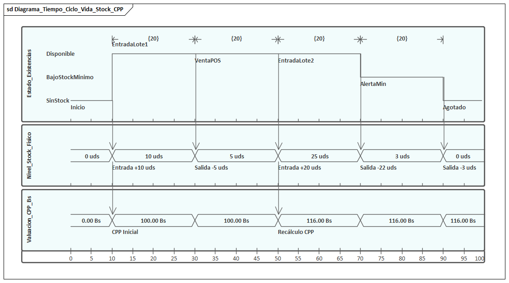

##### a) Especificación PlantUML (Ciclo Completo Corregido)

```plantuml
@startuml
robust "Estado de Existencias" as EstadoStock
concise "Nivel de Stock Físico" as NivelStock
concise "Valuación CPP (Bs)" as ValCPP

@0
EstadoStock is SinStock
NivelStock is "0 uds"
ValCPP is "0.00 Bs"

@10
EstadoStock is Disponible
NivelStock is "10 uds"
ValCPP is "100.00 Bs"
note bottom of EstadoStock : Entrada Lote 1 (+10 uds @ 100 Bs)

@30
EstadoStock is Disponible
NivelStock is "5 uds"
ValCPP is "100.00 Bs"
note bottom of NivelStock : Salida Venta POS (-5 uds)

@50
EstadoStock is Disponible
NivelStock is "25 uds"
ValCPP is "116.00 Bs"
note bottom of ValCPP
  Entrada Lote 2 (+20 uds @ 120 Bs)
  CPP = (5*100 + 20*120)/25 = 116.00 Bs
end note

@70
EstadoStock is BajoStockMinimo
NivelStock is "3 uds"
ValCPP is "116.00 Bs"
note bottom of EstadoStock : Salida Venta (-22 uds) | Alerta Automática <= 5 uds mín.

@90
EstadoStock is SinStock
NivelStock is "0 uds"
ValCPP is "116.00 Bs"
note bottom of EstadoStock : Venta Final (-3 uds) | Inventario Agotado

@100
EstadoStock is SinStock
NivelStock is "0 uds"
ValCPP is "116.00 Bs"
@enduml
```

##### b) Descripción Técnica y Dinámica de Transición en el Tiempo

El diagrama modela 3 líneas de vida sincronizadas que comparten la misma escala de tiempo horizontal ($t \in [0, 100]$):

1. **Línea de Vida de Estado Robusta (`Estado_Existencias`)**:
   - **`Disponible`**: Existencias operativas por encima del umbral de seguridad.
   - **`BajoStockMinimo`**: Existencias $\le 5\text{ unidades}$ (stock de seguridad configurado por variante/sucursal). Dispara alertas automáticas en el módulo de compras y aprovisionamiento.
   - **`SinStock`**: Existencias iguales a $0\text{ unidades}$. Inhabilita la venta física y bloquea la adición al carrito web/móvil.

2. **Línea de Vida de Valor Concisa (`Nivel_Stock_Fisico`)**:
   - Refleja el saldo cuantitativo de unidades en almacén: $0\text{ uds} \to 10\text{ uds} \to 5\text{ uds} \to 25\text{ uds} \to 3\text{ uds} \to 0\text{ uds}$.

3. **Línea de Vida de Valor Concisa (`Valuacion_CPP_Bs`)**:
   - Refleja el costo unitario valorizado bajo la fórmula legal/tributaria de Costo Promedio Ponderado ($CPP$):
     $$CPP_{nuevo} = \frac{(S_{actual} \times CPP_{actual}) + (Q_{entrada} \times P_{compra})}{S_{actual} + Q_{entrada}}$$
   - Las salidas por venta disminuyen las unidades físicas pero **no alteran** el costo unitario de valuación del inventario remanente.

| Tiempo ($t$) | Evento / Estímulo | Estado Existencias | Stock Físico | Valuación CPP (Bs) | Restricción / Observación |
| :---: | :--- | :---: | :---: | :---: | :--- |
| **0** | `Inicio` | `SinStock` | 0 uds | 0.00 Bs | Apertura de catálogo sin existencias iniciales. |
| **10** | `EntradaLote1` | `Disponible` | 10 uds | 100.00 Bs | Recepción Lote 1: 10 prendas a 100.00 Bs/ud. |
| **30** | `VentaPOS` | `Disponible` | 5 uds | 100.00 Bs | Venta presencial: -5 uds. Duración $\{20\}$. CPP no cambia. |
| **50** | `EntradaLote2` | `Disponible` | 25 uds | 116.00 Bs | Recepción Lote 2: 20 prendas a 120.00 Bs. Recálculo CPP: $\frac{5\times100 + 20\times120}{25} = 116.00$ Bs. |
| **70** | `AlertaMin` | `BajoStockMinimo` | 3 uds | 116.00 Bs | Venta: -22 uds. Stock $\le 5$ uds mínimas. Dispara alerta automática. |
| **90** | `Agotado` | `SinStock` | 0 uds | 116.00 Bs | Venta de las últimas 3 prendas. Stock agotado. |

##### c) Organización en el Repositorio de Enterprise Architect

- **Paquete Dedicado (Carpeta)**: `Model` $\to$ `diagramas de tiempo` (ID: 13)
- **Diagrama UML 2.5**: `Diagrama_Tiempo_Ciclo_Vida_Stock_CPP` (ID: 193, Tipo: `Timing`)
- **Elementos Modelados**:
  - `Estado_Existencias` (`TimeLine`, Subtipo: `State Lifeline`, Particiones: `SinStock`, `BajoStockMinimo`, `Disponible`)
  - `Nivel_Stock_Fisico` (`TimeLine`, Subtipo: `Value Lifeline`, Particiones: `0 uds`, `3 uds`, `5 uds`, `10 uds`, `25 uds`)
  - `Valuacion_CPP_Bs` (`TimeLine`, Subtipo: `Value Lifeline`, Particiones: `0.00 Bs`, `100.00 Bs`, `116.00 Bs`)
  - Conectores de estímulo/secuencia temporizados entre líneas de vida en $t=10, 30, 50, 70, 90$ con restricciones de duración estándar UML ($\{20\}$).


---

#### 3.2.4 Diagramas de Estado - Dominio del Sistema

##### a) Ciclo de Vida de la Cuenta de Usuario y Token OTP (Seguridad)

Modela los estados de seguridad de la cuenta frente a intentos de acceso y el ciclo de vida efímero del token de recuperación:

```plantuml
@startuml
[*] --> Creado_Activo : Registro exitoso (CU02) / Alta admin (CU04)

state Creado_Activo {
    [*] --> Operativo
    Operativo --> IntentosFallidos : 1 a 4 logins errados
    IntentosFallidos --> Operativo : Login exitoso (resetea a 0)
}

Creado_Activo --> Bloqueado_Por_Intentos : 5to login fallido consecutivo
Creado_Activo --> Inactivo : Baja preventiva por Administrador

Bloqueado_Por_Intentos --> Desbloqueo_Admin : Admin presiona 'Desbloquear' (CU04)
Desbloqueo_Admin --> Creado_Activo

Bloqueado_Por_Intentos --> OTP_Solicitado : Usuario pide recuperación (CU03)

state "Ciclo del Token OTP (15 min)" as CicloOTP {
    [*] --> OTP_Emitido : Generación de código criptográfico
    OTP_Emitido --> OTP_Validado : Ingreso correcto de 6 dígitos dentro de 15 min
    OTP_Emitido --> OTP_Expirado : Transcurren > 15 minutos sin canjear
    OTP_Emitido --> OTP_Revocado : 3 intentos erróneos de código
    OTP_Validado --> Clave_Restablecida : Nueva clave cifrada con Bcrypt
}

OTP_Solicitado --> CicloOTP
Clave_Restablecida --> Creado_Activo : Cuenta reactivada y clave actualizada
OTP_Expirado --> [*] : Requiere nueva solicitud
Inactivo --> Creado_Activo : Reactivación por Admin
@enduml
```

##### b) Ciclo de Vida del Producto e Inventario

Modela las transiciones del ciclo de vida de una prenda de vestir en la tienda:

```plantuml
@startuml
[*] --> Borrador : Creación de Ficha Técnica

state Borrador {
    [*] --> Incompleto
    Incompleto --> Completo : Carga de tallas, colores y fotos
}

Borrador --> Publicado : Aprobación de Catálogo
Publicado --> EnCampanaEstacional : Vinculación a Temporada

state Publicado {
    [*] --> ConStockDisponible
    ConStockDisponible --> StockCritico : Stock <= Stock Mínimo
    StockCritico --> Agotado : Stock = 0
    Agotado --> ConStockDisponible : Recepción de nuevo lote
}

Publicado --> EnLiquidacion : Fin de Temporada
EnLiquidacion --> Descatalogado : Retiro de Línea
Descatalogado --> [*]
@enduml
```

---

#### 3.2.13 Diagrama de Navegación del Sistema (Ciclo 1)

Modela el flujo de navegación entre vistas y pantallas para la plataforma web y móvil:

```plantuml
@startuml
state "Pantalla Login (/login)" as VistaLogin
state "Pantalla Registro (/registro)" as VistaRegistro
state "Solicitar OTP (/recuperar-password)" as VistaOlvido
state "Restablecer Clave (/reset-password)" as VistaReset
state "Dashboard Principal (/dashboard)" as VistaDashboard
state "Gestión Usuarios y Roles (/admin/usuarios)" as VistaUsuarios
state "Módulo Sucursales (/sucursales)" as VistaSucursales
state "Módulo Productos (/productos)" as VistaProductos
state "Módulo Inventario y Kardex (/inventario)" as VistaInventario
state "Módulo Temporadas (/temporadas)" as VistaTemporadas
state "Módulo Proveedores (/proveedores)" as VistaProveedores
state "Catálogo Público (/catalogo)" as VistaCatalogo
state "Ficha Detalle Prenda (/prenda/:id)" as VistaDetalle

[*] --> VistaLogin : Acceso al sistema
[*] --> VistaCatalogo : Visitante público
[*] --> VistaRegistro : Clic 'Crear Cuenta'

VistaLogin --> VistaRegistro : 'Registrarse como Cliente'
VistaRegistro --> VistaLogin : 'Ya tengo cuenta'
VistaRegistro --> VistaCatalogo : Registro Exitoso (Auto-login)

VistaLogin --> VistaOlvido : '¿Olvidaste tu contraseña?'
VistaOlvido --> VistaLogin : 'Regresar al Login'
VistaOlvido --> VistaReset : OTP despachado por correo
VistaReset --> VistaLogin : Clave restablecida exitosamente

VistaLogin --> VistaDashboard : Autenticación Exitosa (Admin / Empleado)
VistaLogin --> VistaCatalogo : Autenticación Exitosa (Cliente)

VistaDashboard --> VistaUsuarios : Menú 'Usuarios y Roles' (Solo Admin)
VistaUsuarios --> VistaDashboard : Volver

VistaDashboard --> VistaSucursales : Menú 'Sucursales'
VistaSucursales --> VistaDashboard : Volver

VistaDashboard --> VistaProductos : Menú 'Productos'
VistaProductos --> VistaDashboard : Volver

VistaDashboard --> VistaInventario : Menú 'Inventario y CPP'
VistaInventario --> VistaDashboard : Volver

VistaDashboard --> VistaTemporadas : Menú 'Temporadas' (CU07)
VistaTemporadas --> VistaDashboard : Volver

VistaDashboard --> VistaProveedores : Menú 'Proveedores' (CU08)
VistaProveedores --> VistaDashboard : Volver

VistaCatalogo --> VistaDetalle : Clic en Tarjeta de Prenda
VistaDetalle --> VistaCatalogo : Volver a Catálogo
@enduml
```

---

### 3.3 Diseño de Datos

#### 3.3.1 Diagrama de Clases de la Base de Datos (Modelo Lógico de Clases Persistentes / Objetos de Negocio)

Conforme al estándar **UML 2.5** (`UML 2.5.txt`, líneas 328-338) y el marco de diseño metodológico **Métrica v3** (estereotipo `<<Objeto de negocio>>`), el modelo de datos no se limita a un diagrama relacional plano de tablas, sino que se formaliza como un **Diagrama de Clases Persistentes de Base de Datos**. Cada clase representa un objeto de dominio con sus atributos fuertemente tipados, visibilidad encapsulada (`-`), métodos de persistencia y reglas de negocio (`+`), cardinalidades en los extremos, verbos semánticos directos, composiciones de ciclo de vida (`*--`) y agregaciones lógicas (`o--`).

```plantuml
@startuml
skinparam style strictuml
skinparam classAttributeIconSize 0
skinparam linetype ortho
skinparam nodesep 55
skinparam ranksep 65

skinparam class {
    BackgroundColor White
    BorderColor #2C3E50
    HeaderBackgroundColor #EAEDED
    BorderThickness 1.2
    ArrowColor #2C3E50
    ArrowThickness 1.2
}

' ==============================================================================
' DEFINICIÓN DE CLASES PERSISTENTES (OBJETOS DE NEGOCIO / ENTIDADES DE BD)
' ==============================================================================

class "Ciudad" as Ciudad <<Objeto de negocio>> {
    - id_ciudad : Integer
    - nombre_ciudad : String
    - departamento : String
    - creado_en : Timestamp
    __ Operaciones __
    + crear() : Boolean
    + actualizar() : Boolean
    + eliminar() : Boolean
    + encontrarPorId(id : Integer) : Ciudad
    + listarTodas() : List<Ciudad>
}

class "Sucursal" as Sucursal <<Objeto de negocio>> {
    - id_sucursal : Integer
    - id_ciudad : Integer
    - nombre_sucursal : String
    - direccion : String
    - latitud : Decimal
    - longitud : Decimal
    - telefono : String
    - capacidad_probadores : Integer
    - estado : String
    - creado_en : Timestamp
    __ Operaciones __
    + crear() : Boolean
    + actualizar() : Boolean
    + cambiarEstado(nuevoEstado : String) : Boolean
    + encontrarPorId(id : Integer) : Sucursal
    + listarPorCiudad(id_ciudad : Integer) : List<Sucursal>
}

class "Usuario" as Usuario <<Objeto de negocio>> {
    - id_usuario : Integer
    - id_sucursal : Integer
    - nombres : String
    - apellidos : String
    - email : String
    - password_hash : String
    - rol : String
    - estado_cuenta : String
    - intentos_fallidos : Integer
    - bloqueado_hasta : Timestamp
    - ultimo_acceso : Timestamp
    - creado_en : Timestamp
    __ Operaciones __
    + autenticar(email : String, pass : String) : Boolean
    + crear() : Boolean
    + actualizar() : Boolean
    + cambiarClave(nuevoHash : String) : Boolean
    + incrementarIntentosFallidos() : Integer
    + bloquearCuenta() : Boolean
    + registrarAccesoExitoso() : Boolean
    + encontrarPorEmail(email : String) : Usuario
}

class "TokenRecuperacion" as TokenRecup <<Objeto de negocio>> {
    - id_token : Integer
    - id_usuario : Integer
    - codigo_otp_hash : String
    - expiracion : Timestamp
    - utilizado : Boolean
    - intentos_verificacion : Integer
    - fecha_creacion : Timestamp
    __ Operaciones __
    + generarTokenOTP(id_user : Integer, otpHash : String) : Boolean
    + verificarOTP(codigoOtp : String) : Boolean
    + marcarComoUtilizado() : Boolean
    + estaExpirado() : Boolean
}

class "BitacoraAcceso" as Bitacora <<Objeto de negocio>> {
    - id_bitacora : Integer
    - id_usuario : Integer
    - ip_origen : String
    - user_agent : String
    - exitoso : Boolean
    - fecha_hora : Timestamp
    __ Operaciones __
    + registrarIngreso(id_user : Integer, ip : String, ok : Boolean) : Boolean
    + listarPorUsuario(id_user : Integer) : List<BitacoraAcceso>
}

class "Proveedor" as Proveedor <<Objeto de negocio>> {
    - id_proveedor : Integer
    - nit_identificacion : String
    - razon_social : String
    - contacto_nombre : String
    - telefono : String
    - email : String
    - terminos_pago : String
    - estado : String
    - creado_en : Timestamp
    __ Operaciones __
    + crear() : Boolean
    + actualizar() : Boolean
    + cambiarEstado(nuevoEstado : String) : Boolean
    + encontrarPorNit(nit : String) : Proveedor
    + listarActivos() : List<Proveedor>
}

class "Temporada" as Temporada <<Objeto de negocio>> {
    - id_temporada : Integer
    - codigo_campana : String
    - nombre_temporada : String
    - fecha_inicio : Date
    - fecha_fin : Date
    - descuento_liquidacion : Decimal
    - estado : String
    __ Operaciones __
    + crear() : Boolean
    + actualizar() : Boolean
    + verificarVigencia(fechaActual : Date) : Boolean
    + aplicarDescuento(descuento : Decimal) : Boolean
}

class "Categoria" as Categoria <<Objeto de negocio>> {
    - id_categoria : Integer
    - nombre_categoria : String
    - descripcion : String
    __ Operaciones __
    + crear() : Boolean
    + actualizar() : Boolean
    + encontrarPorId(id : Integer) : Categoria
    + listarTodas() : List<Categoria>
}

class "Marca" as Marca <<Objeto de negocio>> {
    - id_marca : Integer
    - nombre_marca : String
    __ Operaciones __
    + crear() : Boolean
    + actualizar() : Boolean
    + encontrarPorId(id : Integer) : Marca
    + listarTodas() : List<Marca>
}

class "Producto" as Producto <<Objeto de negocio>> {
    - id_producto : Integer
    - id_categoria : Integer
    - id_marca : Integer
    - id_temporada : Integer
    - id_proveedor : Integer
    - codigo_sku_base : String
    - nombre : String
    - descripcion : String
    - precio_venta_base : Decimal
    - genero : String
    - estado_publicacion : String
    - creado_en : Timestamp
    __ Operaciones __
    + crear() : Boolean
    + actualizar() : Boolean
    + cambiarEstadoPublicacion(estado : String) : Boolean
    + encontrarPorSku(sku : String) : Producto
    + calcularPrecioVenta() : Decimal
    + listarPorCategoria(id_cat : Integer) : List<Producto>
}

class "ProductoColor" as ProdColor <<Objeto de negocio>> {
    - id_prod_color : Integer
    - id_producto : Integer
    - color_nombre : String
    - codigo_hex : String
    __ Operaciones __
    + registrarColor(id_prod : Integer, color : String, hex : String) : Boolean
    + eliminarColor(id : Integer) : Boolean
    + listarPorProducto(id_prod : Integer) : List<ProductoColor>
}

class "ProductoTalla" as ProdTalla <<Objeto de negocio>> {
    - id_prod_talla : Integer
    - id_producto : Integer
    - talla : String
    __ Operaciones __
    + registrarTalla(id_prod : Integer, talla : String) : Boolean
    + eliminarTalla(id : Integer) : Boolean
    + listarPorProducto(id_prod : Integer) : List<ProductoTalla>
}

class "Inventario" as Inventario <<Objeto de negocio>> {
    - id_inventario : Integer
    - id_sucursal : Integer
    - id_producto : Integer
    - talla : String
    - color : String
    - stock_fisico : Integer
    - stock_reservado : Integer
    - stock_minimo : Integer
    - stock_maximo : Integer
    - ultimo_costo_unitario : Decimal
    - costo_promedio_ponderado : Decimal
    __ Operaciones __
    + registrarEntrada(cant : Integer, costo : Decimal) : Boolean
    + registrarSalida(cant : Integer) : Boolean
    + reservarStock(cant : Integer) : Boolean
    + liberarReserva(cant : Integer) : Boolean
    + calcularCPP(cant : Integer, costo : Decimal) : Decimal
    + consultarStockDisponible() : Integer
}

class "KardexMovimiento" as Kardex <<Objeto de negocio>> {
    - id_kardex : Integer
    - id_inventario : Integer
    - tipo_movimiento : String
    - cantidad : Integer
    - costo_unitario_mov : Decimal
    - saldo_cantidad : Integer
    - saldo_cpp : Decimal
    - descripcion_motivo : String
    - fecha_movimiento : Timestamp
    __ Operaciones __
    + asentarMovimiento() : Boolean
    + obtenerSaldoActual(id_inv : Integer) : Decimal
    + listarMovimientosPorInventario(id_inv : Integer) : List<KardexMovimiento>
}

' ==============================================================================
' ASOCIACIONES, VERBOS, CARDINALIDADES, COMPOSICIÓN Y AGREGACIÓN
' ==============================================================================

' Asociación simple territorial
Ciudad "1" -- "1..*" Sucursal : alberga / radica en >

' Asociación laboral y administrativa
Sucursal "0..1" -- "0..*" Usuario : emplea / labora en >

' Composición fuerte: ciclo de vida dependiente de Usuario (ON DELETE CASCADE)
Usuario "1" *-- "0..*" TokenRecup : emite / pertenece a >
Usuario "1" *-- "0..*" Bitacora : audita accesos en >

' Asociaciones de catalogación y aprovisionamiento (FK RESTRICT o SET NULL)
Categoria "1" -- "0..*" Producto : clasifica / es clasificado en >
Marca "1" -- "0..*" Producto : produce / pertenece a marca >
Temporada "0..1" -- "0..*" Producto : calendariza / se exhibe en >
Proveedor "0..1" -- "0..*" Producto : suministra / provisto por >

' Composición fuerte: variantes de color y talla son partes inseparables del Producto
Producto "1" *-- "1..*" ProdColor : compone variante color >
Producto "1" *-- "1..*" ProdTalla : compone variante talla >

' Agregación compartida: Sucursal y Producto agregan existencias de inventario
Sucursal "1" o-- "0..*" Inventario : custodia existencias en >
Producto "1" o-- "0..*" Inventario : cuantifica stock en >

' Composición fuerte: Los asientos contables de Kardex son inseparables del inventario
Inventario "1" *-- "1..*" Kardex : audita movimientos en >

@enduml
```

##### Matriz de Semántica de Relaciones, Cardinalidad e Integridad de Dominio

| Clase Origen | Clase Destino | Tipo de Relación | Cardinalidad | Verbo Semántico / Rol | Regla de Negocio e Integridad DDL |
| :--- | :--- | :--- | :---: | :--- | :--- |
| **Ciudad** | **Sucursal** | **Asociación** | `1` a `1..*` | *alberga / radica en* | Una ciudad puede albergar múltiples sucursales comerciales; una sucursal pertenece obligatoriamente a una ciudad (`ON DELETE RESTRICT`). |
| **Sucursal** | **Usuario** | **Asociación** | `0..1` a `0..*` | *emplea / labora en* | El personal operativo (cajeros, encargados) está asignado a una sucursal; los clientes o admins globales no tienen sucursal fija (`id_sucursal NULL`, `ON DELETE SET NULL`). |
| **Usuario** | **TokenRecuperacion** | **Composición (`*--`)** | `1` a `0..*` | *emite / pertenece a* | Los tokens OTP de recuperación tienen ciclo de vida dependiente del usuario emisor; si el usuario se destruye, los tokens se eliminan en cascada (`ON DELETE CASCADE`). |
| **Usuario** | **BitacoraAcceso** | **Composición (`*--`)** | `1` a `0..*` | *audita accesos en* | Las trazas de auditoría de inicio de sesión pertenecen exclusivamente a la identidad del usuario (`ON DELETE CASCADE`). |
| **Categoria** | **Producto** | **Asociación** | `1` a `0..*` | *clasifica / es clasificado en* | Una categoría taxonómica agrupa múltiples productos; un producto pertenece obligatoriamente a una categoría (`ON DELETE RESTRICT`). |
| **Marca** | **Producto** | **Asociación** | `1` a `0..*` | *produce / pertenece a marca* | Una marca manufactura múltiples prendas del catálogo; el producto requiere marca registrada (`ON DELETE RESTRICT`). |
| **Temporada** | **Producto** | **Asociación** | `0..1` a `0..*` | *calendariza / se exhibe en* | Las campañas estacionales calendarizan productos para promociones de liquidación; la asignación es opcional (`ON DELETE SET NULL`). |
| **Proveedor** | **Producto** | **Asociación** | `0..1` a `0..*` | *suministra / provisto por* | Un proveedor textil suministra lotes de confección de un producto base (`ON DELETE SET NULL`). |
| **Producto** | **ProductoColor** | **Composición (`*--`)** | `1` a `1..*` | *compone variante color* | Las especificaciones cromáticas (nombre y código HEX) son partes intrínsecas del producto; no tienen existencia independiente (`ON DELETE CASCADE`). |
| **Producto** | **ProductoTalla** | **Composición (`*--`)** | `1` a `1..*` | *compone variante talla* | Las especificaciones de tallaje textil (S, M, L, XL, etc.) son componentes inseparables del producto (`ON DELETE CASCADE`). |
| **Sucursal** | **Inventario** | **Agregación (`o--`)** | `1` a `0..*` | *custodia existencias en* | La sucursal mantiene y custodia existencias físicas en sus bodegas, pero las variantes de producto existen conceptualmente fuera de ella. |
| **Producto** | **Inventario** | **Agregación (`o--`)** | `1` a `0..*` | *cuantifica stock en* | El producto cuantifica sus existencias distribuidas a lo largo de la red de sucursales. |
| **Inventario** | **KardexMovimiento** | **Composición (`*--`)** | `1` a `1..*` | *audita movimientos en* | Cada asiento contable de Kardex (compras, ventas, traslados, mermas) pertenece de manera indivisible al registro de inventario valorado (`ON DELETE CASCADE`). |

---

---

#### 3.3.2 Mapeo Objeto-Relacional

| Concepto de Dominio / Objeto | Estrategia de Mapeo a PostgreSQL | Justificación Técnica de Diseño |
|:---|:---|:---|
| **Colores Multivaluados** | Tabla relacional normalizada `producto_colores` con FK a `productos` (1 a N). | Permite búsquedas indexadas de alta velocidad por código HEX exacto sin sobrecargar campos JSON planos. |
| **Tallas Disponibles** | Tabla relacional normalizada `producto_tallas` con FK a `productos` (1 a N). | Normalización en 3ra Forma Normal (3FN), facilitando integridad referencial en el inventario. |
| **Costo Promedio ($CPP$)** | Campo `DECIMAL(10,2)` en tabla `inventario` recalculado vía transacción atómica. | Precisión aritmética exacta requerida para auditorías impositivas en Bolivia (evita imprecisiones de `FLOAT`). |
| **Contraseñas** | Campo `VARCHAR(100)` almacenando la cadena hash generada con `bcrypt`. | Cumplimiento estricto del RNF01 de seguridad; garantiza que nunca se persista texto en claro. |
| **Tokens OTP de Recuperación** | Tabla `tokens_recuperacion` con hash del código de 6 dígitos y timestamp `expiracion`. | Expiración estricta de 15 minutos; el código OTP nunca se persiste en texto plano en BD. |

---

#### 3.3.3 Diseño de Datos Físico (Script DDL SQL en PostgreSQL)

```sql
-- ============================================================================
-- SCRIPT DDL: BASE DE DATOS FASHIONSTORE (CICLO 1: FUNDAMENTOS Y MÓDULOS BASE)
-- Motor: PostgreSQL 15+ | Esquema Normalizado 3FN
-- ============================================================================

CREATE TABLE ciudades (
    id_ciudad SERIAL PRIMARY KEY,
    nombre_ciudad VARCHAR(80) NOT NULL UNIQUE,
    departamento VARCHAR(80) NOT NULL,
    creado_en TIMESTAMP DEFAULT CURRENT_TIMESTAMP
);

CREATE TABLE sucursales (
    id_sucursal SERIAL PRIMARY KEY,
    id_ciudad INTEGER NOT NULL REFERENCES ciudades(id_ciudad) ON DELETE RESTRICT,
    nombre_sucursal VARCHAR(100) NOT NULL,
    direccion TEXT NOT NULL,
    latitud DECIMAL(10, 8) NOT NULL,
    longitud DECIMAL(11, 8) NOT NULL,
    telefono VARCHAR(20),
    capacidad_probadores INTEGER NOT NULL DEFAULT 4 CHECK (capacidad_probadores > 0),
    estado VARCHAR(20) NOT NULL DEFAULT 'OPERATIVA' CHECK (estado IN ('OPERATIVA', 'MANTENIMIENTO', 'CERRADA')),
    creado_en TIMESTAMP DEFAULT CURRENT_TIMESTAMP
);

CREATE TABLE usuarios (
    id_usuario SERIAL PRIMARY KEY,
    id_sucursal INTEGER REFERENCES sucursales(id_sucursal) ON DELETE SET NULL,
    nombres VARCHAR(100) NOT NULL,
    apellidos VARCHAR(100) NOT NULL,
    email VARCHAR(120) NOT NULL UNIQUE,
    password_hash VARCHAR(100) NOT NULL,
    rol VARCHAR(30) NOT NULL CHECK (rol IN ('ADMINISTRADOR', 'ENCARGADO_SUCURSAL', 'CAJERO', 'LOGISTICA', 'CLIENTE', 'PROVEEDOR')),
    estado_cuenta VARCHAR(30) NOT NULL DEFAULT 'ACTIVO' CHECK (estado_cuenta IN ('ACTIVO', 'INACTIVO', 'BLOQUEADO_POR_INTENTOS')),
    intentos_fallidos INTEGER NOT NULL DEFAULT 0,
    bloqueado_hasta TIMESTAMP,
    ultimo_acceso TIMESTAMP,
    creado_en TIMESTAMP DEFAULT CURRENT_TIMESTAMP
);

-- Tabla para tokens de recuperación de contraseña con código OTP temporal (CU03)
CREATE TABLE tokens_recuperacion (
    id_token SERIAL PRIMARY KEY,
    id_usuario INTEGER NOT NULL REFERENCES usuarios(id_usuario) ON DELETE CASCADE,
    codigo_otp_hash VARCHAR(100) NOT NULL,
    expiracion TIMESTAMP NOT NULL,
    utilizado BOOLEAN NOT NULL DEFAULT FALSE,
    intentos_verificacion INTEGER NOT NULL DEFAULT 0,
    fecha_creacion TIMESTAMP DEFAULT CURRENT_TIMESTAMP
);

CREATE TABLE bitacora_accesos (
    id_bitacora SERIAL PRIMARY KEY,
    id_usuario INTEGER REFERENCES usuarios(id_usuario) ON DELETE CASCADE,
    ip_origen VARCHAR(45) NOT NULL,
    user_agent TEXT,
    exitoso BOOLEAN NOT NULL,
    fecha_hora TIMESTAMP DEFAULT CURRENT_TIMESTAMP
);

CREATE TABLE proveedores (
    id_proveedor SERIAL PRIMARY KEY,
    nit_identificacion VARCHAR(30) NOT NULL UNIQUE,
    razon_social VARCHAR(150) NOT NULL,
    contacto_nombre VARCHAR(100),
    telefono VARCHAR(30),
    email VARCHAR(100),
    terminos_pago VARCHAR(50) DEFAULT 'CONTADO',
    estado VARCHAR(20) DEFAULT 'ACTIVO',
    creado_en TIMESTAMP DEFAULT CURRENT_TIMESTAMP
);

CREATE TABLE temporadas (
    id_temporada SERIAL PRIMARY KEY,
    codigo_campana VARCHAR(30) NOT NULL UNIQUE,
    nombre_temporada VARCHAR(100) NOT NULL,
    fecha_inicio DATE NOT NULL,
    fecha_fin DATE NOT NULL,
    descuento_liquidacion DECIMAL(5,2) DEFAULT 0.00,
    estado VARCHAR(30) DEFAULT 'VIGENTE' CHECK (estado IN ('PLANIFICADA', 'VIGENTE', 'LIQUIDACION', 'FINALIZADA')),
    CONSTRAINT chk_fechas_temporada CHECK (fecha_fin >= fecha_inicio)
);

CREATE TABLE categorias (
    id_categoria SERIAL PRIMARY KEY,
    nombre_categoria VARCHAR(80) NOT NULL UNIQUE,
    descripcion TEXT
);

CREATE TABLE marcas (
    id_marca SERIAL PRIMARY KEY,
    nombre_marca VARCHAR(80) NOT NULL UNIQUE
);

CREATE TABLE productos (
    id_producto SERIAL PRIMARY KEY,
    id_categoria INTEGER NOT NULL REFERENCES categorias(id_categoria) ON DELETE RESTRICT,
    id_marca INTEGER NOT NULL REFERENCES marcas(id_marca) ON DELETE RESTRICT,
    id_temporada INTEGER REFERENCES temporadas(id_temporada) ON DELETE SET NULL,
    id_proveedor INTEGER REFERENCES proveedores(id_proveedor) ON DELETE SET NULL,
    codigo_sku_base VARCHAR(50) NOT NULL UNIQUE,
    nombre VARCHAR(150) NOT NULL,
    descripcion TEXT,
    precio_venta_base DECIMAL(10, 2) NOT NULL CHECK (precio_venta_base > 0),
    genero VARCHAR(20) NOT NULL DEFAULT 'MASCULINO',
    estado_publicacion VARCHAR(30) DEFAULT 'PUBLICADO' CHECK (estado_publicacion IN ('BORRADOR', 'PUBLICADO', 'DESCATALOGADO')),
    creado_en TIMESTAMP DEFAULT CURRENT_TIMESTAMP
);

CREATE TABLE producto_colores (
    id_prod_color SERIAL PRIMARY KEY,
    id_producto INTEGER NOT NULL REFERENCES productos(id_producto) ON DELETE CASCADE,
    color_nombre VARCHAR(50) NOT NULL,
    codigo_hex VARCHAR(10) NOT NULL,
    CONSTRAINT uq_producto_color UNIQUE (id_producto, color_nombre)
);

CREATE TABLE producto_tallas (
    id_prod_talla SERIAL PRIMARY KEY,
    id_producto INTEGER NOT NULL REFERENCES productos(id_producto) ON DELETE CASCADE,
    talla VARCHAR(20) NOT NULL,
    CONSTRAINT uq_producto_talla UNIQUE (id_producto, talla)
);

CREATE TABLE inventario (
    id_inventario SERIAL PRIMARY KEY,
    id_sucursal INTEGER NOT NULL REFERENCES sucursales(id_sucursal) ON DELETE CASCADE,
    id_producto INTEGER NOT NULL REFERENCES productos(id_producto) ON DELETE CASCADE,
    talla VARCHAR(20) NOT NULL,
    color VARCHAR(50) NOT NULL,
    stock_fisico INTEGER NOT NULL DEFAULT 0 CHECK (stock_fisico >= 0),
    stock_reservado INTEGER NOT NULL DEFAULT 0 CHECK (stock_reservado >= 0),
    stock_minimo INTEGER NOT NULL DEFAULT 5 CHECK (stock_minimo >= 0),
    stock_maximo INTEGER NOT NULL DEFAULT 100 CHECK (stock_maximo >= stock_minimo),
    ultimo_costo_unitario DECIMAL(10, 2) NOT NULL DEFAULT 0.00,
    costo_promedio_ponderado DECIMAL(10, 2) NOT NULL DEFAULT 0.00,
    CONSTRAINT uq_inventario_variante UNIQUE (id_sucursal, id_producto, talla, color),
    CONSTRAINT chk_stock_valido CHECK (stock_fisico >= stock_reservado)
);

CREATE TABLE kardex_movimientos (
    id_kardex SERIAL PRIMARY KEY,
    id_inventario INTEGER NOT NULL REFERENCES inventario(id_inventario) ON DELETE CASCADE,
    tipo_movimiento VARCHAR(30) NOT NULL CHECK (tipo_movimiento IN ('COMPRA', 'VENTA', 'RESERVA', 'AJUSTE_MERMA', 'TRANSFERENCIA_ENTRADA', 'TRANSFERENCIA_SALIDA')),
    cantidad INTEGER NOT NULL,
    costo_unitario_mov DECIMAL(10, 2) NOT NULL,
    saldo_cantidad INTEGER NOT NULL,
    saldo_cpp DECIMAL(10, 2) NOT NULL,
    descripcion_motivo VARCHAR(200),
    fecha_movimiento TIMESTAMP DEFAULT CURRENT_TIMESTAMP
);

-- Índices de alto rendimiento para búsquedas omnicanales
CREATE INDEX idx_productos_sku ON productos(codigo_sku_base);
CREATE INDEX idx_productos_categoria ON productos(id_categoria);
CREATE INDEX idx_inventario_sucursal ON inventario(id_sucursal, id_producto);
CREATE INDEX idx_inventario_stock_disp ON inventario((stock_fisico - stock_reservado));
```

---

#### 3.3.4 Población de Datos (Script DML SQL en PostgreSQL)

```sql
-- ============================================================================
-- SCRIPT DML: POBLACIÓN DE DATOS SEMILLA PARA EL CICLO 1
-- Incluye Ciudades de Bolivia, Sucursales, Usuarios con BCrypt, Ropa Masculina,
-- Colores Multivaluados, Tallas e Inventario con Costo Promedio Ponderado
-- ============================================================================

-- 1. Ciudades
INSERT INTO ciudades (nombre_ciudad, departamento) VALUES
('Santa Cruz de la Sierra', 'Santa Cruz'),
('La Paz', 'La Paz'),
('Cochabamba', 'Cochabamba');

-- 2. Sucursales
INSERT INTO sucursales (id_ciudad, nombre_sucursal, direccion, latitud, longitud, telefono, capacidad_probadores) VALUES
(1, 'Sucursal Equipetrol', 'Av. San Martín #450, entre 3er y 4to anillo', -17.76823000, -63.18342000, '3-3445566', 6),
(1, 'Sucursal Centro', 'Calle 21 de Mayo esq. Ayacucho', -17.78312000, -63.18210000, '3-3332211', 4),
(2, 'Sucursal Calacoto', 'Av. Ballivián #1200, Calle 18', -16.53982000, -68.08921000, '2-2778899', 5),
(3, 'Sucursal El Prado', 'Av. Ballivián #600, El Prado', -17.38921000, -66.15672000, '4-4223344', 4);

-- 3. Usuarios del Sistema (Contraseña hash: 'Admin123*' cifrada con bcrypt)
-- Hash generado: $2b$12$e8Y4vFz7BvK8/9zD6x1Q4uS0.1234567890abcdefghijklmnopqrstu
INSERT INTO usuarios (id_sucursal, nombres, apellidos, email, password_hash, rol, estado_cuenta, intentos_fallidos) VALUES
(NULL, 'Alberto', 'Delgado', 'alberto.delgado@store.bo', '$2b$12$e8Y4vFz7BvK8/9zD6x1Q4uS0.1234567890abcdefghijklmnopqrstu', 'ADMINISTRADOR', 'ACTIVO', 0),
(NULL, 'Andy', 'Mujica', 'andy.mujica@store.bo', '$2b$12$e8Y4vFz7BvK8/9zD6x1Q4uS0.1234567890abcdefghijklmnopqrstu', 'ADMINISTRADOR', 'ACTIVO', 0),
(1, 'Carlos', 'Morales', 'carlos.morales@store.bo', '$2b$12$e8Y4vFz7BvK8/9zD6x1Q4uS0.1234567890abcdefghijklmnopqrstu', 'ENCARGADO_SUCURSAL', 'ACTIVO', 0),
(1, 'Javier', 'Roca', 'javier.roca@store.bo', '$2b$12$e8Y4vFz7BvK8/9zD6x1Q4uS0.1234567890abcdefghijklmnopqrstu', 'CAJERO', 'BLOQUEADO_POR_INTENTOS', 5),
(NULL, 'Mateo', 'Suarez', 'mateo.logistica@store.bo', '$2b$12$e8Y4vFz7BvK8/9zD6x1Q4uS0.1234567890abcdefghijklmnopqrstu', 'LOGISTICA', 'ACTIVO', 0),
(NULL, 'Rodrigo', 'Paz', 'rodrigo.cliente@gmail.com', '$2b$12$e8Y4vFz7BvK8/9zD6x1Q4uS0.1234567890abcdefghijklmnopqrstu', 'CLIENTE', 'ACTIVO', 0);

-- Semilla de tokens de recuperación OTP (CU03)
INSERT INTO tokens_recuperacion (id_usuario, codigo_otp_hash, expiracion, utilizado, intentos_verificacion) VALUES
(6, '$2b$12$e8Y4vFz7BvK8/9zD6x1Q4uS0.1234567890abcdefghijklmnopqrstu', CURRENT_TIMESTAMP + INTERVAL '15 MINUTE', FALSE, 0);

-- 4. Proveedores Textiles
INSERT INTO proveedores (nit_identificacion, razon_social, contacto_nombre, telefono, email, terminos_pago) VALUES
('1028392019', 'Confecciones Andina SA', 'Juan Paredes', '+591 70012345', 'ventas@andina.com.bo', 'CREDITO_30_DIAS'),
('9038472011', 'Hilanderías del Sur SRL', 'Marcos Vaca', '+591 71098765', 'contacto@hilasur.bo', 'CONTADO'),
('3829104018', 'Importadora Textil Italiana', 'Gianluca Rossi', '+591 72055443', 'grossi@textilitaliana.com', 'CREDITO_60_DIAS');

-- 5. Temporadas Comerciales
INSERT INTO temporadas (codigo_campana, nombre_temporada, fecha_inicio, fecha_fin, descuento_liquidacion, estado) VALUES
('SS-2026', 'Primavera - Verano 2026', '2026-08-01', '2027-01-31', 0.00, 'VIGENTE'),
('FW-2026', 'Otoño - Invierno 2026', '2026-02-01', '2026-07-31', 25.00, 'LIQUIDACION');

-- 6. Categorías y Marcas
INSERT INTO categorias (nombre_categoria, descripcion) VALUES
('Camisas Formales', 'Camisas ejecutivas y de vestir en algodón peinado y lino'),
('Pantalones Casuales', 'Pantalones estilo chino, gabardina y corte clásico'),
('Trajes y Blazers', 'Sacos, chaquetas y trajes de dos piezas en lana fría'),
('Calzado Ejecutivo', 'Zapatos Oxford, Derby y mocasines de cuero legítimo');

INSERT INTO marcas (nombre_marca) VALUES
('Oxford Heritage'),
('Urban Tailor'),
('Sartorial Milano'),
('Bocaccio Leather');

-- 7. Productos (Prendas Masculinas)
INSERT INTO productos (id_categoria, id_marca, id_temporada, id_proveedor, codigo_sku_base, nombre, descripcion, precio_venta_base, genero) VALUES
(1, 1, 1, 1, 'SHIRT-SLIM-001', 'Camisa Oxford Slim Fit', 'Camisa de corte entallado en 100% algodón egipcio, cuello italiano', 280.00, 'MASCULINO'),
(2, 2, 1, 2, 'PANT-CHINO-002', 'Pantalón Chino Gabardina', 'Pantalón casual de gabardina elastizada con bolsillos traseros ojales', 320.00, 'MASCULINO'),
(3, 3, 1, 3, 'BLAZ-LINO-003', 'Blazer de Lino Casual', 'Chaqueta ligera desestructurada de lino ideal para clima templado y cálido', 650.00, 'MASCULINO');

-- 8. Colores Multivaluados
INSERT INTO producto_colores (id_producto, color_nombre, codigo_hex) VALUES
(1, 'Azul Marino', '#000080'),
(1, 'Blanco Óptico', '#FFFFFF'),
(1, 'Celeste Cielo', '#87CEEB'),
(2, 'Beige Arena', '#F5F5DC'),
(2, 'Azul Noche', '#191970'),
(2, 'Verde Oliva', '#556B2F'),
(3, 'Azul Cobalto', '#0047AB'),
(3, 'Gris Plomo', '#708090');

-- 9. Tallas Normalizadas
INSERT INTO producto_tallas (id_producto, talla) VALUES
(1, 'S'), (1, 'M'), (1, 'L'), (1, 'XL'),
(2, '30'), (2, '32'), (2, '34'), (2, '36'),
(3, '38'), (3, '40'), (3, '42');

-- 10. Inventario con Costo Unitario y Costo Promedio Ponderado (CPP)
-- Ejemplo real demostrativo:
-- Camisa Oxford Slim Fit (Talla M, Azul Marino) en Sucursal Equipetrol:
-- Lote 1: 15 unidades a 90 Bs = 1350 Bs
-- Lote 2: 20 unidades a 120 Bs = 2400 Bs
-- Total unidades: 35 | Costo Total: 3750 Bs | CPP = 3750 / 35 = 107.14 Bs | Último Costo = 120.00 Bs
INSERT INTO inventario (id_sucursal, id_producto, talla, color, stock_fisico, stock_reservado, stock_minimo, stock_maximo, ultimo_costo_unitario, costo_promedio_ponderado) VALUES
(1, 1, 'M', 'Azul Marino', 35, 5, 10, 100, 120.00, 107.14),
(1, 1, 'L', 'Blanco Óptico', 25, 0, 5, 80, 110.00, 110.00),
(1, 2, '32', 'Beige Arena', 20, 2, 5, 60, 140.00, 135.00),
(2, 1, 'M', 'Azul Marino', 15, 0, 5, 50, 115.00, 115.00),
(3, 3, '40', 'Gris Plomo', 8, 1, 2, 30, 320.00, 310.00);

-- 11. Asientos de Kardex Inicial
INSERT INTO kardex_movimientos (id_inventario, tipo_movimiento, cantidad, costo_unitario_mov, saldo_cantidad, saldo_cpp, descripcion_motivo) VALUES
(1, 'COMPRA', 15, 90.00, 15, 90.00, 'Ingreso Lote Inicial Fac-101'),
(1, 'COMPRA', 20, 120.00, 35, 107.14, 'Ingreso Segundo Lote Fac-205 - Recálculo CPP');
```

---

## 4. Flujo de Trabajo: Implementación

### 4.1 Selección de la Plataforma de Software

Conforme al requerimiento del enunciado y las notas de clase, se selecciona el siguiente stack tecnológico de alta eficiencia:
- **Backend**: **Python 3.11+ con FastAPI**. Permite arquitectura asíncrona no bloqueante (ASGI), serialización tipada y validación con Pydantic, e inyección nativa de dependencias. Expone la documentación automática OpenAPI en `/docs`.
- **Frontend Web**: **Angular 17+**. Basado en TypeScript, componentes reactivos, inyección de dependencias y modularidad estricta para la SPA administrativa y el catálogo web.
- **Aplicación Móvil**: **Flutter 3.x con Dart**. Compilación nativa para Android e iOS desde un solo repositorio, con soporte para ARCore y sensores de cámara.
- **Base de Datos**: **PostgreSQL 15+**. Motor relacional con integridad transaccional ACID, índices B-Tree y soporte geoespacial.
- **Contenedores**: **Docker & Docker Compose** para aislamiento de entornos y despliegue continuo en la nube (Render / Railway).

---

### 4.2 Implementación de la Arquitectura del Sistema Principal

La arquitectura del sistema backend sigue el patrón de **Arquitectura de 3 Capas (Three-Tier Architecture)** desacoplada y orientada a componentes modulares, tal como se especifica en el marco metodológico del proyecto. Esta organización garantiza alta cohesión, bajo acoplamiento, escalabilidad horizontal e independencia de persistencia y servicios externos.

A continuación se exhibe la estructura de carpetas física del backend:

```
fashionstore-backend/
├── app/
│   ├── core/                  # Configuraciones globales, seguridad JWT, base de datos
│   │   ├── config.py          # Variables de entorno (Pydantic Settings)
│   │   ├── security.py        # Hashing bcrypt y generación/validación JWT
│   │   └── database.py        # Sesión async SQLAlchemy y pool de conexiones
│   ├── modules/               # Módulos desacoplados del sistema (Subsistemas)
│   │   ├── auth/              # S01: Autenticación, Registro y Recuperación OTP (CU01, CU02, CU03)
│   │   ├── usuarios/          # S01: Gestión de Usuarios y Roles RBAC (CU04)
│   │   ├── sucursales/        # S02: Sucursales, Ciudades y GPS Probadores (CU05)
│   │   ├── productos/         # S03: Prendas, Tallas y Colores (CU06)
│   │   ├── temporadas/        # S03: Temporadas y Colecciones (CU07)
│   │   ├── proveedores/       # S04: Proveedores Textiles y Control NIT (CU08)
│   │   ├── inventario/        # S05: Control Multi-Sucursal y Algoritmo CPP (CU09)
│   │   └── catalogo/          # S03: Catálogo y Disponibilidad por Tienda (CU10)
│   └── main.py                # Punto de entrada ASGI, middlewares CORS y montaje de routers
├── migrations/                # Control de versiones de base de datos con Alembic
├── docker-compose.yml         # Orquestación de contenedores locales
└── Dockerfile                 # Imagen de despliegue productivo para nube
```

#### 4.2.1 Diagrama de Componentes: Sistema Principal (Arquitectura de 3 Capas)

El sistema global se estructura en 3 niveles de abstracción:
1. **Capa de Presentación**: Contiene los clientes frontend autónomos (`Interfaz Web Cliente - Angular 17+ SPA`, `Interfaz Móvil - Flutter 3.x` e `Interfaz Administrativa POS / Backoffice`). Se comunican de forma asíncrona mediante HTTPS / REST con payloads JSON.
2. **Capa de Lógica de Negocio**: Orquestada por el gateway ASGI FastAPI, alberga los 5 subsistemas funcionales desacoplados que resuelven los casos de uso empresariales.
3. **Capa de Persistencia y Servicios**: Subdividida en **BBDD** (Servidor PostgreSQL 15+ con motor transaccional ACID y ORM SQLAlchemy 2.0 Async) y **Servicios** externos (Servicio SMTP transaccional para despacho de códigos OTP y Almacenamiento Cloud / CDN para catálogo de imágenes).

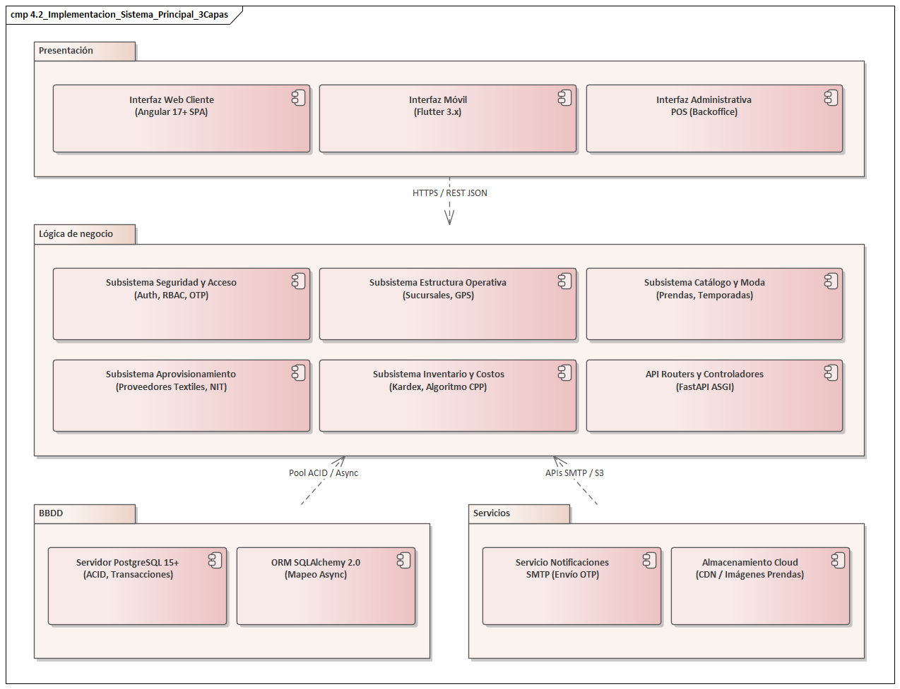

```plantuml
@startuml Diagrama_Componentes_Sistema_Principal_3Capas
title Diagrama de Implementación: Sistema Principal (Arquitectura de 3 Capas)
skinparam componentStyle uml2

package "Presentación" {
  component [Interfaz Web Cliente\n(Angular 17+ SPA)] as WebUI
  component [Interfaz Móvil\n(Flutter 3.x)] as MobileUI
  component [Interfaz Administrativa\nPOS (Backoffice)] as AdminUI
}

package "Lógica de negocio" {
  component [API Routers y Controladores\n(FastAPI ASGI)] as APIRouters
  component [Subsistema Seguridad y Acceso\n(Auth, RBAC, OTP)] as SubSeguridad
  component [Subsistema Estructura Operativa\n(Sucursales, GPS)] as SubSucursales
  component [Subsistema Catálogo y Moda\n(Prendas, Temporadas)] as SubCatalogo
  component [Subsistema Aprovisionamiento\n(Proveedores Textiles, NIT)] as SubProveedores
  component [Subsistema Inventario y Costos\n(Kardex, Algoritmo CPP)] as SubInventario
}

package "BBDD" {
  component [Servidor PostgreSQL 15+\n(ACID, Transacciones)] as DBServer
  component [ORM SQLAlchemy 2.0\n(Mapeo Async)] as ORM
}

package "Servicios" {
  component [Servicio Notificaciones\nSMTP (Envío OTP)] as SMTPService
  component [Almacenamiento Cloud\n(CDN / Imágenes Prendas)] as CDNService
}

WebUI ..> APIRouters : HTTPS / REST JSON
MobileUI ..> APIRouters : HTTPS / REST JSON
AdminUI ..> APIRouters : HTTPS / REST JSON

APIRouters ..> SubSeguridad
APIRouters ..> SubSucursales
APIRouters ..> SubCatalogo
APIRouters ..> SubProveedores
APIRouters ..> SubInventario

"Lógica de negocio" ..> "BBDD" : Pool ACID / Async
"Lógica de negocio" ..> "Servicios" : APIs SMTP / S3
@enduml
```

---

### 4.3 Implementación de la Arquitectura del Sub Sistema

El sistema empresarial se compone de **5 subsistemas altamente cohesionados**, comunicados mediante interfaces de componentes estandarizadas según el patrón *ball-and-socket* (interfaces provistas / lollipop e interfaces requeridas / socket).

#### 4.3.0 Integración de los 5 Subsistemas con Interfaces Provistas y Requeridas

El **Subsistema de Inventario y Costos** actúa como núcleo operativo central de la cadena de valor, integrando:
- **`IDisponibilidadStock`**: Proporcionada por Inventario para que el Catálogo consulte existencias en tiempo real por sucursal y variante.
- **`ILoteCompraProveedor`**: Proporcionada por Aprovisionamiento para liquidar compras textiles con NIT e ingresar lotes al almacén.
- **`ISucursalAlmacen`**: Proporcionada por Estructura Operativa para asignar existencias a bodegas de sucursal física.
- **`ISeguridadRBAC`**: Proporcionada por Seguridad y Acceso para autorizar y autenticar cada transacción con tokens JWT y roles.

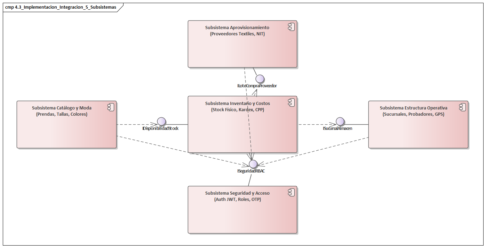

```plantuml
@startuml Diagrama_Integracion_5_Subsistemas
title Integración de los 5 Subsistemas (Interfaces Ball-and-Socket)
skinparam componentStyle uml2

component [Subsistema Catálogo y Moda\n(Prendas, Tallas, Colores)] as SubCat
component [Subsistema Inventario y Costos\n(Stock Físico, Kardex, CPP)] as SubInv
component [Subsistema Aprovisionamiento\n(Proveedores Textiles, NIT)] as SubProv
component [Subsistema Estructura Operativa\n(Sucursales, Probadores, GPS)] as SubSuc
component [Subsistema Seguridad y Acceso\n(Auth JWT, Roles, OTP)] as SubSeg

interface "IDisponibilidadStock" as ifStock
interface "ILoteCompraProveedor" as ifLote
interface "ISucursalAlmacen" as ifSuc
interface "ISeguridadRBAC" as ifAuth

' Provistas (Lollipop)
SubInv -up- ifStock
SubProv -down- ifLote
SubSuc -left- ifSuc
SubSeg -up- ifAuth

' Requeridas (Socket)
SubCat -( ifStock : Consulta Stock
SubInv -( ifLote : Recepción Lote
SubInv -( ifSuc : Ubicación Almacén
SubCat -( ifAuth : Validación Sesión
SubInv -( ifAuth : Validación Sesión
SubSuc -( ifAuth : Validación Sesión
SubProv -( ifAuth : Validación Sesión
@enduml
```

---

#### 4.3.1 Sub Sistema 1: Seguridad y Control de Acceso RBAC (M01 - CU01, CU02, CU03, CU04)

Este subsistema encapsula la autenticación criptográfica con JWT, el control de acceso basado en roles (RBAC) con mitigación OWASP (bloqueo por 5 intentos erróneos durante 30 min) y la emisión de tokens OTP criptográficos de 6 dígitos con validez de 15 minutos.

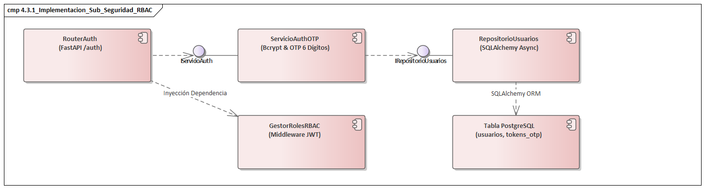

```plantuml
@startuml Diagrama_Componentes_Seguridad_RBAC
title Implementación: Subsistema Seguridad y Control de Acceso RBAC
skinparam componentStyle uml2

component [RouterAuth\n(FastAPI /auth)] as RouterAuth
interface "IServicioAuth" as IServAuth
component [ServicioAuthOTP\n(Bcrypt & OTP 6 Dígitos)] as ServAuth
interface "IRepositorioUsuarios" as IRepoUser
component [RepositorioUsuarios\n(SQLAlchemy Async)] as RepoUser
component [GestorRolesRBAC\n(Middleware JWT)] as RBACMiddleware
component [Tabla PostgreSQL\n(usuarios, tokens_otp)] as DBTable

RouterAuth -( IServAuth
ServAuth -up- IServAuth
ServAuth -( IRepoUser
RepoUser -up- IRepoUser

RouterAuth ..> RBACMiddleware : Inyección Dependencia
RepoUser ..> DBTable : SQLAlchemy ORM
@enduml
```

##### Implementación en Código Backend (FastAPI + SQLAlchemy):

```python
# app/modules/auth/service.py
import secrets
from datetime import datetime, timedelta, timezone
from passlib.context import CryptContext
from sqlalchemy.ext.asyncio import AsyncSession
from fastapi import HTTPException, status
from app.modules.auth.repository import AuthRepository
from app.modules.auth.schemas import SolicitarOtpRequest, ResetPasswordOtpRequest

pwd_context = CryptContext(schemes=["bcrypt"], deprecated="auto")

class AuthService:
    def __init__(self, db: AsyncSession):
        self.repo = AuthRepository(db)

    async def registrar_intento_fallido(self, email: str) -> None:
        """Incrementa fallos y bloquea automáticamente al 5to intento erróneo"""
        user = await self.repo.obtener_por_email(email)
        if user:
            user.intentos_fallidos += 1
            if user.intentos_fallidos >= 5:
                user.estado_cuenta = "BLOQUEADO_POR_INTENTOS"
                user.bloqueado_hasta = datetime.now(timezone.utc) + timedelta(minutes=30)
            await self.repo.commit()

    async def solicitar_otp_recuperacion(self, request: SolicitarOtpRequest) -> dict:
        """Genera un código criptográfico de 6 dígitos con ventana de validez de 15 minutos"""
        user = await self.repo.obtener_por_email(request.email)
        # Mitigación OWASP: Respuesta neutra sin filtrar existencia de usuario
        if user and user.estado_cuenta != "INACTIVO":
            codigo_otp = f"{secrets.randbelow(900000) + 100000}"
            otp_hash = pwd_context.hash(codigo_otp)
            expiracion = datetime.now(timezone.utc) + timedelta(minutes=15)
            
            await self.repo.guardar_token_otp(
                usuario_id=user.id_usuario,
                otp_hash=otp_hash,
                expiracion=expiracion
            )
            # Despachar correo asíncrono con el código OTP
            await self.repo.enviar_email_otp(user.email, codigo_otp, minutos=15)

        return {"mensaje": "Si el correo está registrado, se ha enviado un código de verificación de 6 dígitos."}

    async def restablecer_password_con_otp(self, request: ResetPasswordOtpRequest) -> dict:
        """Valida el OTP de 6 dígitos, actualiza el hash bcrypt y desbloquea la cuenta"""
        user = await self.repo.obtener_por_email(request.email)
        if not user:
            raise HTTPException(status_code=status.HTTP_400_BAD_REQUEST, detail="Solicitud inválida.")

        token_record = await self.repo.obtener_ultimo_token_otp(user.id_usuario)
        now = datetime.now(timezone.utc)

        if not token_record or token_record.utilizado or token_record.expiracion < now:
            raise HTTPException(status_code=status.HTTP_400_BAD_REQUEST, detail="El código OTP ha expirado o es inválido.")

        if token_record.intentos_verificacion >= 3:
            raise HTTPException(status_code=status.HTTP_400_BAD_REQUEST, detail="Código bloqueado por superar 3 intentos.")

        if not pwd_context.verify(request.codigo_otp, token_record.codigo_otp_hash):
            token_record.intentos_verificacion += 1
            await self.repo.commit()
            raise HTTPException(status_code=status.HTTP_400_BAD_REQUEST, detail="Código OTP incorrecto.")

        # Cifrar nueva contraseña con Bcrypt (cost factor 12)
        user.password_hash = pwd_context.hash(request.nueva_password)
        user.intentos_fallidos = 0
        user.bloqueado_hasta = None
        user.estado_cuenta = "ACTIVO"
        token_record.utilizado = True

        await self.repo.commit()
        return {"mensaje": "Contraseña restablecida exitosamente. Ya puede iniciar sesión."}
```

---

#### 4.3.2 Sub Sistema 2: Estructura Operativa y Sucursales (M02 - CU05)

Administra las ciudades, direcciones, horarios, coordenadas GPS y disponibilidad física de probadores para reservas omnicanal en cada tienda.

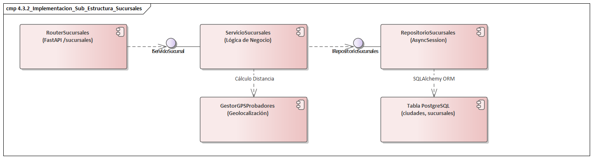

```plantuml
@startuml Diagrama_Componentes_Estructura_Sucursales
title Implementación: Subsistema Estructura Operativa y Sucursales
skinparam componentStyle uml2

component [RouterSucursales\n(FastAPI /sucursales)] as RouterSuc
interface "IServicioSucursal" as IServSuc
component [ServicioSucursales\n(Lógica de Negocio)] as ServSuc
interface "IRepositorioSucursales" as IRepoSuc
component [RepositorioSucursales\n(AsyncSession)] as RepoSuc
component [GestorGPSProbadores\n(Geolocalización)] as GPSManager
component [Tabla PostgreSQL\n(ciudades, sucursales)] as DBTable

RouterSuc -( IServSuc
ServSuc -up- IServSuc
ServSuc -( IRepoSuc
RepoSuc -up- IRepoSuc

ServSuc ..> GPSManager : Cálculo Distancia
RepoSuc ..> DBTable : SQLAlchemy ORM
@enduml
```

##### Implementación en Código Backend:

```python
# app/modules/sucursales/service.py
from sqlalchemy.ext.asyncio import AsyncSession
from fastapi import HTTPException, status
from app.modules.sucursales.repository import SucursalesRepository
from app.modules.sucursales.schemas import SucursalCreate, SucursalResponse

class SucursalesService:
    def __init__(self, db: AsyncSession):
        self.repo = SucursalesRepository(db)

    async def registrar_sucursal(self, dto: SucursalCreate) -> SucursalResponse:
        """Crea una nueva sucursal con validación de coordenadas geográficas y cupo de probadores"""
        ciudad = await self.repo.obtener_ciudad_por_id(dto.id_ciudad)
        if not ciudad or not ciudad.activo:
            raise HTTPException(status_code=status.HTTP_404_NOT_FOUND, detail="Ciudad no habilitada.")

        if dto.probadores_disponibles < 1:
            raise HTTPException(status_code=status.HTTP_400_BAD_REQUEST, detail="Debe asignar al menos 1 probador físico.")

        sucursal = await self.repo.crear_sucursal(dto)
        await self.repo.commit()
        return SucursalResponse.from_orm(sucursal)

    async def listar_sucursales_cercanas(self, lat: float, lon: float, radio_km: float = 15.0):
        """Filtra sucursales geolocalizadas dentro del radio del cliente mediante fórmula de Haversine"""
        return await self.repo.buscar_por_radio_haversine(lat, lon, radio_km)
```

---

#### 4.3.3 Sub Sistema 3: Catálogo y Moda Masculina (M03 y M04 - CU06, CU07, CU10)

Gestiona la matriz de prendas masculinas, colecciones por temporada, categorización multinivel y las variantes ortogonales de **Talla** (S, M, L, XL) y **Color** (nombre + código HEX).


```plantuml
@startuml Diagrama_Componentes_Catalogo_Moda
title Implementación: Subsistema Catálogo y Moda Masculina
skinparam componentStyle uml2

component [RouterCatalogo\n(FastAPI /catalogo)] as RouterCat
interface "IServicioCatalogo" as IServCat
component [ServicioCatalogo\n(Gestor Moda Masculina)] as ServCat
interface "IRepositorioCatalogo" as IRepoCat
component [RepositorioCatalogo\n(Consultas Complejas)] as RepoCat
component [GestorVariantes\n(Tallas y HEX Colores)] as VarManager
component [Tabla PostgreSQL\n(productos, tallas, colores)] as DBTable

RouterCat -( IServCat
ServCat -up- IServCat
ServCat -( IRepoCat
RepoCat -up- IRepoCat

ServCat ..> VarManager : Mapeo Variantes
RepoCat ..> DBTable : SQLAlchemy ORM
@enduml
```

##### Implementación en Código Backend:

```python
# app/modules/catalogo/service.py
from sqlalchemy.ext.asyncio import AsyncSession
from fastapi import HTTPException, status
from app.modules.productos.repository import ProductosRepository
from app.modules.catalogo.schemas import CatalogoFiltroRequest, PrendaDetalleResponse

class CatalogoService:
    def __init__(self, db: AsyncSession):
        self.repo = ProductosRepository(db)

    async def consultar_prendas_catalogo(self, filtros: CatalogoFiltroRequest):
        """Retorna prendas activas con sus variantes y stock físico disponible por sucursal"""
        prendas = await self.repo.obtener_con_variantes_y_stock(
            categoria_id=filtros.id_categoria,
            temporada_id=filtros.id_temporada,
            sucursal_id=filtros.id_sucursal,
            solo_con_stock=filtros.solo_disponibles
        )
        return [PrendaDetalleResponse.from_orm(p) for p in prendas]

    async def obtener_detalle_variante(self, id_producto: int, talla: str, color_hex: str):
        variante = await self.repo.obtener_variante_especifica(id_producto, talla, color_hex)
        if not variante:
            raise HTTPException(status_code=status.HTTP_404_NOT_FOUND, detail="Variante no encontrada.")
        return variante
```

---

#### 4.3.4 Sub Sistema 4: Aprovisionamiento y Proveedores Textiles (M05 - CU08)

Encargado del registro, calificación comercial y validación tributaria (NIT) de las empresas proveedoras de telas y confección para la reposición de stock.

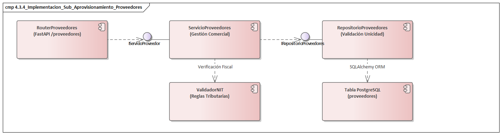

```plantuml
@startuml Diagrama_Componentes_Aprovisionamiento_Proveedores
title Implementación: Subsistema Aprovisionamiento y Proveedores Textiles
skinparam componentStyle uml2

component [RouterProveedores\n(FastAPI /proveedores)] as RouterProv
interface "IServicioProveedor" as IServProv
component [ServicioProveedores\n(Gestión Comercial)] as ServProv
interface "IRepositorioProveedores" as IRepoProv
component [RepositorioProveedores\n(Validación Unicidad)] as RepoProv
component [ValidadorNIT\n(Reglas Tributarias)] as NITValidator
component [Tabla PostgreSQL\n(proveedores)] as DBTable

RouterProv -( IServProv
ServProv -up- IServProv
ServProv -( IRepoProv
RepoProv -up- IRepoProv

ServProv ..> NITValidator : Verificación Fiscal
RepoProv ..> DBTable : SQLAlchemy ORM
@enduml
```

##### Implementación en Código Backend:

```python
# app/modules/proveedores/service.py
import re
from sqlalchemy.ext.asyncio import AsyncSession
from fastapi import HTTPException, status
from app.modules.proveedores.repository import ProveedoresRepository
from app.modules.proveedores.schemas import ProveedorCreate, ProveedorResponse

class ProveedoresService:
    def __init__(self, db: AsyncSession):
        self.repo = ProveedoresRepository(db)

    def _validar_formato_nit(self, nit: str) -> None:
        """Valida que el NIT cumpla con el estándar tributario nacional (numérico de 7 a 12 dígitos)"""
        if not re.match(r"^[0-9]{7,12}$", nit.strip()):
            raise HTTPException(status_code=status.HTTP_400_BAD_REQUEST, detail="El NIT proporcionado es inválido.")

    async def registrar_proveedor(self, dto: ProveedorCreate) -> ProveedorResponse:
        self._validar_formato_nit(dto.nit)
        existente = await self.repo.obtener_por_nit(dto.nit.strip())
        if existente:
            raise HTTPException(status_code=status.HTTP_409_CONFLICT, detail=f"El NIT {dto.nit} ya se encuentra registrado.")

        proveedor = await self.repo.crear(dto)
        await self.repo.commit()
        return ProveedorResponse.from_orm(proveedor)
```

---

#### 4.3.5 Sub Sistema 5: Inventario Multitienda y Costo Promedio Ponderado CPP (M06 - CU09)

Controla el Kardex valorado inmutable, los movimientos físicos (compras, ventas, traslados entre sucursales) y aplica de forma rigurosa el recálculo matemático de valuación bajo el método del **Costo Promedio Ponderado (CPP)**.

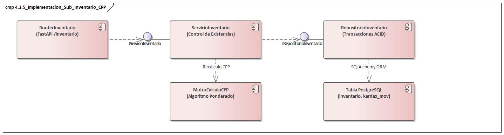

```plantuml
@startuml Diagrama_Componentes_Inventario_CPP
title Implementación: Subsistema Inventario Multitienda y Costo Promedio Ponderado
skinparam componentStyle uml2

component [RouterInventario\n(FastAPI /inventario)] as RouterInv
interface "IServicioInventario" as IServInv
component [ServicioInventario\n(Control de Existencias)] as ServInv
interface "IRepositorioInventario" as IRepoInv
component [RepositorioInventario\n(Transacciones ACID)] as RepoInv
component [MotorCalculoCPP\n(Algoritmo Ponderado)] as CPPEngine
component [Tabla PostgreSQL\n(inventario, kardex_mov)] as DBTable

RouterInv -( IServInv
ServInv -up- IServInv
ServInv -( IRepoInv
RepoInv -up- IRepoInv

ServInv ..> CPPEngine : Recálculo CPP
RepoInv ..> DBTable : SQLAlchemy ORM
@enduml
```

##### Implementación en Código Backend (Algoritmo Matemático CPP):

```python
# app/modules/inventario/service.py
from decimal import Decimal
from sqlalchemy.ext.asyncio import AsyncSession
from app.modules.inventario.repository import InventarioRepository
from app.modules.inventario.schemas import EntradaLoteCreate, KardexResponse

class InventarioService:
    def __init__(self, db_session: AsyncSession):
        self.repo = InventarioRepository(db_session)

    async def registrar_entrada_lote(self, entrada: EntradaLoteCreate) -> KardexResponse:
        """
        Registra la recepción de un lote de prendas por compra a proveedor,
        almacena el último costo unitario y recalcula matemáticamente
        el Costo Promedio Ponderado (CPP) según la directriz de valuación financiera.
        """
        # 1. Recuperar registro actual de existencias de la variante en la sucursal
        item_inv = await self.repo.obtener_por_variante(
            sucursal_id=entrada.id_sucursal,
            producto_id=entrada.id_producto,
            talla=entrada.talla,
            color=entrada.color
        )

        costo_lote = Decimal(str(entrada.costo_unitario_compra))
        cant_lote = entrada.cantidad_recibida

        if item_inv:
            stock_anterior = item_inv.stock_fisico
            cpp_anterior = Decimal(str(item_inv.costo_promedio_ponderado))

            # Fórmula formal de Costo Promedio Ponderado:
            # CPP = (Stock_ant * CPP_ant + Cant_lote * Costo_lote) / (Stock_ant + Cant_lote)
            inversion_anterior = stock_anterior * cpp_anterior
            inversion_nueva = cant_lote * costo_lote
            nuevo_stock_total = stock_anterior + cant_lote
            
            nuevo_cpp = (inversion_anterior + inversion_nueva) / Decimal(str(nuevo_stock_total))
            nuevo_cpp = round(nuevo_cpp, 2)

            # Actualizar entidad de inventario
            item_inv.stock_fisico = nuevo_stock_total
            item_inv.ultimo_costo_unitario = costo_lote
            item_inv.costo_promedio_ponderado = nuevo_cpp
        else:
            # Primer ingreso de la variante en la sucursal
            nuevo_stock_total = cant_lote
            nuevo_cpp = round(costo_lote, 2)
            item_inv = await self.repo.crear_registro_inventario(
                sucursal_id=entrada.id_sucursal,
                producto_id=entrada.id_producto,
                talla=entrada.talla,
                color=entrada.color,
                stock_inicial=cant_lote,
                costo_unitario=costo_lote,
                cpp=nuevo_cpp
            )

        # 2. Asentar movimiento en el Kardex inmutable
        asiento = await self.repo.crear_movimiento_kardex(
            id_inventario=item_inv.id_inventario,
            tipo_movimiento="COMPRA",
            cantidad=cant_lote,
            costo_unitario=costo_lote,
            saldo_cantidad=nuevo_stock_total,
            saldo_cpp=nuevo_cpp,
            motivo=f"Recepción compra Factura: {entrada.numero_factura}"
        )

        await self.repo.commit()
        return KardexResponse.from_orm(asiento)
```

---


## 5. Flujo de Trabajo: Pruebas

### 5.1 Pruebas de Casos de Uso (Pruebas de Aceptación)

Se documentan las pruebas formales de aceptación y caja negra realizadas sobre los 10 Casos de Uso del Ciclo 1. Cada caso de prueba sigue el formato metodológico estructurado compuesto por la caracterización del caso, la secuencia de pasos con sus resultados esperados y obtenidos, y la evidencia adjunta con el **prompt optimizado para generar la interfaz con Inteligencia Artificial**.

#### Matriz Resumen de Casos de Prueba (Ciclo 1)

| ID Prueba | Caso de Uso | Escenario Evaluado | Datos de Entrada | Resultado Esperado | Resultado Obtenido | Estado |
|:---:|:---|:---|:---|:---|:---|:---:|
| **TC01** | CU01: Login RBAC | Autenticación válida de Administrador | Email: `alberto.delgado@store.bo`<br>Clave: `Admin123*` | Token JWT emitido con claims de rol `ADMINISTRADOR`, HTTP 200, redirección a `/dashboard`. | Token generado correctamente, perfil cargado con permisos completos. | **Satisfactorio** |
| **TC02** | CU01: Login RBAC | Bloqueo preventivo tras 5 intentos fallidos | Email: `rodrigo.cliente@gmail.com`<br>Clave errónea x5 | HTTP 401 en intentos 1-4; en 5to intento cuenta pasa a `BLOQUEADO_POR_INTENTOS` por 30 min. | Cuenta bloqueada preventivamente, registro en auditoría de seguridad. | **Satisfactorio** |
| **TC03** | CU02: Auto-registro | Alta autoservicio de cliente con clave segura | Email: `nuevo.cliente@gmail.com`<br>Clave: `Fashion2026*`<br>Nombre: Carlos | Usuario persistido con rol `CLIENTE`, hash Bcrypt almacenado, auto-login con token JWT. | Cuenta creada, password cifrado en BD (cost factor 12), sesión iniciada. | **Satisfactorio** |
| **TC04** | CU03: Recuperación OTP | Restablecimiento de clave con código OTP de 6 dígitos | Email registrado + OTP correcto dentro de 15 min | Contraseña actualizada con nuevo hash bcrypt, token OTP invalidado, cuenta desbloqueada. | Token validado, clave cambiada exitosamente, login posterior verificado. | **Satisfactorio** |
| **TC05** | CU04: Usuarios y Roles | Desbloqueo administrativo de cuenta bloqueada | Admin presiona *"Desbloquear"* sobre usuario con 5 fallos | `estado_cuenta = 'ACTIVO'`, `intentos_fallidos = 0`, `bloqueado_hasta = NULL`. | Cuenta habilitada inmediatamente, cajero logra iniciar sesión sin trabas. | **Satisfactorio** |
| **TC06** | CU05: Sucursales | Alta de sucursal con coordenadas GPS válidas | Ciudad: Santa Cruz<br>Nombre: `Sucursal Equipetrol`<br>Lat: `-17.76823`, Lon: `-63.18342` | Sucursal creada, HTTP 201, visualizada en mapa georreferenciado con 6 probadores. | Registro persistido en BD con capacidad operativa confirmada. | **Satisfactorio** |
| **TC07** | CU06: Productos | Alta de prenda con tallas y colores multivaluados | SKU: `SHIRT-SLIM-001`<br>Tallas: `[S, M, L]`<br>Colores: `[#000080, #FFFFFF]` | Prenda registrada, tablas normalizadas `producto_colores` y `producto_tallas` pobladas. | Registro normalizado en 3FN verificado en PostgreSQL. | **Satisfactorio** |
| **TC08** | CU07: Temporadas | Calendarización y activación de campaña estacional | Código: `SS-2026`<br>Fechas: `2026-08-01` a `2027-01-31`<br>Estado: `VIGENTE` | Temporada creada, prendas asociadas a la campaña Primavera-Verano 2026. | Campaña vigente visible en catálogo y promociones. | **Satisfactorio** |
| **TC09** | CU08: Proveedores | Validación de unicidad de NIT tributario de proveedor | NIT: `1028392019` (existente) | HTTP 400 Bad Request: *"El NIT ingresado ya se encuentra registrado"*. | Restricción de unicidad capturada, formulario previene duplicados. | **Satisfactorio** |
| **TC10** | CU09: Inventario CPP | Recálculo matemático de Costo Promedio Ponderado | Stock prev: 15 uds @ 90 Bs<br>Entrada: 20 uds @ 120 Bs | Nuevo Stock = 35 uds<br>Último Costo = 120.00 Bs<br>Nuevo CPP = 107.14 Bs | Cálculo exacto verificado: `(1350 + 2400)/35 = 107.1428 -> 107.14 Bs`. | **Satisfactorio** |
| **TC11** | CU10: Catálogo | Consulta de disponibilidad por sucursal física | Prenda: Camisa Oxford M Azul<br>Sucursal: Equipetrol | Muestra: *"35 unidades físicas, 5 reservadas, 30 disponibles para prueba o venta"*. | Stock en tiempo real concordante entre tienda digital y almacén físico. | **Satisfactorio** |

---

### EJEMPLO DE CASO DE PRUEBA
**(Pruebas de aceptación)**

---

#### Prueba de caso de uso CU1: Iniciar Sesión y Autenticación RBAC

| Caso de uso 1 | Iniciar Sesión y Autenticación RBAC |
|:---|:---|
| **Descripción** | Permite a los usuarios autenticarse en la plataforma mediante correo electrónico y contraseña cifrada. Valida los roles del sistema (ADMINISTRADOR, CAJERO, CLIENTE) emitiendo un token JWT firmado y aplica el mecanismo de defensa OWASP bloqueando preventivamente la cuenta por 30 minutos al registrarse 5 intentos fallidos consecutivos. |
| **Precondiciones** | a) El usuario debe encontrarse registrado en la base de datos.<br>b) El servicio de backend FastAPI y la base de datos PostgreSQL deben estar en ejecución.<br>c) La cuenta no debe encontrarse en estado INACTIVO ni con bloqueo administrativo. |

| Paso | Acción | Resultado esperado | Estado (Satisfactorio/Fallido) |
|:---:|:---|:---|:---:|
| 1 | Acceder a la pantalla de Login desde el portal web o aplicación móvil. | Se despliega el formulario de autenticación con campos para email, contraseña y botón de acceso. | Satisfactorio |
| 2 | Ingresar credenciales válidas de usuario y presionar "Iniciar Sesión". | Se genera el token JWT con los claims de rol, se almacena en el cliente y se redirige a la vista correspondiente. | Satisfactorio |
| 3 | Ingresar contraseña errónea de forma intencional en 4 oportunidades. | El sistema rechaza la autenticación con código HTTP 401 e informa los intentos restantes antes del bloqueo. | Satisfactorio |
| 4 | Realizar el quinto intento fallido con contraseña incorrecta. | La cuenta pasa automáticamente a estado `BLOQUEADO_POR_INTENTOS` con una ventana de 30 minutos. | Satisfactorio |
| 5 | Intentar iniciar sesión inmediatamente durante la ventana de bloqueo. | Se bloquea el acceso en el gateway notificando el tiempo restante de penalización sin consultar la clave. | Satisfactorio |
| 6 | Iniciar sesión tras expirar la ventana de 30 minutos con la clave correcta. | Se restablece el contador de intentos fallidos a 0 y se inicia sesión normalmente. | Satisfactorio |

| Responsable | Administrador / Tester de Seguridad |
|:---|:---|
| **Resultado de la prueba** | **Satisfactorio** |
| **Adjunto** | **Evidencia de Interfaz:**<br><br>*(Captura de pantalla de la interfaz de autenticación y notificación de bloqueo preventivo)*<br><br>> 🎨 **Prompt para IA generadora de imágenes (UI Mockup):**<br>> `"Modern desktop web application UI mockup of the login screen for 'FashionStore' menswear boutique platform. Sleek dark-navy minimalist interface, centered glassmorphism authentication card with input fields 'Correo Electrónico' (filled with alberto.delgado@store.bo) and 'Contraseña' (masked dots), a prominent blue accent button 'Iniciar Sesión', badge showing 'Protegido por RBAC & Bloqueo OWASP (5 intentos máx)', error banner demo showing 'Intento 5 fallido: Cuenta bloqueada temporalmente por 30 minutos', clean modern typography, professional SaaS dashboard design, Figma UI kit style, 8k resolution."` |

---

#### Prueba de caso de uso CU2: Auto-registro de Clientes

| Caso de uso 2 | Auto-registro de Clientes |
|:---|:---|
| **Descripción** | Permite que visitantes no registrados puedan crear de manera autónoma una cuenta de cliente en FashionStore, registrando sus datos personales y credenciales de acceso, asignándoles automáticamente el rol CLIENTE e iniciando su sesión con token JWT. |
| **Precondiciones** | a) El visitante debe tener acceso a internet y al portal web o app móvil.<br>b) El módulo de autenticación y registro debe estar habilitado.<br>c) Debe existir conexión activa con el servidor de base de datos. |

| Paso | Acción | Resultado esperado | Estado (Satisfactorio/Fallido) |
|:---:|:---|:---|:---:|
| 1 | Acceder a la opción "Crear Cuenta" desde el menú principal de navegación. | Se despliega el formulario modal de registro de nuevo cliente con campos estructurados. | Satisfactorio |
| 2 | Completar datos personales (Nombre, Apellido, Celular, Género y Fecha de Nacimiento). | Los campos se validan sintácticamente en tiempo real mediante expresiones regulares. | Satisfactorio |
| 3 | Ingresar correo electrónico no registrado y contraseña segura (mínimo 8 caracteres). | Se evalúa y muestra el indicador de fortaleza de contraseña como "Segura". | Satisfactorio |
| 4 | Intentar registrar un correo que ya existe en el sistema. | El sistema rechaza la solicitud indicando que el correo ya se encuentra registrado. | Satisfactorio |
| 5 | Presionar el botón "Registrarme e Iniciar Sesión" con datos válidos. | Se almacena el usuario con hash Bcrypt (factor 12), rol `CLIENTE` y estado `ACTIVO`. | Satisfactorio |
| 6 | Verificar inicio de sesión automático y redirección al catálogo. | Se genera el token JWT, se cierra el modal y se visualiza el saludo de bienvenida con sesión activa. | Satisfactorio |

| Responsable | Cliente / Tester QA |
|:---|:---|
| **Resultado de la prueba** | **Satisfactorio** |
| **Adjunto** | **Evidencia de Interfaz:**<br><br>*(Captura del modal de registro de clientes con validaciones y bienvenida)*<br><br>> 🎨 **Prompt para IA generadora de imágenes (UI Mockup):**<br>> `"Modern clean web interface showing customer registration modal for 'FashionStore' online fashion store. Clean white and slate gray card with title 'Crear Cuenta de Cliente', form fields: 'Nombre Completo', 'Correo Electrónico', 'Teléfono Celular', 'Contraseña' with password strength meter showing 'Segura (Bcrypt)', checkbox 'Acepto términos y condiciones de probadores virtuales', bright blue primary button 'Registrarme e Iniciar Sesión', subtle toast notification at top-right '¡Cuenta creada exitosamente! Bienvenido Carlos', Dribbble trending UI, photorealistic UI screenshot, 4k."` |

---

#### Prueba de caso de uso CU3: Recuperación de Contraseña con OTP

| Caso de uso 3 | Recuperación de Contraseña con OTP |
|:---|:---|
| **Descripción** | Permite a los usuarios que olvidaron su contraseña solicitar un código criptográfico de un solo uso (OTP) de 6 dígitos enviado a su correo registrado, con una validez temporal estricta de 15 minutos y un límite de 3 intentos de verificación, para restablecer de forma segura su clave. |
| **Precondiciones** | a) El correo del usuario debe estar registrado y activo en el sistema.<br>b) El servicio transaccional de correo SMTP debe estar operativo.<br>c) Debe existir conexión activa con la base de datos PostgreSQL. |

| Paso | Acción | Resultado esperado | Estado (Satisfactorio/Fallido) |
|:---:|:---|:---|:---:|
| 1 | Presionar el enlace "¿Olvidaste tu contraseña?" en el formulario de login. | Se despliega la vista de recuperación solicitando el correo electrónico de la cuenta. | Satisfactorio |
| 2 | Ingresar el correo registrado y presionar "Enviar Código de Verificación". | El sistema genera el OTP de 6 dígitos, guarda su hash con expiración a 15 min y despacha el correo. | Satisfactorio |
| 3 | Verificar recepción del código en la bandeja de entrada del correo. | Se recibe correo formal de FashionStore con el código numérico de 6 dígitos. | Satisfactorio |
| 4 | Ingresar código OTP incorrecto en el formulario de verificación. | El sistema rechaza el intento, incrementa el contador y alerta sobre los intentos restantes (máx 3). | Satisfactorio |
| 5 | Ingresar el código OTP válido y definir la nueva contraseña. | Se valida exitosamente el código, se actualiza el hash Bcrypt en BD y se invalida el token OTP. | Satisfactorio |
| 6 | Iniciar sesión inmediatamente con la nueva contraseña configurada. | Se valida la nueva clave con éxito y se ingresa a la plataforma sin trabas. | Satisfactorio |

| Responsable | Cliente / Administrador |
|:---|:---|
| **Resultado de la prueba** | **Satisfactorio** |
| **Adjunto** | **Evidencia de Interfaz:**<br><br>*(Captura del flujo de validación del código OTP y cambio de contraseña)*<br><br>> 🎨 **Prompt para IA generadora de imágenes (UI Mockup):**<br>> `"Clean mobile app screen and desktop split view showing OTP password recovery flow for 'FashionStore'. Card titled 'Recuperación de Contraseña con Código OTP', instructions 'Ingresa el código de 6 dígitos enviado a tu correo', 6 individual digit input boxes containing [ 8 | 4 | 2 | 1 | 9 | 5 ], countdown timer badge showing 'Válido por: 13:45 min', field 'Nueva Contraseña' and 'Confirmar Contraseña', green checkmark icon 'Código Verificado con Éxito', primary action button 'Restablecer Contraseña', sleek fintech/e-commerce design aesthetic, high fidelity UI mockup."` |

---

#### Prueba de caso de uso CU4: Gestión de Usuarios, Roles RBAC y Desbloqueo

| Caso de uso 4 | Gestión de Usuarios, Roles RBAC y Desbloqueo |
|:---|:---|
| **Descripción** | Permite al Administrador dar de alta colaboradores internos (cajeros, encargados de tienda), asignar roles y sucursales operativas, y desbloquear cuentas de usuarios que hayan quedado bloqueadas por superar los intentos de login. |
| **Precondiciones** | a) El usuario autenticado debe tener el rol ADMINISTRADOR.<br>b) El módulo de administración de usuarios debe encontrarse activo.<br>c) Debe existir conexión activa con la base de datos. |

| Paso | Acción | Resultado esperado | Estado (Satisfactorio/Fallido) |
|:---:|:---|:---|:---:|
| 1 | Acceder al módulo "Usuarios y Roles" desde el menú lateral administrativo. | Se despliega la tabla de colaboradores y clientes con columnas de rol, sucursal y estado de cuenta. | Satisfactorio |
| 2 | Presionar el botón "+ Crear nuevo colaborador". | Se abre el formulario modal solicitando datos personales, rol (CAJERO / ADMIN) y sucursal. | Satisfactorio |
| 3 | Guardar el nuevo colaborador con rol `CAJERO` en la sucursal `Equipetrol`. | Se persiste el registro en BD y la lista se actualiza inmediatamente reflejando el nuevo usuario. | Satisfactorio |
| 4 | Identificar un usuario con estado `BLOQUEADO_POR_INTENTOS` en la tabla. | La fila muestra badge rojo de alerta y habilita la acción "Desbloquear". | Satisfactorio |
| 5 | Presionar la acción "Desbloquear Cuenta" sobre el usuario bloqueado. | El sistema restablece `intentos_fallidos = 0`, `bloqueado_hasta = NULL` y `estado = ACTIVO`. | Satisfactorio |
| 6 | Verificar que el usuario desbloqueado pueda autenticarse inmediatamente. | El usuario inicia sesión de forma fluida sin requerir esperar los 30 minutos. | Satisfactorio |

| Responsable | Administrador General |
|:---|:---|
| **Resultado de la prueba** | **Satisfactorio** |
| **Adjunto** | **Evidencia de Interfaz:**<br><br>*(Captura del módulo administrativo de usuarios con modal de creación y botón de desbloqueo)*<br><br>> 🎨 **Prompt para IA generadora de imágenes (UI Mockup):**<br>> `"SaaS backoffice administration dashboard for 'FashionStore - Gestión de Usuarios y Roles'. Background table listing system staff with columns: 'Usuario / Empleado', 'Email', 'Rol (ADMINISTRADOR, CAJERO)', 'Sucursal Asignada', 'Estado (ACTIVO, BLOQUEADO)', 'Acciones'. Foreground modal dialog titled 'Crear Nuevo Empleado / Asignar Rol', fields: 'Nombre', 'Email corporativo', dropdown 'Rol RBAC: Cajero POS', dropdown 'Sucursal: Sucursal Equipetrol', action buttons 'Guardar Empleado' (blue) and 'Cancelar' (red outline). Next to blocked user row, a green badge button 'Desbloquear Cuenta (Reset Intentos)', clean modern UI design, Figma presentation style."` |

---

#### Prueba de caso de uso CU5: Gestión de Sucursales y Ciudades

| Caso de uso 5 | Gestión de Sucursales y Ciudades |
|:---|:---|
| **Descripción** | Permite registrar, editar y georreferenciar las tiendas físicas de FashionStore, configurando su ciudad, dirección física, coordenadas GPS (latitud y longitud), horarios de atención y la cantidad de probadores físicos disponibles para reservas omnicanal. |
| **Precondiciones** | a) Sesión iniciada con rol ADMINISTRADOR.<br>b) Catálogo de ciudades previamente cargado en la base de datos.<br>c) Conexión activa con el backend y base de datos. |

| Paso | Acción | Resultado esperado | Estado (Satisfactorio/Fallido) |
|:---:|:---|:---|:---:|
| 1 | Ingresar al módulo "Sucursales" desde el panel de configuración. | Se despliega la lista de tiendas físicas activas con su ciudad y capacidad de probadores. | Satisfactorio |
| 2 | Presionar "+ Registrar Nueva Sucursal". | Se despliega el formulario modal de registro de sucursal física. | Satisfactorio |
| 3 | Seleccionar ciudad "Santa Cruz" e ingresar nombre "Sucursal Equipetrol". | Se validan los datos básicos de denominación de la tienda. | Satisfactorio |
| 4 | Ingresar coordenadas GPS (`-17.76823`, `-63.18342`) y 6 probadores disponibles. | El mapa interactivo centra el pin en la dirección y valida capacidad física mayor a 0. | Satisfactorio |
| 5 | Presionar "Guardar Sucursal". | Se crea el registro en PostgreSQL, HTTP 201 Created y se emite notificación de éxito. | Satisfactorio |
| 6 | Verificar aparición de la sucursal en el mapa y en el selector del catálogo. | La tienda se encuentra disponible inmediatamente para selección y asignación de stock. | Satisfactorio |

| Responsable | Administrador de Operaciones |
|:---|:---|
| **Resultado de la prueba** | **Satisfactorio** |
| **Adjunto** | **Evidencia de Interfaz:**<br><br>*(Captura del panel de sucursales con mapa interactivo y modal de creación georreferenciada)*<br><br>> 🎨 **Prompt para IA generadora de imágenes (UI Mockup):**<br>> `"Web application backoffice dashboard for 'FashionStore - Administración de Sucursales y Probadores'. Background showing card grid of branch stores with interactive Leaflet map widget displaying branch pins in Santa Cruz, La Paz, Cochabamba. Foreground popup modal titled 'Registrar Nueva Sucursal', input fields: 'Ciudad (Santa Cruz)', 'Nombre de Sucursal (Sucursal Equipetrol)', 'Dirección Física (Av. San Martín #450)', 'Coordenadas GPS Latitud (-17.76823) y Longitud (-63.18342)', number spinner 'Probadores Físicos Disponibles (6)', buttons 'Guardar Sucursal' and 'Cancelar'. Modern enterprise dashboard, crisp typography, clean layout."` |

---

#### Prueba de caso de uso CU6: Gestión de Productos, Tallas y Colores

| Caso de uso 6 | Gestión de Productos, Tallas y Colores |
|:---|:---|
| **Descripción** | Permite el mantenimiento del catálogo de prendas de vestir masculinas, gestionando información descriptiva, precio base, categoría y la configuración ortogonal de variantes por **Talla** (S, M, L, XL) y **Color** (nombre y código hexadecimal HEX). |
| **Precondiciones** | a) Sesión iniciada con privilegios de gestión de catálogo.<br>b) Categorías de prendas creadas en el sistema.<br>c) Conexión operativa con la base de datos PostgreSQL. |

| Paso | Acción | Resultado esperado | Estado (Satisfactorio/Fallido) |
|:---:|:---|:---|:---:|
| 1 | Acceder a "Catálogo de Prendas" en el menú administrativo. | Se despliega la grilla de productos con miniaturas, SKU, precio y variantes asociadas. | Satisfactorio |
| 2 | Presionar el botón "+ Crear Nueva Prenda". | Se abre el modal de creación de producto con pestañas de Datos Generales y Variantes. | Satisfactorio |
| 3 | Ingresar SKU `SHIRT-SLIM-001`, nombre "Camisa Oxford Slim Fit" y precio 180.00 Bs. | El formulario valida unicidad de SKU y formato positivo del precio base. | Satisfactorio |
| 4 | Seleccionar tallas multivaluadas `[S, M, L, XL]` y colores `[#000080 Azul, #FFFFFF Blanco]`. | Se genera la matriz de combinaciones posibles en la tabla de variantes. | Satisfactorio |
| 5 | Cargar imagen de la prenda y presionar "Guardar Prenda". | Se persisten registros normalizados en `productos`, `producto_tallas` y `producto_colores`. | Satisfactorio |
| 6 | Consultar el producto en el catálogo administrativo. | La prenda aparece con sus variantes habilitadas y lista para recibir stock en almacén. | Satisfactorio |

| Responsable | Administrador de Catálogo |
|:---|:---|
| **Resultado de la prueba** | **Satisfactorio** |
| **Adjunto** | **Evidencia de Interfaz:**<br><br>*(Captura del modal de creación de prendas con matriz de tallas y selector HEX de colores)*<br><br>> 🎨 **Prompt para IA generadora de imágenes (UI Mockup):**<br>> `"E-commerce admin panel for 'FashionStore - Catálogo de Moda Masculina'. Background shows data table of clothing items: SKU 'SHIRT-SLIM-001', Name 'Camisa Oxford Slim Fit', Category 'Camisas Formales', Base Price '180.00 Bs'. Foreground modal titled 'Crear Prenda y Variantes', fields: 'Código SKU', 'Nombre Prenda', 'Precio Base', interactive multi-select tag chips for 'Tallas Disponibles: [S] [M] [L] [XL]', and color picker chips with HEX codes: '[#000080 Azul Marino] [#FFFFFF Blanco] [#000000 Negro]', image upload dropzone with preview of dress shirt, save button 'Guardar Producto en Catálogo', stylish UI mockup."` |

---

#### Prueba de caso de uso CU7: Gestión de Temporadas y Colecciones

| Caso de uso 7 | Gestión de Temporadas y Colecciones |
|:---|:---|
| **Descripción** | Permite calendarizar y administrar campañas estacionales de moda masculina (Primavera-Verano, Otoño-Invierno), controlando sus fechas de vigencia cronológica para activar colecciones y promociones temáticas. |
| **Precondiciones** | a) Sesión activa con rol ADMINISTRADOR.<br>b) Módulo de temporadas habilitado.<br>c) Conexión a la base de datos activa. |

| Paso | Acción | Resultado esperado | Estado (Satisfactorio/Fallido) |
|:---:|:---|:---|:---:|
| 1 | Ingresar al módulo "Temporadas" desde el menú de comercialización. | Se muestran las temporadas registradas organizadas por estado (Vigente, Próxima, Cerrada). | Satisfactorio |
| 2 | Presionar "+ Nueva Campaña Estacional". | Se abre el formulario modal de registro de temporada. | Satisfactorio |
| 3 | Ingresar código `SS-2026` y denominación "Colección Primavera - Verano 2026". | Se valida unicidad del código alfanumérico de temporada. | Satisfactorio |
| 4 | Definir rango de fechas del `2026-08-01` al `2027-01-31` y estado `VIGENTE`. | El sistema verifica que la fecha final sea estrictamente posterior a la fecha inicial. | Satisfactorio |
| 5 | Presionar "Guardar y Activar Temporada". | La temporada se persiste en PostgreSQL y se establece como activa en el motor de catálogo. | Satisfactorio |
| 6 | Verificar filtro de temporada en la tienda virtual. | La colección `SS-2026` aparece destacada en la página principal con sus prendas asociadas. | Satisfactorio |

| Responsable | Administrador / Jefe de Marketing |
|:---|:---|
| **Resultado de la prueba** | **Satisfactorio** |
| **Adjunto** | **Evidencia de Interfaz:**<br><br>*(Captura del tablero de gestión de temporadas con tarjetas de vigencia y modal de creación)*<br><br>> 🎨 **Prompt para IA generadora de imágenes (UI Mockup):**<br>> `"Web application dashboard view for 'FashionStore - Gestión de Temporadas y Campañas'. Main panel displaying timeline calendar and season cards. Active card highlighted in green badge 'VIGENTE: Campaña Primavera - Verano 2026 (SS-2026)', date range '01/08/2026 - 31/01/2027', counter showing '48 Prendas Vinculadas'. Right side modal 'Crear Nueva Temporada' with fields: 'Código Temporada', 'Nombre Comercial', 'Fecha Inicio', 'Fecha Fin', toggle switch 'Activar en Catálogo Web', buttons 'Confirmar Temporada' and 'Descartar', vibrant modern flat UI, Dribbble UI trend."` |

---

#### Prueba de caso de uso CU8: Gestión de Proveedores Textiles

| Caso de uso 8 | Gestión de Proveedores Textiles |
|:---|:---|
| **Descripción** | Permite el registro y homologación de empresas fabricantes de textiles e insumos de confección, validando obligatoriamente el formato numérico y la unicidad del Número de Identificación Tributaria (NIT) nacional. |
| **Precondiciones** | a) Sesión iniciada con rol ADMINISTRADOR.<br>b) Módulo de compras y aprovisionamiento activo.<br>c) Conexión a la base de datos PostgreSQL. |

| Paso | Acción | Resultado esperado | Estado (Satisfactorio/Fallido) |
|:---:|:---|:---|:---:|
| 1 | Acceder al módulo "Proveedores" desde el menú de aprovisionamiento. | Se visualiza el directorio comercial de empresas proveedoras registradas. | Satisfactorio |
| 2 | Presionar "+ Registrar Proveedor". | Se despliega el formulario modal de registro de nuevo proveedor textil. | Satisfactorio |
| 3 | Ingresar Razón Social "Textiles Andinos S.A." y datos de contacto. | Se validan los campos de nombre, teléfono y dirección física. | Satisfactorio |
| 4 | Ingresar NIT `1028392019` que ya se encuentra registrado en el sistema. | El sistema captura la restricción de unicidad y muestra alerta de conflicto HTTP 409. | Satisfactorio |
| 5 | Corregir el NIT ingresando uno válido y único (`9482710015`). | El validador sintáctico verifica que sea numérico de 7 a 12 dígitos y habilita el guardado. | Satisfactorio |
| 6 | Presionar "Guardar Proveedor" y verificar en el listado general. | Se crea el proveedor en base de datos y la tabla refleja el nuevo registro de forma inmediata. | Satisfactorio |

| Responsable | Administrador / Encargado de Compras |
|:---|:---|
| **Resultado de la prueba** | **Satisfactorio** |
| **Adjunto** | **Evidencia de Interfaz:**<br><br>*(Captura del formulario modal de proveedores con validación de unicidad de NIT en tiempo real)*<br><br>> 🎨 **Prompt para IA generadora de imágenes (UI Mockup):**<br>> `"Enterprise ERP screen for 'FashionStore - Directorio de Proveedores Textiles'. Data table in background with columns: 'Razón Social', 'NIT Tributario', 'Contacto Comercial', 'Teléfono', 'Términos de Crédito (30 días)', 'Estado', 'Acciones'. Foreground modal dialog titled 'Registrar Nuevo Proveedor Textil', input fields: 'Razón Social (Textiles Andinos S.A.)', 'NIT (1028392019)' with green validation checkmark 'NIT Válido y Único en BD', 'Teléfono (+591 71234567)', 'Email de Facturación', 'Dirección de Fábrica', action buttons 'Registrar Proveedor' and 'Cancelar', crisp professional software UI mockup."` |

---

#### Prueba de caso de uso CU9: Control de Inventario Multi-Sucursal y Costo Promedio Ponderado CPP

| Caso de uso 9 | Control de Inventario Multi-Sucursal y Costo Promedio Ponderado CPP |
|:---|:---|
| **Descripción** | Permite registrar entradas por compras a proveedores, actualizando automáticamente el stock físico de la variante en la sucursal seleccionada, recalculando matemáticamente el Costo Promedio Ponderado (CPP) y asentando el movimiento en el Kardex inmutable. |
| **Precondiciones** | a) Prenda, variante (talla/color), sucursal y proveedor deben encontrarse activos.<br>b) Sesión iniciada con permisos de inventario.<br>c) Conexión transaccional ACID activa con PostgreSQL. |

| Paso | Acción | Resultado esperado | Estado (Satisfactorio/Fallido) |
|:---:|:---|:---|:---:|
| 1 | Acceder al módulo "Inventario y Kardex" y seleccionar la sucursal `Equipetrol`. | Se despliega el saldo actual de la variante: `Stock = 15 uds`, `CPP = 90.00 Bs`. | Satisfactorio |
| 2 | Presionar "+ Registrar Entrada por Compra (Lote Factura F-4892)". | Se despliega el formulario modal de ingreso de lote de prendas. | Satisfactorio |
| 3 | Seleccionar la variante "Camisa Oxford Slim M Azul" e ingresar 20 unidades a 120.00 Bs/ud. | El formulario valida cantidades enteras positivas y costo unitario numérico. | Satisfactorio |
| 4 | Confirmar la recepción del lote y procesar la transacción. | Se ejecuta la fórmula: `CPP = (15*90 + 20*120) / 35 = 3750 / 35 = 107.14 Bs`. | Satisfactorio |
| 5 | Verificar actualización en la entidad de inventario. | `stock_fisico = 35`, `ultimo_costo = 120.00 Bs`, `costo_promedio_ponderado = 107.14 Bs`. | Satisfactorio |
| 6 | Consultar el asiento generado en el Kardex inmutable. | Se visualiza el registro histórico con tipo `COMPRA`, cantidad entrada, nuevo saldo físico y saldo CPP. | Satisfactorio |

| Responsable | Encargado de Almacén / Administrador |
|:---|:---|
| **Resultado de la prueba** | **Satisfactorio** |
| **Adjunto** | **Evidencia de Interfaz:**<br><br>*(Captura del Kardex valorado con métricas de stock físico, último costo y recálculo matemático de CPP)*<br><br>> 🎨 **Prompt para IA generadora de imágenes (UI Mockup):**<br>> `"Inventory management and Kardex valuation interface for 'FashionStore - Control de Inventario y CPP'. Top metric summary cards: 'Stock Físico Total: 35 uds', 'Último Costo Compra: 120.00 Bs', 'Costo Promedio Ponderado (CPP): 107.14 Bs'. Below, a detailed immutable Kardex transaction ledger table with columns: 'Fecha / Hora', 'Comprobante / Factura', 'Tipo Movimiento (COMPRA)', 'Entrada Cant.', 'Costo Unit.', 'Salida Cant.', 'Saldo Cantidad (35)', 'Saldo Valorizado CPP (107.14 Bs)'. Mathematical formula callout box: 'CPP = (15 * 90 + 20 * 120) / 35 = 107.14 Bs'. Modal open: 'Registrar Entrada de Lote por Factura F-4892', clean financial ERP aesthetic, highly detailed UI mockup."` |

---

#### Prueba de caso de uso CU10: Consulta de Catálogo y Disponibilidad por Sucursal

| Caso de uso 10 | Consulta de Catálogo y Disponibilidad por Sucursal |
|:---|:---|
| **Descripción** | Permite a clientes y personal consultar prendas masculinas aplicando filtros por categoría, temporada, talla y color, desplegando en tiempo real la disponibilidad física real versus prendas reservadas en probadores para la sucursal seleccionada. |
| **Precondiciones** | a) El catálogo de prendas debe encontrarse publicado.<br>b) Existencias físicas cargadas en el subsistema de inventario.<br>c) Conexión activa con el backend. |

| Paso | Acción | Resultado esperado | Estado (Satisfactorio/Fallido) |
|:---:|:---|:---|:---:|
| 1 | Acceder al Catálogo Público en la web o app móvil. | Se muestra la galería de prendas masculinas con selector de filtros en la barra lateral. | Satisfactorio |
| 2 | Filtrar por talla "M" y color "Azul Marino". | La galería se actualiza dinámicamente mostrando las prendas que disponen de dicha variante. | Satisfactorio |
| 3 | Seleccionar la prenda "Camisa Oxford Slim Fit" para ver su ficha de detalle. | Se visualiza precio (180 Bs), selector de tallas/colores y bloque de disponibilidad en tienda. | Satisfactorio |
| 4 | Seleccionar la tienda "Sucursal Equipetrol (Santa Cruz)" en el desplegable de sucursales. | Se consulta la API `/inventario/disponibilidad` en tiempo real para la variante elegida. | Satisfactorio |
| 5 | Verificar desglose de existencias en pantalla. | Muestra: *"35 unidades físicas en tienda, 5 reservadas en probadores, 30 disponibles para compra inmediata"*. | Satisfactorio |
| 6 | Comprobar concordancia con el stock físico del almacén. | El stock coincide con exactitud con el saldo reportado por el Kardex de la sucursal. | Satisfactorio |

| Responsable | Cliente / Vendedor de Tienda |
|:---|:---|
| **Resultado de la prueba** | **Satisfactorio** |
| **Adjunto** | **Evidencia de Interfaz:**<br><br>*(Captura de la ficha de detalle de prenda con disponibilidad en tiempo real por sucursal física)*<br><br>> 🎨 **Prompt para IA generadora de imágenes (UI Mockup):**<br>> `"Customer-facing web & mobile omni-channel e-commerce product detail page for 'FashionStore - Camisa Oxford Slim Fit'. Left side shows high quality model photo of men's blue dress shirt. Right side shows: Price '180.00 Bs', Size selector buttons '[S] [M (Selected)] [L] [XL]', Color swatches '[Navy Blue] [Pure White]'. Critical feature: 'Disponibilidad en Tiendas Físicas' dropdown set to 'Sucursal Equipetrol, Santa Cruz', displaying live status card: '✓ 35 Unidades Físicas en Bodega | 5 Reservadas para Probador | 30 Disponibles para Compra Inmediata', action buttons 'Reservar Probador Virtual con AR' (purple gradient) and 'Comprar Ahora' (dark blue), ultra-sleek modern luxury fashion UI mockup."` |

---


### 5.2 Historias de Usuario (H.U.) del Ciclo 1

Para homologar la entrega con metodologías ágiles requeridas en el marco académico, se formulan las 10 Historias de Usuario correspondientes a los 10 Casos de Uso del Ciclo 1 con sus criterios de aceptación en sintaxis formal **Gherkin**:

#### HU01: Autenticación Segura y Control RBAC (CU01)
- **Como** usuario del sistema (Administrador, Empleado o Cliente),
- **Quiero** iniciar sesión introduciendo mi correo electrónico y contraseña cifrada,
- **Para** acceder de forma segura a las funciones correspondientes a mi perfil.
- **Criterios de Aceptación (Gherkin):**
  * **Dado** que el usuario ingresa sus credenciales válidas en la pantalla de login,
  * **Cuando** presiona el botón "Iniciar Sesión",
  * **Entonces** el sistema valida el hash bcrypt, devuelve un token JWT y redirige al panel autorizado.
  * **Dado** que un usuario ingresa una contraseña errónea por 5 veces consecutivas,
  * **Cuando** se procesa el quinto intento fallido,
  * **Entonces** el sistema bloquea preventivamente la cuenta por 30 minutos y registra la alerta en la bitácora.

#### HU02: Auto-registro de Clientes y Verificación de Cuenta (CU02)
- **Como** visitante no registrado de la tienda web o app móvil,
- **Quiero** crear mi cuenta proporcionando mis datos personales y una contraseña segura,
- **Para** acceder a los probadores virtuales de Realidad Aumentada, reservar prendas y comprar en línea.
- **Criterios de Aceptación (Gherkin):**
  * **Dado** que un visitante completa el formulario con correo único y contraseña de al menos 8 caracteres con números y mayúsculas,
  * **Cuando** presiona el botón "Crear Mi Cuenta FashionStore",
  * **Entonces** el sistema cifra la clave con bcrypt (factor 12), crea el registro con rol `CLIENTE`, genera el token de sesión e inicia sesión automáticamente.
  * **Dado** que el correo ingresado ya pertenece a un usuario registrado,
  * **Cuando** se intenta procesar el registro,
  * **Entonces** el sistema rechaza la solicitud indicando que el correo ya existe y ofrece enlace directo al login o recuperación.

#### HU03: Recuperación Autoservicio de Contraseña por Código OTP (CU03)
- **Como** usuario que olvidó su contraseña de acceso a FashionStore,
- **Quiero** solicitar un código OTP a mi correo y usarlo para definir una nueva contraseña,
- **Para** recuperar el acceso a mi cuenta de manera autónoma sin intervención manual de soporte técnico.
- **Criterios de Aceptación (Gherkin):**
  * **Dado** que el usuario ingresa su correo en la vista de "¿Olvidaste tu contraseña?",
  * **Cuando** presiona "Enviar Código de Recuperación",
  * **Entonces** el sistema genera un código numérico criptográfico de 6 dígitos válido por 15 minutos y lo despacha por correo electrónico.
  * **Dado** que el usuario ingresa el código OTP correcto y su nueva contraseña antes de cumplirse los 15 minutos,
  * **Cuando** presiona "Restablecer Contraseña Ahora",
  * **Entonces** el sistema valida el código, actualiza el hash bcrypt, desbloquea la cuenta si estaba bloqueada y notifica el éxito de la operación.

#### HU04: Gestión de Usuarios, Asignación de Roles y Desbloqueo (CU04)
- **Como** Administrador General del sistema,
- **Quiero** dar de alta personal interno, asignar roles y sucursales, y desbloquear cuentas bloqueadas,
- **Para** asegurar la correcta operación del personal en tiendas y puntos de venta.
- **Criterios de Aceptación (Gherkin):**
  * **Dado** que el Administrador accede al panel de "Usuarios y Roles",
  * **Cuando** crea un empleado asignándole el rol `CAJERO` y la sucursal `Calacoto`,
  * **Entonces** el sistema persiste el usuario vinculado y le otorga exclusivamente permisos de cobro en POS.
  * **Dado** que una cuenta se encuentra con estado `BLOQUEADO_POR_INTENTOS`,
  * **Cuando** el Administrador presiona el botón "Desbloquear",
  * **Entonces** el sistema restablece el contador de fallos a 0 y reactiva la cuenta inmediatamente.

#### HU05: Gestión y Geolocalización de Ciudades y Sucursales (CU05)
- **Como** Administrador General,
- **Quiero** registrar y parametrizar sucursales físicas con sus coordenadas GPS y capacidad de probadores,
- **Para** que los clientes puedan geolocalizar tiendas y agendar reservas de probadores.
- **Criterios de Aceptación (Gherkin):**
  * **Dado** que el Administrador ingresa el nombre, dirección, coordenadas latitud/longitud y número de probadores,
  * **Cuando** presiona "Guardar Sucursal",
  * **Entonces** el sistema almacena la sucursal y la despliega georreferenciada en el mapa del catálogo.

#### HU06: Administración de Productos y Atributos de Moda Masculina (CU06)
- **Como** Administrador de Catálogo,
- **Quiero** registrar prendas masculinas especificando tallas normalizadas y colores multivaluados con código Hex,
- **Para** ofrecer fichas técnicas detalladas que faciliten la búsqueda y la experiencia de compra.
- **Criterios de Aceptación (Gherkin):**
  * **Dado** que se registra una camisa con tallas `[S, M, L]` y colores `#000080` (Azul) y `#FFFFFF` (Blanco),
  * **Cuando** se guarda el producto,
  * **Entonces** el sistema genera variantes normalizadas indexadas listas para la consulta de existencias.

#### HU07: Gestión de Temporadas y Campañas Comerciales (CU07)
- **Como** Administrador de Ventas,
- **Quiero** calendarizar temporadas comerciales y activar descuentos de liquidación,
- **Para** sincronizar la oferta de prendas con el calendario de la moda y liquidar sobrestocks.
- **Criterios de Aceptación (Gherkin):**
  * **Dado** que concluye la temporada Invierno,
  * **Cuando** el Administrador cambia el estado a `LIQUIDACION` y define 25% de descuento,
  * **Entonces** el sistema aplica automáticamente la rebaja a todas las prendas vinculadas a la colección.

#### HU08: Gestión de Proveedores Textiles y Términos Comerciales (CU08)
- **Como** Encargado de Adquisiciones,
- **Quiero** administrar el padrón de empresas proveedoras textiles con su NIT y términos de pago,
- **Para** formalizar órdenes de compra y mantener trazabilidad del abastecimiento de mercadería.
- **Criterios de Aceptación (Gherkin):**
  * **Dado** que se registra un nuevo proveedor con un NIT que ya existe en la base de datos,
  * **Cuando** se presiona "Guardar Proveedor",
  * **Entonces** el sistema impide el registro duplicado y emite alerta de validación tributaria.

#### HU09: Recálculo de Costo Promedio Ponderado en Entradas de Inventario (CU09)
- **Como** Encargado de Logística de Almacén,
- **Quiero** registrar la entrada de lotes de prendas capturando su costo unitario de compra,
- **Para** que el sistema actualice el stock físico y calcule matemáticamente el Costo Promedio Ponderado ($CPP$).
- **Criterios de Aceptación (Gherkin):**
  * **Dado** que existen 15 prendas en stock con un CPP previo de 90.00 Bs,
  * **Cuando** ingresa una compra de 20 prendas adicionales a un costo unitario de 120.00 Bs,
  * **Entonces** el sistema calcula el nuevo CPP en 107.14 Bs, registra el último costo en 120.00 Bs y genera el asiento inmutable en el Kardex.

#### HU10: Consulta Omnicanal de Disponibilidad de Stock por Sucursal (CU10)
- **Como** cliente interesado en adquirir prendas masculinas,
- **Quiero** filtrar el catálogo por talla, color y sucursal y conocer cuántas unidades hay en cada tienda física,
- **Para** decidir si acudir a una sucursal cercana a probarme la prenda o realizar la compra digital directa.
- **Criterios de Aceptación (Gherkin):**
  * **Dado** que un cliente consulta una Camisa Oxford en talla M y color Azul,
  * **Cuando** selecciona la opción "Ver Disponibilidad por Sucursal",
  * **Entonces** el sistema muestra el stock disponible en tiempo real desglosado para las tiendas de Equipetrol, Calacoto y El Prado.
