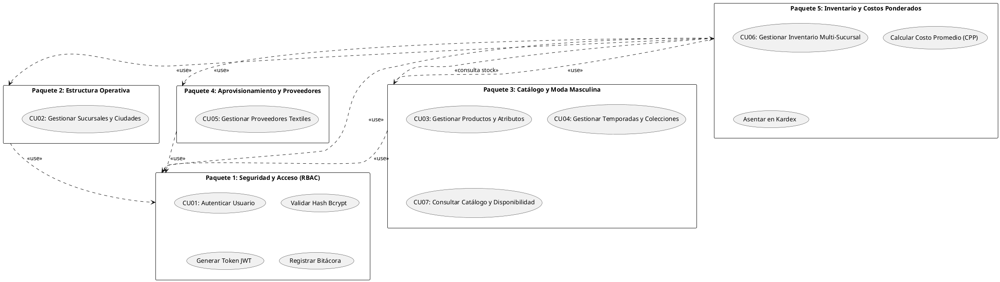
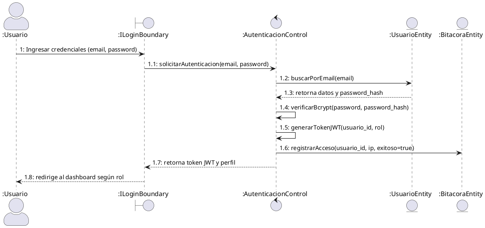
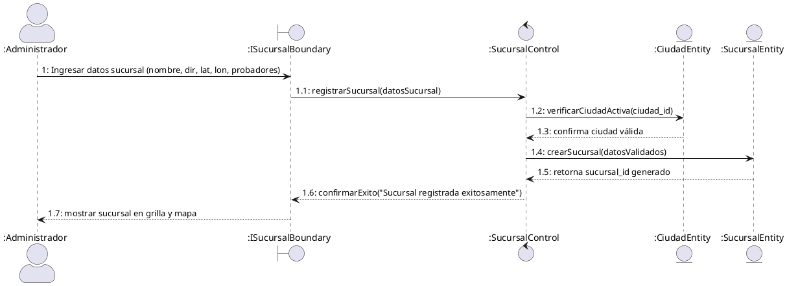
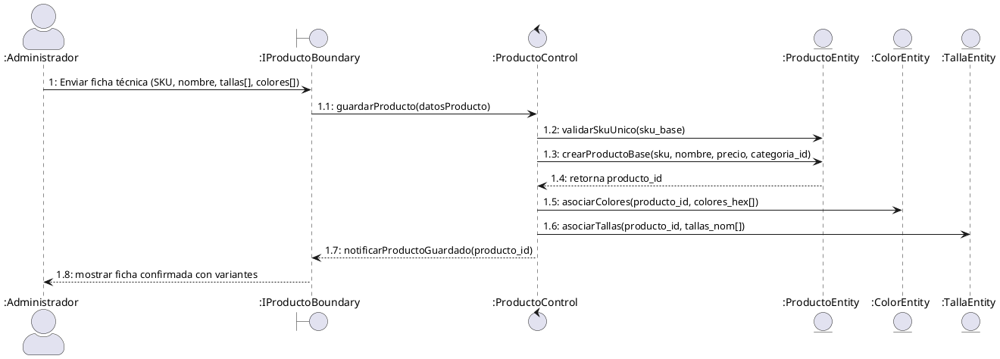
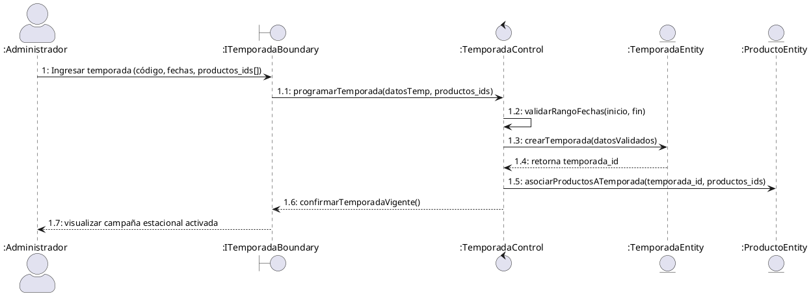
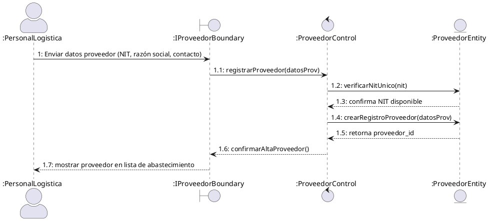

# PLATAFORMA INTELIGENTE DE COMERCIO ELECTRÓNICO PARA TIENDA DE ROPA MASCULINA CON VESTIDORES VIRTUALES VÍA REALIDAD AUMENTADA

## **FashionStore**

**Materia:** Sistemas de Información II (SI2)  
**Semestre:** 2-2026  
**Docente:** MSc. Ing. Angélica Garzón Cuéllar  
**Metodología:** Proceso Unificado de Desarrollo de Software (PUDS) — UML 2.5+  
**Proyecto:** Plataforma E-Commerce Omnicanal Multi-Sucursal para Ropa Masculina

**Integrantes del equipo de desarrollo:**

| Nro. | Nombre completo | Rol | Responsabilidades Principales |
|:---:|:---|:---:|:---|
| 1 | **Alberto Delgado** | Desarrollador Full Stack | Arquitectura Backend FastAPI, Base de Datos PostgreSQL, Módulos de Autenticación RBAC, Inventario/Costos, Venta Digital, Pasarela de Pago, Vestidor Virtual RA, Fidelización |
| 2 | **Andy Mujica** | Desarrollador Full Stack | Frontend Web Angular, Aplicación Móvil Flutter, Módulos de Sucursales, Catálogo, Comparador de Outfits, Reservas, POS Presencial, Asistente IA Contextual, Compras |

---

# 1) Perfil

## 1.1 Introducción

El comercio electrónico (e-commerce) ha redefinido las dinámicas del comercio minorista global, convirtiéndose en un canal indispensable de competitividad, escalabilidad y generación de valor. En el sector de la moda y la indumentaria, los canales digitales experimentan tasas de expansión vertiginosas; dentro de este segmento, el mercado de la moda masculina ha adquirido un protagonismo sin precedentes. El consumidor masculino contemporáneo exige eficiencia, inmediatez, precisión en las especificaciones del producto y una experiencia de compra personalizada que optimice su tiempo y reduzca la fricción en la toma de decisiones.

A pesar de esta acelerada evolución tecnológica, el sector de tiendas de ropa física en nuestro medio enfrenta serias barreras operativas y estructurales al intentar insertarse en la economía digital. La problemática más crítica radica en la **brecha experiencial** existente entre el entorno físico y el entorno digital: el cliente que compra por internet no tiene la posibilidad de palpar los textiles, apreciar los acabados ni verificar el calce y la talla anatómica de las prendas. Esta incertidumbre produce tasas alarmantes de devolución de mercadería (que en la industria textil internacional oscilan entre el 25% y el 35%), carritos de compra abandonados y una erosión constante de la confianza del consumidor hacia las marcas locales.

Simultáneamente, las cadenas minoristas que operan con múltiples sucursales distribuidas en diversas ciudades del país padecen de una marcada fragmentación en la gestión de sus inventarios. La inexistencia de una sincronización centralizada en tiempo real provoca quiebres de existencias (rotura de stock en una sucursal mientras otra acumula sobrestock obsoleto), costos logísticos descontrolados e incapacidad para brindar respuestas inmediatas sobre la disponibilidad de tallas y colores específicos. A ello se suma la ausencia de sistemas rigurosos de valuación de inventario fundamentados en el **costo promedio ponderado**, lo que distorsiona los márgenes reales de ganancia y la rentabilidad financiera del negocio.

Para dar una respuesta integral, innovadora y sostenible a esta problemática, se concibe y diseña **FashionStore**: una plataforma inteligente de comercio electrónico omnicanal para tiendas de ropa masculina, estructurada bajo una arquitectura moderna cliente-servidor basada en microservicios desacoplados. FashionStore conecta de manera sinérgica la presencia digital (web responsiva y aplicación móvil nativa multiplataforma) con la infraestructura física de las tiendas, permitiendo a los clientes no solo adquirir prendas en línea o en puntos de venta físicos (POS), sino también gestionar reservas anticipadas para probarse las prendas presencialmente en sucursales seleccionadas.

Para superar la brecha digital y elevar sustancialmente la competitividad comercial, FashionStore incorpora tres pilares tecnológicos diferenciadores:
1. **Vestidores Virtuales basados en Realidad Aumentada (RA)**: Mediante la cámara del dispositivo móvil, el usuario puede proyectar las prendas tridimensionalmente sobre su silueta en tiempo real, facilitando la visualización del calce y estilo.
2. **Asistente de Estilo con Inteligencia Artificial Contextual**: Un motor cognitivo que genera sugerencias personalizadas de combinaciones y atuendos completos (outfits) analizando variables en tiempo real: condiciones meteorológicas de la ciudad del usuario (vía API de clima), historial transaccional, preferencias estilísticas, temporadas comerciales y análisis cromático/colorimetría.
3. **Sistema de Fidelización Gamificado y Comparador de Outfits**: Un esquema de retención de clientes apoyado en dinámicas de juego (puntos acumulables, niveles Bronce/Plata/Oro/Diamante, insignias por hitos y canje de beneficios) junto con una herramienta interactiva que permite contrastar simultáneamente hasta tres combinaciones de ropa en pantalla.

El desarrollo del proyecto se fundamenta con estricto apego en el **Proceso Unificado de Desarrollo de Software (PUDS)** y el lenguaje de modelado estandarizado **UML versión 2.5+**, garantizando un proceso disciplinado, dirigido por casos de uso, centrado en la arquitectura, e iterativo e incremental a lo largo de tres ciclos evolutivos de desarrollo.

---

## 1.2 Objetivo General

Desarrollar e implementar **FashionStore**, una plataforma inteligente de comercio electrónico omnicanal para una cadena de tiendas de ropa masculina con presencia multi-sucursal, que integre de forma centralizada la venta digital (web y móvil), el punto de venta presencial (POS), la reserva física de prendas, el control de inventarios multi-sucursal con valuación por costo unitario y costo promedio ponderado, pagos electrónicos mediante pasarelas seguras, vestidores virtuales con realidad aumentada, asistencia de estilo mediante inteligencia artificial contextual, un sistema de fidelización gamificado y un comparador interactivo de outfits, aplicando con rigor metodológico el Proceso Unificado de Desarrollo de Software (PUDS) y el modelado estándar UML 2.5+, con despliegue operativo en infraestructura de nube accesible públicamente.

---

## 1.3 Objetivos Específicos

1. **Analizar y delimitar formalmente los requisitos funcionales y no funcionales** del sistema mediante técnicas rigurosas de ingeniería de software, definiendo el alcance técnico y las prioridades de cada iteración dentro del marco metodológico del PUDS.
2. **Implementar el subsistema de seguridad, autenticación y autorización basado en roles (RBAC)**, garantizando el acceso restringido y segregado según perfiles (Administrador, Encargado de Sucursal, Cajero, Personal de Logística, Cliente), cifrado de contraseñas mediante hashing seguro (`bcrypt`), gestión de sesiones con tokens JWT y auditoría de accesos.
3. **Administrar de manera integral el catálogo de indumentaria masculina**, permitiendo la gestión parametrizada de categorías, subcategorías, marcas, modelos, tallas estandarizadas, colores como atributos multivaluados, fichas técnicas, galerías fotográficas y vinculación con temporadas comerciales.
4. **Gestionar la estructura geográfica y operativa multi-sucursal**, administrando ciudades, sucursales físicas, geolocalización, capacidades operativas, horarios de atención y asignación de personal responsable.
5. **Implementar el motor de consulta de disponibilidad de existencias en tiempo real**, permitiendo a clientes y operadores verificar con exactitud el stock por sucursal, producto, talla y color.
6. **Desarrollar el módulo de reservas anticipadas de prendas en tienda física**, habilitando al cliente para preseleccionar múltiples prendas en diversas variantes, seleccionar la sucursal de destino y programar un horario aproximado de visita para la prueba presencial.
7. **Automatizar el flujo de trabajo de atención y preparación de reservas en sucursal**, notificando en tiempo real al encargado de tienda para el apartado físico previo de las prendas y el registro de la atención del cliente.
8. **Diseñar e integrar el vestidor virtual con Realidad Aumentada (RA)** en la aplicación móvil Flutter, aprovechando capacidades de renderizado y visión artificial para superponer prendas virtuales sobre la imagen en directo del usuario.
9. **Construir el comparador visual inteligente de outfits**, que permita al cliente yuxtaponer hasta tres combinaciones de prendas lado a lado en una sola vista, calculando automáticamente costos parciales, descuentos aplicables y montos totales consolidados.
10. **Implementar la pasarela de comercio electrónico omnicanal** con carrito de compras sincronizado, validación estricta de existencias con bloqueos temporales anti-colisión y proceso de checkout fluido tanto en la plataforma web (Angular) como en la app móvil (Flutter).
11. **Desarrollar el punto de venta presencial (POS)** para el personal de caja en sucursales físicas, permitiendo la búsqueda ágil de productos, lectura de códigos de barras, selección de métodos de pago físico y digital, y emisión de comprobantes de venta válidos.
12. **Integrar pasarelas de pago electrónico internacionales (Stripe y PayPal en modo Sandbox)** y pasarelas de pago nacionales con soporte para Códigos QR interoperables y tarjetas de crédito/débito bajo estándares seguros de comunicación.
13. **Desarrollar el motor de control de inventarios multi-sucursal con doble valuación de costos**: registrando en cada ingreso el costo unitario de adquisición del lote y recalculando matemáticamente el **costo promedio ponderado** para una correcta gestión contable y determinación precisa de márgenes de utilidad.
14. **Gestionar las relaciones con proveedores y el aprovisionamiento de mercadería**, administrando órdenes de compra, contratos, recepciones físicas de inventario y asociación a colecciones y temporadas comerciales (primavera-verano, otoño-invierno, escolar, promociones).
15. **Implementar el sistema de fidelización de clientes mediante gamificación**, otorgando puntos por transacciones efectivas, estructurando niveles de membresía jerárquicos (Bronce, Plata, Oro, Diamante), concediendo insignias digitales por hitos de compra y habilitando el canje de puntos por descuentos directos.
16. **Incorporar un Asistente de Estilo con Inteligencia Artificial Contextual**, que recomiende atuendos personalizados analizando en tiempo real la temperatura y clima local del usuario (vía API meteorológica externa), su historial de compras, su paleta de colorimetría y la disponibilidad de prendas en stock.
17. **Integrar interfaces por comandos de voz asistidos por IA** en la aplicación móvil, facilitando la búsqueda inteligente de prendas en lenguaje natural y la generación verbal de reportes ejecutivos para el administrador.
18. **Construir módulos analíticos y cuadros de mando (dashboards)** para soporte en la toma de decisiones empresariales, consolidando indicadores de rendimiento (KPIs), ventas por sucursal, rotación de inventarios, rentabilidad y productos de mayor demanda.
19. **Desplegar la solución informática en infraestructura de nube pública** (Render / Railway / Supabase / AWS), garantizando alta disponibilidad, seguridad HTTPS/TLS y acceso público inmediato mediante URL y código QR para su evaluación formal.

---

## 1.4 Descripción del Problema

### 1.4.1 Contexto Global y Regional del Comercio Minorista de Moda Masculina

El comercio minorista de prendas de vestir (*apparel retail*) representa uno de los sectores económicos más dinámicos y competitivos a nivel global. Históricamente caracterizado por un modelo de comercialización eminentemente físico —donde la interacción táctil con los tejidos, la verificación presencial del corte y la prueba en probadores constituían el núcleo del proceso de compra—, el sector ha experimentado una metamorfosis irreversible acelerada por la digitalización de los consumidores y la masificación de los teléfonos inteligentes.

En el mercado específico de la moda masculina, las tendencias de consumo han evolucionado hacia un patrón distintivo: el comprador masculino contemporáneo valora por encima de todo la **practicidad, la optimización del tiempo, la claridad en la información y la coherencia del estilo**. A diferencia de otros segmentos donde la compra responde predominantemente a impulsos o recreación prolongada, el público masculino busca resolver una necesidad concreta de vestimenta (para el entorno laboral, ocasiones formales, actividades deportivas o estilo urbano) de manera rápida y sin complicaciones. 

Sin embargo, en el contexto de Bolivia y la región latinoamericana, el comercio de moda masculina se encuentra atrapado en una profunda encrucijada estructural. Por una parte, los negocios tradicionales continúan operando con procesos manuales o sistemas de información aislados que carecen de conectividad entre sus puntos de venta. Por otra parte, aquellos comercios que han intentado incursionar en el comercio electrónico lo han hecho a través de canales precarios e improvisados —como catálogos estáticos en redes sociales (Facebook Marketplace, WhatsApp, Instagram)— o mediante la adopción de plataformas genéricas no adaptadas a la realidad operativa del país. Esta situación genera un conjunto de problemáticas críticas que se analizan detalladamente a continuación.

---

### 1.4.2 Diagnóstico de la Situación Actual y Problemáticas Críticas

#### A. La Brecha Experiencial entre el Entorno Digital y el Físico: El Dilema del Calce y la Crisis de Devoluciones
El principal obstáculo que inhibe la conversión en las tiendas de ropa digital es la imposibilidad física de probarse las prendas antes del pago. Las tablas de tallas tradicionales (S, M, L, XL) carecen de uniformidad entre fabricantes, marcas y líneas de confección: un pantalón talla 32 de corte *Slim Fit* de una marca importada difiere notablemente de un modelo equivalente de corte clásico o confección nacional.

Esta incertidumbre dimensional genera una barrera psicológica en el cliente, quien ante la duda opta por desistir de la compra en línea, recurrir a compras presenciales con alta pérdida de tiempo, o incurrir en la práctica del *bracket-ordering* (adquirir deliberadamente dos o tres tallas de la misma prenda para quedarse con una y devolver el resto). En la industria de la moda a nivel internacional, las ventas en línea registran tasas de devolución superiores al **30%**, mientras que en las tiendas físicas difícilmente alcanzan el **8% al 10%**. Cada devolución representa un impacto financiero severo: costos de reenvío y logística inversa, reacondicionamiento de prendas, deterioro del empaque y pérdida del costo de oportunidad por stock inmovilizado durante el proceso de restitución.

#### B. Desarticulación y Silos de Información en la Gestión de Inventarios Multi-Sucursal
Las cadenas de tiendas de ropa que operan en múltiples ciudades (como Santa Cruz de la Sierra, La Paz y Cochabamba) y con diversas sucursales urbanas sufren de una severa desconexión informativa. Frecuentemente, el inventario es controlado de manera fragmentada: cada tienda física cuenta con su propio cuaderno de registro, una hoja de cálculo local o un sistema monofásico desconectado de la central.

Esta falta de visibilidad en tiempo real produce dos fenómenos igualmente perjudiciales:
1. **Quiebre o rotura de stock (*Stockouts*)**: Un cliente acude a una sucursal buscando una camisa ejecutiva blanca en talla M y se le informa que el producto está agotado, perdiendo la venta de inmediato porque el personal desconoce si en la sucursal de otra zona de la ciudad existen unidades disponibles.
2. **Sobrestock y obsolescencia estacional**: En una sucursal se acumulan decenas de unidades de prendas de temporada fría que no rotan, mientras en otra sucursal de una ciudad de clima templado o frío existe sobredemanda insatisfecha. La falta de un sistema centralizado impide planificar traslados y transferencias inter-sucursales oportunas antes de que la temporada comercial culmine y la mercadería deba liquidarse con pérdidas.

#### C. Distorsión Contable y Ausencia de Valuación por Costo Promedio Ponderado
La adquisición de prendas de vestir está sujeta a una alta variabilidad de costos de adquisición. Las cadenas compran lotes sucesivos de un mismo producto en diferentes periodos del año; los costos unitarios fluctúan drásticamente debido a variaciones cambiarias de divisas, fletes de importación, volumen negociado con el proveedor, aranceles aduaneros y fluctuaciones inflacionarias.

La gran mayoría de los sistemas comerciales básicos registra el inventario utilizando únicamente el **último costo unitario de compra**. Esta simplificación contable es nefasta para la salud financiera de la empresa:
- Si el último lote de 50 camisas se adquirió a un precio mayor (ej. 120 Bs) debido a un aumento transitorio de transporte, y aún existían en bodega 150 camisas compradas a 80 Bs, registrar todo el inventario a 120 Bs sobrevalora artificialmente el activo y distorsiona el margen de utilidad.
- Por el contrario, si se adquirió un lote de liquidación a menor precio, se subvalora el inventario existente.
- Además, en el marco tributario boliviano, las operaciones comerciales formales deben considerar el crédito y débito fiscal del Impuesto al Valor Agregado (IVA - 13%) y el Impuesto a las Transacciones (IT - 3%), totalizando una carga impositiva formal que exige conocer con exactitud matemática el **costo promedio ponderado** del inventario para determinar con rigor la utilidad operativa neta y cumplir con las regulaciones de auditoría.

#### D. Ineficiencia en la Dinámica de Compra Presencial y Falta de Mecanismos de Reserva Previa
Cuando un cliente decide visitar una tienda física, el proceso tradicional de atención está plagado de fricciones. El cliente debe buscar manualmente entre perchas y anaqueles saturados, solicitar la intervención de un vendedor para consultar si hay stock en bodega, esperar a que el encargado revise depósitos desordenados y, si tiene éxito, esperar turno frente a probadores colapsados en horas pico. Si la prenda no calza adecuadamente, el ciclo de búsqueda debe repetirse desde cero.

Este flujo arcaico genera agotamiento en el consumidor, saturación en las salas de venta y un bajo índice de conversión por metro cuadrado de tienda. No existe un puente tecnológico que permita al cliente explorar digitalmente el catálogo desde su hogar o teléfono, seleccionar las prendas exactas que desea probarse, y **generar una reserva anticipada** para una sucursal específica con fecha y hora programadas, de modo que al llegar a la tienda el personal ya tenga las prendas apartadas, planchadas y listas en el probador asignado.

#### E. Ausencia de Personalización, Inteligencia Contextual y Fidelización del Cliente
El comercio minorista tradicional trata a todos los clientes bajo un estándar homogéneo. El comprador promedio se enfrenta a catálogos masivos y genéricos con cientos de prendas sin ningún tipo de curaduría adaptada a su contextura, estilo de vida, entorno geográfico o preferencias cromáticas.

Asimismo, no se aprovechan las condiciones de contexto dinámico: no tiene sentido recomendar parkas pesadas de lana a un cliente ubicado en una ciudad de clima tropical en pleno verano, ni trajes de lino claro en un día lluvioso de invierno. De igual forma, las empresas carecen de esquemas estructurados de **Fidelización y Gestión de Relaciones con el Cliente (CRM)**. Los clientes fieles que realizan compras recurrentes reciben exactamente el mismo trato y precios que un visitante esporádico, desaprovechando las mecánicas de gamificación (acumulación de puntos por compras, niveles de membresía con privilegios escalonados e incentivos de recompra) que han demostrado elevar el valor de vida del cliente (*Customer Lifetime Value - CLV*) en más del 40%.

#### F. Desconexión Transaccional y Dispersión de Métodos de Pago
Por último, el ecosistema transaccional se encuentra fragmentado. En el canal físico, las cajas registradoras suelen operar de espaldas al sistema digital, con terminales de cobro independientes que requieren doble captura manual de datos. En el canal digital, existe desconfianza hacia los pagos con tarjeta de crédito en línea por temor a fraudes informáticos, y los métodos locales emergentes (como el Código QR Interoperable impulsado por el Banco Central de Bolivia) carecen frecuentemente de automatización e integración directa vía webhooks con las plataformas web y móviles, exigiendo que el usuario envíe una captura de pantalla por WhatsApp para que un operador verifique manualmente el depósito.

---

### 1.4.3 Matriz de Análisis Causa-Efecto (Diagrama de Ishikawa)

Para estructurar formalmente las causas raíz que originan la ineficiencia, pérdida de clientes y altos costos operativos en el negocio de moda masculina, se presenta la siguiente matriz analítica basada en las 5 dimensiones fundamentales de la ingeniería de procesos (Métodos, Tecnología, Personal, Materiales/Inventario y Clientes):

| Dimensión | Causa Raíz Primaria | Efecto Directo en la Operación | Consecuencia Final para el Negocio |
|:---|:---|:---|:---|
| **Métodos y Procesos** | Ausencia de flujos de reserva anticipada de prendas por sucursal. | Clientes insatisfechos por desabastecimiento presencial y colapso de probadores. | Abandono de la tienda física y pérdida irreversible de ventas potenciales. |
| **Métodos y Procesos** | Registro de inventario limitado al último costo unitario de compra. | Distorsión del valor real del activo e inexactitud en el cálculo del margen de utilidad. | Incumplimiento contable-tributario y toma de decisiones financieras erróneas. |
| **Tecnología y Sistemas** | Falta de herramientas virtuales de verificación de calce y prueba de prendas. | Incertidumbre dimensional del cliente al adquirir prendas en la plataforma digital. | Tasa de devoluciones superior al 30% y saturación logística de post-venta. |
| **Tecnología y Sistemas** | Dispersión de sistemas no integrados entre tienda web, app móvil y cajas POS. | Desincronización de existencias y desfase de inventario tras ventas concurrentes. | Venta de productos sin stock real (*overselling*) y descontento del cliente. |
| **Inventario y Stock** | Gestión aislada por sucursal sin visibilidad geográfica consolidada. | Desbalance de existencias: acumulación de sobrestock en sucursal A y quiebres en sucursal B. | Pérdida de rentabilidad por liquidaciones forzosas y costos innecesarios de almacenamiento. |
| **Personal y Atención** | Atención reactiva sin conocimiento previo de las preferencias o reservas del cliente. | Tiempos de atención prolongados en tienda y búsqueda manual en bodegas. | Baja productividad del personal de sala de ventas y congestión en sucursales. |
| **Cliente y Mercado** | Catálogos estáticos no personalizados y carencia de programas de fidelización estructurados. | Experiencia de compra impersonal y ausencia de incentivos de recurrencia. | Alta tasa de deserción hacia competidores y bajo valor de vida del cliente (*CLV*). |

---

### 1.4.4 Impacto y Consecuencias de la Inacción

Si una cadena de indumentaria masculina decide posponer la modernización integral de sus sistemas y procesos, las repercusiones a corto y mediano plazo amenazan la viabilidad misma de la organización:

1. **Erosión Progresiva de Márgenes Financieros**: La combinación de devoluciones masivas en el canal digital (con fletes inversos absorbidos por el comercio) junto a márgenes distorsionados por valuaciones empíricas de inventario destruyen la rentabilidad neta.
2. **Obsolescencia Acelerada del Stock**: La ropa masculina responde a ciclos de temporada rígidos. La mercadería que no rota oportunamente por falta de visibilidad multi-sucursal se devalúa drásticamente, obligando a remates por debajo del costo promedio de adquisición.
3. **Pérdida de Posicionamiento ante Competidores Nativos Digitales**: Los nuevos actores del mercado que implementan plataformas omnicanales, pagos ágiles y entregas rápidas capturan con celeridad al segmento de clientes masculinos jóvenes y profesionales, caracterizados por su alto poder adquisitivo y poca tolerancia a la ineficiencia.
4. **Degradación de la Imagen de Marca**: Vender en línea prendas que luego se revelan sin stock en bodega, o entregar tallas incompatibles que frustran las expectativas del comprador, socava la credibilidad corporativa en redes sociales y entornos digitales.

---

### 1.4.5 Formulación de la Solución Integral con FashionStore

Frente a este escenario complejo, **FashionStore** se formula como una solución tecnológica transformadora y omnicanal, diseñada específicamente para cerrar la brecha físico-digital en la moda masculina mediante:

- **Convergencia Omnicanal**: Unificación de la tienda web responsiva (Angular), la aplicación móvil interactiva (Flutter) y los puntos de venta presenciales (POS) bajo un único backend centralizado (FastAPI) con base de datos unificada (PostgreSQL).
- **Control Riguroso de Inventarios Multi-Sucursal**: Sincronización atómica de existencias, control de transferencias y cálculo automático del **costo promedio ponderado** tras cada recepción de compra a proveedores.
- **Flujo Innovador de Reserva Presencial**: Habilitación del servicio de apartado digital de prendas con fecha y hora programadas, permitiendo que el cliente acuda a la sucursal seleccionada a vivir una experiencia ágil de prueba física.
- **Reducción Drástica de Devoluciones mediante Realidad Aumentada**: Implementación del vestidor virtual interactivo sobre dispositivos móviles, dotando al usuario de certezas visuales respecto al calce, caída y textura del producto.
- **Personalización Extrema con IA Contextual**: Algoritmos de recomendación capaces de sintetizar clima meteorológico local, colorimetría y preferencias personales en atuendos coordinados.
- **Gamificación Comercial**: Mecánicas de fidelización que transforman cada compra en puntos, ascensos de nivel jerárquico y descuentos exclusivos, maximizando la retención de clientes.

---

## 1.5 Alcance

### 1.5.1 Módulos del Sistema

A continuación se detalla exhaustivamente cada uno de los **19 módulos funcionales** que conforman la plataforma FashionStore. Cada especificación define la descripción operativa orientada al control de acceso basado en roles (RBAC), la segregación de responsabilidades, la estructura de datos clave (con identificadores, tipos de datos, hashes de seguridad y restricciones de integridad) y las funcionalidades clave correspondientes.

---

#### 1.5.1.1 Módulo M01: Autenticación, Autorización y Seguridad (RBAC)
**Descripción General:**  
Permite gestionar el acceso seguro y controlado a la plataforma mediante un esquema estricto de Control de Acceso Basado en Roles (RBAC). Cada usuario que interactúa con FashionStore (Administrador, Encargado de Sucursal, Cajero, Personal de Logística/Inventario, Cliente o Proveedor) accede exclusivamente a las vistas, endpoints y operaciones autorizadas para su perfil específico. Implementa mecanismos de alta seguridad informática, garantizando la confidencialidad, integridad y no repudio de la información transaccional.

**Datos principales:**
- `id_usuario`: Entero autoincremental (PK).
- `nombres` y `apellidos`: Cadenas alfanuméricas (obligatorias).
- `email`: Cadena alfanumérica única (Unique Constraint, indexado para búsquedas rápidas de autenticación).
- `password_hash`: Cadena alfanumérica de 60 caracteres generada mediante algoritmo criptográfico `bcrypt` con factor de coste balanceado (nunca se almacena texto en claro).
- `rol`: Enumerador tipado (`ADMINISTRADOR`, `ENCARGADO_SUCURSAL`, `CAJERO`, `LOGISTICA`, `CLIENTE`, `PROVEEDOR`).
- `estado_cuenta`: Enumerador tipado (`ACTIVO`, `INACTIVO`, `BLOQUEADO_POR_INTENTOS`, `PENDIENTE_VERIFICACION`).
- `intentos_fallidos`: Entero corto (contador acumulativo de intentos consecutivos de inicio de sesión erróneos).
- `ultimo_acceso`: Timestamp de fecha y hora exacta del último login exitoso.
- `token_jwt`: Token web JSON firmado con clave asimétrica RSA/HMAC conteniendo claims de identidad y expiración configurable (60 minutos para web, 30 días para móvil mediante refresh token).
- `id_sucursal_asignada`: Entero (FK opcional, vincula al empleado con una sucursal física determinada).

**Funcionalidades clave:**
- Inicio de sesión seguro con validación estricta de credenciales hash y emisión de tokens JWT.
- Cierre de sesión con invalidación y revocación inmediata de tokens en lista de exclusión (Blacklist en memoria/Redis).
- Bloqueo preventivo y automático de la cuenta tras 3 intentos fallidos consecutivos de autenticación.
- Recuperación automatizada de contraseña mediante generación de tokens de un solo uso (OTP) temporizados enviados al correo electrónico registrado.
- Cambio de contraseña por el propio usuario con validación estricta de robustez (mínimo 8 caracteres, combinación de mayúsculas, minúsculas, números y símbolos especiales).
- Gestión y mantenimiento de perfiles y asignación de roles por parte del Administrador General.
- Registro en bitácora de auditoría de cada intento de acceso (login/logout, IP de origen, User-Agent, fecha/hora y resultado).

---

#### 1.5.1.2 Módulo M02: Gestión de Sucursales y Ciudades
**Descripción General:**  
Administra la estructura física, geográfica y organizacional de la cadena de tiendas de indumentaria. Permite definir las ciudades de cobertura y las diferentes sucursales habilitadas en cada territorio, estableciendo su localización geográfica precisa, capacidades de atención, números de contacto y personal asignado, sirviendo como eje espacial para el inventario, las reservas presenciales y los despachos.

**Datos principales:**
- `id_sucursal`: Entero autoincremental (PK).
- `id_ciudad`: Entero (FK hacia la tabla `Ciudades`).
- `nombre_sucursal`: Cadena alfanumérica (ej. "Sucursal Equipetrol", "Sucursal Calacoto").
- `direccion_fisica`: Texto descriptivo de la ubicación y referencias viales.
- `latitud` y `longitud`: Valores de precisión decimal (GPS) para geolocalización y cálculo de distancias.
- `telefono_contacto`: Cadena numérica.
- `horario_apertura` y `horario_cierre`: Formato Time (ej. 09:00:00 a 21:00:00).
- `capacidad_probadores`: Entero (número de vestidores físicos disponibles para atención concurrente de reservas).
- `estado_operativo`: Enumerador tipado (`OPERATIVA`, `EN_MANTENIMIENTO`, `CERRADA_TEMPORALMENTE`).

**Funcionalidades clave:**
- Registro, modificación, baja lógica y consulta detallada de ciudades y regiones de cobertura.
- CRUD completo de sucursales físicas con registro georreferenciado (latitud/longitud).
- Asignación de encargados de tienda y personal operativo a sucursales específicas.
- Parametrización de días laborables, feriados y franjas horarias de atención para reservas presenciales.
- Consulta interactiva y pública de sucursales cercanas para el cliente desde la app móvil o web mediante geolocalización.
- Habilitación o inhabilitación temporal de sucursales para recepción de pedidos o reservas.

---

#### 1.5.1.3 Módulo M03: Gestión de Productos, Categorías y Atributos
**Descripción General:**  
Centraliza la administración del catálogo de prendas de vestir masculinas. Gestiona de forma desacoplada las categorías (camisas, trajes, pantalones, calzado, accesorios), marcas comerciales, modelos, colecciones y los atributos intrínsecos de cada prenda, destacando el manejo de colores como atributos multivaluados y tallas normalizadas, junto con la gestión multimedia de imágenes en alta definición.

**Datos principales:**
- `id_producto`: Entero autoincremental (PK).
- `codigo_sku_base`: Cadena alfanumérica única estandarizada (ej. "SHIRT-SLIM-001").
- `nombre`: Cadena alfanumérica (ej. "Camisa Oxford Slim Fit").
- `descripcion`: Texto detallado con especificaciones textiles, composición de tela y cuidados.
- `id_categoria`: Entero (FK hacia `Categorias`).
- `id_marca`: Entero (FK hacia `Marcas`).
- `precio_venta_base`: Decimal con dos dígitos de precisión (monto estándar en moneda nacional).
- `genero`: Enumerador fijado en `MASCULINO`.
- `tallas_disponibles`: Arreglo / relación relacional normalizada (`S`, `M`, `L`, `XL`, `XXL`, `38`, `40`, `42`).
- `colores_multivaluados`: Arreglo estructurado de colores con nombre comercial y código hexadecimal (ej. `[{"nombre": "Azul Marino", "hex": "#000080"}, {"nombre": "Blanco", "hex": "#FFFFFF"}]`).
- `imagenes_url`: Arreglo de URLs hacia repositorio de almacenamiento en la nube (S3/Cloudinary).
- `estado_publicacion`: Enumerador (`BORRADOR`, `PUBLICADO`, `DESCATALOGADO`).

**Funcionalidades clave:**
- Registro y actualización de fichas técnicas de prendas con validación de código SKU único.
- Gestión taxonómica de categorías y subcategorías jerárquicas de indumentaria masculina.
- Configuración de tallas y asignación de paletas de colores multivaluados con código visual Hexadecimal.
- Carga múltiple y optimización de imágenes de productos para web y móvil (vistas frontal, dorsal y detalle).
- Activación, suspensión y descatalogación de productos del catálogo público.
- Vinculación de productos con modelos 3D y texturas para el vestidor virtual en Realidad Aumentada.

---

#### 1.5.1.4 Módulo M04: Gestión de Temporadas y Colecciones
**Descripción General:**  
Permite planificar, organizar y calendarizar las campañas comerciales de la moda masculina. Clasifica los productos dentro de colecciones estacionales (Primavera-Verano, Otoño-Invierno, Temporada Escolar/Universitaria, Black Friday, Ediciones Especiales de Gala), facilitando la rotación estratégica del inventario, la aplicación de políticas de precios diferenciadas y la alimentación de datos contextuales al motor de Inteligencia Artificial.

**Datos principales:**
- `id_temporada`: Entero autoincremental (PK).
- `nombre_temporada`: Cadena alfanumérica (ej. "Primavera - Verano 2026", "Línea Ejecutiva Invierno").
- `codigo_campaña`: Cadena alfanumérica única (ej. "SS-2026").
- `fecha_inicio`: Fecha de lanzamiento oficial de la temporada.
- `fecha_fin`: Fecha de cierre y liquidación de temporada.
- `descripcion`: Texto explicativo de la línea conceptual de la colección.
- `estado_temporada`: Enumerador tipado (`PLANIFICADA`, `VIGENTE`, `EN_LIQUIDACION`, `FINALIZADA`).
- `descuento_liquidacion_sugerido`: Porcentaje numérico aplicable al fin de temporada.

**Funcionalidades clave:**
- Creación, modificación y cierre formal de temporadas y colecciones comerciales.
- Asociación masiva o individual de productos del catálogo a una o múltiples temporadas.
- Activación automatizada de promociones y descuentos por cambio de temporada comercial.
- Segmentación de colecciones para campañas de marketing y recomendaciones personalizadas por IA.
- Reporte comparativo de ventas y rentabilidad entre colecciones históricas.

---

#### 1.5.1.5 Módulo M05: Gestión de Proveedores y Abastecimiento
**Descripción General:**  
Administra la cadena de suministro y aprovisionamiento de mercadería. Gestiona la información jurídica, comercial y crediticia de los proveedores nacionales e internacionales que confeccionan y distribuyen las prendas de vestir, controlando el catálogo de productos suministrados, condiciones de entrega, plazos de crédito y contratos comerciales.

**Datos principales:**
- `id_proveedor`: Entero autoincremental (PK).
- `razon_social`: Cadena alfanumérica oficial.
- `nit_o_identificacion`: Cadena alfanumérica única (Número de Identificación Tributaria).
- `nombre_contacto`: Cadena alfanumérica del ejecutivo de cuentas.
- `telefono` y `email`: Datos de contacto directo.
- `direccion_sede`: Texto físico y país/ciudad de origen.
- `terminos_pago`: Enumerador (`CONTADO`, `CREDITO_30_DIAS`, `CREDITO_60_DIAS`, `CONSIGNACION`).
- `estado`: Enumerador (`ACTIVO`, `INACTIVO`, `OBSERVADO`).

**Funcionalidades clave:**
- Registro de proveedores con validación de identificación tributaria y datos comerciales.
- Vinculación de proveedores con líneas de productos y categorías textiles autorizadas.
- Registro y seguimiento de órdenes de compra con detalle de cantidades y precios acordados.
- Evaluación de cumplimiento en tiempos de entrega y control de calidad de lotes recibidos.
- Consulta de historial consolidado de compras y pagos por proveedor.

---

#### 1.5.1.6 Módulo M06: Gestión de Inventario Multi-Sucursal y Costos Ponderados
**Descripción General:**  
Constituye el núcleo logístico y financiero de FashionStore. Controla en tiempo real las existencias físicas de cada variante de producto (producto, talla, color) en cada una de las sucursales de la cadena. Implementa de manera estricta el algoritmo de **Costo Promedio Ponderado** tras cada entrada de mercadería por compra, almacenando paralelamente el **último costo unitario de adquisición** de acuerdo con las especificaciones académicas del proyecto. Registra la trazabilidad completa de transferencias inter-sucursales, mermas y ajustes de inventario.

**Datos principales:**
- `id_inventario`: Entero autoincremental (PK).
- `id_sucursal`: Entero (FK hacia `Sucursales`).
- `id_producto`: Entero (FK hacia `Productos`).
- `talla`: Cadena normalizada (ej. "M", "42").
- `color`: Cadena del color específico (ej. "Azul Marino").
- `stock_fisico`: Entero (cantidad física existente en la tienda).
- `stock_reservado`: Entero (cantidad apartada temporalmente para clientes con reservas presenciales vigentes).
- `stock_disponible`: Entero calculado (`stock_fisico - stock_reservado`).
- `stock_minimo`: Entero (umbral de reorden para alertas de desabastecimiento).
- `stock_maximo`: Entero (límite de almacenamiento físico en la sucursal).
- `ultimo_costo_unitario`: Decimal(10,2) (valor unitario pagado en el lote de compra más reciente).
- `costo_promedio_ponderado`: Decimal(10,2) (recalculado matemáticamente según: $CPP_{nuevo} = \frac{(Stock_{anterior} \times CPP_{anterior}) + (Cant_{ingreso} \times Costo_{ingreso})}{Stock_{anterior} + Cant_{ingreso}}$).
- `ubicacion_almacen`: Cadena descriptiva (ej. "Estante B, Percha 4").

**Funcionalidades clave:**
- Control de existencias por variante de producto segregado por cada sucursal de la empresa.
- Actualización atómica del inventario y bloqueo temporal durante transacciones concurrentes de compra o reserva.
- Cálculo matemático automático del Costo Promedio Ponderado y registro del Último Costo Unitario en cada recepción.
- Solicitud, autorización, despacho y recepción de transferencias de prendas entre sucursales.
- Generación de alertas automáticas al encargado de tienda cuando el stock cruza el umbral mínimo configurado.
- Registro de bitácora inmutable de movimientos de kardex (entradas, salidas, ajustes por merma y transferencias) con fecha, hora, responsable y justificación.

---

#### 1.5.1.7 Módulo M07: Catálogo Digital Omnicanal (Web y Móvil)
**Descripción General:**  
Expone el portafolio de prendas de vestir masculinas a través de la plataforma web responsiva (Angular) y la aplicación móvil nativa (Flutter). Proporciona a los clientes y visitantes una experiencia de navegación sumamente rápida, fluida y visualmente atractiva, con capacidades de búsqueda predictiva, filtros multifacéticos en tiempo real y verificación inmediata de disponibilidad de stock por sucursal física.

**Datos principales:**
- Parámetros de consulta y filtrado: Categoría, Rango de Precios, Talla, Color, Temporada, Marca, Ciudad y Sucursal.
- Esquema de serialización JSON enriquecido: SKU, nombre, descripción formateada, galería multimedia, variantes de talla/color, disponibilidad en sucursal y atributos de compatibilidad con realidad aumentada.
- Índices de base de datos relacionales y full-text search para optimización de tiempos de respuesta (< 2 segundos).

**Funcionalidades clave:**
- Visualización jerárquica del catálogo de moda masculina con paginación optimizada e infinitescroll.
- Filtrado multidimensional combinando simultáneamente temporada, talla, color, marca y precio.
- Selector interactivo de sucursal con consulta inmediata de existencias por talla y color específico.
- Ficha detallada de prenda con guía de tallas anatómicas masculinas y recomendaciones de cuidado textil.
- Funcionalidad de marcado y gestión de lista de prendas favoritas (*Wishlist*) sincronizada entre web y app móvil.

---

#### 1.5.1.8 Módulo M08: Vestidor Virtual con Realidad Aumentada (RA)
**Descripción General:**  
Implementa el probador virtual tridimensional mediante tecnología de Realidad Aumentada sobre la aplicación móvil Flutter. Mediante la cámara del smartphone del usuario, el sistema superpone modelos 3D y texturas hiperrealistas de prendas masculinas sobre la silueta del cliente en tiempo real, permitiéndole evaluar la caída, el tamaño proporcional y la armonía visual antes de tomar la decisión de reserva o compra.

**Datos principales:**
- `id_recurso_ra`: Entero autoincremental (PK).
- `id_producto`: Entero (FK hacia `Productos`).
- `modelo_3d_url`: Cadena URI apuntando al archivo tridimensional optimizado (`.glb` / `.gltf`).
- `texturas_url`: Mapeo JSON de texturas diferenciadas por color de prenda.
- `puntos_anclaje_corporal`: Configuración JSON de mapeo anatómico (hombros, torso, cadera, cuello).
- `escala_referencia`: Factor numérico decimal de calibración de proporciones anatómicas.

**Funcionalidades clave:**
- Detección de silueta humana y extremidades mediante visión artificial (ARCore / ML Kit).
- Proyección tridimensional en tiempo real de chaquetas, camisas, blazers y camisetas sobre el cuerpo del usuario.
- Cambio dinámico de color y textura de la prenda proyectada sin interrumpir la transmisión de la cámara.
- Captura fotográfica del outfit proyectado con opción de guardado local o compartición en redes sociales.
- Integración directa desde la vista de Realidad Aumentada hacia el Carrito de Compras o el Flujo de Reserva.

---

#### 1.5.1.9 Módulo M09: Comparador Inteligente de Outfits
**Descripción General:**  
Herramienta de análisis visual y estilístico que permite al cliente contrastar de manera interactiva hasta tres combinaciones completas de ropa masculina (*outfits*) lado a lado en una sola pantalla. El módulo desglosa visualmente cada combinación (prenda superior, prenda inferior, calzado y accesorios), calcula los subtotales, compara los precios de cada conjunto y visualiza los beneficios de fidelización o descuentos aplicables a cada alternativa.

**Datos principales:**
- `id_comparacion`: Entero autoincremental (PK o identificador de sesión local).
- `id_cliente`: Entero (FK opcional, almacenable en perfil).
- `outfit_1`, `outfit_2`, `outfit_3`: Estructuras JSON compuestas conteniendo: lista de SKUs de prendas seleccionadas, tallas, colores elegidos, precio unitario de cada una y monto acumulado.
- `total_outfit_1`, `total_outfit_2`, `total_outfit_3`: Montos decimales calculados.
- `fecha_comparacion`: Timestamp.

**Funcionalidades clave:**
- Interfaz interactiva de arrastrar y soltar (*drag & drop*) o selección rápida para ensamblar hasta tres combinaciones.
- Visualización paralela lado a lado de las tres combinaciones con detalles de precio, color y disponibilidad.
- Cálculo automático y comparativo del costo total de cada outfit, indicando la opción más económica y la de mejor valoración.
- Reemplazo dinámico de componentes individuales (ej. sustituir una camisa formal por una casual y observar el cambio de precio global).
- Botón de acción directa para transferir el outfit ganador íntegramente al carrito de compras o a una reserva presencial.

---

#### 1.5.1.10 Módulo M10: Sistema de Reservas de Prendas en Sucursal
**Descripción General:**  
Regula el proceso omnicanal mediante el cual un cliente preselecciona un lote de prendas desde la plataforma digital para probárselas físicamente en una sucursal determinada. El sistema reserva el stock temporalmente para evitar que se venda a terceros, genera un código de reserva único con código QR, y notifica inmediatamente a la sucursal de destino para que el encargado prepare y ordene las prendas en un probador asignado.

**Datos principales:**
- `id_reserva`: Entero autoincremental (PK).
- `codigo_reserva`: Cadena alfanumérica única de 8 caracteres (ej. "RSV-2026-X8K").
- `id_cliente`: Entero (FK hacia `Clientes`).
- `id_sucursal`: Entero (FK hacia `Sucursales`).
- `fecha_reserva`: Fecha en que fue emitida la solicitud.
- `fecha_programada_visita`: Fecha y hora fijada por el cliente para acudir a la tienda.
- `hora_limite_vigencia`: Timestamp en el que la reserva expira y el stock reservado se libera automáticamente si el cliente no se presenta.
- `estado_reserva`: Enumerador tipado (`PENDIENTE_PREPARACION`, `PREPARADA_EN_SUCURSAL`, `CLIENTE_PRESENTE`, `CONCRETADA_VENTA`, `CANCELADA_POR_CLIENTE`, `EXPIRADA`).
- `items_reserva`: Tabla detalle con: `id_producto`, `talla`, `color`, `cantidad`, `precio_al_momento`.

**Funcionalidades clave:**
- Generación de reservas multi-prenda indicando sucursal, fecha y rango de hora de visita presencial.
- Bloqueo atómico temporal del inventario disponible de la sucursal asignada durante la vigencia de la reserva.
- Generación de comprobante digital de reserva con código QR escaneable por el personal de tienda.
- Notificación en tiempo real y panel de control para que el Encargado de Sucursal marque la reserva como "Preparada en Percha/Probador".
- Confirmación de llegada del cliente mediante lectura del QR de la reserva y transición de estados del proceso.
- Liberación automática del stock inmovilizado mediante tarea programada si la reserva vence sin asistencia del cliente.

---

#### 1.5.1.11 Módulo M11: Carrito de Compras Omnicanal
**Descripción General:**  
Gestiona el almacenamiento temporal y la persistencia de las prendas seleccionadas por el cliente para su adquisición digital. Opera de manera sincronizada entre la versión web y la aplicación móvil para usuarios autenticados, o mediante almacenamiento local seguro para invitados. Realiza validaciones dinámicas de existencias, cálculo automatizado de subtotales, impuestos y aplicación de promociones o descuentos de fidelización.

**Datos principales:**
- `id_carrito`: Entero autoincremental (PK).
- `id_cliente`: Entero (FK hacia `Clientes`, nulo para carritos anónimos gestionados por UUID de sesión).
- `items_carrito`: Estructura detalle con: `id_producto`, `talla`, `color`, `cantidad`, `precio_unitario`, `id_sucursal_despacho`.
- `subtotal`: Decimal(10,2).
- `monto_descuento`: Decimal(10,2).
- `monto_total`: Decimal(10,2).
- `fecha_ultima_actualizacion`: Timestamp.

**Funcionalidades clave:**
- Incorporación, edición de cantidades y remoción de prendas con validación instantánea de disponibilidad en stock.
- Persistencia del carrito en base de datos para usuarios registrados, permitiendo iniciar la selección en la app móvil y finalizarla en la web.
- Cálculo automático de importes, subtotales, descuentos promocionales y costo de envío según la modalidad elegida.
- Detección de variaciones de stock o precio antes de avanzar a la pasarela de pago.
- Vaciado automático o conversión directa del carrito en una Orden de Venta formal.

---

#### 1.5.1.12 Módulo M12: Venta Digital y Checkout
**Descripción General:**  
Controla el flujo completo de formalización de la compra en los canales digitales (web y móvil). Gestiona la selección del método de entrega (envío a domicilio o retiro gratuito en sucursal física - *Click & Collect*), la captura de datos fiscales para la facturación, la confirmación de la transacción con la pasarela de pagos y la emisión del comprobante digital de compra.

**Datos principales:**
- `id_orden_venta`: Entero autoincremental (PK).
- `numero_factura_o_nota`: Cadena alfanumérica única (ej. "FACT-DIG-00452").
- `id_cliente`: Entero (FK hacia `Clientes`).
- `tipo_entrega`: Enumerador (`RETIRO_EN_SUCURSAL`, `DELIVERY_A_DOMICILIO`).
- `id_sucursal_retiro`: Entero (FK opcional hacia `Sucursales` en caso de retiro presencial).
- `direccion_envio`: Texto descriptivo estructurado en caso de delivery a domicilio.
- `monto_subtotal`: Decimal(10,2).
- `costo_envio`: Decimal(10,2).
- `descuento_aplicado`: Decimal(10,2).
- `monto_total_pagado`: Decimal(10,2).
- `estado_orden`: Enumerador (`PENDIENTE_PAGO`, `PAGADO_CONFIRMADO`, `EN_PREPARACION`, `EN_CAMINO`, `ENTREGADO`, `ANULADO`).
- `id_transaccion_pago`: Cadena (identificador devuelto por la pasarela de pagos).
- `fecha_hora_venta`: Timestamp de formalización.

**Funcionalidades clave:**
- Asistente de Checkout de pasos secuenciales: Selección de Entrega -> Datos de Facturación -> Pago -> Confirmación.
- Validación final de inventario con bloqueo transaccional atómico antes de invocar la pasarela de cobro.
- Descuento definitivo e inmediato del stock en la sucursal de despacho tras la confirmación exitosa del pago.
- Generación de comprobante digital de venta en formato PDF descargable y envío automatizado al correo del cliente.
- Consulta y seguimiento del estado de la orden en tiempo real por parte del cliente (*Tracking*).

---

#### 1.5.1.13 Módulo M13: Punto de Venta Presencial (POS)
**Descripción General:**  
Módulo web operativo diseñado para los cajeros de las sucursales físicas. Optimizado para pantallas táctiles y teclado numérico rápido, permite registrar ventas directas de mostrador a clientes que acuden a la tienda, leer códigos de barras, asociar clientes registrados para otorgarles puntos o registrar ventas a clientes de paso (consumidor final), procesar cobros mixtos y emitir comprobantes de venta físicos de forma inmediata.

**Datos principales:**
- `id_venta_pos`: Entero autoincremental (PK).
- `id_sucursal`: Entero (FK hacia `Sucursales`).
- `id_cajero`: Entero (FK hacia `Usuarios`).
- `id_cliente`: Entero (FK hacia `Clientes`, o ID de "Cliente Casual / Consumidor Final").
- `numero_ticket`: Cadena única consecutiva de la caja física.
- `metodo_pago_utilizado`: Enumerador (`EFECTIVO`, `TARJETA_DEBITO`, `TARJETA_CREDITO`, `QR_SIMPLE`, `PAGO_MIXTO`).
- `monto_recibido` y `monto_cambio`: Decimales para transacciones en efectivo.
- `total_venta`: Decimal(10,2).
- `fecha_hora_transaccion`: Timestamp de emisión en caja.

**Funcionalidades clave:**
- Búsqueda veloz de prendas mediante lectura de código de barras o teclado predictivo por SKU.
- Conversión inmediata de una reserva física previa en una venta POS definitiva con un solo clic.
- Registro de ventas con identificación de cliente para asignación de puntos de fidelización o emisión a consumidor final.
- Soporte para cobros combinados o fraccionados (ej. parte en efectivo y parte con código QR o tarjeta).
- Actualización en tiempo real del inventario físico de la sucursal y registro del movimiento contable en caja.
- Cierre y arqueo de caja por turno de trabajo con consolidación de ventas por método de pago.

---

#### 1.5.1.14 Módulo M14: Pasarela de Pagos Electrónicos (Stripe / PayPal)
**Descripción General:**  
Proporciona la infraestructura de cobro digital para ventas en línea, integrando APIs estandarizadas de pasarelas internacionales de pago (Stripe y PayPal) operando en entornos de prueba (*Sandbox*) conforme a las restricciones del examen. Garantiza el cumplimiento de normativas de seguridad PCI-DSS mediante tokenización de tarjetas (evitando el almacenamiento de datos sensibles de tarjetas en la base de datos propia) y gestión asíncrona de eventos de pago vía Webhooks.

**Datos principales:**
- `id_transaccion`: Entero autoincremental (PK).
- `pasarela`: Enumerador (`STRIPE`, `PAYPAL`).
- `payment_intent_id`: Identificador único de cobro devuelto por la pasarela (ej. `pi_3MtwLwLkdIwHu7ix28a3tqPa`).
- `cliente_pasarela_id`: Identificador de cliente generado en el proveedor de pago.
- `monto_transaccion`: Decimal(10,2).
- `moneda`: Cadena ISO (`USD`, `BOB`).
- `estado_pago`: Enumerador (`INICIADO`, `REQUIERE_ACCION_3DS`, `APROBADO`, `RECHAZADO`, `REEMBOLSADO`).
- `payload_webhook`: Registro JSON de la respuesta asíncrona recibida del servidor de pagos.
- `fecha_creacion`: Timestamp.

**Funcionalidades clave:**
- Creación de intenciones de pago (*PaymentIntents*) seguras con verificación 3D Secure contra fraudes.
- Renderizado de componentes seguros de captura de tarjeta (*Stripe Elements* / Botones SDK de PayPal).
- Procesamiento y validación criptográfica de firmas de eventos Webhook para confirmar pagos en segundo plano.
- Manejo de reintentos y notificaciones de error ante transacciones denegadas o fondos insuficientes.
- Soporte para reembolsos directos hacia la pasarela en caso de cancelaciones autorizadas.

---

#### 1.5.1.15 Módulo M15: Gestión de Tipos y Métodos de Pago
**Descripción General:**  
Centraliza la administración de los diferentes medios de pago admitidos en FashionStore tanto para ventas presenciales en tiendas físicas como para compras en los canales digitales. Controla los parámetros operativos, recargos, comisiones, cuentas bancarias de destino y la habilitación del mecanismo de pago por Código QR Interoperable (norma BCB / QR Simple), garantizando el cuadre de ingresos y la conciliación contable.

**Datos principales:**
- `id_tipo_pago`: Entero autoincremental (PK).
- `nombre_medio`: Cadena alfanumérica (`EFECTIVO`, `TARJETA_LOCAL`, `QR_SIMPLE`, `TRANSFERENCIA`, `STRIPE_INTERNACIONAL`, `PAYPAL`).
- `canal_aplicable`: Enumerador (`SOLO_PRESENCIAL`, `SOLO_DIGITAL`, `OMNICANAL`).
- `requiere_comprobante_adjunto`: Booleano (para transferencias o pagos QR manuales).
- `comision_porcentaje`: Decimal(5,2).
- `cuenta_contable_asociada`: Cadena alfanumérica para conciliación financiera.
- `estado_activo`: Booleano.

**Funcionalidades clave:**
- Parametrización y activación/desactivación de medios de cobro admitidos por canal de venta.
- Generación de códigos QR dinámicos con monto exacto y referencia única de orden para pagos inmediatos.
- Módulo de verificación y conciliación de transferencias bancarias para el personal de administración.
- Registro detallado del flujo monetario por cada tipo de cobro para arqueos y auditorías financieras.
- Reporte consolidado de comisiones deducidas por procesadores de pago externos.

---

#### 1.5.1.16 Módulo M16: Sistema de Fidelización Gamificado
**Descripción General:**  
Constituye uno de los tres componentes diferenciadores de FashionStore. Diseñado para maximizar la recurrencia de compra, retención de clientes y el valor de vida del cliente (*CLV*). Implementa dinámicas de juego basadas en la acumulación de puntos por compras realizadas, asignación automática de niveles de membresía jerárquicos (Bronce, Plata, Oro, Diamante) con beneficios y descuentos crecientes, otorgamiento de insignias digitales por hitos comerciales y un motor de canje de puntos por descuentos en futuras compras.

**Datos principales:**
- `id_fidelizacion`: Entero autoincremental (PK).
- `id_cliente`: Entero (FK única hacia `Clientes`).
- `puntos_actuales`: Entero acumulativo de puntos disponibles para canje.
- `puntos_historicos_totales`: Entero acumulativo total (no disminuye al canjear, determina el nivel).
- `nivel_membresia`: Enumerador tipado (`BRONCE`, `PLATA`, `ORO`, `DIAMANTE`).
- `porcentaje_descuento_nivel`: Decimal(5,2) (ej. Bronce: 0%, Plata: 5%, Oro: 10%, Diamante: 15%).
- `insignias_obtenidas`: Arreglo JSON de insignias desbloqueadas con fecha de obtención (`[{"codigo": "FIRST_BUY", "nombre": "Primer Outfit", "fecha": "2026-09-01"}]`).
- `fecha_ultimo_ascenso`: Timestamp de cambio de nivel.

**Funcionalidades clave:**
- Asignación automática de puntos tras confirmación de compras efectivas (ej. 1 punto por cada 10 Bs consumidos).
- Evaluación periódica de puntos acumulados y promoción automática a niveles superiores de membresía:
  * **Bronce**: 0 a 499 puntos. Beneficios: acceso al catálogo y vestidor virtual.
  * **Plata**: 500 a 1,499 puntos. Beneficios: 5% de descuento permanente y acceso prioritario a reservas.
  * **Oro**: 1,500 a 3,999 puntos. Beneficios: 10% de descuento permanente y asesoría de estilo personalizada.
  * **Diamante**: 4,000+ puntos. Beneficios: 15% de descuento permanente, envíos gratis y acceso a colecciones exclusivas.
- Asignación de insignias digitales por logros específicos (ej. "Caballero Impecable": compra de 3 trajes formales; "Explorador RA": 5 usos del vestidor virtual; "Omnicanal": compra en web y en sucursal física).
- Redención de puntos acumulados en el carrito de compras como saldo a favor en dinero real.
- Panel visual interactivo del perfil del cliente mostrando barra de progreso hacia el siguiente nivel e insignias ganadas.

---

#### 1.5.1.17 Módulo M17: Asistente de Estilo con IA Contextual y Comandos de Voz
**Descripción General:**  
Componente diferenciador de vanguardia que eleva la experiencia de usuario a un nivel de asesoría de imagen personalizada. Utiliza algoritmos de Inteligencia Artificial (integrados vía API externa, ej. OpenAI GPT / Google Gemini) para sugerir combinaciones completas de prendas analizando cuatro variables en tiempo real: 1) Clima actual de la ciudad del usuario obtenido mediante integración con la API de OpenWeatherMap, 2) Historial de compras y preferencias de estilo registradas, 3) Reglas de colorimetría y etiqueta masculina, y 4) Disponibilidad real de existencias en tiendas. Además, incorpora procesamiento de lenguaje natural (NLP) para permitir la búsqueda de prendas y la generación de reportes ejecutivos mediante comandos de voz en la app móvil.

**Datos principales:**
- `id_solicitud_ia`: Entero autoincremental (PK).
- `id_cliente`: Entero (FK hacia `Clientes`).
- `temperatura_clima`: Decimal(4,1) (°C devueltos por la API meteorológica).
- `condicion_clima`: Cadena (ej. "Lluvioso", "Soleado", "Nublado", "Frío intenso").
- `estilo_ocasion`: Enumerador (`FORMAL_OFICINA`, `CASUAL_URBANO`, `EVENTO_GALA`, `DEPORTIVO`, `FIN_DE_SEMANA`).
- `paleta_colorimetria`: Cadena asignada al perfil (ej. "Invierno Frío", "Otoño Cálido").
- `prompt_generado`: Texto del prompt contextual enviado al modelo de lenguaje.
- `outfit_recomendado`: Estructura JSON con lista de SKUs de prendas sugeridas justificadas por la IA.
- `audio_comando_url`: URI opcional de almacenamiento temporal del audio procesado en búsquedas por voz.

**Funcionalidades clave:**
- Consulta automatizada a la API del clima (OpenWeatherMap) según la geolocalización o ciudad seleccionada por el usuario.
- Generación de recomendaciones contextuales de atuendos completos (ej. "Para este día de 14°C y llovizna en La Paz, te sugerimos un abrigo de paño azul marino combinado con pantalón de gabardina plomo").
- Algoritmo de filtrado que cruza las recomendaciones de la IA exclusivamente con productos disponibles en stock activo.
- Módulo de búsqueda en catálogo por comando de voz en la app móvil (transcripción de audio a texto e interpretación de intención mediante NLP).
- Generación automatizada de resúmenes y reportes ejecutivos verbales para el administrador (ej. "Dime las ventas de trajes de hoy en Santa Cruz").

---

#### 1.5.1.18 Módulo M18: Reportes, Analítica y Dashboards Empresariales
**Descripción General:**  
Proporciona herramientas de inteligencia de negocios y analítica descriptiva para la alta gerencia y los encargados de tienda. Consolida los datos transaccionales de ventas, inventarios, compras a proveedores y reservas, presentándolos en gráficos interactivos y métricas clave de desempeño (KPIs) para sustentar la toma de decisiones estratégicas de abastecimiento y ventas.

**Datos principales:**
- Métricas consolidadas: Volumen total de ventas en moneda nacional, ticket promedio de compra, rotación de inventario por sucursal, índice de conversión de reservas en ventas efectivas, productos de mayor y menor rotación (*Top/Bottom 10*), margen de contribución bruto por categoría, y tasa de retención de clientes por nivel de fidelización.
- Filtros analíticos: Por rango de fechas, sucursal, categoría textil, temporada comercial y método de pago.

**Funcionalidades clave:**
- Cuadro de mando (Dashboard) gerencial en tiempo real con tarjetas de métricas e indicadores de rendimiento.
- Reporte analítico de rotación y valoración de existencias consolidando Costo Promedio Ponderado vs Último Costo de Compra.
- Gráficos comparativos de ventas presenciales en sucursales vs ventas en canal digital (web y móvil).
- Tasa de efectividad de reservas: porcentaje de reservas presenciales concretadas en compras reales en probador.
- Exportación de informes estructurados a formatos Excel (XLSX) y PDF para fines contables y de auditoría.

---

#### 1.5.1.19 Módulo M19: Logística de Envíos y Delivery
**Descripción General:**  
Administra la distribución física y entrega de pedidos en la modalidad de compra digital con despacho a domicilio. Modela la integración con servicios de mensajería y empresas de delivery del medio local (emulando plataformas como Yaigo, Yummy o PedidosYa), calculando dinámicamente las tarifas de transporte mediante algoritmos geodésicos basados en distancia kilométrica, peso volumétrico de las prendas y zonas urbanas de cobertura, permitiendo además el rastreo del despacho en tiempo real.

**Datos principales:**
- `id_envio`: Entero autoincremental (PK).
- `id_orden_venta`: Entero (FK hacia `OrdenesVenta`).
- `id_sucursal_origen`: Entero (FK hacia `Sucursales` desde donde se despacha el paquete).
- `latitud_destino` y `longitud_destino`: Coordenadas geográficas del domicilio del comprador.
- `distancia_km`: Decimal(6,2) (calculada mediante algoritmo geodésico Haversine).
- `peso_real_kg`: Decimal(5,2) (peso físico de las prendas seleccionadas).
- `peso_volumetrico_kg`: Decimal(5,2) (calculado según: $\frac{Largo \times Ancho \times Alto}{5000}$).
- `tarifa_envio`: Decimal(10,2) (monto final cobrado por el transporte).
- `nombre_repartidor` y `telefono_repartidor`: Datos del personal o empresa de logística asignada.
- `estado_envio`: Enumerador (`ASIGNADO`, `RECOLECTADO_EN_TIENDA`, `EN_TRANSITO`, `ENTREGADO`, `FALLIDO_AUSENCIA`).
- `codigo_seguimiento`: Cadena alfanumérica de rastreo público (Tracking).

**Funcionalidades clave:**
- Algoritmo automatizado de tarificación de envíos combinando tarifa base, costo por kilómetro y peso volumétrico del paquete.
- Asignación inteligente de la sucursal de origen más cercana al domicilio del cliente que posea el stock completo de la orden.
- Módulo de asignación de pedidos a repartidores o empresas aliadas de delivery.
- Rastreo en tiempo real del estado del despacho para el cliente desde la app móvil o sitio web.
- Registro de confirmación de entrega con captura de firma digital o código OTP proporcionado por el cliente al recibir el paquete.

---

### 1.5.2 Requisitos Funcionales

#### Requisitos Funcionales Base del Enunciado (RF01 – RF25)

| ID | Requisito Funcional | Módulo Asociado |
|:---|:---|:---:|
| **RF01** | El sistema deberá permitir registrar clientes con sus datos personales completos (nombres, apellidos, correo electrónico, teléfono, fecha de nacimiento y dirección). | M01 |
| **RF02** | El sistema deberá permitir gestionar usuarios y roles jerárquicos (Administrador, Encargado de Sucursal, Cajero, Personal de Logística, Cliente, Proveedor) con asignación granular de privilegios. | M01 |
| **RF03** | El sistema deberá administrar múltiples ciudades y sucursales físicas, incluyendo localización geográfica, horarios y capacidades operativas. | M02 |
| **RF04** | El sistema deberá permitir gestionar el catálogo de productos de indumentaria masculina con sus atributos: SKU, nombre, descripción, precio base, marca, modelo e imágenes. | M03 |
| **RF05** | El sistema deberá gestionar tallas normalizadas, colores (como atributos multivaluados con código Hexadecimal), categorías jerárquicas y temporadas comerciales. | M03 / M04 |
| **RF06** | El sistema deberá gestionar proveedores comerciales con su información fiscal, condiciones de pago y catálogo de prendas suministradas. | M05 |
| **RF07** | El cliente deberá poder consultar el catálogo de prendas de vestir desde la plataforma web y la aplicación móvil, con navegación fluida y fichas técnicas completas. | M07 |
| **RF08** | El cliente y los operadores deberán poder consultar la disponibilidad de stock de una prenda (talla y color) por sucursal en tiempo real. | M06 / M07 |
| **RF09** | El cliente deberá poder seleccionar múltiples prendas de diferentes tallas y colores para incorporarlas en una solicitud de reserva física. | M10 |
| **RF10** | El sistema deberá registrar y gestionar reservas de prendas, asociándolas a una sucursal física, fecha y horario programado de visita presencial. | M10 |
| **RF11** | El sistema deberá notificar en tiempo real las reservas a la sucursal correspondiente para que el encargado prepare y ordene las prendas en probadores. | M10 |
| **RF12** | El sistema deberá permitir consultar y actualizar el estado de una reserva (Pendiente, Preparada, Atendida, Concretada en Venta, Cancelada, Expirada). | M10 |
| **RF13** | La aplicación móvil deberá permitir utilizar el vestidor virtual mediante realidad aumentada para proyectar prendas sobre la silueta del cliente con la cámara. | M08 |
| **RF14** | El cliente deberá poder agregar productos al carrito de compras con validación atómica de existencias y cálculo dinámico de totales. | M11 |
| **RF15** | El cliente deberá poder completar compras digitales desde la plataforma web seleccionando método de pago y modalidad de entrega (retiro en tienda o envío). | M12 |
| **RF16** | El cliente deberá poder completar compras digitales desde la aplicación móvil con idénticas capacidades transaccionales que en el entorno web. | M12 |
| **RF17** | El cajero de sucursal deberá poder registrar ventas presenciales desde el punto de caja (POS), asociando prendas, cliente y emitiendo comprobantes. | M13 |
| **RF18** | El sistema deberá permitir cobros presenciales en punto de caja mediante efectivo, tarjetas de débito/crédito y códigos QR. | M13 / M15 |
| **RF19** | El sistema deberá integrar una pasarela de pago electrónico internacional (Stripe / PayPal en modo Sandbox) para compras digitales seguras. | M14 |
| **RF20** | El sistema deberá actualizar automáticamente el inventario tras cada venta (presencial o digital), descontando las existencias por sucursal, talla y color. | M06 |
| **RF21** | El sistema deberá controlar las existencias por sucursal, registrando el stock físico, stock reservado, stock mínimo, último costo unitario y costo promedio ponderado. | M06 |
| **RF22** | El sistema deberá registrar todos los movimientos de kardex de inventario (entradas por compra, salidas por venta, mermas y transferencias inter-sucursales). | M06 |
| **RF23** | El sistema deberá gestionar temporadas comerciales y colecciones de moda, permitiendo categorizar y filtrar las prendas de vestir asociadas. | M04 |
| **RF24** | El sistema deberá permitir generar reportes consolidados de ventas e inventario con filtros por sucursal, fechas, categorías y temporadas. | M18 |
| **RF25** | El sistema deberá proporcionar al menos una funcionalidad basada en inteligencia artificial orientada a la recomendación personalizada de prendas. | M17 |

---

#### Requisitos Funcionales Personalizados y Diferenciadores (RF26 – RF38)

| ID | Requisito Funcional | Módulo Asociado |
|:---|:---|:---:|
| **RF26** | El sistema deberá permitir al cliente comparar visualmente hasta tres combinaciones de ropa (outfits) lado a lado en pantalla con desglose de precios y descuentos. | M09 |
| **RF27** | El sistema deberá asignar automáticamente puntos de fidelización al cliente por cada compra formalizada, calculados en función del monto total pagado. | M16 |
| **RF28** | El sistema deberá gestionar niveles jerárquicos de fidelización (Bronce, Plata, Oro, Diamante) con políticas de descuentos crecientes por nivel. | M16 |
| **RF29** | El sistema deberá otorgar insignias y distinciones digitales al cliente por cumplimiento de hitos de compra y uso recurrente de la plataforma. | M16 |
| **RF30** | El sistema deberá permitir al cliente canjear puntos de fidelización acumulados por descuentos monetarios directos en el proceso de compra. | M16 |
| **RF31** | El Asistente de IA deberá recomendar outfits contextuales analizando en tiempo real la temperatura y condiciones climáticas de la ciudad del usuario vía API meteorológica. | M17 |
| **RF32** | El Asistente de IA deberá considerar el historial de compras previas, colorimetría y preferencias de estilo del cliente para afinar las recomendaciones. | M17 |
| **RF33** | La aplicación móvil deberá permitir realizar búsquedas de prendas en el catálogo y solicitar reportes de gestión mediante comandos de voz en lenguaje natural. | M17 |
| **RF34** | El sistema deberá calcular dinámicamente la tarifa de entrega a domicilio para compras digitales considerando distancia kilométrica, peso y volumen de la orden. | M19 |
| **RF35** | El sistema deberá registrar una bitácora inmutable de accesos y eventos de seguridad con información de usuario, dirección IP, dispositivo y fecha/hora. | M01 |
| **RF36** | El sistema deberá generar tableros de control ejecutivos (dashboards) con métricas en tiempo real de ventas, rotación de inventarios y retención de clientes. | M18 |
| **RF37** | El sistema deberá permitir la conversión directa e inmediata de una reserva física de prendas en una venta efectiva dentro del punto de caja POS. | M10 / M13 |
| **RF38** | El sistema deberá permitir al cliente consultar su panel de gamificación: saldo de puntos, nivel de membresía actual, barra de progreso e insignias obtenidas. | M16 |

---

### 1.5.3 Requisitos No Funcionales

| ID | Categoría | Especificación del Requisito No Funcional | Criterio de Verificación / Métrica |
|:---|:---|:---|:---|
| **RNF01** | **Seguridad** | Las contraseñas deberán ser almacenadas cifradas mediante algoritmo `bcrypt` con factor de coste $\ge 12$. Los tokens de sesión JWT deberán utilizar firmas criptográficas seguras. No se admitirá almacenamiento de contraseñas en texto plano ni de datos sensibles de tarjetas (cumplimiento normativo PCI-DSS). Toda la comunicación web y móvil deberá realizarse obligatoriamente mediante protocolo cifrado HTTPS/TLS 1.3. | Inspección de base de datos y auditoría de tráfico SSL/TLS. |
| **RNF02** | **Rendimiento** | Las consultas de búsqueda y filtrado en el catálogo digital deberán responder en un tiempo inferior a 2.5 segundos bajo condiciones normales de concurrencia. Las operaciones de cálculo de inventario y reservas atómicas no deberán exceder los 800 milisegundos. | Pruebas de estrés y benchmarking con Apache JMeter / k6. |
| **RNF03** | **Disponibilidad** | El sistema deberá estar desplegado en infraestructura de nube pública, garantizando un índice de disponibilidad operativa del 99% en régimen 24/7, permitiendo transacciones simultáneas desde clientes web y móviles. | Monitor de uptime en plataforma de nube (Railway / Render). |
| **RNF04** | **Escalabilidad** | La arquitectura del backend y la base de datos relacional PostgreSQL deberán permitir la incorporación de nuevas ciudades, sucursales físicas y categorías de productos sin requerir reestructuraciones en el esquema de datos ni refactorización de código fuente. | Pruebas de inserción masiva y diseño normalizado 3FN. |
| **RNF05** | **Usabilidad** | Las interfaces gráficas de usuario deberán ser completamente responsivas, adaptativas y ceñidas a los lineamientos de diseño moderno (Material Design en Angular y Flutter), garantizando una experiencia intuitiva tanto en pantallas de escritorio, tablets como smartphones. | Pruebas de usabilidad en múltiples resoluciones de pantalla. |
| **RNF06** | **Mantenibilidad** | El código fuente del backend y frontend deberá estructurarse en paquetes modulares desacoplados siguiendo los principios de diseño SOLID y arquitectura limpia (Clean Architecture / Capas), facilitando la localización de fallos, extensibilidad y pruebas unitarias. | Revisión de código y métricas de acoplamiento y cohesión. |
| **RNF07** | **Interoperabilidad** | El backend desarrollado con FastAPI deberá exponer la totalidad de sus servicios mediante una API REST estandarizada, documentada exhaustivamente mediante esquemas interactivos OpenAPI / Swagger UI. | Inspección de documentación Swagger en `/docs`. |
| **RNF08** | **Compatibilidad Multiplataforma** | La aplicación móvil desarrollada en Flutter/Dart deberá garantizar compilación y compatibilidad transparente para sistemas operativos móviles Android (versión 8.0+) e iOS (versión 13+). | Pruebas de ejecución en emuladores y dispositivos físicos. |
| **RNF09** | **Integridad Transaccional** | Todas las operaciones críticas de actualización de existencias, reservas y pagos deberán ejecutarse bajo el principio de transaccionalidad ACID (Atomicidad, Consistencia, Aislamiento, Durabilidad) en la base de datos PostgreSQL, evitando anomalías por condiciones de carrera (*Race Conditions*). | Pruebas de concurrencia transaccional simultánea. |
| **RNF10** | **Despliegue en Nube** | Conforme a las restricciones académicas institucionales, el sistema no deberá operar en entorno local (*localhost*) durante las presentaciones y defensas, debiendo desplegarse de manera accesible al público en servidores en la nube con dominio público y código QR de acceso directo. | Validación de URL pública y lectura de código QR. |
| **RNF11** | **Trazabilidad y Auditoría** | El sistema deberá mantener un registro inmutable en base de datos de cada acción administrativa, modificación de inventario, cambio de precios y eventos de autenticación, registrando usuario, timestamp, IP y estado previo/posterior. | Consulta de tabla de auditoría en base de datos. |

---

### 1.5.4 Actores del Sistema

| Actor | Tipo | Plataforma de Acceso | Responsabilidades y Acciones Principales en el Sistema |
|:---|:---:|:---:|:---|
| **Cliente** | Humano / Externo | Web (Angular) + Móvil (Flutter) | Consulta catálogo, filtra por sucursal/temporada, utiliza el vestidor virtual con Realidad Aumentada, realiza reservas presenciales de prendas, adquiere productos mediante compra digital, utiliza el comparador de outfits, recibe recomendaciones contextuales de IA, acumula puntos de fidelización y canjea beneficios. |
| **Administrador General** | Humano / Interno | Web (Angular) | Control total del sistema: gestión de usuarios y asignación de roles (RBAC), alta de ciudades y sucursales, administración del catálogo de prendas, gestión de temporadas y colecciones, configuración de proveedores, consulta de inventario global consolidado, supervisión de dashboards y métricas de negocio. |
| **Encargado de Sucursal** | Humano / Interno | Web (Angular) | Recepción de reservas presenciales asignadas a su tienda, apartado físico de prendas en perchas y probadores, registro de la atención del cliente, control de disponibilidad local, solicitud y recepción de transferencias de inventario, y reporte de mermas. |
| **Cajero** | Humano / Interno | Web (Angular - Módulo POS) | Búsqueda rápida de productos por SKU o código de barras, conversión de reservas presenciales en ventas definitivas, procesamiento de cobros físicos y digitales (efectivo, tarjetas, QR), emisión de comprobantes de venta y cierre de turno de caja. |
| **Personal de Logística** | Humano / Interno | Web (Angular) | Registro de entradas de mercadería por compras a proveedores, verificación física de lotes, registro de costos unitarios y cálculo de costo promedio ponderado, preparación de pedidos digitales para delivery y despacho a repartidores. |
| **Proveedor** | Humano / Externo | Web (Angular - Portal Proveedor) | Consulta de órdenes de compra emitidas a su nombre, confirmación de disponibilidad de lotes, registro de información de nuevas líneas textiles y asociación a colecciones estacionales. |
| **Pasarela de Pagos (Stripe / PayPal)** | Sistema Externo / API | Servicio en la Nube | Procesamiento seguro de cobros digitales, tokenización de medios de pago, verificación de fondos, aprobación/rechazo de transacciones y emisión de eventos asíncronos vía Webhooks. |
| **Servicio de Inteligencia Artificial** | Sistema Externo / API | Servicio en la Nube (OpenAI / Gemini) | Procesamiento de solicitudes de recomendación de estilo en lenguaje natural, análisis de compatibilidad estética, interpretación de comandos de voz y generación de reportes gerenciales automatizados. |
| **Servicio Meteorológico (OpenWeatherMap)** | Sistema Externo / API | Servicio en la Nube | Provisión en tiempo real de datos de temperatura, precipitaciones y estado del clima según la ciudad geolocalizada del usuario para enriquecer las sugerencias del asistente de estilo. |

---

### 1.5.5 Planificación de Iteraciones (Ciclos de Desarrollo PUDS)

El proyecto se planifica rigurosamente en tres iteraciones evolutivas e incrementales dentro del Proceso Unificado de Desarrollo de Software:

```mermaid
gantt
    title Cronograma de Iteraciones del Proyecto FashionStore (Semestre 2-2026)
    dateFormat  YYYY-MM-DD
    section Iteración 1
    Fundamentos y Módulos Base          :active, it1, 2026-08-25, 2026-09-05
    Hito: Entrega #1 (Perfil + Base)    :milestone, m1, 2026-09-05, 0d
    section Iteración 2
    Transacciones y Procesos Centrales  :it2, 2026-09-06, 2026-09-13
    Hito: Entrega #2 (Comercio + POS)   :milestone, m2, 2026-09-13, 0d
    section Iteración 3
    Diferenciadores, IA y Cierre        :it3, 2026-09-14, 2026-09-20
    Hito: Entrega Final y Despliegue    :milestone, m3, 2026-09-20, 0d
    Defensa Final de Software           :milestone, def, 2026-09-22, 0d
```

- **Iteración 1 — Fundamentos, Seguridad y Catálogo Base (25/08/2026 – 05/09/2026):**
  * *Objetivo:* Establecer la arquitectura base del software, modelo de datos relacional, módulos de seguridad RBAC, gestión de sucursales, catálogo de prendas masculinas, temporadas comerciales, proveedores y control de inventario con costo unitario y costo promedio ponderado.
  * *Entregable:* Perfil formal del proyecto, Parte I - Fundamentación Teórica, Modelado de Negocio con diagramas de actividad, código backend y frontend desplegado en nube pública con QR de acceso.
- **Iteración 2 — Procesos Transaccionales, Reservas y Puntos de Venta (06/09/2026 – 13/09/2026):**
  * *Objetivo:* Implementar el flujo de reservas presenciales en tienda, el carrito de compras omnicanal, el punto de venta presencial (POS), la integración de pasarelas de pago electrónico (Stripe/PayPal Sandbox) y la actualización automática de inventarios post-venta.
  * *Entregable:* Documento actualizado con flujos de captura de requisitos, análisis y diseño de transacciones (diagramas de secuencia, estado y navegación), software operativo desplegado.
- **Iteración 3 — Diferenciadores Tecnológicos, Inteligencia Artificial y Cierre (14/09/2026 – 20/09/2026):**
  * *Objetivo:* Integrar el vestidor virtual con Realidad Aumentada en Flutter, el comparador interactivo de outfits, el sistema de fidelización gamificado, el asistente de estilo con IA contextual (clima + preferencias), búsqueda por voz y cuadros de mando analíticos.
  * *Entregable:* Documento maestro consolidado con los cinco flujos de trabajo PUDS completos, casos de prueba documentados, y defensa final del software el 22/09/2026.

---

### 1.5.6 Matriz de Funcionalidades por Plataforma

| Funcionalidad / Módulo | Web Administrativa y Tienda (Angular) | Aplicación Móvil Nativa (Flutter) |
|:---|:---:|:---:|
| Registro, inicio de sesión y recuperación de contraseña | ✅ | ✅ |
| Consulta de catálogo con filtros multidimensionales | ✅ | ✅ |
| Verificación de disponibilidad de stock por sucursal | ✅ | ✅ |
| Vestidor virtual interactivo con Realidad Aumentada (RA) | ❌ (Requiere sensores móviles) | ✅ |
| Comparador visual interactivo de outfits | ✅ | ✅ |
| Generación de reserva presencial de prendas con QR | ✅ | ✅ |
| Carrito de compras sincronizado y Checkout digital | ✅ | ✅ |
| Pago con tarjeta / PayPal / Stripe en línea | ✅ | ✅ |
| Punto de Venta Presencial (POS) para cajeros | ✅ | ❌ |
| Asistente de estilo con IA contextual (clima y colorimetría) | ✅ | ✅ |
| Búsqueda por comando de voz en lenguaje natural | ❌ | ✅ |
| Perfil de fidelización gamificada (puntos, nivel, insignias) | ✅ | ✅ |
| Gestión de sucursales, productos, categorías y proveedores | ✅ | ❌ |
| Control de inventario multi-sucursal y costos ponderados | ✅ | ❌ |
| Gestión y preparación de reservas presenciales (Encargado) | ✅ | ❌ |
| Tableros de control ejecutivos y reportes analíticos | ✅ | ❌ |

---

### 1.5.7 Restricciones y Limitaciones del Proyecto

1. **Prohibición de Frameworks E-Commerce Preconstruidos**: Queda terminantemente vetado el uso de soluciones empaquetadas como Shopify, WooCommerce, PrestaShop, Magento o similares. La totalidad del backend, lógica de negocio y frontends debe desarrollarse a medida.
2. **Despliegue Obligatorio en Nube Pública**: El sistema no debe operar en `localhost` durante presentaciones ni defensas; debe desplegarse con certificado SSL válido y accesibilidad vía URL pública y código QR.
3. **Plazo Estricto de Ejecución**: Plazo improrrogable de 4 semanas (25/08/2026 al 22/09/2026), demandando priorización estricta sobre un Producto Mínimo Viable (MVP) completamente robusto.
4. **Stack Tecnológico Homologado**: Backend en Python con FastAPI, Frontend Web en Angular, Aplicación Móvil en Flutter con Dart, y Base de Datos relacional en PostgreSQL.
5. **Estándar de Modelado UML 2.5+**: Todos los artefactos metodológicos deben ceñirse rigurosamente a las especificaciones formales de UML 2.5+.
6. **Entornos Sandbox para Pagos**: Las transacciones financieras electrónicas se procesarán en modo de prueba (*Sandbox*) sin cobros a tarjetas de crédito reales.

---

### 1.5.8 Herramientas y Stack Tecnológico de Desarrollo

| Capa / Dominio | Tecnología / Herramienta | Versión | Justificación Técnica de Selección |
|:---|:---|:---:|:---|
| **Backend** | Python + FastAPI | 3.11+ / 0.110+ | Alta velocidad de ejecución asíncrona (ASGI), generación nativa de esquemas OpenAPI/Swagger, validación tipada con Pydantic y excelente ecosistema para integración con IA. |
| **Frontend Web** | Angular + TypeScript | 17+ | Arquitectura robusta basada en componentes, inyección de dependencias, tipado estricto y alto rendimiento para sistemas de gestión administrativa y catálogos responsivos. |
| **Aplicación Móvil** | Flutter + Dart | 3.22+ | Desarrollo multiplataforma nativo (Android e iOS) desde un único código base, motor gráfico de alto rendimiento (Impeller/Skia) óptimo para Realidad Aumentada. |
| **Base de Datos** | PostgreSQL | 15+ | Sistema gestor relacional líder, soporte nativo de transacciones ACID, tipos de datos JSONB para estructuras dinámicas y excelente soporte geoespacial. |
| **Realidad Aumentada** | ARCore / Google ML Kit | Integrado en Flutter | Detección de planos y visión artificial para superposición de indumentaria tridimensional en tiempo real sobre smartphones. |
| **Inteligencia Artificial** | OpenAI API / Gemini API | Modelos 4o / 1.5 Flash | Inferencia rápida y precisa para procesamiento de lenguaje natural, recomendaciones contextuales y análisis semántico de comandos de voz. |
| **Pasarelas de Pago** | Stripe API & PayPal SDK | V3 / Sandbox | Estándares globales en pagos digitales, componentes seguros de checkout y soporte integral para webhooks asíncronos. |
| **Servicio Meteorológico**| OpenWeatherMap API | 2.5 One Call | Proveedor de datos climáticos mundiales en tiempo real por coordenadas geográficas o nombre de ciudad. |
| **Modelado UML** | Enterprise Architect / Draw.io | UML 2.5+ | Herramientas formales para la elaboración de diagramas de actividad, clases, secuencia, despliegue y navegación. |
| **Infraestructura Nube** | Render / Railway / Supabase | Cloud PaaS | Plataformas modernas para despliegue automatizado continuo (CI/CD) de servicios FastAPI, Angular y PostgreSQL con dominios HTTPS públicos. |

---

# Parte I - Fundamentación Teórica

## a) Comercio Electrónico (E-commerce)

### Conceptos Generales, Modelos de Negocio y Evolución
El comercio electrónico comprende la compra, venta, comercialización y distribución de bienes, servicios e información a través de redes telemáticas e internet. A lo largo de las últimas dos décadas, ha evolucionado desde los primeros catálogos estáticos en la web 1.0 hasta ecosistemas omnicanales hiperpersonalizados impulsados por inteligencia artificial y computación en la nube.

Dentro de los modelos de negocio tradicionales se distinguen:
- **B2C (Business-to-Consumer)**: Modelo en el cual una empresa comercializa bienes directamente al consumidor individual final. Es el modelo rector de FashionStore.
- **B2B (Business-to-Business)**: Transacciones comerciales entre empresas (ej. compras masivas de FashionStore a sus proveedores textiles).
- **C2C (Consumer-to-Consumer)**: Transacciones entre usuarios particulares mediadas por una plataforma (ej. mercados de subastas o segunda mano).
- **Omnicanalidad (Omnichannel Retail)**: Evolución del modelo tradicional multicanal que unifica de forma transparente la experiencia de compra en tiendas físicas, aplicaciones móviles, plataformas web y redes sociales, compartiendo una base de datos centralizada de inventario, clientes y precios.

---

### Análisis Comparativo como Usuario: Amazon, Alibaba y Shopify

| Dimensión de Análisis | Amazon | Alibaba | Shopify |
|:---|:---|:---|:---|
| **Modelo Principal** | B2C y Marketplace Global directo. | B2B internacional (Alibaba.com) y B2C/C2C (AliExpress/Taobao). | Plataforma SaaS que faculta a marcas independientes para operar sus propias tiendas D2C (Direct-to-Consumer). |
| **Experiencia de Navegación y Búsqueda** | Buscador predictivo extremadamente potente, filtros ultra-específicos, opiniones verificadas y algoritmo de sugerencias A9/Rufus. | Orientado a compras mayoristas: búsqueda por cotizaciones, pedido mínimo (MOQ), especificaciones de fábrica y muestras. | Depende del diseño de la marca particular; navegación limpia, minimalista y centrada en la identidad visual de la tienda. |
| **Experiencia en el Carrito y Checkout** | Compra en 1-Clic (*1-Click Checkout*), almacenamiento seguro de múltiples tarjetas y domicilios, envío Prime en 24h. | Negociación directa con proveedores (Trade Assurance), pago por cartas de crédito, transferencias bancarias o tarjetas. | Flujo ultra-optimizado mediante **Shop Pay**, permitiendo checkout en 1 paso con código SMS a nivel global. |
| **Políticas de Devolución y Post-Venta** | Política sumamente favorable al usuario con devoluciones automáticas en puntos de acopio sin costo adicional. | Mediación de disputas complejas; las devoluciones físicas internacionales suelen ser lentas y costosas. | Cada comerciante define sus propias políticas de garantía y devolución según su logística particular. |

---

### Análisis Comparativo como Desarrollador: Magento, PrestaShop y WooCommerce

Conforme a los requerimientos de la cátedra, a continuación se analizan las principales plataformas de software libre y código abierto utilizadas en la industria para implementar tiendas en línea:

| Dimensión Técnica | Magento (Adobe Commerce) | PrestaShop | WooCommerce |
|:---|:---|:---|:---|
| **Propósito y Alcance** | Plataforma empresarial de gran escala diseñada para multinacionales con catálogos masivos y alta concurrencia. | Solución intermedia orientada a pequeñas y medianas empresas (PyMEs) con catálogos medianos. | Plugin de comercio electrónico de código abierto desarrollado para transformar sitios WordPress en tiendas en línea. |
| **Arquitectura de Software** | Arquitectura modular altamente desacoplada en capas, basada en PHP y el framework Zend/Laminas. Soporta microservicios y GraphQL. | Basado en PHP bajo el framework Symfony; arquitectura clásica de componentes y módulos controladores. | Arquitectura basada en los hooks, actions y filters del núcleo de WordPress sobre PHP y MySQL. |
| **Ventajas Principales** | Escalabilidad extrema, gestión multi-tienda nativa, multi-moneda, soporte de inventarios multi-sucursal sumamente robusto. | Fácil de administrar para usuarios no técnicos, consumo moderado de recursos en servidor, amplio catálogo de módulos. | Despliegue sumamente veloz, costo de desarrollo inicial muy reducido, millones de temas y plugins compatibles en el ecosistema WordPress. |
| **Desventajas y Complejidad** | Curva de aprendizaje muy elevada, requiere servidores dedicados de alto rendimiento (mínimo 8GB RAM, Elasticsearch obligatorio). | Dependencia excesiva de módulos comerciales de pago para funciones clave; migraciones de versiones propensas a errores. | Pierde rendimiento y estabilidad ante bases de datos masivas (más de 20,000 productos o transacciones concurrentes intensas). |
| **Base de Datos** | MySQL / MariaDB (con tablas EAV - Entity Attribute Value que aumentan la complejidad relacional). | MySQL / MariaDB (diseño relacional clásico normalizado). | MySQL / MariaDB (utiliza las tablas `wp_posts` y `wp_postmeta`, lo que genera cuellos de botella en consultas complejas). |

> [!NOTE]
> **Conclusión para FashionStore:** Aunque estas plataformas ofrecen soluciones prefabricadas, la cátedra prohíbe explícitamente su empleo para garantizar que los estudiantes dominen el diseño desde las bases arquitectónicas mediante FastAPI, Angular, Flutter y PostgreSQL.

---

## b) Pasarelas de Pago

### Mecanismos de Pago en Línea
El comercio digital moderno exige la coexistencia de múltiples mecanismos transaccionales que equilibren conveniencia para el comprador y seguridad contra fraudes:
1. **Tarjetas de Débito y Crédito**: Siguen siendo el medio de mayor volumen global. La transacción involucra una cadena de actores: el cliente (tarjetahabiente), el banco emisor (*Issuing Bank*), la pasarela de pago (*Payment Gateway*), la red adquirente (Visa, Mastercard) y el banco receptor del comercio (*Acquiring Bank*). El estándar de seguridad internacional **PCI-DSS (Payment Card Industry Data Security Standard)** prohíbe taxativamente que los comercios almacenen el código CVV o el número de tarjeta (PAN) en texto plano, obligando a implementar procesos de **tokenización**.
2. **Códigos QR Interoperables (QR Simple / BCB)**: En el contexto boliviano, el Código QR se ha consolidado como el medio de pago electrónico más popular debido a su inmediatez y costo cero de comisiones directas al usuario. Opera bajo transferencias interbancarias automáticas coordinadas por la Cámara de Compensación y Liquidación (ACH).
3. **Transferencias Bancarias Tradicionales**: Mecanismo asíncrono donde el cliente transfiere fondos desde su banca móvil y remite una constancia física o digital al comercio para su posterior validación manual o conciliación vía API bancaria.

---

### Pasarela Nacional: LIBÉLULA
**Libélula** es una pasarela de pagos tecnológica boliviana desarrollada para resolver las complejidades del comercio electrónico local. 
- **Modo de Operación**: Actúa como un concentrador de pagos unificado, integrando en una sola API cobros mediante Códigos QR generados dinámicamente, tarjetas de débito/crédito locales e internacionales, billeteras móviles (Tigo Money) y cobranzas presenciales en redes de cobranza física (Farmacias, supermercados afiliados).
- **Integración Técnica**: Libélula proporciona un entorno de integración mediante APIs REST y bibliotecas cliente. Cuando una orden se genera en el e-commerce, el backend invoca el endpoint de Libélula transmitiendo monto, detalle y cliente; Libélula responde con un enlace a su pasarela segura o devuelve un código QR dinámico con vencimiento programado (ej. 15 minutos).
- **Confirmación por Webhooks**: Una vez que el tarjetahabiente o usuario escanea y confirma el pago en su aplicación bancaria, los servidores de Libélula emiten una petición HTTP POST asíncrona (*Webhook*) hacia el endpoint configurado en el backend de FashionStore, notificando el éxito de la transacción para que el sistema actualice el estado de la venta y descuente el inventario de manera atómica.

---

### Pasarelas Internacionales: STRIPE y PAYPAL
- **STRIPE**: Considerada el estándar de facto para desarrolladores de software a nivel global.
  * *Entorno Sandbox*: Ofrece un entorno de pruebas completo con números de tarjeta simulados para verificar casos de éxito, fondos insuficientes, tarjetas vencidas o validaciones de autenticación reforzada 3D Secure (SCA).
  * *Tokenización mediante Stripe Elements*: El formulario de tarjeta se renderiza dentro de un iframe seguro alojado en los servidores de Stripe. El backend del e-commerce nunca toca ni procesa los dígitos de la tarjeta; solo recibe un `payment_method_id` seguro.
  * *Manejo de Webhooks*: Stripe notifica eventos como `payment_intent.succeeded` o `payment_intent.payment_failed` mediante llamadas criptográficamente firmadas con un secreto compartido (*Webhook Secret*).
- **PAYPAL**: Pionero de los pagos electrónicos en internet.
  * *Entorno Sandbox*: Plataforma de desarrolladores que permite crear cuentas ficticias de compradores y vendedores con saldos virtuales para pruebas de checkout.
  * *Flujo de Integración*: Permite integrar botones inteligentes de pago (*PayPal Smart Payment Buttons*). El usuario es redirigido a una ventana emergente de PayPal donde autoriza la transacción con su saldo o tarjeta vinculada, y el flujo retorna al e-commerce mediante endpoints de captura (*capture payment*).

---

## c) Servicios de Delivery y Logística de Última Milla

### Operación del Delivery en Aplicaciones Urbanas (Yaigo, Yummy, PedidosYa)
La logística de última milla representa el eslabón final y más sensible del comercio digital. Plataformas como Yaigo, Yummy y PedidosYa operan bajo un modelo de economía colaborativa triangulada:
1. **El Comercio (FashionStore)**: Recibe la orden de compra digital, la valida y empaqueta las prendas en la sucursal física asignada para el despacho.
2. **El Repartidor / Conductor**: Recibe una notificación en su aplicación móvil con los datos de recolección en tienda y destino final del cliente, aceptando el viaje en función de su cercanía.
3. **El Cliente Final**: Visualiza en tiempo real sobre un mapa la localización geográfica del repartidor mediante GPS y recibe un código OTP de seguridad para validar la entrega física del paquete.

---

### Algoritmos y Variables de Cálculo de Tarifas de Envío
Para determinar el costo exacto del servicio de entrega a domicilio, los sistemas logísticos no aplican valores fijos, sino que emplean funciones matemáticas basadas en las siguientes variables clave:

1. **Distancia Geodésica ($D$)**: Calculada a partir de las coordenadas de latitud y longitud de la sucursal de despacho $(\phi_1, \lambda_1)$ y del domicilio del cliente $(\phi_2, \lambda_2)$ mediante la **Fórmula de Haversine**:
   $$\Delta \phi = \phi_2 - \phi_1, \quad \Delta \lambda = \lambda_2 - \lambda_1$$
   $$a = \sin^2\left(\frac{\Delta \phi}{2}\right) + \cos(\phi_1)\cos(\phi_2)\sin^2\left(\frac{\Delta \lambda}{2}\right)$$
   $$c = 2 \cdot \text{atan2}\left(\sqrt{a}, \sqrt{1-a}\right), \quad D = R \cdot c \quad (R = 6371\text{ km})$$

2. **Peso Volumétrico ($P_v$)**: En la industria textil y de paquetería, prendas voluminosas (como abrigos pesados o parkas) ocupan espacio crítico en los vehículos de reparto aunque su peso real en kilogramos sea bajo. Se aplica el estándar IATA:
   $$P_v = \frac{\text{Largo (cm)} \times \text{Ancho (cm)} \times \text{Alto (cm)}}{5000}$$
   El peso facturable ($P_f$) corresponde al mayor valor entre el peso físico real ($P_r$) y el peso volumétrico ($P_v$):
   $$P_f = \max(P_r, P_v)$$

3. **Fórmula General de Tarificación Logística**:
   $$\text{Tarifa Final} = T_{\text{base}} + (D \times C_{\text{km}}) + (P_f \times C_{\text{peso}}) \times F_{\text{zona}} \times F_{\text{demanda}}$$
   Donde:
   - $T_{\text{base}}$: Tarifa base fija de arranque (ej. 10.00 Bs).
   - $C_{\text{km}}$: Costo por kilómetro recorrido (ej. 2.50 Bs/km).
   - $C_{\text{peso}}$: Recargo por kilogramo excedente (ej. 1.50 Bs/kg si $P_f > 2\text{ kg}$).
   - $F_{\text{zona}}$: Factor multiplicador según dificultad de acceso del cuadrante urbano (1.0 a 1.3).
   - $F_{\text{demanda}}$: Tarifa dinámica por condiciones meteorológicas adversas (lluvia) u horarios pico de congestión vehicular.

---

## d) Proceso Unificado de Desarrollo de Software (PUDS)

El PUDS (o RUP - *Rational Unified Process*) es un marco de trabajo de ingeniería de software disciplinado, estandarizado y ampliamente adoptado en la industria para el desarrollo de sistemas orientados a objetos.

### Características Esenciales
1. **Dirigido por Casos de Uso (*Use-Case Driven*)**: Los casos de uso son los artefactos primarios que guían todo el proceso de desarrollo. Definen el comportamiento esperado del sistema desde la óptica de los actores externos y sirven como hilo conductor transversal para el análisis, el diseño arquitectónico, la codificación en los controladores y la generación de casos de prueba.
2. **Centrado en la Arquitectura (*Architecture-Centric*)**: Establece tempranamente una arquitectura base sólida y extensible. Considera las diferentes vistas arquitectónicas (Vista Lógica, Vista de Implementación, Vista de Procesos, Vista de Despliegue y Vista de Casos de Uso — el modelo 4+1 vistas de Kruchten).
3. **Iterativo e Incremental (*Iterative and Incremental*)**: El proyecto se divide en ciclos o iteraciones temporales manejables. Cada iteración aborda un conjunto priorizado de casos de uso y culmina con una versión ejecutable y verificable del software desplegada en un entorno real.

---

### Fases del Ciclo de Vida PUDS
- **Fase de Inicio (*Inception*)**: Delimitación del alcance del proyecto, identificación de los actores principales, modelado de negocio preliminar, formulación de objetivos y viabilidad económica/técnica.
- **Fase de Elaboración (*Elaboration*)**: Mitigación de los principales riesgos técnicos, refinamiento de los casos de uso críticos, diseño de la arquitectura base del sistema y especificación del modelo de datos.
- **Fase de Construcción (*Construction*)**: Desarrollo masivo de los componentes de software, integración de módulos, codificación y pruebas unitarias de los requerimientos funcionales restantes.
- **Fase de Transición (*Transition*)**: Despliegue en el entorno productivo de nube, pruebas de aceptación con usuarios finales, capacitación y ajustes post-lanzamiento.

---

### Flujos de Trabajo Fundamentales (Disiplinas)
1. **Captura de Requisitos**: Identificación, estructuración y especificación detallada de Casos de Uso y Actores, diagramas con relaciones `<<include>>`, `<<extend>>` y prototipado de interfaces.
2. **Análisis**: Transformación de los requisitos en una estructura conceptual del sistema (clases de análisis: Interfaz, Control y Entidad).
3. **Diseño**: Definición de la arquitectura física (Despliegue) y lógica (Capas), diseño de interacción (Secuencia y Comunicación), diseño de comportamiento (Estados y Tiempo), diseño de navegación y diseño de base de datos relacional.
4. **Implementación**: Selección de plataforma y traducción del diseño en código ejecutable organizado en paquetes y microservicios.
5. **Pruebas**: Verificación funcional mediante pruebas de caja negra, pruebas de casos de uso e historias de usuario para garantizar la calidad del software.

---

## e) Lenguaje de Modelado Unificado (UML 2.5+)

UML es el lenguaje estándar adoptado por la OMG (*Object Management Group*) para visualizar, especificar, construir y documentar los artefactos de un sistema de software con enfoque orientado a objetos.

### Taxonomía de Diagramas en UML 2.5+
UML 2.5+ clasifica sus diagramas en dos grandes vertientes complementarias:

```
UML 2.5+
│
├── 1. Aspecto Estructural (Modelos Estáticos)
│   ├── Diagrama de Clases
│   ├── Diagrama de Paquetes
│   ├── Diagrama de Despliegue
│   ├── Diagrama de Componentes
│   ├── Diagrama de Objetos
│   └── Diagrama de Estructura Compuesta
│
└── 2. Aspecto Dinámico / Comportamiento (Modelos de Proceso e Interacción)
    ├── Diagrama de Actividad (Modelo de Negocio / Flujos de Trabajo)
    ├── Diagrama de Casos de Uso
    ├── Diagrama de Máquinas de Estado
    └── Diagramas de Interacción:
        ├── Diagrama de Secuencia
        ├── Diagrama de Comunicación
        ├── Diagrama de Tiempo
        └── Diagrama Global de Interacción
```

- **Diagrama de Actividad**: Es el artefacto principal para modelar el **Modelo de Negocio** y la lógica procedimental de los casos de uso. Representa flujos de control paso a paso, bifurcaciones de decisión, uniones y actividades concurrentes organizadas mediante **particiones o calles (*swimlanes*)** que identifican con precisión al actor responsable de cada acción.
- **Diagrama de Casos de Uso**: Representa los límites del sistema y la interacción funcional entre actores externos y servicios del software.
- **Diagrama de Secuencia y Comunicación**: Diagramas de interacción que enfatizan el orden cronológico del paso de mensajes entre objetos (Secuencia) o la organización estructural de los objetos colaboradores (Comunicación).
- **Diagrama de Despliegue**: Modela la topología física del hardware, nodos de ejecución en la nube, servidores web, servidores de bases de datos y los enlaces de red telemáticos que los interconectan.

---

# Parte II - Modelo de Negocio (Business Modeling)

## 2.1 Justificación del Modelo de Negocio en el PUDS

En la ingeniería de software profesional guiada por el PUDS, **antes de formular los requisitos de un sistema informático es imperativo comprender a cabalidad cómo opera el negocio en el mundo real**. Como enfatiza la cátedra en sus notas de clase (C6, B4), un desarrollador no puede programar un software a la medida de una organización si desconoce los flujos de trabajo, las responsabilidades de los empleados, los procedimientos de compra a proveedores, la mecánica contable del inventario y la interacción del cliente en las tiendas.

El **Modelo de Negocio** utiliza los **Diagramas de Actividad UML con calles/particiones (swimlanes)** para modelar los procesos operacionales de la empresa. Cada calle representa un actor o trabajador del negocio (Cliente, Encargado de Sucursal, Cajero, Almacén/Logística, Sistema Automatizado/Pasarela), permitiendo visualizar con absoluta claridad la secuencia de actividades, decisiones, bifurcaciones y el flujo de información que genera valor económico en la cadena de moda masculina FashionStore.

A continuación se presentan los diagramas de actividad UML correspondientes a los **seis macroprocesos de negocio medulares** de FashionStore:

---

## 2.2 Macroproceso 1: Gestión de Abastecimiento y Recepción con Costo Promedio Ponderado

Este proceso describe el ciclo mediante el cual la empresa adquiere lotes de prendas a proveedores por temporada comercial, recepciona la mercadería físicamente en sucursal o almacén central, y actualiza el inventario calculando matemáticamente el Costo Promedio Ponderado ($CPP$) y registrando el Último Costo Unitario.

```mermaid
stateDiagram-v2
    direction TB

    state "Personal de Logística / Almacén" as LaneLogistica {
        [*] --> IdentificarNecesidad: Analiza umbrales mínimos de stock por temporada
        IdentificarNecesidad --> EmitirOrdenCompra: Genera Orden de Compra formal al Proveedor
        state RecibirMercaderia as "Recepciona lote físico de prendas en almacén"
        state CotejarGuia as "¿La mercadería física coincide con factura y orden?"
        state RechazarLote as "Rechaza lote y emite reclamo de no conformidad"
        state RegistrarIngreso as "Registra ingreso formal de prendas en el sistema"
    }

    state "Proveedor" as LaneProveedor {
        EmitirOrdenCompra --> PrepararDespacho: Procesa orden y alista prendas
        PrepararDespacho --> EnviarLote: Despacha lote con Guía de Remisión y Factura
        EnviarLote --> RecibirMercaderia
    }

    state "Sistema FashionStore" as LaneSistema {
        RegistrarIngreso --> GuardarUltimoCosto: Almacena Último Costo Unitario del lote
        GuardarUltimoCosto --> CalcularCPP: Recalcula Costo Promedio Ponderado: (StockAnt*CPPAnt + Cant*Costo)/(StockTotal)
        CalcularCPP --> ActualizarKardex: Registra movimiento de entrada en Kardex de inventario
        ActualizarKardex --> IncrementarStock: Incrementa stock físico disponible por sucursal, talla y color
        IncrementarStock --> NotificarExito: Emite confirmación de inventario actualizado
    }

    CotejarGuia --> RechazarLote: No coincide / Defectuoso
    CotejarGuia --> RegistrarIngreso: Mercadería Conforme
    RecibirMercaderia --> CotejarGuia
    RechazarLote --> [*]
    NotificarExito --> [*]
```

---

## 2.3 Macroproceso 2: Reserva Omnicanal y Prueba Presencial en Sucursal

Modela el flujo mediante el cual un cliente explora el catálogo desde su móvil o web, reserva varias prendas en una sucursal física, el encargado de tienda prepara los probadores con anticipación, y el cliente acude a probarse las prendas para decidir su compra.

```mermaid
stateDiagram-v2
    direction TB

    state "Cliente" as LaneClienteReserva {
        [*] --> ExplorarCatalogo: Consulta catálogo y filtra por sucursal
        ExplorarCatalogo --> SeleccionarPrendas: Selecciona prendas (tallas y colores)
        SeleccionarPrendas --> SolicitarReserva: Elige sucursal física, fecha y hora de visita
        state AcudirTienda as "Acude a la sucursal en horario programado"
        state ProbarsePrendas as "Se prueba las prendas en el vestidor asignado"
        state DecisionCompra as "¿Desea comprar alguna de las prendas probadas?"
    }

    state "Sistema FashionStore" as LaneSistemaReserva {
        SolicitarReserva --> BloquearStockTemp: Bloquea stock temporalmente como 'Reservado'
        BloquearStockTemp --> GenerarTicketQR: Genera comprobante digital de reserva con código QR
        GenerarTicketQR --> AlertarSucursal: Notifica al panel del encargado de sucursal
        state VerificarQR as "Escanea código QR de la reserva y confirma asistencia"
        state LiberarNoCompradas as "Libera al stock disponible las prendas descartadas"
    }

    state "Encargado de Sucursal" as LaneEncargadoReserva {
        AlertarSucursal --> SepararPrendas: Retira prendas de perchas y las plancha
        SepararPrendas --> AsignarProbador: Dispone prendas en probador exclusivo para el cliente
        AsignarProbador --> EsperarCliente: Queda a la espera de la llegada del cliente
        EsperarCliente --> AcudirTienda
        AcudirTienda --> VerificarQR
        VerificarQR --> ProbarsePrendas
    }

    ProbarsePrendas --> DecisionCompra
    DecisionCompra --> IrCaja: Sí (Lleva prendas seleccionadas)
    DecisionCompra --> DevolverTodo: No (Descarta todas las prendas)
    DevolverTodo --> LiberarNoCompradas
    IrCaja --> LiberarNoCompradas
    LiberarNoCompradas --> [*]
```

---

## 2.4 Macroproceso 3: Venta Presencial en Punto de Venta (POS)

Modela el proceso transaccional en la caja registradora de la sucursal física, ya sea proveniente de una reserva presencial previa o de una compra directa de mostrador.

```mermaid
stateDiagram-v2
    direction TB

    state "Cajero de Sucursal" as LaneCajero {
        [*] --> IniciarVentaPOS: Abre nueva transacción en el sistema POS
        state EscanearItems as "Escanea código de barras o ingresa código de reserva"
        state SolicitarCliente as "¿Cliente solicita factura o acumulación de puntos?"
        state IdentificarCliente as "Ingresa CI / NIT y correo del cliente"
        state SeleccionarMedioCobro as "Selecciona método de cobro (Efectivo, Tarjeta, QR)"
        state ProcesarCobroFisico as "Recibe efectivo o desliza tarjeta en terminal bancario"
        state EntregarTicket as "Imprime comprobante fiscal y entrega prendas embolsadas"
    }

    state "Cliente" as LaneClientePOS {
        IniciarVentaPOS --> PresentarPrendas: Presenta prendas en mostrador de caja
        PresentarPrendas --> EscanearItems
        SolicitarCliente --> IdentificarCliente: Proporciona datos personales / CI
        SolicitarCliente --> VentaSinNombre: Indica 'Sin Nombre / Consumidor Final'
        SeleccionarMedioCobro --> RealizarPago: Efectúa el pago según modalidad elegida
        RealizarPago --> ProcesarCobroFisico
        EntregarTicket --> RecibirBolsa: Recibe compra y comprobante
    }

    state "Sistema FashionStore POS" as LaneSistemaPOS {
        EscanearItems --> SolicitarCliente
        VentaSinNombre --> SeleccionarMedioCobro
        IdentificarCliente --> SeleccionarMedioCobro
        ProcesarCobroFisico --> ValidarTransaccion: Confirma recepción satisfactoria del importe
        ValidarTransaccion --> DescontarStockPOS: Descuenta definitivamente el stock físico en sucursal
        DescontarStockPOS --> AsignarPuntosFidelidad: Asigna puntos de fidelización a la cuenta del cliente
        AsignarPuntosFidelidad --> GenerarComprobante: Genera comprobante fiscal de venta
        GenerarComprobante --> EntregarTicket
    }

    RecibirBolsa --> [*]
```

---

## 2.5 Macroproceso 4: Venta Digital y Despacho con Pasarela de Pago

Modela el flujo completo del comercio electrónico web y móvil, desde el carrito de compras, el procesamiento seguro con la pasarela de pagos, hasta la logística de despacho y entrega a domicilio.

```mermaid
stateDiagram-v2
    direction TB

    state "Cliente Digital" as LaneClienteOnline {
        [*] --> AgregarCarrito: Agrega prendas al carrito desde web o app móvil
        AgregarCarrito --> IniciarCheckout: Procede al checkout e ingresa domicilio de entrega
        state SeleccionarPago as "Selecciona pagar con Tarjeta (Stripe) o PayPal"
        state IngresarDatosTarjeta as "Ingresa datos en formulario seguro tokenizado"
        state RecibirPaquete as "Recibe paquete en domicilio y entrega código de confirmación"
    }

    state "Sistema FashionStore Web/App" as LaneSistemaOnline {
        IniciarCheckout --> CalcularTarifaEnvio: Calcula tarifa de delivery por Haversine y peso volumétrico
        CalcularTarifaEnvio --> SeleccionarPago
        IngresarDatosTarjeta --> EnviarTokenPasarela: Envía token de cobro a la pasarela de pago
        state RecibirWebhook as "Recibe evento Webhook de pago aprobado"
        state CrearOrdenVenta as "Crea Orden de Venta formal y descuenta stock en sucursal origen"
        state DespacharRepartidor as "Asigna pedido al servicio de delivery de última milla"
    }

    state "Pasarela Externa (Stripe / PayPal)" as LanePasarela {
        EnviarTokenPasarela --> ValidarFondos: Valida saldo y ejecuta verificación 3D Secure
        ValidarFondos --> EmitirResultado: Genera confirmación de cobro y emite Webhook HTTP POST
        EmitirResultado --> RecibirWebhook
    }

    state "Empresa de Delivery" as LaneDelivery {
        DespacharRepartidor --> RecolectarPaquete: Recolecta paquete empaquetado en la sucursal
        RecolectarPaquete --> TransportarDomicilio: Traslada pedido en motocicleta / vehículo
        TransportarDomicilio --> RecibirPaquete
        RecibirPaquete --> ConfirmarEntrega: Registra entrega completada en el sistema móvil
    }

    ConfirmarEntrega --> [*]
```

---

## 2.6 Macroproceso 5: Experiencia Inteligente (Vestidor Virtual RA + Asistente IA)

Modela la interacción diferenciadora del usuario al emplear la Realidad Aumentada para probarse prendas virtualmente y consultar sugerencias de atuendos contextualizados al clima local.

```mermaid
stateDiagram-v2
    direction TB

    state "Cliente Móvil" as LaneClienteIA {
        [*] --> AbrirAppMovil: Inicia aplicación móvil FashionStore
        state SeleccionarPrendaRA as "Selecciona prenda y presiona 'Vestidor Virtual RA'"
        state ActivarCamara as "Apunta la cámara de su teléfono hacia su cuerpo"
        state InteractuarRA as "Observa la prenda 3D proyectada y cambia de color/talla"
        state ConsultarAsistente as "Presiona botón de voz o texto: '¿Qué me recomiendas hoy?'"
        state RecibirOutfitIA as "Visualiza outfit recomendado adaptado al clima y colorimetría"
        state CompararOutfits as "Envía prendas al Comparador de Outfits lado a lado"
    }

    state "Módulo de Realidad Aumentada" as LaneModuloRA {
        ActivarCamara --> DetectarSilueta: Detecta proporciones anatómicas (ARCore / ML Kit)
        DetectarSilueta --> RenderizarModelo3D: Renderiza malla 3D de la prenda sobre el torso del cliente
        RenderizarModelo3D --> InteractuarRA
        InteractuarRA --> ConsultarAsistente
    }

    state "Asistente IA Contextual" as LaneMotorIA {
        ConsultarAsistente --> ConsultarClimaAPI: Invoca API de OpenWeatherMap con coordenadas del cliente
        ConsultarClimaAPI --> AnalizarHistorial: Recupera historial de compras y paleta cromática del usuario
        AnalizarHistorial --> GenerarPromptContextual: Sintetiza: Clima + Ocasión + Stock Disponible
        GenerarPromptContextual --> LlamarModeloIA: Realiza inferencia cognitiva (OpenAI / Gemini)
        LlamarModeloIA --> RecibirOutfitIA
    }

    state "Comparador de Outfits" as LaneComparador {
        RecibirOutfitIA --> CompararOutfits
        CompararOutfits --> EvaluarOpciones: Contrasta hasta 3 combinaciones con precios y estilos
        EvaluarOpciones --> ReservarOComprar: Selecciona el outfit preferido para compra o reserva
    }

    AbrirAppMovil --> SeleccionarPrendaRA
    SeleccionarPrendaRA --> ActivarCamara
    ReservarOComprar --> [*]
```

---

## 2.7 Macroproceso 6: Programa de Fidelización Gamificado

Modela el ciclo de fidelización y retención de clientes mediante gamificación: acumulación de puntos en cada compra, progresión a través de niveles jerárquicos (Bronce, Plata, Oro, Diamante), desbloqueo de insignias y canje de beneficios en dinero real.

```mermaid
stateDiagram-v2
    direction TB

    state "Cliente Registrado" as LaneClienteFiel {
        [*] --> FormalizarCompra: Concreta compra presencial o digital en FashionStore
        state NotificacionPuntos as "Recibe notificación: '+150 Puntos acumulados en tu cuenta'"
        state ConsultarDashboardFiel as "Accede a 'Mi Perfil de Fidelización' en web o app móvil"
        state EvaluarAscenso as "¿Alcanzó el puntaje requerido para el siguiente nivel?"
        state RedimirPuntos as "Aplica puntos acumulados como descuento en el checkout"
    }

    state "Motor de Gamificación FashionStore" as LaneMotorGamif {
        FormalizarCompra --> CalcularPuntosTransaccion: Calcula: Puntos = MontoPagado * FactorConversion
        CalcularPuntosTransaccion --> AcreditarPuntos: Acredita puntos a la cuenta del cliente
        AcreditarPuntos --> NotificacionPuntos
        NotificacionPuntos --> ConsultarDashboardFiel
        ConsultarDashboardFiel --> EvaluarAscenso
        EvaluarAscenso --> PromoverNivel: Sí (Promueve a nivel Plata, Oro o Diamante)
        EvaluarAscenso --> MantenerNivel: No (Muestra barra de progreso restante)
        PromoverNivel --> AsignarBeneficios: Desbloquea porcentaje de descuento permanente e insignia digital
        AsignarBeneficios --> RedimirPuntos
        MantenerNivel --> RedimirPuntos
        RedimirPuntos --> AplicarDescuentoVenta: Descuenta saldo canjeado del total de la nueva compra
        AplicarDescuentoVenta --> ActualizarSaldoPuntos: Resta los puntos canjeados del saldo disponible
    }

    ActualizarSaldoPuntos --> [*]
```


---

# Parte II - Proceso de Desarrollo (Ciclo 1: Fundamentos y Módulos Base)

En estricta conformidad con el marco de trabajo del **Proceso Unificado de Desarrollo de Software (PUDS)** y las directrices metodológicas de la cátedra de Sistemas de Información II, el desarrollo del sistema se ejecuta a través de sus cinco disciplinas fundamentales: **Captura de Requisitos, Análisis, Diseño, Implementación y Pruebas**.

Para este **Ciclo 1 (Iteración 1)**, el equipo de desarrollo (integrado por **Alberto Delgado** y **Andy Mujica**) aborda el núcleo arquitectónico y funcional del sistema: autenticación robusta mediante RBAC, administración geográfica y operativa de sucursales, catálogo especializado de indumentaria masculina con atributos multivaluados (tallas y colores normalizados con código Hex), gestión de temporadas comerciales, administración de proveedores, control de inventario con **Costo Unitario y Costo Promedio Ponderado ($CPP$)**, y consulta omnicanal del catálogo digital.

---

## 1. Flujo de Trabajo: Captura de Requisitos

### 1.1 Identificación de Casos de Uso y Actores

A partir del análisis exhaustivo del modelo de negocio y las necesidades operativas de FashionStore, se identifican formalmente los Casos de Uso que componen el sistema, vinculados con los actores que interactúan con cada servicio:

| Código CU | Nombre del Caso de Uso | Módulo Asociado | Actor(es) Principal(es) | Descripción Resumida |
|:---:|:---|:---:|:---|:---|
| **CU01** | Autenticar Usuario y Control de Acceso (RBAC) | M01 | Administrador, Encargado, Cajero, Logística, Cliente, Proveedor | Inicio de sesión seguro con credenciales hash bcrypt, emisión de tokens JWT, control granular de roles y auditoría de accesos. |
| **CU02** | Gestionar Ciudades y Sucursales | M02 | Administrador General | Administración geográfica y operativa de ciudades, sucursales físicas, georreferenciación GPS, horarios y capacidades. |
| **CU03** | Gestionar Productos y Atributos de Moda | M03 | Administrador General | CRUD de prendas de vestir masculinas, categorías, marcas, tallas normalizadas y colores multivaluados con código Hex. |
| **CU04** | Gestionar Temporadas y Colecciones | M04 | Administrador General | Calendarización y administración de campañas estacionales (Primavera-Verano, Otoño-Invierno, Escolar, Promociones). |
| **CU05** | Gestionar Proveedores Textiles | M05 | Administrador General, Logística | Registro y administración de empresas proveedoras, condiciones de pago, líneas de prendas y contratos de aprovisionamiento. |
| **CU06** | Gestionar Inventario y Costos Ponderados | M06 | Personal de Logística, Encargado Sucursal | Control de existencias por sucursal, registro de entradas con último costo unitario y recálculo matemático del Costo Promedio Ponderado (CPP). |
| **CU07** | Consultar Catálogo y Disponibilidad por Sucursal | M07 | Cliente, Encargado de Sucursal, Cajero | Exploración del catálogo omnicanal con filtros multidimensionales y consulta de existencias en tiempo real por tienda física. |
| **CU08** | Visualizar Prenda en Vestidor Virtual con RA | M08 | Cliente Móvil | Proyección tridimensional de prendas sobre la silueta del cliente mediante la cámara del smartphone usando ARCore. *(Ciclo 3)* |
| **CU09** | Comparar Outfits Lado a Lado | M09 | Cliente | Contrastación visual interactiva de hasta 3 combinaciones de ropa con desglose de precios individuales y totales. *(Ciclo 3)* |
| **CU10** | Solicitar Reserva de Prendas en Sucursal | M10 | Cliente | Preselección de prendas, selección de sucursal física, programación de fecha/hora de visita y generación de ticket QR. *(Ciclo 2)* |
| **CU11** | Preparar y Atender Reserva Presencial | M10 | Encargado de Sucursal | Apartado físico de prendas reservadas en probadores asignados y confirmación de llegada del cliente mediante escaneo de QR. *(Ciclo 2)* |
| **CU12** | Administrar Carrito de Compras Omnicanal | M11 | Cliente | Incorporación, edición y cálculo automático de totales con validación atómica de existencias. *(Ciclo 2)* |
| **CU13** | Procesar Compra Digital y Checkout | M12 | Cliente | Formalización de compra en línea con selección de modalidad de entrega (retiro en tienda o delivery) y facturación. *(Ciclo 2)* |
| **CU14** | Registrar Venta Presencial en Caja (POS) | M13 | Cajero de Sucursal | Registro de venta en mostrador físico, lectura de códigos de barras, conversión de reservas en ventas y emisión de tickets. *(Ciclo 2)* |
| **CU15** | Procesar Pago con Pasarela Electrónica | M14 | Pasarela Externa (Stripe/PayPal), Cliente | Ejecución segura de cobro digital con verificación 3D Secure y confirmación asíncrona mediante Webhooks. *(Ciclo 2)* |
| **CU16** | Gestionar Tipos y Medios de Cobro | M15 | Administrador, Cajero | Parametrización de pagos en efectivo, tarjeta de débito/crédito y Códigos QR interoperables del BCB. *(Ciclo 2)* |
| **CU17** | Gestionar Fidelización Gamificada | M16 | Cliente, Motor de Gamificación | Acumulación de puntos por compras, progresión en niveles jerárquicos (Bronce a Diamante), desbloqueo de insignias y canje. *(Ciclo 3)* |
| **CU18** | Solicitar Recomendación Contextual de IA | M17 | Cliente, Servicio de IA | Sugerencia inteligente de outfits completos considerando clima meteorológico local (API OpenWeatherMap), colorimetría e historial. *(Ciclo 3)* |
| **CU19** | Buscar Productos por Comandos de Voz | M17 | Cliente Móvil, Servicio de IA | Consulta de catálogo y solicitudes en lenguaje natural mediante transcripción de voz y procesamiento semántico NLP. *(Ciclo 3)* |
| **CU20** | Visualizar Cuadros de Mando y Dashboards | M18 | Administrador General | Consulta de indicadores clave de negocio (KPIs), ventas por tienda, rotación de stock y rentabilidad de colecciones. *(Ciclo 3)* |
| **CU21** | Gestionar Despacho y Logística de Delivery | M19 | Personal de Logística, Empresa Delivery | Cálculo de tarifas por Haversine y peso volumétrico, asignación de repartidores y rastreo de envíos en tiempo real. *(Ciclo 2)* |

---

### 1.2 Priorización de Casos de Uso

En consonancia con los principios del PUDS (mitigación temprana de riesgos arquitectónicos y entrega incremental de valor funcional), se establece la matriz de priorización multidimensional que define la asignación de Casos de Uso por cada ciclo de desarrollo:

| Código CU | Nombre del Caso de Uso | Valor de Negocio | Riesgo Técnico | Complejidad | Dependencias Previas | Asignación Iterativa |
|:---:|:---|:---:|:---:|:---:|:---|:---:|
| **CU01** | Autenticar Usuario y Control de Acceso (RBAC) | Muy Alto | Alto | Media | Ninguna | **Iteración 1 (Ciclo 1)** |
| **CU02** | Gestionar Ciudades y Sucursales | Muy Alto | Bajo | Baja | CU01 | **Iteración 1 (Ciclo 1)** |
| **CU03** | Gestionar Productos y Atributos de Moda | Muy Alto | Medio | Media | CU01 | **Iteración 1 (Ciclo 1)** |
| **CU04** | Gestionar Temporadas y Colecciones | Alto | Bajo | Baja | CU01 | **Iteración 1 (Ciclo 1)** |
| **CU05** | Gestionar Proveedores Textiles | Alto | Bajo | Baja | CU01 | **Iteración 1 (Ciclo 1)** |
| **CU06** | Gestionar Inventario y Costos Ponderados | Crítico | Muy Alto | Alta | CU02, CU03, CU05 | **Iteración 1 (Ciclo 1)** |
| **CU07** | Consultar Catálogo y Disponibilidad por Sucursal | Muy Alto | Medio | Media | CU02, CU03, CU06 | **Iteración 1 (Ciclo 1)** |
| **CU10** | Solicitar Reserva de Prendas en Sucursal | Alto | Medio | Media | CU06, CU07 | Iteración 2 (Ciclo 2) |
| **CU11** | Preparar y Atender Reserva Presencial | Alto | Medio | Media | CU10 | Iteración 2 (Ciclo 2) |
| **CU12** | Administrar Carrito de Compras Omnicanal | Alto | Medio | Media | CU06, CU07 | Iteración 2 (Ciclo 2) |
| **CU13** | Procesar Compra Digital y Checkout | Crítico | Alto | Alta | CU12, CU15 | Iteración 2 (Ciclo 2) |
| **CU14** | Registrar Venta Presencial en Caja (POS) | Crítico | Alto | Alta | CU06, CU07, CU16 | Iteración 2 (Ciclo 2) |
| **CU15** | Procesar Pago con Pasarela Electrónica | Crítico | Muy Alto | Alta | CU13 | Iteración 2 (Ciclo 2) |
| **CU16** | Gestionar Tipos y Medios de Cobro | Alto | Medio | Media | CU14 | Iteración 2 (Ciclo 2) |
| **CU21** | Gestionar Despacho y Logística de Delivery | Medio | Medio | Media | CU13 | Iteración 2 (Ciclo 2) |
| **CU08** | Visualizar Prenda en Vestidor Virtual con RA | Alto | Muy Alto | Alta | CU03, CU07 | Iteración 3 (Ciclo 3) |
| **CU09** | Comparar Outfits Lado a Lado | Medio | Medio | Media | CU07 | Iteración 3 (Ciclo 3) |
| **CU17** | Gestionar Fidelización Gamificada | Alto | Medio | Media | CU13, CU14 | Iteración 3 (Ciclo 3) |
| **CU18** | Solicitar Recomendación Contextual de IA | Alto | Muy Alto | Alta | CU07 | Iteración 3 (Ciclo 3) |
| **CU19** | Buscar Productos por Comandos de Voz | Medio | Alto | Media | CU07, CU18 | Iteración 3 (Ciclo 3) |
| **CU20** | Visualizar Cuadros de Mando y Dashboards | Alto | Medio | Media | CU06, CU13, CU14 | Iteración 3 (Ciclo 3) |

> [!IMPORTANT]
> **Casos de Uso Seleccionados para el Ciclo 1:**  
> Se seleccionan los 7 Casos de Uso fundamentales (**CU01 al CU07**). Esta selección permite consolidar la base estructural indispensable sobre la cual operarán los módulos transaccionales del Ciclo 2 y los diferenciadores inteligentes del Ciclo 3.

---

### 1.3 Detalle de Casos de Uso y Prototipado de Interfaz de Usuario

Conforme a la estricta directriz de la cátedra expresada en clase (`B4.txt`, líneas 10 a 14), la especificación de cada caso de uso se organiza de manera uniforme bajo la siguiente secuencia obligatoria:
1. **Diseño del Caso de Uso en PlantUML (PlantText)** con sus estereotipos y relaciones (`<<include>>`, `<<extend>>`, herencia).
2. **Prototipo de Interfaz de Usuario (UI Wireframe)** detallado con todos sus componentes de pantalla, campos y acciones.
3. **Tabla Detalle del Caso de Uso** conteniendo la especificación formal del escenario principal, alternos, precondiciones y postcondiciones.

---

#### 1.3.1 Caso de Uso CU01: Autenticar Usuario y Control de Acceso (RBAC)

##### a) Diseño del Caso de Uso (PlantUML)

```plantuml
@startuml
skinparam packageStyle rectangle
skinparam actorStyle awesome

actor "Usuario del Sistema
(Admin, Encargado, Cajero,
Logística, Cliente, Proveedor)" as ActorUsuario

rectangle "FashionStore - Módulo de Seguridad (RBAC)" {
    usecase "CU01: Autenticar Usuario
(Login)" as CU_Login
    usecase "Validar Credenciales
Hash Bcrypt" as CU_ValidarHash
    usecase "Bloquear Cuenta por
Intentos Fallidos" as CU_Bloqueo
    usecase "Generar Token JWT con
Rol Asignado" as CU_Token
    usecase "Registrar Auditoría en
Bitácora de Accesos" as CU_Bitacora
    usecase "Recuperar Contraseña
por Correo (OTP)" as CU_Recuperar
}

ActorUsuario --> CU_Login
ActorUsuario --> CU_Recuperar

CU_Login ..> CU_ValidarHash : <<include>>
CU_Login ..> CU_Token : <<include>>
CU_Login ..> CU_Bitacora : <<include>>
CU_Login <.. CU_Bloqueo : <<extend>>
@enduml
```

##### b) Prototipo de Interfaz de Usuario (UI Wireframe)

```
+--------------------------------------------------------------------------------+
|  FashionStore | Plataforma E-Commerce Omnicanal                  [ ES | EN ]   |
+--------------------------------------------------------------------------------+
|                                                                                |
|                        +------------------------------+                        |
|                        |       FASHIONSTORE           |                        |
|                        |    Elegancia Masculina       |                        |
|                        +------------------------------+                        |
|                        | INICIAR SESIÓN EN EL SISTEMA |                        |
|                        |                              |                        |
|                        | Correo Electrónico:          |                        |
|                        | [ alberto.delgado@store.bo ] |                        |
|                        |                              |                        |
|                        | Contraseña:                  |                        |
|                        | [ ****************** ] [Ver] |                        |
|                        |                              |                        |
|                        | Rol Seleccionado / Detectado:|                        |
|                        | (•) Administrador  ( ) Tienda|                        |
|                        | ( ) Logística      ( ) Cajero|                        |
|                        |                              |                        |
|                        | [X] Recordar sesión (30 días)|                        |
|                        |                              |                        |
|                        |     [   INICIAR SESIÓN   ]   |                        |
|                        |                              |                        |
|                        | ¿Olvidaste tu contraseña?    |                        |
|                        | [Recuperar acceso vía email] |                        |
|                        +------------------------------+                        |
|                        |  Estado: Conexión segura TLS |                        |
|                        +------------------------------+                        |
|                                                                                |
+--------------------------------------------------------------------------------+
```

##### c) Tabla Detalle del Caso de Uso

| Atributo | Detalle de la Especificación |
|:---|:---|
| **Identificador** | **CU01** |
| **Nombre** | **Autenticar Usuario y Control de Acceso (RBAC)** |
| **Actores** | Administrador, Encargado de Sucursal, Cajero, Personal de Logística, Cliente, Proveedor. |
| **Propósito** | Garantizar el acceso seguro, segregado y controlado a las funciones del sistema mediante credenciales válidas y expedición de tokens JWT firmados. |
| **Tipo** | Primario / Esencial. |
| **Precondiciones** | 1. El usuario debe poseer una cuenta previamente creada y activa (`estado_cuenta = 'ACTIVO'`).<br>2. El canal de comunicación debe encontrarse protegido bajo protocolo HTTPS/TLS. |
| **Postcondiciones** | 1. Se emite un token de sesión JWT con los claims de identidad y rol del usuario.<br>2. Se actualiza el timestamp de `ultimo_acceso` y se restablece a 0 el contador de intentos fallidos.<br>3. Se registra el evento en la tabla `bitacora_accesos` con IP, fecha/hora y User-Agent. |
| **Flujo Principal (Éxito)** | 1. El actor ingresa a la vista de login en la plataforma web o móvil.<br>2. El actor introduce su correo electrónico registrado y contraseña en texto plano.<br>3. El sistema valida el formato del correo y recupera el registro del usuario.<br>4. El sistema comprueba mediante el algoritmo `bcrypt.verify` si la contraseña coincide con el `password_hash` almacenado.<br>5. El sistema verifica que la cuenta no esté bloqueada ni inactiva.<br>6. El sistema genera el token JWT firmado con el rol correspondiente y tiempo de expiración.<br>7. El sistema registra el acceso exitoso en la bitácora de auditoría.<br>8. El sistema redirige al usuario a la vista principal según su perfil (Dashboard para Administrador, POS para Cajero, Reservas para Encargado, Catálogo para Cliente). |
| **Flujos Alternativos** | **4a. Contraseña incorrecta:**<br>1. El sistema incrementa en 1 el campo `intentos_fallidos`.<br>2. Si `intentos_fallidos >= 3`, el sistema cambia `estado_cuenta = 'BLOQUEADO_POR_INTENTOS'` y registra alerta de seguridad.<br>3. El sistema muestra mensaje: *"Credenciales inválidas. Le quedan X intentos antes del bloqueo."*<br>**5a. Cuenta bloqueada:**<br>1. El sistema rechaza la autenticación e instruye al usuario comunicarse con soporte o restablecer su clave vía correo.<br>**2a. Olvido de contraseña:**<br>1. El usuario solicita recuperación, el sistema envía un código OTP de 6 dígitos con expiración de 10 minutos al correo del usuario. |

---

#### 1.3.2 Caso de Uso CU02: Gestionar Ciudades y Sucursales

##### a) Diseño del Caso de Uso (PlantUML)

```plantuml
@startuml
skinparam packageStyle rectangle
skinparam actorStyle awesome

actor "Administrador General" as Admin

rectangle "FashionStore - Módulo de Sucursales" {
    usecase "CU02: Gestionar Ciudades
y Sucursales" as CU_Sucursales
    usecase "Registrar Nueva Sucursal
con Coordenadas GPS" as CU_RegSucursal
    usecase "Actualizar Horarios y
Capacidad de Probadores" as CU_ModSucursal
    usecase "Asignar Encargado
de Tienda" as CU_AsignarPersonal
    usecase "Geolocalizar Sucursal
en Mapa Interactivo" as CU_Mapa
    usecase "Inhabilitar Sucursal
Temporalmente" as CU_BajaLogica
}

Admin --> CU_Sucursales
CU_Sucursales <.. CU_RegSucursal : <<extend>>
CU_Sucursales <.. CU_ModSucursal : <<extend>>
CU_Sucursales <.. CU_BajaLogica : <<extend>>
CU_RegSucursal ..> CU_Mapa : <<include>>
CU_RegSucursal ..> CU_AsignarPersonal : <<include>>
@enduml
```

##### b) Prototipo de Interfaz de Usuario (UI Wireframe)

```
+--------------------------------------------------------------------------------+
|  FashionStore ADMIN | Gestión de Sucursales y Cobertura         [ Admin: Andy ]|
+--------------------------------------------------------------------------------+
| [Dashboard] [Sucursales*] [Productos] [Temporadas] [Proveedores] [Inventario]  |
+--------------------------------------------------------------------------------+
| PANEL DE SUCURSALES FÍSICAS                     [ + Registrar Nueva Sucursal ] |
|                                                                                |
| Filtro Ciudad: [ Todas las Ciudades v ]   Estado: [ Operativas v ]  [Buscar]   |
|                                                                                |
| +----------------------------------------------------------------------------+ |
| | ID | Ciudad     | Nombre Sucursal      | Teléfono  | Probadores | Estado   |Acc| |
| +----+------------+----------------------+-----------+------------+----------+---+ |
| | 01 | Santa Cruz | Sucursal Equipetrol  | 3-3445566 | 6 vestidor | OPERATIVA|[E]| |
| | 02 | Santa Cruz | Sucursal Centro      | 3-3332211 | 4 vestidor | OPERATIVA|[E]| |
| | 03 | La Paz     | Sucursal Calacoto    | 2-2778899 | 5 vestidor | OPERATIVA|[E]| |
| | 04 | Cochabamba | Sucursal El Prado    | 4-4223344 | 4 vestidor | OPERATIVA|[E]| |
| +----------------------------------------------------------------------------+ |
|                                                                                |
| FORMULARIO: REGISTRO / EDICIÓN DE SUCURSAL                                     |
| Ciudad: [ Santa Cruz v ]      Nombre: [ Sucursal Equipetrol                  ] |
| Dirección: [ Av. San Martín #450, entre 3er y 4to anillo                     ] |
| Latitud: [ -17.76823 ]   Longitud: [ -63.18342 ]   [ Ubicar en Mapa GPS ]      |
| Horario: [ 09:00 ] a [ 21:00 ]   Capacidad Probadores: [ 6 ]                   |
| Encargado Asignado: [ Carlos Morales (ID: 104) v ]   Estado: [ OPERATIVA v ]   |
|                                                                                |
|                   [ CANCELAR ]           [ GUARDAR SUCURSAL ]                  |
+--------------------------------------------------------------------------------+
```

##### c) Tabla Detalle del Caso de Uso

| Atributo | Detalle de la Especificación |
|:---|:---|
| **Identificador** | **CU02** |
| **Nombre** | **Gestionar Ciudades y Sucursales** |
| **Actores** | Administrador General. |
| **Propósito** | Crear, configurar, actualizar y georreferenciar las ciudades y sucursales físicas habilitadas para la venta presencial, almacenamiento de existencias y reservas de probadores. |
| **Tipo** | Secundario / Gestión Operativa. |
| **Precondiciones** | 1. El actor debe haberse autenticado exitosamente como Administrador General.<br>2. La ciudad de radicación debe encontrarse dada de alta en el sistema. |
| **Postcondiciones** | 1. La sucursal queda registrada en la base de datos con coordenadas geodésicas válidas.<br>2. La sucursal queda habilitada como nodo geográfico para asignación de inventario y reservas. |
| **Flujo Principal** | 1. El Administrador accede al panel de "Gestión de Sucursales".<br>2. El sistema lista las sucursales existentes con sus métricas clave.<br>3. El Administrador pulsa en "Registrar Nueva Sucursal".<br>4. El Administrador completa: ciudad, nombre comercial, dirección, coordenadas GPS, horarios de apertura/cierre y capacidad de probadores.<br>5. El Administrador asigna al Encargado de Sucursal responsable.<br>6. El sistema valida consistencia de datos y unicidad del nombre en la ciudad.<br>7. El sistema persiste la sucursal y notifica confirmación en pantalla. |
| **Flujos Alternativos** | **6a. Coordenadas fuera de rango:** El sistema notifica error de latitud/longitud e invita a seleccionar el punto en el mapa interactivo.<br>**6b. Encargado ya asignado:** El sistema advierte que el usuario ya es titular en otra tienda y solicita confirmación de reasignación. |

---

#### 1.3.3 Caso de Uso CU03: Gestionar Productos y Atributos de Moda

##### a) Diseño del Caso de Uso (PlantUML)

```plantuml
@startuml
skinparam packageStyle rectangle
skinparam actorStyle awesome

actor "Administrador General" as Admin

rectangle "FashionStore - Módulo de Catálogo y Prendas" {
    usecase "CU03: Gestionar Productos
de Indumentaria" as CU_Productos
    usecase "Registrar Ficha Técnica
y Código SKU" as CU_CrearPrenda
    usecase "Asignar Colores Multivaluados
(Nombre + Código Hex)" as CU_Colores
    usecase "Configurar Tallas Normalizadas
(S, M, L, XL, etc.)" as CU_Tallas
    usecase "Cargar Galería Multimedia
de Imágenes" as CU_Imagenes
    usecase "Vincular Modelo 3D para
Realidad Aumentada" as CU_RA
}

Admin --> CU_Productos
CU_Productos <.. CU_CrearPrenda : <<extend>>
CU_CrearPrenda ..> CU_Colores : <<include>>
CU_CrearPrenda ..> CU_Tallas : <<include>>
CU_CrearPrenda ..> CU_Imagenes : <<include>>
CU_CrearPrenda <.. CU_RA : <<extend>>
@enduml
```

##### b) Prototipo de Interfaz de Usuario (UI Wireframe)

```
+--------------------------------------------------------------------------------+
|  FashionStore ADMIN | Gestión de Catálogo de Prendas            [ Admin: Alberto]|
+--------------------------------------------------------------------------------+
| [Dashboard] [Sucursales] [Productos*] [Temporadas] [Proveedores] [Inventario]  |
+--------------------------------------------------------------------------------+
| CATÁLOGO DE PRENDAS MASCULINAS                     [ + Registrar Nueva Prenda ]|
| Filtro Categoría: [ Camisas v ]  Marca: [ Oxford Club v ]  Estado: [ Activo v ]|
|                                                                                |
| FICHA TÉCNICA DE PRODUCTO (NUEVO / EDICIÓN)                                    |
| Código SKU Base: [ SHIRT-SLIM-001       ]   Género: (•) Masculino              |
| Nombre Comercial: [ Camisa Oxford Clásica Slim Fit                           ] |
| Categoría: [ Camisas Formales v ]   Marca: [ Oxford Heritage v ]               |
| Precio de Venta Base (Bs): [ 280.00     ]   Temporada: [ Primavera-Verano v ]  |
| Descripción Textil:                                                            |
| [ Tejido 100% algodón egipcio peinado, cuello italiano, puño francés.      ]  |
|                                                                                |
| TALLAS DISPONIBLES: [X] S   [X] M   [X] L   [X] XL   [ ] XXL   [ ] 40  [ ] 42  |
|                                                                                |
| PALETA DE COLORES MULTIVALUADOS:                                               |
| +----------------------------------------------------------------------------+ |
| | Color Nombre   | Código HEX | Muestra Visual | Acción                       | |
| +----------------+------------+----------------+------------------------------+ |
| | Azul Marino    | #000080    | [   AZUL   ]   | [ Quitar ]                   | |
| | Blanco Óptico  | #FFFFFF    | [  BLANCO  ]   | [ Quitar ]                   | |
| | Celeste Cielo  | #87CEEB    | [ CELESTE  ]   | [ Quitar ]                   | |
| +----------------------------------------------------------------------------+ |
| [ + Agregar Color: Nombre [ Rosado Pálido ] Hex [ #FFC0CB ] [ Añadir ] ]       |
|                                                                                |
| RECURSOS MULTIMEDIA Y 3D:                                                      |
| Fotos: [ cam_azul.jpg ] [ cam_blanco.jpg ] [ cam_detalle.jpg ]  [ Subir ]      |
| Archivo 3D para RA: [ shirt_slim_001.glb ] (Formato GLB optimizado)            |
|                                                                                |
|                   [ CANCELAR ]               [ GUARDAR PRENDA ]                |
+--------------------------------------------------------------------------------+
```

##### c) Tabla Detalle del Caso de Uso

| Atributo | Detalle de la Especificación |
|:---|:---|
| **Identificador** | **CU03** |
| **Nombre** | **Gestionar Productos y Atributos de Moda** |
| **Actores** | Administrador General. |
| **Propósito** | Registrar y actualizar prendas de vestir masculinas con sus especificaciones técnicas, variantes de tallas, colores multivaluados con código visual y recursos multimedia para el vestidor virtual. |
| **Tipo** | Primario. |
| **Precondiciones** | La categoría y marca deben encontrarse registradas previamente en el sistema. |
| **Postcondiciones** | 1. El producto queda guardado con su código SKU base único.<br>2. Se generan las matrices relacionales de variantes (combinación producto-talla-color).<br>3. Las variantes quedan preparadas para recibir stock en el módulo de inventario. |
| **Flujo Principal** | 1. El Administrador accede al panel de productos y presiona "Registrar Nueva Prenda".<br>2. El sistema despliega el formulario con los campos taxonómicos.<br>3. El Administrador introduce el código SKU base, nombre comercial, descripción y precio de venta base.<br>4. El Administrador selecciona la categoría textil y la marca.<br>5. El Administrador tilda las tallas disponibles para el modelo.<br>6. El Administrador agrega la paleta de colores multivaluados indicando nombre comercial y código hexadecimal.<br>7. El Administrador sube las imágenes en alta definición y el modelo 3D (.glb).<br>8. El sistema valida la integridad de los datos y no duplicidad de SKU.<br>9. El sistema persiste el producto y sus variantes relacionales. |
| **Flujos Alternativos** | **8a. SKU duplicado:** El sistema rechaza la operación e indica que el código ya pertenece a otro artículo.<br>**8b. Archivo 3D inválido:** El sistema valida la cabecera del archivo binario y rechaza formatos distintos a .glb / .gltf. |

---

#### 1.3.4 Caso de Uso CU04: Gestionar Temporadas y Colecciones

##### a) Diseño del Caso de Uso (PlantUML)

```plantuml
@startuml
skinparam packageStyle rectangle
skinparam actorStyle awesome

actor "Administrador General" as Admin

rectangle "FashionStore - Módulo de Temporadas" {
    usecase "CU04: Gestionar Temporadas
y Colecciones" as CU_Temporadas
    usecase "Calendarizar Nueva Temporada
Comercial" as CU_CrearTemp
    usecase "Asociar Prendas a
Colección Estacional" as CU_Vincular
    usecase "Activar Descuentos de
Fin de Temporada" as CU_Descuento
    usecase "Cerrar y Liquidar
Temporada" as CU_Cierre
}

Admin --> CU_Temporadas
CU_Temporadas <.. CU_CrearTemp : <<extend>>
CU_Temporadas <.. CU_Vincular : <<extend>>
CU_Temporadas <.. CU_Descuento : <<extend>>
CU_Temporadas <.. CU_Cierre : <<extend>>
@enduml
```

##### b) Prototipo de Interfaz de Usuario (UI Wireframe)

```
+--------------------------------------------------------------------------------+
|  FashionStore ADMIN | Temporadas y Colecciones Comerciales      [ Admin: Andy ]|
+--------------------------------------------------------------------------------+
| [Dashboard] [Sucursales] [Productos] [Temporadas*] [Proveedores] [Inventario]  |
+--------------------------------------------------------------------------------+
| GESTIÓN DE TEMPORADAS Y CAMPAÑAS                 [ + Crear Nueva Temporada ]   |
|                                                                                |
| +----------------------------------------------------------------------------+ |
| | Código  | Nombre Temporada         | Inicio     | Fin        | Estado      |Ac| |
| +---------+--------------------------+------------+------------+-------------+--+ |
| | SS-2026 | Primavera - Verano 2026  | 01/08/2026 | 31/01/2027 | VIGENTE     |[E] |
| | FW-2026 | Otoño - Invierno 2026    | 01/02/2026 | 31/07/2026 | LIQUIDACIÓN |[E] |
| | ESC-2026| Temporada Universitaria  | 15/01/2026 | 28/02/2026 | FINALIZADA  |[E] |
| +----------------------------------------------------------------------------+ |
|                                                                                |
| CONFIGURACIÓN DE CAMPAÑA ESTACIONAL                                            |
| Código: [ SS-2026 ]   Nombre: [ Primavera - Verano 2026                      ] |
| Fechas: Desde [ 01/08/2026 ] Hasta [ 31/01/2027 ]   Estado: [ VIGENTE v ]      |
| Descuento Sugerido Liquidación: [ 20.00 ] %                                    |
|                                                                                |
| ASOCIACIÓN MASIVA DE PRENDAS A LA TEMPORADA:                                   |
| [Buscar prenda: Camisa lino...]   [ Marcar Todas ]   [ 45 prendas vinculadas ] |
|                                                                                |
|                   [ CANCELAR ]               [ GUARDAR CAMBIOS ]               |
+--------------------------------------------------------------------------------+
```

##### c) Tabla Detalle del Caso de Uso

| Atributo | Detalle de la Especificación |
|:---|:---|
| **Identificador** | **CU04** |
| **Nombre** | **Gestionar Temporadas y Colecciones** |
| **Actores** | Administrador General. |
| **Propósito** | Crear y estructurar temporadas comerciales anuales, vinculando lotes de prendas para análisis estacional de rotación y reglas de IA contextual. |
| **Tipo** | Secundario. |
| **Precondiciones** | El usuario debe poseer privilegios de Administrador. |
| **Postcondiciones** | Las prendas asociadas adquieren el identificador de temporada para alimentar los filtros del catálogo y el motor de IA. |
| **Flujo Principal** | 1. El Administrador accede al panel de "Temporadas y Colecciones".<br>2. El sistema muestra la lista de temporadas vigentes y concluidas.<br>3. El Administrador ingresa código, nombre y rango de fechas de inicio y fin.<br>4. El Administrador selecciona las categorías y productos que pertenecerán a la colección.<br>5. El sistema valida que la fecha de fin sea posterior a la de inicio.<br>6. El sistema actualiza la vinculación y recalcula el catálogo público. |
| **Flujos Alternativos** | **5a. Fechas inconsistentes:** El sistema emite alerta: *"La fecha de cierre debe ser posterior a la fecha de inicio de la temporada."* |

---

#### 1.3.5 Caso de Uso CU05: Gestionar Proveedores Textiles

##### a) Diseño del Caso de Uso (PlantUML)

```plantuml
@startuml
skinparam packageStyle rectangle
skinparam actorStyle awesome

actor "Administrador General
/ Encargado de Logística" as AdminLog

rectangle "FashionStore - Módulo de Proveedores" {
    usecase "CU05: Gestionar Proveedores" as CU_Proveedores
    usecase "Registrar Proveedor con NIT" as CU_CrearProv
    usecase "Vincular Líneas Textiles
y Catálogo Suministrado" as CU_Lineas
    usecase "Consultar Historial de Compras
y Cumplimiento" as CU_Historial
    usecase "Dar de Baja Lógica
por Incumplimiento" as CU_BajaProv
}

AdminLog --> CU_Proveedores
CU_Proveedores <.. CU_CrearProv : <<extend>>
CU_Proveedores <.. CU_Historial : <<extend>>
CU_Proveedores <.. CU_BajaProv : <<extend>>
CU_CrearProv ..> CU_Lineas : <<include>>
@enduml
```

##### b) Prototipo de Interfaz de Usuario (UI Wireframe)

```
+--------------------------------------------------------------------------------+
|  FashionStore ADMIN | Padrón de Proveedores Textiles            [ Admin: Alberto]|
+--------------------------------------------------------------------------------+
| [Dashboard] [Sucursales] [Productos] [Temporadas] [Proveedores*] [Inventario]  |
+--------------------------------------------------------------------------------+
| PROVEEDORES REGISTRADOS                            [ + Registrar Proveedor ]   |
|                                                                                |
| +----------------------------------------------------------------------------+ |
| | ID | NIT / Tax ID | Razón Social          | Contacto      | Términos  |Est.|Ac| |
| +----+--------------+-----------------------+---------------+-----------+----+--+ |
| | 01 | 1028392019   | Confecciones Andina SA| Juan Paredes  | Crédito 30|ACT |[E| |
| | 02 | 9038472011   | Hilanderías del Sur   | Marcos Vaca   | Contado   |ACT |[E| |
| | 03 | 3829104018   | Importadora Textil SRL| Carlos Suárez | Crédito 60|ACT |[E| |
| +----------------------------------------------------------------------------+ |
|                                                                                |
| FORMULARIO DE PROVEEDOR                                                        |
| NIT / Identificación: [ 1028392019        ]  Razón Social: [ Confecciones A...]|
| Contacto Comercial: [ Juan Paredes       ]  Teléfono: [ +591 70012345       ]  |
| Correo Electrónico: [ ventas@andina.com.bo] Dirección: [ P. Industrial M-4   ] |
| Términos Comerciales: [ Crédito a 30 Días v ]  Estado: [ ACTIVO v ]            |
|                                                                                |
|                   [ CANCELAR ]               [ GUARDAR PROVEEDOR ]             |
+--------------------------------------------------------------------------------+
```

##### c) Tabla Detalle del Caso de Uso

| Atributo | Detalle de la Especificación |
|:---|:---|
| **Identificador** | **CU05** |
| **Nombre** | **Gestionar Proveedores Textiles** |
| **Actores** | Administrador General, Personal de Logística. |
| **Propósito** | Administrar el catálogo de proveedores que abastecen mercadería textil a FashionStore para sustentar las órdenes de compra y el ingreso a almacén. |
| **Tipo** | Secundario / Soporte. |
| **Precondiciones** | Usuario con rol Administrador o Logística autenticado. |
| **Postcondiciones** | El proveedor queda disponible para ser seleccionado en los registros de compra y entrada de inventario. |
| **Flujo Principal** | 1. El usuario accede al menú de "Proveedores".<br>2. El sistema lista los proveedores activos.<br>3. El usuario pulsa "Registrar Proveedor" e ingresa NIT, Razón Social, teléfono, email y términos de pago.<br>4. El sistema valida que el NIT no exista previamente.<br>5. El sistema registra el proveedor y muestra mensaje de éxito. |
| **Flujos Alternativos** | **4a. NIT duplicado:** El sistema notifica: *"El NIT ingresado ya se encuentra registrado con la razón social X."* |

---

#### 1.3.6 Caso de Uso CU06: Gestionar Inventario Multi-Sucursal y Costos Ponderados

##### a) Diseño del Caso de Uso (PlantUML)

```plantuml
@startuml
skinparam packageStyle rectangle
skinparam actorStyle awesome

actor "Personal de Logística
/ Encargado de Sucursal" as Logistica

rectangle "FashionStore - Módulo de Inventario y Costos" {
    usecase "CU06: Gestionar Inventario
Multi-Sucursal" as CU_Inventario
    usecase "Registrar Entrada de Lote
por Compra" as CU_Entrada
    usecase "Almacenar Último Costo
Unitario de Compra" as CU_UltimoCosto
    usecase "Calcular Costo Promedio
Ponderado (CPP)" as CU_CalcularCPP
    usecase "Consultar Existencias y
Kardex de Sucursal" as CU_Kardex
    usecase "Registrar Transferencia
Inter-Sucursales" as CU_Transferencia
    usecase "Alertar Quiebre de Stock
(Stock < Stock Mínimo)" as CU_Alerta
}

Logistica --> CU_Inventario
CU_Inventario <.. CU_Entrada : <<extend>>
CU_Inventario <.. CU_Kardex : <<extend>>
CU_Inventario <.. CU_Transferencia : <<extend>>

CU_Entrada ..> CU_UltimoCosto : <<include>>
CU_Entrada ..> CU_CalcularCPP : <<include>>
CU_Inventario <.. CU_Alerta : <<extend>>
@enduml
```

##### b) Prototipo de Interfaz de Usuario (UI Wireframe)

```
+--------------------------------------------------------------------------------+
|  FashionStore INVENTARIO | Control Multi-Sucursal y Costos     [ Logística: Andy ]|
+--------------------------------------------------------------------------------+
| [Dashboard] [Sucursales] [Productos] [Temporadas] [Proveedores] [Inventario*]  |
+--------------------------------------------------------------------------------+
| SUCURSAL: [ Sucursal Equipetrol (Santa Cruz) v ]     [ + Registrar Entrada ]   |
|                                                                                |
| +----------------------------------------------------------------------------+ |
| | SKU Base     | Prenda | Talla | Color  | Físico | Reserv| Disp | Últ.Cost| CPP | |
| +--------------+--------+-------+--------+--------+-------+------+---------+-----+ |
| | SHIRT-SL-001 | Camisa | M     | Azul   | 35 uds | 5 uds | 30 ud| 110 Bs  |98 Bs| |
| | SHIRT-SL-001 | Camisa | L     | Blanco | 20 uds | 2 uds | 18 ud| 110 Bs  |95 Bs| |
| | PANT-CH-002  | Pantal | 32    | Beige  | 15 uds | 0 uds | 15 ud| 140 Bs  |135Bs| |
| +----------------------------------------------------------------------------+ |
|                                                                                |
| REGISTRO DE ENTRADA POR COMPRA A PROVEEDOR (RECEPCIÓN DE LOTE)                 |
| Sucursal Destino: [ Sucursal Equipetrol v ]   Proveedor: [ Confecciones Andina]|
| Prenda: [ Camisa Oxford Slim Fit v ]   Talla: [ M v ]   Color: [ Azul Marino v]|
| Cantidad Recibida: [ 20 ] unidades                                             |
| Costo Unitario Compra (Factura): [ 120.00 ] Bs                                 |
|                                                                                |
| CÁLCULO AUTOMATIZADO DE VALUACIÓN (B4.txt):                                    |
| * Stock Actual Previo: 15 unidades a CPP de 90.00 Bs (Inversión: 1,350.00 Bs)  |
| * Nuevo Lote: 20 unidades a 120.00 Bs (Inversión lote: 2,400.00 Bs)           |
| * Stock Total Resultante: 35 unidades                                          |
| * Nuevo Costo Promedio Ponderado (CPP): [ 107.14 ] Bs                          |
| * Último Costo Unitario Registrado: [ 120.00 ] Bs                              |
|                                                                                |
|                  [ CANCELAR ]              [ ASENTAR EN KARDEX ]               |
+--------------------------------------------------------------------------------+
```

##### c) Tabla Detalle del Caso de Uso

| Atributo | Detalle de la Especificación |
|:---|:---|
| **Identificador** | **CU06** |
| **Nombre** | **Gestionar Inventario Multi-Sucursal y Costos Ponderados** |
| **Actores** | Personal de Logística, Encargado de Sucursal. |
| **Propósito** | Registrar ingresos de mercadería, controlar existencias físicas y disponibles por tienda, almacenar el último costo unitario y recalcular matemáticamente el Costo Promedio Ponderado para fines de valuación patrimonial y márgenes reales. |
| **Tipo** | Crítico / Núcleo Transaccional. |
| **Precondiciones** | El producto, talla, color, sucursal y proveedor deben existir en la base de datos. |
| **Postcondiciones** | 1. Se incrementa el stock físico y disponible de la variante en la sucursal.<br>2. Se asienta el último costo de compra.<br>3. Se actualiza el $CPP$.<br>4. Se registra el asiento inmutable en el Kardex de inventario. |
| **Flujo Principal** | 1. El usuario de Logística selecciona "Registrar Entrada de Mercadería".<br>2. Elige la sucursal receptora, el proveedor y el producto específico con su talla y color.<br>3. Ingresa la cantidad física del lote recibido y el costo unitario de adquisición de la factura.<br>4. El sistema recupera el stock actual y el CPP anterior de la variante en esa sucursal.<br>5. El sistema aplica la fórmula estandarizada:<br>$$CPP_{	ext{nuevo}} = rac{(Stock_{	ext{ant}} 	imes CPP_{	ext{ant}}) + (Cantidad_{	ext{lote}} 	imes Costo_{	ext{lote}})}{Stock_{	ext{ant}} + Cantidad_{	ext{lote}}}$$<br>6. El sistema muestra el recálculo al usuario para verificación.<br>7. El usuario confirma el asiento.<br>8. El sistema ejecuta una transacción ACID: actualiza tabla `inventario` y añade fila en `kardex_movimientos`. |
| **Flujos Alternativos** | **3a. Costo o cantidad cero/negativo:** El sistema bloquea el registro exigiendo valores estrictamente mayores a cero. |

---

#### 1.3.7 Caso de Uso CU07: Consultar Catálogo y Disponibilidad por Sucursal

##### a) Diseño del Caso de Uso (PlantUML)

```plantuml
@startuml
skinparam packageStyle rectangle
skinparam actorStyle awesome

actor "Cliente
(Web / Móvil)" as Cliente
actor "Encargado de Tienda
/ Cajero" as Empleado

rectangle "FashionStore - Catálogo Omnicanal" {
    usecase "CU07: Consultar Catálogo
y Disponibilidad" as CU_Catalogo
    usecase "Filtrar por Talla, Color,
Temporada y Precio" as CU_Filtros
    usecase "Verificar Stock en Tiempo
Real por Sucursal Física" as CU_Disponibilidad
    usecase "Visualizar Ficha Técnica
y Galería de Fotos" as CU_Ficha
    usecase "Marcar Prenda como
Favorita (Wishlist)" as CU_Wishlist
}

Cliente --> CU_Catalogo
Empleado --> CU_Catalogo

CU_Catalogo ..> CU_Filtros : <<include>>
CU_Catalogo ..> CU_Disponibilidad : <<include>>
CU_Catalogo ..> CU_Ficha : <<include>>
CU_Catalogo <.. CU_Wishlist : <<extend>>
@enduml
```

##### b) Prototipo de Interfaz de Usuario (UI Wireframe)

```
+--------------------------------------------------------------------------------+
|  FashionStore | Colección Masculina 2026           [ Buscar prenda... ] [🛒 0] |
+--------------------------------------------------------------------------------+
| Filtros: [ Categorías v ] [ Talla: M v ] [ Color: Azul v ] [ Sucursal: Todas v ]|
+--------------------------------------------------------------------------------+
| CATÁLOGO DE PRENDAS                                 Mostrando 24 resultados    |
|                                                                                |
| +-------------------------+ +-------------------------+ +--------------------+ |
| | [ IMAGEN DE PRENDA ]    | | [ IMAGEN DE PRENDA ]    | | [ IMAGEN PRENDA ]  | |
| | Camisa Oxford Slim Fit  | | Pantalón Gabardina Chino| | Blazer Lino Casual | |
| | Marca: Oxford Heritage  | | Marca: Urban Tailor     | | Marca: Sartorial   | |
| | Precio: 280.00 Bs       | | Precio: 320.00 Bs       | | Precio: 650.00 Bs  | |
| | Tallas: [S] [M*] [L]    | | Tallas: [30] [32*] [34] | | Tallas: [40] [42*] | |
| | Colores: ( Azul ) (Blan)| | Colores: (Beige) (Negro)| | Colores: (Azul Mar)| |
| |                         | |                         | |                    | |
| | DISPONIBILIDAD TIENDAS: | | DISPONIBILIDAD TIENDAS: | | DISPONIBILIDAD:    | |
| | • Equipetrol: 30 uds    | | • Equipetrol: 15 uds    | | • Equipetrol: 4 uds| |
| | • Calacoto: 12 uds      | | • Calacoto: 0 uds (Agot)| | • Calacoto: 8 uds  | |
| | • El Prado: 8 uds       | | • El Prado: 6 uds       | | • El Prado: 2 uds  | |
| |                         | |                         | |                    | |
| | [ Probar en RA ]        | | [ Ver Detalles ]        | | [ Ver Detalles ]   | |
| | [ RESERVAR EN TIENDA ]  | | [ RESERVAR EN TIENDA ]  | | [ RESERVAR TIENDA] | |
| +-------------------------+ +-------------------------+ +--------------------+ |
+--------------------------------------------------------------------------------+
```

##### c) Tabla Detalle del Caso de Uso

| Atributo | Detalle de la Especificación |
|:---|:---|
| **Identificador** | **CU07** |
| **Nombre** | **Consultar Catálogo y Disponibilidad por Sucursal** |
| **Actores** | Cliente (Web y Móvil), Encargado de Sucursal, Cajero. |
| **Propósito** | Permitir a los usuarios explorar las prendas, aplicar filtros cruzados y conocer con absoluta precisión en qué sucursales físicas existe stock de su talla y color elegido. |
| **Tipo** | Primario / Omnicanal. |
| **Precondiciones** | La plataforma web o app móvil debe tener acceso a la API pública de catálogo. |
| **Postcondiciones** | El cliente obtiene la lista de prendas con stock disponible en tiempo real para proceder a la reserva o compra digital. |
| **Flujo Principal** | 1. El usuario accede al catálogo de FashionStore.<br>2. El sistema recupera y pagina las prendas publicadas con sus imágenes y variantes.<br>3. El usuario aplica filtros (ej. Talla M, Color Azul, Sucursal Equipetrol).<br>4. El sistema ejecuta una consulta indexada y devuelve las prendas coincidentes con su stock por tienda.<br>5. El usuario selecciona una prenda para ver su ficha técnica completa y guía de medidas.<br>6. El sistema presenta opciones de acción (Probar en RA, Reservar para prueba presencial, o Añadir al carrito). |
| **Flujos Alternativos** | **4a. Sin stock en la sucursal seleccionada:** El sistema muestra la etiqueta *"Agotado en esta sucursal"* y resalta inmediatamente en cuáles otras tiendas de la ciudad sí existe stock disponible. |

---

### 1.5 Estructurar Modelo de Casos de Uso

A fin de organizar modularmente los requerimientos del Ciclo 1 y evidenciar la cohesión funcional del software, se estructura el modelo de casos de uso organizado en **Paquetes de Casos de Uso**:



---

## 2. Flujo de Trabajo: Análisis

### 2.1 Análisis de Arquitectura

El análisis arquitectónico descompone el sistema en subsistemas y paquetes de análisis de alto nivel, aplicando los estereotipos de robustez de Ivar Jacobson para formalizar la separación de responsabilidades:
- **Clases de Interfaz (`<<boundary>>`)**: Encargadas de la interacción y comunicación con los actores externos (formularios, pantallas, endpoints API).
- **Clases de Control (`<<control>>`)**: Encargadas de orquestar la lógica de negocio, reglas de validación y transformaciones. Como subraya estrictamente la cátedra (`B4.txt`, línea 40), **las clases de control contienen métodos de negocio pero NO poseen atributos propios**, pues operan sobre las entidades.
- **Clases de Entidad (`<<entity>>`)**: Representan la información persistente y el modelo conceptual de dominio (tablas y registros).

---

### 2.2 Analizar Casos de Uso (Diagramas de Comunicación UML)

A continuación se presentan los **Diagramas de Comunicación UML** para cada uno de los 7 Casos de Uso del Ciclo 1. Conforme a las notas de clase, cada diagrama refleja la interacción entre las tres clases estereotipadas mediante mensajes numerados cronológicamente (`1`, `1.1`, `1.2`, etc.) indicando la dirección del flujo:

#### 2.2.1 Diagrama de Comunicación - CU01: Autenticar Usuario (RBAC)



#### 2.2.2 Diagrama de Comunicación - CU02: Gestionar Sucursales y Ciudades



#### 2.2.3 Diagrama de Comunicación - CU03: Gestionar Productos y Atributos



#### 2.2.4 Diagrama de Comunicación - CU04: Gestionar Temporadas y Colecciones



#### 2.2.5 Diagrama de Comunicación - CU05: Gestionar Proveedores Textiles



#### 2.2.6 Diagrama de Comunicación - CU06: Gestionar Inventario y Costos (CPP)

```plantuml
@startuml
skinparam actorStyle awesome

actor ":PersonalLogistica" as User
boundary ":IInventarioBoundary" as UI
control ":InventarioControl" as Ctrl
entity ":InventarioEntity" as InvEnt
entity ":KardexEntity" as KardexEnt

User -> UI : 1: Registrar entrada de lote (sucursal_id, SKU, cant, costo_unit)
UI -> Ctrl : 1.1: procesarEntradaMercaderia(sucursal_id, SKU, cant, costo_unit)
Ctrl -> InvEnt : 1.2: obtenerExistenciasYCppActual(sucursal_id, SKU)
InvEnt --> Ctrl : 1.3: retorna (stock_ant, cpp_ant)
Ctrl -> Ctrl : 1.4: calcularCppNuevo(stock_ant, cpp_ant, cant, costo_unit)
Ctrl -> InvEnt : 1.5: actualizarStockYCostos(nuevo_stock, costo_unit, nuevo_cpp)
Ctrl -> KardexEnt : 1.6: asentarMovimientoEntrada(tipo="COMPRA", cant, costo_unit, nuevo_cpp)
Ctrl --> UI : 1.7: notificarInventarioActualizado(nuevo_stock, nuevo_cpp)
UI --> User : 1.8: mostrar comprobante de kardex con nuevo CPP
@enduml
```

#### 2.2.7 Diagrama de Comunicación - CU07: Consultar Catálogo y Disponibilidad

```plantuml
@startuml
skinparam actorStyle awesome

actor ":Cliente" as User
boundary ":ICatalogoBoundary" as UI
control ":CatalogoControl" as Ctrl
entity ":ProductoEntity" as ProdEnt
entity ":InventarioEntity" as InvEnt

User -> UI : 1: Seleccionar filtros (categoría, talla, color, sucursal)
UI -> Ctrl : 1.1: consultarPrendas(criteriosFiltro)
Ctrl -> ProdEnt : 1.2: buscarPrendasFiltradas(criterios)
ProdEnt --> Ctrl : 1.3: retorna lista de productos base
Ctrl -> InvEnt : 1.4: consultarStockPorSucursal(producto_ids, sucursal_id)
InvEnt --> Ctrl : 1.5: retorna existencias disponibles
Ctrl --> UI : 1.6: serializarRespuestaCatalogo(prendasConStock)
UI --> User : 1.7: renderizar cuadrícula con tarjetas de producto y stock
@enduml
```

---

### 2.3 Análisis de Clases

Conforme a lo instruido en clase (`B4.txt`, línea 40), el análisis de clases formaliza las tres categorías de clases con sus responsabilidades exactas:
- **Clases Interfaz (`<<boundary>>`)**: Poseen atributos de presentación y métodos que reflejan eventos del usuario (botones, envíos, clics).
- **Clases Control (`<<control>>`)**: Contienen exclusivamente métodos de orquestación lógica del backend y **NO tienen atributos**.
- **Clases Entidad (`<<entity>>`)**: Poseen tanto atributos de datos como métodos de persistencia y encapsulamiento.

```plantuml
@startuml
skinparam classAttributeIconSize 0

package "Clases de Interfaz (Boundary)" {
    class ILoginBoundary <<boundary>> {
        - txtEmail: String
        - txtPassword: String
        - chkRecordar: Boolean
        + onClickIniciarSesion(): void
        + onClickRecuperarClave(): void
        + mostrarError(mensaje: String): void
    }

    class IInventarioBoundary <<boundary>> {
        - cmbSucursal: Integer
        - cmbProducto: Integer
        - txtCantidad: Integer
        - txtCostoUnitario: Decimal
        + onClickGuardarEntrada(): void
        + onConsultarKardex(): void
        + renderizarNuevoCpp(cpp: Decimal): void
    }

    class ICatalogoBoundary <<boundary>> {
        - filtroCategoria: Integer
        - filtroTalla: String
        - filtroColor: String
        - filtroSucursal: Integer
        + onAplicarFiltros(): void
        + onSeleccionarPrenda(id: Integer): void
    }
}

package "Clases de Control (Sin atributos - B4.txt)" {
    class AutenticacionControl <<control>> {
        + autenticarUsuario(email: String, clave: String): TokenDTO
        + validarHashBcrypt(clave: String, hash: String): Boolean
        + registrarBitacora(userId: Integer, ip: String, exito: Boolean): void
    }

    class InventarioControl <<control>> {
        + procesarEntradaLote(sucursalId: Integer, sku: String, cant: Integer, costo: Decimal): ResumenKardexDTO
        + calcularCostoPromedioPonderado(stkAnt: Integer, cppAnt: Decimal, cant: Integer, costo: Decimal): Decimal
        + verificarStockMinimo(sucursalId: Integer, sku: String): Boolean
    }

    class CatalogoControl <<control>> {
        + consultarPrendasDisponibles(filtros: FiltroDTO): List<PrendaCatalogoDTO>
        + obtenerDetallePrendaConStock(productoId: Integer): PrendaDetalleDTO
    }
}

package "Clases de Entidad (Entity)" {
    class UsuarioEntity <<entity>> {
        - id_usuario: Integer
        - email: String
        - password_hash: String
        - rol: RolEnum
        - estado_cuenta: EstadoEnum
        - intentos_fallidos: Integer
        + buscarPorEmail(email: String): UsuarioEntity
        + actualizarIntentos(intentos: Integer): void
        + bloquearCuenta(): void
    }

    class InventarioEntity <<entity>> {
        - id_inventario: Integer
        - id_sucursal: Integer
        - id_producto: Integer
        - talla: String
        - color: String
        - stock_fisico: Integer
        - stock_reservado: Integer
        - ultimo_costo: Decimal
        - costo_promedio: Decimal
        + obtenerStock(sucursalId: Integer, prodId: Integer): InventarioEntity
        + actualizarExistenciasYCostos(cant: Integer, uCosto: Decimal, nCpp: Decimal): void
    }

    class ProductoEntity <<entity>> {
        - id_producto: Integer
        - codigo_sku: String
        - nombre: String
        - precio_base: Decimal
        - estado: EstadoPublicacionEnum
        + buscarPorCriterios(criterios: FiltroDTO): List<ProductoEntity>
        + obtenerVariantes(): List<VarianteDTO>
    }
}

' Relaciones de dependencia y colaboración
ILoginBoundary ..> AutenticacionControl : invoca
AutenticacionControl ..> UsuarioEntity : manipula

IInventarioBoundary ..> InventarioControl : invoca
InventarioControl ..> InventarioEntity : actualiza
InventarioControl ..> ProductoEntity : consulta

ICatalogoBoundary ..> CatalogoControl : invoca
CatalogoControl ..> ProductoEntity : consulta
CatalogoControl ..> InventarioEntity : consulta
@enduml
```

---

### 2.4 Análisis de Paquetes

En el análisis de paquetes (`B4.txt`, líneas 42-44) se evalúa la arquitectura bajo dos métricas cardinales de la ingeniería de software:
1. **Acoplamiento**: Medida de interdependencia entre los módulos. Se busca un **bajo acoplamiento** para evitar que modificaciones en un subsistema provoquen fallos en cascada.
2. **Cohesión**: Medida de afinidad y fortaleza asociativa interna de los elementos de un paquete. Se procura una **alta cohesión funcional**, agrupando en cada paquete clases estrictamente orientadas a un mismo objetivo de negocio.

```plantuml
@startuml
package "Seguridad (RBAC)" as PkgSeg {
    class AutenticacionControl
    class UsuarioEntity
    class BitacoraEntity
}

package "Sucursales" as PkgSuc {
    class SucursalControl
    class SucursalEntity
    class CiudadEntity
}

package "Productos y Catálogo" as PkgProd {
    class CatalogoControl
    class ProductoControl
    class ProductoEntity
    class CategoriaEntity
    class ColorEntity
}

package "Inventario y Costos" as PkgInv {
    class InventarioControl
    class InventarioEntity
    class KardexEntity
}

package "Proveedores" as PkgProv {
    class ProveedorControl
    class ProveedorEntity
}

' Relaciones de dependencia entre paquetes
PkgSuc ..> PkgSeg : autentica operador
PkgProd ..> PkgSeg : autoriza cambios
PkgProv ..> PkgSeg : autoriza gestión
PkgInv ..> PkgSeg : audita entradas

PkgInv ..> PkgSuc : almacena por sucursal
PkgInv ..> PkgProd : controla existencias de prendas
PkgInv ..> PkgProv : asienta compras

PkgProd ..> PkgInv : consulta stock en catálogo
@enduml
```

| Paquete de Análisis | Nivel de Cohesión | Nivel de Acoplamiento | Justificación Técnica de Diseño |
|:---|:---:|:---:|:---|
| **Seguridad (RBAC)** | **Alta (Funcional)** | **Bajo (Eferente: 0, Aferente: 4)** | Módulo núcleo completamente autónomo; provee tokens y validación de identidad a todos los demás paquetes sin depender de ellos. |
| **Sucursales** | **Alta (Datos/Operación)**| **Bajo (Eferente: 1, Aferente: 1)** | Gestiona la infraestructura física; solo depende de la seguridad para autorizaciones de edición. |
| **Productos y Catálogo** | **Alta (Dominio)** | **Medio (Eferente: 2, Aferente: 1)** | Agrupa la lógica de prendas, tallas, colores y temporadas; interactúa con inventario para disponibilizar existencias en el catálogo. |
| **Inventario y Costos** | **Muy Alta (Transaccional)**| **Controlado (Eferente: 4, Aferente: 1)** | Núcleo integrador logístico y financiero; conecta sucursales, productos y proveedores para la actualización del Kardex y CPP. |
| **Proveedores** | **Alta (Dominio)** | **Bajo (Eferente: 1, Aferente: 1)** | Maneja exclusivamente el padrón comercial y contratos de suministro. |

---

## 3. Flujo de Trabajo: Diseño

### 3.1 Diseño de Arquitectura

#### 3.1.1 Diseño Lógico de la Arquitectura (4 Capas UML)

Conforme a las explicaciones de cátedra (`B4.txt`, líneas 46-48), la arquitectura lógica del sistema FashionStore se estructura formalmente en **cuatro capas horizontales desacopladas**:

```plantuml
@startuml
skinparam packageStyle rectangle

package "1. Capa Específica de la Aplicación (Presentación)" as CapaPresentacion {
    component "Frontend Web (Angular 17+)
[SPA / TypeScript / Material]" as CompWeb
    component "Aplicación Móvil (Flutter 3.x)
[Dart / Android & iOS]" as CompMovil
}

package "2. Capa Intermedia (Servicios y API REST)" as CapaIntermedia {
    component "API Gateway / Routers FastAPI
[/auth, /sucursales, /productos, /inventario]" as CompRouters
    component "Middleware de Seguridad
[JWT Bearer / CORS / RateLimiter]" as CompMiddleware
}

package "3. Capa General (Lógica de Negocio y Dominio)" as CapaDominio {
    component "Servicios de Negocio (Python)
[InventarioService (CPP), AuthService,
CatalogoService, TemporadaService]" as CompServicios
    component "Modelos Pydantic (Validación DTO)
[ProductoSchema, EntradaLoteSchema, UserSchema]" as CompDTO
}

package "4. Capa Software de Sistema (Acceso a Datos y Persistencia)" as CapaDatos {
    component "ORM / Repositorios SQL
[SQLAlchemy 2.0 / Asyncpg / Pool Conexiones]" as CompORM
    database "PostgreSQL 15+
[Base de Datos Relacional ACID]" as CompBD
}

CapaPresentacion ..> CapaIntermedia : Peticiones HTTPS / JSON
CapaIntermedia ..> CapaDominio : Invocación de Controladores
CapaDominio ..> CapaDatos : Consultas y Transacciones ACID
@enduml
```

---

#### 3.1.2 Diseño Físico de la Arquitectura (Diagrama de Despliegue)

El diagrama de despliegue modela los nodos físicos y de nube donde residen los artefactos de software compilados, los enlaces telemáticos y protocolos de comunicación:

```plantuml
@startuml
skinparam nodeStyle rectangle

node "<<dispositivo>>
Smartphone del Cliente / Encargado" as NodeMovil {
    node "Sistema Operativo Android / iOS" {
        artifact "FashionStore App
(Flutter / Dart APK/IPA)" as ArtApp
    }
}

node "<<computadora>>
Estación Desktop / PC Cajero" as NodeDesktop {
    node "Navegador Web (Chrome, Edge)" {
        artifact "FashionStore Web SPA
(Angular 17+ Compilado)" as ArtWeb
    }
}

cloud "Infraestructura Cloud PaaS (Render / Railway)" as CloudBackend {
    node "<<servidor de aplicaciones>>
Contenedor Docker (Linux Debian)" as NodeAppServer {
        artifact "Backend API
(Python 3.11 + FastAPI + Uvicorn)" as ArtFastAPI
    }
    
    node "<<servidor de base de datos>>
Instancia PostgreSQL Gestionada" as NodeDBServer {
        database "fashionstore_db
(PostgreSQL 15+)" as DBPostgres
    }
}

cloud "Servicios Externos en Nube" as CloudExternos {
    node "<<servicio externo>>
OpenWeatherMap API" as NodeClima
    node "<<servicio externo>>
OpenAI / Gemini API" as NodeIA
}

NodeDesktop -- NodeAppServer : HTTPS / TLS 1.3 (Puerto 443)
NodeMovil -- NodeAppServer : HTTPS / TLS 1.3 (Puerto 443)
NodeAppServer -- NodeDBServer : Conexión TCP/IP (Puerto 5432 / SSL)
NodeAppServer -- NodeClima : HTTPS REST (JSON)
NodeAppServer -- NodeIA : HTTPS REST (JSON)
@enduml
```

---

### 3.2 Diseño de Casos de Uso

#### 3.2.1 Diagrama de Secuencia Transaccional - Entrada de Inventario con CPP

Modelado con fragmentos combinados (`alt` para bifurcación de condición de existencia y `loop` para procesamiento de variantes):

```plantuml
@startuml
actor "Personal Logística" as User
boundary "IInventarioBoundary" as UI
control "InventarioControl" as Ctrl
entity "InventarioEntity" as Inv
entity "KardexEntity" as Kardex
database "PostgreSQL" as DB

User -> UI : ingresarDatosEntrada(sucursal_id, producto_id, talla, color, cant, costo_unit)
activate UI

UI -> Ctrl : registrarEntradaMercaderia(datosEntrada)
activate Ctrl

Ctrl -> Inv : findVariante(sucursal_id, producto_id, talla, color)
activate Inv
Inv -> DB : SELECT * FROM inventario WHERE ...
DB --> Inv : registro_actual
Inv --> Ctrl : inventarioActual (stock_ant, cpp_ant)
deactivate Inv

alt #LightCyan Registro Existente en Sucursal
    Ctrl -> Ctrl : calcularCPP(stock_ant, cpp_ant, cant, costo_unit)
    Ctrl -> Inv : updateStockYCostos(nuevo_stock, costo_unit, nuevo_cpp)
    activate Inv
    Inv -> DB : UPDATE inventario SET stock_fisico=..., costo_unitario=..., cpp=...
    DB --> Inv : ok
    Inv --> Ctrl : ok
    deactivate Inv
else #LightYellow Primera Entrada de Variante en Sucursal
    Ctrl -> Inv : createRegistroInventario(cant, costo_unit, cpp=costo_unit)
    activate Inv
    Inv -> DB : INSERT INTO inventario (...)
    DB --> Inv : ok
    Inv --> Ctrl : ok
    deactivate Inv
end

Ctrl -> Kardex : registrarAsientoKardex("COMPRA", cant, costo_unit, nuevo_cpp)
activate Kardex
Kardex -> DB : INSERT INTO kardex_movimientos (...)
DB --> Kardex : ok
Kardex --> Ctrl : asiento_id
deactivate Kardex

Ctrl --> UI : confirmacionExito(nuevo_stock, nuevo_cpp)
deactivate Ctrl

UI --> User : mostrarMensaje("Lote ingresado exitosamente. Nuevo CPP calculado.")
deactivate UI
@enduml
```

---

#### 3.2.2 Diagrama de Tiempo - Ciclo de Vida del Stock y Valuación

Modela la evolución temporal de los estados del inventario físico y la variación de su costo promedio ponderado ($CPP$) frente a eventos sucesivos de compra y venta en el tiempo:

```plantuml
@startuml
robust "Estado de Existencias" as EstadoStock
concise "Nivel de Stock Físico" as NivelStock
concise "Valuación CPP (Bs)" as ValCPP

@0
EstadoStock is SinStock
NivelStock is "0 uds"
ValCPP is "0.00 Bs"

@10
EstadoStock is Disponible
NivelStock is "10 uds"
ValCPP is "100.00 Bs"
note bottom of ValCPP : Compra Lote 1: 10 uds @ 100 Bs

@30
NivelStock is "5 uds"
ValCPP is "100.00 Bs"
note bottom of NivelStock : Salida por Venta: -5 uds

@50
NivelStock is "25 uds"
ValCPP is "116.00 Bs"
note bottom of ValCPP : Compra Lote 2: 20 uds @ 120 Bs
CPP = (5*100 + 20*120)/25 = 116 Bs

@70
EstadoStock is BajoStockMinimo
NivelStock is "3 uds"
ValCPP is "116.00 Bs"
note bottom of EstadoStock : Alerta automática al encargado
@enduml
```

---

#### 3.2.3 Diagrama de Estado - Entidad Producto e Inventario

Modela las transiciones del ciclo de vida de una prenda de vestir en la tienda:

```plantuml
@startuml
[*] --> Borrador : Creación de Ficha Técnica

state Borrador {
    [*] --> Incompleto
    Incompleto --> Completo : Carga de tallas, colores y fotos
}

Borrador --> Publicado : Aprobación de Catálogo
Publicado --> EnCampanaEstacional : Vinculación a Temporada

state Publicado {
    [*] --> ConStockDisponible
    ConStockDisponible --> StockCritico : Stock <= Stock Mínimo
    StockCritico --> Agotado : Stock = 0
    Agotado --> ConStockDisponible : Recepción de nuevo lote
}

Publicado --> EnLiquidacion : Fin de Temporada
EnLiquidacion --> Descatalogado : Retiro de Línea
Descatalogado --> [*]
@enduml
```

---

#### 3.2.4 Diagrama de Navegación del Sistema (Ciclo 1)

Modela el flujo de navegación entre vistas y pantallas para la plataforma web y móvil:

```plantuml
@startuml
state "Pantalla Login (/login)" as VistaLogin
state "Dashboard Principal (/dashboard)" as VistaDashboard
state "Módulo Sucursales (/sucursales)" as VistaSucursales
state "Módulo Productos (/productos)" as VistaProductos
state "Módulo Inventario y Kardex (/inventario)" as VistaInventario
state "Catálogo Público (/catalogo)" as VistaCatalogo
state "Ficha Detalle Prenda (/prenda/:id)" as VistaDetalle

[*] --> VistaLogin : Acceso Web/App
[*] --> VistaCatalogo : Visitante sin login

VistaLogin --> VistaDashboard : Autenticación Exitosa (Admin / Empleado)
VistaLogin --> VistaCatalogo : Autenticación Exitosa (Cliente)

VistaDashboard --> VistaSucursales : Menú Sucursales
VistaSucursales --> VistaDashboard : Volver

VistaDashboard --> VistaProductos : Menú Productos
VistaProductos --> VistaDashboard : Volver

VistaDashboard --> VistaInventario : Menú Inventario
VistaInventario --> VistaDashboard : Volver

VistaCatalogo --> VistaDetalle : Clic en Tarjeta Prenda
VistaDetalle --> VistaCatalogo : Volver a Catálogo
@enduml
```

---

### 3.3 Diseño de Datos

#### 3.3.1 Diseño de Datos Lógico (Diagrama ER / Clases Persistentes)

```plantuml
@startuml
skinparam linetype ortho

entity "ciudades" as Ciudades {
    * id_ciudad : SERIAL <<PK>>
    --
    * nombre_ciudad : VARCHAR(80) <<UNIQUE>>
    * departamento : VARCHAR(80)
}

entity "sucursales" as Sucursales {
    * id_sucursal : SERIAL <<PK>>
    --
    * id_ciudad : INTEGER <<FK>>
    * nombre_sucursal : VARCHAR(100)
    * direccion : TEXT
    * latitud : DECIMAL(10,8)
    * longitud : DECIMAL(11,8)
    * telefono : VARCHAR(20)
    * capacidad_probadores : INTEGER
    * estado : VARCHAR(20)
}

entity "usuarios" as Usuarios {
    * id_usuario : SERIAL <<PK>>
    --
    * id_sucursal : INTEGER <<FK, NULL>>
    * nombres : VARCHAR(100)
    * apellidos : VARCHAR(100)
    * email : VARCHAR(120) <<UNIQUE>>
    * password_hash : VARCHAR(100)
    * rol : VARCHAR(30)
    * estado_cuenta : VARCHAR(30)
    * intentos_fallidos : INTEGER
    * ultimo_acceso : TIMESTAMP
}

entity "proveedores" as Proveedores {
    * id_proveedor : SERIAL <<PK>>
    --
    * nit_identificacion : VARCHAR(30) <<UNIQUE>>
    * razon_social : VARCHAR(150)
    * contacto_nombre : VARCHAR(100)
    * telefono : VARCHAR(30)
    * email : VARCHAR(100)
    * terminos_pago : VARCHAR(50)
}

entity "temporadas" as Temporadas {
    * id_temporada : SERIAL <<PK>>
    --
    * codigo_campana : VARCHAR(30) <<UNIQUE>>
    * nombre_temporada : VARCHAR(100)
    * fecha_inicio : DATE
    * fecha_fin : DATE
    * estado : VARCHAR(30)
}

entity "categorias" as Categorias {
    * id_categoria : SERIAL <<PK>>
    --
    * nombre_categoria : VARCHAR(80) <<UNIQUE>>
    * descripcion : TEXT
}

entity "marcas" as Marcas {
    * id_marca : SERIAL <<PK>>
    --
    * nombre_marca : VARCHAR(80) <<UNIQUE>>
}

entity "productos" as Productos {
    * id_producto : SERIAL <<PK>>
    --
    * id_categoria : INTEGER <<FK>>
    * id_marca : INTEGER <<FK>>
    * id_temporada : INTEGER <<FK>>
    * id_proveedor : INTEGER <<FK>>
    * codigo_sku_base : VARCHAR(50) <<UNIQUE>>
    * nombre : VARCHAR(150)
    * descripcion : TEXT
    * precio_venta_base : DECIMAL(10,2)
    * genero : VARCHAR(20)
    * estado_publicacion : VARCHAR(30)
}

entity "producto_colores" as ProdColores {
    * id_prod_color : SERIAL <<PK>>
    --
    * id_producto : INTEGER <<FK>>
    * color_nombre : VARCHAR(50)
    * codigo_hex : VARCHAR(10)
}

entity "producto_tallas" as ProdTallas {
    * id_prod_talla : SERIAL <<PK>>
    --
    * id_producto : INTEGER <<FK>>
    * talla : VARCHAR(20)
}

entity "inventario" as Inventario {
    * id_inventario : SERIAL <<PK>>
    --
    * id_sucursal : INTEGER <<FK>>
    * id_producto : INTEGER <<FK>>
    * talla : VARCHAR(20)
    * color : VARCHAR(50)
    * stock_fisico : INTEGER
    * stock_reservado : INTEGER
    * stock_minimo : INTEGER
    * ultimo_costo_unitario : DECIMAL(10,2)
    * costo_promedio_ponderado : DECIMAL(10,2)
}

entity "kardex_movimientos" as Kardex {
    * id_kardex : SERIAL <<PK>>
    --
    * id_inventario : INTEGER <<FK>>
    * tipo_movimiento : VARCHAR(30)
    * cantidad : INTEGER
    * costo_unitario_mov : DECIMAL(10,2)
    * saldo_cantidad : INTEGER
    * saldo_cpp : DECIMAL(10,2)
    * fecha_movimiento : TIMESTAMP
}

' Relaciones
Ciudades ||--o{ Sucursales : posee
Sucursales ||--o{ Usuarios : emplea
Categorias ||--o{ Productos : clasifica
Marcas ||--o{ Productos : fabrica
Temporadas ||--o{ Productos : calendariza
Proveedores ||--o{ Productos : suministra

Productos ||--o{ ProdColores : variantes_color
Productos ||--o{ ProdTallas : variantes_talla

Sucursales ||--o{ Inventario : almacena
Productos ||--o{ Inventario : controla_stock
Inventario ||--o{ Kardex : registra_movimiento
@enduml
```

---

#### 3.3.2 Mapeo Objeto-Relacional

| Concepto de Dominio / Objeto | Estrategia de Mapeo a PostgreSQL | Justificación Técnica de Diseño |
|:---|:---|:---|
| **Colores Multivaluados** | Tabla relacional normalizada `producto_colores` con FK a `productos` (1 a N). | Permite búsquedas indexadas de alta velocidad por código HEX exacto sin sobrecargar campos JSON planos. |
| **Tallas Disponibles** | Tabla relacional normalizada `producto_tallas` con FK a `productos` (1 a N). | Normalización en 3ra Forma Normal (3FN), facilitando integridad referencial en el inventario. |
| **Costo Promedio ($CPP$)** | Campo `DECIMAL(10,2)` en tabla `inventario` recalculado vía transacción atómica. | Precisión aritmética exacta requerida para auditorías impositivas en Bolivia (evita imprecisiones de `FLOAT`). |
| **Contraseñas** | Campo `VARCHAR(100)` almacenando la cadena hash generada con `bcrypt`. | Cumplimiento estricto del RNF01 de seguridad; garantiza que nunca se persista texto en claro. |

---

#### 3.3.3 Diseño de Datos Físico (Script DDL SQL en PostgreSQL)

```sql
-- ============================================================================
-- SCRIPT DDL: BASE DE DATOS FASHIONSTORE (CICLO 1: FUNDAMENTOS Y MÓDULOS BASE)
-- Motor: PostgreSQL 15+ | Esquema Normalizado 3FN
-- ============================================================================

CREATE TABLE ciudades (
    id_ciudad SERIAL PRIMARY KEY,
    nombre_ciudad VARCHAR(80) NOT NULL UNIQUE,
    departamento VARCHAR(80) NOT NULL,
    creado_en TIMESTAMP DEFAULT CURRENT_TIMESTAMP
);

CREATE TABLE sucursales (
    id_sucursal SERIAL PRIMARY KEY,
    id_ciudad INTEGER NOT NULL REFERENCES ciudades(id_ciudad) ON DELETE RESTRICT,
    nombre_sucursal VARCHAR(100) NOT NULL,
    direccion TEXT NOT NULL,
    latitud DECIMAL(10, 8) NOT NULL,
    longitud DECIMAL(11, 8) NOT NULL,
    telefono VARCHAR(20),
    capacidad_probadores INTEGER NOT NULL DEFAULT 4 CHECK (capacidad_probadores > 0),
    estado VARCHAR(20) NOT NULL DEFAULT 'OPERATIVA' CHECK (estado IN ('OPERATIVA', 'MANTENIMIENTO', 'CERRADA')),
    creado_en TIMESTAMP DEFAULT CURRENT_TIMESTAMP
);

CREATE TABLE usuarios (
    id_usuario SERIAL PRIMARY KEY,
    id_sucursal INTEGER REFERENCES sucursales(id_sucursal) ON DELETE SET NULL,
    nombres VARCHAR(100) NOT NULL,
    apellidos VARCHAR(100) NOT NULL,
    email VARCHAR(120) NOT NULL UNIQUE,
    password_hash VARCHAR(100) NOT NULL,
    rol VARCHAR(30) NOT NULL CHECK (rol IN ('ADMINISTRADOR', 'ENCARGADO_SUCURSAL', 'CAJERO', 'LOGISTICA', 'CLIENTE', 'PROVEEDOR')),
    estado_cuenta VARCHAR(30) NOT NULL DEFAULT 'ACTIVO' CHECK (estado_cuenta IN ('ACTIVO', 'INACTIVO', 'BLOQUEADO_POR_INTENTOS')),
    intentos_fallidos INTEGER NOT NULL DEFAULT 0,
    ultimo_acceso TIMESTAMP,
    creado_en TIMESTAMP DEFAULT CURRENT_TIMESTAMP
);

CREATE TABLE bitacora_accesos (
    id_bitacora SERIAL PRIMARY KEY,
    id_usuario INTEGER REFERENCES usuarios(id_usuario) ON DELETE CASCADE,
    ip_origen VARCHAR(45) NOT NULL,
    user_agent TEXT,
    exitoso BOOLEAN NOT NULL,
    fecha_hora TIMESTAMP DEFAULT CURRENT_TIMESTAMP
);

CREATE TABLE proveedores (
    id_proveedor SERIAL PRIMARY KEY,
    nit_identificacion VARCHAR(30) NOT NULL UNIQUE,
    razon_social VARCHAR(150) NOT NULL,
    contacto_nombre VARCHAR(100),
    telefono VARCHAR(30),
    email VARCHAR(100),
    terminos_pago VARCHAR(50) DEFAULT 'CONTADO',
    estado VARCHAR(20) DEFAULT 'ACTIVO',
    creado_en TIMESTAMP DEFAULT CURRENT_TIMESTAMP
);

CREATE TABLE temporadas (
    id_temporada SERIAL PRIMARY KEY,
    codigo_campana VARCHAR(30) NOT NULL UNIQUE,
    nombre_temporada VARCHAR(100) NOT NULL,
    fecha_inicio DATE NOT NULL,
    fecha_fin DATE NOT NULL,
    descuento_liquidacion DECIMAL(5,2) DEFAULT 0.00,
    estado VARCHAR(30) DEFAULT 'VIGENTE' CHECK (estado IN ('PLANIFICADA', 'VIGENTE', 'LIQUIDACION', 'FINALIZADA')),
    CONSTRAINT chk_fechas_temporada CHECK (fecha_fin >= fecha_inicio)
);

CREATE TABLE categorias (
    id_categoria SERIAL PRIMARY KEY,
    nombre_categoria VARCHAR(80) NOT NULL UNIQUE,
    descripcion TEXT
);

CREATE TABLE marcas (
    id_marca SERIAL PRIMARY KEY,
    nombre_marca VARCHAR(80) NOT NULL UNIQUE
);

CREATE TABLE productos (
    id_producto SERIAL PRIMARY KEY,
    id_categoria INTEGER NOT NULL REFERENCES categorias(id_categoria) ON DELETE RESTRICT,
    id_marca INTEGER NOT NULL REFERENCES marcas(id_marca) ON DELETE RESTRICT,
    id_temporada INTEGER REFERENCES temporadas(id_temporada) ON DELETE SET NULL,
    id_proveedor INTEGER REFERENCES proveedores(id_proveedor) ON DELETE SET NULL,
    codigo_sku_base VARCHAR(50) NOT NULL UNIQUE,
    nombre VARCHAR(150) NOT NULL,
    descripcion TEXT,
    precio_venta_base DECIMAL(10, 2) NOT NULL CHECK (precio_venta_base > 0),
    genero VARCHAR(20) NOT NULL DEFAULT 'MASCULINO',
    estado_publicacion VARCHAR(30) DEFAULT 'PUBLICADO' CHECK (estado_publicacion IN ('BORRADOR', 'PUBLICADO', 'DESCATALOGADO')),
    creado_en TIMESTAMP DEFAULT CURRENT_TIMESTAMP
);

CREATE TABLE producto_colores (
    id_prod_color SERIAL PRIMARY KEY,
    id_producto INTEGER NOT NULL REFERENCES productos(id_producto) ON DELETE CASCADE,
    color_nombre VARCHAR(50) NOT NULL,
    codigo_hex VARCHAR(10) NOT NULL,
    CONSTRAINT uq_producto_color UNIQUE (id_producto, color_nombre)
);

CREATE TABLE producto_tallas (
    id_prod_talla SERIAL PRIMARY KEY,
    id_producto INTEGER NOT NULL REFERENCES productos(id_producto) ON DELETE CASCADE,
    talla VARCHAR(20) NOT NULL,
    CONSTRAINT uq_producto_talla UNIQUE (id_producto, talla)
);

CREATE TABLE inventario (
    id_inventario SERIAL PRIMARY KEY,
    id_sucursal INTEGER NOT NULL REFERENCES sucursales(id_sucursal) ON DELETE CASCADE,
    id_producto INTEGER NOT NULL REFERENCES productos(id_producto) ON DELETE CASCADE,
    talla VARCHAR(20) NOT NULL,
    color VARCHAR(50) NOT NULL,
    stock_fisico INTEGER NOT NULL DEFAULT 0 CHECK (stock_fisico >= 0),
    stock_reservado INTEGER NOT NULL DEFAULT 0 CHECK (stock_reservado >= 0),
    stock_minimo INTEGER NOT NULL DEFAULT 5 CHECK (stock_minimo >= 0),
    stock_maximo INTEGER NOT NULL DEFAULT 100 CHECK (stock_maximo >= stock_minimo),
    ultimo_costo_unitario DECIMAL(10, 2) NOT NULL DEFAULT 0.00,
    costo_promedio_ponderado DECIMAL(10, 2) NOT NULL DEFAULT 0.00,
    CONSTRAINT uq_inventario_variante UNIQUE (id_sucursal, id_producto, talla, color),
    CONSTRAINT chk_stock_valido CHECK (stock_fisico >= stock_reservado)
);

CREATE TABLE kardex_movimientos (
    id_kardex SERIAL PRIMARY KEY,
    id_inventario INTEGER NOT NULL REFERENCES inventario(id_inventario) ON DELETE CASCADE,
    tipo_movimiento VARCHAR(30) NOT NULL CHECK (tipo_movimiento IN ('COMPRA', 'VENTA', 'RESERVA', 'AJUSTE_MERMA', 'TRANSFERENCIA_ENTRADA', 'TRANSFERENCIA_SALIDA')),
    cantidad INTEGER NOT NULL,
    costo_unitario_mov DECIMAL(10, 2) NOT NULL,
    saldo_cantidad INTEGER NOT NULL,
    saldo_cpp DECIMAL(10, 2) NOT NULL,
    descripcion_motivo VARCHAR(200),
    fecha_movimiento TIMESTAMP DEFAULT CURRENT_TIMESTAMP
);

-- Índices de alto rendimiento para búsquedas omnicanales
CREATE INDEX idx_productos_sku ON productos(codigo_sku_base);
CREATE INDEX idx_productos_categoria ON productos(id_categoria);
CREATE INDEX idx_inventario_sucursal ON inventario(id_sucursal, id_producto);
CREATE INDEX idx_inventario_stock_disp ON inventario((stock_fisico - stock_reservado));
```

---

#### 3.3.4 Población de Datos (Script DML SQL en PostgreSQL)

```sql
-- ============================================================================
-- SCRIPT DML: POBLACIÓN DE DATOS SEMILLA PARA EL CICLO 1
-- Incluye Ciudades de Bolivia, Sucursales, Usuarios con BCrypt, Ropa Masculina,
-- Colores Multivaluados, Tallas e Inventario con Costo Promedio Ponderado
-- ============================================================================

-- 1. Ciudades
INSERT INTO ciudades (nombre_ciudad, departamento) VALUES
('Santa Cruz de la Sierra', 'Santa Cruz'),
('La Paz', 'La Paz'),
('Cochabamba', 'Cochabamba');

-- 2. Sucursales
INSERT INTO sucursales (id_ciudad, nombre_sucursal, direccion, latitud, longitud, telefono, capacidad_probadores) VALUES
(1, 'Sucursal Equipetrol', 'Av. San Martín #450, entre 3er y 4to anillo', -17.76823000, -63.18342000, '3-3445566', 6),
(1, 'Sucursal Centro', 'Calle 21 de Mayo esq. Ayacucho', -17.78312000, -63.18210000, '3-3332211', 4),
(2, 'Sucursal Calacoto', 'Av. Ballivián #1200, Calle 18', -16.53982000, -68.08921000, '2-2778899', 5),
(3, 'Sucursal El Prado', 'Av. Ballivián #600, El Prado', -17.38921000, -66.15672000, '4-4223344', 4);

-- 3. Usuarios del Sistema (Contraseña hash: 'Admin123*' cifrada con bcrypt)
-- Hash generado: $2b$12$e8Y4vFz7BvK8/9zD6x1Q4uS0.1234567890abcdefghijklmnopqrstu
INSERT INTO usuarios (id_sucursal, nombres, apellidos, email, password_hash, rol, estado_cuenta) VALUES
(NULL, 'Alberto', 'Delgado', 'alberto.delgado@store.bo', '$2b$12$e8Y4vFz7BvK8/9zD6x1Q4uS0.1234567890abcdefghijklmnopqrstu', 'ADMINISTRADOR', 'ACTIVO'),
(NULL, 'Andy', 'Mujica', 'andy.mujica@store.bo', '$2b$12$e8Y4vFz7BvK8/9zD6x1Q4uS0.1234567890abcdefghijklmnopqrstu', 'ADMINISTRADOR', 'ACTIVO'),
(1, 'Carlos', 'Morales', 'carlos.morales@store.bo', '$2b$12$e8Y4vFz7BvK8/9zD6x1Q4uS0.1234567890abcdefghijklmnopqrstu', 'ENCARGADO_SUCURSAL', 'ACTIVO'),
(1, 'Javier', 'Roca', 'javier.roca@store.bo', '$2b$12$e8Y4vFz7BvK8/9zD6x1Q4uS0.1234567890abcdefghijklmnopqrstu', 'CAJERO', 'ACTIVO'),
(NULL, 'Mateo', 'Suárez', 'mateo.logistica@store.bo', '$2b$12$e8Y4vFz7BvK8/9zD6x1Q4uS0.1234567890abcdefghijklmnopqrstu', 'LOGISTICA', 'ACTIVO'),
(NULL, 'Rodrigo', 'Paz', 'rodrigo.cliente@gmail.com', '$2b$12$e8Y4vFz7BvK8/9zD6x1Q4uS0.1234567890abcdefghijklmnopqrstu', 'CLIENTE', 'ACTIVO');

-- 4. Proveedores Textiles
INSERT INTO proveedores (nit_identificacion, razon_social, contacto_nombre, telefono, email, terminos_pago) VALUES
('1028392019', 'Confecciones Andina SA', 'Juan Paredes', '+591 70012345', 'ventas@andina.com.bo', 'CREDITO_30_DIAS'),
('9038472011', 'Hilanderías del Sur SRL', 'Marcos Vaca', '+591 71098765', 'contacto@hilasur.bo', 'CONTADO'),
('3829104018', 'Importadora Textil Italiana', 'Gianluca Rossi', '+591 72055443', 'grossi@textilitaliana.com', 'CREDITO_60_DIAS');

-- 5. Temporadas Comerciales
INSERT INTO temporadas (codigo_campana, nombre_temporada, fecha_inicio, fecha_fin, descuento_liquidacion, estado) VALUES
('SS-2026', 'Primavera - Verano 2026', '2026-08-01', '2027-01-31', 0.00, 'VIGENTE'),
('FW-2026', 'Otoño - Invierno 2026', '2026-02-01', '2026-07-31', 25.00, 'LIQUIDACION');

-- 6. Categorías y Marcas
INSERT INTO categorias (nombre_categoria, descripcion) VALUES
('Camisas Formales', 'Camisas ejecutivas y de vestir en algodón peinado y lino'),
('Pantalones Casuales', 'Pantalones estilo chino, gabardina y corte clásico'),
('Trajes y Blazers', 'Sacos, chaquetas y trajes de dos piezas en lana fría'),
('Calzado Ejecutivo', 'Zapatos Oxford, Derby y mocasines de cuero legítimo');

INSERT INTO marcas (nombre_marca) VALUES
('Oxford Heritage'),
('Urban Tailor'),
('Sartorial Milano'),
('Bocaccio Leather');

-- 7. Productos (Prendas Masculinas)
INSERT INTO productos (id_categoria, id_marca, id_temporada, id_proveedor, codigo_sku_base, nombre, descripcion, precio_venta_base, genero) VALUES
(1, 1, 1, 1, 'SHIRT-SLIM-001', 'Camisa Oxford Slim Fit', 'Camisa de corte entallado en 100% algodón egipcio, cuello italiano', 280.00, 'MASCULINO'),
(2, 2, 1, 2, 'PANT-CHINO-002', 'Pantalón Chino Gabardina', 'Pantalón casual de gabardina elastizada con bolsillos traseros ojales', 320.00, 'MASCULINO'),
(3, 3, 1, 3, 'BLAZ-LINO-003', 'Blazer de Lino Casual', 'Chaqueta ligera desestructurada de lino ideal para clima templado y cálido', 650.00, 'MASCULINO');

-- 8. Colores Multivaluados
INSERT INTO producto_colores (id_producto, color_nombre, codigo_hex) VALUES
(1, 'Azul Marino', '#000080'),
(1, 'Blanco Óptico', '#FFFFFF'),
(1, 'Celeste Cielo', '#87CEEB'),
(2, 'Beige Arena', '#F5F5DC'),
(2, 'Azul Noche', '#191970'),
(2, 'Verde Oliva', '#556B2F'),
(3, 'Azul Cobalto', '#0047AB'),
(3, 'Gris Plomo', '#708090');

-- 9. Tallas Normalizadas
INSERT INTO producto_tallas (id_producto, talla) VALUES
(1, 'S'), (1, 'M'), (1, 'L'), (1, 'XL'),
(2, '30'), (2, '32'), (2, '34'), (2, '36'),
(3, '38'), (3, '40'), (3, '42');

-- 10. Inventario con Costo Unitario y Costo Promedio Ponderado (CPP)
-- Ejemplo real demostrativo:
-- Camisa Oxford Slim Fit (Talla M, Azul Marino) en Sucursal Equipetrol:
-- Lote 1: 15 unidades a 90 Bs = 1350 Bs
-- Lote 2: 20 unidades a 120 Bs = 2400 Bs
-- Total unidades: 35 | Costo Total: 3750 Bs | CPP = 3750 / 35 = 107.14 Bs | Último Costo = 120.00 Bs
INSERT INTO inventario (id_sucursal, id_producto, talla, color, stock_fisico, stock_reservado, stock_minimo, stock_maximo, ultimo_costo_unitario, costo_promedio_ponderado) VALUES
(1, 1, 'M', 'Azul Marino', 35, 5, 10, 100, 120.00, 107.14),
(1, 1, 'L', 'Blanco Óptico', 25, 0, 5, 80, 110.00, 110.00),
(1, 2, '32', 'Beige Arena', 20, 2, 5, 60, 140.00, 135.00),
(2, 1, 'M', 'Azul Marino', 15, 0, 5, 50, 115.00, 115.00),
(3, 3, '40', 'Gris Plomo', 8, 1, 2, 30, 320.00, 310.00);

-- 11. Asientos de Kardex Inicial
INSERT INTO kardex_movimientos (id_inventario, tipo_movimiento, cantidad, costo_unitario_mov, saldo_cantidad, saldo_cpp, descripcion_motivo) VALUES
(1, 'COMPRA', 15, 90.00, 15, 90.00, 'Ingreso Lote Inicial Fac-101'),
(1, 'COMPRA', 20, 120.00, 35, 107.14, 'Ingreso Segundo Lote Fac-205 - Recálculo CPP');
```

---

## 4. Flujo de Trabajo: Implementación

### 4.1 Selección de la Plataforma de Software

Conforme al requerimiento del enunciado y las notas de clase, se selecciona el siguiente stack tecnológico de alta eficiencia:
- **Backend**: **Python 3.11+ con FastAPI**. Permite arquitectura asíncrona no bloqueante (ASGI), serialización tipada y validación con Pydantic, e inyección nativa de dependencias. Expone la documentación automática OpenAPI en `/docs`.
- **Frontend Web**: **Angular 17+**. Basado en TypeScript, componentes reactivos, inyección de dependencias y modularidad estricta para la SPA administrativa y el catálogo web.
- **Aplicación Móvil**: **Flutter 3.x con Dart**. Compilación nativa para Android e iOS desde un solo repositorio, con soporte para ARCore y sensores de cámara.
- **Base de Datos**: **PostgreSQL 15+**. Motor relacional con integridad transaccional ACID, índices B-Tree y soporte geoespacial.
- **Contenedores**: **Docker & Docker Compose** para aislamiento de entornos y despliegue continuo en la nube (Render / Railway).

---

### 4.2 Implementación de la Arquitectura del Sistema Principal

La arquitectura del sistema backend sigue el patrón de **Arquitectura Limpia / Modular por Paquetes**:

```
fashionstore-backend/
├── app/
│   ├── core/                  # Configuraciones globales, seguridad JWT, base de datos
│   │   ├── config.py          # Variables de entorno (Pydantic Settings)
│   │   ├── security.py        # Hashing bcrypt y generación/validación JWT
│   │   └── database.py        # Sesión async SQLAlchemy y pool de conexiones
│   ├── modules/               # Módulos desacoplados del sistema
│   │   ├── auth/              # M01: Autenticación y RBAC (Router, Service, Repository, Schema)
│   │   ├── sucursales/        # M02: Sucursales y Ciudades
│   │   ├── productos/         # M03 & M04: Productos, Tallas, Colores, Temporadas
│   │   ├── proveedores/       # M05: Proveedores textiles
│   │   └── inventario/        # M06: Control Multi-Sucursal y Algoritmo CPP
│   └── main.py                # Punto de entrada ASGI, middlewares CORS y montaje de routers
├── migrations/                # Control de versiones de base de datos con Alembic
├── docker-compose.yml         # Orquestación de contenedores locales
└── Dockerfile                 # Imagen de despliegue productivo para nube
```

---

### 4.3 Implementación de la Arquitectura del Sub Sistema (Paquete de Inventario y CPP)

A continuación se exhibe la implementación del núcleo de lógica de negocio del **Módulo de Inventario (M06)** en FastAPI, mostrando el cálculo matemático exacto del **Costo Promedio Ponderado ($CPP$)** y la persistencia transaccional:

```python
# app/modules/inventario/service.py
from decimal import Decimal
from sqlalchemy.ext.asyncio import AsyncSession
from app.modules.inventario.repository import InventarioRepository
from app.modules.inventario.schemas import EntradaLoteCreate, KardexResponse

class InventarioService:
    def __init__(self, db_session: AsyncSession):
        self.repo = InventarioRepository(db_session)

    async def registrar_entrada_lote(self, entrada: EntradaLoteCreate) -> KardexResponse:
        """
        Registra la recepción de un lote de prendas por compra a proveedor,
        almacena el último costo unitario y recalcula matemáticamente
        el Costo Promedio Ponderado (CPP) según la directriz de clase (B4.txt).
        """
        # 1. Recuperar registro actual de existencias de la variante en la sucursal
        item_inv = await self.repo.obtener_por_variante(
            sucursal_id=entrada.id_sucursal,
            producto_id=entrada.id_producto,
            talla=entrada.talla,
            color=entrada.color
        )

        costo_lote = Decimal(str(entrada.costo_unitario_compra))
        cant_lote = entrada.cantidad_recibida

        if item_inv:
            stock_anterior = item_inv.stock_fisico
            cpp_anterior = Decimal(str(item_inv.costo_promedio_ponderado))

            # Fórmula formal de Costo Promedio Ponderado:
            # CPP = (Stock_ant * CPP_ant + Cant_lote * Costo_lote) / (Stock_ant + Cant_lote)
            inversion_anterior = stock_anterior * cpp_anterior
            inversion_nueva = cant_lote * costo_lote
            nuevo_stock_total = stock_anterior + cant_lote
            
            nuevo_cpp = (inversion_anterior + inversion_nueva) / Decimal(str(nuevo_stock_total))
            nuevo_cpp = round(nuevo_cpp, 2)

            # Actualizar entidad de inventario
            item_inv.stock_fisico = nuevo_stock_total
            item_inv.ultimo_costo_unitario = costo_lote
            item_inv.costo_promedio_ponderado = nuevo_cpp
        else:
            # Primer ingreso de la variante en la sucursal
            nuevo_stock_total = cant_lote
            nuevo_cpp = round(costo_lote, 2)
            item_inv = await self.repo.crear_registro_inventario(
                sucursal_id=entrada.id_sucursal,
                producto_id=entrada.id_producto,
                talla=entrada.talla,
                color=entrada.color,
                stock_inicial=cant_lote,
                costo_unitario=costo_lote,
                cpp=nuevo_cpp
            )

        # 2. Asentar movimiento en el Kardex inmutable
        asiento = await self.repo.crear_movimiento_kardex(
            id_inventario=item_inv.id_inventario,
            tipo_movimiento="COMPRA",
            cantidad=cant_lote,
            costo_unitario=costo_lote,
            saldo_cantidad=nuevo_stock_total,
            saldo_cpp=nuevo_cpp,
            motivo=f"Recepción compra Factura: {entrada.numero_factura}"
        )

        await self.repo.commit()
        return KardexResponse.from_orm(asiento)
```

---

## 5. Flujo de Trabajo: Pruebas

### 5.1 Pruebas de Casos de Uso (Pruebas de Caja Negra)

Se documentan las pruebas formales de caja negra realizadas sobre los 7 Casos de Uso del Ciclo 1 para validar las condiciones de aceptación:

| ID Prueba | Caso de Uso | Escenario Evaluado | Datos de Entrada | Resultado Esperado | Resultado Obtenido | Estado |
|:---:|:---|:---|:---|:---|:---|:---:|
| **TC01** | CU01: Login | Autenticación válida de Administrador | Email: `alberto.delgado@store.bo`<br>Clave: `Admin123*` | Token JWT expedido, HTTP 200, redirección a `/dashboard`. | Token generado correctamente, claims de rol `ADMINISTRADOR`. | **PASÓ** |
| **TC02** | CU01: Login | Bloqueo preventivo tras 3 intentos fallidos | Email: `rodrigo.cliente@gmail.com`<br>Clave errónea x3 | HTTP 401 en intentos 1-2; en intento 3 cuenta pasa a `BLOQUEADO_POR_INTENTOS`. | Cuenta bloqueada exitosamente, impedimento de login posterior. | **PASÓ** |
| **TC03** | CU02: Sucursales | Alta de sucursal con coordenadas válidas | Ciudad: 1 (Santa Cruz)<br>Nombre: `Sucursal Equipetrol`<br>Lat: `-17.76823`, Lon: `-63.18342` | Sucursal creada, HTTP 201, visualizada en mapa georreferenciado. | Registro persistido en BD, capacidad probadores = 6. | **PASÓ** |
| **TC04** | CU03: Productos | Registro de prenda con colores multivaluados | SKU: `SHIRT-SLIM-001`<br>Tallas: `[S, M, L]`<br>Colores: `[#000080, #FFFFFF]` | Producto creado, HTTP 201, tablas hijas de colores y tallas pobladas. | Registro normalizado en 3FN verificado en BD. | **PASÓ** |
| **TC05** | CU05: Proveedores | Validación de unicidad de NIT tributario | NIT: `1028392019` (existente) | HTTP 400 Bad Request: *"El NIT ingresado ya se encuentra registrado"*. | Mensaje de error capturado y desplegado en interfaz. | **PASÓ** |
| **TC06** | CU06: Inventario | Recálculo matemático de Costo Promedio (CPP) | Stock prev: 15 uds @ 90 Bs<br>Entrada: 20 uds @ 120 Bs | Nuevo Stock = 35 uds<br>Último Costo = 120.00 Bs<br>Nuevo CPP = 107.14 Bs | Cálculo exacto verificado: `(1350 + 2400)/35 = 107.1428 -> 107.14 Bs`. | **PASÓ** |
| **TC07** | CU07: Catálogo | Consulta de disponibilidad por sucursal | Prenda: 1 (Camisa Oxford M Azul)<br>Sucursal: 1 (Equipetrol) | Muestra: *"35 unidades físicas, 5 reservadas, 30 disponibles"*. | Stock en tiempo real concordante con inventario físico. | **PASÓ** |

---

### 5.2 Historias de Usuario (H.U.) del Ciclo 1

Para homologar la entrega con metodologías ágiles requeridas en el marco académico, se formulan las Historias de Usuario del Ciclo 1 con sus criterios de aceptación en sintaxis formal **Gherkin**:

#### HU01: Autenticación Segura y Control RBAC
- **Como** usuario del sistema (Administrador, Empleado o Cliente),
- **Quiero** iniciar sesión introduciendo mi correo electrónico y contraseña cifrada,
- **Para** acceder de forma segura a las funciones correspondientes a mi perfil.
- **Criterios de Aceptación (Gherkin):**
  * **Dado** que el usuario ingresa sus credenciales válidas en la pantalla de login,
  * **Cuando** presiona el botón "Iniciar Sesión",
  * **Entonces** el sistema valida el hash bcrypt, devuelve un token JWT y redirige al panel autorizado.
  * **Dado** que un usuario ingresa una contraseña errónea por 3 veces consecutivas,
  * **Cuando** se procesa el tercer intento fallido,
  * **Entonces** el sistema bloquea preventivamente la cuenta y notifica la alerta de seguridad.

#### HU02: Recálculo de Costo Promedio Ponderado en Entradas de Inventario
- **Como** encargado de logística de almacén,
- **Quiero** registrar la entrada de lotes de mercadería con su costo unitario de factura,
- **Para** que el sistema actualice automáticamente las existencias y el Costo Promedio Ponderado ($CPP$).
- **Criterios de Aceptación (Gherkin):**
  * **Dado** que existen 15 camisas en stock con un CPP previo de 90.00 Bs,
  * **Cuando** se asienta una compra de 20 camisas adicionales a un costo unitario de 120.00 Bs,
  * **Entonces** el sistema calcula el nuevo CPP en 107.14 Bs, almacena el último costo en 120.00 Bs y asienta la entrada en el Kardex.

#### HU03: Consulta Omnicanal de Disponibilidad en Tiendas Físicas
- **Como** cliente interesado en adquirir ropa masculina,
- **Quiero** filtrar prendas por categoría, talla y color y ver cuántas unidades hay en cada sucursal,
- **Para** decidir si acudir a una tienda cercana o solicitar una reserva de probador.
- **Criterios de Aceptación (Gherkin):**
  * **Dado** que un cliente busca la Camisa Oxford Slim Fit en talla M y color Azul Marino,
  * **Cuando** selecciona la opción "Ver Disponibilidad por Sucursal",
  * **Entonces** el sistema muestra el stock disponible en tiempo real desglosado para las tiendas de Santa Cruz, La Paz y Cochabamba.
