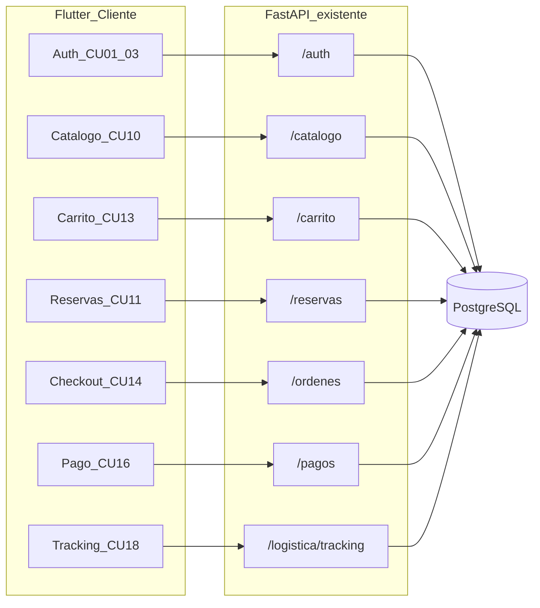

# Plan: App móvil FashionStore (solo clientes)

## Alcance (igual que el cliente en web)

La app **no** replica el panel interno. Admin, encargado, cajero, POS, inventario, proveedores y logística Kanban quedan en Angular. En móvil solo entra el actor **CLIENTE**.

| Incluido | Excluido (web staff) |
|---|---|
| CU01 login, CU02 registro, CU03 OTP | CU04 usuarios, CU05 CRUD sucursales |
| CU10 catálogo + disponibilidad | CU06–CU09 productos/temporadas/proveedores/inventario |
| CU11 reservar + mis tickets QR | CU12 tablero/escáner del encargado |
| CU13 carrito, CU14 checkout, CU16 pago | CU15 POS, CU17 config de cobros |
| CU18 **solo tracking** del pedido | Tablero Kanban de logística |

Estado actual: 5 pantallas sueltas ([login](prototipo/movil/lib/modules/auth/views/login_screen.dart), registro, OTP, catálogo, detalle). El JWT **no se guarda**. El login de prueba es de administrador. No hay carrito, reservas, checkout, pagos ni pedidos.

## 1. Backend y base de datos (ajustes mínimos)

Las tablas de Ciclo 2 ya existen (`carritos`, `reservas`, `ordenes_venta` con `canal_venta` WEB/APP/POS, `transacciones_pago`, etc.). No hay migración nueva.

Cambios puntuales en FastAPI:

- En [ordenes/services.py](prototipo/backend/app/modules/ordenes/services.py): hoy el checkout fuerza `canal_venta="WEB"`. Aceptar `canal_venta` opcional (`WEB` | `APP`) en [OrdenCreateRequest](prototipo/backend/app/modules/ordenes/schemas.py) y persistirlo. El móvil enviará `APP`.
- Nuevo `GET /api/v1/ordenes` (mis órdenes del usuario autenticado). El web no lo tiene; en móvil es necesario para “Mis pedidos” y entrar a tracking/pago pendiente. Reutilizar `construir_orden_response`.
- Gate de canal: el login sigue siendo el mismo (`POST /auth/login`). En la app, si `rol != CLIENTE`, se descarta el token y se muestra un mensaje formal: el personal usa el entorno web. No se abren rutas de staff.
- CORS ya cubre orígenes HTTP (`allow_origin_regex`). Android ya tiene `INTERNET` y `usesCleartextTraffic`.

Endpoints que el móvil **sí** usará (ya implementados):

- Auth: `/auth/login`, `/registro`, `/recuperar-password/*`, `/me`
- Catálogo: `GET /catalogo`, `GET /catalogo/{id}/disponibilidad-sucursales`
- Filtros: `GET /sucursales`, `GET /productos/categorias`, `GET /productos/marcas`, `GET /temporadas` (solo lectura)
- Carrito: `GET/POST/PATCH/DELETE /carrito...`
- Reservas cliente: `POST /reservas`, `GET /reservas/mis-reservas`, `GET /reservas/{id}`
- Checkout/pago: `POST /ordenes/checkout`, `GET /ordenes/{id}`, `POST /pagos/intencion`, `POST /pagos/confirmar`, `GET /pagos/orden/{id}`, `GET /configuracion/pagos/activos`
- Tracking: `GET /logistica/tracking/{id}` (público), `POST /logistica/calcular-tarifa` (cotización Haversine en delivery)

## 2. Infraestructura Flutter

Base URL en [api_constants.dart](prototipo/movil/lib/core/constants/api_constants.dart):

- Android emulador: `http://10.0.2.2:8000/api/v1`
- iOS/Chrome/Windows: `http://localhost:8000/api/v1`
- Override opcional con `--dart-define=API_HOST=192.168.x.x` para dispositivo físico

Dependencias: `http`, `flutter_secure_storage`, `google_fonts`, `provider`, `intl`, `qr_flutter`, `cached_network_image`, `shimmer`. **No** `mobile_scanner` (CU12). **No** Stripe nativo: el flujo usa `POST /pagos/intencion` + `POST /pagos/confirmar` con el `payment_intent_id` (mismo backend que la web; prototipo académico sin PCI en el dispositivo).

Capa HTTP única (`ApiService`): Bearer JWT, JSON, errores `detail` de FastAPI. Providers: `AuthProvider`, `CarritoProvider`.

## 3. UI: formal, sin saturación

Dirección visual (boutique, no dashboard técnico):

- Paleta: fondo `#0F1115`, superficie `#181C24`, texto `#F4F1EA`, acento único `#C4A574` (dorado mate), éxito/error discretos.
- Tipografía Outfit; mucho aire, 1 acento por pantalla, sin iconos de caso de uso en cada fila.
- Catálogo: grid 2 columnas, imagen, nombre, precio Bs., sin badges CU10.
- Navegación inferior (4 destinos): Inicio, Reservas, Bolsa (badge), Cuenta.
- Estados: skeleton shimmer, vacío (“Tu bolsa está vacía”), error de red con reintento. Sin snackbars apilados.

Shell autenticado: `MainShell` + `IndexedStack`. Invitado: catálogo + login. Tras login CLIENTE: shell completo.

## 4. Pantallas a implementar

Reescribir auth y catálogo para usar providers (el login actual no persiste token y usa `alberto.delgado@store.bo`).

**Públicas / cuenta**

- Login, registro, OTP. Hint de demo: `rodrigo.cliente@gmail.com` (rol CLIENTE del seed).
- Cuenta: nombre, email, logout, acceso a pedidos y tickets.

**Tienda**

- Catálogo: búsqueda con debounce, chips de categoría, filtro sucursal (stock).
- Detalle: colores/tallas, stock por sucursal, “Añadir a la bolsa”, “Reservar en tienda” (exige sesión).

**Transaccional**

- Bolsa: +/- limitado por `stock_maximo_disponible`, eliminar, total, ir a checkout.
- Checkout en 3 pasos: entrega (retiro vs delivery + sucursal/dirección/teléfono + cotizar tarifa) → NIT/razón social → resumen y `POST /ordenes/checkout` con `canal_venta: APP`.
- Confirmación + pago: resumen, si Stripe está activo en CU17 se crea intención y se confirma; si el canal está apagado, mensaje claro.
- Mis pedidos: lista de `GET /ordenes`; acciones Pagar / Ver seguimiento.
- Tracking: stepper 4 etapas, datos de repartidor (sin mapa saturado; dirección y estado bastan).

**Reservas**

- Crear: sucursal, fecha/hora local, prendas (desde detalle o selección simple), `POST /reservas`.
- Mis tickets: QR (`codigo_qr` Base64 o `qr_flutter` con `qr_texto`), estado, sucursal. Sin escanear (eso es encargado).

## 5. Enlace con el ciclo web

Misma sesión JWT, mismo carrito persistente en BD, mismas reservas y órdenes. Un cliente puede empezar en web y continuar en app. El staff no tiene menú en Flutter.

Rutas nombradas alineadas al web cliente: `/catalogo`, `/reservas/crear`, `/reservas/ticket`, `/checkout`, `/pagos/:id`, `/tracking/:id`.

## 6. Verificación

- `flutter analyze` sin errores.
- Flujos con backend local: login CLIENTE, rechazo de admin, catálogo, carrito ACID, reserva+QR, checkout APP, pago sandbox, tracking.
- Compilar `flutter build apk --debug` si el entorno lo permite.

No se toca Angular salvo que un contrato de API compartido lo requiera (solo el campo `canal_venta` y el listado de órdenes).
